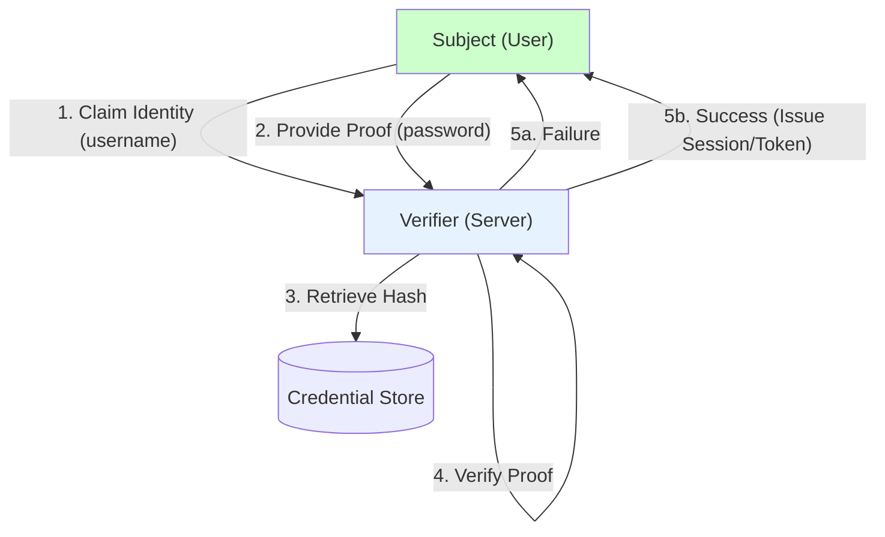
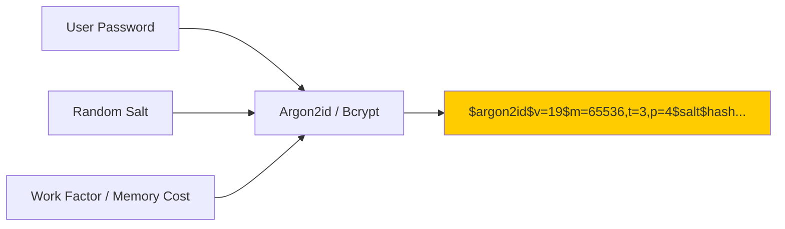
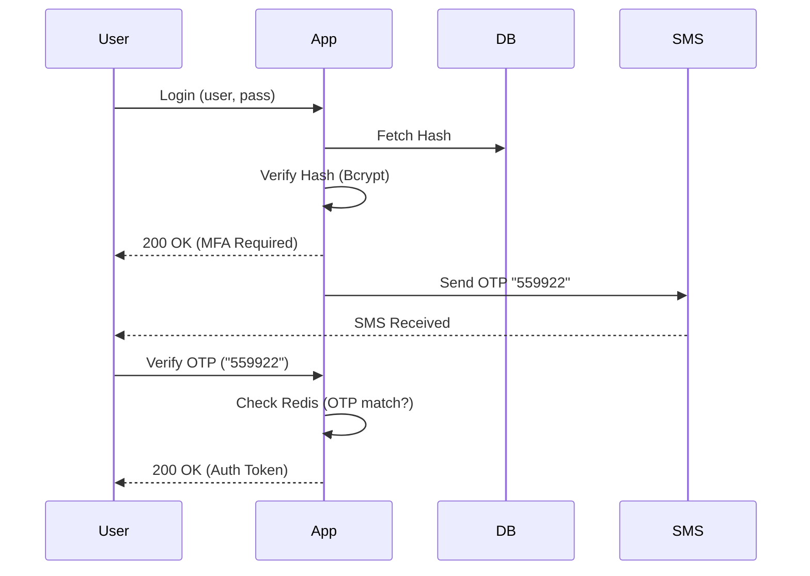
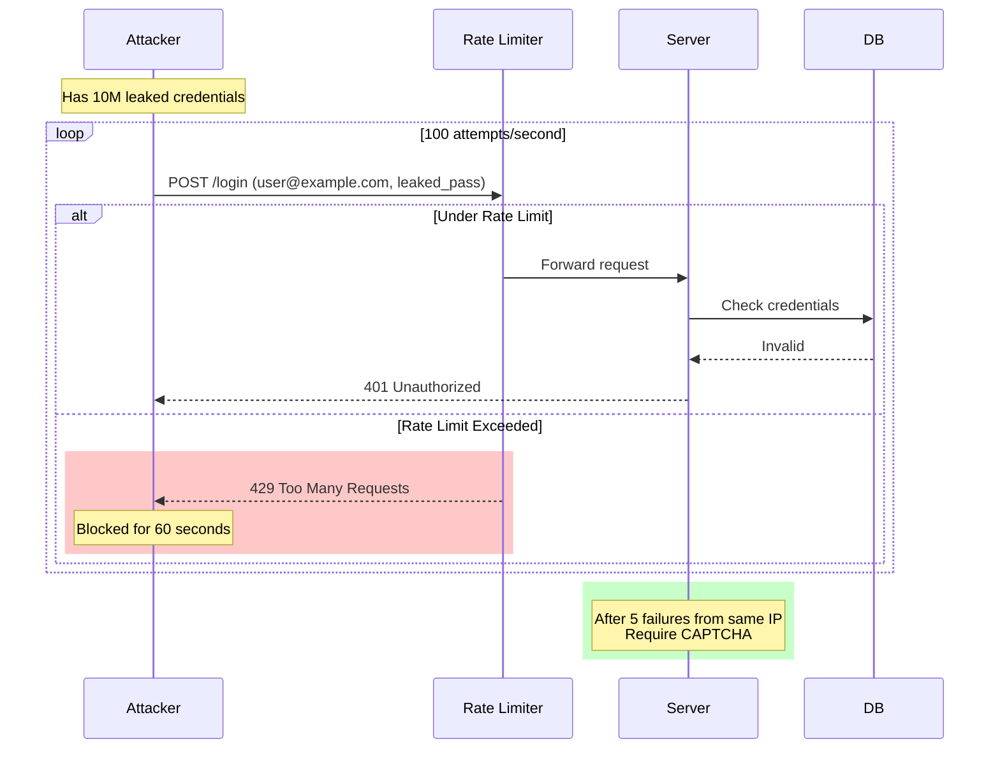
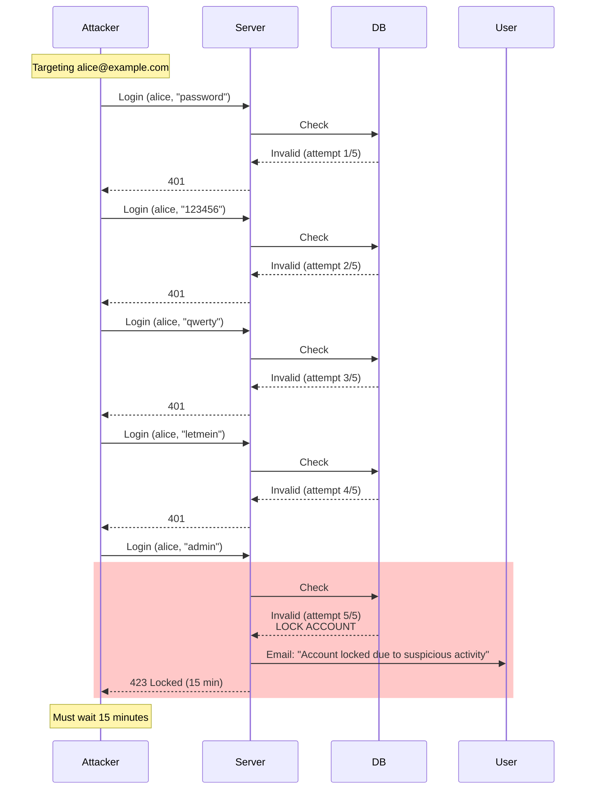
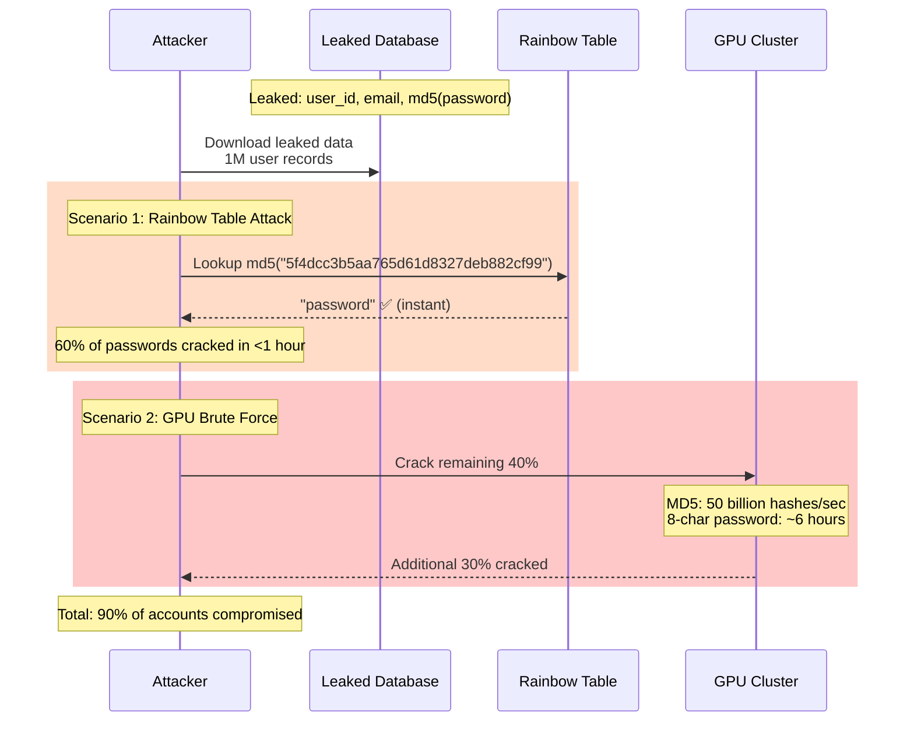

# 01. Authentication Fundamentals

## 1. Introduction

**Authentication (AuthN)** is the process of verifying *who* a user or entity is. It answers the question: "Are you who you claim to be?"

This is distinct from **Authorization (AuthZ)**, which answers: "What are you allowed to do?"

**Why It Matters**: Authentication is the front door of security. A weak authentication system compromises the entire application, regardless of how robust your authorization policies are.

**Core Principles**:
- **Identity**: The unique representation of an entity (User ID, Email).
- **Credential**: The secret used to prove identity (Password, Token, Fingerprint).
- **Session/Token**: The artifact proving authentication happened.

---

## 2. Core Architecture

The fundamental authentication loop involves a **Subject** (User), a **Verifier** (System), and a **Credential**.

### Authentication Factors

Verification relies on one or more factors:

| Factor | Concept | Examples |
| :--- | :--- | :--- |
| **Knowledge** | Something you **know** | Password, PIN, Security Question |
| **Possession** | Something you **have** | Phone (OTP), YubiKey, Smart Card |
| **Inherence** | Something you **are** | Fingerprint, FaceID, Retina Scan |

**MFA (Multi-Factor Authentication)**: Combining 2+ *different* factors.
- Password + PIN = ❌ (Both Knowledge)
- Password + OTP = ✅ (Knowledge + Possession)

---

## 3. How It Works: State Management

Once authenticated, the system must "remember" the user for subsequent requests. There are two primary models:

### A. Stateful (Session-Based)
The server keeps track of active sessions in memory or a database. The client holds a reference ID (Session ID).

*   **Pros**: easy revocation, smaller payload.
*   **Cons**: hard to scale (needs sticky sessions or central store), CSRF risk.

### B. Stateless (Token-Based)
The server issues a self-contained token (e.g., JWT) that the client holds. The token contains identity claims and a signature.

*   **Pros**: highly scalable, mobile-friendly.
*   **Cons**: hard to revoke (needs blacklisting), larger payload, XSS risk.

---

## 4. Deep Dive: Password Storage

Storing passwords securely is the most critical implementation detail.

**Evolution of Password Storage**:
1.  **Plain Text**: `password123` (Catastrophic)
2.  **Simple Hash**: `MD5(password)` (Vulnerable to Rainbow Tables)
3.  **Salted Hash**: `SHA256(password + random_salt)` (Better, but fast GPUs can brute-force)
4.  **Adaptive Hashing**: `Bcrypt(password, salt, work_factor)` (Slow by design)

**Recommended Algorithms**:
- **Argon2id**: Memory-hard and CPU-hard (Best choice)
- **Bcrypt**: CPU-hard (Good standard)
- **PBKDF2**: CPU-hard (Legacy compliance)

---

## 5. End-to-End Walkthrough: MFA Login Flow

Scenario: User logs in with Password + SMS OTP.

### Step 1: Credential Verification
- Client sends `email` + `password`.
- Server retrieves hash, verifies password.
- **Result**: Partial auth. Generate temporary `mfa_token`.

### Step 2: Second Factor Challenge
- Server generates 6-digit code `123456`.
- Server sends code via SMS provider.
- Client is prompted for code.

### Step 3: MFA Verification
- Client sends `mfa_token` + `123456`.
- Server verifies code matches and `mfa_token` is valid using Redis 2FA Store.
- **Result**: Success. Issue final `access_token` or `session_cookie`.

---

## 6. Failure Scenarios

### Scenario A: Credential Stuffing
**Symptom**: Unusual login attempts from different IPs using valid email addresses.
**Cause**: Attacker obtained email/password pairs from breaches of other services (e.g., LinkedIn, Adobe).
**Mechanism**: Automated bots try leaked credentials against your login endpoint.

**The Fix**:
- **Rate Limiting**: 5 login attempts per IP per minute
- **CAPTCHA**: Trigger after 3 failed attempts
- **Alerting**: Notify user of "New login attempt from unknown device"
- **Monitoring**: Track failed login rate (alert if >10% of total logins)

---

### Scenario B: Brute Force / Dictionary Attack
**Symptom**: Repeated login failures for same user account from single IP.
**Cause**: Attacker systematically trying common passwords against a specific account.
**Mechanism**: Iterate through dictionary of 10,000 most common passwords.

**The Fix**:
- **Progressive Delays**: 1s, 2s, 4s, 8s, 16s delay after each failure
- **Account Lockout**: Soft lock for 900s (15 min) after 5 failures
- **Strong Password Policy**: Minimum 12 characters (NIST recommendation)
- **Monitoring**: Alert security team if same account locked >3 times/day

---

### Scenario C: Weak Hashing (Database Breach)
**Symptom**: After database leak, user accounts compromised within hours.
**Cause**: Passwords hashed with MD5 (fast, no salt) instead of Argon2id/Bcrypt.
**Mechanism**: Attacker uses rainbow tables or GPU cracking to reverse hashes.

**The Fix**:
- **Use Argon2id**: Memory-hard (64MB), ~200ms per hash (vs MD5: <1μs)
- **Salt**: Unique random salt per user (prevents rainbow tables)
- **Work Factor**: Bcrypt cost=12 (~300ms) or Argon2id (m=64MB, t=3)
- **Re-hashing**: On next successful login, upgrade old MD5 → Argon2id
- **Breach Response**: Force password reset for all users immediately

---

## 7. Performance Tuning

| Parameter | Recommended | Impact |
| :--- | :--- | :--- |
| **Bcrypt Cost** | 10-12 | Cost=10: ~100ms, Cost=12: ~300ms, Cost=14: ~1.2s (Intel i7-9700K) |
| **Argon2id Memory** | 64MB | m=64MB, t=3, p=4: ~200ms per hash (GPU-resistant) |
| **Session Cache** | Redis | Lookup: <1ms p99, ~0.3ms p50 (vs DB: 10-50ms) |
| **Token Size** | < 2KB | JWT typical: 800-2000 bytes (Base64). Keep claims minimal. |
| **Rate Limit** | 5/min | 5 attempts per minute = 1 attempt every 12 seconds |
| **MFA Code TTL** | 300s | 5 minutes (balance security vs user frustration) |
| **Account Lockout** | 900s | 15 minutes soft lock (prevents permanent DoS) |

---

## 8. Constraints & Limitations

| Constraint | Limit | Why? |
| :--- | :--- | :--- |
| **Max Password Length** | 64-128 chars | Prevent DoS hashing long strings |
| **Session Lifetime** | 15 min - 14 days | Balance security vs UX |
| **MFA Code Lifetime** | 5-10 minutes | Prevent replay/guessing |
| **Rate Limits** | 5-10/min | Prevent brute forcing |

---

## 9. When to Use What?

| Requirement | Approach | Why? |
| :--- | :--- | :--- |
| **Standard Web App** | **Session (Cookie)** | Simple, secure (HttpOnly, Secure), built-in browser support. |
| **Mobile App / SPA** | **Token (JWT)** | Stateless, handles CORS better, works in native apps. |
| **Microservices** | **Token (JWT/OAuth)** | Identity propagation between services without checking DB. |
| **High Security (Banking)** | **MFA + Short Sessions** | Minimize exposure window. |
| **Internal Tools** | **SSO (OIDC)** | Centralized management via Okta/Google. |

---

## 10. Production Checklist

1.  [ ] **HTTPS Everywhere**: Never transmit credentials over HTTP.
2.  [ ] **Hash Algorithms**: Use Bcrypt work factor ≥ 10 or Argon2id.
3.  [ ] **Rate Limiting**: Implement strictly on `/login` endpoints.
4.  [ ] **MFA Support**: Enable at least TOTP (Google Authenticator) or SMS.
5.  [ ] **Secure Cookies**: Set `Secure`, `HttpOnly`, `SameSite=Strict`.
6.  [ ] **Error Messages**: Generic messages ("Invalid email or password", not "Email not found").
7.  [ ] **Logging**: Log login *attempts* and *failures*, but NEVER log passwords or tokens.
8.  [ ] **Password Policy**: Enforce minimum length (NIST recommends 8+, ideally 12+).
9.  [ ] **Lockout Strategy**: Soft lockout after N failures against a specific user.
10. [ ] **Audit**: regularly check dependencies for auth library vulnerabilities.
