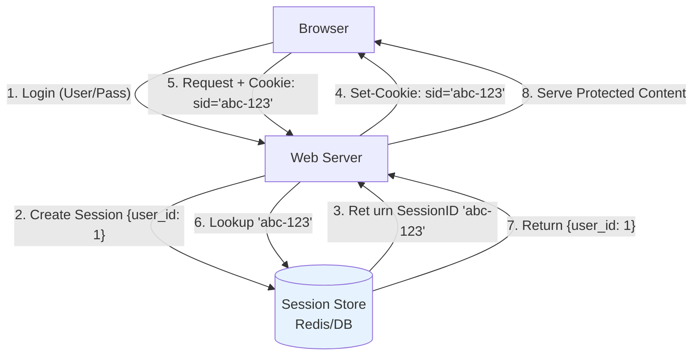
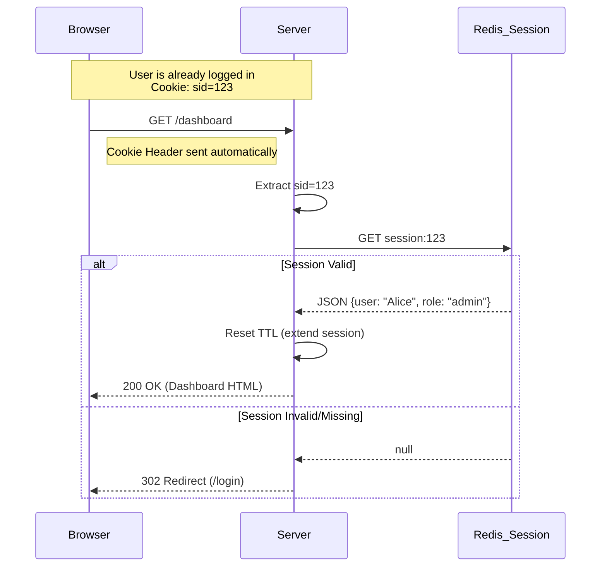
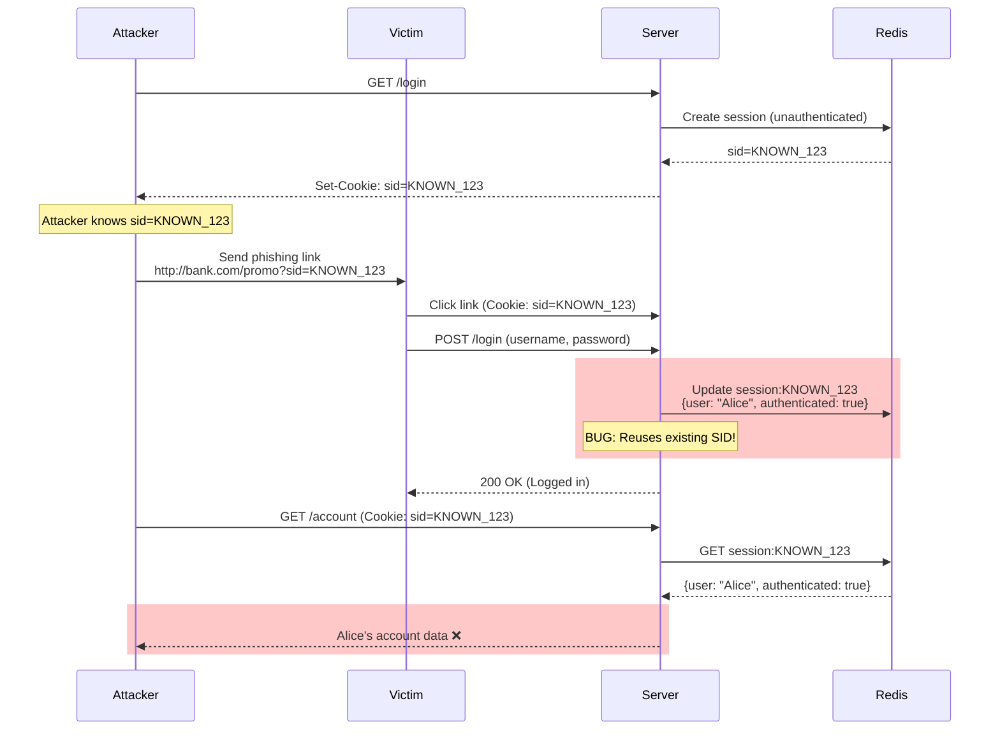
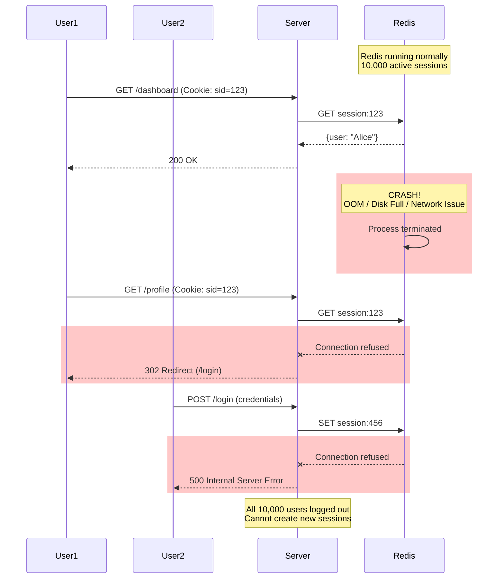

# 02. Session-Based Authentication

## 1. Introduction

**Session-Based Authentication** is the traditional, stateful method of handling user identity. The server creates and stores session data, issuing a **Session ID** (usually in a cookie) to the client. The client presents this ID with every request, and the server looks up the corresponding state.

**Key Characteristic**: **Stateful**. The server (or a central store) must allow a lookup of "Who is Session ID `xyz`?"

**Why Use It**:
- **Simplicity**: Frameworks support it out of the box.
- **Control**: Immediate revocation of sessions (e.g., "Log out all devices").
- **Security**: Cookies can be made inaccessible to JavaScript (HttpOnly).

---

## 2. Core Architecture



### Components
1.  **Session ID**: A random, high-entropy string (`sess_5928301`).
2.  **Cookie**: The transport mechanism.
3.  **Session Store**: Where data lives (Memory, Redis, SQL).

---

## 3. How It Works: The Cookie Lifecycle

### Creation
When credentials are verified:
1.  Server generates a Session ID (SID).
2.  Server stores SID + User Data + Expiry in Redis.
3.  Server sends `Set-Cookie` header.

### Usage
On subsequent requests:
1.  Browser automatically includes the Cookie.
2.  Server reads Cookie.
3.  Server verifies SID exists and hasn't expired.
4.  Server refreshes expiry (Sliding Window) if active.

### Termination
1.  **Logout**: Server deletes SID from Redis; Client clears cookie.
2.  **Timeout**: Redis sends TTL expiry; Server rejects old SID.

---

## 4. Deep Dive: Cookie Security Flags

Securing the cookie is paramount.

| Flag | Purpose | Recommended |
| :--- | :--- | :--- |
| **HttpOnly** | Prevents JS (`document.cookie`) from reading the cookie. Stops XSS theft. | **YES** (Always) |
| **Secure** | Cookie sent ONLY over HTTPS. Prevents theft on open WiFi. | **YES** (prod) |
| **SameSite** | Controls sending cookie on cross-site requests. Stops CSRF. | **Strict** or **Lax** |
| **Domain** | Limits cookie scope (`.example.com` vs `app.example.com`). | Least privilege |
| **Path** | Limits cookie to specific path (`/app`). | Usually `/` |

```http
Set-Cookie: session_id=xyz123; HttpOnly; Secure; SameSite=Lax; Path=/; Max-Age=3600
```

---

## 5. End-to-End Walkthrough: User Dashboard Access

Scenario: User accesses `/dashboard` after logging in.



---

## 6. Failure Scenarios

### Scenario A: Session Fixation
**Symptom**: User logs in successfully, but attacker can access their account.
**Cause**: Application reuses the same Session ID before and after authentication.
**Mechanism**: Attacker obtains a valid (but unauthenticated) Session ID, tricks victim into using it, then hijacks after victim logs in.



**The Fix**:
- **Regenerate SID**: Call `session.regenerate()` immediately after successful login
- **Invalidate Old**: Delete old session from Redis before creating new one
- **Bind to IP**: (Optional) Store client IP in session, reject if IP changes
- **Monitoring**: Log session ID changes for audit trail

---

### Scenario B: CSRF (Cross-Site Request Forgery)
**Symptom**: User's account performs actions they didn't initiate.
**Cause**: Browser automatically sends cookies with every request, even from malicious sites.
**Mechanism**: Attacker tricks user into submitting a form to your site while authenticated.

```mermaid
sequenceDiagram
    participant Victim
    participant Evil as evil.com
    participant Bank as bank.com
    participant Redis
    
    Note over Victim: Already logged into bank.com<br/>Cookie: sid=abc123
    
    Victim->>Evil: Visit evil.com
    
    rect rgb(255, 220, 200)
        Evil-->>Victim: HTML with hidden form:<br/><form action="bank.com/transfer"><br/>  to=attacker, amount=10000<br/></form><br/><script>form.submit()</script>
    end
    
    Victim->>Bank: POST /transfer (to=attacker, amount=10000)<br/>Cookie: sid=abc123 (sent automatically!)
    
    Bank->>Redis: GET session:abc123
    Redis-->>Bank: {user: "Alice", authenticated: true}
    
    rect rgb(255, 200, 200)
        Note over Bank: Session valid!<br/>No CSRF token check
        Bank->>Bank: Transfer $10,000 to attacker ❌
    end
    
    Bank-->>Victim: 200 OK (Transfer complete)
```



**The Fix**:
- **SameSite=Strict**: Cookie not sent on cross-site requests (breaks some OAuth flows)
- **SameSite=Lax**: Cookie sent only on top-level navigation (recommended)
- **CSRF Token**: Generate random token, embed in form, validate on submission
- **Double-Submit Cookie**: Send CSRF token as both cookie and form field, compare
- **Custom Headers**: Require `X-Requested-With: XMLHttpRequest` (SPA pattern)

---

### Scenario C: Session Store Failure
**Symptom**: All users suddenly logged out, cannot log back in.
**Cause**: Redis crashes, runs out of memory, or network partition.
**Mechanism**: Server cannot retrieve session data, treats all requests as unauthenticated.



**The Fix**:
- **Redis Sentinel**: Auto-failover to replica (30s downtime typical)
- **Redis Cluster**: Sharded, multi-master (no single point of failure)
- **Graceful Degradation**: Fallback to DB sessions (slower but available)
- **Health Checks**: Monitor Redis with `/health` endpoint, alert on failure
- **Session Persistence**: Enable Redis AOF (Append-Only File) for crash recovery
- **Capacity Planning**: Alert at 70% memory, scale before 90%

---

## 7. Performance Tuning

| Configuration | Default | Recommended | Impact |
| :--- | :--- | :--- | :--- |
| **Store Type** | In-Memory (process) | **Redis** | Process memory doesn't scale horizontally. DB is too slow (10-50ms). Redis: <1ms p99. |
| **Session Size** | - | < 4KB | Typical: 200-500 bytes. Don't store full user objects. Store ID + roles only. |
| **TTL Strategy** | Fixed | **Sliding** | Extend session on activity. Idle timeout: 1800s (30 min), Absolute: 86400s (24h). |
| **Redis Lookup** | - | - | p50: ~0.3ms, p99: <1ms (vs PostgreSQL: 10-50ms) |
| **Cookie Overhead** | - | ~100 bytes | Sent with every HTTP request. Keep session ID short (16-32 chars). |

---

## 8. Constraints & Limitations

| Constraint | Limit | Why? |
| :--- | :--- | :--- |
| **Scalability** | Medium | Server needs to do a lookup every single request. Adds latency. |
| **Mobile Apps** | Poor | Mobile HTTP stacks handle cookies poorly/differently than browsers. |
| **CORS** | Strict | Cookies don't flow easily across domains (e.g., `api.com` and `web.com` need complex setup). |

---

## 9. When to Use?

| Use Case | Verdict | Why? |
| :--- | :--- | :--- |
| **Traditional Web App (Server-Side Rendered)** | ✅ **YES** | Browser handles cookies natively. Easiest, most secure implementation. |
| **Single Page App (SPA)** | ⚠️ **CONDITIONAL** | Only if API and Front-end usually on same domain. Use HttpOnly cookie. |
| **Microservices** | ❌ **NO** | "Chatty" lookups (every service checking Redis) kills performance. Use Tokens. |
| **Mobile API** | ❌ **NO** | Use Tokens. |

---

## 10. Production Checklist

1.  [ ] **Use HttpOnly**: Ensure JavaScript cannot read the session cookie.
2.  [ ] **Use Secure**: Only transmit over HTTPS.
3.  [ ] **SameSite Enforcement**: Use `Lax` for general apps, `Strict` for high security.
4.  [ ] **Session Regeneration**: Always issue a NEW Session ID upon login and privilege escalation.
5.  [ ] **Centralized Store**: Use Redis/Memcached if running >1 server instance.
6.  [ ] **Short Idle Timeout**: Expire sessions after 15-30 mins of inactivity.
7.  [ ] **Absolute Timeout**: Force re-auth after X days regardless of activity (optional but secure).
8.  [ ] **Encrypt at Rest**: If session data contains PII, encrypt it in Redis.
9.  [ ] **Logout Handling**: Fully invalidate the session on server-side, don't just clear cookie.
10. [ ] **CSRF Protection**: If using cookies for state-changing requests, implement CSRF tokens.
