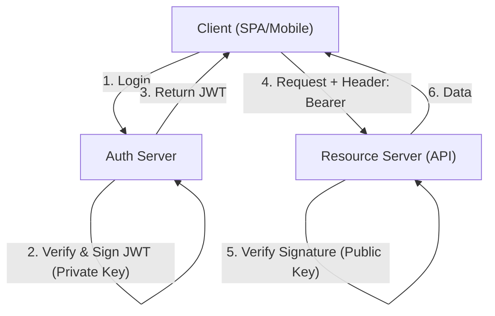
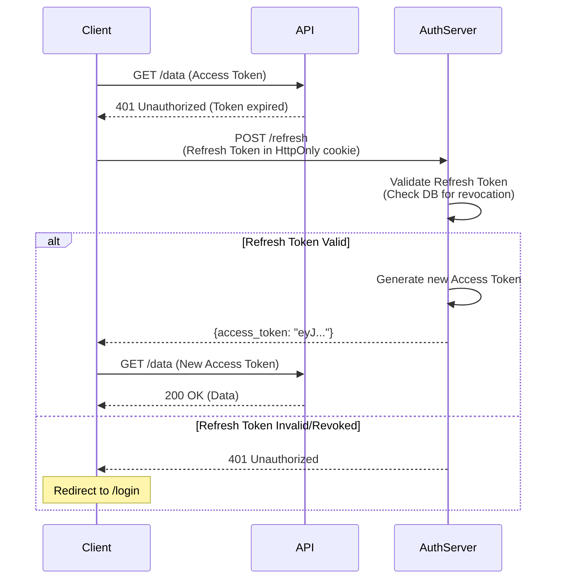
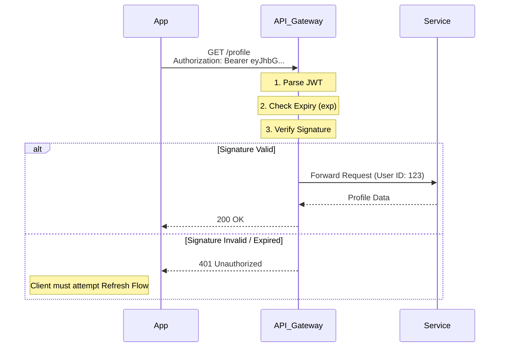
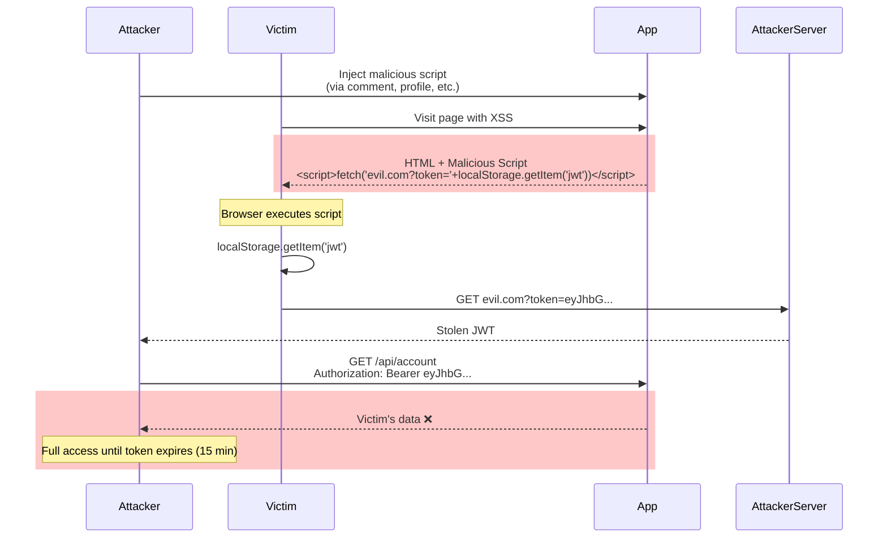
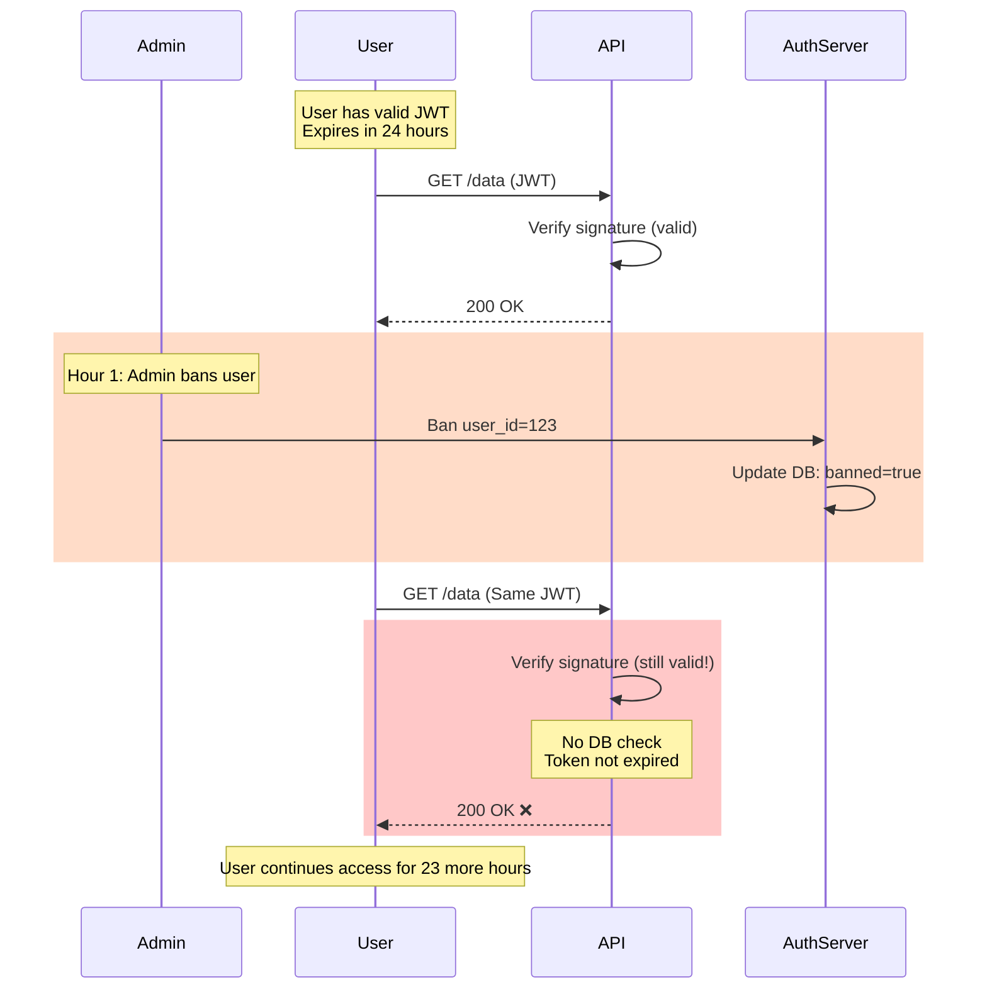
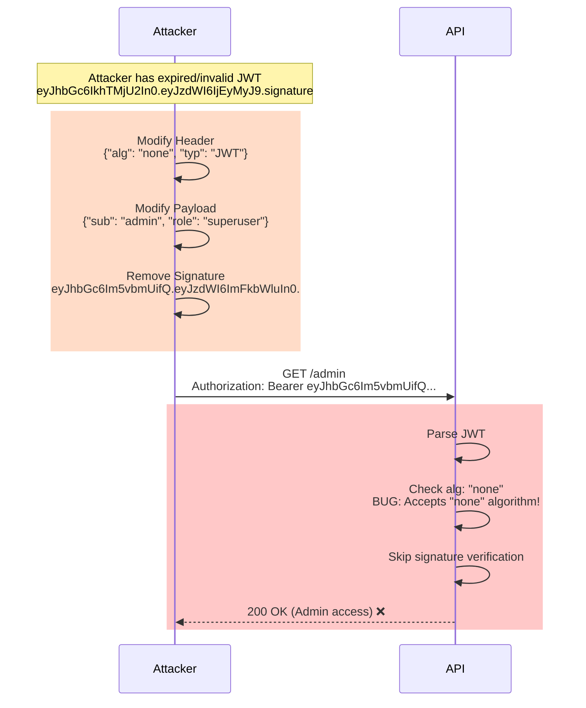

# 03. Token-Based Authentication

## 1. Introduction

**Token-Based Authentication** is a **stateless** approach where the server issues a signed token (typically a **JWT** - JSON Web Token) to the client. The client stores this token (localStorage or memory) and sends it in the `Authorization` header for subsequent requests.

**Key Characteristic**: **Stateless**. The server validates the token's signature mathematically. It does *not* need to check a database to know "who is this?". The token *is* the session.

**Why Use It**:
- **Scalability**: No session store lookup required.
- **Cross-Domain**: Works easily across different domains (CORS friendly).
- **Mobile/API**: Standard for modern mobile apps and REST/GraphQL APIs.

---

## 2. Core Architecture



### Components
1.  **Access Token (JWT)**: Short-lived, contains claims (user_id, roles). Used to access resources.
2.  **Refresh Token**: Long-lived, opaque string. Used to get new Access Tokens.
3.  **Signing Key**: Secret (HMAC) or Private Key (RSA/ECDSA) used to sign tokens.

---

## 3. How It Works: The JWT Structure

A JSON Web Token consists of three parts separated by dots: `Header.Payload.Signature`.

```mermaid
graph LR
    subgraph JWT["JWT Token Structure"]
        H["Header<br/>{alg: HS256, typ: JWT}<br/>(Base64)"]
        P["Payload<br/>{sub: 123, role: admin, exp: ...}<br/>(Base64)"]
        S["Signature<br/>HMAC-SHA256(...)<br/>(Base64)"]
    end
    
    H -.->|"."|  P
    P -.->|"."|  S
    
    Result["eyJhbGc...  .  eyJzdWI...  .  SflKxw..."]
    JWT --> Result
    
    style H fill:#e6f3ff
    style P fill:#fff3cd
    style S fill:#ccffcc
```

1.  **Header**: Algorithm & Type.
    ```json
    { "alg": "HS256", "typ": "JWT" }
    ```
2.  **Payload (Claims)**: Data using standard (iss, exp, sub) or custom fields.
    ```json
    { "sub": "123", "role": "admin", "exp": 1716239022 }
    ```
    *Note: This is Base64 encoded, NOT encrypted. Anyone can read it.*
3.  **Signature**: Verifies integrity.
    `HMACSHA256(base64(header) + "." + base64(payload), secret)`

### The Refresh Flow



Since JWTs are stateless, we can't easily revoke them. Limitation: Short lifespans (e.g., 15 min).
To keep user logged in:
1.  Access Token expires (401 Unauthorized).
2.  Client sends **Refresh Token** to Auth Server.
3.  Auth Server checks DB (Refresh token *is* stateful/revocable).
4.  Auth Server issues new Access Token.

---

## 4. Deep Dive: Storage Options

Where should the frontend store the token?

| Storage | XSS Vulnerable? | CSRF Vulnerable? | Recommendation |
| :--- | :--- | :--- | :--- |
| **LocalStorage** | **YES** (JS can read it) | No (Header auth) | ⚠️ Common but risky. Okay for low stakes. |
| **HttpOnly Cookie** | No (JS can't read) | **YES** (Auto-sent) | ✅ Safer, but requires CSRF protection. |
| **In-Memory** | No | No | ✅ Safest. Token lost on refresh. Use silent refresh via cookie to restore. |

**Best Practice**: Store **Refresh Token** in an `HttpOnly` cookie and the **Access Token** in memory (JavaScript variable).

---

## 5. End-to-End Walkthrough: API Request

Scenario: Mobile app fetching user profile.



---

## 6. Failure Scenarios

### Scenario A: Token Theft (XSS)
**Symptom**: Attacker gains unauthorized access to user account.
**Cause**: Malicious JavaScript injected into page reads token from localStorage.
**Mechanism**: XSS vulnerability allows attacker to execute arbitrary JavaScript.



**The Fix**:
- **HttpOnly Cookies**: Store tokens where JS cannot access
- **Content Security Policy**: `Content-Security-Policy: script-src 'self'`
- **Input Sanitization**: Escape all user-generated content
- **In-Memory Storage**: Store access token in JS variable (lost on refresh)
- **Short Expiry**: 900s (15 min) limits damage window

---

### Scenario B: The "Forever" Token (Revocation Problem)
**Symptom**: Banned user continues accessing API for hours.
**Cause**: JWT validation is purely mathematical (no DB check).
**Mechanism**: Once issued, token is valid until expiry regardless of user status changes.



**The Fix**:
- **Short Access Tokens**: 900s (15 min) instead of 86400s (24h)
- **Refresh Token Revocation**: Check DB during refresh (stateful step)
- **Token Blacklist**: Maintain Redis set of revoked JTIs (defeats stateless benefit)
- **Version Claims**: Include `token_version` in JWT, increment on ban
- **Hybrid Approach**: Cache user status in API gateway (5-min TTL)

---

### Scenario C: Algorithm Confusion ("none" Algorithm)
**Symptom**: Unsigned tokens accepted as valid.
**Cause**: Server doesn't validate the `alg` field in JWT header.
**Mechanism**: Attacker changes algorithm to "none" and removes signature.



**The Fix**:
- **Whitelist Algorithms**: `if (alg !== 'RS256') throw Error('Invalid algorithm')`
- **Reject "none"**: Explicitly check `if (alg === 'none') throw Error()`
- **Library Configuration**: Use strict mode in JWT libraries
- **Code Review**: Never use `verify(token, null)` or similar patterns
- **Testing**: Add security tests for algorithm confusion attacks

---

## 7. Performance Tuning

| Configuration | Default | Recommended | Impact |
| :--- | :--- | :--- | :--- |
| **Algorithm** | HS256 | **RS256** (RSA) | RS256: ~0.5ms verification. Auth Server signs (Private), APIs verify (Public). |
| **Token Size** | - | 800-2000 bytes | Typical JWT (Base64): 1.2KB. Large tokens = bandwidth cost on every request. |
| **Access Expiry** | 60m | **900s (15m)** | Shorter window of vulnerability if stolen. Balance with refresh frequency. |
| **Refresh Expiry** | 30d | **604800s (7d)** | Sliding window. Balance between security and UX. |
| **HS256 Verification** | - | ~0.1ms | Fast but requires shared secret across all services. |
| **RS256 Verification** | - | ~0.5ms | Slightly slower but better security model (public key distribution). |

---

## 8. Constraints & Limitations

| Constraint | Limit | Why? |
| :--- | :--- | :--- |
| **Revocation** | Impossible | By design. To revoke immediately, you must introduce state (blacklist), defeating the purpose. |
| **Payload Size** | ~8KB (Header limit) | Servers reject large headers. Don't put permissions lists in JWT. |
| **Visibility** | Public | Do NOT put PII (email, SSN) in payload unless encrypted (JWE). |

---

## 9. When to Use?

| Use Case | Verdict | Why? |
| :--- | :--- | :--- |
| **Microservices** | ✅ **BEST CHOICE** | Services verify tokens (CPU only) without pounding a central Login DB. |
| **Mobile Apps** | ✅ **YES** | Easy to handle headers. Persistent login via Refresh Tokens. |
| **Public APIs** | ✅ **YES** | Standard way developers consume APIs. |
| **Simple Monolith** | ❌ **NO** | Session/Cookie covers this better and is more secure by default. |

---

## 10. Production Checklist

1.  [ ] **HTTPS Only**: Tokens are equivalent to passwords. Encrypt the transport.
2.  [ ] **Strong Secret**: If using HS256, secret must be 32+ random characters.
3.  [ ] **Validate Algorithm**: Whitelist allowed algorithms (e.g., only `RS256`).
4.  [ ] **Verify Audience (aud)**: Ensure token was meant for *your* API.
5.  [ ] **Verify Issuer (iss)**: Ensure token came from a trusted Auth Server.
6.  [ ] **Short Access Tokens**: Keep them < 15 minutes.
7.  [ ] **Secure Refresh Storage**: Ideally HttpOnly cookies with `path=/refresh`.
8.  [ ] **Logging**: Never log the token string.
9.  [ ] **JTI Check**: (Optional) Use JWT ID to prevent replay if creating one-time tokens.
10. [ ] **Library**: Use a mature JWT library, don't write your own crypto/verification logic.
