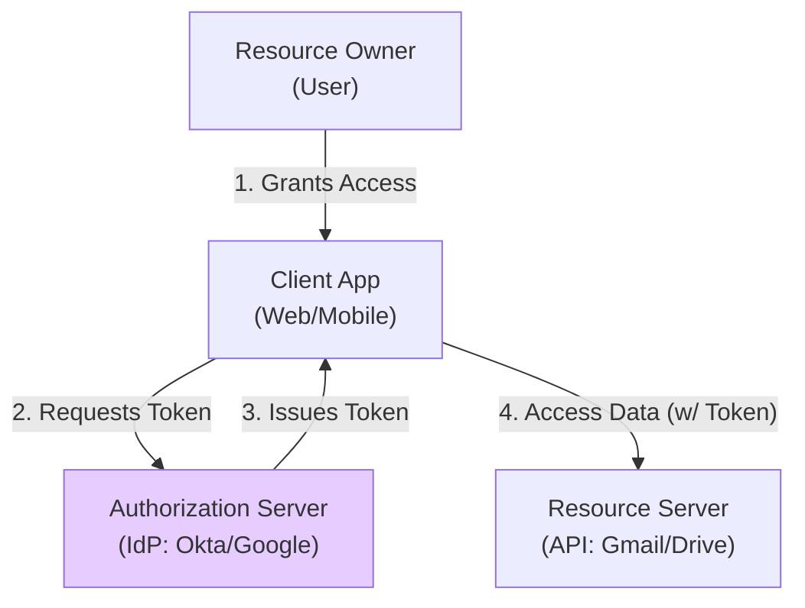
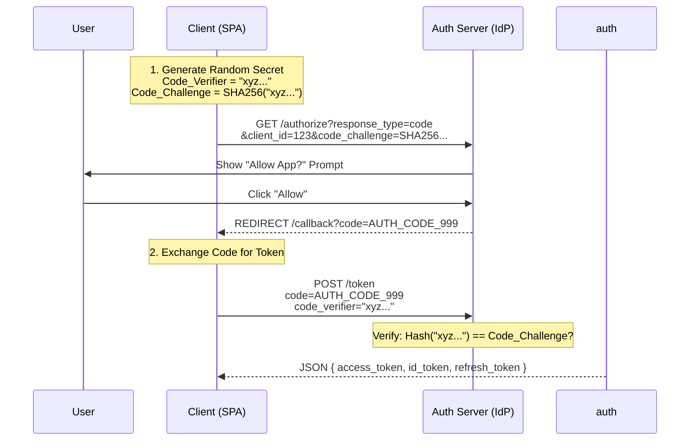
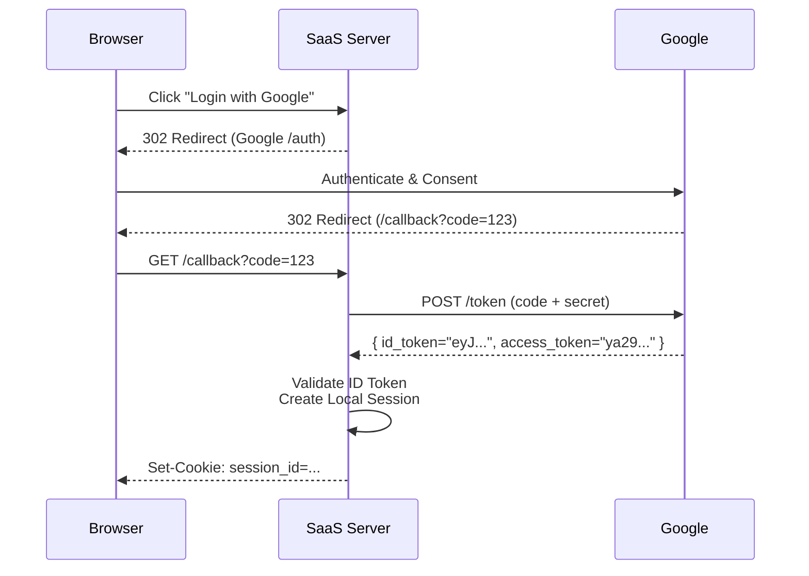
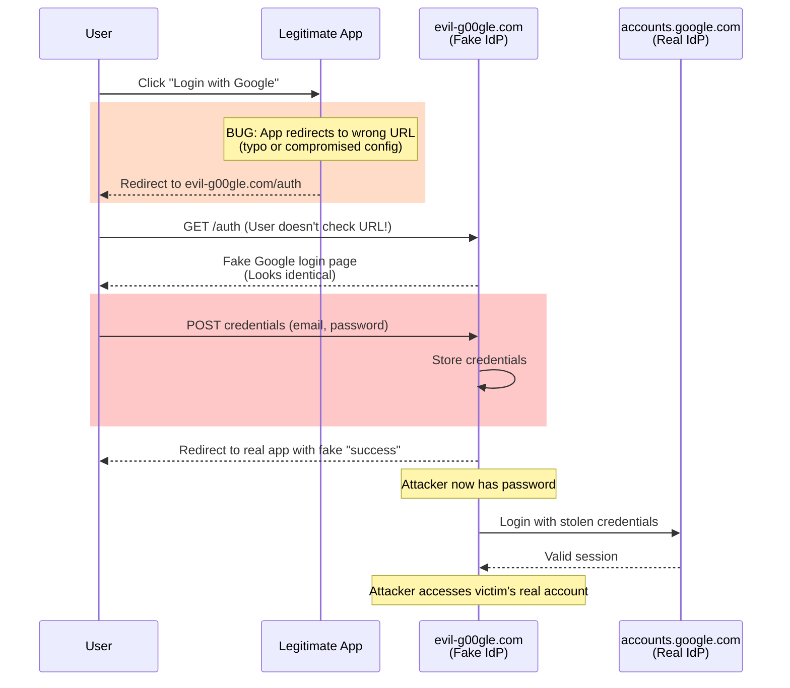
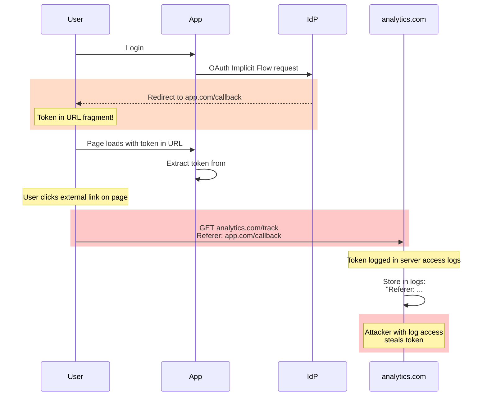

# 04. OAuth 2.0 & OpenID Connect (OIDC)

## 1. Introduction

**OAuth 2.0** is the industry-standard protocol for **authorization** (delegated access). It lets a user grant a third-party application access to their resources without sharing their password.

**OpenID Connect (OIDC)** is an identity layer built *on top* of OAuth 2.0. It adds **authentication** (verifying who the user is).

**Metaphor**:
- **OAuth 2.0**: Giving a Valet key to your car. The key can *drive* the car (limited access) but cannot open the trunk (restricted). The Valet doesn't need your master key (password).
- **OIDC**: A badge on the Valet's chest saying "I am valet #123".

**Why Use It**:
- **Delegation**: "Log in with localized-service" (Don't create new passwords).
- **Ecosystem**: Standard way to secure APIs across Web, Mobile, and Microservices.

---

## 2. Core Architecture

The OAuth 2.0 ecosystem involves four primary roles.

### Components
1.  **Resource Owner**: The User who owns data.
2.  **Client**: The application trying to access data.
3.  **Authorization Server (AS)**: The system that issues tokens (e.g., Google, Auth0).
4.  **Resource Server (RS)**: The API hosting the data.

### Artifacts (Tokens)
-   **Access Token**: Key to access the API (Opaque or JWT).
-   **Refresh Token**: Key to get new Access Tokens.
-   **ID Token (OIDC)**: Proof of user identity (JWT). **ONLY for the Client, NOT for the API.**

---

## 3. How It Works: The Standards Flows

Different clients need different flows.

| Flow | Best For | Security |
| :--- | :--- | :--- |
| **Authorization Code** | Web Apps (Server-side) | ⭐⭐⭐⭐⭐ (Best) |
| **Auth Code + PKCE** | SPAs / Mobile (Public Clients) | ⭐⭐⭐⭐⭐ (Standard) |
| **Client Credentials** | Machine-to-Machine (Cron Jobs) | ⭐⭐⭐ (No User) |
| **Implicit** | Legacy SPAs | ❌ **DEPRECATED** |
| **Password Grant** | Legacy | ❌ **DEPRECATED** |

---

## 4. Deep Dive: Authorization Code Flow with PKCE

**PKCE** (Proof Key for Code Exchange) prevents "Code Interception" attacks on public clients (Mobile/SPA) that cannot store a client secret safely.

**Why it's secure**: Even if an attacker steals the `AUTH_CODE`, they cannot exchange it for a token because they don't know the `code_verifier` (which never left the client's memory).

---

## 5. End-to-End Walkthrough: "Log in with Google" (OIDC)

Scenario: User logs into a generic SaaS app using Google.

### Step 1: Redirect to Provider
User clicks "Login". Component constructs URL:
`https://accounts.google.com/o/oauth2/v2/auth?scope=openid email profile...`

### Step 2: User Consents
Google checks if user is logged in. If not, prompts for password. Then asks: "Allow SaaS App to view email?"

### Step 3: Callback
Google redirects to `https://saas-app.com/callback?code=ab123`.

### Step 4: Token Exchange (Back-Channel)
SaaS Server sends Code + Client Secret to Google.
Google returns:
- **ID Token**: "This is Alice (alice@gmail.com)"
- **Access Token**: "You can call Google Contacts API"

### Step 5: Validation
SaaS Server verifies ID Token signature (JWT).
SaaS Server creates a local **Session** for Alice.

---

## 6. Failure Scenarios

### Scenario A: Phishing (Fake Login Page)
**Symptom**: User credentials stolen despite using OAuth.
**Cause**: Attacker creates convincing fake login page mimicking Google/IdP.
**Mechanism**: User doesn't verify URL, enters credentials on attacker's site.

**The Fix**:
- **Verify Redirect URI**: App must validate OAuth provider URL before redirect
- **User Education**: Train users to check address bar (https://accounts.google.com)
- **Nonce Validation**: Include `nonce` in auth request, verify in ID token
- **State Parameter**: Verify `state` matches to prevent CSRF in OAuth flow
- **Domain Allowlist**: Only allow known IdP domains in OAuth config

---

### Scenario B: Token Leaking via Referrer Header
**Symptom**: Access tokens exposed in third-party server logs.
**Cause**: Using deprecated Implicit Flow with tokens in URL fragment.
**Mechanism**: Browser sends Referrer header containing token when user clicks external link.

**The Fix**:
- **Use Authorization Code Flow**: Tokens exchanged server-side (never in URL)
- **Use PKCE**: Secure public clients without client secret
- **Referrer-Policy**: Set `Referrer-Policy: no-referrer` header
- **Never Implicit Flow**: Deprecated in OAuth 2.1 (security risk)
- **Token in Body**: Always receive tokens in JSON response body, not URL

---

### Scenario C: Rogue Application (Scope Abuse)
**Symptom**: Third-party app accesses more data than necessary.
**Cause**: User grants overly broad scopes without understanding implications.
**Mechanism**: App requests `gmail.readonly` when only `email` needed.

**The Fix**:
- **Least Privilege Scopes**: Request minimum needed (`email` vs `gmail.readonly`)
- **Scope Review**: Show clear explanation of what each scope allows
- **Incremental Authorization**: Request additional scopes only when needed
- **Audit**: Regularly review granted scopes in user's account settings

---

## 7. Performance Tuning

| Configuration | Default | Recommended | Impact |
| :--- | :--- | :--- | :--- |
| **Token Validation** | Remote | **Local** | Don't call `/introspect` on every request. Validate JWT locally: ~0.5ms vs 50-200ms. |
| **Key Caching** | - | **Cache JWKS** | Cache IdP's public keys for 86400s (24h). Fetch: ~100ms, Cache hit: <1ms. |
| **Scope Size** | - | Minimal | Large scopes = larger tokens. Keep under 5 scopes typical. |
| **Auth Code Lifetime** | - | 60-600s | Short-lived (60s recommended). Prevents replay if intercepted. |
| **PKCE Computation** | - | <1ms | SHA256 hash of code_verifier. Negligible overhead. |
| **Token Endpoint** | - | 50-200ms | IdP response time. Cache tokens, don't request on every page load. |

---

## 8. Constraints & Limitations

| Constraint | Limit | Why? |
| :--- | :--- | :--- |
| **Redirect URI** | Exact Match | Security. Must pre-register `https://app.com/cb`. Prevents redirecting codes to attackers. |
| **Token Size** | 4-8KB | JWTs with many scopes/groups get huge. May exceed header limits. |
| **Complexity** | High | Implementing the handshake correctly is hard. Use libraries (Passport.js, Spring Security). |

---

## 9. When to Use?

| Scenario | Flow | Why? |
| :--- | :--- | :--- |
| **Server-Side Web App** | Authorization Code | Can safely store Client Secret. |
| **SPA / Mobile App** | Auth Code + PKCE | Cannot store secret. PKCE secures the code exchange. |
| **Microservice-to-Microservice** | Client Credentials | No user involved. Service authenticates itself. |
| **Smart TV / IoT** | Device Flow | Device displays code, user authorizes on phone. |
| **Simple API Testing** | Personal Access Token | Developer convenience (like GitHub PAT). |

---

## 10. Production Checklist

1.  [ ] **Always use PKCE**: Enable it for ALL flows (even server-side), it's just safer.
2.  [ ] **State Parameter**: Always send a random `state` value to prevent CSRF in the login flow.
3.  [ ] **Strict Redirect URIs**: Never allow wildcards (`*.example.com`) in OAuth provider config.
4.  [ ] **Validate JWTs**: Check Signature, Expiry, Issuer, Audience.
5.  [ ] **Least Privilege scopes**: Don't ask for `profile` if you only need `email`.
6.  [ ] **Secure Storage**: Same rules as Token Auth (HttpOnly cookies or memory).
7.  [ ] **Rotate Secrets**: Plan for Client Secret rotation.
8.  [ ] **Error Handling**: Handle "Access Denied" (user clicked Cancel) gracefully.
9.  [ ] **Use Libraries**: Never manually parse URL parameters or build redirect strings. Use a certified SDK.
10. [ ] **JWKS Caching**: Ensure your API caches the IdP's signing keys to avoid latency/rate-limits.
