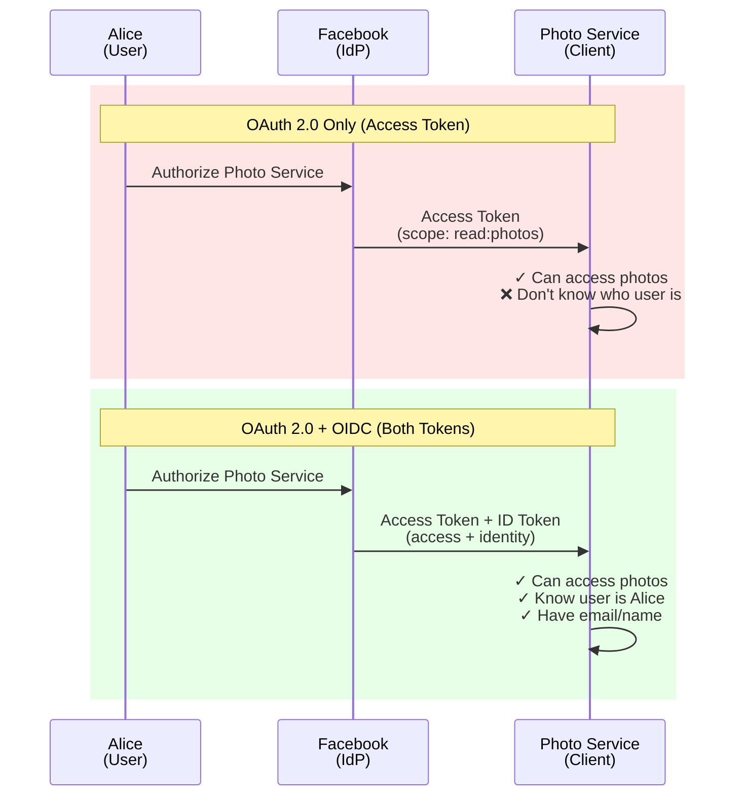
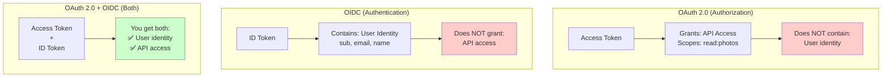
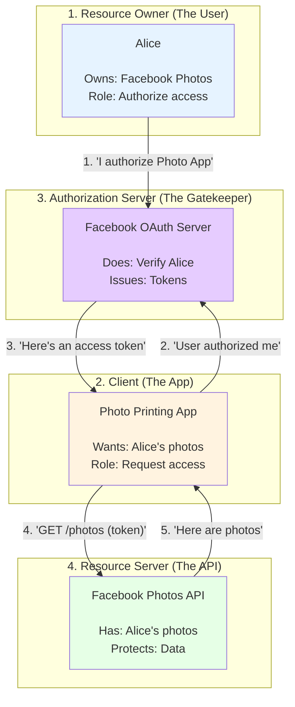
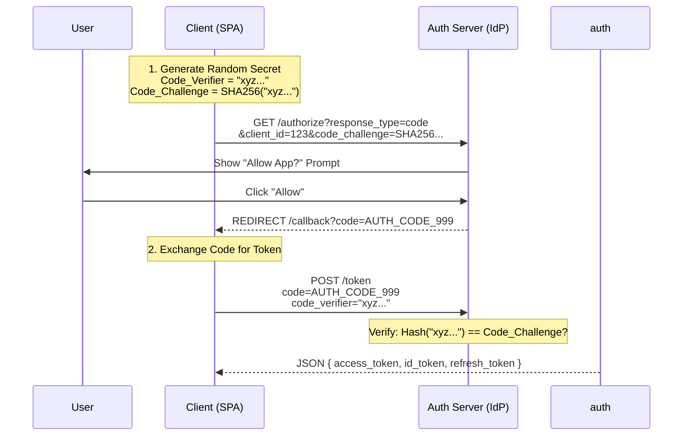
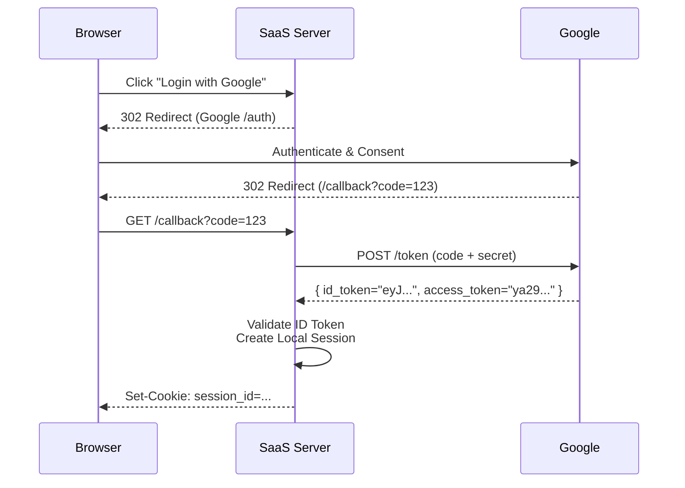
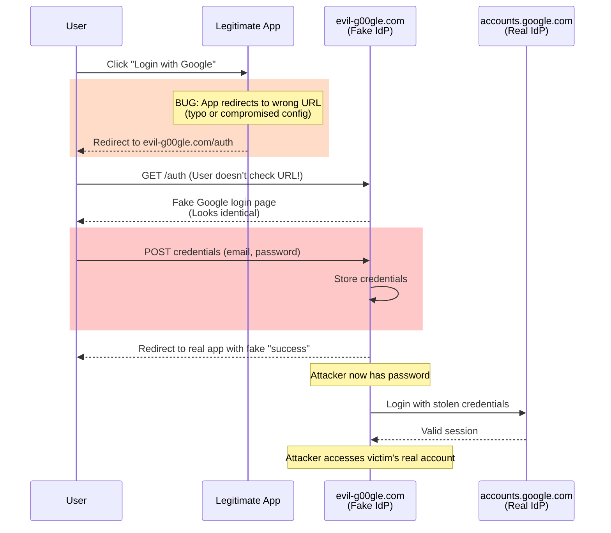
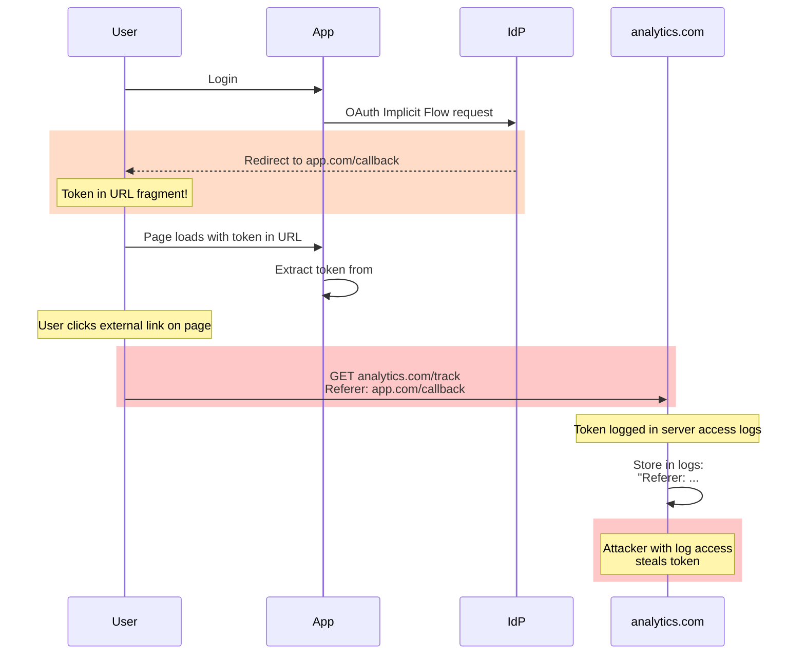

# 04. OAuth 2.0 & OpenID Connect (OIDC)

## 1. Introduction: The Delegation Problem

### The Fundamental Problem

Imagine this scenario:

**You want a photo printing service to print your Facebook photos.**

**Naive approach:**
```
You: "Here are my Facebook credentials"
Photo Service: "Thanks! I'll log into Facebook as you"
```

**Problems with this:**
- ❌ Photo service now has your Facebook password
- ❌ They can access ALL your Facebook data (messages, friends, etc.)
- ❌ They can access it FOREVER (you can't revoke without changing password)
- ❌ If photo service is hacked, your password is stolen
- ❌ You must trust them completely

**We need a better way:** Give limited, revocable access without sharing passwords.

---

### OAuth 2.0: The Solution to Delegation

**OAuth 2.0** is a protocol for **delegated authorization**. It allows users to grant third-party applications **limited access** to their resources **without sharing passwords**.

**Real-World Analogy: Hotel Key Card**

```
Traditional Approach (Password Sharing):
  Guest: "Here's my master key"
  Cleaning Service: "Thanks, now I can access your room anytime, forever"
  
OAuth Approach (Delegated Access):
  Guest: "Here's a temporary key card"
  Cleaning Service: "I can clean your room"
  
  Key card properties:
  ✅ Limited access (only your room, not safe)
  ✅ Time-limited (expires after checkout)
  ✅ Revocable (can be deactivated anytime)
  ✅ Doesn't reveal master key
```

**OAuth tokens work the same way:**
- **Limited scope**: Access only photos, not messages
- **Time-limited**: Expires in 1 hour
- **Revocable**: User can revoke anytime
- **No password exposed**: Service never sees your Facebook password

---

### OpenID Connect (OIDC): Adding Identity

**OAuth 2.0 problem:** It only handles *authorization* (what you can access), not *authentication* (who you are).

Let's see this with a concrete example:

**The Three Actors:**
1. **Alice** (User) - Owns Facebook photos
2. **Facebook** (Identity Provider / IdP) - Stores Alice's data
3. **Photo Printing Service** (Client) - Wants to print Alice's photos

---

**Scenario: OAuth 2.0 Access Token Only (Without OIDC)**

**Step 1: Alice Authorizes**
```
Alice: "I want to print my Facebook photos"
       ↓
Photo Service: "Redirect to Facebook for authorization"
       ↓
Facebook: "Alice, Photo Service wants to access your photos. Allow?"
       ↓
Alice: [clicks "Allow"]
```

**Step 2: Facebook Issues Access Token**
```json
// Facebook → Photo Service
{
  "access_token": "fb_token_abc123",
  "scope": "read:photos",
  "user_id": "12345678"  // Just Facebook's internal ID
  // ❌ NO email
  // ❌ NO name
  // ❌ NO profile info
}
```

**Step 3: Photo Service's Problem**
```javascript
// Photo Service can access photos
GET /me/photos
Authorization: Bearer fb_token_abc123
// ✓ Works! Gets photos

// But then Photo Service needs to:
function sendInvoiceEmail() {
  const userEmail = ???  // ❌ Don't have this!
  sendEmail(userEmail, "Invoice for your prints")
}

function printNameOnPackage() {
  const userName = ???  // ❌ Don't have this!
  return `Package for: ${userName}`
}
```

**The Problem:**
```
Photo Service knows:
  ✅ I can access someone's photos (scope granted)
  ✅ I have user_id "12345678" (opaque identifier)
  ❌ Who is this user? (no email)
  ❌ What's their name? (no name)
  ❌ How do I contact them? (no contact info)
```

---

**OIDC Solution: OAuth 2.0 + ID Token**

**Same Step 1: Alice Authorizes** (unchanged)

**Step 2: Facebook Issues TWO Tokens**
```json
// Facebook → Photo Service
{
  // Access Token (for API access - same as before)
  "access_token": "fb_token_abc123",
  "scope": "read:photos",
  
  // ID Token (for identity - THIS IS NEW!)
  "id_token": "eyJhbGciOiJSUzI1NiIsInR5cCI6IkpXVCJ9..."
}
```

**ID Token Decoded:**
```json
{
  "iss": "https://facebook.com",
  "sub": "12345678",
  "email": "alice@gmail.com",        // ✓ Now have email!
  "name": "Alice Smith",             // ✓ Now have name!
  "picture": "https://fb.com/...",   // ✓ Profile picture
  "email_verified": true
}
```

**Step 3: Photo Service Now Has Identity**
```javascript
// Verify and extract identity from ID Token
const claims = jwt.verify(response.id_token, facebookPublicKey)

// Create user account
db.users.create({
  email: claims.email,      // "alice@gmail.com"
  name: claims.name,        // "Alice Smith"
  facebookId: claims.sub    // "12345678"
})

// Now everything works!
function sendInvoiceEmail() {
  sendEmail(claims.email, "Invoice for your prints")  // ✓ Works!
}

function printNameOnPackage() {
  return `Package for: ${claims.name}`  // ✓ "Package for: Alice Smith"
}
```

**Photo Service now knows:**
```
✅ Can access Alice's photos (Access Token)
✅ User is Alice Smith (ID Token)
✅ Email: alice@gmail.com (ID Token)
✅ Can send invoice and contact user
```

---

**Visual Comparison:**



---

**Analogy: Valet Parking**

```
OAuth 2.0 = Valet Key
  - Can drive the car (limited access)
  - Cannot open trunk (restricted scope)
  - Doesn't identify the valet
  
OIDC = Valet Key + Badge
  - Can drive the car (OAuth scope)
  - Badge says "I am Valet #123" (identity)
  - You know WHO has your car
```

---

### Authorization vs Authentication (Critical Distinction)

This is the most commonly confused concept in OAuth:

**Authorization:** "What can you do?"
```javascript
// Access Token (OAuth 2.0)
{
  "scope": "read:photos write:comments",
  "client_id": "photo-printing-app"
}

// This says:
// ✅ You can READ photos
// ✅ You can WRITE comments
// ❌ Does NOT say WHO you are
```

**Authentication:** "Who are you?"
```javascript
// ID Token (OIDC)
{
  "sub": "user123",
  "email": "alice@gmail.com",
  "name": "Alice Smith",
  "email_verified": true
}

// This says:
// ✅ You are Alice
// ✅ Your email is verified
// ❌ Does NOT grant API access
```

**Visual Comparison:**



---

### Why Use OAuth 2.0 & OIDC?

**OAuth 2.0 Benefits:**
- ✅ **No password sharing**: Third parties never see user passwords
- ✅ **Limited scopes**: Grant only needed permissions (read photos, not messages)
- ✅ **Revocable**: User can revoke access anytime without changing password
- ✅ **Industry standard**: Works with Google, Facebook, GitHub, Microsoft, etc.
- ✅ **Token-based**: Works for web, mobile, APIs

**OIDC Benefits (on top of OAuth):**
- ✅ **"Login with Google"**: Single Sign-On across services
- ✅ **Identity verification**: Know who the user is
- ✅ **Standardized claims**: email, name, profile picture
- ✅ **Built on JWT**: Cryptographically signed identity

---

### Common Use Cases

**Use Case 1: "Login with Google"**
```
User: "I want to log into SaaS app"
App: "Let Google verify who you are"
Google: "This is Alice (alice@gmail.com)"
App: "Welcome, Alice!" (creates local session)

Protocol: OIDC (authentication)
Token: ID Token
```

**Use Case 2: "Grant Photo Access"**
```
User: "I want to print my Facebook photos"
Photo Service: "Let me access your photos"
Facebook: "Here's a token for photo access"
Photo Service: GET /api/photos (with token)

Protocol: OAuth 2.0 (authorization)
Token: Access Token
```

**Use Case 3: "Login + Access Data"**
```
User: "Use Google Drive integration"
App: "Who are you + access your Drive"
Google: "This is Alice + here's Drive access"
App: "Welcome Alice, syncing your files..."

Protocol: OAuth 2.0 + OIDC (both)
Tokens: ID Token + Access Token
```

---

### What Problem Does This Solve?

**Before OAuth (2000s):**
```
User → [gives password] → Third-party app
                          ↓
                    Logs in as user
                    Full access forever
                    No audit trail
                    Security nightmare
```

**After OAuth (2010s+):**
```
User → [authorizes limited access] → Third-party app
                                     ↓
                              Gets scoped token
                              Limited permissions
                              Time-limited
                              Revocable
                              Auditable
```

**Real-world impact:**
- Gmail no longer needs your password to integrate with calendar apps
- Mobile apps can access Twitter without storing passwords
- Enterprise apps can integrate with Microsoft 365 safely
- Users control exactly what each app can access

---

## 2. Core Architecture: The Four Roles

OAuth 2.0 defines four distinct roles in the authorization flow. Understanding these is critical to understanding how OAuth works.

### The Four Roles Explained



---

### Role 1: Resource Owner (The User)

**Who:** The person who owns the data (you, the Facebook user).

**What they do:**
- Own the resource (photos, emails, calendar)
- Grant or deny access to third-party apps
- Can revoke access anytime

**Real example:**
```
Alice owns her Facebook photos.
Photo Printing service asks for access.
Alice clicks "Allow" → Resource Owner authorizing access.
```

**Key point:** The Resource Owner is the ONLY one who can grant permission. Not the app, not Facebook - only the user.

---

### Role 2: Client (The Third-Party Application)

**Who:** The application requesting access to user data (Photo Printing App, Calendar Sync App, etc.).

**Types of Clients:**

**Confidential Clients:**
- Can securely store secrets (server-side apps)
- Examples: Traditional web apps with backend
- Use: Authorization Code flow

**Public Clients:**
- Cannot securely store secrets (user devices)
- Examples: Mobile apps, SPAs, desktop apps
- Use: Authorization Code + PKCE flow

**What they do:**
- Request authorization from user
- Exchange authorization code for tokens
- Use access token to call APIs
- Refresh tokens when they expire

**Example:**
```javascript
// Client initiates OAuth flow
const authUrl = `https://facebook.com/oauth/authorize?
  client_id=photo-printing-app
  &redirect_uri=https://photoprint.com/callback
  &scope=read:photos
  &response_type=code`

// Redirect user to authUrl
window.location = authUrl
```

---

### Role 3: Authorization Server (The Identity Provider)

**Who:** The service that authenticates users and issues tokens (Google, Facebook, Okta, Auth0).

**What they do:**

**1. Authenticate the Resource Owner**
```
User: "I want to authorize Photo App"
Auth Server: "Prove it's you" (password/2FA/biometrics)
User: [enters credentials]
Auth Server: "Verified ✓"
```

**2. Show Consent Screen**
```
"Photo Printing App wants to:
  ✅ View your photos
  ❌ Delete photos
  ❌ Access messages
  
[Allow] [Deny]"
```

**3. Issue Tokens**
```
If user clicks Allow:
  → Authorization Code (short-lived, 60 seconds)
  → Later: Access Token (1 hour)
  → Later: Refresh Token (7 days)
  → (OIDC) ID Token (identity proof)
```

**4. Validate Token Requests**
- Verify client identity
- Verify authorization code hasn't been used
- Check redirect URI matches registered value
- Generate and sign tokens

**Example response:**
```json
{
  "access_token": "ya29.a0AfH6SMB...",
  "token_type": "Bearer",
  "expires_in": 3600,
  "refresh_token": "1//0gLN...",
  "scope": "read:photos",
  "id_token": "eyJhbGci..." // (OIDC only)
}
```

---

### Role 4: Resource Server (The Protected API)

**Who:** The service hosting the actual data (Facebook Photos API, Gmail API, Google Drive API).

**What they do:**

**1. Validate Access Tokens**
```javascript
// Client sends request
GET /api/photos
Authorization: Bearer ya29.a0AfH6SMB...

// Resource Server validates
if (verifyToken(accessToken)) {
  // Check token expiry
  // Verify signature (if JWT)
  // OR introspect with Auth Server
  return photos
} else {
  return 401 Unauthorized
}
```

**2. Check Scopes**
```javascript
const token = decodeToken(accessToken)

if (token.scope.includes('read:photos')) {
  return photos  // ✓ Allowed
} else if (token.scope.includes('delete:photos')) {
  deletePhotos()  // ✓ Allowed if scope granted
} else {
  return 403 Forbidden  // ✗ Missing scope
}
```

**3. Enforce Rate Limits**
```
Client with token can make 1000 requests/hour
Prevents abuse even with valid token
```

**Often the same as Auth Server:**
In many cases (Google, Facebook), the Authorization Server and Resource Server are the same company:
- Google OAuth Server (AS) + Gmail API (RS)
- Facebook OAuth Server (AS) + Facebook Graph API (RS)

But they can be separate:
- Okta (AS) + Your Company API (RS)
- Auth0 (AS) + Third-party APIs (RS)

---

### The Three Token Types

OAuth 2.0 and OIDC use three different types of tokens, each with a specific purpose:

#### 1. Authorization Code (Not really a "token")

**What it is:** Temporary code representing user's consent.

**Lifespan:** 60 seconds (very short!)

**Format:** Random string (e.g., `SplxlOBeZQQYbYS6WxSbIA`)

**Purpose:** Exchanged for access token in back-channel request.

**Why it exists:** Separates user-facing redirect (front-channel) from secure token exchange (back-channel).

```
Front-channel (browser, public):
  User → Auth Server → Browser redirected with CODE

Back-channel (server-to-server, secure):
  Client Server → POST /token with CODE + SECRET → Access Token
```

**Example:**
```
1. Browser redirected to:
   https://photoapp.com/callback?code=SplxlOBeZQQYbYS6WxSbIA

2. Server exchanges code for token:
   POST /token
   {
     "code": "SplxlOBeZQQYbYS6WxSbIA",
     "client_id": "photo-app",
     "client_secret": "secret123",  // Only server knows this!
     "grant_type": "authorization_code"
   }
```

---

#### 2. Access Token (The Key to the API)

**What it is:** Credential to access protected resources.

**Lifespan:** 1 hour (typical)

**Format:** 
- **Opaque:** Random string (e.g., `ya29.a0AfH6SMB...`) - needs introspection
- **JWT:** Self-contained token with claims (most common with OIDC)

**Contains (if JWT):**
```json
{
  "iss": "https://accounts.google.com",
  "aud": "photo-printing-app",
  "sub": "user123",
  "scope": "read:photos",
  "exp": 1516243022,
  "iat": 1516239422
}
```

**Purpose:** Grant access to Resource Server APIs.

**Usage:**
```javascript
// Client sends to Resource Server
GET /api/photos
Authorization: Bearer ya29.a0AfH6SMB...
```

**Security:**
- Short-lived (limits damage if stolen)
- Scope-limited (only permissions user granted)
- Bearer token (whoever has it can use it - no binding)

---

#### 3. Refresh Token (The Key to New Access Tokens)

**What it is:** Long-lived credential to get new access tokens.

**Lifespan:** 7-90 days (configurable)

**Format:** Opaque string (e.g., `1//0gLN8e3BHs...`)

**Purpose:** Get new access tokens without user re-authentication.

**Why it exists:**
- Access tokens are short-lived (1 hour)
- User shouldn't re-login every hour
- Refresh token lets client get new access token silently

**Usage:**
```javascript
// When access token expires (401)
POST /token
{
  "grant_type": "refresh_token",
  "refresh_token": "1//0gLN8e3BHs...",
  "client_id": "photo-app",
  "client_secret": "secret123"
}

// Response
{
  "access_token": "new_access_token",
  "expires_in": 3600,
  "refresh_token": "new_refresh_token"  // Token rotation
}
```

**Security:**
- **Stored securely** (HttpOnly cookie or encrypted storage)
- **Can be revoked** (user logs out → delete refresh token from DB)
- **Rotation** (issue new refresh token with each use, revoke old one)

---

#### 4. ID Token (OIDC Only - Proof of Identity)

**What it is:** JWT containing user identity information.

**Lifespan:** Same as access token (typically 1 hour)

**Format:** Always JWT (never opaque)

**Contains:**
```json
{
  "iss": "https://accounts.google.com",
  "sub": "user123",
  "aud": "photo-printing-app",
  "exp": 1516243022,
  "iat": 1516239422,
  "email": "alice@gmail.com",
  "email_verified": true,
  "name": "Alice Smith",
  "picture": "https://..."
}
```

**Purpose:** 
- **NOT for API access** (that's Access Token's job)
- **ONLY for Client** to learn user's identity
- Client validates signature and trusts claims

**Usage:**
```javascript
// Client receives ID token
const idToken = response.id_token

// Verifies signature
const claims = jwt.verify(idToken, googlePublicKey)

// Creates local session
createSession({
  userId: claims.sub,
  email: claims.email,
  name: claims.name
})

// "Welcome, Alice!"
```

**Critical distinction:**
```
Access Token → Give to Resource Server → API access
ID Token → Keep on Client → Know who user is
```

---

### Token Comparison Table

| Property | Authorization Code | Access Token | Refresh Token | ID Token (OIDC) |
|----------|-------------------|--------------|---------------|-----------------|
| **Lifespan** | 60 seconds | 1 hour | 7-90 days | 1 hour |
| **Format** | Random string | JWT or Opaque | Opaque | Always JWT |
| **Purpose** | Exchange for tokens | Access APIs | Get new access tokens | User identity |
| **Sent to** | Client (via redirect) | Resource Server | Auth Server | Client only |
| **Renewable** | No (use once) | Yes (via refresh) | Sometimes (rotation) | No (get new via refresh) |
| **Revocable** | N/A (expires fast) | Hard (wait for expiry) | Yes (delete from DB) | N/A |
| **Validated by** | Auth Server | Resource Server | Auth Server | Client |

---

## 3. How It Works: The Standards Flows

Different clients need different flows.

| Flow | Best For | Security |
| :--- | :--- | :--- |
| **Authorization Code** | Web Apps (Server-side) | ⭐⭐⭐⭐⭐ (Best) |
| **Auth Code + PKCE** | SPAs / Mobile (Public Clients) | ⭐⭐⭐⭐⭐ (Standard) |
| **Client Credentials** | Machine-to-Machine (Cron Jobs) | ⭐⭐⭐ (No User) |
| **Implicit** | Legacy SPAs | ❌ **DEPRECATED** |
| **Password Grant** | Legacy | ❌ **DEPRECATED** |

---

## 4. Deep Dive: Authorization Code Flow with PKCE

**PKCE** (Proof Key for Code Exchange) prevents "Code Interception" attacks on public clients (Mobile/SPA) that cannot store a client secret safely.



**Why it's secure**: Even if an attacker steals the `AUTH_CODE`, they cannot exchange it for a token because they don't know the `code_verifier` (which never left the client's memory).

---

## 5. End-to-End Walkthrough: "Log in with Google" (OIDC)

Scenario: User logs into a generic SaaS app using Google.

### Step 1: Redirect to Provider
User clicks "Login". Component constructs URL:
`https://accounts.google.com/o/oauth2/v2/auth?scope=openid email profile...`

### Step 2: User Consents
Google checks if user is logged in. If not, prompts for password. Then asks: "Allow SaaS App to view email?"

### Step 3: Callback
Google redirects to `https://saas-app.com/callback?code=ab123`.

### Step 4: Token Exchange (Back-Channel)
SaaS Server sends Code + Client Secret to Google.
Google returns:
- **ID Token**: "This is Alice (alice@gmail.com)"
- **Access Token**: "You can call Google Contacts API"

### Step 5: Validation
SaaS Server verifies ID Token signature (JWT).
SaaS Server creates a local **Session** for Alice.



---

## 6. Failure Scenarios

### Scenario A: Phishing (Fake Login Page)
**Symptom**: User credentials stolen despite using OAuth.
**Cause**: Attacker creates convincing fake login page mimicking Google/IdP.
**Mechanism**: User doesn't verify URL, enters credentials on attacker's site.



**The Fix**:
- **Verify Redirect URI**: App must validate OAuth provider URL before redirect
- **User Education**: Train users to check address bar (https://accounts.google.com)
- **Nonce Validation**: Include `nonce` in auth request, verify in ID token
- **State Parameter**: Verify `state` matches to prevent CSRF in OAuth flow
- **Domain Allowlist**: Only allow known IdP domains in OAuth config

---

### Scenario B: Token Leaking via Referrer Header
**Symptom**: Access tokens exposed in third-party server logs.
**Cause**: Using deprecated Implicit Flow with tokens in URL fragment.
**Mechanism**: Browser sends Referrer header containing token when user clicks external link.



**The Fix**:
- **Use Authorization Code Flow**: Tokens exchanged server-side (never in URL)
- **Use PKCE**: Secure public clients without client secret
- **Referrer-Policy**: Set `Referrer-Policy: no-referrer` header
- **Never Implicit Flow**: Deprecated in OAuth 2.1 (security risk)
- **Token in Body**: Always receive tokens in JSON response body, not URL

---

### Scenario C: Rogue Application (Scope Abuse)
**Symptom**: Third-party app accesses more data than necessary.
**Cause**: User grants overly broad scopes without understanding implications.
**Mechanism**: App requests `gmail.readonly` when only `email` needed.

**The Fix**:
- **Least Privilege Scopes**: Request minimum needed (`email` vs `gmail.readonly`)
- **Scope Review**: Show clear explanation of what each scope allows
- **Incremental Authorization**: Request additional scopes only when needed
- **Audit**: Regularly review granted scopes in user's account settings

---

## 7. Performance Tuning

| Configuration | Default | Recommended | Impact |
| :--- | :--- | :--- | :--- |
| **Token Validation** | Remote | **Local** | Don't call `/introspect` on every request. Validate JWT locally: ~0.5ms vs 50-200ms. |
| **Key Caching** | - | **Cache JWKS** | Cache IdP's public keys for 86400s (24h). Fetch: ~100ms, Cache hit: <1ms. |
| **Scope Size** | - | Minimal | Large scopes = larger tokens. Keep under 5 scopes typical. |
| **Auth Code Lifetime** | - | 60-600s | Short-lived (60s recommended). Prevents replay if intercepted. |
| **PKCE Computation** | - | <1ms | SHA256 hash of code_verifier. Negligible overhead. |
| **Token Endpoint** | - | 50-200ms | IdP response time. Cache tokens, don't request on every page load. |

---

## 8. Constraints & Limitations

| Constraint | Limit | Why? |
| :--- | :--- | :--- |
| **Redirect URI** | Exact Match | Security. Must pre-register `https://app.com/cb`. Prevents redirecting codes to attackers. |
| **Token Size** | 4-8KB | JWTs with many scopes/groups get huge. May exceed header limits. |
| **Complexity** | High | Implementing the handshake correctly is hard. Use libraries (Passport.js, Spring Security). |

---

## 9. When to Use?

| Scenario | Flow | Why? |
| :--- | :--- | :--- |
| **Server-Side Web App** | Authorization Code | Can safely store Client Secret. |
| **SPA / Mobile App** | Auth Code + PKCE | Cannot store secret. PKCE secures the code exchange. |
| **Microservice-to-Microservice** | Client Credentials | No user involved. Service authenticates itself. |
| **Smart TV / IoT** | Device Flow | Device displays code, user authorizes on phone. |
| **Simple API Testing** | Personal Access Token | Developer convenience (like GitHub PAT). |

---

## 10. Production Checklist

1.  [ ] **Always use PKCE**: Enable it for ALL flows (even server-side), it's just safer.
2.  [ ] **State Parameter**: Always send a random `state` value to prevent CSRF in the login flow.
3.  [ ] **Strict Redirect URIs**: Never allow wildcards (`*.example.com`) in OAuth provider config.
4.  [ ] **Validate JWTs**: Check Signature, Expiry, Issuer, Audience.
5.  [ ] **Least Privilege scopes**: Don't ask for `profile` if you only need `email`.
6.  [ ] **Secure Storage**: Same rules as Token Auth (HttpOnly cookies or memory).
7.  [ ] **Rotate Secrets**: Plan for Client Secret rotation.
8.  [ ] **Error Handling**: Handle "Access Denied" (user clicked Cancel) gracefully.
9.  [ ] **Use Libraries**: Never manually parse URL parameters or build redirect strings. Use a certified SDK.
10. [ ] **JWKS Caching**: Ensure your API caches the IdP's signing keys to avoid latency/rate-limits.
