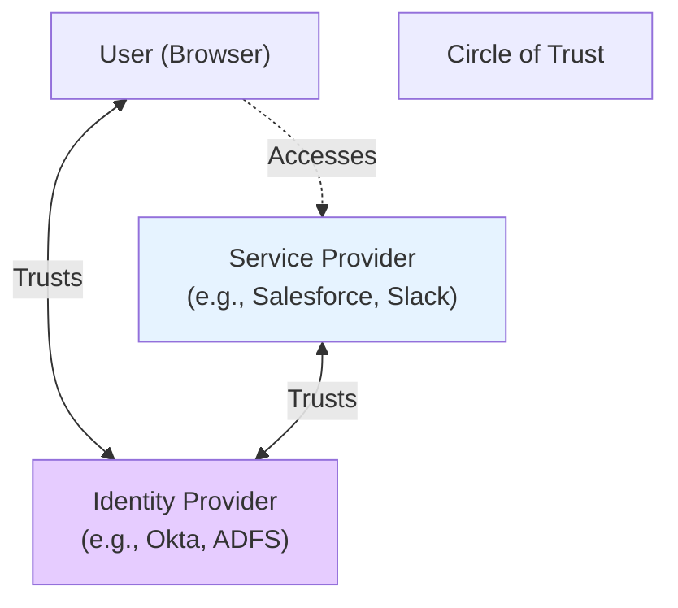
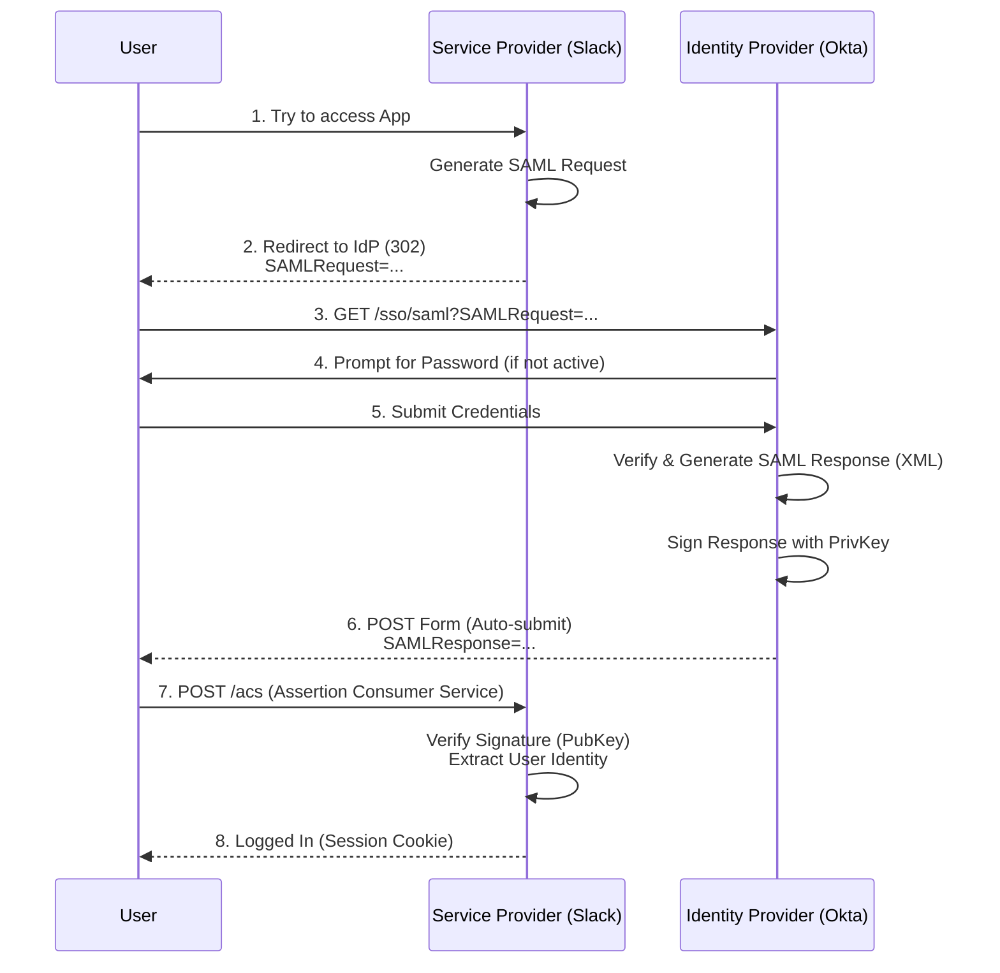
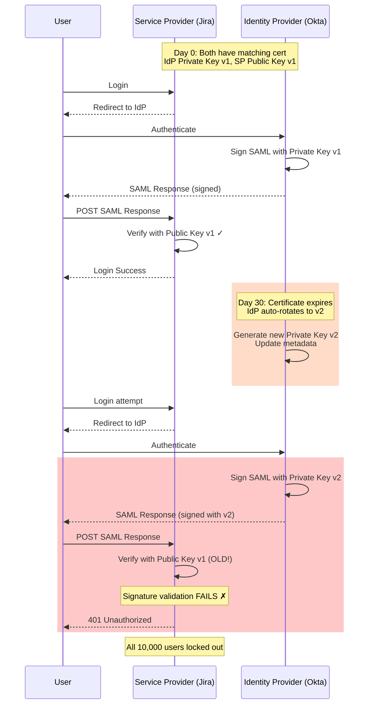
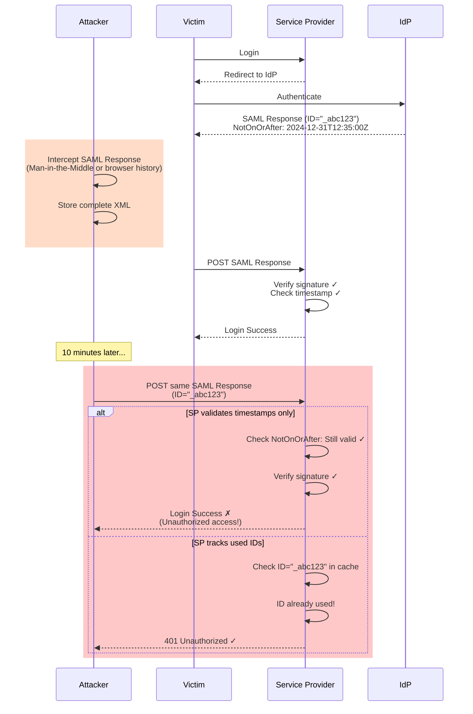
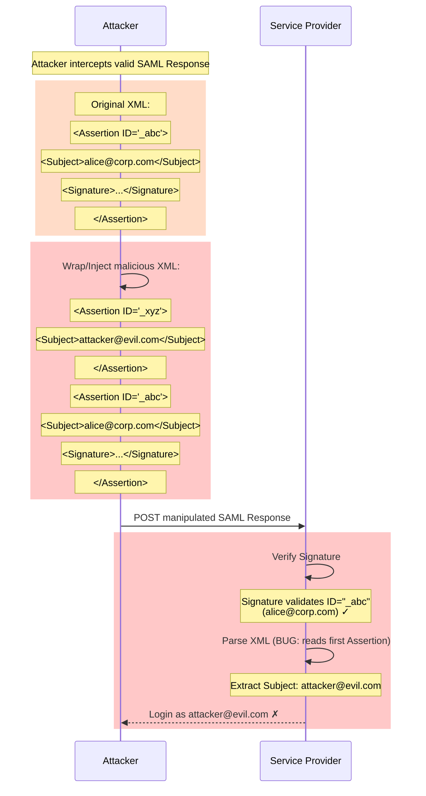

# 05. SSO & SAML

## 1. Introduction

**SSO (Single Sign-On)** allows a user to access multiple independent applications with a single set of credentials.

**SAML (Security Assertion Markup Language)** is the mature (XML-based) standard for exchanging authentication and authorization data between an **Identity Provider (IdP)** and a **Service Provider (SP)**.

**Metaphor**:
- **Passport**: You get it from your Government (IdP).
- **Airport Customs**: Required to enter a country (SP).
- **Process**: Customs trusts the Passport; they don't issue their own IDs for every traveler.

**Why Use It**:
- **Enterprise**: Corporate users login once (Okta/AD) to access Slack, Jira, Salesforce, Mail.
- **Security**: Centralized revocation. Fire an employee in AD, they lose access to ALL apps instantly.

---

## 2. Core Architecture

The "Triangle of Trust".



### Components
1.  **Identity Provider (IdP)**: The source of truth for users (Okta, Azure AD, Ping). Authenticates the user.
2.  **Service Provider (SP)**: The app the user wants to use (Slack, Zoom). Consumes the assertion.
3.  **SAML Assertion**: The signed XML document saying "This is User X".

---

## 3. How It Works: SAML 2.0 Web Browser SSO

**SP-Initiated Flow** (Most common: User goes to Slack first).



**Key Artifacts**:
-   **Metadata**: XML file exchanged once during setup. Contains certificates and endpoint URLs.
-   **ACS URL**: Where the IdP posts the response (callback).
-   **Entity ID**: Unique name of the SP or IdP.

---

## 4. Deep Dive: SAML vs OIDC

Why do we have both?

| Feature | SAML | OIDC (OAuth2) |
| :--- | :--- | :--- |
| **Format** | XML (Heavy) | JSON (Light) |
| **Platform** | Web (Browser) | Web, Mobile, API |
| **Security** | XML Digital Sig | JWT Signature |
| **Client** | Enterprise Apps | Modern Apps, SPAs |
| **Setup** | Complex (Metadata swap) | Simple (Client ID/Secret) |
| **Verdict** | **Legacy Enterprise** | **Modern Standard** |

**Trend**: Modern apps implement OIDC. Legacy enterprise apps rely on SAML. Most IdPs (Okta/Auth0) support *both*.

---

## 5. End-to-End Walkthrough: Corporate Login

Scenario: Employee Alice logs into Jira using Corporate AD.

1.  Alice visits `jira.corp.com`
2.  Jira detects no session. Redirects to `adfs.corp.com` with a SAML Request ID `req_123`.
3.  Alice is already logged into Windows active directory? **Kerberos/IWA** might auto-login her to ADFS without typing password.
4.  ADFS generates XML:
    ```xml
    <Assertion ID="_abc..." IssueInstant="2024-05-20...">
      <Subject> alice@corp.com </Subject>
      <Attribute Name="Department">Engineering</Attribute>
    </Assertion>
    ```
5.  ADFS signs XML with `Corp_Cert.pem`.
6.  Browser POSTs XML to Jira.
7.  Jira validates signature using stored `Corp_Cert.pub`.
8.  Jira creates session for `alice@corp.com` and grants 'Engineering' project access.

---

## 6. Failure Scenarios

### Scenario A: Certificate Mismatch (Rotation Failure)
**Symptom**: All users suddenly unable to log in via SSO.
**Cause**: IdP rotated signing certificate, SP still has old public key.
**Mechanism**: Signature validation fails because SP uses wrong certificate.



**The Fix**:
- **Metadata Monitoring**: Poll IdP metadata URL daily for cert changes
- **Dual Certificates**: IdP publishes both old and new certs during rotation period
- **Alerts**: Monitor SAML validation failure rate (alert if >5%)
- **Automation**: Auto-update SP certificate from metadata
- **Coordination**: Plan cert rotations with 30-day notice

---

### Scenario B: Replay Attack
**Symptom**: Attacker gains unauthorized access using intercepted SAML Response.
**Cause**: SP doesn't validate timestamps or track used assertion IDs.
**Mechanism**: Attacker captures valid SAML Response and replays it later.



**The Fix**:
- **Assertion ID Tracking**: Store used IDs in Redis (TTL = NotOnOrAfter duration)
- **Short Validity**: NotOnOrAfter = 5 minutes (not 24 hours)
- **OneTimeUse**: Include `<OneTimeUse/>` condition in assertion
- **Timestamp Validation**: Strictly enforce NotBefore and NotOnOrAfter
- **Nonce**: Include request-specific nonce, validate in response

---

### Scenario C: XML Signature Wrapping (XSW)
**Symptom**: Attacker gains access as different user despite valid signature.
**Cause**: XML structure manipulation exploits parsing vulnerabilities.
**Mechanism**: Signature validates one element while app reads another.



**The Fix**:
- **Use Mature Libraries**: OneLogin SAML, Spring Security SAML (patched against XSW)
- **Strict Parsing**: Validate signature references match parsed elements
- **Schema Validation**: Enforce SAML schema, reject unexpected structures
- **Single Assertion**: Only accept responses with exactly one assertion
- **Never Regex XML**: Don't parse SAML with string manipulation
- **Security Audits**: Regular penetration testing for XSW variants

---

## 7. Performance Tuning

| Configuration | Impact |
| :--- | :--- | :--- |
| **Assertion Size** | XML is verbose. If you include 100 User Groups in attributes, header becomes massive. Limit attributes. |
| **Compression** | SAML Requests are usually Deflated + Base64 encoded to fit in URL. |
| **Clock Skew** | Allow small skew (e.g., 2 mins) between IdP and SP clocks to prevent rejection of valid tokens. |

---

## 8. Constraints & Limitations

| Constraint | Limit | Why? |
| :--- | :--- | :--- |
| **Mobile** | Poor | Parsing XML and handling POST redirects in mobile WebViews is painful. Use OIDC. |
| **SPA** | Difficult | SAML is designed for browser POSTs, not AJAX. Requires backend proxy. |
| **Keys** | Manual Sync | Certificate expiry is the #1 cause of SSO outages. |

---

## 9. When to Use?

| Use Case | Verdict | Why? |
| :--- | :--- | :--- |
| **Internal Employee Apps** | ✅ **YES** | Active Directory / LDAP Integrations usually favor SAML. |
| **Selling B2B SaaS** | ✅ **YES** | Large customers will DEMAND it. "Do you support SAML?" is a dealbreaker. |
| **Mobile Consumer App** | ❌ **NO** | Use OIDC/Social Login. |
| **Modern Microservices** | ❌ **NO** | Use OIDC/JWT. |

---

## 10. Production Checklist

1.  [ ] **Force HTTPS**: SAML sends data in forms. Must be encrypted.
2.  [ ] **Validate Signature**: SP **MUST** verify the XML signature against the IdP's certificate.
3.  [ ] **Check Timestamps**: Validate `NotBefore` and `NotOnOrAfter` to prevent replay.
4.  [ ] **Encrypt Assertions**: If XML contains sensitive PII, encrypt the Assertion (in addition to TLS).
5.  [ ] **Audience Restriction**: Ensure Assertion says "For Jira", not "For Slack".
6.  [ ] **Library Selection**: Use battle-tested libraries (e.g., `python3-saml`, `opensaml`), never regex XML.
7.  [ ] **Metadata Monitoring**: Automate checking if IdP metadata changes (cert rotation).
8.  [ ] **Attribute Mapping**: Document exactly which attributes (email, firstName, role) mapping is required.
9.  [ ] **Just-In-Time (JIT) Provisioning**: Decide if new users should be auto-created in SP upon first successful SSO.
10. [ ] **Exit Strategy**: What if IdP is down? (Break-glass local admin account).
