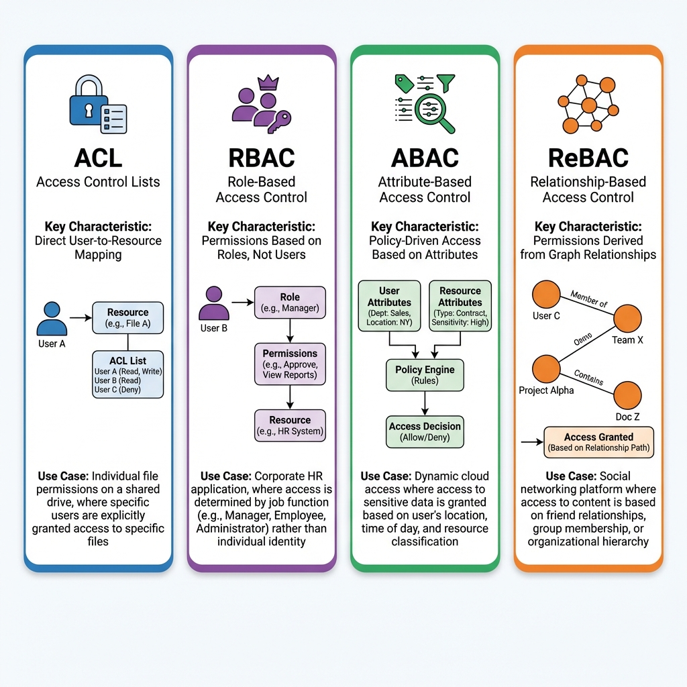
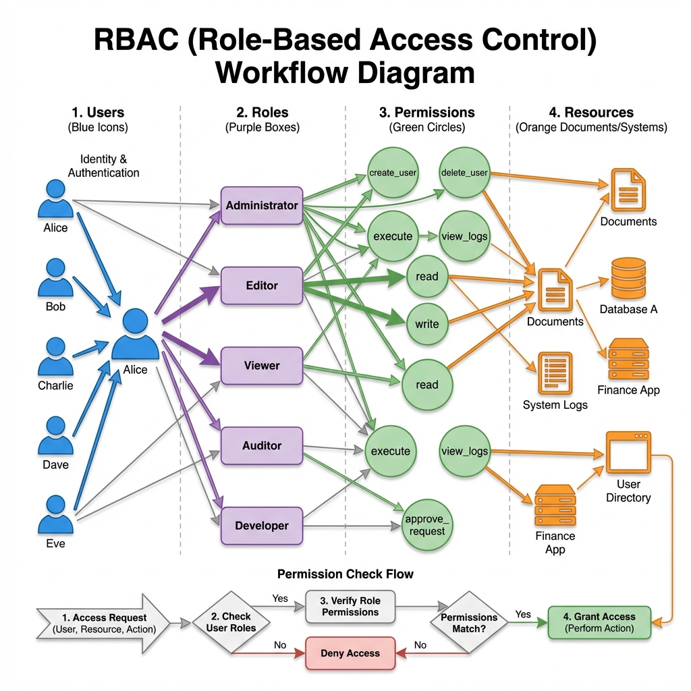
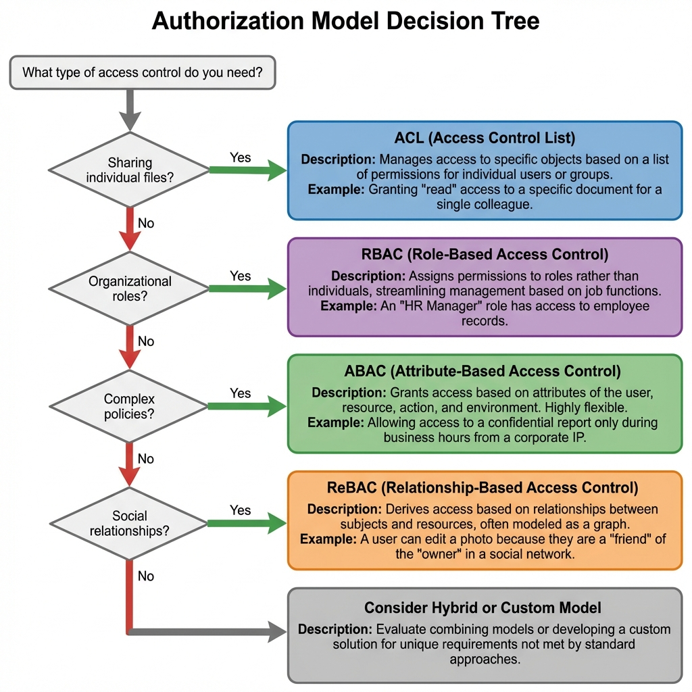
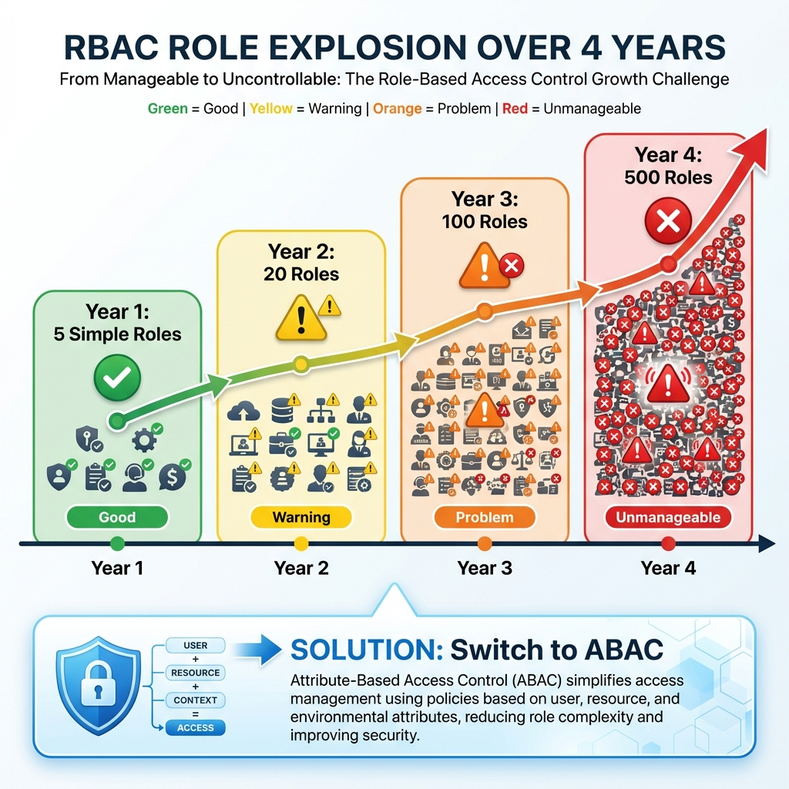

# Understanding Authorization: How Apps Control Access

The complete guide to ACL, RBAC, ABAC, and ReBAC

---

## The Problem: Who Gets to Do What?

Imagine you're building a document management system. Alice uploads a confidential report. Bob is her manager. Charlie is an intern. Dave is from a different department.

**The critical questions:**
- Can Bob read Alice's report? (Probably yes)
- Can Charlie delete it? (Definitely no)
- Can Dave even see it exists? (Maybe not)
- What if Alice gets promoted to Bob's role? (Permissions should change automatically)

**This is authorization in action.** Every app faces these questions thousands of times per second.

Bad authorization leads to:
- ❌ Data breaches (wrong people accessing sensitive data)
- ❌ Compliance failures (audit logs showing unauthorized access)
- ❌ User frustration ("Why can't I access this?")
- ❌ Admin nightmares (manually managing permissions for 10,000 users)

**The solution?** Choose the right authorization model for your needs.

---

## The Four Authorization Models Explained

There are four main ways to control who can access what. Each solves different problems:



**Quick comparison:**

| Model | Focus | Question | Best For |
|-------|-------|----------|----------|
| **ACL** | Resource | "Who can touch THIS file?" | Individual file sharing |
| **RBAC** | Role | "What can people like THIS do?" | Corporate apps |
| **ABAC** | Policy | "Do attributes align?" | Complex rules |
| **ReBAC** | Graph | "How are we related?" | Social networks |

Let's dive into each one...

---

## Model 1: ACL (Access Control Lists)

**The concept:** Each resource carries its own list of who can access it and what they can do.

**Think of it like:** A VIP club guest list. The bouncer at Club XYZ checks if your name is on THAT specific club's list.

### How ACL Works

```
Resource: secrets.txt
Access Control List:
  - Bob: Read
  - Alice: Read, Write  
  - Admins (group): Full Control
```

**When Charlie tries to read secrets.txt:**
1. Look at secrets.txt's ACL
2. Is Charlie in the list? No
3. ❌ Access Denied

**When Bob tries to write to secrets.txt:**
1. Look at secrets.txt's ACL  
2. Is Bob in the list? Yes → Bob has READ
3. Does Bob have WRITE? No
4. ❌ Access Denied

**Real-world example:** Google Drive individual file sharing
- You share "Vacation Photos 2024" with mom@gmail.com
- That ONE specific folder has mom@gmail.com in its ACL
- She can see that folder
- She can't see your other files (they don't have her in their ACLs)

### ACL Pros and Cons

**Pros:**
- ✅ Dead simple to understand ("Who can access THIS thing?")
- ✅ Granular control (per-resource permissions)
- ✅ Perfect for collaboration ("Share with bob@corp.com")
- ✅ Flexible (each resource can have different rules)

**Cons:**
- ❌ Auditing nightmare ("Show me ALL files Bob can access")
- ❌ Doesn't scale (1M files × 10 users each = 10M ACL entries)
- ❌ Management hell (Bob leaves → manually remove from 50 file ACLs)
- ❌ No centralized policy

### When to Use ACL

✅ **Use ACL when:**
- Building file sharing / collaboration tools (Dropbox, Google Drive)
- Users need to share individual items with specific people
- Flexibility is more important than centralized management
- You're comfortable with distributed permission management

❌ **Don't use ACL when:**
- Need centralized audit ("Who can access what?")
- Have thousands of resources and users
- Want consistent permission policies
- Building corporate internal apps

---

## Model 2: RBAC (Role-Based Access Control)

**The concept:** Users have roles. Roles have permissions. It's indirect—two hops instead of one.

**Think of it like:** Corporate job titles. "Managers can approve expenses" applies to ALL managers, not individual people.



### How RBAC Works

**The three-layer model:**

```
Layer 1: Users
  - Alice
  - Bob  
  - Charlie

Layer 2: Roles
  - Admin
  - Editor
  - Viewer

Layer 3: Permissions
  - read_documents
  - write_documents
  - delete_documents
  - manage_users
```

**Assignments:**
```
Alice → Editor role
Editor role → [read_documents, write_documents]
```

**When Alice tries to delete a document:**
1. Check Alice's roles → Editor
2. Check Editor role's permissions → [read, write]
3. Does Editor have delete? No
4. ❌ Access Denied

### Database Schema for RBAC

```sql
-- Tables
CREATE TABLE users (
  id INTEGER PRIMARY KEY,
  name VARCHAR(255)
);

CREATE TABLE roles (
  id INTEGER PRIMARY KEY,
  name VARCHAR(100) -- 'Admin', 'Editor', 'Viewer'
);

CREATE TABLE permissions (
  id INTEGER PRIMARY KEY,
  name VARCHAR(100) -- 'read_docs', 'write_docs', 'delete_docs'
);

-- Many-to-many relationships
CREATE TABLE user_roles (
  user_id INTEGER REFERENCES users(id),
  role_id INTEGER REFERENCES roles(id),
  PRIMARY KEY (user_id, role_id)
);

CREATE TABLE role_permissions (
  role_id INTEGER REFERENCES roles(id),
  permission_id INTEGER REFERENCES permissions(id),
  PRIMARY KEY (role_id, permission_id)
);
```

### Permission Check Implementation

```javascript
async function canUserPerformAction(user, action) {
  // 1. Get user's roles
  const roles = await db.query(`
    SELECT r.* FROM roles r
    JOIN user_roles ur ON ur.role_id = r.id
    WHERE ur.user_id = ?
  `, [user.id])
  
  // 2. Get all permissions for those roles
  const permissions = await db.query(`
    SELECT DISTINCT p.name FROM permissions p
    JOIN role_permissions rp ON rp.permission_id = p.id
    WHERE rp.role_id IN (?)
  `, [roles.map(r => r.id)])
  
  // 3. Check if action is in permissions
  return permissions.some(p => p.name === action)
}

// Usage
if (await canUserPerformAction(alice, 'delete_documents')) {
  deleteDocument()
} else {
  throw new ForbiddenError()
}
```

### Hierarchical RBAC

In real organizations, roles inherit from each other:

```
Admin (top level)
  ├─ Has: manage_users, delete_database, view_logs
  ├─ Inherits: All Manager permissions
  │
Manager (mid level)
  ├─ Has: approve_requests, view_reports
  ├─ Inherits: All Viewer permissions
  │
Viewer (base level)
  └─ Has: read_documents
```

**Result:**
- Viewer can: read_documents
- Manager can: read_documents + approve_requests + view_reports
- Admin can: All of the above + manage_users + delete_database

**Implementation:**
```javascript
function getAllPermissionsForRole(role) {
  const permissions = [...role.permissions]
  
  // Recursively get parent permissions
  let parent = role.parentRole
  while (parent) {
    permissions.push(...parent.permissions)
    parent = parent.parentRole
  }
  
  return [...new Set(permissions)] // Remove duplicates
}
```

### RBAC Pros and Cons

**Pros:**
- ✅ Maps to organizational structure (Manager, Engineer, Intern)
- ✅ Scalable administration (update role once, affects all users)
- ✅ Easy to reason about ("What can Editors do?")
- ✅ Industry standard for B2B SaaS
- ✅ Familiar to end users

**Cons:**
- ❌ **Role explosion** (more on this later)
- ❌ All-or-nothing (can't say "Alice can edit HER OWN posts")
- ❌ No context awareness (time, location, device)
- ❌ Doesn't handle resource-specific permissions well

### When to Use RBAC

✅ **Use RBAC when:**
- Building B2B SaaS, CRM, admin panels, enterprise apps
- Users naturally map to job functions
- Permissions are role-based, not resource-specific
- Need balance between flexibility and manageability
- **This is the default choice for 80% of business apps**

❌ **Don't use RBAC when:**
- Need fine-grained, resource-specific permissions
- Building social network (use ReBAC)
- Have complex, context-dependent rules (use ABAC)
- Permission requirements are highly dynamic

---

## Model 3: ABAC (Attribute-Based Access Control)

**The concept:** Access is calculated by evaluating a policy against attributes of the user, resource, and environment.

**Think of it like:** Airport security. They don't check if you're on a list; they evaluate your passport attributes + your flight attributes + the current security level.

### How ABAC Works

**The three attribute sources:**

```
User Attributes:
  - department: Sales
  - clearance_level: 3
  - employment_type: FullTime
  - location: NYC

Resource Attributes:
  - classification: Confidential (level 2)
  - owner_department: Sales
  - created_date: 2024-01-15

Environment Attributes:
  - current_time: 14:30
  - day_of_week: Tuesday
  - user_ip: 10.0.1.50
  - device_type: Corporate Laptop
```

**Policy example:**
```
ALLOW if:
  user.clearance_level >= resource.classification
  AND user.department == resource.owner_department
  AND environment.time >= 09:00
  AND environment.time <= 17:00
  AND environment.day_of_week IN [Monday, Tuesday, Wednesday, Thursday, Friday]
  AND environment.device_type == "Corporate Laptop"
```

### Real-World ABAC: AWS IAM Policy

```json
{
  "Version": "2012-10-17",
  "Statement": [{
    "Effect": "Allow",
    "Action": "s3:GetObject",
    "Resource": "arn:aws:s3:::company-data/*",
    "Condition": {
      "StringEquals": {
        "s3:ExistingObjectTag/Department": "${aws:PrincipalTag/Department}"
      },
      "IpAddress": {
        "aws:SourceIp": "203.0.113.0/24"
      },
      "DateGreaterThan": {
        "aws:CurrentTime": "2024-01-01T00:00:00Z"
      },
      "DateLessThan": {
        "aws:CurrentTime": "2024-12-31T23:59:59Z"
      }
    }
  }]
}
```

**Translation:** Allow S3 GetObject IF:
- User's Department tag matches Object's Department tag
- Request comes from office IP range
- Current time is within 2024

### ABAC Implementation with OPA

[Open Policy Agent](https://www.openpolicyagent.org/) is the standard for ABAC:

```rego
# policy.rego
package authz

default allow = false

allow {
  # User has sufficient clearance
  input.user.clearance_level >= input.resource.classification
  
  # Same department
  input.user.department == input.resource.owner_department
  
  # Business hours
  is_business_hours
}

is_business_hours {
  # Parse time
  time_parts := split(input.environment.current_time, ":")
  hour := to_number(time_parts[0])
  
  # Check range
  hour >= 9
  hour < 17
  
  # Check weekday
  input.environment.day_of_week != "Saturday"
  input.environment.day_of_week != "Sunday"
}
```

```javascript
// Using OPA in Node.js
const { loadPolicy } = require('@open-policy-agent/opa-wasm')

async function checkAccess(user, resource) {
  const policy = await loadPolicy('./policy.wasm')
  
  const input = {
    user: {
      clearance_level: user.clearance,
      department: user.dept
    },
    resource: {
      classification: resource.classification,
      owner_department: resource.dept
    },
    environment: {
      current_time: new Date().toTimeString(),
      day_of_week: new Date().toLocaleDateString('en-US', { weekday: 'long' })
    }
  }
  
  const result = policy.evaluate(input)
  return result.allow === true
}
```

### ABAC Pros and Cons

**Pros:**
- ✅ Infinite flexibility (any attribute, any rule)
- ✅ Solves role explosion problem
- ✅ Context-aware (time, location, device)
- ✅ Perfect for compliance requirements
- ✅ Centralized policy management

**Cons:**
- ❌ Complex to implement and maintain
- ❌ Performance impact (policy evaluation on every request)
- ❌ Hard to debug ("Why was I denied?")
- ❌ Requires policy engine and expertise
- ❌ Steep learning curve

### When to Use ABAC

✅ **Use ABAC when:**
- Have complex compliance requirements (HIPAA, SOC2)
- Need context-aware access (time, location, device)
- Experiencing RBAC role explosion
- AWS, government, healthcare, finance scenarios
- Have dedicated security team

❌ **Don't use ABAC when:**
- Starting a new project (start with RBAC)
- Team lacks policy engine expertise
- Performance is critical (sub-10ms latency)
- Simple permission requirements

---

## Model 4: ReBAC (Relationship-Based Access Control)

**The concept:** Permissions are derived from relationships in a graph. Access is determined by walking relationship paths.

**Think of it like:** Facebook privacy. "Friends can see my photos" isn't a list of specific people—it's a relationship definition.

### How ReBAC Works

**The graph:**

```
Alice ──member_of──> Sales Team
Sales Team ──owner_of──> Q4 Folder
Q4 Folder ──parent_of──> Revenue.xlsx
Revenue.xlsx ──editor──> (anyone with path to it)
```

**Query: Can Alice edit Revenue.xlsx?**
```
1. Start: Alice
2. Follow: member_of → Sales Team
3. Follow: owner_of → Q4 Folder
4. Follow: parent_of → Revenue.xlsx
5. Check: Owners can edit
6. Result: ✅ ALLOW (path found!)
```

### ReBAC Example: Google Docs Permissions

```
Document Structure:
  Company Folder
    ├─ Sales Folder (Sales Team: owner)
    │   ├─ Q1 Report (inherits from Sales Folder)
    │   └─ Q2 Report (inherits from Sales Folder)
    └─ Engineering Folder (Eng Team: owner)
        └─ Architecture Doc

Relationships:
  Alice ─member_of→ Sales Team
  Bob ─member_of→ Engineering Team
  Sales Team ─owner→ Sales Folder
  Sales Folder ─parent→ Q1 Report
```

**Can Alice edit Q1 Report?**
- Alice → member_of → Sales Team
- Sales Team → owner → Sales Folder
- Sales Folder → parent → Q1 Report
- **Path exists! ✅ ALLOW**

**Can Alice edit Architecture Doc?**
- Alice → member_of → Sales Team
- Sales Team → owner → Sales Folder
- Sales Folder → parent → ❌ (no path to Arch Doc)
- **No path! ❌ DENY**

### ReBAC Implementation

Most famously implemented by **Google Zanzibar** (powers Google Drive, Gmail, Calendar, YouTube).

**Relationship tuples:**
```
(alice, member, sales_team)
(sales_team, owner, sales_folder)
(sales_folder, parent, q1_report)
```

** Check query:**
```
Check("alice", "edit", "q1_report")
  → Expand relationships
  → Find path
  → Return ALLOW/DENY
```

**Open source implementations:**
- [SpiceDB](https://github.com/authzed/spicedb) - Zanzibar-inspired
- [Ory Keto](https://www.ory.sh/keto/) - ReBAC system
- [OpenFGA](https://openfga.dev/) - Fine-Grained Authorization

### ReBAC Pros and Cons

**Pros:**
- ✅ Perfect for hierarchical data (folders, orgs, teams)
- ✅ Perfect for social graphs (friends, followers)
- ✅ Intuitive ("friends of friends can see")
- ✅ Scales to billions (Google does it)
- ✅ Handles nested permissions naturally

**Cons:**
- ❌ Requires graph database or specialized system
- ❌ Complex to implement from scratch
- ❌ Graph traversal can be expensive
- ❌ Hard to debug deep relationship chains
- ❌ Learning curve

### When to Use ReBAC

✅ **Use ReBAC when:**
- Building Google Docs-like hierarchy
- Building social network (friends, followers)
- Need "friends of friends" or transitive permissions
- Have nested organizational structures
- Using SpiceDB, OpenFGA, or similar

❌ **Don't use ReBAC when:**
- Permissions are flat (not hierarchical)
- Building simple CRUD app
- Team lacks graph database expertise
- Starting MVP (too complex for v1)

---

## Which Model Should You Choose?



### Decision Framework

**Start here: What type of app are you building?**

1. **Individual file sharing app** (Dropbox, Google Drive)
   - Recommendation: **ACL or ReBAC**
   - Why: Users need to share specific items with specific people

2. **B2B SaaS / Corporate tool** (CRM, Project Management, HR system)
   - Recommendation: **RBAC**
   - Why: Permissions map to job roles (Manager, Employee, Admin)

3. **Social network** (Facebook, LinkedIn, Twitter)
   - Recommendation: **ReBAC**
   - Why: Permissions based on relationships (friends, followers)

4. **Compliance-heavy system** (Healthcare, Finance, Government)
   - Recommendation: **ABAC**
   - Why: Complex, context-dependent rules required by regulations

5. **Cloud infrastructure** (AWS, Azure)
   - Recommendation: **ABAC**
   - Why: Tag-based, attribute-driven policies

### The Hybrid Reality

**Most real applications use a combination:**

**Common Pattern 1: RBAC + ACL**
```
RBAC: application-level roles (Admin, User, Guest)
ACL: resource-level sharing (share this file with bob@corp.com)

Example: Google Workspace
- Organizational roles: Admin, Member
- Individual file sharing: ACLs on each doc
```

**Common Pattern 2: RBAC + ABAC**
```
RBAC: base roles (Engineer, Manager, Executive)
ABAC: contextual policies on top

Example: Financial system
- Role: Accountant (can view transactions)
- ABAC: But only during business hours, from office IP, for transactions < $10k
```

**Common Pattern 3: ReBAC + RBAC**
```
ReBAC: hierarchical document permissions
RBAC: administrative roles

Example: Notion
- Pages/workspaces use ReBAC (nested permissions)
- Admin panel uses RBAC (workspace admin role)
```

---

## What Can Go Wrong? Authorization Failures Explained

### Failure 1: RBAC Role Explosion

**The nightmare:** You start with 5 clean roles. Four years later you have 500 unmaintainable roles.



**How it happens:**

**Year 1 (Good):**
```
5 Roles:
- Admin
- Manager  
- Engineer
- Viewer
- Guest
```

**Year 2 (Warning):**
```
"We need different permissions per department"
20 Roles:
- Sales_Manager
- Sales_Engineer
- Eng_Manager
- Eng_Engineer
- HR_Manager
...
```

**Year 3 (Problem):**
```
"We need shift-based permissions"
100 Roles:
- Sales_DayShift_Manager
- Sales_NightShift_Manager
- ICU_DayShift_Nurse
- ICU_NightShift_Nurse
...
```

**Year 4 (Catastrophe):**
```
"We need location + department + shift"
500 Roles:
- NYC_ICU_DayShift_Nurse
- LA_ER_NightShift_Nurse
- Chicago_Sales_Weekend_Manager
...
COMPLETELY UNMANAGEABLE ❌
```

**The fix: Switch to ABAC**

```javascript
// Instead of 500 roles, use attributes:

// OLD (RBAC): 500 different roles
role: NYC_ICU_DayShift_Nurse

// NEW (ABAC): ONE role + attributes
role: Nurse
attributes: {
  department: "ICU",
  shift: "day",
  location: "NYC"
}

// Policy
allow_access if:
  user.role == "Nurse"
  AND user.department == resource.department
  AND user.shift == current_shift
  AND user.location == resource.location
```

**Result:**
- Went from 500 roles → 5 base roles
- Much easier to manage
- Flexible without explosion

---

### Failure 2: Privilege Creep

**The nightmare:** Long-tenured employees accumulate excessive permissions over years.

**Alice's journey:**

```
2018: Hired as Intern
  Role: Intern (read-only)

2019: Promoted to Engineer  
  Roles: Intern + Engineer (FORGOT TO REMOVE INTERN) ⚠️

2021: Promoted to Manager
  Roles: Intern + Engineer + Manager ❌

2022: Lateral move to Security Team
  Roles: Intern + Engineer + Manager + Security_Analyst ❌

2023: 5 years later
  Result: GOD MODE - Can do everything ❌
```

**Why it happens:**
- Role additions are easy (just INSERT)
- Role removals are forgotten
- No automated cleanup
- No periodic reviews

**The fix:**

```javascript
// 1. Automated cleanup on promotion
async function promoteUser(user, newRole) {
  // Remove ALL old roles
  await db.userRoles.deleteMany({ userId: user.id })
  
  // Add only new role
  await db.userRoles.create({
    userId: user.id,
    roleId: newRole.id
  })
  
  logger.info(`User ${user.id} promoted to ${newRole.name}, old roles removed`)
}

// 2. Role expiration
CREATE TABLE user_roles (
  user_id INTEGER,
  role_id INTEGER,
  granted_at TIMESTAMP,
  expires_at TIMESTAMP,  -- Auto-expire after 12 months
  PRIMARY KEY (user_id, role_id)
);

// 3. Periodic access reviews
async function quarterlyAccessReview() {
  const usersWithMultipleRoles = await db.query(`
    SELECT user_id, COUNT(*) as role_count
    FROM user_roles
    GROUP BY user_id
    HAVING COUNT(*) > 2
  `)
  
  // Alert for review
  for (let user of usersWithMultipleRoles) {
    await notifyManager(user, `User has ${user.role_count} roles - review needed`)
  }
}

// 4. Alert on excessive roles
if (user.roles.length > 3) {
  logger.warn(`User ${user.id} has ${user.roles.length} roles - possible privilege creep`)
}
```

---

### Failure 3: ACL Orphaned Access

**The nightmare:** Employee leaves company but still has access to 50 sensitive files.

**What happened:**

```
Alice's access BEFORE leaving:
1. Member of "Sales Team" group (group ACL on 100 files)
2. Individual ACL entries on 50 files (direct sharing)

When Alice leaves:
✅ Removed from "Sales Team" group
❌ Individual ACL entries still exist!

Result: Alice still has access to 50 files ❌
```

**Why it happens:**
- ACLs are distributed (each resource has its own list)
- No central "remove all access" button
- Individual ACL entries forgotten

**The fix:**

```javascript
// Option 1: Always use groups, never individuals
// ❌ Bad
await addACL(file, { user: 'alice@corp.com', permission: 'read' })

// ✅ Good  
await addACL(file, { group: 'sales-team', permission: 'read' })

// Option 2: Automated cleanup on user deactivation
async function deactivateUser(user) {
  // 1. Remove from all groups
  await db.groupMembers.deleteMany({ userId: user.id })
  
  // 2. Scan and remove ALL individual ACL entries
  const filesWithUserACL = await db.acls.find({
    user_id: user.id
  })
  
  for (let acl of filesWithUserACL) {
    await db.acls.delete({ id: acl.id })
    logger.info(`Removed ACL for user ${user.id} on resource ${acl.resource_id}`)
  }
  
  // 3. Mark user as inactive
  await db.users.update(user.id, { active: false })
}

// Option 3: Regular access audits
async function auditFileAccess(fileId) {
  const acls = await db.acls.find({ resource_id: fileId })
  
  for (let acl of acls) {
    const user = await db.users.findOne(acl.user_id)
    if (!user.active) {
      logger.error(`SECURITY: Inactive user ${user.id} still has access to file ${fileId}`)
      await db.acls.delete({ id: acl.id })
    }
  }
}
```

---

### Failure 4: ABAC Performance Degradation

**The nightmare:** Adding ABAC slows API from 50ms to 500ms.

**What happened:**

```javascript
// Every request does this:
async function checkABAC(user, resource, action) {
  // 1. Fetch user attributes from HR database
  const userAttrs = await hrDB.getEmployee(user.id) // 50ms ❌
  
  // 2. Fetch resource attributes from asset database
  const resourceAttrs = await assetDB.get(resource.id) // 50ms ❌
  
  // 3. Get current time from time server
  const currentTime = await timeServer.now() // 20ms ❌
  
  // 4. Evaluate policy
  const decision = await policyEngine.evaluate({
    user: userAttrs,
    resource: resourceAttrs,
    environment: { time: currentTime }
  }) // 30ms
  
  return decision.allow
}

// Total: 150ms per request ❌
```

**The fix:**

```javascript
// 1. Cache attributes in JWT
const jwt = {
  user_id: "alice",
  department: "Sales",        // ← Cached in token!
  clearance_level: 3,         // ← No DB lookup!
  exp: Date.now() + 3600000
}

// 2. Use local policy engine (OPA)
const opa = require('@open-policy-agent/opa-wasm')
const policy = await opa.loadPolicy('./policy.wasm')

// Evaluate locally (no network calls)
const result = policy.evaluate({
  user: jwt,                   // From token (0ms)
  resource: { classification: 2 }, // From request (0ms)
  environment: { time: Date.now() } // Local (0ms)
})
// Total: <1ms ✅

// 3. Cache policy decisions
const cacheKey = `authz:${user.id}:${resource.id}:${action}`
let decision = await redis.get(cacheKey)

if (!decision) {
  decision = await evaluatePolicy(user, resource, action)
  await redis.setex(cacheKey, 300, decision) // Cache 5 min
}

return decision
```

---

## Production Best Practices

### Universal Rules (All Models)

**1. Default Deny**

```javascript
// ❌ Bad (default allow)
if (user.isAdmin) {
  return ALLOW
}
return MAYBE // Dangerous!

// ✅ Good (default deny)
if (user.isAdmin || user.hasPermission('special_access')) {
  return ALLOW
}
return DENY // Safe default
```

**2. Check Permissions, Not Roles** (RBAC specific)

```javascript
// ❌ Bad
if (user.role === 'Admin') {
  deleteDatabase()
}

// ✅ Good
if (user.can('delete_database')) {
  deleteDatabase()
}

// Why? Allows flexible role changes without code changes
```

**3. Fail Closed**

```javascript
async function checkPermission(user, action) {
  try {
    return await authService.check(user, action)
  } catch (error) {
    logger.error('Auth service failed:', error)
    return DENY // Fail closed (secure default)
  }
}
```

**4. Audit Everything**

```javascript
logger.audit({
  timestamp: new Date(),
  user: user.email,
  action: 'read',
  resource: 'finance/q4-report.pdf',
  result: 'ALLOW',
  reason: 'User has role: Finance_Manager',
  ip: request.ip,
  user_agent: request.headers['user-agent']
})
```

**5. Test Authorization**

```javascript
describe('Authorization', () => {
  test('Intern cannot delete database', () => {
    const intern = { role: 'Intern' }
    expect(intern.can('delete_database')).toBe(false)
  })
  
  test('Admin can delete database', () => {
    const admin = { role: 'Admin' }
    expect(admin.can('delete_database')).toBe(true)
  })
  
  test('Manager can approve < $10k, not >= $10k', () => {
    const manager = { role: 'Manager' }
    expect(manager.canApprove({ amount: 5000 })).toBe(true)
    expect(manager.canApprove({ amount: 50000 })).toBe(false)
  })
})
```

**6. Break-Glass Mechanism**

```javascript
async function checkAccess(user, resource, action) {
  // Emergency bypass
  if (user.email === 'cto@company.com' && isEmergency) {
    logger.critical('🚨 EMERGENCY BYPASS used by CTO')
    await notifySecurityTeam('Emergency access used')
    return ALLOW
  }
  
  // Normal check
  return await normalCheck(user, resource, action)
}
```

---

### Model-Specific Best Practices

**RBAC:**
- ✅ Use role hierarchy (reduce duplication)
- ✅ Limit users to ≤3 roles
- ✅ Cache permissions in JWT
- ✅ Quarterly access reviews
- ✅ Auto-expire roles after 12 months

**ACL:**
- ✅ Prefer group ACLs over individual user ACLs
- ✅ Index by resource_id for fast lookups
- ✅ Automated cleanup when users deactivate
- ✅ Regular access audits
- ✅ Consider ReBAC for hierarchies

**ABAC:**
- ✅ Use local policy engine (OPA)
- ✅ Cache attribute values
- ✅ Keep policies simple
- ✅ Version control your policies
- ✅ Monitor evaluation performance

**ReBAC:**
- ✅ Use purpose-built system (SpiceDB, OpenFGA)
- ✅ Pre-compute common paths
- ✅ Cache relationship checks
- ✅ Monitor graph traversal depth
- ✅ Add direct paths for performance

---

## Performance Tuning Guide

| Model | Storage | Check Latency | Optimization Strategy |
|-------|---------|---------------|----------------------|
| **ACL** | SQL table | ~1-5ms | Index on resource_id, cache frequent checks |
| **RBAC** | JWT embedded | ~0.1ms | Embed permissions in token, zero DB! |
| **ABAC** | Policy engine | ~1-10ms | Local OPA, cache attributes and decisions |
| **ReBAC** | Graph DB | ~5-50ms | Pre-compute paths, materialized views |

**RBAC Optimization Example:**

```javascript
// Slow: DB query every request
async function canUserDelete(userId) {
  const permissions = await db.query(`
    SELECT p.name FROM permissions p
    JOIN role_permissions rp ON rp.permission_id = p.id
    JOIN user_roles ur ON ur.role_id = rp.role_id
    WHERE ur.user_id = ?
  `, [userId])
  
  return permissions.includes('delete') // 5-10ms per request ❌
}

// Fast: Permissions in JWT
const jwt = {
  user_id: "alice",
  permissions: ["read", "write", "delete"] // ← Embedded!
}

function canUserDelete() {
  return jwt.permissions.includes('delete') // <0.1ms ✅
}
```

---

## Summary & Decision Guide

**The Bottom Line:**

- **Start with RBAC** for 90% of business apps  
- **Add ACL** when users need to share individual items
- **Upgrade to ABAC** when role explosion happens or complex policies needed
- **Use ReBAC** for hierarchical/social scenarios
- **Most real apps use hybrid** combinations

**Quick Checklist:**

✅ Building B2B SaaS? → **RBAC**
✅ Building file sharing? → **ACL or ReBAC**
✅ Building social network? → **ReBAC**
✅ Complex compliance? → **ABAC**
✅ AWS-style infrastructure? → **ABAC**

**Remember:**
- Authorization is security-critical—get it right
- Start simple, evolve as needed
- Audit everything
- Test thoroughly
- Have a break-glass mechanism

Authorization done right is invisible to users. Done wrong, it's a security disaster or usability nightmare. Choose wisely!
