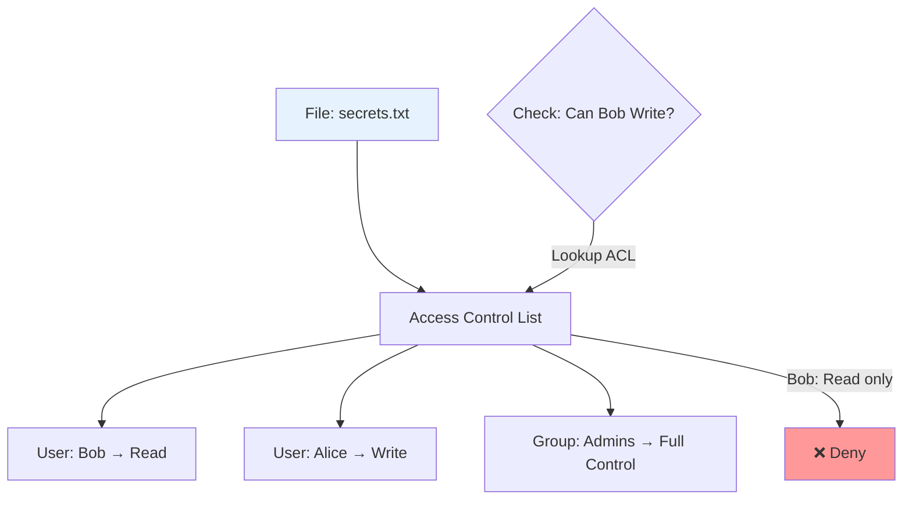
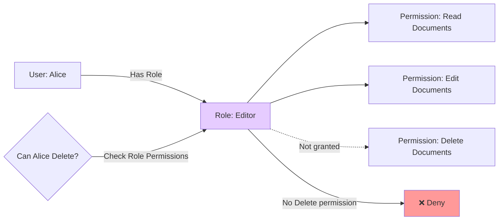
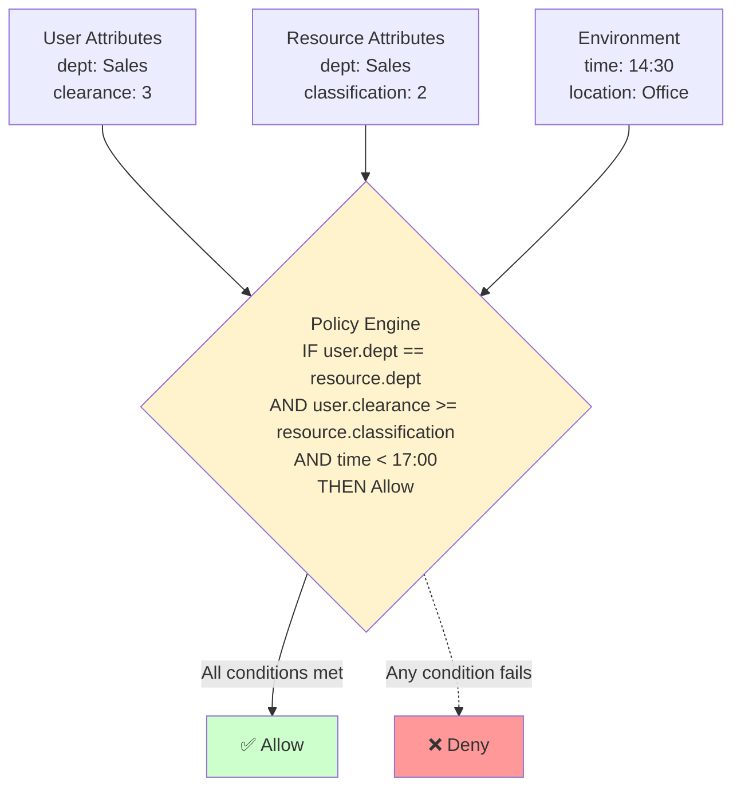
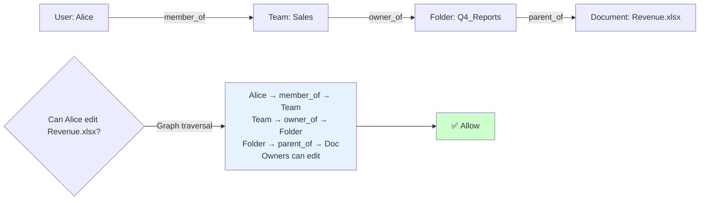
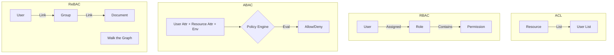
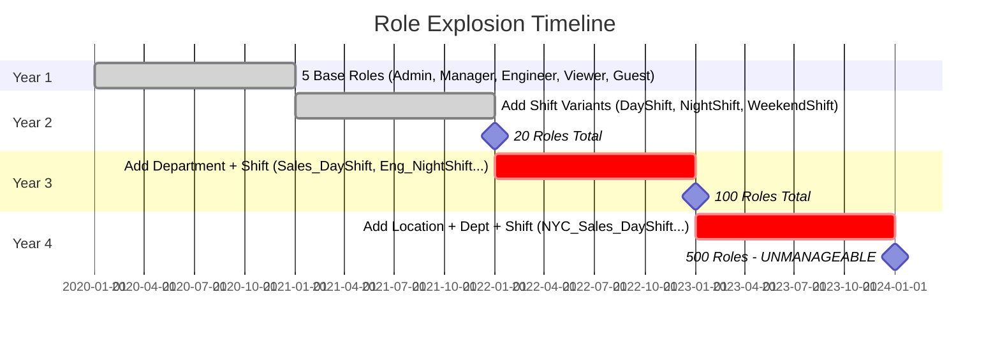

# 06. Authorization Models: RBAC, ABAC, ACL, ReBAC

## 1. Introduction

**Authorization (AuthZ)** determines *access rights*: "Authorized to do what?"

Choosing the right model is critical for scalability. If usage patterns change, retrofitting a new model is extremely expensive.

**The Major Contenders**:
1.  **ACL (Access Control Lists)**: Simple, granular.
2.  **RBAC (Role-Based)**: Group-centric, scalable admin.
3.  **ABAC (Attribute-Based)**: Policy-centric, fine-grained.
4.  **ReBAC (Relationship-Based)**: Graph-centric (social).

---

## 2. Core Architecture Overview

| Model | Focus | Question Answered | Example |
| :--- | :--- | :--- | :--- |
| **ACL** | Resource | "Who can touch *this specific file*?" | "User Bob can read secrets.txt" |
| **RBAC** | Role | "What can *people like this* do?" | "Admins can read any file" |
| **ABAC** | Policy | "Do attributes align?" | "Access allowed if user.dept == doc.dept" |
| **ReBAC** | Graph | "How are we related?" | "Allowed if User is Friend of Owner" |

---

## 3. How It Works: Comparative Analysis

### A. ACL (Access Control List)
Each resource carries a list of allowed users/groups.

*   **Structure**: `FileA -> [User1: Read, User2: Write]`
*   **Pros**: Dead simple. Good for "sharing" features (Google Drive individual sharing).
*   **Cons**: Nightmare to audit ("What files can User1 see?"). No centralization.

### B. RBAC (Role-Based Access Control)
Users have Roles. Roles have Permissions.

*   **Structure**: `User -> Role -> [Permissions]`
*   **Pros**: Easy to reason about organizationally. "Hire Engineering Manager -> Give EngMgr Role".
*   **Cons**: **Role Explosion**. If you need "Manager who can edit *only* NY Office", you create `NY_Manager`, `CA_Manager`... (too many roles).

### C. ABAC (Attribute-Based Access Control)
Access is a boolean calculation based on attributes of User, Resource, and Environment.

*   **Structure**: `IF user.clearance > doc.classification AND time < 5pm THEN Allow`
*   **Pros**: Infinite flexibility. Solves Role Explosion.
*   **Cons**: Complex rules engine. Performance impact (evaluating logical rules on every read).

### D. ReBAC (Relationship-Based Access Control)
Permissions derive from relationships in a graph. (Popularized by Google Zanzibar).

*   **Structure**: `User -> member_of -> Group -> viewer_of -> Document`
*   **Pros**: Perfect for hierarchical/social apps (Google Docs folders, Social Networks).
*   **Cons**: Requires graph database or specialized Tuple Store.

---

## 4. Deep Dive: The Logic differences

---

## 5. End-to-End Walkthrough: "Edit Document" Scenario

Scenario: Alice wants to Edit "Doc-101".

**ACL Approach**:
1. Check `Doc-101` ACL table.
2. Is `Alice` in list with `Edit`? Yes → Allow.

**RBAC Approach**:
1. Check roles for `Alice`: Has `Editor` role.
2. Check `Editor` role: Has `Static:EditDocument` permission? Yes.
3. *Challenge*: Does `Editor` apply to *all* docs? Usually yes. RBAC struggles with specific instances.

**ABAC Approach**:
1. Fetch Alice attributes (`dept=Sales`).
2. Fetch Doc-101 attributes (`dept=Sales`, `status=Draft`).
3. Evaluate Policy: `Allow if user.dept == doc.dept AND doc.status == Draft`.
4. Match? Yes → Allow.

**ReBAC Approach**:
1. Query Graph: `Check (Alice, 'editor', Doc-101)`.
2. Graph search: Alice is `member` of SalesTeam. SalesTeam is `owner` of Doc-101. Owners are `editors`. Path found. Yes → Allow.

---

## 6. Failure Scenarios

### Scenario A: Role Explosion (RBAC Failure)
**Symptom**: Hundreds of roles, impossible to manage, role assignment errors.
**Cause**: Creating hyper-specific roles instead of using attributes.
**Mechanism**: Business requirements outpace RBAC's coarse-grained model.

**Example Progression**:
- **Year 1**: `Admin`, `Manager`, `Engineer`, `Viewer`, `Guest` (5 roles)
- **Year 2**: Add shifts → `DayShiftNurse`, `NightShiftNurse`, `WeekendNurse` (20 roles)
- **Year 3**: Add departments → `ICU_DayShiftNurse`, `ER_NightShiftNurse` (100 roles)
- **Year 4**: Add locations → `NYC_ICU_DayShiftNurse` (500 roles) ❌

**The Fix**:
- **Switch to ABAC**: `Role: Nurse` + `Attributes: {shift: "day", department: "ICU", location: "NYC"}`
- **Policy**: `Allow if user.role == "Nurse" AND user.shift == current_shift`
- **Result**: 5 base roles + dynamic attribute evaluation

---

### Scenario B: Performance Crawl (ABAC Failure)
**Symptom**: API latency increases from 50ms to 500ms.
**Cause**: Policy evaluation requires multiple external service calls.
**Mechanism**: Each request fetches attributes from HR DB, Asset DB, Time Server.

**The Fix**:
- **Cache Attributes**: Store user attributes in JWT (dept, clearance)
- **Simplify Policies**: Avoid complex joins or external calls
- **Decision Caching**: Cache policy decisions for 5 minutes
- **Local Evaluation**: Use OPA (Open Policy Agent) for in-process evaluation

---

### Scenario C: Orphaned Access (ACL Failure)
**Symptom**: Former employee still has access to sensitive files.
**Cause**: Direct user-to-resource ACL entries not cleaned up.
**Mechanism**: Alice removed from "Sales Team" but still has individual ACL entries on 50 files.

**The Fix**:
- **Use Groups**: Grant ACL to groups, not individual users
- **Automated Cleanup**: When user deactivated, scan and remove all ACL entries
- **Audit**: Regular access reviews ("Who can access this file?")
- **Prefer RBAC/ABAC**: Centralized permission management

---

## 7. Performance Tuning

| configuration | Recommendation |
| :--- | :--- |
| **ACL** | Store in SQL (indexed by ResourceID). Fast. |
| **RBAC** | Embed Role/Permissions in JWT. Zero DB lookups at runtime. Very Fast. |
| **ABAC** | Evaluate locally (OPA - Open Policy Agent). Don't make external HTTP calls during eval. |
| **ReBAC** | Use specialized index (Google Zanzibar stores recursive relationships in flat lists for speed). |

---

## 8. Constraints & Limitations

| Model | Complexity | Scalability (Data) | Flexibility |
| :--- | :--- | :--- | :--- |
| **ACL** | Low | Low (1M docs x 10 users = Huge table) | High (Per item) |
| **RBAC** | Low | High (Roles are static) | Low (All or nothing) |
| **ABAC** | High | High (Rules scale well) | Highest |
| **ReBAC**| Very High | Very High (Google scale) | Very High |

---

## 9. When to Use? (Decision Matrix)

| Scenario | Model | Why? |
| :--- | :--- | :--- |
| **B2B SaaS (CRM, Admin Panels)** | **RBAC** | Structures correspond to Job Titles (Admin, User, Viewer). |
| **Google Drive / Dropbox** | **ACL / ReBAC** | Need sharing at individual file/folder level. |
| **AWS / Cloud Infrastructure** | **ABAC** | "Allow if ResourceTag == UserTag". |
| **Social Network** | **ReBAC** | "Friends of friends can see photo". |
| **Government / Healthcare** | **ABAC** | Strict rules ("Only doctor of patient X can view records"). |

---

## 10. Production Checklist

1.  [ ] **Default Deny**: Implicitly deny everything unless an Allow rule exists.
2.  [ ] **Decouple Policy**: Don't hardcode `if (user == 'bob')` in code. Usage middleware or policy engine (OPA).
3.  [ ] **Audit Logging**: Log *why* access was granted/denied (e.g., "Matched Rule #5").
4.  [ ] **Fail Closed**: If AuthZ service is down, nobody gets in.
5.  [ ] **Test Permissions**: Unit test authorization logic ("Ensure 'Intern' cannot 'DeleteDB'").
6.  [ ] **Break-glass**: Mechanism for SuperAdmin to bypass rules in emergency.
7.  [ ] **Start Simple**: Start with RBAC. only add ABAC/ReBAC if business logic effectively demands it.
