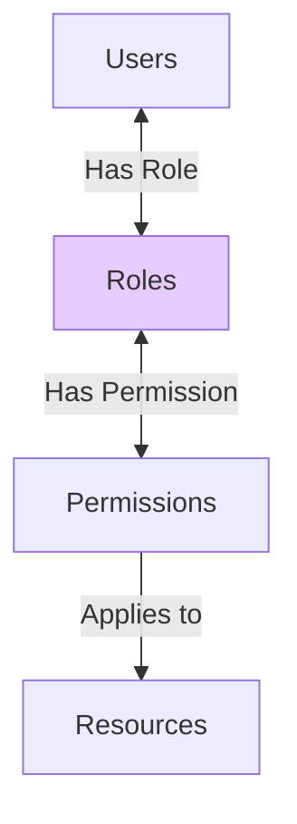
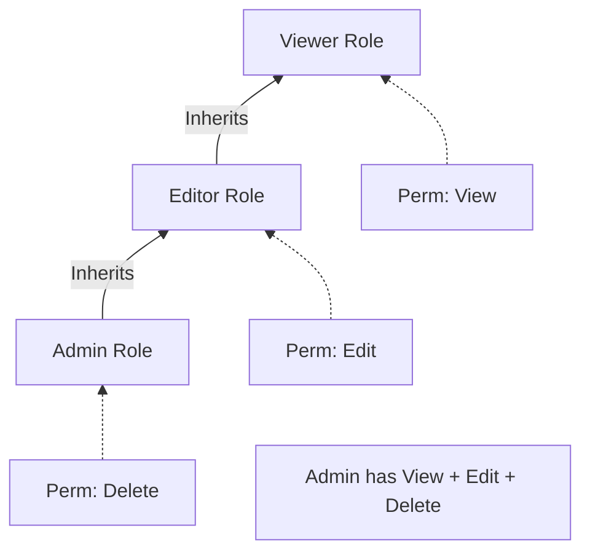
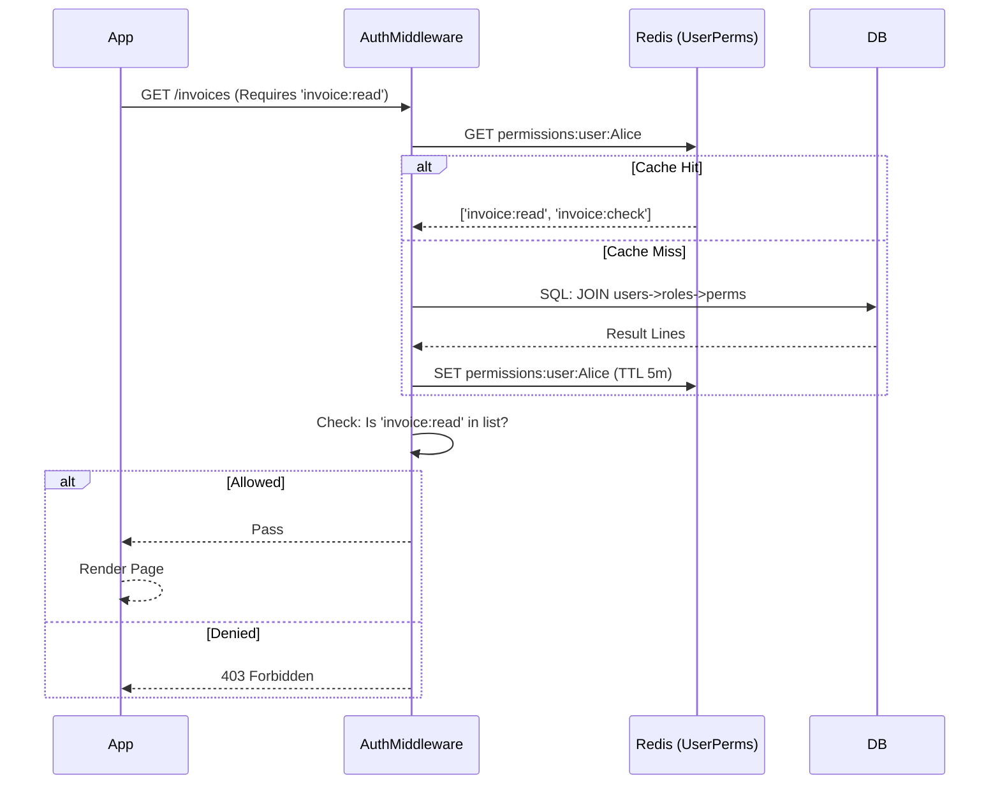
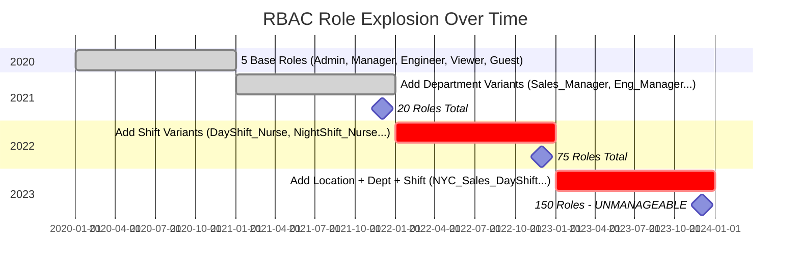
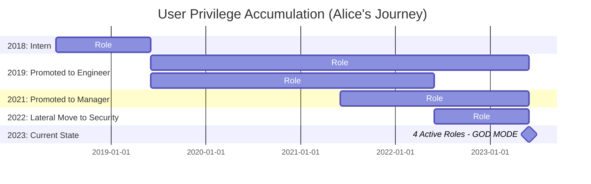

# 07. RBAC (Role-Based Access Control)

## 1. Introduction

**RBAC (Role-Based Access Control)** is a policy-neutral access control mechanism defined around **Roles** and **Privileges**. The permissions to perform certain operations are assigned to specific roles.

**Core Idea**: Users are not assigned permissions directly.
-   Mistake: "Bob can Delete DB"
-   RBAC: "Bob is Admin. Admins can Delete DB."

**Why It's the Standard**:
-   **Simplicity**: Maps cleanly to organizational structures (Manager, Admin, Viewer).
-   **Scalability**: Adding a new permission (e.g., "Export PDF") requires updating 1 role, not 10,000 users.

---

## 2. Core Architecture

The relationship is **Many-to-Many** at both steps.



### Components
1.  **User**: Human or Service Account.
2.  **Role**: A named collection of permissions (e.g., `Editor`, `BillingAdmin`).
3.  **Permission**: The right to perform an action (e.g., `read`, `write`, `delete`).
4.  **Resource**: The integration object (e.g., `files`, `invoices`).

---

## 3. How It Works: Assignment & Evaluation

### Database Schema (Standard)

```sql
TABLE users (id, name)
TABLE roles (id, name) -- 'Admin', 'Editor'
TABLE permissions (id, name) -- 'file:read', 'file:write'

-- Join Tables
TABLE user_roles (user_id, role_id)
TABLE role_permissions (role_id, permission_id)
```

### The Check Logic
To check if **Alice** can **Delete** a **File**:
1.  Fetch Alice's Roles (e.g., `Editor`).
2.  Fetch Permissions for `Editor` (e.g., `file:read`, `file:write`).
3.  Does `file:delete` exist in that list?
    -   No → **Access Denied**.

---

## 4. Deep Dive: Hierarchical RBAC

In real orgs, roles inherit from each other.
-   **Structure**: `Admin > Editor > Viewer`.
-   **Implication**: An Admin *automatically* has all Editor permissions.



**Implementation**:
-   **Runtime expansion**: When loading Alice (Admin), verify `Admin` permissions + `Editor` permissions + `Viewer` permissions.
-   **Flattening**: Store flattened permissions in cache to improve performance.

---

## 5. End-to-End Walkthrough: User Permission Check

Scenario: Alice (Billing Manager) accesses the "Invoices" page.



---

## 6. Failure Scenarios

### Scenario A: Role Explosion
**Symptom**: Hundreds of roles, role assignment errors, admin overwhelmed.
**Cause**: Creating hyper-specific roles for every combination of attributes.
**Mechanism**: Business requirements outpace RBAC's coarse-grained model.



**Progression Example**:
- **2020**: `Admin`, `Manager`, `Engineer`, `Viewer`, `Guest` (5 roles) ✅
- **2021**: Add departments → `Sales_Manager`, `Eng_Manager`, `HR_Manager` (20 roles) ⚠️
- **2022**: Add shifts → `DayShift_Nurse`, `NightShift_Nurse`, `WeekendNurse` (75 roles) ❌
- **2023**: Add locations → `NYC_ICU_DayShift_Nurse`, `LA_ER_NightShift_Nurse` (150 roles) ❌

**The Fix**:
- **Switch to ABAC**: Base role + attributes (`Nurse` + `{shift: "day", dept: "ICU", location: "NYC"}`)
- **Policy-Based**: `Allow if user.role == "Nurse" AND user.shift == current_shift`
- **Result**: 5 base roles + dynamic evaluation

---

### Scenario B: Privilege Creep
**Symptom**: Long-term employees have excessive permissions.
**Cause**: Roles added during promotions/transfers, old roles never removed.
**Mechanism**: User accumulates roles over years without cleanup.



**Timeline**:
- **2018**: Hired as Intern → Role: `Intern` (read-only)
- **2019**: Promoted to Engineer → Roles: `Intern` + `Engineer` (forgot to remove Intern) ⚠️
- **2021**: Promoted to Manager → Roles: `Intern` + `Engineer` + `Manager` ❌
- **2022**: Moved to Security → Roles: `Intern` + `Engineer` + `Manager` + `Security_Analyst` ❌
- **2023**: 5 years later → God-mode access (can do everything)

**The Fix**:
- **Periodic Access Reviews**: Quarterly audit of user roles
- **Role Expiration**: Auto-expire roles after 12 months (require re-approval)
- **Automated Cleanup**: When user changes department, remove old department roles
- **Least Privilege**: Start fresh on promotion (don't accumulate)
- **Monitoring**: Alert when user has >3 roles

---

### Scenario C: Hardcoded Roles
**Symptom**: Code changes required to grant new permissions.
**Cause**: Checking roles instead of permissions in code.
**Mechanism**: `if (user.role == 'Admin')` hardcoded throughout codebase.

**The Fix**:
- **Check Permissions**: `if (user.can('delete_database'))` not `if (user.role == 'Admin')`
- **Abstraction**: Use permission middleware/decorators
- **Flexibility**: New roles can be granted permissions without code changes

---

## 7. Performance Tuning

| Strategy | Description | Impact |
| :--- | :--- | :--- |
| **Permission Bitmasks** | Map permissions to bits (`Read=1`, `Write=2`). | Ultra-fast modification/checking (Bitwise OR/AND). Hard to debug. |
| **Caching** | Cache the *final list* of permissions for a user in JWT or Redis. | Reduces DB load from 3-join SQL queries on every request. |
| **Lazy Loading** | Load basic perms common to all. Load Admin perms only when accessing Admin panel. | Saves memory. |

---

## 8. Constraints & Limitations

| Constraint | Limit | Why? |
| :--- | :--- | :--- |
| **Granularity** | Medium | Cannot handle "User can edit *their own* posts". RBAC says "Can edit *posts*" (all or nothing). |
| **Context** | None | Does not know about Time, Location, or IP address. |
| **Dynamic** | Low | Changing a role affects all users instantly (Good) but risky (Bad if bug introduced). |

---

## 9. When to Use?

| Scenario | Verdict | Why? |
| :--- | :--- | :--- |
| **B2B SaaS** | ✅ **YES** | Standard expectation. Customers want to assign roles to their employees. |
| **CMS / Admin Panel** | ✅ **YES** | Perfect fit. (Editor, Author, Subscriber). |
| **Social Network** | ❌ **NO** | Need ReBAC ("Friend of Friend"). |
| **Banking Transaction** | ❌ **NO** | Need ABAC (Transaction Limit > $10k requires Approval). |

---

## 10. Production Checklist

1.  [ ] **Check Perms, Not Roles**: Code should read `can('edit_post')`, NOT `is('editor')`.
2.  [ ] **Least Privilege**: Users start with NO roles. Add only what is needed.
3.  [ ] **Role Hierarchy**: Implement inheritance to avoid duplicating permissions across roles.
4.  [ ] **Audit Logs**: Log *who* assigned a role to *whom* and *when*.
5.  [ ] **UI Reflection**: Hide buttons in UI if user lacks permission (don't rely just on API 403).
6.  [ ] **Seed Data**: Script the creation of default roles (Admin, Member) so Dev/Prod match.
7.  [ ] **Immutable System Roles**: Prevent modification of 'SuperAdmin' role definition to avoid locking everyone out.
8.  [ ] **Negative Permissions**: (Optional) Allow a role to explicitly DENY a permission inherited from another role.
9.  [ ] **Token Refresh**: If role changes, force token refresh (or handle cache invalidation) so changes apply immediately.
10. [ ] **No Wildcards**: Avoid `*` permissions in production code. Explicitly list capabilities.
