# 08. TLS & SSL: Transport Layer Security

## 1. Introduction

**TLS (Transport Layer Security)**, the successor to SSL, is the cryptographic protocol that encrypts data between a client (browser) and a server.

**HTTPS** = **HTTP** over **TLS**.

**Why It Matters**:
-   **Confidentiality**: Encrypt content so eavesdroppers (WiFi sniffers) see garbage.
-   **Integrity**: Ensure data wasn't modified in transit.
-   **Authentication**: Prove the server is who it claims to be (via Certificates).

**TLS 1.3**: The modern standard (faster, safer). Removed legacy crypto (SHA1, RC4) and reduced handshake latency.

---

## How Does TLS Fit into the Web Stack?

TLS sits between your application data (HTTP) and the low-level network transport (TCP/IP).

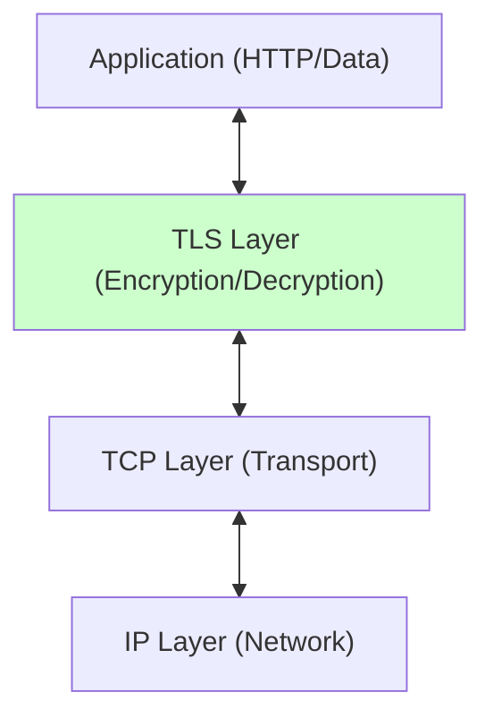

### Components
1.  **Cipher Suite**: Algorithms for key exchange, encryption, and hashing (e.g., `TLS_AES_128_GCM_SHA256`).
2.  **Certificate**: Public key + Identity signed by a CA.
3.  **Handshake**: The negotiation phase to agree on keys.
4.  **Record Protocol**: The data transfer phase (encrypted).

---

## The TLS Handshake: How Encryption Actually Starts

When you visit an HTTPS website, your browser and the server need to agree on encryption keys. This negotiation is called the **TLS handshake**.

**TLS 1.3 (Modern):** Optimized to just **1 round-trip** (super fast)
**TLS 1.2 (Legacy):** Required **2 round-trips** (slower)


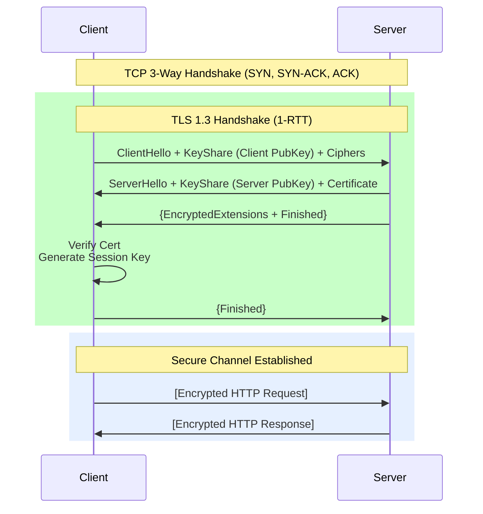

**Key Difference vs 1.2**:
-   Client sends its "guess" for key exchange (KeyShare) immediately.
-   Server responds immediately with its key share.
-   Keys are derived. Encryption starts *halfway* through the first round trip.

---

## But Wait—How Do You Know It's Really Google?

This is where certificates come in. **Anyone** can encrypt data. The real question is: **Are you talking to the real google.com or an imposter?**

### The Chain of Trust

Your browser trusts google.com through a chain of digital signatures:

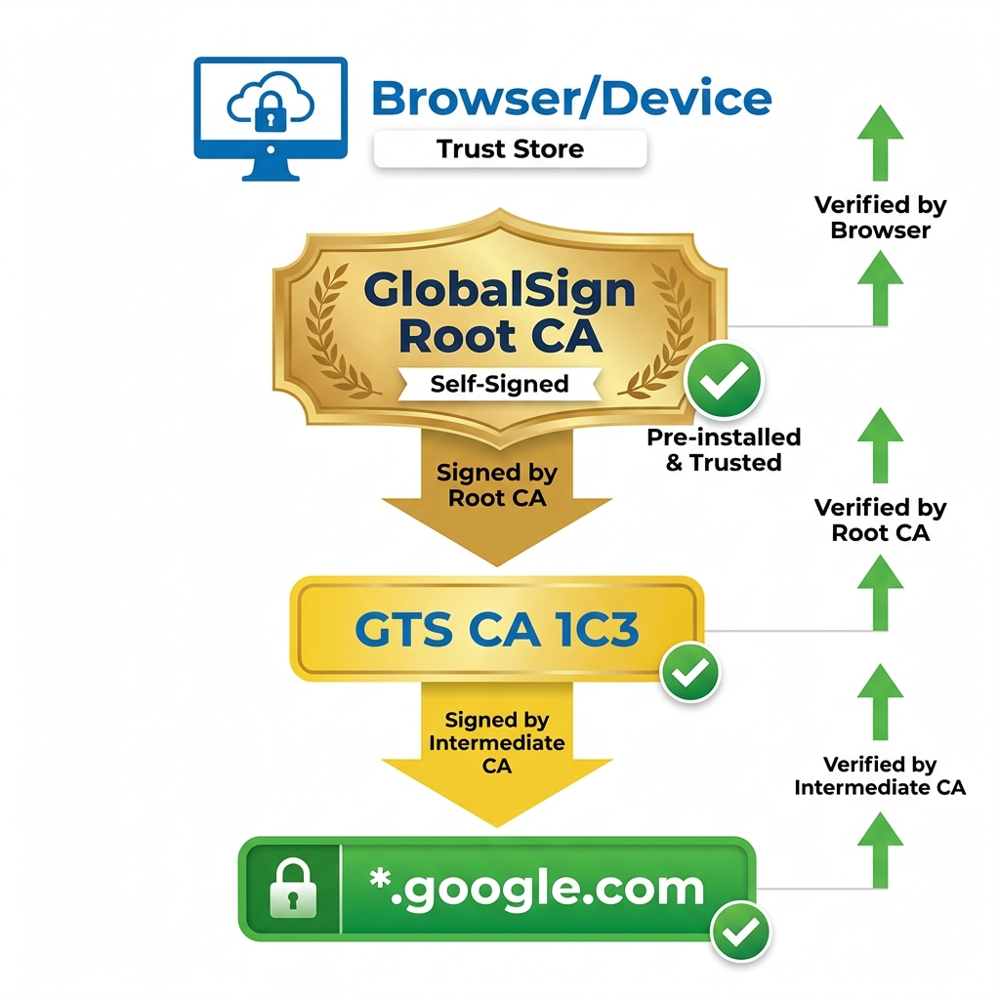

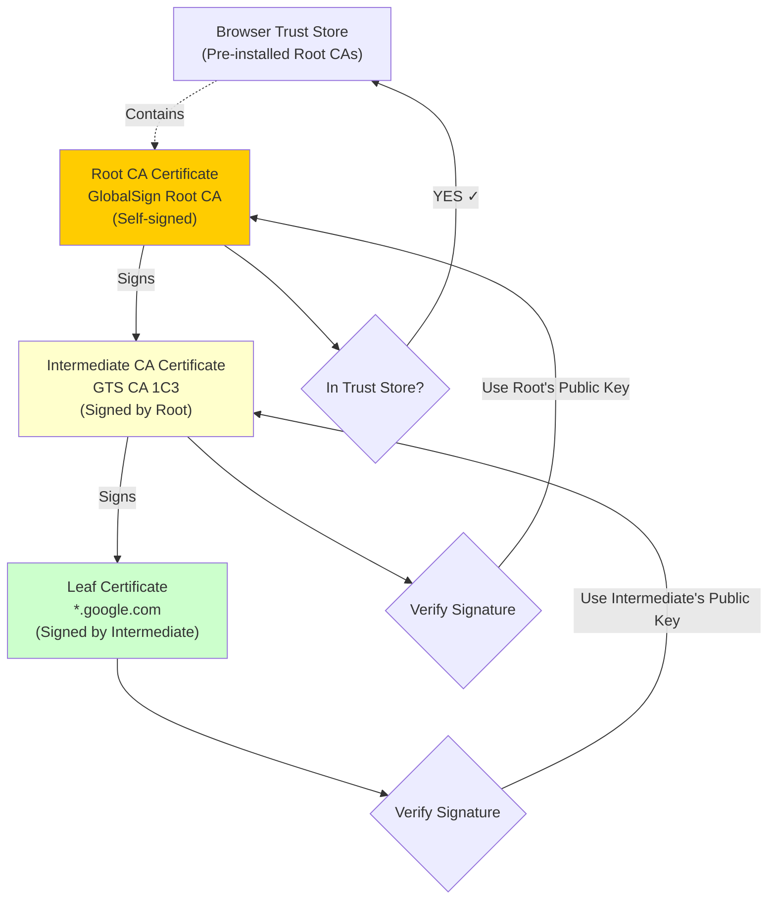

**Validation Steps**:
1.  Browser checks: "Did `Intermediate` sign `Leaf`?" (Verify signature using Intermediate's public key).
2.  Browser checks: "Did `Root` sign `Intermediate`?" (Verify signature using Root's public key).
3.  Browser checks: "Is `Root` in my local Trust Store?" (Pre-installed by Apple/Microsoft/Mozilla).
4.  **Chain Valid** → Connection trusted.

---


---

## Understanding Digital Certificates: The Internet's Passports

Now that you understand *how* certificates work in the chain of trust, let's dive deeper into *what* certificates actually contain and how they're managed.

### What's Inside an X.509 Certificate?

Every digital certificate follows the X.509 standard format. Think of it as a digital passport with specific fields:

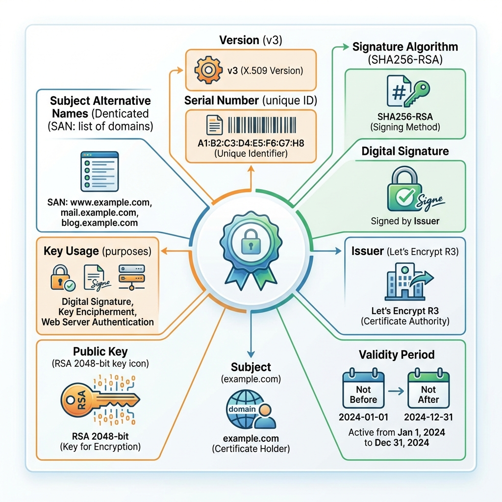

**Key fields explained:**

**Identity Information:**
- **Subject**: Who the certificate is for (e.g., `example.com`)
- **Issuer**: Who signed it (e.g., `Let's Encrypt R3`)
- **Serial Number**: Unique identifier for this specific certificate

**Validity:**
- **Not Before**: Certificate is invalid before this date
- **Not After**: Certificate expires after this date
- Modern certs are valid for max 90-398 days (shorter is more secure)

**Security:**
- **Public Key**: The actual RSA or ECDSA public key (2048-bit or 256-bit)
- **Signature Algorithm**: How the certificate was signed (SHA256-RSA)
- **Digital Signature**: The CA's signature proving authenticity

**Extensions (Critical for Modern Web):**
- **SAN (Subject Alternative Names)**: List of ALL valid domains
  - Example: `example.com`, `www.example.com`, `blog.example.com`
  - Modern browsers REQUIRE SAN, ignore the old CN (Common Name) field
- **Key Usage**: What the key can do (signing, encryption, key agreement)
- **Extended Key Usage**: Specific purposes (TLS web server authentication)

**Example certificate viewed with openssl:**
```bash
$ openssl x509 -in certificate.crt -text -noout
```

```text
Certificate:
    Version: 3 (0x2)
    Serial Number: 04:d6:e3:f2:8a...
    Signature Algorithm: sha256WithRSAEncryption
    Issuer: C=US, O=Let's Encrypt, CN=R3
    Validity
        Not Before: May 20 00:00:00 2024 GMT
        Not After : Aug 18 23:59:59 2024 GMT
    Subject: CN=example.com
    Subject Public Key Info:
        Public Key Algorithm: rsaEncryption
            RSA Public-Key: (2048 bit)
    X509v3 extensions:
        X509v3 Subject Alternative Name: 
            DNS:example.com, DNS:www.example.com
        X509v3 Key Usage: critical
            Digital Signature, Key Encipherment
```

---

## How Do You Get a Certificate? The ACME Protocol

**The old way:**
1. Generate a CSR (Certificate Signing Request) manually
2. Submit to CA via web form
3. Prove domain ownership via email
4. Wait days for manual verification
5. Download certificate
6. Manually install and renew every year

**The new way (Let's Encrypt + ACME):**

Completely automated! The ACME (Automated Certificate Management Environment) protocol lets your server get certificates without any human involvement.

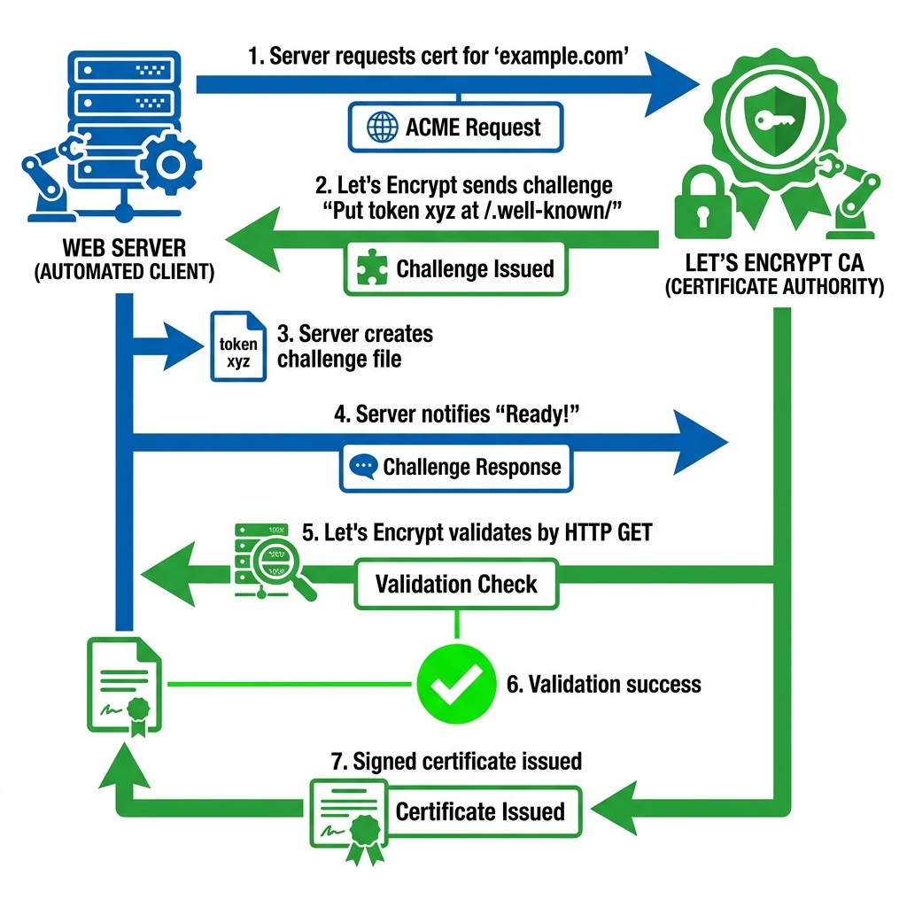

**How it works (in plain English):**

1. **Your server**: "Hey Let's Encrypt, I need a cert for example.com"
2. **Let's Encrypt**: "Prove you control example.com. Put this token at `http://example.com/.well-known/acme-challenge/xyz`"
3. **Your server**: Creates the file automatically
4. **Your server**: "Done! Check it now."
5. **Let's Encrypt**: Makes HTTP request to verify
6. **Let's Encrypt**: "Verified! Here's your signed certificate. Valid for 90 days."
7. **Your server**: Automatically installs cert and configures SSL

**Using Certbot (the popular ACME client):**

```bash
# Install Certbot
sudo apt install certbot python3-certbot-nginx

# Get and install certificate (fully automatic!)
sudo certbot --nginx -d example.com -d www.example.com

# Certbot automatically:
# 1. Proves domain ownership
# 2. Gets certificate from Let's Encrypt
# 3. Installs it in Nginx
# 4. Configures auto-renewal

# Check what certs you have
sudo certbot certificates

# Test auto-renewal
sudo certbot renew --dry-run
```

**Auto-renewal:**
Certbot adds a cron job that checks for expiring certs twice daily and renews them automatically at 60 days (well before the 90-day expiry).

```bash
# Cron job added by Certbot:
0 */12 * * * root certbot renew --quiet
```

**Why 90-day certificates?**
- ✅ Forces automation (manual renewal would be painful)
- ✅ Limits damage if private key is compromised
- ✅ Encourages good security practices
- ✅ Free (no yearly fees!)

---

## Certificate Revocation: What If a Key Is Stolen?

Certificates have an expiry date, but what if the private key gets stolen BEFORE expiry? You need to revoke it immediately.

**Three methods exist, with very different trade-offs:**

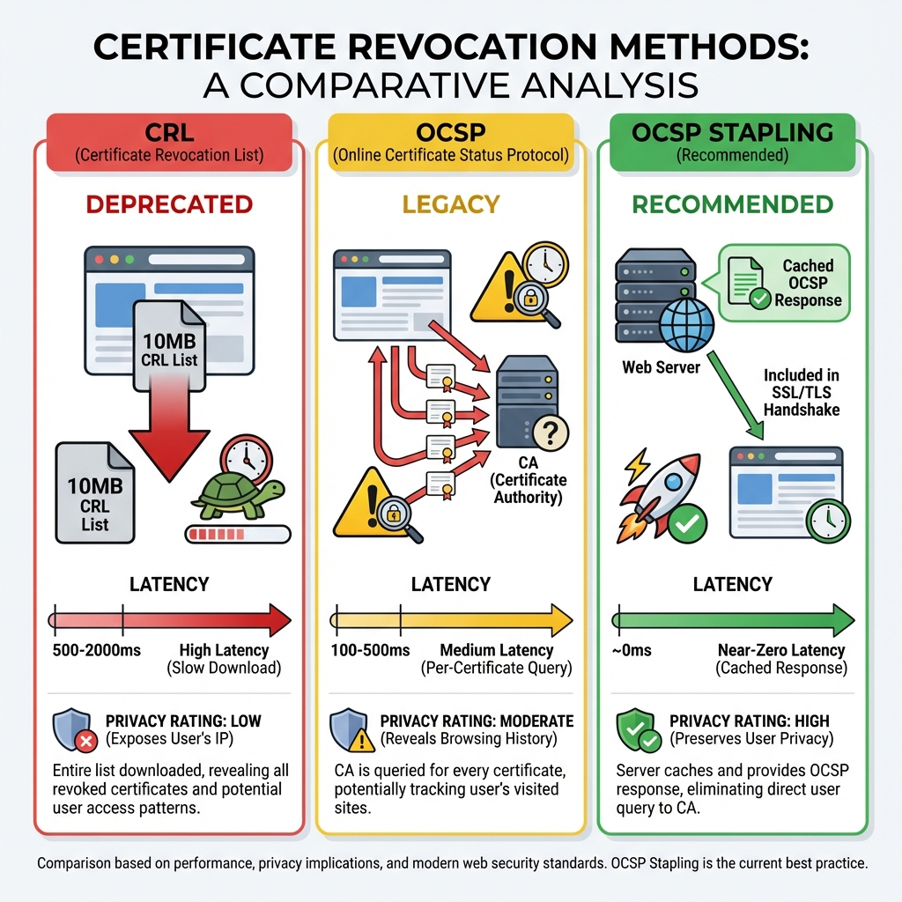

### Method 1: CRL (Certificate Revocation List) ❌ Deprecated

**How it works:**
- CA publishes a list of ALL revoked certificate serial numbers
- Browser downloads the entire list (10MB+)
- Checks if certif certificate is in the list

**Problems:**
- **Huge file**: 10MB+ download
- **Slow**: 500-2000ms latency
- **Stale**: Updated daily/weekly, not real-time
- **Status**: ❌ Nobody uses this anymore

### Method 2: OCSP (Online Certificate Status Protocol) ⚠️ Legacy

**How it works:**
- Browser asks CA: "Is certificate serial 0x123abc still valid?"
- CA responds: "Valid" or "Revoked"

**Problems:**
- **Privacy leak**: CA knows every site you visit
- **Latency**: 100-500ms per check
- **Reliability**: If OCSP server is down, what do you do?
  - Fail open (insecure): Allow connection anyway
  - Fail closed (annoying): Block all sites if OCSP is down

**Status**: ⚠️ Still used but being phased out

### Method 3: OCSP Stapling ✅ Recommended

**How it works:**
- **Server** queries OCSP for its own certificate status
- **Server** caches the signed OCSP response
- **Server** includes ("staples") the response in the TLS handshake
- **Browser** trusts the stapled response (it's signed by the CA)

**Advantages:**
- **Fast**: ~0ms (no extra round trip)
- **Private**: CA doesn't see user browsing history
- **Reliable**: Server handles OCSP failures, not browser

**Enable OCSP Stapling:**

```nginx
# Nginx
ssl_stapling on;
ssl_stapling_verify on;
ssl_trusted_certificate /path/to/chain.pem;
```

```apache
# Apache
SSLUseStapling on
SSLStaplingCache "shmcb:logs/ssl_stapling(32768)"
```

**Verify stapling is working:**
```bash
$ openssl s_client -connect example.com:443 -status | grep "OCSP"
OCSP Response Status: successful (0x0)
```

---

## Types of Certificates: Which Do You Need?

Not all certificates are created equal. Here are the four main types:

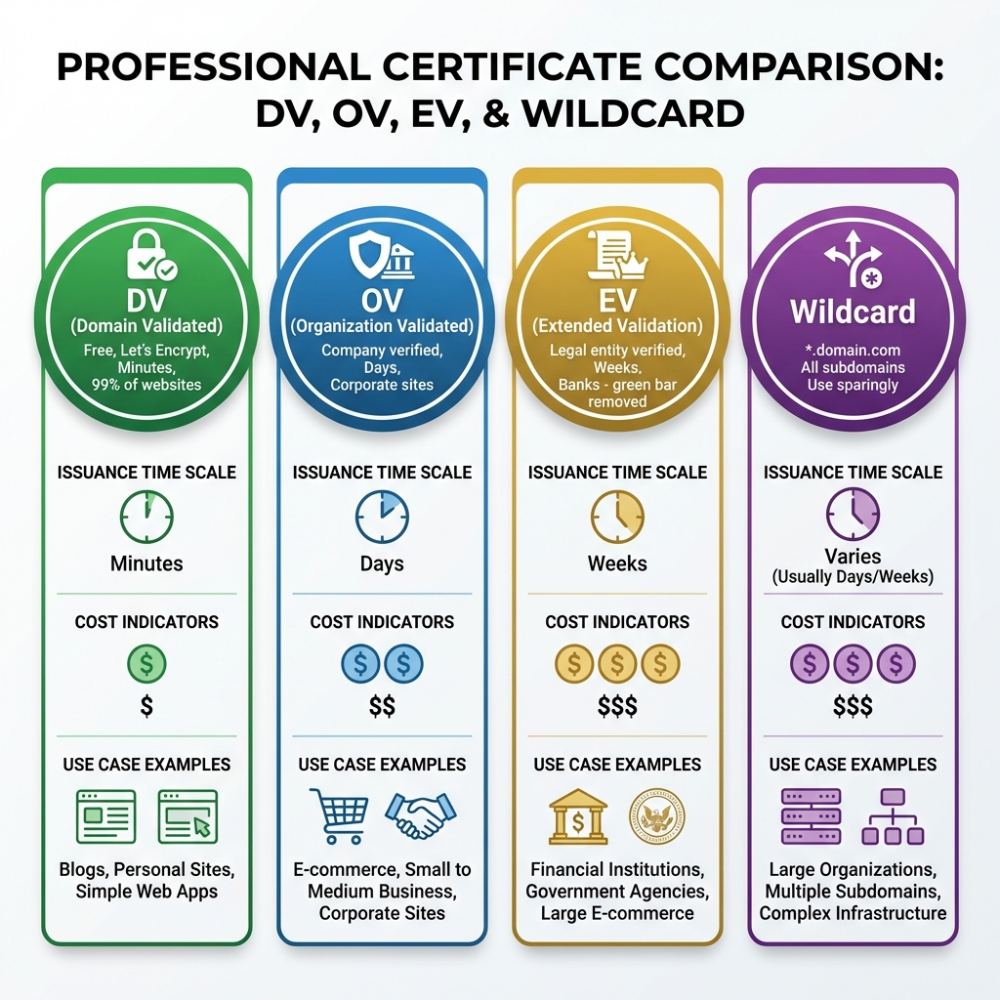

### DV (Domain Validated) ✅ Use This

**What it proves:** You control the domain (e.g., example.com)

**How to get:**
- Automated via ACME (Let's Encrypt, ZeroSSL)
- Proves domain ownership via HTTP/DNS challenge
- **Issued in**: Minutes

**Cost:** FREE

**Use for:** 99% of websites, blogs, personal sites, APIs, simple business sites

### OV (Organization Validated)

**What it proves:** You control the domain + your organization exists

**How to get:**
- CA manually verifies your company exists  
- Requires business registration documents
- **Issued in**: Days

**Cost:** $$

**Use for:** E-commerce sites, corporate sites where you want to show company name in cert

**Note:** Modern browsers don't show the organization name anymore, so the added value is minimal

### EV (Extended Validation) 

**What it proves:** You control the domain + extensive legal entity verification

**How to get:**
- Extensive manual verification (legal documents, phone calls, business registration)
- CA verifies you're a real legal entity
- **Issued in**: Weeks

**Cost:** $$$

**Use for:** Banks, financial institutions, government

**The truth:** The "green bar" with company name that EV certs used to show in browsers **was removed** (Chrome removed it in 2019). Now EV is mostly vanity—it doesn't provide much user-visible benefit.

### Wildcard Certificates (*.example.com)

**What it covers:** All subdomains under a domain

**Example:** `*.example.com` covers:
- `www.example.com`
- `blog.example.com`
- `mail.example.com`
- `api.example.com`
- etc.

**When to use:**
- Large organizations with many subdomains
- SaaS with customer subdomains (`customer1.saas.com`, `customer2.saas.com`)

**Security concern:**
- If the wildcard cert's private key is compromised, ALL subdomains are vulnerable
- Use sparingly and protect the private key carefully

**Cost:** Same as regular (free with Let's Encrypt!)

---

## Common Certificate Problems and Fixes

### Problem 1: Incomplete Certificate Chain

**Symptom:** Works on desktop, fails on Android/older devices

**Cause:** Server only sends the leaf certificate, not the intermediate certificates

**What's happening:**
```
Your server sends:     [Leaf Cert for example.com]
Browser needs:         [Leaf] ← [Intermediate] ← [Root]
```

Desktop browsers cache intermediate certs, so they work. Mobile browsers don't, so they fail.

**The fix:** Always send the "full chain"

```nginx
# Nginx - use fullchain.pem, not just cert.pem
ssl_certificate /path/to/fullchain.pem;  # ✅ Contains leaf + intermediates
# NOT:
# ssl_certificate /path/to/cert.pem;  # ❌ Leaf only
```

With Certbot, use `fullchain.pem`:
```bash
/etc/letsencrypt/live/example.com/
  ├── cert.pem          # ❌ Leaf only
  ├── chain.pem         # ❌ Intermediates only  
  ├── fullchain.pem     # ✅ Use this! (Leaf + intermediates)
  └── privkey.pem       # Private key
```

### Problem 2: Using Self-Signed Certificates in Production

**Never do this.** Self-signed certs show scary browser warnings:

```
⚠️ Your connection is not private
Attackers might be trying to steal your information...
```

Users trained to click "Proceed anyway" = security disaster

**Use Let's Encrypt instead**—it's free and automated!

**Self-signed is OK for:**
- Local development (localhost)
- Internal corporate intranet (with custom root CA installed on all devices)

---

## Certificate Best Practices Checklist

**Automation:**
- [ ] ✅ Use Let's Encrypt + Certbot for auto-renewal
- [ ] ✅ Set calendar reminder 30 days before expiry (backup plan)
- [ ] ✅ Monitor certificate expiry (UptimeRobot, StatusCake)

**Configuration:**
- [ ] ✅ Send full chain (leaf + intermediates), not just leaf cert
- [ ] ✅ Enable OCSP Stapling
- [ ] ✅ Use strong cipher suites (TLS 1.3, TLS 1.2 only)

**Security:**
- [ ] ✅ Keep private key permissions strict: `chmod 600 privkey.pem`
- [ ] ✅ Never commit private keys to Git
- [ ] ✅ Store private keys encrypted at rest
- [ ] ✅ Backup private keys securely (encrypted, offline)

**Modern Best Practices:**
- [ ] ✅ Use ECDSA P-256 instead of RSA 2048 (faster, smaller, same security)
- [ ] ✅ Use SANs (Subject Alternative Names), not just CN (Common Name)
- [ ] ✅ Certificate Transparency: Ensure cert is logged (required by Chrome)

**Testing:**
- [ ] ✅ Test with SSL Labs: https://www.ssllabs.com/ssltest/
  - Aim for A+ rating
- [ ] ✅ Test renewal process in staging before prod
- [ ] ✅ Verify on multiple browsers and devices

**Don'ts:**
- [ ] ❌ Don't use self-signed certs in production
- [ ] ❌ Don't use wildcard certs unless necessary
- [ ] ❌ Don't pay for DV certificates (Let's Encrypt is free!)
- [ ] ❌ Don't ignore expiry warnings

---

## Going Beyond: Mutual TLS (Both Sides Prove Identity)

Standard TLS only validates the server (the website proves it's really google.com). But what if the server also wants to know WHO the client is?

**That's Mutual TLS (mTLS).**

**Common in:**
- Microservices (Service A calling Service B)
- Zero Trust architectures
- Banking APIs
- Enterprise internal systems

**How it works:**

1.  **Service A (Client)** Hello.
2.  **Service B (Server)** Hello + "Send me YOUR certificate".
3.  **Service A** Sends `ServiceA.crt`.
4.  **Service B** Validates `ServiceA.crt` against Internal CA.
5.  **Result**: Service B knows exactly who is calling. Strongest form of API Authentication.

---

## What Can Go Wrong? Common TLS/SSL Failures

### Scenario A: Certificate Expired
**Symptom**: Users see full-screen browser warning, site abandonment.
**Cause**: Certificate validity period ended, admin forgot to renew.
**Mechanism**: Browser checks NotAfter timestamp, rejects expired certificates.

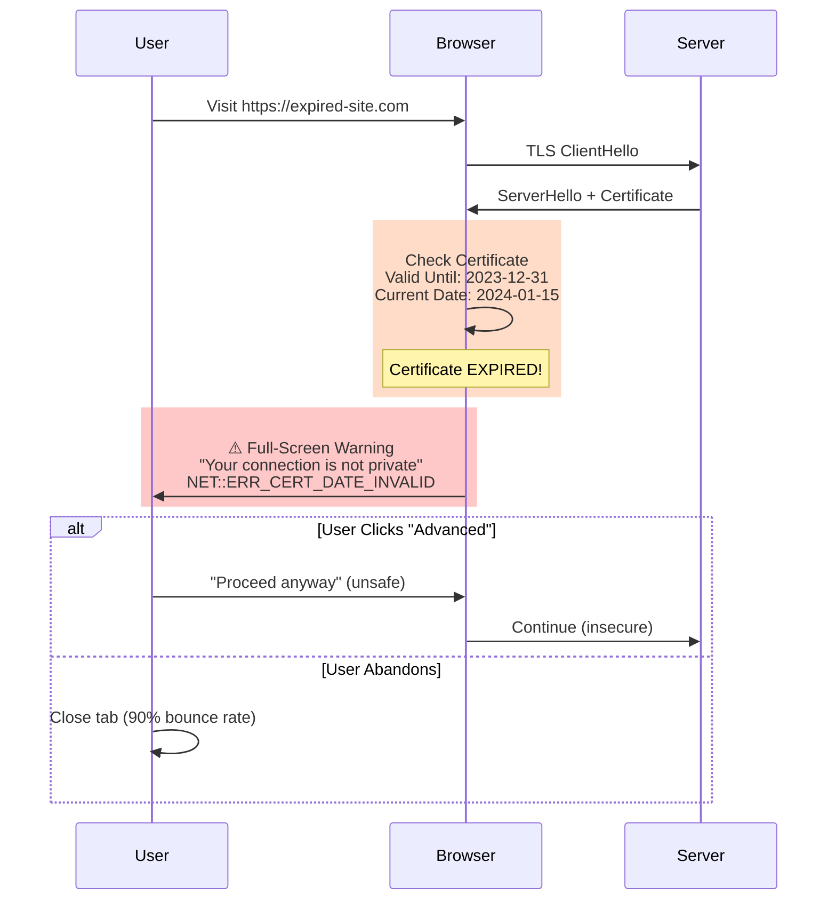

**The Fix**:
- **Automate Renewal**: Use Let's Encrypt + Certbot (auto-renews every 60 days)
- **Monitoring**: Alert at 30 days before expiry
- **Calendar Reminders**: If manual, set 3 reminders (60d, 30d, 7d)
- **Staging Tests**: Test renewal process in staging environment
- **Backup Certs**: Keep backup cert ready for emergency

---

### Scenario B: Mixed Content
**Symptom**: Page loads over HTTPS but resources blocked, insecure icon shown.
**Cause**: HTTPS page loading HTTP resources (images, scripts, CSS).
**Mechanism**: Browser blocks insecure content to prevent downgrade attacks.

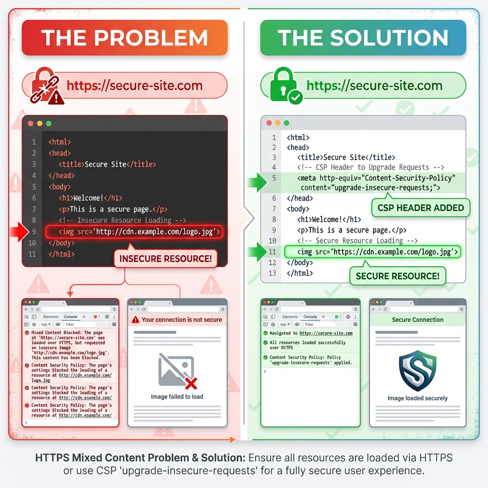

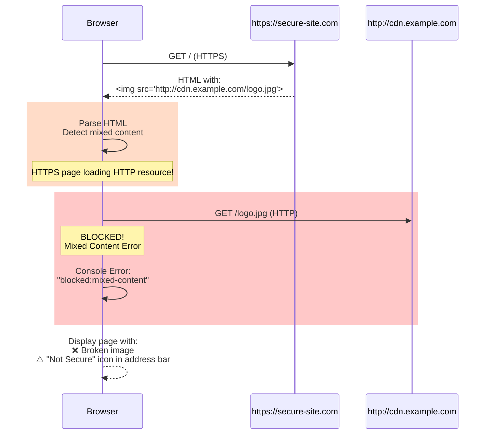

**The Fix**:
- **Use HTTPS URLs**: Change all `http://` to `https://` in HTML/CSS/JS
- **Protocol-Relative URLs**: Use `//cdn.example.com/logo.jpg` (inherits page protocol)
- **Content-Security-Policy**: Add `upgrade-insecure-requests` directive
- **Automated Scanning**: Use tools to detect mixed content before deployment
- **CDN Configuration**: Ensure CDN supports HTTPS

---

### Scenario C: Man-in-the-Middle (MitM)
**Attack**: Attacker intercepts and proxies traffic between client and server.
**Defense**: TLS itself defends this, AS LONG AS the attacker cannot forge a CA-signed cert.
**HSTS (Strict Transport Security)**: Tells browser "Always use HTTPS", preventing downgrade attacks.

**The Fix**:
- **HSTS Header**: `Strict-Transport-Security: max-age=31536000; includeSubDomains; preload`
- **Certificate Pinning**: Pin expected certificate (mobile apps)
- **CAA Records**: DNS record limiting which CAs can issue certs
- **Monitor CT Logs**: Certificate Transparency logs show all issued certs

---

## Making TLS Fast: Performance Optimizations

| Optimization | Description | Impact |
| :--- | :--- | :--- |
| **TLS 1.3** | Use strictly 1.3. | 1-RTT handshake: ~100ms (vs TLS 1.2: 2-RTT ~200ms on 100ms latency). |
| **Session Resumption** | Reuse previous session keys (0-RTT). | 0ms handshake for returning users (instant reconnection). |
| **OCSP Stapling** | Server sends revocation status *with* cert. | Saves ~100ms (browser doesn't query CA). Cert validation: ~5-10ms total. |
| **ECC Keys** | Use Elliptic Curve (ECDSA) instead of RSA. | ECDSA P-256: ~0.3ms sign, ~0.7ms verify. RSA 2048: ~1.5ms sign, ~0.1ms verify. |
| **Keep-Alive** | Reuse TCP connection. | Avoid TCP 3-way handshake (~150ms) + TLS handshake (~100ms) on each request. |

---

## TLS Trade-offs: What You Should Know

| Constraint | Limit | Why? |
| :--- | :--- | :--- |
| **CPU Overhead** | Low | Modern CPUs have AES-NI hardware acceleration. Encryption cost is negligible today. |
| **Handshake Latency** | High | The initial setup takes time (RTT). Hurts short-lived connections. (Use Keep-Alive). |
| **Inspection** | Hard | Debugging encrypted traffic (Wireshark) requires the private key or session secrets. |

---

## When Do You Need TLS?

| Scenario | Verdict | Why? |
| :--- | :--- | :--- |
| **Public Website** | **REQUIRED** | SEO penalty and Security warning if missed. |
| **Internal API** | **REQUIRED** | internal networks are essentially public (Zero Trust). |
| **Microservices** | **mTLS** | For identity + encryption. |
| **Legacy Systems** | **TLS Termination** | Terminate TLS at Load Balancer/Gateway, talk HTTP to legacy backend (in secure VPC). |

---

## Production Best Practices: TLS/SSL Checklist

1.  [ ] **Disable TLS 1.0/1.1**: They are broken. Support only 1.2 and 1.3.
2.  [ ] **Use HSTS**: Set header `Strict-Transport-Security: max-age=31536000; includeSubDomains`.
3.  [ ] **Automate Renewal**: Use ACME (Certbot). Humans forget.
4.  [ ] **Strong Ciphers**: Config `ssl_ciphers` to exclude weak/export suites.
5.  [ ] **Wildcards**: Use carefully. A compromised `*.corp.com` key compromises ALL subdomains.
6.  [ ] **OCSP Stapling**: Enable it on Nginx/HAProxy.
7.  [ ] **CAA Records**: DNS record limiting which CAs can issue certs for you.
8.  [ ] **Monitoring**: Alert 30 days before expiry.
9.  [ ] **Redirect HTTP**: Permanent 301 redirect HTTP -> HTTPS.
10. [ ] **Test**: Use Qualys SSL Labs to verify grade (Aim for A+).
