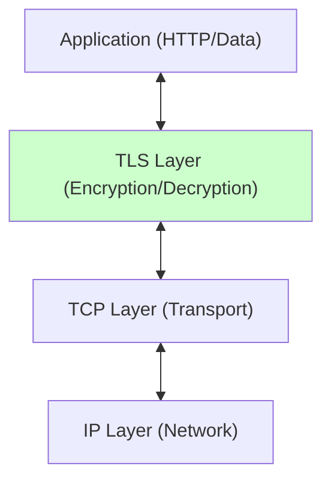
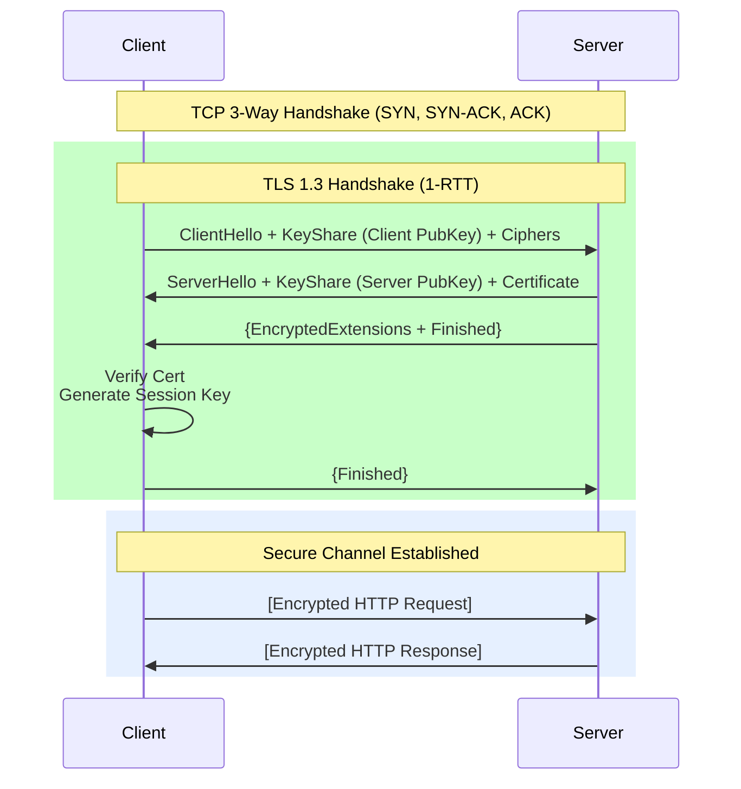
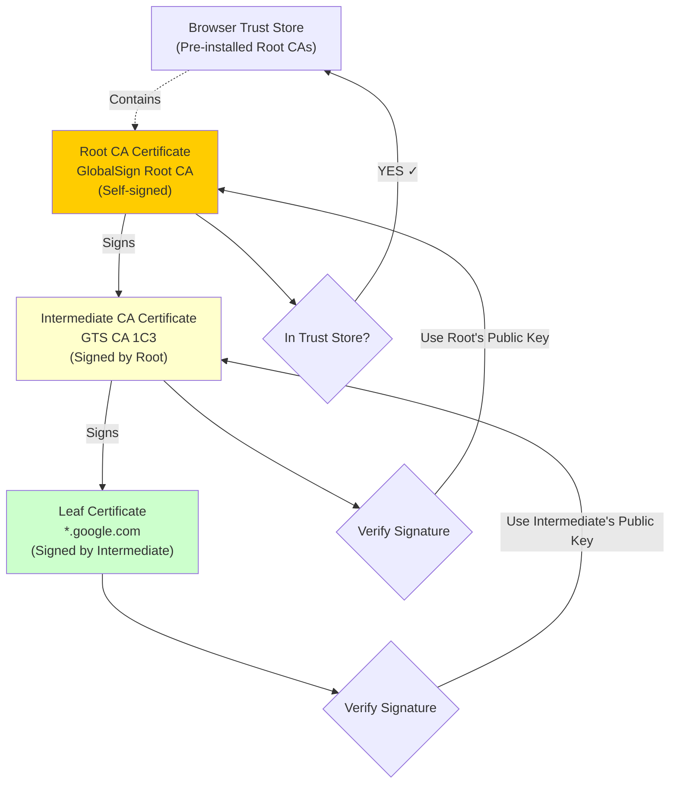
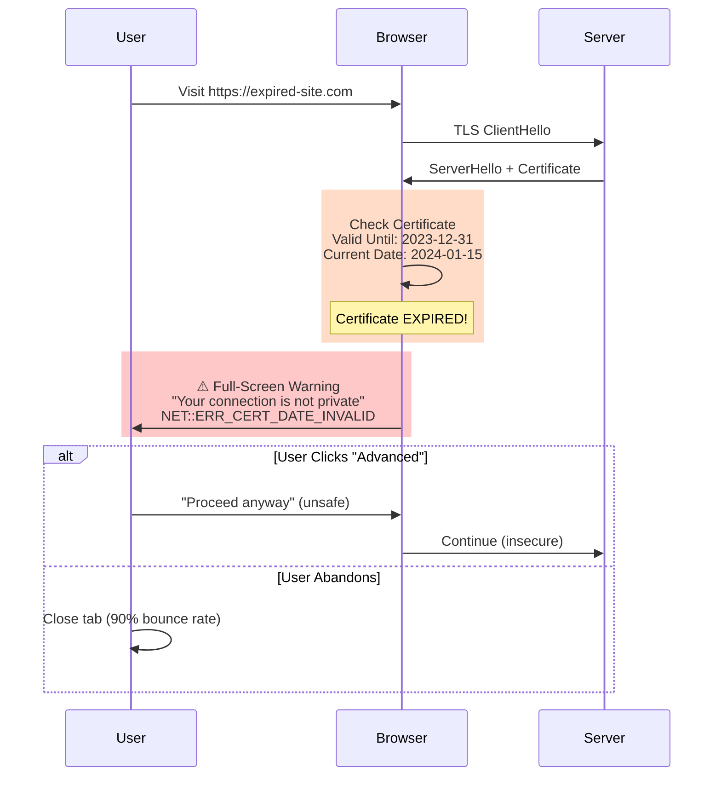
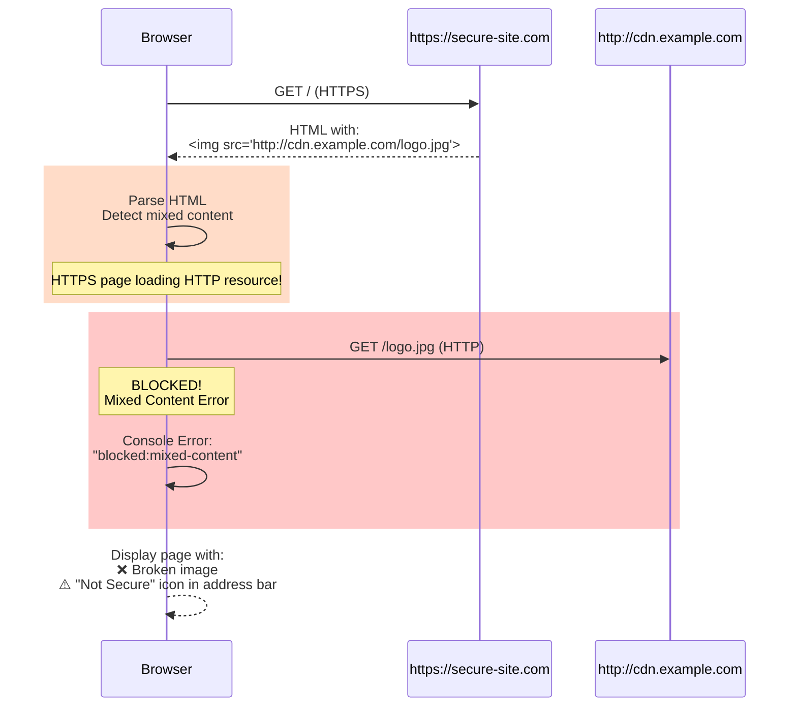

# 08. TLS & SSL: Transport Layer Security

## 1. Introduction

**TLS (Transport Layer Security)**, the successor to SSL, is the cryptographic protocol that encrypts data between a client (browser) and a server.

**HTTPS** = **HTTP** over **TLS**.

**Why It Matters**:
-   **Confidentiality**: Encrypt content so eavesdroppers (WiFi sniffers) see garbage.
-   **Integrity**: Ensure data wasn't modified in transit.
-   **Authentication**: Prove the server is who it claims to be (via Certificates).

**TLS 1.3**: The modern standard (faster, safer). Removed legacy crypto (SHA1, RC4) and reduced handshake latency.

---

## How Does TLS Fit into the Web Stack?

TLS sits between your application data (HTTP) and the low-level network transport (TCP/IP).

### Components
1.  **Cipher Suite**: Algorithms for key exchange, encryption, and hashing (e.g., `TLS_AES_128_GCM_SHA256`).
2.  **Certificate**: Public key + Identity signed by a CA.
3.  **Handshake**: The negotiation phase to agree on keys.
4.  **Record Protocol**: The data transfer phase (encrypted).

---

## The TLS Handshake: How Encryption Actually Starts

When you visit an HTTPS website, your browser and the server need to agree on encryption keys. This negotiation is called the **TLS handshake**.

**TLS 1.3 (Modern):** Optimized to just **1 round-trip** (super fast)
**TLS 1.2 (Legacy):** Required **2 round-trips** (slower)

**Key Difference vs 1.2**:
-   Client sends its "guess" for key exchange (KeyShare) immediately.
-   Server responds immediately with its key share.
-   Keys are derived. Encryption starts *halfway* through the first round trip.

---

## But Wait—How Do You Know It's Really Google?

This is where certificates come in. **Anyone** can encrypt data. The real question is: **Are you talking to the real google.com or an imposter?**

### The Chain of Trust

Your browser trusts google.com through a chain of digital signatures:

**Validation Steps**:
1.  Browser checks: "Did `Intermediate` sign `Leaf`?" (Verify signature using Intermediate's public key).
2.  Browser checks: "Did `Root` sign `Intermediate`?" (Verify signature using Root's public key).
3.  Browser checks: "Is `Root` in my local Trust Store?" (Pre-installed by Apple/Microsoft/Mozilla).
4.  **Chain Valid** → Connection trusted.

---

## Going Beyond: Mutual TLS (Both Sides Prove Identity)

Standard TLS only validates the server (the website proves it's really google.com). But what if the server also wants to know WHO the client is?

**That's Mutual TLS (mTLS).**

**Common in:**
- Microservices (Service A calling Service B)
- Zero Trust architectures
- Banking APIs
- Enterprise internal systems

**How it works:**

1.  **Service A (Client)** Hello.
2.  **Service B (Server)** Hello + "Send me YOUR certificate".
3.  **Service A** Sends `ServiceA.crt`.
4.  **Service B** Validates `ServiceA.crt` against Internal CA.
5.  **Result**: Service B knows exactly who is calling. Strongest form of API Authentication.

---

## What Can Go Wrong? Common TLS/SSL Failures

### Scenario A: Certificate Expired
**Symptom**: Users see full-screen browser warning, site abandonment.
**Cause**: Certificate validity period ended, admin forgot to renew.
**Mechanism**: Browser checks NotAfter timestamp, rejects expired certificates.

**The Fix**:
- **Automate Renewal**: Use Let's Encrypt + Certbot (auto-renews every 60 days)
- **Monitoring**: Alert at 30 days before expiry
- **Calendar Reminders**: If manual, set 3 reminders (60d, 30d, 7d)
- **Staging Tests**: Test renewal process in staging environment
- **Backup Certs**: Keep backup cert ready for emergency

---

### Scenario B: Mixed Content
**Symptom**: Page loads over HTTPS but resources blocked, insecure icon shown.
**Cause**: HTTPS page loading HTTP resources (images, scripts, CSS).
**Mechanism**: Browser blocks insecure content to prevent downgrade attacks.

**The Fix**:
- **Use HTTPS URLs**: Change all `http://` to `https://` in HTML/CSS/JS
- **Protocol-Relative URLs**: Use `//cdn.example.com/logo.jpg` (inherits page protocol)
- **Content-Security-Policy**: Add `upgrade-insecure-requests` directive
- **Automated Scanning**: Use tools to detect mixed content before deployment
- **CDN Configuration**: Ensure CDN supports HTTPS

---

### Scenario C: Man-in-the-Middle (MitM)
**Attack**: Attacker intercepts and proxies traffic between client and server.
**Defense**: TLS itself defends this, AS LONG AS the attacker cannot forge a CA-signed cert.
**HSTS (Strict Transport Security)**: Tells browser "Always use HTTPS", preventing downgrade attacks.

**The Fix**:
- **HSTS Header**: `Strict-Transport-Security: max-age=31536000; includeSubDomains; preload`
- **Certificate Pinning**: Pin expected certificate (mobile apps)
- **CAA Records**: DNS record limiting which CAs can issue certs
- **Monitor CT Logs**: Certificate Transparency logs show all issued certs

---

## Making TLS Fast: Performance Optimizations

| Optimization | Description | Impact |
| :--- | :--- | :--- |
| **TLS 1.3** | Use strictly 1.3. | 1-RTT handshake: ~100ms (vs TLS 1.2: 2-RTT ~200ms on 100ms latency). |
| **Session Resumption** | Reuse previous session keys (0-RTT). | 0ms handshake for returning users (instant reconnection). |
| **OCSP Stapling** | Server sends revocation status *with* cert. | Saves ~100ms (browser doesn't query CA). Cert validation: ~5-10ms total. |
| **ECC Keys** | Use Elliptic Curve (ECDSA) instead of RSA. | ECDSA P-256: ~0.3ms sign, ~0.7ms verify. RSA 2048: ~1.5ms sign, ~0.1ms verify. |
| **Keep-Alive** | Reuse TCP connection. | Avoid TCP 3-way handshake (~150ms) + TLS handshake (~100ms) on each request. |

---

## TLS Trade-offs: What You Should Know

| Constraint | Limit | Why? |
| :--- | :--- | :--- |
| **CPU Overhead** | Low | Modern CPUs have AES-NI hardware acceleration. Encryption cost is negligible today. |
| **Handshake Latency** | High | The initial setup takes time (RTT). Hurts short-lived connections. (Use Keep-Alive). |
| **Inspection** | Hard | Debugging encrypted traffic (Wireshark) requires the private key or session secrets. |

---

## When Do You Need TLS?

| Scenario | Verdict | Why? |
| :--- | :--- | :--- |
| **Public Website** | **REQUIRED** | SEO penalty and Security warning if missed. |
| **Internal API** | **REQUIRED** | internal networks are essentially public (Zero Trust). |
| **Microservices** | **mTLS** | For identity + encryption. |
| **Legacy Systems** | **TLS Termination** | Terminate TLS at Load Balancer/Gateway, talk HTTP to legacy backend (in secure VPC). |

---

## Production Best Practices: TLS/SSL Checklist

1.  [ ] **Disable TLS 1.0/1.1**: They are broken. Support only 1.2 and 1.3.
2.  [ ] **Use HSTS**: Set header `Strict-Transport-Security: max-age=31536000; includeSubDomains`.
3.  [ ] **Automate Renewal**: Use ACME (Certbot). Humans forget.
4.  [ ] **Strong Ciphers**: Config `ssl_ciphers` to exclude weak/export suites.
5.  [ ] **Wildcards**: Use carefully. A compromised `*.corp.com` key compromises ALL subdomains.
6.  [ ] **OCSP Stapling**: Enable it on Nginx/HAProxy.
7.  [ ] **CAA Records**: DNS record limiting which CAs can issue certs for you.
8.  [ ] **Monitoring**: Alert 30 days before expiry.
9.  [ ] **Redirect HTTP**: Permanent 301 redirect HTTP -> HTTPS.
10. [ ] **Test**: Use Qualys SSL Labs to verify grade (Aim for A+).
