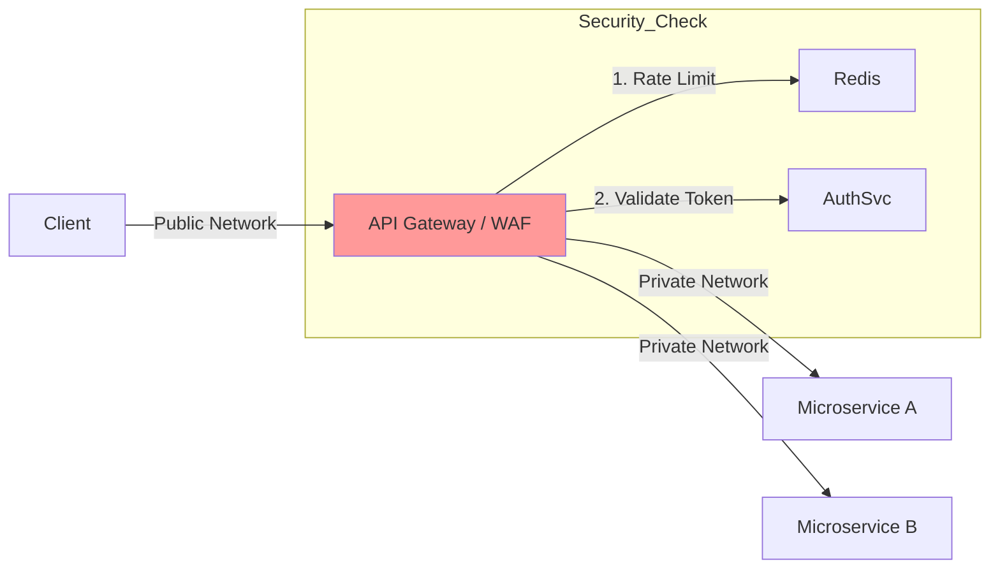
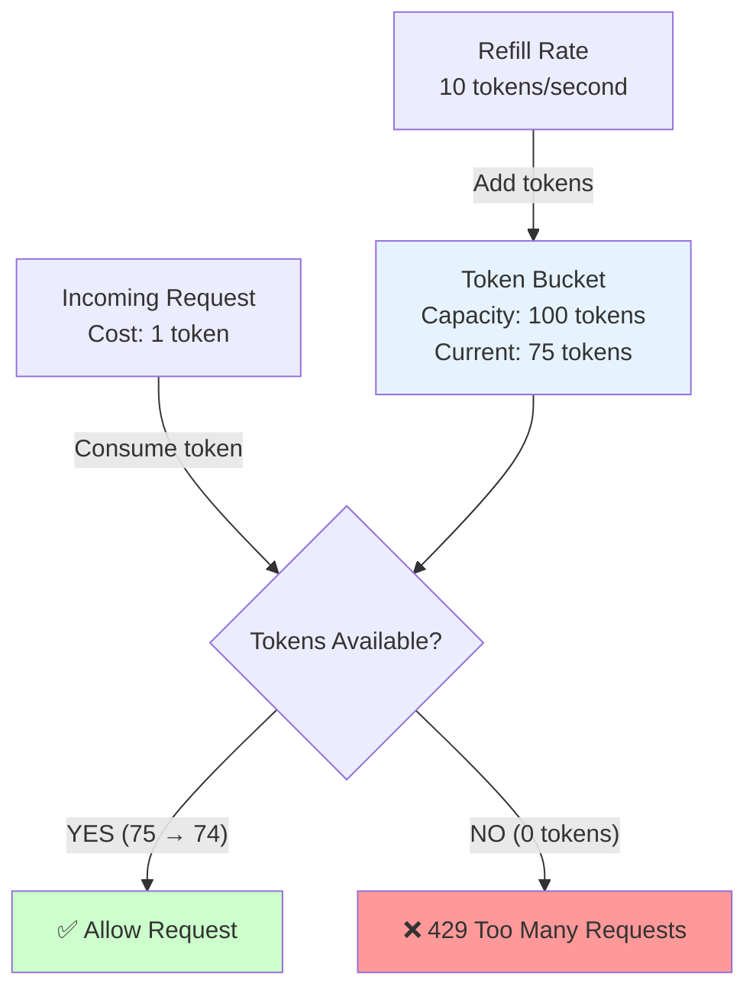
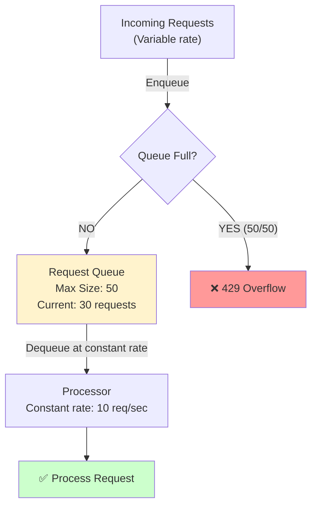
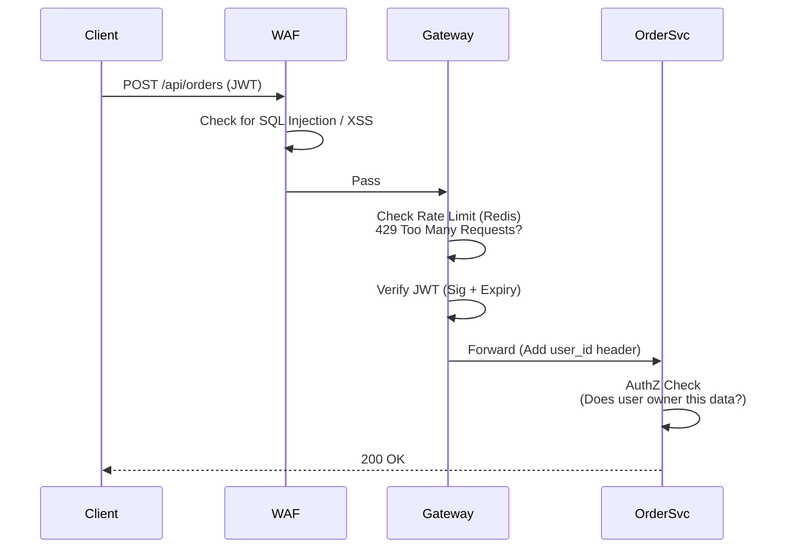
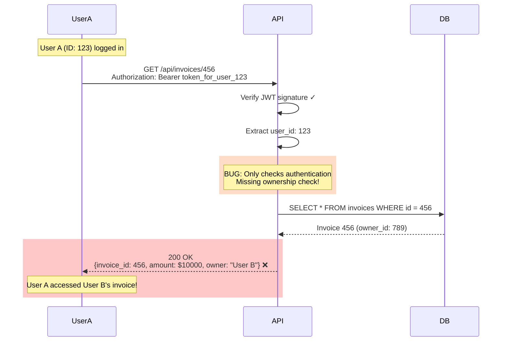
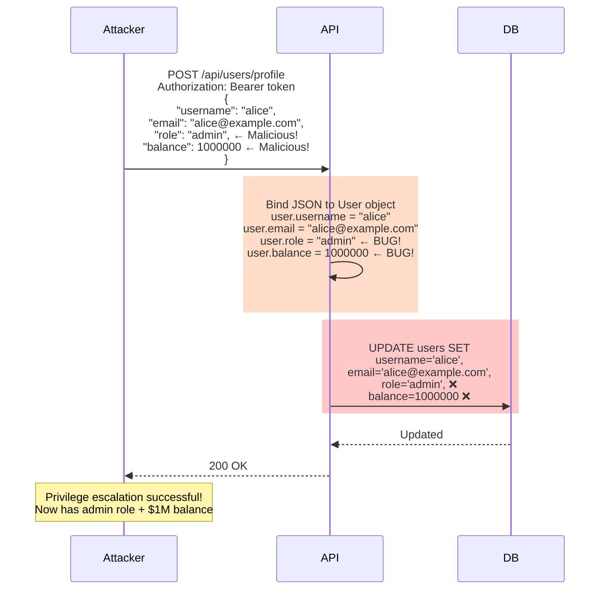

# 09. API Security

## 1. Introduction

**API Security** focuses on protecting application interfaces (REST, GraphQL) from unauthorized access and attacks. APIs are the exposed nerves of your application logic.

**Top Threats (OWASP API Top 10)**:
1.  **Broken Object Level Auth (BOLA)**: IDOR (Accessing `/users/5` as user 4).
2.  **Broken Authentication**: Weak implementation.
3.  **Unrestricted Resource Consumption**: DoS / Rate limit issues.

---

## 2. Core Architecture

The **API Gateway** Pattern is the standard defense.



### Defense in Depth Layers
1.  **Edge**: WAF (Web Application Firewall) - Blocks SQLi, XSS, bad bots.
2.  **Gateway**: Authentication, Rate Limiting, Throttling.
3.  **Service**: Authorization (BOLA checks), Business Logic validation.

---

## 3. How It Works: Authentication Strategies

| Method | Best For | Security |
| :--- | :--- | :--- |
| **API Key** | Public Data / S2S | ⭐ (Weak - easily stolen) |
| **Bearer Token (JWT)** | User Actions | ⭐⭐⭐ (Good - standard) |
| **HMAC Signature** | Webhooks / High Security | ⭐⭐⭐⭐⭐ (Proof of possession) |
| **mTLS** | Internal S2S | ⭐⭐⭐⭐⭐ (Strongest) |

### HMAC Signature (Deep Dive)
Used by AWS, Stripe, GitHub Webhooks.
Client sends: `Message` + `Hash(Message + Secret)`.
1.  Server receives Message.
2.  Server knows Secret.
3.  Server computes Hash.
4.  Matches? Accepted.

*Prevents tampering in transit without encryption.*

---

## 4. Deep Dive: Rate Limiting Algorithms

Protecting availability.

### 1. Token Bucket



-   Bucket holds N tokens (capacity: 100).
-   Refills at R tokens/sec (10/sec).
-   Request costs 1 token.
-   **Pros**: Allows bursts (can use all 100 tokens instantly).
-   **Cons**: Complex to implement distributed (need Redis atomic operations).

### 2. Leaky Bucket



-   Queue processes requests at constant rate (10/sec).
-   Overflows if queue full.
-   **Pros**: Smooths out traffic (good for protecting databases).
-   **Cons**: No bursts allowed (even if system has capacity).

### 3. Sliding Window

```mermaid
gantt
    title Sliding Window Rate Limiting (100 req/min)
    dateFormat ss
    axisFormat %S
    
    section Window
    60-second window :active, 00, 60s
    
    section Requests
    5 requests :done, 00, 5s
    3 requests :done, 15, 3s
    2 requests :done, 30, 2s
    4 requests :done, 45, 4s
    
    section Current (50s)
    Total in window 14 requests :milestone, 50, 0s
    New request at 50s ALLOWED (15/100) :crit, 50, 1s
```



-   Calculate rate based on previous window weight.
-   **Formula**: `current_window_count + (previous_window_count * overlap_percentage)`
-   **Best Balance**: Prevents stampeding, allows some bursting.
-   **Example**: At 00:50, count requests from 23:50-00:50 (60-second window).

### 4. Fixed Window (Not Recommended)
-   "100 reqs per minute".
-   Reset at `:00`.
-   **Cons**: "Stampeding" (User sends 100 at 00:59 and 100 at 01:00 = 200 in 2 seconds).

---

## 5. End-to-End Walkthrough: Secure API Call

Scenario: Consumer accessing `/api/orders`.



---

## 6. Failure Scenarios

### Scenario A: BOLA (Broken Object Level Authorization)
**Symptom**: User accesses resources belonging to other users.
**Cause**: API checks authentication but not resource ownership.
**Mechanism**: Missing authorization check in service layer.



**The Fix**:
```sql
-- WRONG: No ownership check
SELECT * FROM invoices WHERE id = 456

-- CORRECT: Enforce ownership
SELECT * FROM invoices WHERE id = 456 AND owner_id = current_user_id
```
- **Service Layer Check**: `if (invoice.owner_id != current_user.id) return 403`
- **Database Query**: Always include `WHERE user_id = current_user`
- **Testing**: Automated tests for BOLA ("Can User A access User B's data?")
- **Code Review**: Flag any query without user_id filter

---

### Scenario B: Mass Assignment
**Symptom**: Users escalate privileges by sending unexpected fields.
**Cause**: API blindly binds JSON to object without field whitelisting.
**Mechanism**: Attacker includes sensitive fields in request payload.



**The Fix**:
- **Whitelist Fields**: Only allow specific fields
  ```javascript
  const allowedFields = ['username', 'email', 'bio'];
  const updateData = pick(req.body, allowedFields);
  ```
- **Use DTOs**: Data Transfer Objects with explicit field mapping
- **Blacklist Sensitive**: Explicitly ignore `role`, `balance`, `is_admin`
- **Validation**: Reject requests with unexpected fields
- **Testing**: Send malicious payloads in security tests

---

### Scenario C: Replay Attack
**Attack**: Attacker intercepts "Pay $10" request. Sends it 100 times.
**Fix**: Use **Idempotency Keys** (Header `Idempotency-Key: uuid`). Server tracks "Have I seen this UUID?". If yes, return cached response.

---

## 7. Performance Tuning

| Strategy | Description | Impact |
| :--- | :--- | :--- |
| **Rate Limit Overhead** | Redis-based rate limiting. | <1ms per request (Redis GET + INCR). |
| **HMAC Signature** | Compute HMAC-SHA256. | ~0.2ms computation time. |
| **Token Bucket Refill** | Typical refill rate. | 10 tokens/second (configurable). |
| **API Gateway Latency** | Added latency per layer. | 5-15ms (WAF + Gateway + Auth checks). |
| **Caching** | Cache GET requests at Gateway/CDN. | Don't hit backend for static data. Reduces load by 60-80%. |
| **BFF Pattern** | **Backend For Frontend**. Aggregate 3 calls into 1. | Reduces chattiness over WAN. |
| **Compression** | Gzip/Brotli responses. | JSON is verbose. 70-80% size reduction. |
| **Key Caching** | Cache OAuth public keys. | Speeds up JWT validation from ~100ms to <1ms. |

---

## 8. Constraints & Limitations

| Constraint | Limit | Why? |
| :--- | :--- | :--- |
| **Latency** | +10-50ms | Every layer (WAF + Gateway + Auth) adds hops. |
| **Statelessness** | Required | APIs scale horizontally. Sticky sessions break this. |
| **Versioning** | Hard | Supporting v1, v2, v3 simultaneously is maintenance debt. |

---

## 9. When to Use?

| Scenario | Strategy |
| :--- | :--- |
| **Public Read API** | API Key (Analytics/Tracking). |
| **User Data API** | OAuth2 (JWT). |
| **Payments/Critical** | Idempotency Keys + HMAC Signatures. |
| **Internal S2S** | mTLS. |

---

## 10. Production Checklist

1.  [ ] **HTTPS Only**: Block HTTP.
2.  [ ] **Rate Limit**: Default strict limit per IP. Authenticated limits per User.
3.  [ ] **Input Validation**: Validate ALL params types/ranges. Fail fast.
4.  [ ] **Output Filtering**: Strip internals (`_id`, `__v`, `password_hash`) from responses.
5.  [ ] **CORS**: Strict `Access-Control-Allow-Origin`. No `*` in prod.
6.  [ ] **Security Headers**: HSTS, X-Content-Type-Options.
7.  [ ] **Error Handling**: Return generic 500. Don't leak stack traces or DB schema info.
8.  [ ] **Logging**: Log RequestID. Redact PII/Tokens.
9.  [ ] **BOLA Check**: Enforce resource ownership checks in code.
10. [ ] **Scanning**: Run automated API security scanners (DAST).
