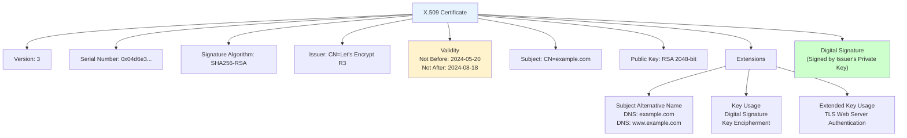
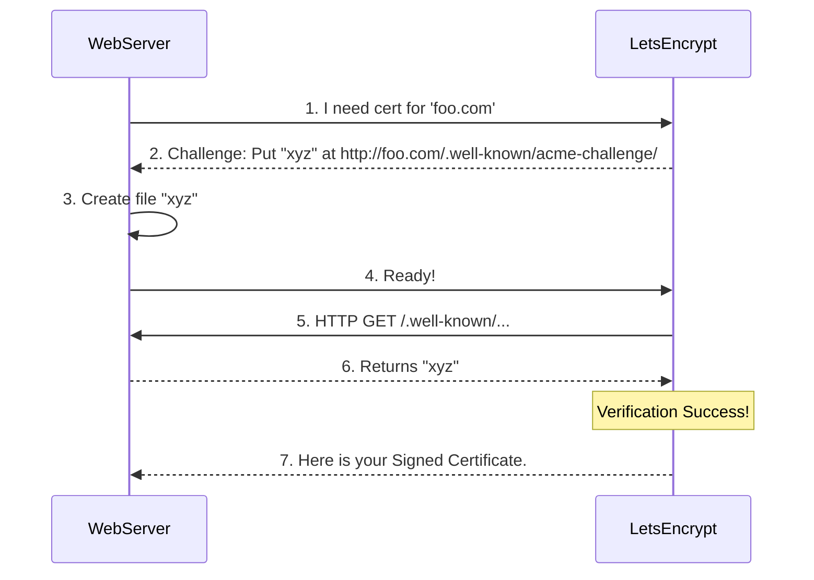
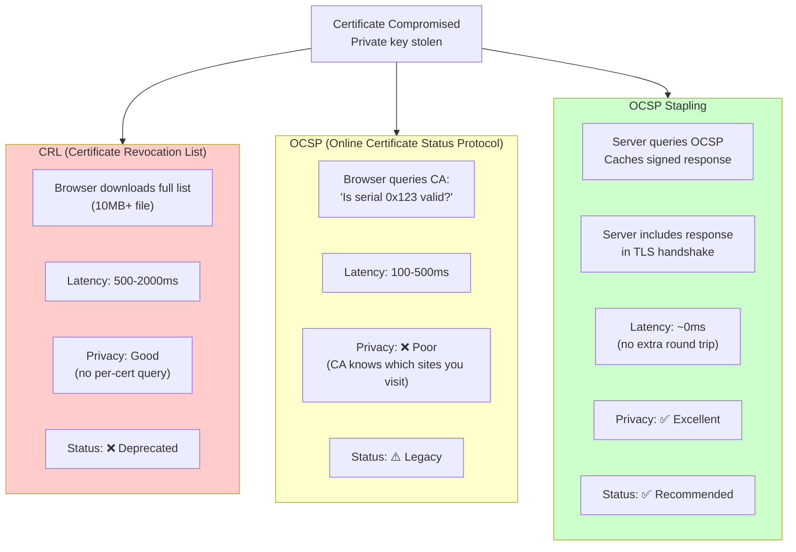

# 10. Digital Certificates: PKI & Trust

## 1. Introduction

**Digital Certificates** are the passports of the internet. They cryptographically bind an **Identity** (e.g., `google.com` or `Alice`) to a **Public Key**.

**PKI (Public Key Infrastructure)** is the system of hardware, software, and rules that manages these certificates.

**Why It Matters**: Without certificates, you could encrypt data to `google.com`, but you wouldn't know if you were talking to Google or a hacker. Certificates solve the **Authentication** problem in encryption.

---

## 2. Core Architecture

The "Chain of Trust" is the foundation of PKI.


### Components
1.  **CA (Certificate Authority)**: Trusted 3rd party (DigiCert, Let's Encrypt).
2.  **Root Certificate**: The "Trust Anchor", self-signed, installed deeply in OS/Browser.
3.  **Leaf Certificate**: The end-user cert (website).

---

## 3. How It Works: Issuance & Validation

### Requesting a Cert (CSR)
1.  **Admin** generates Private/Public Key pair.
2.  **Admin** creates **CSR (Certificate Signing Request)** containing:
    -   Common Name (`anmol.com`)
    -   Public Key
    -   Organization Info
3.  **CA** verifies admin owns `anmol.com` (DNS check / HTTP check).
4.  **CA** signs the CSR with its *own* Private Key.
5.  **Result**: A Signed Certificate.

### Validating a Cert
Does your browser trust `anmol.com`?
1.  Browser reads Cert. Sees "Issuer: Let's Encrypt R3".
2.  Browser reads "Let's Encrypt R3" Cert. Sees "Issuer: ISRG Root X1".
3.  Browser checks local **Trust Store**. "Is ISRG Root X1 trusted?". YES.
4.  **Chain is Trusted**.

---

## 4. Deep Dive: X.509 Structure

The standard format for certificates.



**Key Fields**:
-   **Serial Number**: Unique identifier for this certificate
-   **Issuer**: Who signed this certificate (CA)
-   **Subject**: Who this certificate is for (domain/organization)
-   **Validity**: Not Before / Not After timestamps
-   **Public Key**: The actual public key (RSA/ECDSA)
-   **SAN (Subject Alternative Name)**: List of all valid domains (critical for modern browsers)
-   **Key Usage**: What this key can be used for (signing, encryption)
-   **Signature**: Cryptographic signature by Issuer's private key

```text
Certificate:
    Data:
        Version: 3 (0x2)
        Serial Number: 04:d6:e3...
        Signature Algorithm: sha256WithRSAEncryption
        Issuer: C=US, O=Let's Encrypt, CN=R3
        Validity
            Not Before: May 20 20:00:00 2024 GMT
            Not After : Aug 18 20:00:00 2024 GMT
        Subject: CN=example.com
        Subject Public Key Info:
            Public Key Algorithm: rsaEncryption
                Public-Key: (2048 bit)
        X509v3 extensions:
            Subject Alternative Name: (SAN)
                DNS:example.com, DNS:www.example.com
```

**Key Fields**:
-   **CN (Common Name)**: The primary domain. Deprecated in favor of SAN.
-   **SAN (Subject Alternative Name)**: List of all valid domains (critical for modern browsers).

---

## 5. End-to-End Walkthrough: Let's Encrypt (ACME)

The automated process of getting free HTTPS.



---

## 6. Failure Scenarios

### Scenario A: Revocation (CRL/OCSP/OCSP Stapling)
**Issue**: Private Key stolen. Cert must be killed before expiry.
**Mechanism**: Three approaches with different trade-offs.



**Comparison**:

| Method | Latency | Privacy | Bandwidth | Status |
| :--- | :--- | :--- | :--- | :--- |
| **CRL** | 500-2000ms | Good | 10MB+ download | ❌ Deprecated |
| **OCSP** | 100-500ms | Poor (CA tracking) | Minimal | ⚠️ Legacy |
| **OCSP Stapling** | ~0ms | Excellent | Minimal | ✅ Recommended |

**The Fix**:
- **Enable OCSP Stapling**: Nginx: `ssl_stapling on;`, Apache: `SSLUseStapling on`
- **Monitor**: Alert if stapling fails (fallback to OCSP)
- **Revoke Immediately**: If private key compromised, revoke within 24 hours
- **Short-Lived Certs**: 90-day certs reduce revocation need

---

### Scenario B: Chain Incomplete
**Issue**: Server sends *only* Leaf cert. Browser doesn't know the Intermediate.
**Result**: Security Warning on some devices (Android), Success on others (Desktop with cached intermediates).
**Fix**: Always configure "Full Chain" (Leaf + Intermediates) on server.

---

## 7. Performance Tuning

| Configuration | Recommendation |
| :--- | :--- |
| **Key Size** | RSA 2048 (Standard) or **ECDSA P-256** (Modern, faster). Avoid RSA 4096 (slow). |
| **Duration** | Short (90 days). Automated renewal. Reduces "blast radius" of compromised keys. |
| **Algorithm** | SHA-256 (SHA-1 is dead). |

---

## 8. Constraints & Limitations

| Constraint | Limit | Why? |
| :--- | :--- | :--- |
| **Issuance Time** | Seconds to Days | DV (Domain Validation) is fast. EV (Extended Validation) takes manual paperwork. |
| **Cost** | Free to $$$ | Let's Encrypt (Free) vs DigiCert (Warranty/Support). |
| **Private Key** | **SECRET** | If lost, must revoke cert. If stolen, MitM possible. |

---

## 9. When to Use?

| Type | Scenario |
| :--- | :--- |
| **DV (Domain Validated)** | 99% of websites. (Let's Encrypt). |
| **OV/EV (Org Validated)** | Banks, Legal entities. (Green bar is gone, mostly vanity now). |
| **Wildcard (*.com)** | Handling many subdomains dynamically. Limit use to reduce risk. |
| **Self-Signed** | Local development / Intranet ONLY. Never production. |

---

## 10. Production Checklist

1.  [ ] **Automate**: Use Certbot / ACME.
2.  [ ] **Full Chain**: Verify server sends intermediate certs.
3.  [ ] **Monitor Expiry**: Alert at 30 days remaining.
4.  [ ] **Secure Key Storage**: `chmod 600 private.key`. Permissions matter.
5.  [ ] **OCSP Stapling**: Enable in Nginx/Apache.
6.  [ ] **Certificate Transparency**: Ensure CA logs cert issuance (Chrome requirement).
7.  [ ] **Backup**: Backup Private Keys securely (offline).
8.  [ ] **No Self-Signed**: Don't teach users to click "Accept Risk".
9.  [ ] **SANs**: Always use SANs, not just CN.
10. [ ] **Test**: `openssl s_client -connect domain.com:443 -showcerts`
