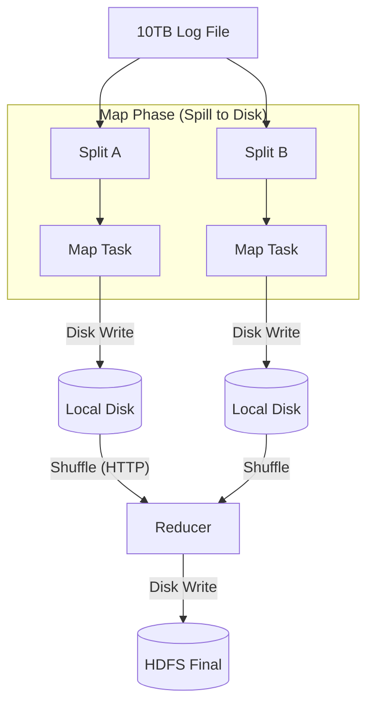

# 01. The Evolution of Batch Processing

## 1. Introduction
Batch processing is the engine of the data warehouse. Its history is defined by the bottleneck of **Disk I/O**.

---

## 2. The Bottleneck: External Merge Sort (MapReduce)
The core innovation of Google's MapReduce was not the `Map` function, but the **Robust Shuffle**.

How do you sort 10TB of data on nodes with 16GB RAM?
1.  **Map Spill**: Map tasks write data to local disk buffers. When full, they sort and spill to disk.
2.  **Transfer**: Reducers pull these sorted files via HTTP.
3.  **Merge**: Reducers perform a massive **On-Disk Merge Sort** of the incoming files.

### The Cost
MapReduce writes to disk **3 times**:
1.  Map Spill.
2.  Reduce Input (if it doesn't fit in RAM).
3.  Reduce Output (HDFS).

---

## 3. The Optimization: In-Memory (Apache Spark)
Spark's RDD (Resilient Distributed Dataset) optimization is simple: **"Don't write to disk unless you have to."**

*   **Pipelining**: Spark chains `Map -> Filter -> Map` into a single function call.
*   **Shuffle**: Spark still has to shuffle (Wide Dependency), but it uses **Operating System Page Cache** aggressively rather than explicit file I/O where possible, and keeps data in RAM for iterative algorithms (Logistic Regression loops).

---

## 4. Comparison Matrix

| Feature | Hadoop MapReduce | Apache Spark |
| :--- | :--- | :--- |
| **I/O Pattern** | Materialize every step to Disk. | Keep intermediate steps in RAM. |
| **Startup** | High (JVM startup per task). | Low (Long running Executors). |
| **Failure Recovery** | Task Restart (Reliable). | Recompute Lineage (Fast for narrow chains). |
| **Use Case** | Archival ETL (Petabytes). | Iterative ML, Interactive SQL. |
