# 01. The Evolution of Batch Processing: From Disk to Memory

## 1. Introduction

**Batch Processing** is the non-interactive processing of high-volume data. It is the engine of the data warehouse, responsible for ETL (Extract, Transform, Load), reporting, and machine learning model training.

**Problem It Solves**: How to process Petabytes of data reliably when single machines are limited by RAM and CPU? The fundamental challenge of batch processing has always been the **Disk I/O Bottleneck**.

**Key Differentiator**:
- **Throughput over Latency**: Optimized for processing massive datasets efficiently, even if it takes hours.
- **Reliability**: Designed to survive hardware failures mid-process without restarting from scratch.

**Evolution Path**:
- **Generation 1 (MapReduce)**: Disk-based, robust, but slow.
- **Generation 2 (Spark)**: Memory-based, pipelined, fast.

**Industry Adoption**:
- **Hadoop MapReduce**: Legacy systems, massive archival jobs (PB scale).
- **Apache Spark**: The industry standard for modern batch processing.

---

## 2. Core Architecture

The architecture of batch systems has shifted from a rigid "Map-Then-Reduce" model to a flexible "Directed Acyclic Graph" (DAG).

```mermaid
graph TD
    subgraph MapReduce_Architecture ["Gen 1: MapReduce (Disk Heavy)"]
        MR_Input[Input] --> MR_Map[Map Phase]
        MR_Map -->|Spill to Disk| MR_Disk[(Local Disk)]
        MR_Disk -->|Network Shuffle| MR_Reduce[Reduce Phase]
        MR_Reduce -->|Write| MR_HDFS[(HDFS)]
    end

    subgraph Spark_Architecture ["Gen 2: Spark (Memory Optimized)"]
        Sp_Input[Input] --> Sp_Op1[Transform 1]
        Sp_Op1 -->|RAM| Sp_Op2[Transform 2]
        Sp_Op2 -->|RAM| Sp_Op3[Transform 3]
        Sp_Op3 -->|Network Shuffle| Sp_Stage2[Stage 2]
        Sp_Stage2 -->|Write| Sp_HDFS[(HDFS)]
    end

    style MapReduce_Architecture fill:#f9f9f9,stroke:#333
    style Spark_Architecture fill:#e6f3ff,stroke:#333
```

### Key Components

**1. The Driver (Coordinator)**:
- The "Brain" of the operation.
- Converts code into a logical execution plan (DAG).
- Negotiates resources with the Cluster Manager (YARN/Kubernetes).
- Schedules tasks on Executors.

**2. The Executors (Workers)**:
- The "Muscle".
- Process data in parallel tasks.
- Store data in memory (Cache/Persist).

**3. The Cluster Manager**:
- Resource arbitrator (YARN, Mesos, Kubernetes).
- Allocates CPU/RAM containers to applications.

---

## 3. How It Works: The Evolution

### Era 1: The Disk Era (MapReduce)
Google's MapReduce (2004) democratized distributed computing. Its reliability came from a simple rule: **Checkpoint everything to disk.**

**Step-by-Step Flow**:
1.  **Read**: Mapper reads block from HDFS.
2.  **Map**: Processes record, writes output to **Local Disk** (Spill).
3.  **Shuffle**: Reducers pull sorted files from Mappers via HTTP.
4.  **Merge**: Reducer merges sorted files from disk.
5.  **Reduce**: Processes merged data.
6.  **Write**: Reducer writes final result to HDFS (3x replication).

*Cost*: 3 massive Disk I/O operations per job.

### Era 2: The Memory Era (Apache Spark)
Spark (2010) realized that RAM was getting cheaper. Its optimization: **"Don't write to disk unless you have to."**

**Step-by-Step Flow**:
1.  **Lazy Evaluation**: Spark builds a recipe (DAG) but doesn't cook until asked.
2.  **Pipelining**: Chains multiple operations (`Map -> Filter -> Map`) into a single function call.
    - *Result*: Data stays in CPU L1/L2 cache, never hitting RAM or Disk between steps.
3.  **In-Memory Shuffle**: Tries to keep shuffle data in OS Buffer Cache.
4.  **Resilience**: Instead of checkpointing to disk, it remembers the *lineage* (the recipe). If a node dies, it re-cooks just that slice of data.

---

## 4. Deep Dive: The Shuffle

The **Shuffle** is the most expensive operation in batch processing. It occurs when data must move between nodes (e.g., `GroupBy`, `Join`, `Sort`).

### Mechanism: Sort-Based Shuffle
Used by Hadoop and modern Spark (Tungsten).

1.  **Map Side**:
    - Data is written to an in-memory buffer (e.g., 5MB).
    - When full, it is **Sorted** and **Spilled** to disk.
    - Multiple spilled files are **Merged** into one Partitioned File.
    
2.  **Reduce Side**:
    - Reducer fetches its specific partition from *all* Mappers.
    - It performs a **Multi-Way Merge Sort** on these inputs to create a unified stream.

### Why is it Hard?
- **Network Saturation**: All-to-All communication (N x M connections).
- **Disk I/O**: Random seeks on HDD kills performance.
- **Memory Pressure**: Sorting requires massive RAM buffers.

---

## 5. End-to-End Walkthrough: The "Word Count" Job

**Scenario**: Count occurrences of every word in a 10TB dataset.

### Step 1: Ingestion (Map Phase)
- **Action**: Split 10TB file into 128MB blocks.
- **Parallelism**: 80,000 Tasks (10TB / 128MB).
- **Logic**: Parse line -> Emit `(Word, 1)`.

### Step 2: Local Aggregation (Combiner)
- **Optimization**: Don't send `(The, 1)` one million times.
- **Logic**: Sum counts locally before sending. `(The, 1000)`.
- **Benefit**: Reduces network traffic by 90%+.

### Step 3: The Shuffle (Wide Dependency)
- **Action**: Redistribute data so all "The" records got to Node A, all "Cat" records go to Node B.
- **Mechanism**: `Hash(Word) % NumReducers`.

### Step 4: Final Aggregation (Reduce Phase)
- **Node A**: Receives `(The, 1000)` from Mapper 1, `(The, 500)` from Mapper 2.
- **Logic**: Sums them -> `(The, 1500)`.

### Step 5: Materialization
- **Action**: Write final counts to HDFS/S3 (Parquet format).

---

## 6. Failure Scenarios

### Scenario A: Data Skew (The "Cursed Key")
**Symptom**: Job runs 99% quickly, but the last 1% takes forever.
**Cause**: One key (e.g., "The" or "Null") has 1000x more data than others. One reducer gets overloaded while others sit idle.
**The Fix**:
- **Salting**: Add a random number to the key (`Null_1`, `Null_2`). Distributes data to multiple reducers. Aggregates twice.
- **Broadcast Join**: If joining skew with a small table, broadcast the small table to avoid shuffle.

### Scenario B: OOM (Out of Memory)
**Symptom**: `Container killed by YARN for exceeding memory limits`.
**Cause**:
- **User Code**: Loading a massive array in a generic UDF.
- **Shuffle**: Buffer limits too high for heap size.
**The Fix**:
- Decrease `spark.sql.shuffle.partitions` (too few partitions = massive partitions).
- Increase `spark.memory.fraction` for execution.

### Scenario C: Speculative Execution (Stragglers)
**Symptom**: One generic node has bad disk/network, running 10x slower.
**Mechanism**:
- Driver detects "Task 5 is slower than median".
- Launches "Backup Task 5" on a healthy node.
- First one to finish wins; other is killed.

---

## 7. Performance Tuning Strategies

### Configuration Table

| Parameter | Recommended | Why? |
| :--- | :--- | :--- |
| **Shuffle Partitions** | 2-3x number of cores | Balances parallelism vs overhead. Default (200) is often wrong. |
| **Split Size** | 128MB - 256MB | Too small = Metadata overhead. Too large = No parallelism. |
| **Compression** | Snappy / LZ4 | Trade CPU for Disk/Network I/O. Always compress shuffle. |
| **Serialization** | Kyro (Java) / Tungsten (Spark) | Standard Java serialization is bloated and slow. |
| **File Format** | Parquet / ORC | Columnar storage reads only needed columns (Projection Pushdown). |

### Partitioning Strategy
- **The Small File Problem**: Generating millions of 1KB files kills the NameNode.
- **Fix**: Use `coalesce()` or `repartition()` before writing to reduce file count.

---

## 8. Constraints & Limitations

| Constraint | Limit | Why? |
| :--- | :--- | :--- |
| **Latency** | Minutes to Hours | Overhead of scheduling container startup (JVM). Not for real-time. |
| **Complexity** | High | Debugging distributed stack traces is difficult. |
| **Small Data** | < 100GB | Overhead often makes it slower than a single robust Postgres query. |
| **Cost** | $$$ | Keeping massive clusters (EMR/Databricks) running is expensive. |

---

## 9. When to Use Batch Processing?

| Use Case | Verdict | Why? |
| :--- | :--- | :--- |
| **Nightly Reports** | ✅ **YES** | Perfect fit. Process yesterday's data once. |
| **Model Training** | ✅ **YES** | Iterative algorithms over massive historic datasets. |
| **Data Backfills** | ✅ **YES** | Correcting 5 years of data bugs. |
| **Real-Time Fraud** | ❌ **NO** | Too slow. Use Stream Processing (Flink/Kafka). |
| **Simple Aggregation** | ⚠️ **MAYBE** | If data fits in a Snowflake/BigQuery warehouse, use SQL instead. |

---

## 10. Production Checklist

1. [ ] **Handle Skew**: Identify "hot" keys early. Use salting if necessary.
2. [ ] **Optimize Formats**: always use Parquet/ORC with Snappy compression.
3. [ ] **Tune Partitions**: Ensure `spark.sql.shuffle.partitions` matches data volume, not default (200).
4. [ ] **Broadcast Joins**: Configure auto-broadcast thresholds for small tables.
5. [ ] **Monitoring**: Set up alerts for Long Garbage Collection (GC) pauses.
6. [ ] **Speculative Execution**: Enable for handling bad hardware nodes.
7. [ ] **Cost Control**: Use Spot Instances for Executors (stateless), On-Demand for Driver.
8. [ ] **Data Quality**: Add checks (great expectations) *before* writing final output.

**Critical Metrics**:
- **Shuffle Spill**: Bytes written to disk during shuffle (Target: 0).
- **GC Time**: Time spent in Garbage Collection (Target: < 10% of total time).
- **Task Skew**: Ratio of Max Task Time / Median Task Time (Target: < 1.5).
