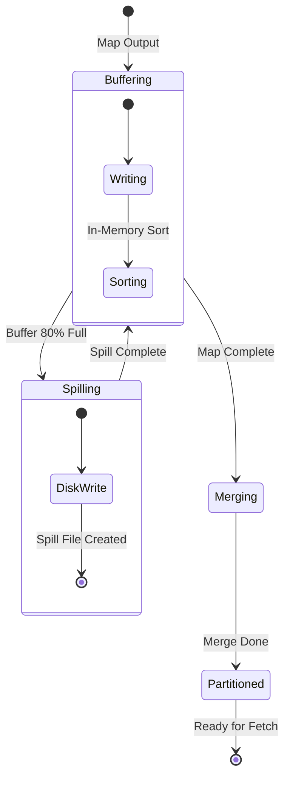
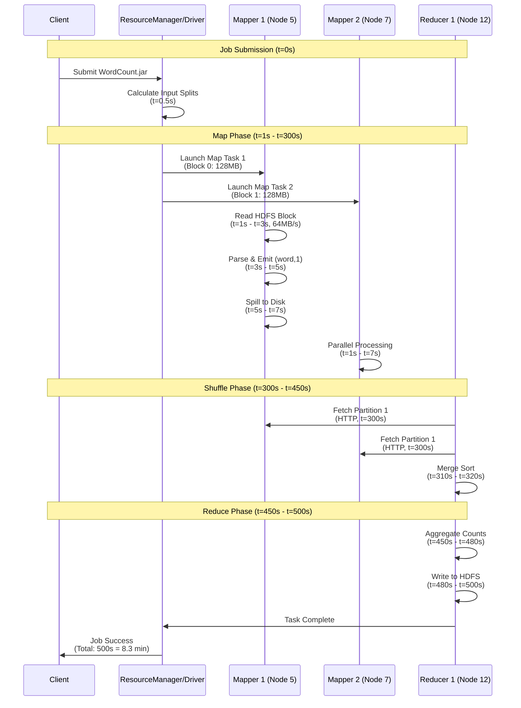

# 01. The Evolution of Batch Processing: From Disk to Memory

## 1. Introduction

**Batch Processing** is the non-interactive processing of high-volume data. It is the engine of the data warehouse, responsible for ETL (Extract, Transform, Load), reporting, and machine learning model training.

**Problem It Solves**: How to process Petabytes of data reliably when single machines are limited by RAM and CPU? The fundamental challenge of batch processing has always been the **Disk I/O Bottleneck**.

**Key Differentiator**:
- **Throughput over Latency**: Optimized for processing massive datasets efficiently, even if it takes hours.
- **Reliability**: Designed to survive hardware failures mid-process without restarting from scratch.

**Evolution Path**:
- **Generation 1 (MapReduce)**: Disk-based, robust, but slow.
- **Generation 2 (Spark)**: Memory-based, pipelined, fast.

**Industry Adoption**:
- **Hadoop MapReduce**: Legacy systems, massive archival jobs (PB scale).
- **Apache Spark**: The industry standard for modern batch processing.

---

## 2. Core Architecture

The architecture of batch systems has shifted from a rigid "Map-Then-Reduce" model to a flexible "Directed Acyclic Graph" (DAG).

```mermaid
graph TD
    subgraph MapReduce_Architecture ["Gen 1: MapReduce (Disk Heavy)"]
        MR_Input[Input] --> MR_Map[Map Phase]
        MR_Map -->|Spill to Disk| MR_Disk[(Local Disk)]
        MR_Disk -->|Network Shuffle| MR_Reduce[Reduce Phase]
        MR_Reduce -->|Write| MR_HDFS[(HDFS)]
    end

    subgraph Spark_Architecture ["Gen 2: Spark (Memory Optimized)"]
        Sp_Input[Input] --> Sp_Op1[Transform 1]
        Sp_Op1 -->|RAM| Sp_Op2[Transform 2]
        Sp_Op2 -->|RAM| Sp_Op3[Transform 3]
        Sp_Op3 -->|Network Shuffle| Sp_Stage2[Stage 2]
        Sp_Stage2 -->|Write| Sp_HDFS[(HDFS)]
    end

    style MapReduce_Architecture fill:#f9f9f9,stroke:#333
    style Spark_Architecture fill:#e6f3ff,stroke:#333
```



### Key Components

**1. The Driver (Coordinator)**:
- The "Brain" of the operation.
- Converts code into a logical execution plan (DAG).
- Negotiates resources with the Cluster Manager (YARN/Kubernetes).
- Schedules tasks on Executors.

**2. The Executors (Workers)**:
- The "Muscle".
- Process data in parallel tasks.
- Store data in memory (Cache/Persist).

**3. The Cluster Manager**:
- Resource arbitrator (YARN, Mesos, Kubernetes).
- Allocates CPU/RAM containers to applications.

---

## 3. How It Works: The Evolution

### Era 1: The Disk Era (MapReduce)
Google's MapReduce (2004) democratized distributed computing. Its reliability came from a simple rule: **Checkpoint everything to disk.**

**Step-by-Step Flow**:
1.  **Read**: Mapper reads block from HDFS.
2.  **Map**: Processes record, writes output to **Local Disk** (Spill).
3.  **Shuffle**: Reducers pull sorted files from Mappers via HTTP.
4.  **Merge**: Reducer merges sorted files from disk.
5.  **Reduce**: Processes merged data.
6.  **Write**: Reducer writes final result to HDFS (3x replication).

*Cost*: 3 massive Disk I/O operations per job.

### Era 2: The Memory Era (Apache Spark)
Spark (2010) realized that RAM was getting cheaper. Its optimization: **"Don't write to disk unless you have to."**

**Step-by-Step Flow**:
1.  **Lazy Evaluation**: Spark builds a recipe (DAG) but doesn't cook until asked.
2.  **Pipelining**: Chains multiple operations (`Map -> Filter -> Map`) into a single function call.
    - *Result*: Data stays in CPU L1/L2 cache, never hitting RAM or Disk between steps.
3.  **In-Memory Shuffle**: Tries to keep shuffle data in OS Buffer Cache.
4.  **Resilience**: Instead of checkpointing to disk, it remembers the *lineage* (the recipe). If a node dies, it re-cooks just that slice of data.

---

## 4. Deep Dive: The Shuffle

The **Shuffle** is the most expensive operation in batch processing. It occurs when data must move between nodes (e.g., `GroupBy`, `Join`, `Sort`).

### A. Shuffle State Machine

The shuffle progresses through distinct phases on both map and reduce sides:



**Phase Breakdown**:

1. **Buffering** (t=0 to t=buffer_full):
   - Mapper writes `(key, value)` pairs to circular buffer
   - Buffer size: `mapreduce.task.io.sort.mb` (default: 100MB)
   - In-memory sort occurs when buffer reaches threshold

2. **Spilling** (triggered at 80% full):
   - Background thread sorts buffer contents by (partition, key)
   - Writes sorted run to local disk: `spill_0.out`, `spill_1.out`
   - Partition function: `Hash(key) % num_reducers`
   - Continue accepting new records while spilling

3. **Merging** (at map task completion):
   - Merge all spill files into single partitioned file
   - Each partition is internally sorted
   - Uses multi-way merge (merges all spills simultaneously)

### B. Memory Management

**Buffer Calculation**:
```
Buffer Size = mapreduce.task.io.sort.mb (100MB default)
Spill Threshold = Buffer Size × mapreduce.map.sort.spill.percent (0.80 default)
Usable Buffer = 100MB × 0.80 = 80MB
Reserve Buffer = 20MB (for new records during spill)
```

**Memory Pressure Example**:
- Map task generates 1GB of output
- Buffer can hold 80MB before spilling
- Number of spills = ⌈1GB / 80MB⌉ = 13 spills
- Each spill incurs disk I/O cost
- **Fix**: Increase `io.sort.mb` to 200MB → reduces spills to 7

### C. External Merge Sort Algorithm

The reducer performs a **K-way merge** where K = number of mappers.

**Step-by-Step**:

1. **Fetch Phase** (Parallel):
   ```
   For each mapper M in [1..K]:
     HTTP GET http://mapper_M:port/shuffle?partition=R
     Store in memory buffer (if fits) or spill to disk
   ```

2. **Merge Phase** (Multi-level):
   ```
   Level 1: Merge factor = 10 (configurable)
   - Open 10 spill files simultaneously
   - Read smallest key from each file's current position
   - Write smallest of these 10 keys to output
   - Repeat until all files exhausted
   
   Level 2: If > 10 files, merge in batches
   - First pass: 100 files → 10 merged files
   - Second pass: 10 files → 1 final sorted file
   ```

3. **Disk I/O Pattern**:
   - Sequential reads from input files (fast)
   - Sequential writes to output file (fast)
   - Complexity: $O(N \log K)$ where N = total records, K = mappers

### D. Why is it Hard?

**Network Bottleneck**:
- 1000 mappers × 100 reducers = 100,000 TCP connections
- Each reducer fetches from all mappers simultaneously
- Network bandwidth becomes saturated
- **Typical**: 10Gbps link × 100 reducers = 1Tbps aggregate demand

**Disk I/O Bottleneck**:
- Random seeks on HDD: ~100 IOPS (10ms per seek)
- 13 spills × 100 reducers = 1,300 disk operations
- **Hadoop mitigation**: Sequential writes where possible
- **Spark mitigation**: Keep data in OS page cache (memory)

**Memory Pressure**:
- Sorting 1GB partition requires ~1GB RAM minimum
- With 100 concurrent tasks × 1GB = 100GB RAM needed
- **Fix**: Limit concurrent tasks or increase RAM per node

---

## 5. End-to-End Walkthrough: The "Word Count" Job

**Scenario**: Count occurrences of every word in a 10TB dataset across a 100-node cluster.

### Timeline Visualization



### Detailed Step Breakdown

#### Step 1: Job Submission (t=0s - t=1s)
- **Component**: Client Application
- **Action**: Submits `WordCount.jar` to YARN ResourceManager
- **State Change**: Job Status: SUBMITTED → ACCEPTED
- **Data**: Job configuration (input path, output path, mapper/reducer classes)
- **Timing**: 1 second (network latency + validation)

#### Step 2: Input Split Calculation (t=1s - t=2s)
- **Component**: ResourceManager/ApplicationMaster
- **Action**: Scans HDFS metadata to calculate InputSplits
  ```
  File Size: 10TB = 10,485,760 MB
  Block Size: 128MB
  Number of Splits: 10TB / 128MB = 81,920 splits
  ```
- **State**: 81,920 Map tasks created (1 per split)
- **Timing**: 1 second (metadata scan)

#### Step 3: Container Allocation (t=2s - t=10s)
- **Component**: YARN ResourceManager + NodeManagers
- **Action**: Allocates containers across 100 nodes
  ```
  Containers per node: 81,920 / 100 = ~820 wave jobs
  Concurrent tasks per node: 8 (assuming 8 CPU cores)
  Waves: 820 / 8 = 103 waves
  ```
- **State**: First 800 Map tasks (8 per node) get containers
- **Timing**: 8 seconds (JVM startup overhead)

#### Step 4: Map Phase - Data Processing (t=10s - t=300s)
- **Component**: Mapper Tasks (distributed across 100 nodes)
- **Action per Mapper**:
  1. **Read HDFS Block** (128MB): 2 seconds at 64MB/s disk read
  2. **Tokenize**: Split lines into words
     ```java
     // Pseudo-code
     for (line : block) {
       for (word : line.split(" ")) {
         emit(word, 1);
       }
     }
     ```
  3. **Buffer in Memory**: Write to 100MB circular buffer
  4. **Spill**: When 80MB full, spill to disk (sorted by partition)
     - Average: 3 spills per 128MB input = 3 × 0.5s = 1.5s
- **State**: Each mapper produces sorted, partitioned spill files
- **Output Size**: ~10TB of `(word, 1)` pairs
- **Timing**: 290 seconds per wave × 103 waves = ~5 minutes (parallel)

#### Step 5: Map Completion & Merge (t=300s - t=310s)
- **Component**: Mapper Tasks
- **Action**: Merge all spill files into single partitioned output
  ```
  Spill Files: spill_0.out, spill_1.out, spill_2.out
  Merge: Multi-way merge into final_output.out
  ```
- **State**: Map Output ready for shuffle
- **Notification**: Mapper notifies ResourceManager: "Partition 1 ready on Node 5"
- **Timing**: 10 seconds (disk merge)

#### Step 6: Shuffle - Fetch Phase (t=310s - t=400s)
- **Component**: Reducer Tasks
- **Action**: Each of 100 reducers fetches its partition from all 81,920 mappers
  ```
  Reducer 1 fetches:
    HTTP GET http://mapper_1:13562/mapOutput?partition=1
    HTTP GET http://mapper_2:13562/mapOutput?partition=1
    ... (81,920 fetches)
  ```
- **Network Traffic**:
  - Each reducer fetches ~100GB (10TB / 100 reducers)
  - Parallelism: 5 concurrent fetches per reducer (configurable)
  - Bandwidth: 100GB / 90s = ~1GB/s per reducer
- **State**: Data accumulates in reducer's memory or spills to disk
- **Timing**: 90 seconds (network-bound)

#### Step 7: Shuffle - Merge Sort (t=400s - t=450s)
- **Component**: Reducer Tasks
- **Action**: Perform multi-way merge sort on fetched data
  ```
  Input: 81,920 sorted streams (one from each mapper)
  Algorithm: K-way merge (K=81,920)
  Output: Single sorted stream of (word, [1,1,1,...,1])
  ```
- **Memory**: Uses external merge sort (disk-based due to size)
- **Complexity**: $O(N \log K)$ where N=total records, K=81,920
- **State**: Sorted, grouped by key: `("the", [1,1,1,...])`, `("cat", [1,1,...])`
- **Timing**: 50 seconds (I/O bound)

#### Step 8: Reduce Phase - Aggregation (t=450s - t=480s)
- **Component**: Reducer Tasks
- **Action**: Sum counts for each word
  ```java
  reduce(word, Iterator<Int> counts) {
    int sum = 0;
    for (int c : counts) {
      sum += c;
    }
    emit(word, sum);
  }
  ```
- **Example**:
  - Input: `("the", [1,1,1,...])` (5 billion 1's)
  - Output: `("the", 5000000000)`
- **State**: Final word counts computed
- **Timing**: 30 seconds (CPU-bound summing)

#### Step 9: Output - Write to HDFS (t=480s - t=500s)
- **Component**: Reducer Tasks
- **Action**: Write results to HDFS in Parquet format
  ```
  Output Path: /user/data/wordcount/output/
  Files: part-r-00000, part-r-00001, ..., part-r-00099
  Replication: 3x (HDFS default)
  ```
- **Data Size**: ~500MB (unique words with counts, highly compressed)
- **Write Speed**: 500MB × 3 replicas = 1.5GB at 75MB/s = 20 seconds
- **State**: Data persisted to disk
- **Timing**: 20 seconds

#### Step 10: Job Completion (t=500s)
- **Component**: ResourceManager/Driver
- **Action**: Marks job as SUCCESSFUL, releases containers
- **Cleanup**: Deletes intermediate shuffle files
- **Notification**: Client receives success callback
- **Final State**: Output available at `/user/data/wordcount/output/`

### Performance Summary

| Phase | Duration | Bottleneck |
|:------|:---------|:-----------|
| Submission & Planning | 10s | Metadata scan |
| Map Processing | 290s | Disk I/O (128MB reads) |
| Shuffle Fetch | 90s | Network bandwidth |
| Shuffle Merge | 50s | Disk I/O (external sort) |
| Reduce Aggregation | 30s | CPU (summing) |
| HDFS Write | 20s | Disk I/O (replication) |
| **Total** | **490s (~8 minutes)** | **Shuffle dominates (140s)** |

---

## 6. Failure Scenarios

### Scenario A: Data Skew (The "Cursed Key")
**Symptom**: Job runs 99% quickly, but the last 1% takes forever.
**Cause**: One key (e.g., "The" or "Null") has 1000x more data than others. One reducer gets overloaded while others sit idle.
**The Fix**:
- **Salting**: Add a random number to the key (`Null_1`, `Null_2`). Distributes data to multiple reducers. Aggregates twice.
- **Broadcast Join**: If joining skew with a small table, broadcast the small table to avoid shuffle.

### Scenario B: OOM (Out of Memory)
**Symptom**: `Container killed by YARN for exceeding memory limits`.
**Cause**:
- **User Code**: Loading a massive array in a generic UDF.
- **Shuffle**: Buffer limits too high for heap size.
**The Fix**:
- Decrease `spark.sql.shuffle.partitions` (too few partitions = massive partitions).
- Increase `spark.memory.fraction` for execution.

### Scenario C: Speculative Execution (Stragglers)
**Symptom**: One generic node has bad disk/network, running 10x slower.
**Mechanism**:
- Driver detects "Task 5 is slower than median".
- Launches "Backup Task 5" on a healthy node.
- First one to finish wins; other is killed.

---

## 7. Performance Tuning Strategies

### Configuration Table

| Parameter | Recommended | Why? |
| :--- | :--- | :--- |
| **Shuffle Partitions** | 2-3x number of cores | Balances parallelism vs overhead. Default (200) is often wrong. |
| **Split Size** | 128MB - 256MB | Too small = Metadata overhead. Too large = No parallelism. |
| **Compression** | Snappy / LZ4 | Trade CPU for Disk/Network I/O. Always compress shuffle. |
| **Serialization** | Kyro (Java) / Tungsten (Spark) | Standard Java serialization is bloated and slow. |
| **File Format** | Parquet / ORC | Columnar storage reads only needed columns (Projection Pushdown). |

### Partitioning Strategy
- **The Small File Problem**: Generating millions of 1KB files kills the NameNode.
- **Fix**: Use `coalesce()` or `repartition()` before writing to reduce file count.

---

## 8. Constraints & Limitations

| Constraint | Limit | Why? |
| :--- | :--- | :--- |
| **Latency** | Minutes to Hours | Overhead of scheduling container startup (JVM). Not for real-time. |
| **Complexity** | High | Debugging distributed stack traces is difficult. |
| **Small Data** | < 100GB | Overhead often makes it slower than a single robust Postgres query. |
| **Cost** | $$$ | Keeping massive clusters (EMR/Databricks) running is expensive. |

---

## 9. When to Use Batch Processing?

| Use Case | Verdict | Why? |
| :--- | :--- | :--- |
| **Nightly Reports** | ✅ **YES** | Perfect fit. Process yesterday's data once. |
| **Model Training** | ✅ **YES** | Iterative algorithms over massive historic datasets. |
| **Data Backfills** | ✅ **YES** | Correcting 5 years of data bugs. |
| **Real-Time Fraud** | ❌ **NO** | Too slow. Use Stream Processing (Flink/Kafka). |
| **Simple Aggregation** | ⚠️ **MAYBE** | If data fits in a Snowflake/BigQuery warehouse, use SQL instead. |

---

## 10. Production Checklist

1. [ ] **Handle Skew**: Identify "hot" keys early. Use salting if necessary.
2. [ ] **Optimize Formats**: always use Parquet/ORC with Snappy compression.
3. [ ] **Tune Partitions**: Ensure `spark.sql.shuffle.partitions` matches data volume, not default (200).
4. [ ] **Broadcast Joins**: Configure auto-broadcast thresholds for small tables.
5. [ ] **Monitoring**: Set up alerts for Long Garbage Collection (GC) pauses.
6. [ ] **Speculative Execution**: Enable for handling bad hardware nodes.
7. [ ] **Cost Control**: Use Spot Instances for Executors (stateless), On-Demand for Driver.
8. [ ] **Data Quality**: Add checks (great expectations) *before* writing final output.

**Critical Metrics**:

```
batch_shuffle_spill_bytes_total:
  Description: Total bytes written to disk during shuffle phase
  Target: 0 bytes (all data fits in memory buffers)
  Alert: if > 10% of total shuffle data size
  Why it matters: Spilling indicates insufficient memory, causing 10-100x slowdown

batch_gc_time_seconds_total:
  Description: Time spent in Garbage Collection across all executors
  Target: < 10% of total job duration
  Alert: if > 20% of job duration
  Why it matters: Excessive GC indicates memory pressure or poor serialization

batch_task_duration_skew_ratio:
  Description: Ratio of (max task duration / median task duration)
  Target: < 1.5 (max task takes < 1.5x median)
  Alert: if > 3.0
  Why it matters: High skew means data unevenly distributed; one task blocks entire stage
  Fix: Apply salting to skewed keys

batch_executor_memory_usage_percent:
  Description: Percentage of allocated executor memory being used
  Target: 70-85% (sweet spot)
  Alert: if > 95% (OOM risk) or < 50% (overprovisioned)
  Why it matters: Too high = crashes; too low = wasted money

batch_stage_duration_seconds{stage_name}:
  Description: Wall-clock time for each stage (Map, Shuffle, Reduce)
  Target: Shuffle stage < 30% of total job time
  Alert: if Shuffle > 50% of job time
  Why it matters: Shuffle-heavy jobs need repartitioning or broadcast join optimization

batch_executor_failures_total:
  Description: Count of executor crashes/evictions
  Target: 0
  Alert: if > 0
  Why it matters: Failures indicate node issues or memory problems requiring investigation
```
