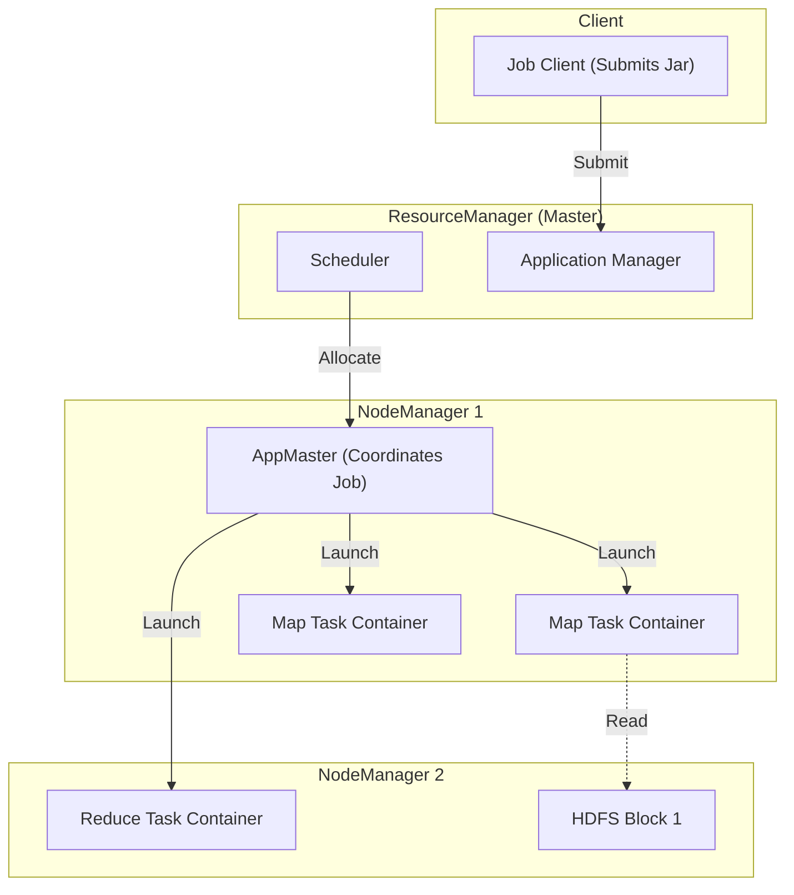
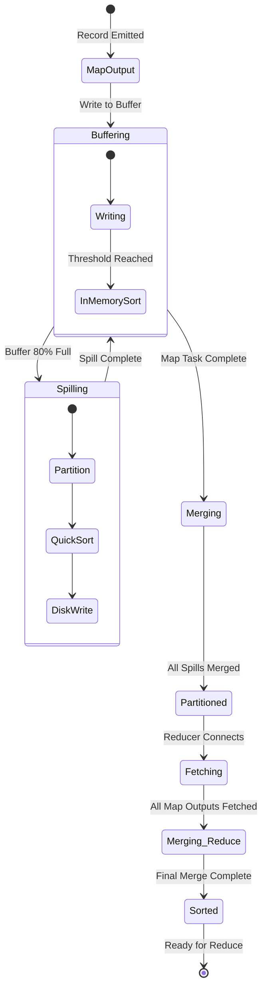
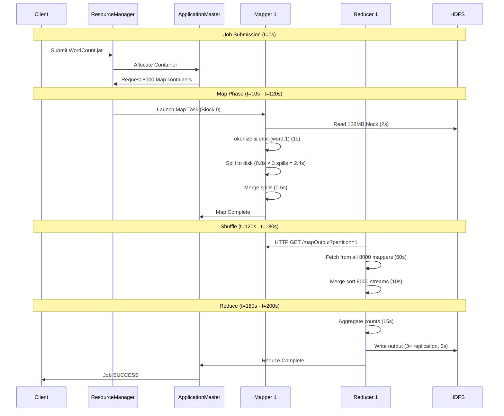

# 02. Hadoop MapReduce Deep Dive

## 1. Introduction

**Hadoop MapReduce** is the foundational framework for distributed batch processing, released by Apache in 2006. It implements the MapReduce programming model on top of the Hadoop Distributed File System (HDFS).

### The Problem: Processing Petabytes on Commodity Hardware

**Batch Processing** is the non-interactive processing of high-volume data - the engine behind data warehouses, ETL pipelines, and analytics platforms. The fundamental challenge: **How to process Petabytes of data reliably when single machines are limited by RAM and CPU?**

### The Pre-Hadoop Era (1990s-2004)

**Traditional Approaches**:
- **Supercomputers**: $10M+ machines with specialized hardware
- **MPI (Message Passing Interface)**: Complex parallel programming for scientific computing
- **Shared-Nothing Databases**: Expensive commercial solutions (Teradata, Netezza)

**Limitations**:
- **Cost**: Only large enterprises/research labs could afford infrastructure
- **Complexity**: Required PhD-level expertise to program
- **Scalability**: Linear scaling required proportional investment
- **Fault Tolerance**: Any node failure often meant job restart

### Google's Breakthrough (2004)

**The MapReduce Paper** (Dean & Ghemawat, OSDI 2004) introduced a paradigm shift:

**Key Insight**: Accept commodity hardware failures as **normal**, not exceptional
- **Before**: Expensive hardware + pray it doesn't fail
- **MapReduce**: Cheap hardware + design for failure

**Core Innovation**: Not the Map or Reduce functions (known concepts), but the **Robust Shuffle**
- Automatic handling of node failures
- Data locality (move computation to data)
- Simple programming model (users write map() and reduce())

**Philosophy**: "Checkpoint everything to disk"
- **Trade-off**: Reliability over raw speed
- **Benefit**: Jobs survive cascading node failures
- **Cost**: 3-7 disk writes per record

### The Hadoop Implementation (2006)

**Yahoo's Doug Cutting** created open-source implementation:
- **HDFS**: Distributed file system (based on Google's GFS paper)
- **MapReduce**: Java implementation of MapReduce paradigm
- **YARN** (2012): Resource manager decoupling compute from storage

**Why Hadoop Chose Disk-Based Processing**:

1. **Hardware Reality (2006)**:
   - Commodity servers: 2-4GB RAM ($1000/GB)
   - Hard drives: 100-500GB ($0.50/GB)
   - **RAM:Disk price ratio**: 2000:1
   - Conclusion: Can't fit TB datasets in RAM economically

2. **Reliability**:
   - Disk checkpoints survive any node failure
   - Tasks are stateless (can restart anywhere)
   - Simple recovery: re-execute failed task from disk snapshot

3. **Simplicity**:
   - No distributed memory management needed
   - No garbage collection tuning required
   - Operators need minimal expertise

### Key Differentiators

- **Data Locality**: Moves computation to data (code travels to node holding data)
- **Linear Scalability**: Add nodes → proportional increase in speed/capacity
- **Fault Tolerance**: Designed for commodity hardware failures
- **Simple API**: Users only write map() and reduce(), framework handles distribution

### Industry Adoption (2006-2014)

- **Yahoo** (2008): First major adopter, processing 100+ PB
- **Facebook** (2009): Built entire data warehouse on Hadoop
- **LinkedIn** (2010): Hadoop clusters with 10,000+ nodes
- **eBay** (2011): 40+ PB data warehouse
- **Twitter** (2012): Real-time analytics on Hadoop

**Peak Era**: 2010-2014 when Hadoop was the de facto standard for big data processing

### Use Cases

- **Massive archival ETL**: Extract, Transform, Load for data warehouses
- **Log analysis**: Web server logs, click streams (TBs daily)
- **Search indexing**: The original Google use case
- **Historical data backfills**: Reprocessing years of data
- **Data mining**: Finding patterns in massive datasets

---

## 2. Core Architecture (YARN Era)

In modern Hadoop (v2+), MapReduce runs as an application on top of **YARN** (Yet Another Resource Negotiator).



### Key Components
1.  **ResourceManager (RM)**: The global arbitrator of cluster resources.
2.  **NodeManager (NM)**: The per-node agent responsible for containers.
3.  **ApplicationMaster (AM)**: The per-job coordinator. Negotiates resources from RM and works with NMs to execute tasks.
4.  **Container**: A bundle of CPU/RAM (process) where Map/Reduce tasks run.

---

## 3. How It Works: The Lifecycle

The life of a MapReduce job follows a strict 3-phase structure:

1.  **Map Phase**:
    *   **InputSplit**: The logic that calculates how to divide the file. 1 Block (128MB) = 1 Split = 1 Map Task.
    *   **RecordReader**: Parses the raw byte stream into `(Key, Value)` pairs (e.g., Line Number, Line Text).
    *   **Map Logic**: User code processes input pairs and emits intermediate `(K, V)`.

2.  **Shuffle & Sort Phase** (The Framework Magic):
    *   **Partitioner**: Decides which Reducer gets which Key (Hash Modulo).
    *   **Sort**: The framework guarantees that keys arriving at the reducer are **Sorted**.
    *   **Transfer**: Reducers pull data via HTTP.

3.  **Reduce Phase**:
    *   **Reduce Logic**: User code receives `(Key, List[Values])` and emits final output.
    *   **OutputFormat**: Writes result to HDFS (e.g., `TextOutputFormat`).

---

## 4. Deep Dive: The Shuffle Mechanics

The shuffle is where Hadoop spends 70% of its time. Understanding it is critical for performance tuning.

### A. Shuffle State Machine



### B. Map Side: Buffer & Spill

Mappers do not write directly to disk. They write to a **Circular In-Memory Buffer**.

**Buffer Configuration**:
```
Buffer Size = mapreduce.task.io.sort.mb (Default: 100MB)
Spill Threshold = Buffer × mapreduce.map.sort.spill.percent (Default: 0.80)
Usable Buffer = 100MB × 0.80 = 80MB
Reserve = 20MB (continues accepting records during spill)
```

**Memory Pressure Example**:
- Mapper generates 500MB of output
- Buffer holds 80MB before spilling
- Number of spills = ⌈500MB / 80MB⌉ = 7 spills
- Each spill = 1 disk write operation
- **Total disk writes**: 7 spills + 1 merge = 8  writes
- **Fix**: Increase `io.sort.mb` to 200MB → reduces to 3 spills + 1 merge = 4  writes

**The Spill Process** (Step-by-Step):
1.  **Detect**: Background thread monitors buffer at 80% full (80MB used)
2.  **Partition**: Sort records by `(partition_id, key)` using in-memory quicksort
    - Partition function: `hash(key) % num_reducers`
    - Sort complexity: $O(N \log N)$ where N = records in buffer
3.  **Combiner** (Optional): Run local aggregation to reduce data volume
    - Example: `(the, 1), (the, 1), (the, 1)` → `(the, 3)`
    - Reduces network traffic by 60-90%
4.  **Write**: Flush sorted partition segments to disk: `spill_0.out`
    - Disk write speed: ~100MB/s (HDD sequential write)
    - Time: 80MB / 100MB/s = 0.8 seconds

**Map Completion Merge**:
- When map task finishes, merge all spill files: `spill_0.out`, `spill_1.out`, ..., `spill_6.out`
- Uses multi-way merge (merges all simultaneously)
- Output: Single partitioned file per mapper
- Each partition is internally sorted

### C. Reduce Side: Fetch & Merge

**Fetch Phase**:
```
Configuration:
  mapreduce.reduce.shuffle.parallelcopies = 5 (default)
  
Mechanism:
  Reducer launches 5 HTTP threads
  Each thread fetches from different mapper:
    Thread 1: GET http://mapper_1:13562/mapOutput?partition=3
    Thread 2: GET http://mapper_2:13562/mapOutput?partition=3
    ...
  
Data accumulation:
  If partition < 25% of reducer memory: Keep in RAM
  Else: Spill to disk
```

**Merge Sort Algorithm** (K-way merge, K = number of mappers):

**Step 1**: Open K files simultaneously
```
Files: mapper_1_partition_3.out, mapper_2_partition_3.out, ..., mapper_K_partition_3.out
Assumption: K = 1000 mappers
```

**Step 2**: Read first key from each file
```
File 1: key="apple", position=0
File 2: key="banana", position=0
...
File 1000: key="zebra", position=0
```

**Step 3**: Select minimum key
```
Min-heap of 1000 keys
Extract min: "apple" from File 1
Write to output
Advance File 1 pointer, read next key
Insert new key into heap
```

**Step 4**: Repeat until all files exhausted
```
Complexity: O(N log K)
  N = total records across all files
  K = 1000 mappers
  Each heap operation: O(log K) = O(log 1000) ≈ 10 comparisons
```

**Multi-Level Merge** (if K > merge factor):
```
Default merge factor = 10 (configurable via mapreduce.task.io.sort.factor)

If K = 1000:
  Level 1: Merge 100 batches of 10 files → 100 intermediate files
  Level 2: Merge 10 batches of 10 files → 10 intermediate files  
  Level 3: Merge 1 batch of 10 files → 1 final file
  
Total passes: log₁₀(1000) = 3 passes
```

### D. Disk I/O Quantification

**HDD Performance Characteristics**:
- Sequential Read: 120 MB/s
- Sequential Write: 100 MB/s
- Random Read IOPS: 100 IOPS (10ms seek time)
- Random Write IOPS: 100 IOPS

**MapReduce Disk Usage**:
```
Scenario: Process 10GB file with 100 mappers

Map Phase:
  Read input: 10GB / 120MB/s = 83 seconds
  Spill writes: 10GB × (spill_count / map_count) = 10GB × 7 / 100 ≈ 700MB per mapper
  Total spill time: 700MB / 100MB/s = 7 seconds per mapper
  
Shuffle Phase:
  Network transfer (not disk)
  
Reduce Phase:
  Merge reads: 10GB / 120MB/s = 83 seconds (sequential)
  Output write: 1GB / 100MB/s = 10 seconds (with 3x HDFS replication = 30 seconds)
  
Total I/O Time: 83 + 7 + 83 + 30 = 203 seconds
```

**Why Spark is Faster**:
- Spark keeps intermediate data in OS page cache (memory)
- Avoids map-side spills entirely if enough RAM
- Hadoop: 3-7 disk writes per record
- Spark: 0-1 disk writes per record (only final output)

---

## 5. End-to-End Walkthrough: Word Count Job

**Scenario**: Count word occurrences in 1TB log file using 50-node cluster

### Timeline Visualization



### Java Code Implementation

**The Mapper**:
```java
public class TokenizerMapper extends Mapper<Object, Text, Text, IntWritable> {
    private final static IntWritable one = new IntWritable(1);
    private Text word = new Text();

    public void map(Object key, Text value, Context context) 
        throws IOException, InterruptedException {
        StringTokenizer itr = new StringTokenizer(value.toString());
        while (itr.hasMoreTokens()) {
            word.set(itr.nextToken());
            context.write(word, one);  // Writes to in-memory buffer
        }
    }
}
```

**The Reducer**:
```java
public class IntSumReducer extends Reducer<Text, IntWritable, Text, IntWritable> {
    private IntWritable result = new IntWritable();

    public void reduce(Text key, Iterable<IntWritable> values, Context context) 
        throws IOException, InterruptedException {
        int sum = 0;
        for (IntWritable val : values) {
            sum += val.get();
        }
        result.set(sum);
        context.write(key, result);
    }
}
```

**The Driver (Configuration)**:
```java
public static void main(String[] args) throws Exception {
    Configuration conf = new Configuration();
    
    // Performance tuning
    conf.set("mapreduce.task.io.sort.mb", "200");  // Increase buffer
    conf.set("mapred

uce.map.output.compress", "true");     // Enable compression
    conf.set("mapreduce.map.output.compress.codec", 
             "org.apache.hadoop.io.compress.SnappyCodec");
    
    Job job = Job.getInstance(conf, "word count");
    job.setJarByClass(WordCount.class);
    
    // Set Classes
    job.setMapperClass(TokenizerMapper.class);
    job.setCombinerClass(IntSumReducer.class);  // Local aggregation
    job.setReducerClass(IntSumReducer.class);
    job.setNumReduceTasks(100);  // Explicit reducer count
    
    // Set Output Types
    job.setOutputKeyClass(Text.class);
    job.setOutputValueClass(IntWritable.class);
    
    // Set Paths
    FileInputFormat.addInputPath(job, new Path(args[0]));
    FileOutputFormat.setOutputPath(job, new Path(args[1]));
    
    System.exit(job.waitForCompletion(true) ? 0 : 1);
}
```

### Detailed Step Breakdown

#### Step 1: Job Submission (t=0 - t=2s)
- **Component**: Client → ResourceManager
- **Action**: Upload JAR to HDFS, submit job configuration
- **State**: Job ID assigned, moves to ACCEPTED queue
- **Timing**: 2 seconds (JAR upload + metadata)

#### Step 2: ApplicationMaster Launch (t=2s - t=10s)
- **Component**: ResourceManager → NodeManager #1
- **Action**: Allocate container for ApplicationMaster JVM
- **State**: AM starts, reads job configuration
- **Timing**: 8 seconds (JVM startup overhead)

#### Step 3: Input Split Calculation (t=10s - t=11s)
- **Component**: ApplicationMaster
- **Action**: Calculate splits from HDFS
  ```
  File size: 1TB = 1,048,576 MB
  Block size: 128MB
  Splits: 1TB / 128MB = 8,192 map tasks
  ```
- **Timing**: 1 second (HDFS metadata scan)

#### Step 4: Map Container Allocation (t=11s - t=20s)
- **Component**: ApplicationMaster → ResourceManager → NodeManagers
- **Action**: Request 8,192 containers across 50 nodes
  - Concurrent maps per node: 8 (assuming 8 cores)
  - Waves: 8,192 / (50 × 8) = 21 waves
- **Timing**: 9 seconds (container negotiation)

#### Step 5: Map Execution (t=20s - t=120s)
- **Component**: Map tasks (8 concurrent per node)
- **Per-Task Breakdown**:
  1. Read HDFS block (128MB): 128MB / 64MB/s = 2 seconds
  2. Tokenize & emit pairs: 1 second (CPU-bound)
  3. Spill to disk (3 spills): 3 × 0.8s = 2.4 seconds
  4. Final merge: 0.5 seconds
  - **Total per task**: 5.9 seconds
- **Wave timing**: 5.9s × 21 waves = 124 seconds (but overlapped, actual ~100s)
- **Output**: 1TB of intermediate `(word, 1)` pairs

#### Step 6: Shuffle - Fetch (t=120s - t=180s)
- **Component**: 100 Reducer tasks
- **Action**: Each reducer fetches its partition from all 8,192 mappers
  ```
  Data per reducer: 1TB / 100 = 10GB
  Parallel fetches: 5 threads per reducer
  Per-thread bandwidth: 10GB / 5 / 60s = 34MB/s
  ```
- **Network**: 50 nodes × 1Gbps = 50Gbps aggregate
- **Timing**: 60 seconds (network-bound)

#### Step 7: Shuffle - Merge (t=180s - t=190s)
- **Component**: Reducer tasks
- **Action**: K-way merge of 8,192 sorted streams
- **Merge levels**: log₁₀(8192) = 4 levels
- **Timing**: 10 seconds (I/O-bound, disk reads)

#### Step 8: Reduce Execution (t=190s - t=205s)
- **Component**: Reducer tasks
- **Action**: Aggregate word counts
  ```java
  reduce("the", [1,1,1,...,1]) -> ("the", 5000000000)
  ```
- **Timing**: 15 seconds (CPU summing)

#### Step 9: HDFS Write (t=205s - t=210s)
- **Component**: Reducers → HDFS
- **Action**: Write 100 output files with 3× replication
  - Output size: ~5GB (unique words + counts, compressed)
  - Write: 5GB × 3 / 100MB/s = 150s total / 100 reducers = 1.5s per reducer
- **Timing**: 5 seconds

#### Step 10: Job Completion (t=210s)
- **Component**: ApplicationMaster → ResourceManager → Client
- **Action**: Mark job SUCCESS, release containers, cleanup
- **State**: Output files available at specified path

### Performance Summary

| Phase | Duration | Bottleneck |
|:------|:---------|:-----------|
| Submission & Setup | 20s | JVM startup |
| Map Processing | 100s | Disk I/O (reading + spilling) |
| Shuffle Fetch | 60s | Network bandwidth |
| Shuffle Merge | 10s | Disk I/O (merge sort) |
| Reduce Aggregation | 15s | CPU (summing) |
| Output Write | 5s | HDFS replication |
| **Total** | **210s (3.5 min)** | **Map + Shuffle = 160s** |

---

## 6. Failure Scenarios

### Scenario A: Task Failure
*   **Symptom**: `RuntimeException` or timeout in map/reduce task
*   **Mechanism**: ApplicationMaster detects failure → reschedules on different node
*   **Configuration**: `mapreduce.map.maxattempts=4` (default)
*   **Outcome**: If task fails 4 times → entire job fails

### Scenario B: Stragglers (The "Long Tail")
*   **Symptom**: 999 tasks finish in 5 min, 1 task takes 60 min
*   **Cause**: Bad disk/CPU on specific node
*   **Fix**: **Speculative Execution**
    - AM launches duplicate task on healthy node
    - First to complete wins, other is killed
    - Enable: `mapreduce.map.speculative=true`

### Scenario C: Out of Memory During Shuffle
*   **Symptom**: `Container killed by YARN for exceeding memory limits`
*   **Cause**: Reducer trying to hold all fetched data in RAM
*   **Fix**: 
    - Increase `mapreduce.reduce.memory.mb` from 2GB to 4GB
    - Reduce `mapreduce.reduce.shuffle.input.buffer.percent` from 0.70 to 0.50
    - Forces earlier spill to disk

---

## 7. Performance Tuning

| Parameter | Recommended | Purpose |
| :--- | :--- | :--- |
| `mapreduce.map.memory.mb` | 2048 - 4096 | Heap size for Mapper JVM. Prevent OOM. |
| `mapreduce.task.io.sort.mb` | 250 - 500 | Increase buffer size to prevent frequent disk spills. |
| `mapreduce.map.output.compress` | true | **Always Enable**. Snappy compresses intermediate data, reducing Network I/O. |
| `mapreduce.job.reduces` | 0.95 × Nodes × Cores | Set right number of reducers. Too few = OOM. Too many = Small files. |
| `mapreduce.task.io.sort.factor` | 50 - 100 | Merge factor for external sort. Higher = fewer merge passes. |

---

## 8. Constraints & Limitations

| Constraint | Limit | Why? |
| :--- | :--- | :--- |
| **Disk I/O Intensity** | 3-7 writes per record | Every map must materialize to disk |
| **Java Verbosity** | 50+ lines for simple jobs | Boilerplate-heavy API |
| **High Latency** | 10-30 second JVM startup | Unsuitable for interactive queries |
| **Batch Only** | No streaming support | Designed for bounded datasets |
| **Shuffle Overhead** | 30-50% of job time | All-to-all network communication |

---

## 9. When to Use Hadoop MapReduce?

### Decision Matrix

| Scenario | Recommendation | Why? |
| :--- | :--- | :--- |
| **New Projects** | ❌ **No** | Use **Apache Spark**. It's 10-100x faster and easier to write (Python/SQL). |
| **Legacy Maintenance** | ✅ **Yes** | Many companies have stable MapReduce pipelines running for 10 years. |
| **Simple Archival ETL** | ✅ **Yes** | If you just need to move/convert PB of data once a month efficiently. |
| **Machine Learning** | ❌ **No** | Iterative algorithms are impossibly slow due to disk writes. Use Spark. |
| **Low-Memory Clusters** | ✅ **Yes** | Hadoop works with 2GB RAM/node. Spark needs 8GB+. |
| **Ultra-Stable Requirements** | ✅ **Yes** | Disk checkpoints = zero data loss even with cascading failures. |

### Hadoop MapReduce vs Apache Spark

Understanding when to use each requires knowing their fundamental trade-offs:

| Aspect | Hadoop MapReduce | Apache Spark |
|:-------|:-----------------|:-------------|
| **I/O Pattern** | Materialize **every** intermediate step to disk | Keep intermediate steps in **RAM** (OS page cache) |
| **Performance** | Baseline (1x) | 10-100x faster (in-memory) |
| **Startup Overhead** | High (JVM per task, 5-10s) | Low (long-running executors, reuse JVMs) |
| **Failure Recovery** | **Task Restart** (re-execute from disk checkpoint) | **Recompute Lineage** (fast for narrow dependencies) |
| **Memory Requirements** | 2-4GB per node | 8-64GB per node (executor heap + OS cache) |
| **API Complexity** | High (verbose Java boilerplate) | Low (Python/Scala/SQL, functional style) |
| **Iterative Algorithms** | Impossibly slow (disk I/O per iteration) | Fast (data stays in memory across iterations) |
| **Batch Size** | Optimized for PB-scale | Optimized for GB-TB scale (though can handle PB) |
| **Fault Tolerance Model** | Checkpoint to disk → guaranteed recovery | Lineage recomputation → fast but memory-dependent |
| **Use Case** | Archival ETL, stable production pipelines | ML training, interactive queries, stream processing |

### Technical Comparison: The Same Job

**Scenario**: Word count on 1TB file

**Hadoop MapReduce**:
```
Disk I/O breakdown:
1. Map reads input: 1TB from HDFS
2. Map spills: 1TB × 7 spills = 7TB written to local disk
3. Map merge: 7TB read, 1TB written (final partitions)
4. Shuffle: 1TB network transfer
5. Reduce merge: 1TB read from disk
6. Reduce output: 1GB written to HDFS (3× replication = 3GB)

Total disk I/O: 1TB + 7TB + 1TB + 1TB + 3GB ≈ 10TB
Time: ~200 seconds (disk-bound)
```

**Apache Spark**:
```
Memory/Disk breakdown:
1. Read input: 1TB from HDFS
2. Map in memory: Stays in executor JVM heap
3. Shuffle: 1TB stays in OS page cache (if fits) or minimal spill
4. Reduce in memory: Aggregation in executor heap
5. Output: 1GB to HDFS (3× replication = 3GB)

Total disk I/O: 1TB + 0 (in-memory shuffle) + 3GB ≈ 1TB
Time: ~20 seconds (10x faster, memory-bound)
```

### When MapReduce Still Wins

**Scenario 1: Ultra-Low Memory Environment**
- Hardware: 50 nodes × 2GB RAM each = 100GB total cluster RAM
- Data: 10TB dataset
- **MapReduce**: Works fine (disk-based, low memory footprint)
- **Spark**: Constant OOM errors, excessive GC pauses

**Scenario 2: Cascading Failures**
- 5-node cluster processes 1TB
- Node 1 fails at 50% → MapReduce restarts only Node 1's tasks (reads from disk)
- Node 2 fails at 75% → Same recovery pattern
- **MapReduce**: Job completes successfully
- **Spark**: May need to recompute entire DAG if lineage too deep

**Scenario 3: Regulatory Compliance**
- Requirement: Zero data loss guarantee
- **MapReduce**: Disk checkpoints provide absolute guarantee
- **Spark**: In-memory data lost on node failure (requires checkpointing to match guarantee)

---

## 10. Production Checklist

1.  [ ] **Enable Compression**: Set `mapreduce.map.output.compress=true` (Snappy).
2.  [ ] **Tune Sort Buffer**: Increase `io.sort.mb` to 200-500MB to reduce spilling.
3.  [ ] **Set Reducers**: Explicitly calculate `numReducers = nodes × cores × 0.95`. Don't use default (1).
4.  [ ] **Reuse JVMs**: Enable `mapreduce.job.jvm.numtasks` if tasks are short.
5.  [ ] **Handle Skew**: Use custom `Partitioner` if keys are unevenly distributed.
6.  [ ] **Monitor Spills**: Watch "Spilled Records" counter. If > 10%, add RAM.
7.  [ ] **Enable Speculative Execution**: Set `mapreduce.map.speculative=true` for heterogeneous clusters.
8.  [ ] **Set Data Locality**: Ensure `mapreduce.job.maps` matches HDFS block count for optimal locality.

**Critical Metrics**:

```
mapreduce_spilled_records_total:
  Description: Count of records written to disk during map-side spills
  Target: < 10% of total map output records
  Alert: if > 20%
  Why it matters: High spills = insufficient memory → 10x slower performance
  Fix: Increase mapreduce.task.io.sort.mb

mapreduce_speculative_tasks_total:
  Description: Count of speculative task launches
  Target: < 5% of total tasks
  Alert: if > 15%
  Why it matters: High speculation = cluster heterogeneity or failing nodes
  Fix: Investigate slow nodes, check disk/network health

mapreduce_failed_tasks_total:
  Description: Count of task failures (before max attempts)
  Target: < 1% of total tasks
  Alert: if > 5%
  Why it matters: Frequent failures = code bugs or resource constraints
  Fix: Check logs for OutOfMemoryError, increase container memory

mapreduce_shuffle_bytes_total:
  Description: Total bytes transferred during shuffle phase
  Target: Monitor for capacity planning
  Alert: if > 10× input size (indicates compression issues)
  Why it matters: Large shuffle = network bottleneck
  Fix: Enable/verify compression with Snappy

mapreduce_gc_time_milliseconds:
  Description: Time spent in Garbage Collection across all tasks
  Target: < 10% of task duration
  Alert: if > 20%
  Why it matters: Excessive GC = memory pressure
  Fix: Increase JVM heap size

mapreduce_data_locality_ratio:
  Description: Ratio of data-local map tasks to total map tasks
  Target: > 80%
  Alert: if < 50%
  Why it matters: Low locality = network overhead for reading HDFS
  Fix: Increase mapreduce.jobtracker.taskscheduler.maxrunningtasks.perjob
```
