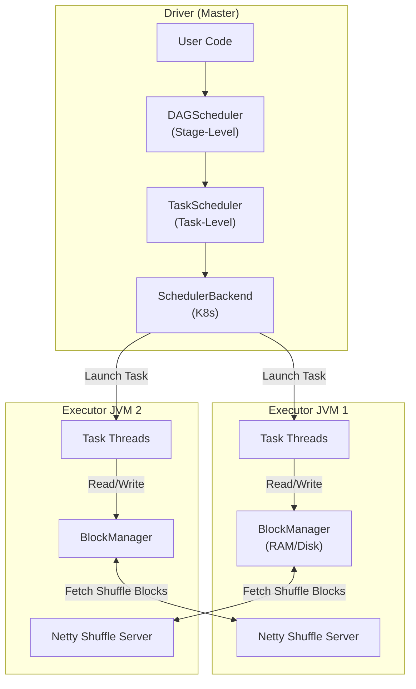
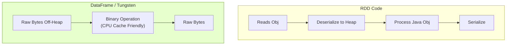
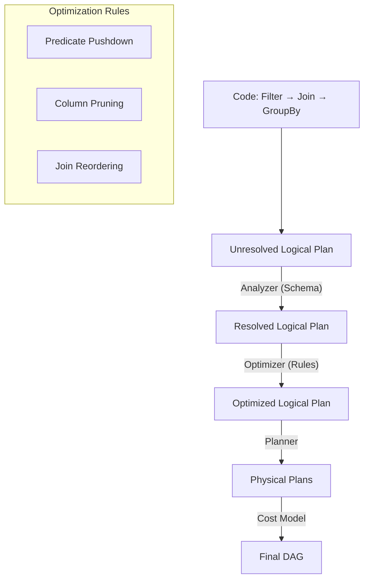
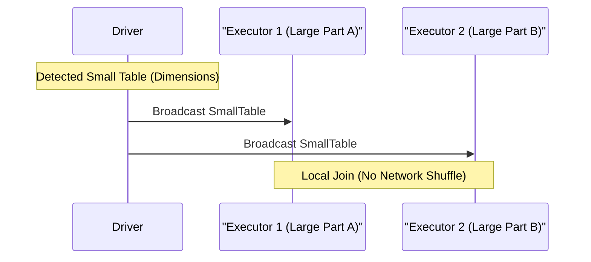
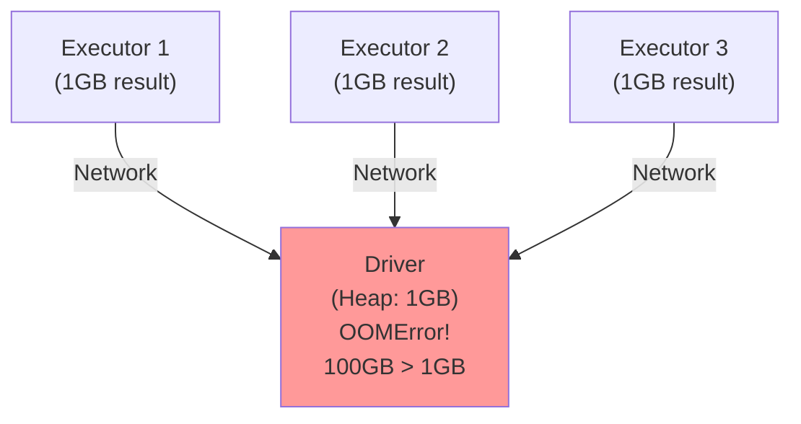
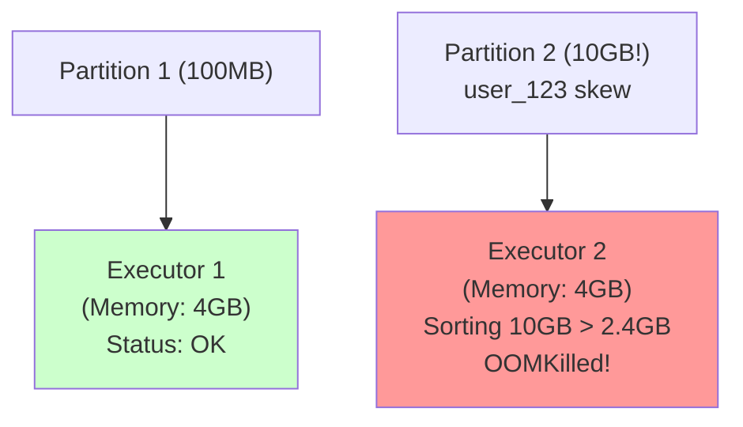

# Apache Spark: The Engine of Modern Data Engineering

## 1. Introduction
Apache Spark is an open-source distributed computing system designed for **massive-scale data processing**. Unlike MapReduce (which writes intermediates to disk), Spark keeps data in **memory** across transformations, making it 10-100x faster for iterative workloads like machine learning.

It is the de facto standard for batch processing in modern data platforms.

---

## 2. Core Architecture

Spark follows a **master-worker** architecture.



### Key Components
1.  **Driver**: The "brain" that plans and coordinates execution.
2.  **Executor**: The "muscle" that runs tasks and stores data.
3.  **Shuffle**: The network transfer of data between Executors to align keys (expensive operation).

---

## 3. How It Works: API Evolution

The history of Spark is the history of moving away from Java Objects.

### A. RDD (Resilient Distributed Dataset) - *The Opaque Blob*
*   **The Model**: `RDD[Person]`. To Spark, a `Person` object is a "Black Box".
*   **The Overhead**: To filter `age > 18`, Spark must deserialize the whole object.

### B. DataFrame (Spark SQL) - *The Schema Aware*
*   **The Model**: `Dataset[Row]`.
*   **The Optimization**: Because Spark knows column `age` is an `INT`, it stores it efficiently in **Off-Heap Memory** (Tungsten).
*   **Binary Processing**: Spark checks `age > 18` directly on raw bytes.



---

## 4. Deep Dive: Internal Implementation

### A. The Driver Components

#### 1. DAGScheduler (High-Level Layer)
*   **Role**: Converts the Logical Graph (RDD Lineage) into **Stages**.
*   **Logic**: It draws boundaries wherever a **Shuffle** (Wide Dependency) occurs.
*   **Debugging**: If you see "Stage 2 failed", it means the DAGScheduler couldn't get Shuffle Outputs from Stage 1. It handles *Stage-Level* retries.

#### 2. TaskScheduler (Low-Level Layer)
*   **Role**: Accepts a "TaskSet" from the DAGScheduler and tries to schedule individual tasks on Executors.
*   **Logic**: It handles **Data Locality**. It will wait (`spark.locality.wait`, default 3s) to launch a task on the *exact* node where the data lives (`NODE_LOCAL`) before downgrading to "Anywhere" (`RACK_LOCAL`).
*   **Debugging**: If your cluster is idle but tasks aren't starting, the TaskScheduler is likely waiting for a busy executor to free up to preserve locality.

#### 3. SchedulerBackend
Interfaces with the cluster manager (K8s/YARN) to request resources.

### B. The Executor Components

#### 1. The Execution Engine (Thread Pool)
Runs the tasks.

#### 2. The BlockManager (Critical for OOM Debugging)
*   It manages **Storage Memory** (Caching RDDs) + **Execution Memory** (Shuffle Buffers).
*   It acts as a distributed file system node, serving shuffle blocks to other executors via **Netty**.

### C. The Catalyst Optimizer (The Brain)

When you write `df.filter(...)`, you are building a **Logical Plan**. Catalyst compiles this into a Physical Plan.



### D. The Shuffle Mechanisms

#### 1. Sort-Merge Join (The Standard)
*   **Scenario**: Two Large Tables.
*   **Mechanism**: Shuffle → Sort → Merge.
*   **Bottleneck**: Network I/O and Disk Spillage during Sort.

#### 2. Broadcast Hash Join (The Optimization)
*   **Scenario**: One Large Table, One Small Table (< 10MB default).
*   **Mechanism**: Driver sends the small table to *every* executor.
*   **Result**: Local hash lookup. **No Shuffle**.



---

## 5. End-to-End Walkthrough: Life and Death of a Query

Let's trace a SQL query from submission to completion.

### Step 1: Submission Phase
*   **User**: Runs `spark-submit --deploy-mode cluster my-job.jar`.
*   **Cluster Manager (K8s)**: Allocates a container for the **Driver**.
*   **Driver Boot**: The JVM starts. The `SparkContext` initializes the `DAGScheduler`, `TaskScheduler`, and `BlockManagerMaster`.

### Step 2: Planning Phase
*   **Code**: `df.groupBy("id").count()`
*   **Catalyst**: Parses SQL → Logical Plan → Optimized Plan → Physical Plan.
*   **DAGScheduler**:
    *   Sees a `Exchange` (Shuffle) in the physical plan.
    *   Breaks the job into **Stage 0** (Read + Map) and **Stage 1** (Reduce).

### Step 3: Execution Phase (Stage 0)
*   **TaskScheduler**: Gets a `TaskSet` of 1000 tasks (one per file).
*   **Locality Wait**: Checks where the blocks live (HDFS/S3). Tries `NODE_LOCAL`.
*   **Executor**:
    *   Receives `TaskDescription`.
    *   Thread runs: Read Parquet → Extract "id" → Write to **Local Disk** (Shuffle Write).
    *   **BlockManager**: Reports to Driver: "I have shuffle block `shuffle_0_1_0` size 50MB".

### Step 4: The Shuffle Phase & Stage 1
*   **DAGScheduler**: Marks Stage 0 as Success. Submits Stage 1.
*   **Executor (Stage 1)**:
    *   Task needs data for key "user_123".
    *   **MapOutputTracker**: Asks Driver "Who has the blocks?"
    *   **ShuffleClient**: Connects to Executor A, B, and C to fetch the relevant chunks.

---

## 6. Failure Scenarios (The Senior View)

Debugging is about understanding *where* the chain broke.

### Scenario A: The Driver OOM

**Symptom**: `java.lang.OutOfMemoryError: Java heap space` on the Driver.
**Cause**: Calling `.collect()` or `.take(N)` on a huge dataset.

#### The Mechanism

When you call `collect()`, Spark performs the following:
1.  **Executor Side**: All executors serialize their partition results into their `BlockManager`.
2.  **Network Transfer**: Each executor sends its serialized data to the Driver's `BlockManager` over the network.
3.  **Driver Side**: The Driver JVM heap must hold **all** results in memory simultaneously.

**The Problem**: If you have 100 executors, each with 1GB of results, the Driver needs 100GB of heap. Most drivers are configured with 1-4GB only.



#### The Fix

**Option 1: Don't Use `.collect()`**
```scala
// BAD: Collects all data to driver
val results = df.collect()  // OOM if large!

// GOOD: Write to distributed storage
df.write.mode("overwrite").parquet("s3://bucket/output")
```

**Option 2: Sample Data**
```scala
// Collect only a sample
val sample = df.sample(0.01).collect()  // Only 1% of data
```

**Option 3: Increase Driver Memory**
```
spark-submit --driver-memory 16g ...
```

---

### Scenario B: The Shuffle Fetch Fail

**Symptom**: `FetchFailedException: Failed to fetch block shuffle_1_2_0`.
**Cause**: An Executor acting as a "Shuffle Server" crashed (OOM or Spot Instance loss).

#### The Mechanism

Spark's shuffle has two phases:
1.  **Shuffle Write** (Map side): Executor A writes shuffle files to its local disk.
2.  **Shuffle Read** (Reduce side): Executor B fetches those files from Executor A over the network.

**The Failure**:
1.  **Stage 1** (Map): Executor A writes `shuffle_1_2_0` to disk.
2.  **Executor A Crashes**: OOM, spot instance termination, or hardware failure.
3.  **Stage 2** (Reduce): Executor B tries to fetch `shuffle_1_2_0` from Executor A.
4.  **Network Error**: Connection refused (Executor A is dead).
5.  **TaskScheduler**: Marks task as `FetchFailedException`.
6.  **DAGScheduler**: Realizes the shuffle data is lost → **Resubmits Stage 1** to regenerate it.

#### The Fix

**Immediate**: The resubmit is automatic. No action required.

**Long-term Prevention**:
1.  **Enable External Shuffle Service** (persists shuffle data even if executor dies):
   ```
   spark.shuffle.service.enabled=true
   ```
2.  **Use Stable Instances**: Avoid spot instances for executors if possible.
3.  **Increase Executor Memory**: Reduce OOM likelihood.

---

### Scenario C: The Executor OOM (Data Skew)

**Symptom**: `Pod OOMKilled (Exit Code 137)` in Kubernetes or `java.lang.OutOfMemoryError: Java heap space` on executor.
**Cause**: **Data Skew**. One partition is 10GB, while others are 100MB.

#### The Mechanism

**Spark's Memory Model**: Each executor has a fixed heap (e.g., 4GB).
*   **Execution Memory**: Used for sorting/shuffling (60% of heap by default).
*   **Storage Memory**: Used for caching (40% of heap).

**The Problem**:
1.  **GroupBy Key "user_123"**: 99% of data has `user_id = "user_123"`.
2.  **Partitioning**: Spark hashes the key → All "user_123" data goes to **one partition**.
3.  **Executor Assignment**: One executor gets a 10GB partition.
4.  **Sorting/Aggregation**: Executor tries to sort 10GB in 2.4GB of Execution Memory.
5.  **Spill to Disk**: Spark spills to disk, but metadata overhead (pointers, index) still consumes heap.
6.  **OOM**: Heap exhausted → Process killed.



#### The Fix

**Option 1: Salting (Add Random Suffix)**
```scala
// Add random suffix to skewed key
val saltedDF = df.withColumn("salted_key", 
    concat(col("user_id"), lit("_"), (rand() * 10).cast("int")))

// GroupBy on salted key (distributes across 10 partitions)
val result = saltedDF.groupBy("salted_key").agg(sum("amount"))

// Remove salt and re-aggregate
val final = result.withColumn("user_id", split(col("salted_key"), "_")(0))
    .groupBy("user_id").agg(sum("sum(amount)"))
```

**Option 2: Increase Executor Memory**
```
--executor-memory 16g
```

**Option 3: Increase Partitions**
```scala
spark.conf.set("spark.sql.shuffle.partitions", 1000)  // Default is 200
```

---

### Scenario D: The Serialization Trap

**Symptom**: `java.io.NotSerializableException: some.package.MyClass`.
**Cause**: Accessing a non-serializable object (like a DB connection) inside a `map()` function.

#### The Mechanism

Spark must **serialize closures** (the code inside `map/filter/etc`) on the Driver and send them to Executors.

**The Problem**:
```scala
// BAD: Connection created on Driver (not serializable)
val connection = new DatabaseConnection()  // Lives on Driver

df.map(row => {
    connection.query(row.getString(0))  // ERROR: connection not serializable!
})
```

**Why It Fails**: The closure captures `connection`. Spark tries to serialize `connection` to send it to executors, but database connections hold OS-level resources (sockets, file descriptors) that cannot be serialized.

#### The Fix

**Option 1: Create Connection Inside `mapPartitions`**
```scala
df.mapPartitions(partition => {
    // Create connection INSIDE the executor (not serialized)
    val connection = new DatabaseConnection()
    
    val results = partition.map(row => {
        connection.query(row.getString(0))
    })
    
    connection.close()
    results
})
```

**Option 2: Use Broadcast Variables (for read-only objects)**
```scala
val configBroadcast = spark.sparkContext.broadcast(config)

df.map(row => {
    val localConfig = configBroadcast.value  // Deserialize on executor
    processRow(row, localConfig)
})
```

---

---

## 7. Performance Tuning & Configuration

| Configuration | Recommendation | Why? |
| :--- | :--- | :--- |
| `spark.sql.shuffle.partitions` | `DataSize / 128MB` | 200 is too small for TBs (OOM). |
| `spark.sql.autoBroadcastJoinThreshold` | 20MB - 100MB | Force more Broadcast Joins if RAM permits. |
| `spark.locality.wait` | `3s` (Default) | If tasks are slow to start, reduce to `0s` (Process Anywhere). |
| `spark.executor.memory` | 80% of pod memory | Leave 20% for OS overhead. |
| `spark.memory.fraction` | `0.6` (Default) | % of heap for execution/storage vs user objects. |

---

## 8. When to Use Spark?

| Use Case | Verdict | Why? |
| :--- | :--- | :--- |
| **Batch ETL (TB-scale)** | **YES** | Spark's sweet spot. Fast, fault-tolerant. |
| **Machine Learning (Iterative)** | **YES** | In-memory caching makes it 100x faster than MapReduce. |
| **Real-time Streaming** | **MAYBE** | Use Structured Streaming, but Flink is better. |
| **Small Data (< 1GB)** | **NO** | Overhead of JVM startup isn't worth it. Use Pandas/DuckDB. |
| **Complex Event Processing** | **NO** | Use Flink (better backpressure, lower latency). |

---

## 9. Production Checklist

1.  [ ] **Dynamic Allocation**: Enable `spark.dynamicAllocation.enabled=true` to auto-scale executors.
2.  [ ] **Broadcast Threshold**: Tune `spark.sql.autoBroadcastJoinThreshold` based on your RAM.
3.  [ ] **Shuffle Partitions**: Set `spark.sql.shuffle.partitions` based on data size (not the default 200).
4.  [ ] **Monitoring**: Use Spark UI to identify shuffle spill, GC time, and skew.
5.  [ ] **Spot Instances**: Use for executors, NOT for the driver (driver loss kills the job).
6.  [ ] **Checkpointing**: Enable for long lineages (`df.checkpoint()`) to prevent stack overflow.
