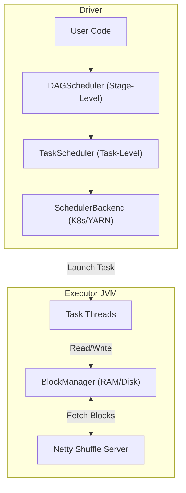
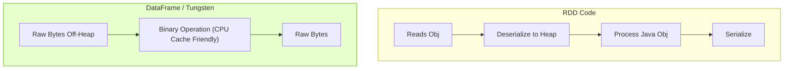
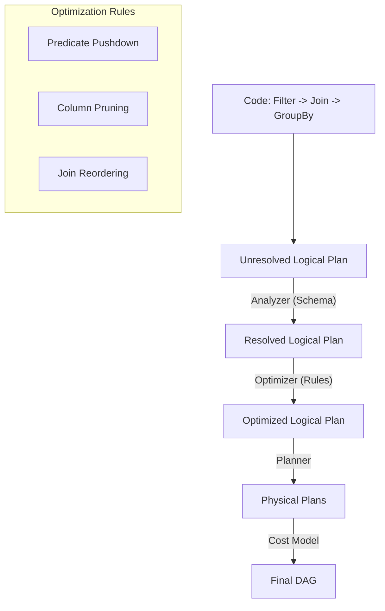
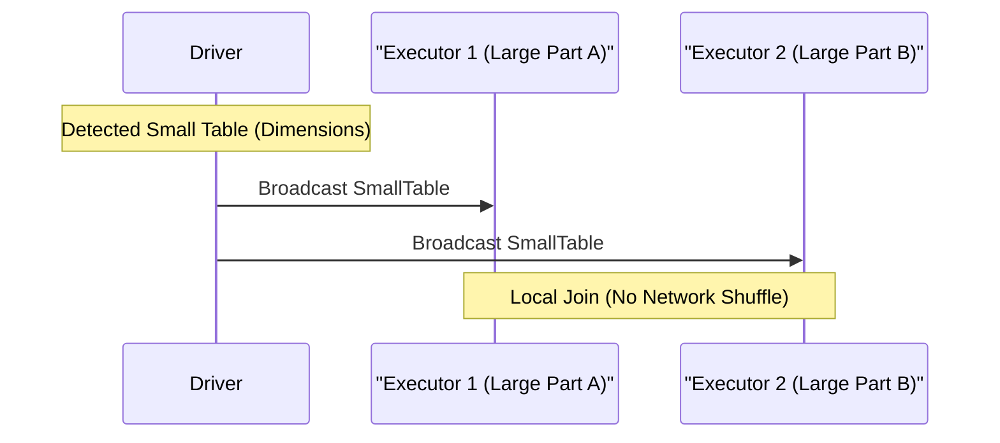

# Apache Spark: The Engine of Modern Data Engineering

## Chapter 1: The Anatomy of the Runtime

Spark is not just a "Driver" and "Executors". It is a complex orchestration of schedulers, block managers, and RPC endpoints. Debugging a stuck job requires knowing *which* sub-component is holding the lock.

### 1. The Driver: The Brain
The Driver is not a single entity; it is a JVM process hosting three critical components:

*   **A. DAGScheduler (High-Level Layer)**
    *   **Role**: Converts the Logical Graph (RDD Lineage) into **Stages**.
    *   **Logic**: It draws boundaries wherever a **Shuffle** (Wide Dependency) occurs.
    *   **Debugging**: If you see "Stage 2 failed", it means the DAGScheduler couldn't get Shuffle Outputs from Stage 1. It handles *Stage-Level* retries.
*   **B. TaskScheduler (Low-Level Layer)**
    *   **Role**: Accepts a "TaskSet" from the DAGScheduler and tries to schedule individual tasks on Executors.
    *   **Logic**: It handles **Data Locality**. It will wait (`spark.locality.wait`, default 3s) to launch a task on the *exact* node where the data lives (`NODE_LOCAL`) before downgrading to "Anywhere" (`RACK_LOCAL`).
    *   **Debugging**: If your cluster is idle but tasks aren't starting, the TaskScheduler is likely waiting for a busy executor to free up to preserve locality.
*   **C. SchedulerBackend**: Interfaces with the cluster manager (K8s/YARN) to request resources.

### 2. The Executor: The Muscle
An Executor is a JVM running on a worker node. It has two main sub-systems:

*   **A. The Execution Engine (Thread Pool)**: Runs the tasks.
*   **B. The BlockManager**: The most important component for debugging OOMs.
    *   It manages **Storage Memory** (Caching RDDs) + **Execution Memory** (Shuffle Buffers).
    *   It acts as a distributed file system node, serving shuffle blocks to other executors via **Netty**.



---

## Chapter 2: The Evolution of the API (RDD vs DataFrame vs Dataset)

The history of Spark is the history of moving away from Java Objects.

### 1. RDD (Resilient Distributed Dataset) - *The Opaque Blob*
*   **The Model**: `RDD[Person]`. To Spark, a `Person` object is a "Black Box".
*   **The Overhead**: To filter `age > 18`, Spark must deserialize the whole object.

### 2. DataFrame (Spark SQL) - *The Schema Aware*
*   **The Model**: `Dataset[Row]`.
*   **The Optimization**: Because Spark knows column `age` is an `INT`, it stores it efficiently in **Off-Heap Memory** (Tungsten).
*   **Binary Processing**: Spark check `age > 18` directly on raw bytes.



---

## Chapter 3: The Brain (Catalyst) and The Brawn (Tungsten)

### The Catalyst Optimizer
When you write `df.filter(...)`, you are building a **Logical Plan**. Catalyst compiles this into a Physical Plan.



---

## Chapter 4: The Physics of the Shuffle (Joins)

The Shuffle is where Spark jobs die. It is the movement of data across the network to align keys.

### 1. Sort-Merge Join (The Standard)
*   **Scenario**: Two Large Tables.
*   **Mechanism**: Shuffle -> Sort -> Merge.
*   **Bottleneck**: Network I/O and Disk Spillage during Sort.

### 2. Broadcast Hash Join (The Optimization)
*   **Scenario**: One Large Table, One Small Table (< 10MB default).
*   **Mechanism**: Driver sends the small table to *every* executor.
*   **Result**: Local hash lookup. **No Shuffle**.



---

## Chapter 5: The Tuning Knobs (Configuration)

| Configuration | Recommendation | Why? |
| :--- | :--- | :--- |
| `spark.sql.shuffle.partitions` | `DataSize / 128MB` | 200 is too small for TBs (OOM). |
| `spark.sql.autoBroadcastJoinThreshold` | 20MB - 100MB | Force more Broadcast Joins if RAM permits. |
| `spark.locality.wait` | `3s` (Default) | If tasks are slow to start, reduce this to `0s` (Process Anywhere). |

---

## Chapter 6: End-to-End Walkthrough: Life and Death of a Query

Let's trace a SQL query from submission to completion to see how the "Brain" and "Muscle" interact.

### 1. Submission Phase
*   **User**: Runs `spark-submit --deploy-mode cluster my-job.jar`.
*   **Cluster Manager (YARN/K8s)**: Allocates a container for the **Driver**.
*   **Driver Boot**: The JVM starts. The `SparkContext` initializes the `DAGScheduler`, `TaskScheduler`, and `BlockManagerMaster`.

### 2. Planning Phase
*   **Code**: `df.groupBy("id").count()`
*   **Catalyst**: Parses SQL -> Logical Plan -> Optimized Plan -> Physical Plan.
*   **DAGScheduler**:
    *   Sees a `Exchange` (Shuffle) in the physical plan.
    *   Breaks the job into **Stage 0** (Read + Map) and **Stage 1** (Reduce).

### 3. Execution Phase (Stage 0)
*   **TaskScheduler**: Gets a `TaskSet` of 1000 tasks (one per file).
*   **Locality Wait**: Checks where the blocks effectively live (HDFS/S3). Tries `NODE_LOCAL`.
*   **Executor**:
    *   Received `TaskDescription`.
    *   Thread runs: Read Parquet -> Extract "id" -> Write to **Local Disk** (Shuffle Write).
    *   **BlockManager**: Reports to Driver: "I have shuffle block `shuffle_0_1_0` size 50MB".

### 4. The Shuffle Phase & Stage 1
*   **DAGScheduler**: Marks Stage 0 as Success. Submits Stage 1.
*   **Executor (Stage 1)**:
    *   Task needs data for key "user_123".
    *   **MapOutputTracker**: Asks Driver "Who has the blocks?"
    *   **ShuffleClient**: Connects to Executor A, B, and C to fetch the relevant chunks.

---

## Chapter 7: Failure Scenarios (The Senior View)

Debugging is about understanding *where* the chain broke.

### 1. Failure Scenario A: The Driver OOM
**Symptom**: `java.lang.OutOfMemoryError: Java heap space` on the Driver.
**Cause**: Calling `.collect()` or `.take(N)` on a huge dataset.
*   **Mechanism**: `collect()` forces all Executors to serialize their results and send them to the Driver's `BlockManager`.
*   **Visual**:
    ```mermaid
    graph TD
        E1["Executor 1"] -- "Result (1GB)" --> D["Driver (Heap: 1GB)"]
        E2["Executor 2"] -- "Result (1GB)" --> D
        style D fill:#ff9999
    ```

### 2. Failure Scenario B: The Shuffle Fetch Fail
**Symptom**: `FetchFailedException` followed by `Resubmitting Stage`.
**Cause**: An Executor acting as a "Shuffle Server" crashed (OOM or Spot Instance loss).
**Recovery**:
1.  **ShuffleClient** tries to fetch block from Executor X. Fails.
2.  **TaskScheduler** marks task failed.
3.  **DAGScheduler** realizes the *Source Data* is gone.
4.  **Action**: It **Resubmits the Previous Stage** to regenerate the missing shuffle files.

### 3. Failure Scenario C: The Executor OOM (The Skewed Partition)
**Symptom**: `Pod OOMKilled (Exit Code 137)` in Kubernetes.
**Cause**: **Data Skew**. One partition is 10GB, while others are 100MB.
*   **Mechanism**: The Executor tries to load the 10GB partition into the "Execution Memory" (Unified Memory) for sorting/shuffling. It spills to disk, but if the metadata pointers alone exceed overhead, it crashes.
*   **Visual**:
    ```mermaid
    graph TD
        P1["Partition 1 (100MB)"] --> E1["Executor 1 (Safe)"]
        P2["Partition 2 (10GB!)"] --> E2["Executor 2 (OOM Crash)"]
        style E2 fill:#ff9999
    ```

### 4. Failure Scenario D: The Serialization Trap
**Symptom**: `java.io.NotSerializableException`
**Cause**: Accessing a non-serializable object (like a socket or DB connection) inside a `map()` function.
*   **Mechanism**: Spark must **Serialize** the code (Closure) on the Driver to send it to the Executor. If the closure references an open connection, serialization fails because connections are tied to the machine's OS handle.
*   **The Fix**: Create the connection *inside* `mapPartitions()`, not on the Driver.

---

## Chapter 8: Conclusion
Mastery of Spark requires thinking less like a SQL analyst and more like a kernel developer—managing memory pages, serialization overheads, and network physics.
