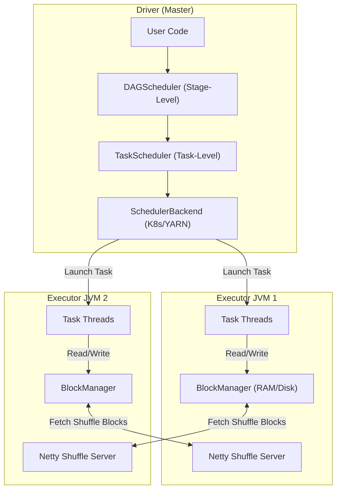
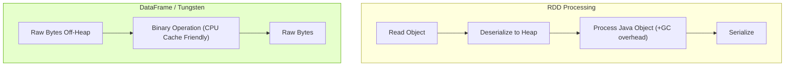
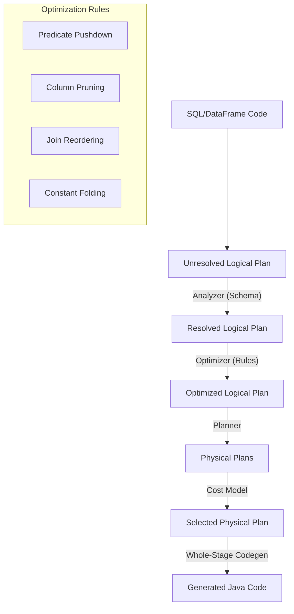
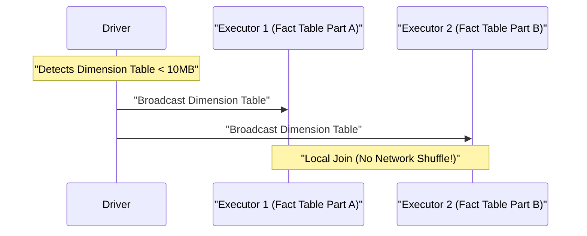
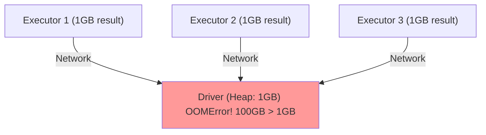
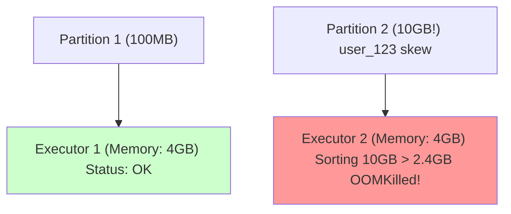

# Apache Spark: Distributed Data Processing at Scale

## 1. Introduction

**Apache Spark** is an open-source, unified analytics engine for large-scale data processing. Designed for **speed, ease of use, and sophisticated analytics**, Spark provides high-level APIs in Java, Scala, Python, and R, along with an optimized engine that supports general execution graphs.

**Problem It Solves**:
- **Speed**: In-memory processing makes Spark 10-100x faster than MapReduce for iterative algorithms
- **Ease of Use**: High-level APIs (DataFrame, Dataset, SQL) abstract complexity
- **Versatility**: Batch processing, SQL queries, streaming, machine learning, graph processing in one framework
- **Fault Tolerance**: Lineage-based recovery without checkpointing every step

**Key Differentiator**: Unlike Hadoop MapReduce which writes intermediate results to disk after every operation, Spark keeps data in **RAM across transformations**, enabling iterative algorithms (machine learning, graph processing) to run orders of magnitude faster. The Catalyst optimizer and Tungsten execution engine provide further performance gains through query optimization and code generation.

**Industry Adoption**:
- **Databricks**: Founded by Spark creators, cloud-native Spark platform
- **Netflix**: 100+ PB of data processed daily for recommendations
- **Uber**: Real-time analytics on trips, pricing, fraud detection
- **Airbnb**: Search ranking, pricing models, fraud detection
- **Apple**: Siri analytics, App Store recommendations
- **Used by**: 80%+ of Fortune 500 companies for big data workloads

**Historical Context**: Created in 2009 at UC Berkeley AMPLab by Matei Zaharia as a research project to address MapReduce's limitations (disk I/O bottleneck, poor iterative performance). Open-sourced in 2010, became Apache top-level project in 2014. Spark 1.0 (2014) introduced DataFrames, Spark 2.0 (2016) unified DataFrame/Dataset APIs, Spark 3.0 (2020) added adaptive query execution and dynamic partition pruning.

**Current Version**: Spark 3.5+ (2024) features include:
- **Adaptive Query Execution (AQE)**: Runtime query optimization
- **Dynamic Partition Pruning**: Skip irrelevant partitions based on runtime filters
- **Pandas API on Spark**: Drop-in replacement for pandas with distributed backend
- **Project Zen**: Improved Python performance with zero-copy data transfer

---

## 2. Core Architecture

Spark follows a **master-worker** architecture with a central coordinator (Driver) and distributed workers (Executors).



### Key Components

**1. Driver (Master Node)**:
- **SparkContext**: Entry point, coordinates job execution
- **DAGScheduler**: Converts logical plan into stages based on shuffle boundaries
- **TaskScheduler**: Assigns tasks to executors with data locality optimization
- **BlockManagerMaster**: Tracks data location across cluster

**2. Executor (Worker Node)**:
- **Task Execution**: Runs actual computation in thread pool
- **BlockManager**: Manages storage (cache, shuffle data) in memory and disk
- **Shuffle Service**: Serves shuffle blocks to other executors via Netty

**3. Shuffle (Data Transfer)**:
- Network transfer of data between executors to align keys
- Most expensive operation in Spark jobs
- Triggers stage boundaries in execution plan

**4. Cluster Manager** (YARN, Kubernetes, Mesos, Standalone):
- Resource allocation and container lifecycle management
- Driver and executor pod/container scheduling

---

## 3. How It Works: API Evolution

Spark's evolution reflects the shift from opaque Java objects to schema-aware columnar processing.

### A. RDD (Resilient Distributed Dataset) - The Foundation

**Introduced**: Spark 0.6 (2012)

**Model**: `RDD[Person]` - Generic type, opaque to Spark

**Characteristics**:
- Immutable distributed collection
- Lazy evaluation (transformations build lineage)
- Fault tolerance via lineage recomputation
- **Limitation**: Spark sees objects as "black boxes"

**Example**:
```scala
// Scala
val rdd = sc.textFile("data.csv")
  .map(line => line.split(","))
  .filter(fields => fields(2).toInt > 18)  // Must deserialize entire object!
```

```python
# Python
rdd = sc.textFile("data.csv") \
  .map(lambda line: line.split(",")) \
  .filter(lambda fields: int(fields[2]) > 18)
```

**Overhead**: To filter `age > 18`, Spark must:
1. Deserialize entire `Person` object from bytes to JVM heap
2. Access `age` field
3. Serialize result back to bytes

---

### B. DataFrame (Spark SQL) - Schema Awareness

**Introduced**: Spark 1.3 (2015)

**Model**: `Dataset[Row]` with schema metadata

**Optimization**: Catalyst knows column `age` is `INT` at byte offset 16

**Advantages**:
- **Off-Heap Memory**: Tungsten stores data in binary format outside JVM heap
- **Binary Processing**: Filter `age > 18` directly on raw bytes (no deserialization)
- **Columnar Storage**: Cache-friendly memory layout
- **Query Optimization**: Catalyst optimizer rewrites queries

**Example**:
```scala
// Scala
val df = spark.read.parquet("data.parquet")
  .filter($"age" > 18)  // Catalyst optimizes this!
```

```python
# Python
df = spark.read.parquet("data.parquet") \
  .filter(col("age") > 18)
```

**Performance Comparison**:



**Result**: DataFrame is 5-10x faster than RDD for structured data due to:
- No serialization/deserialization overhead
- Columnar compression (Parquet, ORC)
- Predicate pushdown to storage layer
- Code generation (Whole-Stage Codegen)

---

### C. Dataset API - Type Safety + Optimization

**Introduced**: Spark 1.6 (2016), unified in Spark 2.0

**Model**: `Dataset[Person]` - Type-safe + optimized

**Best of Both Worlds**:
- Compile-time type safety (like RDD)
- Catalyst optimization (like DataFrame)

**Example**:
```scala
// Scala only (Dataset API not available in Python)
case class Person(name: String, age: Int)

val ds = spark.read.parquet("data.parquet").as[Person]
  .filter(_.age > 18)  // Type-safe, Catalyst-optimized
```

---

## 4. Deep Dive: Internal Implementation

### A. Driver Components

#### 1. DAGScheduler (High-Level Planning)

**Role**: Converts RDD lineage into **stages** separated by shuffle boundaries

**Algorithm**:
```
1. Start from final RDD (action like collect, count)
2. Traverse lineage backwards
3. When encountering wide dependency (shuffle):
   - Create stage boundary
   - Mark all narrow dependencies in current stage
4. Submit stages in topological order
```

**Stage Types**:
- **ShuffleMapStage**: Produces shuffle output for next stage
- **ResultStage**: Final stage that produces action result

**Example**:
```
textFile() -> map() -> filter() -> groupByKey() -> mapValues() -> collect()
           [------- Stage 0 -------]  ^shuffle  [---- Stage 1 ----]
```

**Debugging**: `Stage 2 failed` means DAGScheduler couldn't retrieve shuffle outputs from previous stage

---

#### 2. TaskScheduler (Task-Level Execution)

**Role**: Schedules individual tasks from TaskSet with **data locality** optimization

**Locality Levels** (in preference order):
1. **PROCESS_LOCAL**: Data in same JVM (cached RDD)
2. **NODE_LOCAL**: Data on same node (different executor or HDFS)
3. **RACK_LOCAL**: Data on same rack
4. **ANY**: Data anywhere (requires network transfer)

**Wait Strategy**:
- Default: Wait 3s (`spark.locality.wait`) for preferred locality
- After timeout: Downgrade to next level
- Trade-off: Locality vs parallelism

**Example Timeline**:
```
t=0: TaskScheduler has 100 tasks, executor A has data
t=0: Try NODE_LOCAL on executor A (busy)
t=3s: Locality wait expired, accept ANY (launch on executor B)
Result: Network transfer from A to B
```

---

#### 3. Catalyst Optimizer (Query Optimization)

**Pipeline**:



**Key Optimizations**:

**1. Predicate Pushdown**:
```sql
-- Before optimization
SELECT * FROM parquet_table WHERE age > 18

-- After pushdown (to Parquet reader)
Parquet reader skips row groups where max(age) <= 18
```

**2. Column Pruning**:
```sql
-- User query
SELECT name FROM users WHERE age > 18

-- Catalyst only reads 'name' and 'age' columns (not all 50 columns)
```

**3. Join Reordering**:
```
-- Original: (A join B) join C
-- Optimized: (A join C) join B  (if A join C produces fewer rows)
```

---

### B. Executor Components

#### 1. BlockManager (Storage Layer)

**Responsibilities**:
- Cache RDDs/DataFrames in memory or disk
- Store shuffle outputs
- Serve shuffle blocks to other executors

**Memory Layout**:
```
Total Executor Memory (e.g., 16GB)
├─ Reserved (300MB): Spark internals
├─ User Memory (40%, 6.3GB): User data structures
└─ Spark Memory (60%, 9.4GB):
    ├─ Storage Memory (50% = 4.7GB): Cached RDDs
    └─ Execution Memory (50% = 4.7GB): Shuffle buffers, aggregations
```

**Eviction Policy**:
- Storage memory can borrow from execution (and vice versa)
- When both full: Evict cached RDD blocks (LRU)
- Execution memory cannot be evicted (causes spill to disk)

---

#### 2. Tungsten Execution Engine

**Goal**: Optimize CPU and memory efficiency

**Techniques**:

**1. Off-Heap Memory Management**:
```
JVM Heap: User objects + driver metadata
Off-Heap: DataFrame data in binary format (no GC overhead)
```

**2. Whole-Stage Code Generation**:
```scala
// User code
df.filter(col("age") > 18).select("name")

// Catalyst generates optimized Java code:
while (hasNext()) {
    int age = getInt(row, 2);  // Direct memory access
    if (age > 18) {
        UTF8String name = getUTF8String(row, 0);
        output.write(name);
    }
}
// No virtual function calls, tight loop, CPU cache-friendly
```

**3. Vectorized Processing** (Parquet, ORC):
- Process batches of rows (1024 rows) instead of one-at-a-time
- Leverage SIMD instructions

---

### C. Shuffle Mechanisms

Shuffle is the **most expensive** Spark operation (network + disk I/O).

#### 1. Sort-Merge Join (Default for Large Tables)

**Algorithm**:
```
Phase 1: Shuffle Write
- Partition data by join key hash
- Sort within each partition
- Write to disk (one file per partition)

Phase 2: Shuffle Read
- Fetch sorted partitions from all executors
- Merge sorted streams
- Join matching keys
```

**Performance**:
- **Network**: Transfer all data from both tables
- **Disk**: Spill large partitions to disk during sort
- **CPU**: Sorting overhead

---

#### 2. Broadcast Hash Join (Optimized for Small Tables)

**Threshold**: `spark.sql.autoBroadcastJoinThreshold` (default 10MB)

**Algorithm**:
```
1. Driver collects small table to memory
2. Driver broadcasts small table to all executors
3. Each executor builds hash table from broadcast
4. Local hash lookup (no shuffle!)
```

**Example**:



**Performance**: 10-100x faster than sort-merge join for small dimension tables

---

## 5. End-to-End Walkthrough: Life of a Query

**Scenario**: Process 1TB of data with `groupBy` aggregation

### User Code

```scala
// Scala
val df = spark.read.parquet("s3://bucket/data")  // 1TB, 10,000 files
  .filter($"country" === "US")
  .groupBy("product_id")
  .agg(sum("revenue"))
  .write.parquet("s3://bucket/output")
```

```python
# Python
df = spark.read.parquet("s3://bucket/data") \
  .filter(col("country") == "US") \
  .groupBy("product_id") \
  .agg(sum("revenue")) \
  .write.parquet("s3://bucket/output")
```

### Step 1: Job Submission (t=0s)

```
User: spark-submit --deploy-mode cluster \
  --executor-memory 16g \
  --num-executors 100 \
  my_job.py

Cluster Manager (K8s): Allocate driver pod
Driver JVM: Starts, initializes SparkContext
```

### Step 2: Catalyst Planning (t=0.1s)

```
1. Parse: DataFrame DSL → Unresolved Logical Plan
2. Analyze: Resolve table schema from Parquet metadata
3. Optimize:
   - Predicate pushdown: Push filter to Parquet reader
   - Column pruning: Only read 'country', 'product_id', 'revenue'
4. Physical Plan:
   - FileScan (Parquet) → Filter → Exchange (Shuffle) → HashAggregate
```

### Step 3: DAG Scheduling (t=0.2s)

```
DAGScheduler detects Exchange (shuffle) → Creates 2 stages:

Stage 0 (ShuffleMapStage):
  - Read Parquet (10,000 tasks, one per file)
  - Filter country='US'
  - Partial aggregation (map-side combine)
  - Shuffle write (partition by product_id hash)

Stage 1 (ResultStage):
  - Shuffle read
  - Final aggregation
  - Write Parquet output
```

### Step 4: Stage 0 Execution (t=0.5s - t=120s)

```
TaskScheduler:
  - Creates 10,000 tasks (one per input file)
  - Schedules with NODE_LOCAL preference

Executor (running task 42):
  1. Read s3://bucket/data/file_0042.parquet
     - Parquet filter pushdown: Skip row groups where country != 'US'
     - Vectorized read: Batch 1024 rows at a time
     - Result: 10GB → 1GB after filter (90% filtered)
  
  2. Partial Aggregation (Map-side combine):
     - Build hash map: product_id → sum(revenue)
     - Reduces data: 1GB → 100MB
  
  3. Shuffle Write:
     - Partition by hash(product_id) % 200 (default shuffle partitions)
     - Write to local disk: /tmp/spark/shuffle_0_42_*.data
     - Report to Driver: "Shuffle block locations ready"

All 10,000 tasks complete: 2 minutes (120s)
Total shuffle write: 10TB → 100GB after partial aggregation
```

### Step 5: Shuffle Phase (t=120s - t=180s)

```
DAGScheduler: Marks Stage 0 success, submits Stage 1 (200 tasks)

Executor (running task 15 of Stage 1):
  1. MapOutputTracker: Ask driver "Who has partition 15 data?"
     Driver: "Executors [3, 17, 42, 88, 91] have blocks"
  
  2. ShuffleClient: Fetch blocks over network
     - Connect to 5 executors via Netty
     - Download shuffle_0_*_15.data files
     - Total: 500MB for this partition
  
  3. External Sort (if doesn't fit in execution memory):
     - Spill to disk if > 2.4GB execution memory
     - Merge sorted spills

All 200 tasks fetch shuffle data: 1 minute (60s)
```

### Step 6: Stage 1 Execution (t=180s - t=220s)

```
Executor (task 15 continued):
  1. Final Aggregation:
     - Merge partial aggregates
     - Result: product_id → total_revenue
  
  2. Write Output:
     - Write Parquet file to s3://bucket/output/part-15.parquet
     - Columnar compression (product_id: dict encoding, revenue: delta)

All 200 tasks complete: 40s
Total output: 100GB → 1GB (Parquet compression)
```

### Step 7: Job Completion (t=220s)

```
Driver: All tasks succeeded
SparkContext: Job complete
Total time: 220 seconds (3.7 minutes)

Breakdown:
- Planning: 0.2s
- Stage 0 (Read + Map): 120s
- Shuffle: 60s
- Stage 1 (Reduce + Write): 40s
```

---

## 6. Failure Scenarios (The Senior View)

### Scenario A: Driver OOM (Out of Memory)

**Symptom**: `java.lang.OutOfMemoryError: Java heap space` on driver pod

**Cause**: Calling `.collect()` or `.toPandas()` on large dataset

#### The Mechanism

```
Executor 1 (1GB result) ──┐
Executor 2 (1GB result) ──┼──→ Driver (1GB heap) → OOM!
Executor 3 (1GB result) ──┘    100GB data > 1GB heap
```

**Step-by-step**:
1. User calls `df.collect()` on 100GB dataset
2. Each of 100 executors serializes its partition (1GB each)
3. All executors send data to driver over network
4. Driver BlockManager tries to hold 100GB in 1GB heap
5. `OutOfMemoryError` → Driver crashes → **Job fails**



#### The Fix

**Option 1: Don't Use `.collect()`** (Best practice)
```scala
// Scala - BAD
val results = df.collect()  // Brings all data to driver!

// Scala - GOOD
df.write.mode("overwrite").parquet("s3://bucket/output")  // Distributed write
```

```python
# Python - BAD
results = df.collect()  # OOM risk!

# Python - GOOD
df.write.mode("overwrite").parquet("s3://bucket/output")
```

**Option 2: Sample Data**
```scala
// Scala
val sample = df.sample(withReplacement = false, fraction = 0.01).collect()
```

```python
# Python
sample = df.sample(fraction=0.01).collect()
```

**Option 3: Increase Driver Memory** (If really needed)
```bash
spark-submit --driver-memory 16g my_job.py
```

**Monitoring**:
```bash
# Check driver memory usage
kubectl top pod <driver-pod>

# Spark UI → Environment → Driver memory
```

---

### Scenario B: Shuffle Fetch Failure

**Symptom**: `FetchFailedException: Failed to fetch shuffle block shuffle_1_2_0`

**Cause**: Executor serving shuffle data crashed (OOM, spot instance loss, hardware failure)

#### The Mechanism

**Timeline**:
```
t=0: Stage 0 (Map): Executor A writes shuffle_1_2_0 to local disk
t=60s: Executor A crashes (OOM / spot termination)
t=61s: Stage 1 (Reduce): Executor B starts, tries to fetch shuffle_1_2_0
t=61.5s: Network error: Connection refused (Executor A is dead)
t=62s: TaskScheduler marks task as FetchFailedException
t=63s: DAGScheduler resubmits Stage 0 to regenerate lost shuffle data
```

**Impact**: Job continues but with recomputation overhead

#### The Fix

**Immediate**: Automatic resubmit (no action required)

**Long-term Prevention**:

**1. Enable External Shuffle Service** (Persists shuffle data even if executor dies):
```
# Kubernetes
spark.kubernetes.shuffle.namespace=spark
spark.kubernetes.shuffle.labels=app=spark-shuffle

# YARN
spark.shuffle.service.enabled=true
spark.yarn.shuffle.service.enabled=true
```

** 2. Use Stable Instances**:
```bash
# Avoid spot instances for critical jobs
--conf spark.kubernetes.node.selector.node-type=on-demand
```

**3. Increase Executor Memory** (Reduce OOM):
```bash
--executor-memory 16g
```

**Monitoring**:
```
# Spark UI → Stages → Failed Tasks
# Look for FetchFailedException count
```

---

### Scenario C: Executor OOM Due to Data Skew

**Symptom**: `Pod OOMKilled (Exit Code 137)` or `java.lang.OutOfMemoryError`

**Cause**: **Data skew** - one partition is 10GB while others are 100MB

#### The Mechanism

**Memory Model**:
```
Executor Heap (4GB)
├─ Execution Memory (60% = 2.4GB): Sorting, aggregations
└─ Storage Memory (40% = 1.6GB): Cached RDDs
```

**Problem**:
```
groupBy("user_id"):
  - 99% of rows have user_id = "bot_123" (skewed key)
  - Hash partition: All "bot_123" → Partition 42
  - Executor assigned partition 42: Tries to sort 10GB in 2.4GB memory
  - Spill to disk, but metadata overhead exhausts heap
  - OOM → Executor killed
```



#### The Fix

**Option 1: Salting (Distribute Skewed Key)**
```scala
// Scala
import org.apache.spark.sql.functions._

// Add random suffix to skewed key
val saltedDF = df.withColumn("salted_key", 
  concat(col("user_id"), lit("_"), (rand() * 10).cast("int")))

// GroupBy salted key (10 partitions instead of 1)
val result = saltedDF.groupBy("salted_key").agg(sum("amount"))

// Remove salt and re-aggregate
val final = result
  .withColumn("user_id", split(col("salted_key"), "_")(0))
  .groupBy("user_id")
  .agg(sum("sum(amount)"))
```

```python
# Python
from pyspark.sql.functions import col, lit, rand, concat, split, sum

# Add salt
salted_df = df.withColumn("salted_key",
    concat(col("user_id"), lit("_"), (rand() * 10).cast("int")))

# GroupBy salted key
result = salted_df.groupBy("salted_key").agg(sum("amount"))

# Remove salt
final_result = result \
    .withColumn("user_id", split(col("salted_key"), "_")[0]) \
    .groupBy("user_id") \
    .agg(sum("sum(amount)"))
```

**Option 2: Increase Executor Memory**:
```bash
--executor-memory 32g
```

**Option 3: Increase Shuffle Partitions**:
```scala
spark.conf.set("spark.sql.shuffle.partitions", 1000)  // Default: 200
```

**Option 4: Adaptive Query Execution** (Spark 3.0+):
```scala
spark.conf.set("spark.sql.adaptive.enabled", true)
spark.conf.set("spark.sql.adaptive.coalescePartitions.enabled", true)
spark.conf.set("spark.sql.adaptive.skewJoin.enabled", true)
```

**Detecting Skew**:
```
# Spark UI → Stages → Tasks
# Sort by "Shuffle Read Size" - if max/median > 10x, you have skew
```

---

### Scenario D: Serialization Exception

**Symptom**: `java.io.NotSerializableException: com.example.MyDatabase`

**Cause**: Accessing non-serializable object (DB connection, file handle) inside `map/filter`

#### The Mechanism

**Problem Code**:
```scala
// Scala - BAD
val connection = new DatabaseConnection()  // Created on driver

df.map(row => {
  connection.query(row.getString(0))  // Error! connection not serializable
})
```

**Why It Fails**:
1. Closure `row => connection.query(...)` captures `connection`
2. Spark serializes closure to send to executors
3. DB connection holds OS resources (sockets, file descriptors)
4. Cannot serialize OS handles → Exception

#### The Fix

**Option 1: Create Connection Per Partition**:
```scala
// Scala - GOOD
df.mapPartitions(partition => {
  val connection = new DatabaseConnection()  // Created on executor!
  
  val results = partition.map(row => {
    connection.query(row.getString(0))
  })
  
  connection.close()
  results
})
```

```python
# Python - GOOD
def process_partition(partition):
    connection = DatabaseConnection()  # Created on executor
    for row in partition:
        yield connection.query(row[0])
    connection.close()

df.rdd.mapPartitions(process_partition).toDF()
```

**Option 2: Broadcast Read-Only Config**:
```scala
// Scala
val configBroadcast = spark.sparkContext.broadcast(config)

df.map(row => {
  val localConfig = configBroadcast.value  // Deserialize on executor
  processRow(row, localConfig)
})
```

```python
# Python
config_broadcast = sc.broadcast(config)

df.rdd.map(lambda row: process_row(row, config_broadcast.value))
```

---

## 7. Performance Tuning / Scaling Strategies

### Configuration Table

| Configuration | Recommendation | Why? |
|:--------------|:---------------|:-----|
| `spark.sql.shuffle.partitions` | DataSize / 128MB | Default 200 too small for TB-scale data; prevents skew and OOM |
| `spark.sql.autoBroadcastJoinThreshold` | 20MB - 100MB (default: 10MB) | Increase if executors have RAM; eliminates shuffle for small tables |
| `spark.locality.wait` | 3s (default) | Reduce to 0s if tasks slow to start; trade locality for parallelism |
| `spark.executor.memory` | 80% of pod/container memory | Leave 20% for OS overhead and off-heap |
| `spark.memory.fraction` | 0.6 (default) | % of heap for execution/storage vs user objects |
| `spark.executor.cores` | 4-5 cores/executor | Balance: 1 core = underutilized, 16 cores = GC thrashing |
| `spark.default.parallelism` | 2-3x total cores | Num partitions for RDD operations (not DataFrames) |
| `spark.sql.adaptive.enabled` | true (Spark 3.0+) | Enables adaptive query execution (runtime optimization) |
| `spark.shuffle.service.enabled` | true | External shuffle service persists data if executor dies |
| `spark.dynamicAllocation.enabled` | true | Auto-scale executors based on workload |
| `spark.memory.offHeap.enabled` | true | Use off-heap memory for Tungsten (no GC overhead) |
| `spark.serializer` | KryoSerializer | 10x faster serialization than Java default |
| `spark.sql.files.maxPartitionBytes` | 128MB (default) | Max partition size when reading files |
| `spark.speculation` | true (heterogeneous clusters) | Re-launch slow tasks on other nodes |

### Scaling Strategies

**1. Horizontal Scaling (Add Executors)**:
```bash
# Increase executors for more parallelism
--num-executors 200  # Up from 100
  
# With dynamic allocation (auto-scale)
--conf spark.dynamicAllocation.minExecutors=10
--conf spark.dynamicAllocation.maxExecutors=500
```

**2. Vertical Scaling (Increase Resources)**:
```bash
# Bigger executors (be careful of GC overhead!)
--executor-memory 32g  # Up from 16g
--executor-cores 5     # Sweet spot 4-5
```

**3. Partition Tuning**:
```scala
// Scala
// Too few partitions = underutilization
// Too many partitions = scheduling overhead
val optimalPartitions = (dataSizeGB * 1024 / 128).toInt  // 128MB per partition
spark.conf.set("spark.sql.shuffle.partitions", optimalPartitions)
```

**4. Caching Strategies**:
```scala
// Scala - Cache intermediate results for iterative algorithms
val cachedDF = df.filter($"country" === "US").cache()
cachedDF.count()  // Materialize cache

// Use persist for more control
import org.apache.spark.storage.StorageLevel
df.persist(StorageLevel.MEMORY_AND_DISK)  // Spill to disk if memory full
```

```python
# Python
cached_df = df.filter(col("country") == "US").cache()
cached_df.count()  # Materialize

# Persist with storage level
from pyspark import StorageLevel
df.persist(StorageLevel.MEMORY_AND_DISK)
```

**5. Broadcast Joins**:
```scala
// Scala - Force broadcast for dimension tables
import org.apache.spark.sql.functions.broadcast
val result = largeFact.join(broadcast(smallDim), "id")
```

```python
# Python
from pyspark.sql.functions import broadcast
result = large_fact.join(broadcast(small_dim), "id")
```

---

## 8. Constraints & Limitations

| Constraint | Limit | Why? |
|:-----------|:------|:-----|
| **Driver memory** | 1-16GB typical | Holds metadata, not data; only increase if using collect() or broadcast |
| **Executor memory** | 4-64GB per executor | Higher = fewer executors, more GC overhead |
| **Shuffle block size** | 2GB max (Spark 2.x) | Int.MaxValue limit (fixed in Spark 3.0 with push-based shuffle) |
| **Broadcast variable size** | < 8GB recommended | Must fit in driver + all executor memory simultaneously |
| **Partition count** | 200 default (shuffle) | Too low causes skew/OOM; too high causes scheduling overhead |
| **Task count per stage** | Thousands to millions | Sweet spot: 2-3 tasks per core; < 10 = wasteful, > 50k = overhead |
| **DataFrame columns** | ~1000 practical limit | Wide schemas (10k+ columns) degrade Catalyst optimizer |
| **Lineage depth** | ~100-200 transformations | Deep lineages risk StackOverflowError; use checkpoint() |
| **GC overhead** | < 10% of execution time | Higher indicates memory pressure (increase executor memory) |
| **Shuffle spill** | Minimize | Spill to disk is 10-100x slower than memory |

### Why Not Spark?

| Use Case | Better Alternative | Reason |
|:---------|:-------------------|:-------|
| **Small data (< 1GB)** | Pandas, DuckDB, Polars | JVM startup overhead not worth it |
| **Real-time streaming (< 100ms latency)** | Apache Flink | Spark Structured Streaming has higher latency |
| **Complex stateful processing** | Apache Flink | Better exactly-once semantics and backpressure |
| **Simple ETL (SQL only)** | dbt, BigQuery, Snowflake | Managed services easier than cluster management |
| **Interactive analytics** | Presto, Trino, BigQuery | Faster for ad-hoc queries (no JVM warmup) |

---

## 9. When to Use Spark?

| Use Case | Verdict | Why? |
|:---------|:--------|:-----|
| **Batch ETL (TB-scale)** | **YES** ✅ | Spark's sweet spot: Fast, fault-tolerant, scales to PBs |
| **Machine Learning (Iterative)** | **YES** ✅ | In-memory caching makes iterative algorithms 100x faster than MapReduce |
| **Data Lake Processing** | **YES** ✅ | Native Parquet/ORC support with predicate pushdown |
| **Graph Processing** | **YES** ✅ | GraphX for PageRank, connected components, triangle counting |
| **Real-time Streaming** | **MAYBE** ⚠️ | Structured Streaming works, but Flink better for <1s latency |
| **Small Data (< 1GB)** | **NO** ❌ | JVM startup overhead (5-10s) not worth it; use Pandas |
| **Complex Event Processing** | **NO** ❌ | Flink has better backpressure and exactly-once semantics |
| **Low-latency queries (< 1s)** | **NO** ❌ | Use Presto/Trino for ad-hoc queries |

### Spark vs Alternatives

| Aspect | Spark | Flink | MapReduce | Presto |
|:-------|:------|:------|:----------|:-------|
| **Latency** | Seconds-minutes | Milliseconds-seconds | Minutes-hours | Sub-second |
| **Use Case** | Batch + Streaming | Real-time streaming | Batch only | Interactive SQL |
| **Fault Tolerance** | Lineage recompute | Checkpointing | Disk persistence | Query retry |
| **Memory** | In-memory heavy | Efficient streaming | Disk-heavy | In-memory SQL |
| **Ease of Use** | High (DataFrames, SQL) | Medium (DataStream API) | Low (Java MR) | High (SQL only) |
| **Cost** | Medium (cluster hours) | Medium | High (slow = expensive) | Low (query-based) |

---

## 10. Production Checklist

1. [ ] **Enable dynamic allocation**: `spark.dynamicAllocation.enabled=true` to auto-scale executors
2. [ ] **Tune broadcast threshold**: `spark.sql.autoBroadcastJoinThreshold=50MB` based on RAM
3. [ ] **Set shuffle partitions**: `spark.sql.shuffle.partitions` = DataSize / 128MB (not default 200)
4. [ ] **Enable adaptive query execution**: `spark.sql.adaptive.enabled=true` (Spark 3.0+)
5. [ ] **Use Kryo serialization**: `spark.serializer=org.apache.spark.serializer.KryoSerializer`
6. [ ] **Enable external shuffle service**: `spark.shuffle.service.enabled=true`
7. [ ] **Configure executor sizing**: 4-5 cores, 4-16GB memory per executor (balance parallelism vs GC)
8. [ ] **Monitor Spark UI**: Track shuffle spill, GC time, data skew, failed tasks
9. [ ] **Enable speculation**: `spark.speculation=true` for heterogeneous clusters
10. [ ] **Set checkpointing**: `df.checkpoint()` for lineages > 100 transformations
11. [ ] **Use spot instances wisely**: Executors OK, driver + shuffle service NO
12. [ ] **Configure logging**: Set `log4j.properties` to WARN level (default INFO floods logs)

### Critical Metrics

```
job_duration_seconds: Baseline for regression detection (alert if > 2x baseline)
stage_shuffle_write_bytes: High indicates expensive shuffle (optimize with broadcast)
task_gc_time_ms: > 20% of task time = memory pressure (increase executor memory)
executor_failed_tasks: > 5% failure rate = instability (check OOM, spot terminations)
driver_memory_used: < 80% of max (leave headroom for spikes)
partition_size_mb: Target 128-256MB (too small = overhead, too large = OOM)
data_skew_ratio: max_partition_size / median_partition_size < 10x (else salt keys)
shuffle_spill_to_disk_bytes: Should be 0 or <10% of shuffle (indicates memory pressure)
```

### Debugging Commands

```bash
# Access Spark UI
kubectl port-forward svc/spark-ui 4040:4040
# Open http://localhost:4040

# Check executor logs (K8s)
kubectl logs <executor-pod> | grep -i "error\|exception\|oom"

# Monitor resource usage
kubectl top pods | grep spark

# Check GC overhead
kubectl logs <executor-pod> | grep "GC time" | awk '{sum+=$NF} END {print sum/NR "%"}'

# Identify data skew
# Spark UI → Stages → Tasks → Sort by "Shuffle Read Size"
# If max/median > 10x, you have skew

# Enable Spark history server
spark-submit --conf spark.eventLog.enabled=true \
  --conf spark.eventLog.dir=s3://bucket/spark-logs
```

### Monitoring Alerts

```
Alert: job_duration > 2x baseline
Action: Check for data skew, shuffle spill, or executor failures

Alert: executor_oom_count > 0
Action: Increase executor memory or reduce partition size

Alert: shuffle_spill > 10% of shuffle_read
Action: Increase spark.memory.fraction or executor memory

Alert: task_failure_rate > 5%
Action: Check executor logs for OOM, network issues, or spot terminations

Alert: driver_memory_used > 90%
Action: Stop using collect(), reduce broadcast size, or increase driver memory
```

---

**Remember**: Spark is optimized for large-scale batch processing. Understanding the DAGScheduler, Catalyst optimizer, and shuffle mechanics enables you to write efficient queries and debug performance issues at the cluster level.
