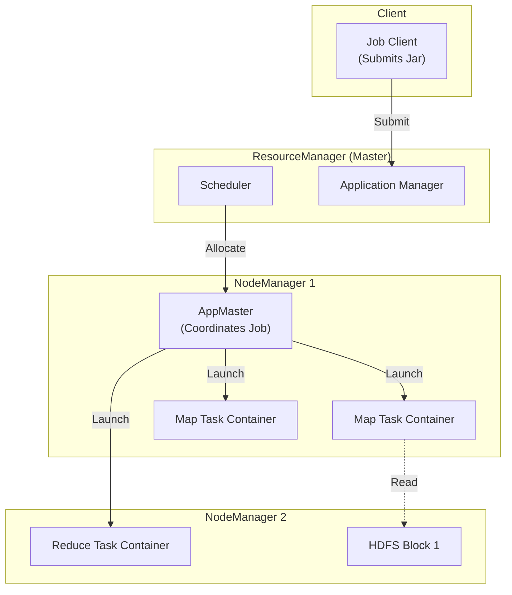

# 02. Hadoop MapReduce Deep Dive

## 1. Introduction

**Hadoop MapReduce** is the foundational framework for distributed batch processing, released by Apache in 2006. It implements the MapReduce programming model on top of the Hadoop Distributed File System (HDFS).

**Problem It Solves**: Processing multi-terabyte datasets on commodity hardware where failures are common. Before Hadoop, distributed computing required expensive supercomputers (MPI).

**Key Differentiator**:
- **Data Locality**: Moves the computation to the data (the code travels to the node holding the HDD block).
- **Linear Scalability**: Add more nodes = linear increase in speed/capacity.

**Use Case**:
- Massive archival ETL (Extract, Transform, Load).
- Log analysis (web server logs).
- Search indexing (the original Google use case).

---

## 2. Core Architecture (YARN Era)

In modern Hadoop (v2+), MapReduce runs as an application on top of **YARN** (Yet Another Resource Negotiator).



### Key Components
1.  **ResourceManager (RM)**: The global arbitrator of cluster resources.
2.  **NodeManager (NM)**: The per-node agent responsible for containers.
3.  **ApplicationMaster (AM)**: The per-job coordinator. Negotiates resources from RM and works with NMs to execute tasks.
4.  **Container**: A bundle of CPU/RAM (process) where Map/Reduce tasks run.

---

## 3. How It Works: The Lifecycle

The life of a MapReduce job follows a strict 3-phase structure:

1.  **Map Phase**:
    *   **InputSplit**: The logic that calculates how to divide the file. 1 Block (128MB) = 1 Split = 1 Map Task.
    *   **RecordReader**: Parses the raw byte stream into `(Key, Value)` pairs (e.g., Line Number, Line Text).
    *   **Map Logic**: User code processes input pairs and emits intermediate `(K, V)`.

2.  **Shuffle & Sort Phase** (The Framework Magic):
    *   **Partitioner**: Decides which Reducer gets which Key (Hash Modulo).
    *   **Sort**: The framework guarantees that keys arriving at the reducer are **Sorted**.
    *   **Transfer**: Reducers pull data via HTTP.

3.  **Reduce Phase**:
    *   **Reduce Logic**: User code receives `(Key, List[Values])` and emits final output.
    *   **OutputFormat**: Writes result to HDFS (e.g., `TextOutputFormat`).

---

## 4. End-to-End Walkthrough: Word Count (Java)

This examples shows the actual boilerplate-heavy Java code required to write a MapReduce job.

### The Mapper
Input: `(LongWritable offset, Text line)` -> Output: `(Text word, IntWritable one)`

```java
public class TokenizerMapper extends Mapper<Object, Text, Text, IntWritable> {

    private final static IntWritable one = new IntWritable(1);
    private Text word = new Text();

    public void map(Object key, Text value, Context context) throws IOException, InterruptedException {
        StringTokenizer itr = new StringTokenizer(value.toString());
        while (itr.hasMoreTokens()) {
            word.set(itr.nextToken());
            // Write to context: (Word, 1)
            context.write(word, one);
        }
    }
}
```

### The Reducer
Input: `(Text word, Iterator<IntWritable> counts)` -> Output: `(Text word, IntWritable sum)`

```java
public class IntSumReducer extends Reducer<Text, IntWritable, Text, IntWritable> {

    private IntWritable result = new IntWritable();

    public void reduce(Text key, Iterable<IntWritable> values, Context context) throws IOException, InterruptedException {
        int sum = 0;
        for (IntWritable val : values) {
            sum += val.get();
        }
        result.set(sum);
        context.write(key, result);
    }
}
```

### The Driver (Configuration)

```java
public static void main(String[] args) throws Exception {
    Configuration conf = new Configuration();
    Job job = Job.getInstance(conf, "word count");
    
    job.setJarByClass(WordCount.class);
    
    // Set Classes
    job.setMapperClass(TokenizerMapper.class);
    job.setCombinerClass(IntSumReducer.class); // Local aggregation
    job.setReducerClass(IntSumReducer.class);
    
    // Set Output Types
    job.setOutputKeyClass(Text.class);
    job.setOutputValueClass(IntWritable.class);
    
    // Set Paths
    FileInputFormat.addInputPath(job, new Path(args[0]));
    FileOutputFormat.setOutputPath(job, new Path(args[1]));
    
    System.exit(job.waitForCompletion(true) ? 0 : 1);
}
```

---

## 5. Deep Dive: The Shuffle Mechanics

The shuffle is where Hadoop spends 70% of its time. It is heavily tuned via `mapred-site.xml`.

### Map Side: Buffer & Spill
Mappers do not write directly to disk. They write to a **Circular In-Memory Buffer**.

*   `mapreduce.task.io.sort.mb` (Default: 100MB): Size of the buffer.
*   `mapreduce.map.sort.spill.percent` (Default: 0.80): When buffer is 80% full, background thread starts spilling.

**The Spill Process**:
1.  **Partition**: Determine which reducer each record goes to.
2.  **Sort**: In-memory quicksort by Key.
3.  **Combiner**: Run optional local aggregation.
4.  **Write**: Flush sorted segment to local disk.

### Reduce Side: Merge
Reducers run HTTP threads to fetch map outputs.

*   `mapreduce.reduce.shuffle.parallelcopies`: Threads per reducer to fetch data (Default: 5).
*   **Merge**: The reducer performs a multi-pass merge sort on disk to create a single iterable stream.

---

## 6. Failure Scenarios

### Scenario A: Task Failure
*   **Symptom**: A single map or reduce task throws a RuntimeException or times out.
*   **Mechanism**: ApplicationMaster notices task failure. It **Reschedules** the task on a different node.
*   **Limit**: `mapreduce.map.maxattempts` (Default: 4). If a task fails 4 times, the whole job completely fails.

### Scenario B: Stragglers (The "Long Tail")
*   **Symptom**: 999 tasks finish in 5 mins. 1 task takes 1 hour.
*   **Cause**: Bad disk, overloaded CPU on one specific node.
*   **Fix**: **Speculative Execution**. The AM notices the slow task and launches a *duplicate* on a fast node. The first one to finish wins; the other is killed.

---

## 7. Performance Tuning

| Parameter | Recommended | Purpose |
| :--- | :--- | :--- |
| `mapreduce.map.memory.mb` | 2048 - 4096 | Heap size for Mapper JVM. Prevent OOM. |
| `mapreduce.task.io.sort.mb` | 250 - 500 | Increase buffer size to prevent frequent disk spills. |
| `mapreduce.map.output.compress` | true | **Always Enable**. Snappy compresses intermediate data, reducing Network I/O. |
| `mapreduce.job.reduces` | 0.95 * Nodes * Cores | Set right number of reducers. Too few = OOM. Too many = Small files. |

---

## 8. Constraints & Limitations

1.  **Disk I/O Intensity**: Every Map step must materialize output to disk. Chain 3 jobs (Map -> Reduce -> Map -> Reduce), and you hit disk 6 times.
2.  **Java Verbosity**: Writing simple logic requires pages of boilerplate wrapper code.
3.  **High Latency**: JVM startup time overhead (seconds) makes it unsuitable for short queries.
4.  **Batch Only**: Cannot handle streaming data.

---

## 9. When to Use?

| Scenario | Recommendation | Why? |
| :--- | :--- | :--- |
| **New Projects** | ❌ **No** | Use **Apache Spark**. It's faster and easier to write (Python/SQL). |
| **Legacy Maintenance** | ✅ **Yes** | Many companies have stable MapReduce pipelines running for 10 years. |
| **Simple Archival ETL** | ✅ **Yes** | If you just need to move/convert PB of data once a month efficiently. |
| **Machine Learning** | ❌ **No** | Iterative algorithms are impossibly slow due to disk writes. Use Spark. |

---

## 10. Production Checklist

1.  [ ] **Enable Compression**: Set `mapreduce.map.output.compress=true` (Snappy).
2.  [ ] **Tune Sort Buffer**: Increase `io.sort.mb` to reducing spilling.
3.  [ ] **Set Reducers**: Explicitly calculate `numReducers`. Don't use default (1).
4.  [ ] **Reuse JVMs**: Enable JVM reuse if tasks are very short.
5.  [ ] **Handle Skew**: Use a custom Partitioner if keys are uneven.
6.  [ ] **Monitor Spills**: Watch for "Spilled Records" counter. If high, add RAM.
