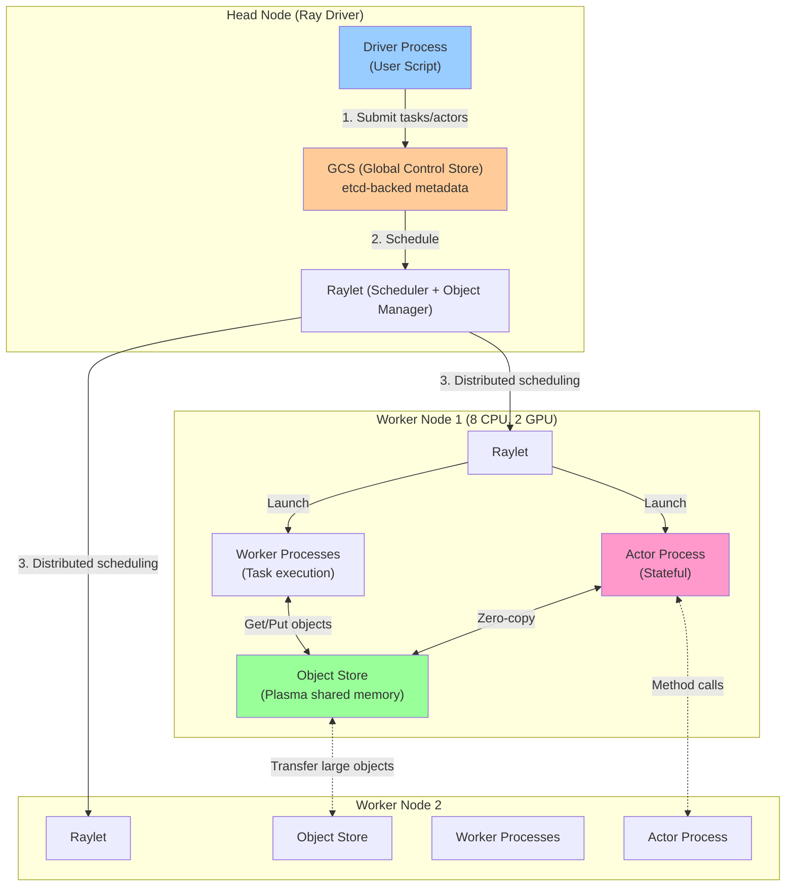
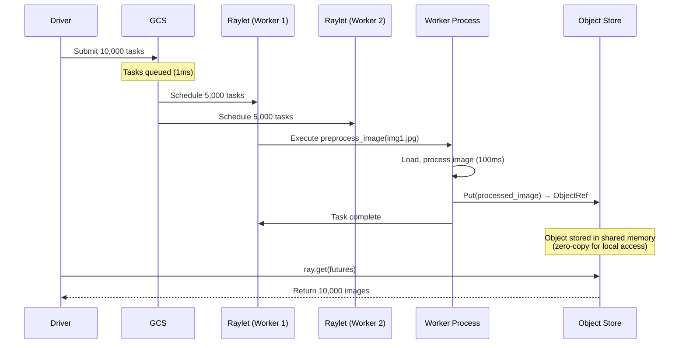
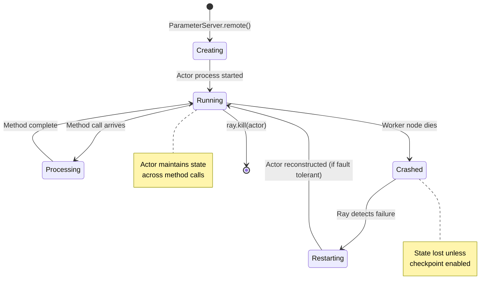
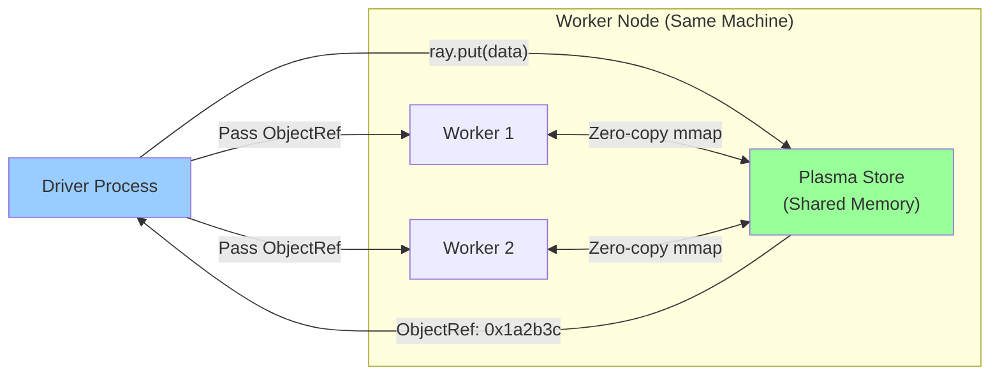
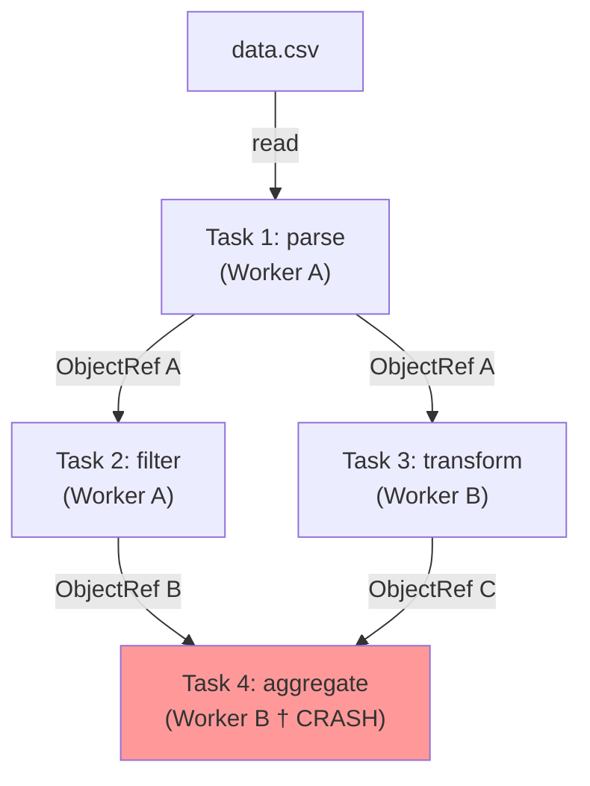
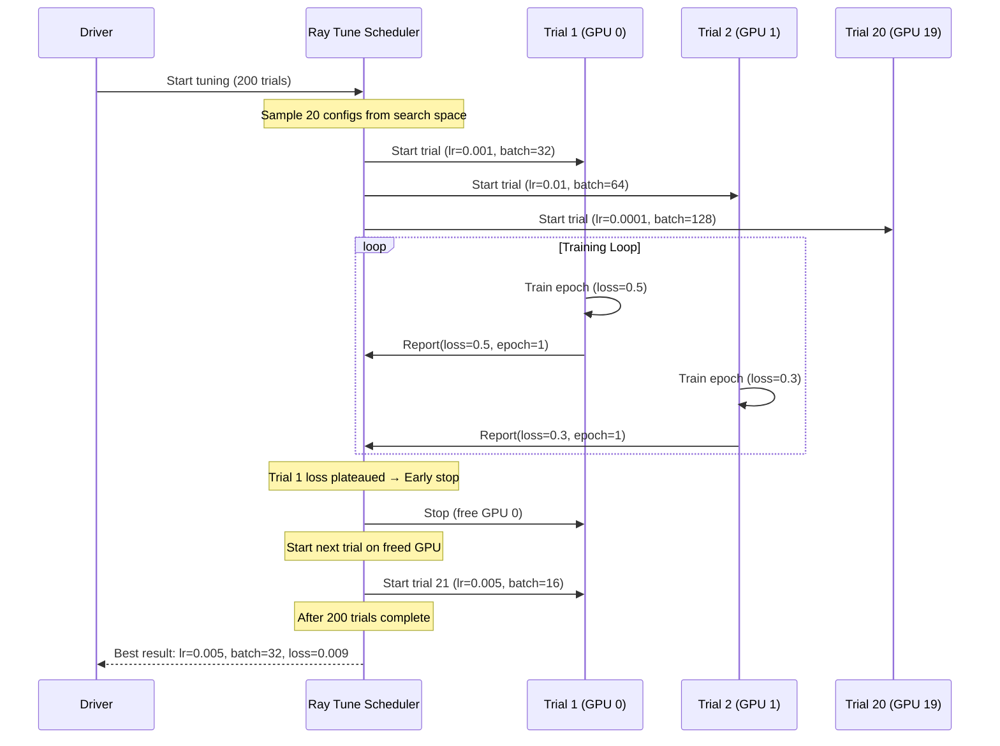
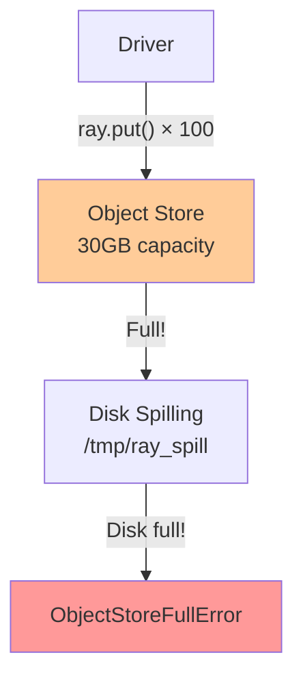
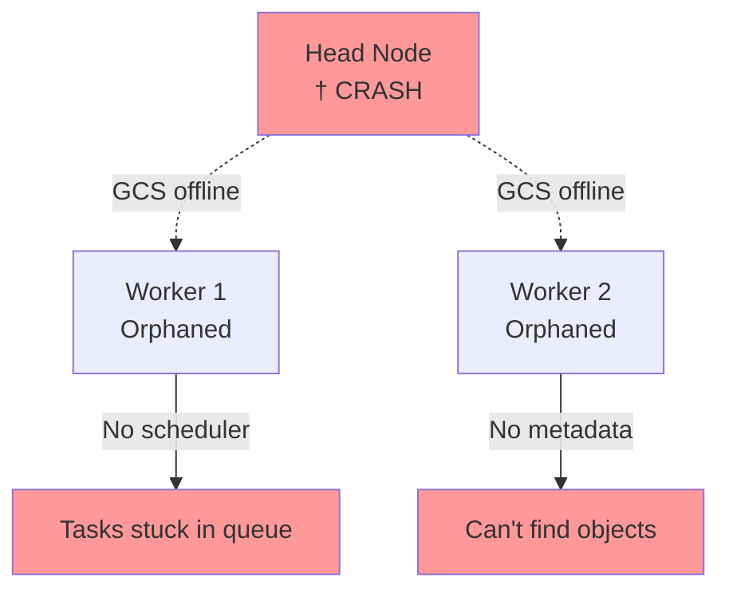

# Ray: Distributed Python for ML and Beyond

## Introduction

**The Scenario**: You're building a machine learning platform at scale. Your data scientists want to:
- Train 100 neural network models in parallel with different hyperparameters
- Run distributed reinforcement learning simulations (each simulation is stateful)
- Serve trained models with sub-millisecond latency
- Use **pure Python** without wrestling with JVM memory management

**The Problem with Existing Solutions**:

| Framework | What It's Good At | Why It Fails for ML |
|-----------|------------------|---------------------|
| **Hadoop MapReduce** | Batch ETL, simple aggregations | Disk-based shuffle kills iterative training, no stateful workers |
| **Apache Spark** | SQL analytics, batch ML (MLlib) | JVM overhead, 10ms+ task latency, functional-only (no stateful actors) |
| **Dask** | Pandas-style dataframes | Single-machine scheduler bottleneck, no fault tolerance for actors |

**Real Pain Points**:
- **Spark**: Training 100 models = submit 100 separate jobs (no shared parameter server)
- **Multi node**: Manually managing MPI/Horovod ranks, SSH keys, hostfiles
- **Python GIL**: Can't use multiprocessing for CPU-bound tasks without serialization overhead

**Ray's Solution**: A **unified framework for distributed Python** that treats tasks, actors, and objects as first-class citizens with:
- **Sub-millisecond task scheduling** (vs Spark's 10-100ms)
- **Stateful actors** for parameter servers, simulators, model serving
- **Zero-copy shared memory** via Apache Arrow Plasma
- **Native Python** - no JVM, no serialization to Java objects

**Industry Adoption**:
- **OpenAI**: ChatGPT training infrastructure (RLHF with Ray RLlib)
- **Uber**: Michelangelo ML platform (model training + serving)
- **Ant Financial**: Fraud detection (100B+ predictions/day)
- **AWS**: SageMaker distributed training backed by Ray
- **Anyscale**: Founded by Ray creators, raised $250M+ for managed Ray platform

**Historical Context**: Created in 2017 at UC Berkeley RISELab by the team behind Spark (different problem space). Open-sourced immediately. Ray 1.0 (2020) stabilized APIs, Ray 2.0 (2022) added native GPU scheduling and Datasets.

**Current Version**: Ray 2.9+ (2024) features:
- **Ray Data**: Distributed data loading for ML (replaces Spark for ETL → training pipelines)
- **Ray Serve**: Multi-model serving with autoscaling
- **Ray Train**: Distributed deep learning (PyTorch, TensorFlow)
- **Ray Tune**: Hyperparameter tuning with early stopping

---

##  Core Architecture

Ray uses a **hybrid scheduler** architecture: centralized for simple tasks, bottom-up for complex actors.



### Key Components

**1. GCS (Global Control Store)**
- **What**: Centralized metadata store (built on etcd)
- **Stores**: Actor locations, object locations, task metadata, resource availability
- **WHY centralized?** Eliminates split-brain (vs Spark's eventually consistent BlockManager registry)
- **Scalability**: Handles 1M+ tasks/second per cluster

**2. Raylet (Per-Node Scheduler + Object Manager)**
- **Scheduler**: Local task queue, resource allocation (CPU/GPU/custom)
- **Object Manager**: Manages local object store, handles object transfers
- **WHY per-node?** Reduces scheduling latency (tasks scheduled locally when possible)
- **Protocol**: gRPC for control, raw TCP for data transfer

**3. Object Store (Plasma Shared Memory)**
- **What**: Apache Arrow Plasma - shared memory object store
- **WHY shared memory?** Zero-copy between processes (10GB/s vs 1GB/s with pickling)
- **Lifetime**: Objects persist until explicitly deleted or all references gone
- **Spilling**: Falls back to disk when RAM full (configurable threshold)

**4. Workers vs Actors**
- **Workers**: Stateless, ephemeral processes that execute tasks
- **Actors**: Stateful, long-lived processes that handle method calls
- **WHY both?** Tasks for parallelism (map-reduce), Actors for state (parameter servers)

---

## How It Works

### A. Tasks: Stateless Distributed Functions

**Scenario**: You have 10,000 images to preprocess before training a model.

**Step 1: Define a Ray Task**

```python
import ray

@ray.remote
def preprocess_image(image_path):
    # Load, resize, normalize image
    image = load_image(image_path)
    image = resize(image, 224, 224)
    image = normalize(image)
    return image  # Stored in object store
```

**Step 2: Parallel Execution**

```python
image_paths = ["img1.jpg", "img2.jpg", ..., "img10000.jpg"]

# Submit 10,000 tasks immediately (non-blocking)
futures = [preprocess_image.remote(path) for path in image_paths]

# Retrieve results when needed
images = ray.get(futures)  # Blocks until all complete
```

**What Happens Under the Hood**:



**Key Characteristics**:
- **Latency**: Task submission → execution = **1-5ms** (vs Spark: 10-100ms)
- **Granularity**: Can run millions of tiny tasks (Spark struggles with <10s tasks)
- **Fault Tolerance**: If task fails, Ray re-executes automatically
- **Dependencies**: Tasks can depend on other tasks via ObjectRefs

---

### B. Actors: Stateful Distributed Workers

**Scenario**: You're training a neural network across 10 GPUs and need a **parameter server** to aggregate gradients.

**WHY actors?** Tasks are stateless - they can't maintain model weights across calls. Actors solve this.

**Step 1: Define an Actor**

```python
@ray.remote
class ParameterServer:
    def __init__(self, learning_rate):
        self.weights = initialize_weights()  # State!
        self.lr = learning_rate
    
    def get_weights(self):
        return self.weights
    
    def update_weights(self, gradient):
        self.weights -= self.lr * gradient  # Mutation!
        return self.weights
```

**Step 2: Create and Use Actor**

```python
# Create actor (lives until explicitly killed)
ps = ParameterServer.remote(learning_rate=0.01)

# 10 workers fetch weights, compute gradients, update
workers = [TrainingWorker.remote() for _ in range(10)]

for iteration in range(1000):
    # Each worker gets current weights
    weights = ray.get(ps.get_weights.remote())
    
    # Compute gradients in parallel
    gradients = [w.compute_gradient.remote(weights) for w in workers]
    
    # Update parameter server with average gradient
    avg_grad = average(ray.get(gradients))
    ps.update_weights.remote(avg_grad)
```

**Actor Lifecycle**:



**Actor vs Task**:

| Feature | Task (`@ray.remote` function) | Actor (`@ray.remote` class) |
|---------|------------------------------|----------------------------|
| **State** | Stateless (fresh each call) | Stateful (persistent across calls) |
| **Lifetime** | Ephemeral (task duration) | Long-lived (until killed) |
| **Placement** | Dynamic (any available worker) | Fixed (specific node) |
| **Use Case** | Data preprocessing, parallel map | Parameter server, simulators, model serving |
| **Fault Tolerance** | Retry on failure | Must reconstruct state (checkpointing needed) |

---

### C. Object Store: Zero-Copy Shared Memory

**The Problem**: Serialization (pickle) is slow for large objects.

**Example**:
```python
# Without Ray (multiprocessing)
data = np.random.rand(1000, 1000, 1000)  # 8GB array
pool.map(process_chunk, data)  # Pickle + copy = 30 seconds!

# With Ray (shared memory)
data_ref = ray.put(data)  # Store in Plasma (1 second)
ray.get([process_chunk.remote(data_ref) for _ in range(100)])  # No copy!
```

**How Object Store Works**:



**Key Benefits**:
- **Zero-copy**: Workers `mmap` shared memory directly (10GB/s throughput)
- **Immutable**: Objects can't be modified (prevents race conditions)
- **Reference counting**: Objects deleted when no refs remain
- **Spilling**: Large objects spill to disk when RAM full

---

## Deep Dive: Fault Tolerance

**Scenario**: You're running a 24-hour hyperparameter search with 500 trials. At hour 20, a worker node crashes.

**What Happens**:

### Lineage-Based Recovery (Tasks)

**Ray tracks task dependencies** (like Spark's RDD lineage):



**Recovery Steps**:
1. **Detect failure**: Raylet heartbeat timeout (10 seconds)
2. **Mark objects lost**: ObjectRefs B and C lost (on crashed worker)
3. **Recompute lineage**: Re-run Task 2 (filter) and Task 3 (transform) on healthy workers
4. **Resume**: Task 4 re-executed with new ObjectRefs

**No Checkpointing Needed**: Unlike MapReduce (writes every stage to HDFS), Ray recomputes on-demand.

---

### Actor Fault Tolerance

**The Problem**: Actors have **mutable state** - can't just re-run.

**Solution 1: Let It Crash (Default)**
- Actor dies → Ray raises `RayActorError`
- Application handles retry logic
- **Use case**: Stateless actors (e.g., model serving workers)

**Solution 2: Auto-Restart with Checkpointing**

```python
@ray.remote(max_restarts=3)
class ParameterServer:
    def __init__(self):
        self.weights = load_checkpoint_or_init()
    
    def update_weights(self, gradient):
        self.weights -= gradient
        if step % 100 == 0:
            save_checkpoint(self.weights)  # Periodic checkpoint
```

**Recovery**:
1. Worker crashes → Actor lost
2. Ray detects crash (heartbeat)
3. Ray restarts actor on healthy worker (attempt 1/3)
4. Actor `__init__` loads last checkpoint
5. Resume from checkpoint

**Checkpoint Overhead**:
- Frequency: Balance recency vs performance (every 100 steps typical)
- Storage: S3, HDFS, or local disk
- Size: Can be GBs for large models

---

## End-to-End Walkthrough: Hyperparameter Tuning with Ray Tune

**Scenario**: Train 200 neural networks with different learning rates, batch sizes, and architectures to find best model.

### Step 1: Define Training Function

```python
def train_model(config):
    # config = {"lr": 0.001, "batch_size": 32, "layers": 3}
    model = build_model(config["layers"])
    
    for epoch in range(100):
        loss = train_epoch(model, lr=config["lr"], batch_size=config["batch_size"])
        
        # Report metrics to Ray Tune
        ray.train.report({"loss": loss, "epoch": epoch})
```

### Step 2: Define Search Space

```python
from ray import tune

config = {
    "lr": tune.loguniform(1e-5, 1e-1),  # Sample from log scale
    "batch_size": tune.choice([16, 32, 64, 128]),
    "layers": tune.randint(2, 10)
}
```

### Step 3: Run Tuning

```python
tuner = tune.Tuner(
    train_model,
    param_space=config,
    tune_config=tune.TuneConfig(
        num_samples=200,  # 200 trials
        max_concurrent_trials=20,  # Use 20 GPUs in parallel
    ),
    run_config=train.RunConfig(
        stop={"loss": 0.01},  # Early stopping
        checkpoint_config=train.CheckpointConfig(num_to_keep=3)
    )
)

results = tuner.fit()
best_config = results.get_best_result().config
```

### What Happens Under the Hood



**Key Features**:
- **Early Stopping**: Bad trials killed after 10 epochs (saves 90% of compute)
- **Population-Based Training**: Update hyperparams mid-training based on performance
- **Resource Allocation**: Dynamically assign GPUs as trials complete
- **Checkpointing**: Resume from last checkpoint if trial crashes

---

## Failure Scenarios

### Scenario A: Object Store OOM

**Symptom**: `ray.exceptions.ObjectStoreFullError`

**Cause**: Too many large objects stored in Plasma (default: 30% of RAM)

**Example**:
```python
# BAD: Creates 100 × 10GB = 1TB of objects
futures = [ray.put(np.random.rand(1000, 1000, 1000)) for _ in range(100)]
```

**What Happens**:



**The Fix**:
```python
# GOOD: Process in batches, delete when done
for batch in chunks(data, batch_size=10):
    futures = [process.remote(item) for item in batch]
    results = ray.get(futures)
    # Objects automatically deleted when futures go out of scope
```

**Configuration**:
```bash
ray start --object-store-memory=50000000000  # 50GB
```

---

### Scenario B: Actor Crash Loop

**Symptom**: Actor keeps restarting and crashing immediately

**Cause**: Bug in `__init__` or resource exhaustion

**Example**:
```python
@ray.remote(max_restarts=5, max_task_retries=3)
class BuggyActor:
    def __init__(self):
        self.data = load_huge_file()  # OOMKilled every time!
```

**What Happens**:
1. Actor starts → loads 100GB file → OOMKilled
2. Ray retries (attempt 2/5) → OOMKilled again
3. Repeats 5 times → `RayActorError: max_restarts exceeded`

**The Fix**:
```python
# Option 1: Lazy loading
def __init__(self):
    self.data = None  # Don't load in __init__

def get_data(self):
    if self.data is None:
        self.data = load_huge_file()
    return self.data

# Option 2: Increase actor resources
@ray.remote(num_cpus=2, memory=100 * 1024**3)  # Request 100GB
class FixedActor:
    ...
```

---

### Scenario C: Head Node Failure

**Symptom**: Entire cluster freezes, all tasks fail

**Cause**: GCS (running on head node) is single point of failure

**What Happens**:


**The Fix (Ray 2.0+): GCS Fault Tolerance**

```python
# Enable GCS HA with external Redis
ray.init(
    _redis_password="secret",
    _redis_address="redis-cluster:6379",
    _gcs_rpc_server_reconnect_timeout_s=600
)
```

**Recovery**:
1. Head node crashes → GCS state persisted in external Redis
2. Start new head node → GCS recovers from Redis (10-30 seconds)
3. Workers reconnect → Resume tasks from last checkpoint

**Limitations**:
- 10-30 second downtime during failover
- In-flight tasks lost (must be re-submitted)
- Requires external Redis cluster (ops overhead)

---

## Performance Tuning

| Parameter | Default | Recommended | Why? |
|-----------|---------|-------------|------|
| **Object Store Memory** | 30% of RAM | 50-70% for ML workloads | Store model weights, large tensors without spilling |
| **Task Scheduling** | Centralized | `--ray-task-scheduling=decentralized` | Reduce GCS bottleneck for >1M tasks/sec |
| **Plasma Spilling** | `/tmp` | SSD path | 10x faster than HDD for large object spills |
| **Actor Placement** | Random | `.options(resources={"GPU": 1})` | Pin GPU actors to GPU nodes |
| **Batch Size** | 1 task/call | `ray.get([...])` batches of 1000 | Amortize scheduling overhead |
| **Autoscaling** | Disabled | Enable for variable workloads | Scale to 0 when idle (save cost) |
| **GCS HA** | Disabled | Enable for production | Survive head node crash |

---

## Constraints & Limitations

| Constraint | Limit | Why? |
|------------|-------|------|
| **Max Object Size** | 30% of RAM (Plasma limit) | Shared memory can't exceed physical RAM |
| **Task Scheduling Overhead** | 1ms (best case) | Still slower than in-process function call |
| **Actor Creation** | 100ms-1s | Process spawn + initialization overhead |
| **GCS Throughput** | 100K-1M tasks/sec | Centralized bottleneck (etcd write limit) |
| **No SQL** | N/A | Use Ray Data + Apache Arrow for structured data |
| **Python Only** | Technically supports Java/C++, but 95% Python | Designed for Python ML ecosystem |

---

## When to Use Ray?

| Use Case | Ray | Spark | Reason |
|----------|-----|-------|--------|
| **ML Training (PyTorch/TF)** | **YES** ✅ | NO | Native Python, GPUs, actors for parameter servers |
| **Hyperparameter Tuning** | **YES** ✅ | NO | Ray Tune's early stopping, PBT algorithms |
| **Reinforcement Learning** | **YES** ✅ | NO | Stateful simulators, actor-based environments |
| **Model Serving** | **YES** ✅ | NO | Ray Serve's sub-ms latency, autoscaling |
| **ETL Pipelines** | MAYBE | **YES** ✅ | Spark SQL more mature, but Ray Data catching up |
| **SQL Analytics** | NO | **YES** ✅ | Spark has Catalyst optimizer, decades of SQL tooling |
| **Batch Aggregations** | NO | **YES** ✅ | Spark DataFrames optimized for this |
| **Real-time Predictions** | **YES** ✅ | NO | Ray Serve < 1ms P99, Spark ~100ms |

**Ray vs Spark**:

| Aspect | Ray | Spark |
|--------|-----|-------|
| **Scheduling** | 1-5ms task latency | 10-100ms task latency |
| **State** | Actors (mutable) | RDDs (immutable only) |
| **Language** | Python-first (no JVM) | JVM-first (Scala/Java) |
| **Granularity** | Millions of tiny tasks | 10s+ tasks recommended |
| **Fault Tolerance** | Lineage + checkpoints | RDD lineage |
| **Ecosystem** | ML (Train, Tune, Serve, RLlib) | SQL (Catalyst), batch (MLlib) |

---

## Production Checklist

1. [ ] **Enable GCS Fault Tolerance**: `ray start --redis-address=<external-redis>`
2. [ ] **Configure Object Store**: `--object-store-memory=` (50-70% of RAM)
3. [ ] **Set Resource Limits**: Specify `num_cpus`, `num_gpus`, `memory` per task/actor
4. [ ] **Enable Autoscaling**: `ray up cluster.yaml` with min/max workers
5. [ ] **Checkpoint Actors**: Periodic `save_checkpoint()` for stateful actors
6. [ ] **Monitor Metrics**: Integrate Prometheus/Grafana (Ray Dashboard exports metrics)
7. [ ] **S3 for Large Objects**: Use `ray.put()` sparingly, load from S3 in tasks
8. [ ] **Tune Spilling**: Configure SSD path for object store spills
9. [ ] **Network Optimization**: Place workers in same AZ (reduce cross-AZ data transfer)
10. [ ] **Logging**: Centralize logs (CloudWatch, Elasticsearch) - Ray spreads logs across workers

### Critical Metrics

**ray_object_store_memory_bytes**:
- **Description**: Total memory used by object store
- **Target**: < 80% capacity (avoid spilling)
- **Fix**: Increase `--object-store-memory` or delete unused objects

**ray_tasks_submitted_total**:
- **Description**: Total tasks submitted to cluster
- **Target**: Monitor for bottlenecks (> 1M/sec may saturate GCS)
- **Fix**: Use `@ray.remote(scheduling_strategy="SPREAD")` to decentralize

**ray_actor_state**:
- **Description**: Actor states (ALIVE, RESTARTING, DEAD)
- **Target**: DEAD count should be 0 in steady state
- **Fix**: Check actor logs, increase `max_restarts`

**ray_gcs_rpc_latency_ms**:
- **Description**: GCS RPC call latency
- **Target**: P99 < 10ms
- **Fix**: Enable external Redis, scale GCS replicas

---

**Remember**: Ray excels at **distributed Python** (ML training, RL, serving), while Spark excels at **large-scale SQL analytics**. Use Ray for fine-grained parallelism and stateful computation, Spark for batch ETL and SQL queries.
