# Apache Spark Architecture: Overview

> **A concise guide to understanding Apache Spark's architecture and execution flow**

---

## 📖 About This Guide

This guide provides a **high-level overview** of Apache Spark's architecture and how it executes your code end-to-end. For deep dives into specific topics, see the specialized guides referenced throughout.

### What You'll Learn

- 🏗️ Spark's distributed architecture (Driver + Executors)
- 🎯 How code flows from your application to cluster execution
- 📊 The execution model (Jobs → Stages → Tasks)
- ⚡ Where to go for deep dives on specific topics

### Reading Time: ~30-60 minutes

---

## Navigation: The Complete Documentation Suite

| Guide | Purpose | When to Read |
|-------|---------|--------------|  
| **This guide** (`01_spark_architecture_guide.md`) | **Big picture overview** | Start here to understand Spark fundamentals |
| [02_spark_components_reference.md](file:///Users/anmol.shrivastava/System%20Design%20Question/Batch%20Processing/spark/02_spark_components_reference.md) | Core components deep dive | Understanding SparkContext, SparkEnv, schedulers |
| [03_spark_application_execution.md](file:///Users/anmol.shrivastava/System%20Design%20Question/Batch%20Processing/spark/03_spark_application_execution.md) | How code gets to executors | Debugging ClassNotFoundException, understanding JAR distribution |
| [04_spark_shuffle_internals.md](file:///Users/anmol.shrivastava/System%20Design%20Question/Batch%20Processing/spark/04_spark_shuffle_internals.md) | Shuffle mechanics deep dive | Shuffle performance issues, understanding shuffle files |
| [05_spark_join_internals.md](file:///Users/anmol.shrivastava/System%20Design%20Question/Batch%20Processing/spark/05_spark_join_internals.md) | Join strategies & internals | Join optimization, broadcast vs shuffle joins |
| [06_spark_parallelism_and_scheduling.md](file:///Users/anmol.shrivastava/System%20Design%20Question/Batch%20Processing/spark/06_spark_parallelism_and_scheduling.md) | Task scheduling & data locality | Optimizing task placement, understanding locality preferences |

---

# Chapter 1: What is Apache Spark?

**Apache Spark** is a unified analytics engine for large-scale data processing. It processes massive datasets (terabytes to petabytes) across clusters of computers.

## The Core Idea

Processing 100GB on one machine:
- ❌ **Problem**: Might crash, takes hours
- ✅ **Solution with Spark**: Split across 10 machines → Each processes 10GB → 10x faster

## Spark's Key Strengths

| Feature | Benefit |
|---------|---------|
| **In-Memory Processing** | 10-100x faster than disk-based systems |
| **Lazy Evaluation** | Optimizes entire workflow before executing |
| **Fault Tolerance** | Automatic recovery from failures |
| **Unified Platform** | Batch, streaming, SQL, ML, graphs in one tool |

## Prerequisites

**Essential:**
- Basic programming (Scala, Python, or Java)
- Understanding of functional programming (map, filter, reduce)

**Helpful but not required:**
- Distributed systems concepts
- Hadoop/HDFS experience

---

# Chapter 2: Architecture Overview

## The Driver-Executor Model

Spark applications consist of **two types of processes**:

```mermaid
graph TB
    subgraph "Your Laptop / Master Node"
        Driver["🎯 Driver Program<br/>(Your Code)<br/><br/>Plans work<br/>Coordinates executors<br/>Collects results"]
    end
    
    subgraph "Worker Nodes"
        E1["⚙️ Executor 1<br/><br/>Executes tasks<br/>Stores data"]
        E2["⚙️ Executor 2<br/><br/>Executes tasks<br/>Stores data"]
        E3["⚙️ Executor 3<br/><br/>Executes tasks<br/>Stores data"]
    end
    
    Driver -->|"Send tasks"| E1
    Driver -->|"Send tasks"| E2
    Driver -->|"Send tasks"| E3
    
    E1 -->|"Return results"| Driver
    E2 -->|"Return results"| Driver
    E3 -->|"Return results"| Driver
    
    style Driver fill:#ff9999,stroke:#333,stroke-width:3px
    style E1 fill:#99ff99
    style E2 fill:#99ff99
    style E3 fill:#99ff99
```



> **Analogy**: Think of a restaurant kitchen:
> - **Driver** = Head chef (plans menu, coordinates)
> - **Executors** = Line cooks (prepare food)
> - **Tasks** = Individual dishes

---

## Complete Architecture


---

## Key Components

### Driver Components

| Component | Role |
|-----------|------|
| **SparkContext** | Entry point, initializes everything |
| **DAGScheduler** | Plans jobs, creates stages |
| **TaskScheduler** | Assigns tasks to executors |
| **MapOutputTracker** | Tracks shuffle data locations |

### Executor Components

| Component | Role |
|-----------|------|
| **Task Threads** | Execute tasks in parallel |
| **BlockManager** | Manage memory + disk storage |
| **Shuffle System** | Write/read shuffle data |

> [!TIP]
> **For executor code execution details** (how JARs are loaded, ClassLoaders, etc.):
> 👉 See [03_spark_application_execution.md](file:///Users/anmol.shrivastava/System%20Design%20Question/Batch%20Processing/spark/03_spark_application_execution.md)

---

## Memory Architecture

Understanding Spark's memory model is crucial for performance tuning and avoiding OutOfMemoryErrors.

### Unified Memory Model (Spark 1.6+)

Spark uses a **unified memory manager** that dynamically allocates memory between execution and storage.


### Memory Regions Explained

**1. Reserved Memory (300MB)**
- Fixed overhead for Spark internals
- Cannot be configured
- Not available for data processing

**2. Unified Memory (60% by default)**
- **Execution Memory**: For shuffle, join, sort, aggregate operations
  - Can always borrow from Storage if needed
  - Spills to disk when full
  
- **Storage Memory**: For cached RDDs, broadcast variables
  - Initially gets 50% of unified region (`spark.memory.storageFraction = 0.5`)
  - Can borrow from Execution if blocks are evictable
  - Evicts cached blocks in LRU order when Execution needs space

**3. User Memory (40%)**
- For user data structures
- For internal metadata (RDD dependency graphs)
- Not managed by Spark

### Memory Calculation Example

```scala
// Given configuration
spark.executor.memory = 10GB
spark.memory.fraction = 0.6
spark.memory.storageFraction = 0.5

// Breakdown:
// Total Heap: 10GB
// Reserved: 300MB
// Usable: 10GB - 300MB = 9.7GB

// Unified Memory: 9.7GB × 0.6 = 5.82GB
//   ├─ Storage (initially): 5.82GB × 0.5 = 2.91GB
//   └─ Execution (initially): 5.82GB × 0.5 = 2.91GB

// User Memory: 9.7GB × 0.4 = 3.88GB
```

### Storage vs Execution Memory

| Aspect | Storage Memory | Execution Memory |
|--------|---------------|------------------|
| **Purpose** | Cache RDDs, Broadcast variables | Shuffles, Joins, Sorts, Aggregations |
| **Eviction** | LRU eviction possible | No eviction, spills to disk |
| **Borrowing** | Can borrow from Execution if space available | Can always borrow from Storage (evicts blocks) |
| **Persistence** | Persists until evicted or unpersist() | Temporary, freed after task completes |

### Spilling to Disk

When execution memory is full, Spark **spills** to disk:


**When spilling occurs:**
- During shuffle write (groupByKey, reduceByKey)
- During shuffle read and aggregation
- During sort operations

**Impact:**
- ✅ Prevents OutOfMemoryError
- ❌ Disk I/O is slower than memory
- ⚠️ CPU cost for sort + merge

### Memory Configuration Guide

```scala
// Executor memory settings
spark.executor.memory = 8g              // Total heap size
spark.executor.memoryOverhead = 1g      // Off-heap memory (native libs, etc.)

// Memory allocation
spark.memory.fraction = 0.6             // Fraction for execution + storage
spark.memory.storageFraction = 0.5      // Storage share within unified memory

// Execution memory tuning
spark.shuffle.spill.compress = true     // Compress spilled data (saves disk space)
spark.shuffle.file.buffer = 32k         // Buffer size for shuffle writes

// Storage memory tuning
spark.storage.memoryFraction = 0.6      // (Legacy, pre-1.6) Storage memory fraction
spark.storage.unrollFraction = 0.2      // Fraction reserved for unrolling blocks
```

### Common Memory Issues & Solutions

**Problem 1: OutOfMemoryError during shuffle**

```
Cause: Not enough execution memory for shuffle operations
```

**Solutions:**
- ✅ Increase `spark.executor.memory`
- ✅ Increase `spark.sql.shuffle.partitions` (smaller partitions = less memory per task)
- ✅ Reduce `spark.memory.storageFraction` (give more to execution)
- ✅ Unpersist unused cached RDDs

**Problem 2: Excessive spilling to disk**

```
Symptom: Spark UI shows many "spill" events, slow shuffle
```

**Solutions:**
- ✅ Increase executor memory
- ✅ Reduce parallel task count (fewer concurrent tasks = more memory each)
- ✅ Use `reduceByKey` instead of `groupByKey` (pre-aggregates data)

**Problem 3: Cached RDDs evicted frequently**

```
Symptom: Cache misses, re-computation overhead
```

**Solutions:**
- ✅ Increase `spark.memory.storageFraction`
- ✅ Use `MEMORY_AND_DISK` instead of `MEMORY_ONLY` persistence
- ✅ Prioritize caching: Only cache RDDs used multiple times

### Memory Monitoring

**Check Spark UI** (port 4040):
- **Storage tab**: See cached RDDs and memory usage
- **Executors tab**: See memory per executor
- **Stage details**: See spill metrics

**Key metrics to watch:**
- `Memory Used / Memory Available` in Executors tab
- `Spill (Memory)` and `Spill (Disk)` in stage details
- `RDD blocks` evicted count

> [!IMPORTANT]
> **Memory Tuning Golden Rules**:
> 1. Start with defaults, tune only if you see issues
> 2. Executors with 2-5 cores work best (balance parallelism and memory per task)
> 3. Monitor spilling: Some is OK, excessive means increase memory
> 4. Don't set `spark.memory.fraction` > 0.75 (leave room for user objects)

---

## Transformations vs Actions


### Transformations: Lazy (Planning)

**Transformations** define operations but don't execute immediately.

```scala
val rdd1 = sc.parallelize(1 to 100)    // Lazy
val rdd2 = rdd1.map(_ * 2)             // Lazy
val rdd3 = rdd2.filter(_ > 50)         // Lazy

// NO DATA PROCESSED YET! 🤯
```

### Actions: Eager (Execution)

**Actions** trigger actual computation.

```scala
val result = rdd3.collect()  // ← NOW everything executes!
```

> **Why lazy evaluation?**
> - Spark can optimize the entire workflow
> - Avoids wasted computation
> - Enables fault recovery via lineage

| Operation | Type | Lazy? |
|-----------|------|-------|
| `map()`, `filter()` | Transformation | ✅ Yes |
| `groupByKey()`, `reduceByKey()` | Transformation (wide) | ✅ Yes |
| `collect()`, `count()`, `save()` | Action | ❌ No |

---

## The Execution Hierarchy


**Hierarchy:**
1. **Action** → Triggers **1 Job**
2. **Job** → Splits into **Stages** (separated by shuffles)
3. **Stage** → Contains **1 Task per partition**
4. **Task** → Smallest unit, runs on 1 executor core

> [!TIP]
> **For task scheduling details** (data locality, resource offers, etc.):
> 👉 See [06_spark_parallelism_and_scheduling.md](file:///Users/anmol.shrivastava/System%20Design%20Question/Batch%20Processing/spark/06_spark_parallelism_and_scheduling.md)

---

# Chapter 3: End-to-End Execution Example

Let's trace a complete WordCount job from code to results.

## The Code

```scala
val textFile = sc.textFile("hdfs://data.txt")
val counts = textFile.flatMap(_.split(" "))
                     .map(word => (word, 1))
                     .reduceByKey(_ + _)
counts.saveAsTextFile("output")
```

## Complete Flow

```mermaid
sequenceDiagram
    participant User
    participant Driver
    participant Executor1
    participant Executor2
    
    Note over User: Write Spark code
    User->>Driver: Submit application
    
    Note over Driver: 1. INITIALIZATION
    Driver->>Driver: Create SparkContext
    Driver->>Driver: Initialize schedulers
    Driver->>Executor1: Launch executor
    Driver->>Executor2: Launch executor
    
    Note over User,Driver: 2. TRANSFORMATIONS (Lazy)
    User->>Driver: textFile("data.txt")
    Driver->>Driver: Record RDD lineage
    User->>Driver: flatMap + map + reduceByKey
    Driver->>Driver: Update lineage graph
    
    Note over User,Driver: 3. ACTION (Triggers Execution!)
    User->>Driver: saveAsTextFile()
    
    Note over Driver: 4. PLANNING
    Driver->>Driver: DAGScheduler: Create 2 stages<br/>(Stage 0: map, Stage 1: reduce)
    
    Note over Driver,Executor2: 5. STAGE 0 (Map Stage)
    Driver->>Executor1: Task 0: Read partition 0
    Driver->>Executor2: Task 1: Read partition 1
    
    Executor1->>Executor1: flatMap + map → (word,1) pairs
    Executor2->>Executor2: flatMap + map → (word,1) pairs
    
    Executor1->>Executor1: Shuffle Write: Group by hash(word)
    Executor2->>Executor2: Shuffle Write: Group by hash(word)
    
    Executor1-->>Driver: MapStatus (shuffle locations)
    Executor2-->>Driver: MapStatus (shuffle locations)
    
    Note over Driver,Executor2: 6. SHUFFLE (Data Redistribution)
    Driver->>Driver: Track shuffle outputs
    
    Note over Driver,Executor2: 7. STAGE 1 (Reduce Stage)
    Driver->>Executor1: Task 2: Reduce partition 0
    Driver->>Executor2: Task 3: Reduce partition 1
    
    Executor1->>Executor1: Fetch shuffle data
    Executor1->>Executor1: reduceByKey: Sum counts
    Executor2->>Executor2: Fetch shuffle data
    Executor2->>Executor2: reduceByKey: Sum counts
    
    Executor1->>Executor1: Save to HDFS
    Executor2->>Executor2: Save to HDFS
    
    Executor1-->>Driver: Success
    Executor2-->>Driver: Success
    
    Driver->>User: Job complete!
```



---

## Detailed Phase Breakdown

### Phase 1: Initialization

**What happens:**
- `SparkContext` is created
- Driver connects to cluster manager (YARN/K8s)
- Executors are launched on worker nodes

> [!NOTE]
> **For JAR distribution and ClassLoader setup details**:
> 👉 See [02_spark_application_execution.md](file:///Users/anmol.shrivastava/System%20Design%20Question/Batch%20Processing/spark/02_spark_application_execution.md)

---

### Phase 2-3: Transformations (Lazy) → Action (Eager)

**Transformations** (`textFile`, `flatMap`, `map`, `reduceByKey`):
- Build RDD lineage graph
- No computation happens

**Action** (`saveAsTextFile`):
- Triggers DAGScheduler
- Time to actually execute!

---

### Phase 4: Planning (DAGScheduler)

**DAGScheduler breaks the job into stages:**

1. Analyze RDD lineage
2. Find shuffle boundaries (wide dependencies)
3. Create stages:
   - **Stage 0** (ShuffleMapStage): `textFile → flatMap → map` (narrow dependencies)
   - **Stage 1** (ResultStage): `reduceByKey → save` (after shuffle)

---

### Phase 5: Stage 0 - Map Tasks

**Each task:**
1. Reads its partition from HDFS
2. Applies `flatMap(_.split(" "))` → words
3. Applies `map(word => (word, 1))` → pairs
4. **Shuffle Write**: Groups pairs by `hash(word) % numPartitions`
5. Writes shuffle files to local disk
6. Reports `MapStatus` to driver

**Files created:**
- `shuffle_0_0_0.data` (map task 0's output)
- `shuffle_0_1_0.data` (map task 1's output)

> [!TIP]
> **For complete shuffle file format and internals**:
> 👉 See [04_spark_shuffle_internals.md](file:///Users/anmol.shrivastava/System%20Design%20Question/Batch%20Processing/spark/04_spark_shuffle_internals.md)

---

### Phase 6: Shuffle (Data Redistribution)

**What happens:**
- Reduce tasks contact Driver for shuffle locations
- Each reduce task fetches data from **all** map tasks
- Data is transferred over network

**Example:**
- Reduce Task 0 (words A-M): Fetches partition 0 from all map outputs
- Reduce Task 1 (words N-Z): Fetches partition 1 from all map outputs

---

### Phase 7: Stage 1 - Reduce Tasks

**Each task:**
1. Fetches shuffle blocks from executors
2. Merges/sorts data
3. Applies `reduceByKey(_ + _)` → sums counts per word
4. Writes final results to HDFS

---

## Key Insights

✅ **One action = One job** (multiple actions = multiple full executions!)

✅ **Shuffle creates stage boundaries** (wide dependencies split stages)

✅ **Tasks are the unit of parallelism** (1 task per partition per stage)

✅ **Data locality matters** (Spark tries to send tasks where data lives)

> [!WARNING]
> **Common Mistake**: Calling multiple actions on the same RDD recomputes everything!
> ```scala
> // ❌ BAD: Recomputes RDD twice
> rdd.count()
> rdd.collect()
> 
> // ✅ GOOD: Cache it
> rdd.cache()
> rdd.count()
> rdd.collect()  // Uses cached data
> ```

---

# Chapter 4: Quick Reference

## Common Operations

| Operation | Type | Triggers Shuffle? | Example |
|-----------|------|-------------------|---------|
| `map()` | Narrow transformation | No | `rdd.map(_ * 2)` |
| `filter()` | Narrow transformation | No | `rdd.filter(_ > 10)` |
| `groupByKey()` | Wide transformation | **Yes** | `pairRDD.groupByKey()` |
| `reduceByKey()` | Wide transformation | **Yes** | `pairRDD.reduceByKey(_ + _)` |
| `join()` | Wide transformation | **Yes** | `rdd1.join(rdd2)` |
| `collect()` | Action | No | `rdd.collect()` |
| `count()` | Action | No | `rdd.count()` |

> [!TIP]
> **For join optimization strategies**:
> 👉 See [05_spark_join_internals.md](file:///Users/anmol.shrivastava/System%20Design%20Question/Batch%20Processing/spark/05_spark_join_internals.md)

---

## Performance Tips

### 1. Minimize Shuffles

```scala
// ❌ Bad: Multiple shuffles
rdd.groupByKey().mapValues(_.sum)

// ✅ Good: One shuffle
rdd.reduceByKey(_ + _)
```

### 2. Use Appropriate Partitioning

```scala
// Set partitions based on data size
spark.conf.set("spark.sql.shuffle.partitions", "200")

// For RDDs
rdd.repartition(100)  // Increase parallelism
rdd.coalesce(10)      // Reduce partitions (no shuffle)
```

### 3. Cache Strategically

```scala
// Cache RDDs used multiple times
val processedRDD = rawRDD.map(transform).cache()

processedRDD.count()    // Caches here
processedRDD.collect()  // Uses cache
```

### 4. Broadcast Small Data

```scala
val smallData = sc.broadcast(Map("key" -> "value"))

rdd.map { row =>
  smallData.value.get(row.id)  // Efficient lookup
}
```

---

## Configuration Reference

```scala
// Executor configuration
spark.executor.instances = 10       // Number of executors
spark.executor.cores = 4            // Cores per executor
spark.executor.memory = 8g          // Memory per executor

// Memory tuning
spark.memory.fraction = 0.6         // Execution + storage memory
spark.memory.storageFraction = 0.5  // Storage within above

// Shuffle tuning
spark.sql.shuffle.partitions = 200  // Default shuffle partitions
spark.shuffle.compress = true       // Compress shuffle data
```

---

## Where to Dive Deeper

| Topic | Guide | Focus |
|-------|-------|-------|
| **Code Execution** | [02_spark_application_execution.md](file:///Users/anmol.shrivastava/System%20Design%20Question/Batch%20Processing/spark/02_spark_application_execution.md) | JAR distribution, ClassLoaders, closure serialization |
| **Task Scheduling** | [03_spark_parallelism_and_scheduling.md](file:///Users/anmol.shrivastava/System%20Design%20Question/Batch%20Processing/spark/03_spark_parallelism_and_scheduling.md) | Data locality, resource offers, scheduling algorithms |
| **Shuffle Internals** | [04_spark_shuffle_internals.md](file:///Users/anmol.shrivastava/System%20Design%20Question/Batch%20Processing/spark/04_spark_shuffle_internals.md) | BlockId format, file structure, shuffle read/write flows |
| **Join Strategies** | [05_spark_join_internals.md](file:///Users/anmol.shrivastava/System%20Design%20Question/Batch%20Processing/spark/05_spark_join_internals.md) | Broadcast joins, sort-merge joins, cogroup internals |

---

## Troubleshooting Quick Guide

### OutOfMemoryError

**Cause**: Executor ran out of memory

**Solutions:**
- Increase `spark.executor.memory`
- Reduce `spark.sql.shuffle.partitions` (fewer, larger partitions)
- Use `cache()` instead of `persist(MEMORY_ONLY)` to allow disk spill

### Slow Shuffles

**Cause**: Too much data movement

**Solutions:**
- Use `reduceByKey` instead of `groupByKey`
- Pre-partition data with `partitionBy()`
- Broadcast small tables in joins

### Task Not Serializable

**Cause**: Closure references non-serializable object

**Solutions:**
- Make referenced classes `Serializable`
- Use broadcast variables for shared data
- Extract only needed fields before the closure

---

## Next Steps

### Learn By Doing

1. **Run the examples** in your cluster
2. **Check Spark UI** (port 4040) to see stages and tasks
3. **Experiment** with different configurations
4. **Profile your jobs** and optimize bottlenecks

### Dive Deeper

- **Understand internals**: Read the specialized guides
- **Explore source code**: References provided in deep-dive docs
- **Join community**: Spark user mailing list, Stack Overflow

---

## Summary

✅ **Spark = Driver + Executors** distributed model

✅ **Lazy evaluation** optimizes entire workflow before execution

✅ **Jobs → Stages → Tasks** hierarchy based on shuffle boundaries

✅ **Shuffle** is expensive but necessary for wide transformations

✅ **Cache** RDDs used multiple times

✅ **Consult specialized guides** for deep dives into specific topics

**You now have the foundation to use Spark effectively. Dive into the specialized guides when you need more details!** 🚀
