# Spark Components Reference Guide

> **A deep dive into SparkContext, SparkEnv, and the scheduler hierarchy**

---

## About This Guide

This guide provides detailed information about Spark's core components and their interactions. It's designed for:
- Engineers debugging Spark internals
- Performance optimization specialists  
- Contributors to Apache Spark
- Anyone needing component-level understanding

**Prerequisites:** Read `01_spark_architecture_guide.md` first for foundational concepts.

---

## Table of Contents

1. [SparkContext - The Entry Point](#chapter-1-sparkcontext---the-entry-point)
2. [SparkEnv - Runtime Environment](#chapter-2-sparkenv---runtime-environment)
3. [Scheduler Hierarchy](#chapter-3-scheduler-hierarchy)
4. [Component Interactions](#chapter-4-component-interactions)

---

# Chapter 1: SparkContext - The Entry Point

## What is SparkContext?

**SparkContext** is the connection to a Spark cluster and the main entry point for every Spark application. It:
- Initializes the entire Spark runtime environment
- Creates and manages the scheduler hierarchy
- Provides APIs to create RDDs and run jobs
- Coordinates with the cluster manager (YARN, Kubernetes, Standalone)

> **Analogy**: Orchestra conductor - coordinates all components to work together

### Architecture Position

```mermaid
graph TB
    User[Your Application]
    SC[SparkContext<br/>🎯 Entry Point]
    
    subgraph "SparkEnv"
        BM[BlockManager]
        SM[ShuffleManager]
        MOT[MapOutputTracker]
    end
    
    subgraph "Schedulers"
        DAG[DAGScheduler]
        TS[TaskScheduler]
        SB[SchedulerBackend]
    end
    
    User --> SC
    SC --> SparkEnv
    SC --> DAG
    DAG --> TS
    TS --> SB
    
    style SC fill:#ff9999,stroke:#333,stroke-width:3px
```



---

## Initialization Sequence

SparkContext initializes components in a specific order. Understanding this sequence is crucial for debugging initialization issues.


### Initialization Steps Explained

**Step 1: Configuration Validation**
```scala
_conf = config.clone()
_conf.validateSettings()
```
- Validates master URL exists
- Ensures app name is set
- Sets up event logging, compression, etc.

**Step 2: Event Bus Creation**
```scala
_listenerBus = new LiveListenerBus(_conf)
```
- Asynchronous event system
- Components post events (job started, task completed)
- Listeners react to events (UI updates, logging)

**Step 3: SparkEnv Creation** ⭐
```scala
_env = createSparkEnv(_conf, isLocal, listenerBus)
SparkEnv.set(_env)
```
This creates all runtime components (detailed in Chapter 2).

**Step 4: UI Initialization**
```scala
_ui = Some(SparkUI.create(...))
_ui.foreach(_.bind())  // Binds to port 4040
```

**Step 5: Scheduler Creation**
- Creates TaskScheduler (task assignment)
- Creates SchedulerBackend (cluster communication)
- Creates DAGScheduler (job/stage planning)

**Step 6: Start Services**
- TaskScheduler.start() → SchedulerBackend.start()
- Connects to cluster manager
- Registers application
- Requests executors

---

## Key SparkContext Methods

### RDD Creation

```scala
// Create RDD from local collection
def parallelize[T](seq: Seq[T], numSlices: Int): RDD[T]

// Create RDD from external storage
def textFile(path: String, minPartitions: Int): RDD[String]

// Create RDD of key-value pairs
def wholeTextFiles(path: String, minPartitions: Int): RDD[(String, String)]
```

**Important**: These methods are **lazy** - they don't load data immediately, just create RDD metadata.

### Job Execution

```scala
// Run a job on the RDD
def runJob[T, U](rdd: RDD[T], func: Iterator[T] => U): Array[U]

// Internal method called by actions
private[spark] def submitJob[T, U](...): JobWaiter[U]
```

When you call an action (`collect()`, `count()`), it delegates to `runJob()` which creates a job and submits it to DAGScheduler.

### Configuration

```scala
// Get configuration value
def getConf: SparkConf

// Broadcast a read-only variable
def broadcast[T](value: T): Broadcast[T]

// Create an accumulator
def longAccumulator(name: String): LongAccumulator
```

---

## SparkContext Lifecycle


---

## Common Configuration Parameters

```scala
// Executor configuration
spark.executor.instances = 10       // Number of executors
spark.executor.cores = 4            // Cores per executor
spark.executor.memory = 8g          // Memory per executor

// Driver configuration
spark.driver.memory = 4g            // Driver memory
spark.driver.cores = 2              // Driver cores

// Application settings
spark.app.name = "MyApp"            // Application name
spark.master = "yarn"               // Cluster manager

// Shuffle configuration
spark.sql.shuffle.partitions = 200  // Default shuffle partitions
spark.shuffle.compress = true       // Compress shuffle data
```

---

# Chapter 2: SparkEnv - Runtime Environment

## What is SparkEnv?

**SparkEnv** is a container object holding all low-level components needed for Spark to function. Think of it as the "infrastructure layer" or "toolbox" that provides essential services.

> **Analogy**: Operating system for Spark - provides storage, networking, memory management, and serialization services

### Why SparkEnv Exists

Without SparkEnv, every component would need to:
- Manage its own storage
- Handle its own network communication  
- Implement serialization
- Manage memory allocation

SparkEnv centralizes these services so components can focus on their core responsibilities.

---

## SparkEnv Components Overview

| Component | Purpose | Real-World Analogy |
|-----------|---------|-------------------|
| **BlockManager** | Memory + disk storage management | Warehouse manager (stores boxes on shelves or in storage) |
| **ShuffleManager** | Data redistribution between stages | Logistics coordinator (moves packages between departments) |
| **MapOutputTracker** | Shuffle metadata tracking | Package tracking system (knows where each piece is) |
| **BroadcastManager** | Read-only data distribution | Company-wide announcement (sends same message to everyone) |
| **Serializer** | Object ↔ bytes conversion | Translator (converts between formats) |
| **MemoryManager** | Memory allocation | Bank (allocates budgets to different operations) |
| **RpcEnv** | Network communication | Postal service (delivers messages) |

---

## Component 1: BlockManager

### Purpose
Manages storage of data blocks in memory and disk.

### Responsibilities
1. **Store RDD partitions** - Cache blocks in memory/disk
2. **Serve blocks** - Provide blocks to other executors
3. **Evict blocks** - LRU eviction when memory is full
4. **Track blocks** - Report block locations to BlockManagerMaster

### Block Types

```scala
// RDD blocks
BlockId format: rdd_<rddId>_<partitionId>
Example: rdd_0_5 (RDD 0, partition 5)

// Shuffle blocks  
BlockId format: shuffle_<shuffleId>_<mapId>_<reduceId>
Example: shuffle_0_1_2

// Broadcast blocks
BlockId format: broadcast_<id>
Example: broadcast_42
```

### Storage Levels

| Level | Memory | Disk | Serialized | Replication |
|-------|--------|------|------------|-------------|
| `MEMORY_ONLY` | ✅ | ❌ | ❌ | 1 |
| `MEMORY_AND_DISK` | ✅ | ✅ | ❌ | 1 |
| `MEMORY_ONLY_SER` | ✅ | ❌ | ✅ | 1 |
| `MEMORY_AND_DISK_SER` | ✅ | ✅ | ✅ | 1 |
| `DISK_ONLY` | ❌ | ✅ | ✅ | 1 |
| `OFF_HEAP` | Off-heap | ❌ | ✅ | 1 |

### How Caching Works


---

## Component 2: ShuffleManager

### Purpose
Handles data redistribution when wide transformations occur.

### Shuffle Operations

**Wide transformations that trigger shuffle:**
- `groupByKey()`
- `reduceByKey()`
- `join()`
- `repartition()`
- `sortByKey()`

### Shuffle Process


> **For complete shuffle internals**, see [04_spark_shuffle_internals.md](file:///Users/anmol.shrivastava/System%20Design%20Question/Batch%20Processing/spark/04_spark_shuffle_internals.md)

---

## Component 3: MapOutputTracker

### Purpose
Tracks locations of shuffle map outputs so reduce tasks know where to fetch data.

### Master vs Worker

**MapOutputTrackerMaster** (on Driver):
- Stores shuffle metadata for all shuffles
- Receives MapStatus from completed map tasks
- Provides locations to reduce tasks

**MapOutputTrackerWorker** (on Executors):
- Queries master for shuffle locations
- Caches locations locally

### How It Works


---

## Component 4: BroadcastManager

### Purpose
Efficiently distributes read-only data to all executors.

### When to Use Broadcasts

✅ **Good use cases:**
- Small lookup tables (< few hundred MB)
- Configuration data
- ML model weights
- Feature mappings

❌ **Bad use cases:**
- Large datasets (> 1GB)
- Data that changes frequently
- Data only needed by some tasks

### How Broadcasts Work


**Example:**
```scala
// Broadcasting a lookup table
val lookup = Map("key1" -> "value1", "key2" -> "value2")
val broadcastLookup = sc.broadcast(lookup)

// Use in tasks (no serialization overhead!)
rdd.map { row =>
  val mapping = broadcastLookup.value  // Efficient!
  mapping.get(row.id)
}
```

---

## Component 5: Serializer

### Purpose
Converts objects to bytes (and back) for network transfer and disk storage.

### Available Serializers

**Java Serializer** (default):
- ✅ Works with any Serializable class
- ❌ Slow performance
- ❌ Large output size

**Kryo Serializer** (recommended):
- ✅ 10x faster than Java
- ✅ More compact
- ❌ Requires class registration

**Configuration:**
```scala
spark.serializer = org.apache.spark.serializer.KryoSerializer

// Register classes for better performance
spark.kryo.registrationRequired = true
conf.registerKryoClasses(Array(classOf[MyClass1], classOf[MyClass2]))
```

---

## Component 6: MemoryManager

### Purpose
Allocates memory between execution and storage.

See the [Memory Architecture section in 01_spark_architecture_guide.md](file:///Users/anmol.shrivastava/System%20Design%20Question/Batch%20Processing/spark/01_spark_architecture_guide.md#memory-architecture) for complete details.

**Quick Summary:**
- Unified memory model (Spark 1.6+)
- Dynamic allocation between execution and storage
- Spilling when memory is full

---

## Component 7: RpcEnv

### Purpose
Network communication layer for Spark.

**Responsibilities:**
- Driver ↔ Executor communication
- Executor ↔ Executor block transfers
- Heartbeats and status updates

**Configuration:**
```scala
spark.rpc.message.maxSize = 128        // Max message size (MB)
spark.network.timeout = 120s           // Network timeout
spark.port.maxRetries = 16             // Port binding retries
```

---

# Chapter 3: Scheduler Hierarchy

## The Three-Tier Architecture


---

## Tier 1: DAGScheduler

### Role
High-level job planning and stage orchestration.

**Answers**: "How do I break this job into stages?"

### Core Responsibilities

1. **Analyze RDD lineage** - Walk dependency graph
2. **Find shuffle boundaries** - Wide dependencies create stages
3. **Create stages** - ShuffleMapStage and ResultStage
4. **Submit stages** - In topological order
5. **Handle failures** - Resubmit failed stages
6. **Track progress** - Monitor job completion

### Stage Types

**ShuffleMapStage**:
- Produces shuffle data for downstream stages
- Ends with shuffle write
- Reports MapStatus to MapOutputTracker

**ResultStage**:
- Final stage that produces results
- Executes the action
- Returns data to driver

### Example: Stage Creation

```scala
// Code
val rdd1 = sc.textFile("data.txt")
val rdd2 = rdd1.map(_.split(","))       // Narrow
val rdd3 = rdd2.filter(_.length > 2)    // Narrow
val rdd4 = rdd3.groupBy(_(0))           // Wide - SHUFFLE!
val rdd5 = rdd4.mapValues(_.size)       // Narrow
val result = rdd5.collect()             // Action!
```

**DAGScheduler creates 2 stages:**
- **Stage 0** (ShuffleMapStage): textFile → map → filter → groupBy write
- **Stage 1** (ResultStage): groupBy read → mapValues → collect

> **For complete scheduling details**, see [03_spark_parallelism_and_scheduling.md](file:///Users/anmol.shrivastava/System%20Design%20Question/Batch%20Processing/spark/03_spark_parallelism_and_scheduling.md)

---

## Tier 2: TaskScheduler

### Role
Task assignment and resource management.

**Answers:** "Which executor should run each task?"

### Core Responsibilities

1. **Receive TaskSets** from DAGScheduler
2. **Assign tasks** based on:
   - Data locality (prefer where data lives)
   - Resource availability
   - Fair scheduling policies
3. **Handle failures** - Retry failed tasks
4. **Track execution** - Monitor task status
5. **Report completion** - Notify DAGScheduler

### Data Locality Levels

Best to worst:

| Level | Description | Example |
|-------|-------------|---------|
| `PROCESS_LOCAL` | Data in same executor's memory | Best! Zero transfer |
| `NODE_LOCAL` | Data on same machine | Read from local disk |
| `RACK_LOCAL` | Data on same rack | Fast network within rack |
| `ANY` | Data anywhere | Slowest - cross-rack network |

### Configuration

```scala
spark.locality.wait = 3s               // Wait time for better locality
spark.task.maxFailures = 4             // Max retry attempts
spark.speculation = false              // Enable speculative execution
spark.task.cpus = 1                    // CPUs per task
```

---

## Tier 3: SchedulerBackend

### Role
Cluster-specific communication interface.

**Answers:** "How do I talk to the cluster manager?"

### Implementations

- **YarnSchedulerBackend** - For YARN clusters
- **KubernetesSchedulerBackend** - For Kubernetes
- **StandaloneSchedulerBackend** - For Spark Standalone
-  **LocalSchedulerBackend** - For local mode

### Responsibilities

1. **Launch tasks** on executors
2. **Monitor execution** - Track task status
3. **Handle resources** - Request/release executors  
4. **Report status** - Update TaskScheduler

---

# Chapter 4: Component Interactions

## Complete Job Execution Flow

This shows how all components work together for a single job:


---

## Key Interaction Patterns

### Pattern 1: Shuffle Coordination

**Components involved:** ShuffleManager, BlockManager, MapOutputTracker

1. **Map tasks** write shuffle data via ShuffleManager
2. **BlockManager** stores shuffle blocks on disk
3. **MapOutputTracker** records block locations
4. **Reduce tasks** query MapOutputTracker for locations
5. **BlockManager** serves shuffle blocks to reduce tasks

### Pattern 2: Cache Management

**Components involved:** BlockManager, MemoryManager, BlockManagerMaster

1. **User calls** `rdd.cache()`
2. **BlockManager** tries to store in memory
3. **MemoryManager** allocates execution/storage memory
4. **BlockManagerMaster** tracks cached blocks across cluster
5. **LRU eviction** when memory is full

### Pattern 3: Task Scheduling

**Components involved:** DAGScheduler, TaskScheduler, SchedulerBackend, Executors

1. **DAGScheduler** creates stage and TaskSet
2. **TaskScheduler** receives TaskSet
3. **SchedulerBackend** offers resources
4. **TaskScheduler** matches tasks to executors
5. **SchedulerBackend** launches tasks
6. **Executors** run tasks and report status

---

## Summary

### Key Takeaways

✅ **SparkContext** centralizes initialization and provides APIs

✅ **SparkEnv** provides infrastructure services (storage, networking, serialization)

✅ **Three-tier scheduler** breaks jobs into stages, assigns tasks, and launches them

✅ **Components collaborate** through well-defined interfaces

✅ **Understanding component interactions** is key to debugging and optimization

### When to Dive Deeper

- **BlockManager issues** → Check memory configuration, eviction policies
- **Shuffle performance** → See [04_spark_shuffle_internals.md](file:///Users/anmol.shrivastava/System%20Design%20Question/Batch%20Processing/spark/04_spark_shuffle_internals.md)
- **Task scheduling problems** → See [03_spark_parallelism_and_scheduling.md](file:///Users/anmol.shrivastava/System%20Design%20Question/Batch%20Processing/spark/03_spark_parallelism_and_scheduling.md)
- **Code execution issues** → See [02_spark_application_execution.md](file:///Users/anmol.shrivastava/System%20Design%20Question/Batch%20Processing/spark/02_spark_application_execution.md)

### Configuration Quick Reference

```scala
// SparkContext
spark.app.name                          // Application name
spark.master                            // Cluster manager URL

// SparkEnv - Memory
spark.memory.fraction = 0.6             // Unified memory fraction
spark.memory.storageFraction = 0.5      // Storage within unified

// SparkEnv - Shuffle
spark.shuffle.compress = true           // Compress shuffle data
spark.shuffle.spill.compress = true     // Compress spilled data

// Scheduler
spark.locality.wait = 3s                // Locality wait time
spark.task.maxFailures = 4              // Max task retries
spark.speculation = false               // Speculative execution

// Serialization
spark.serializer = KryoSerializer       // Use Kryo for performance
```

---

**End of Components Reference Guide**
