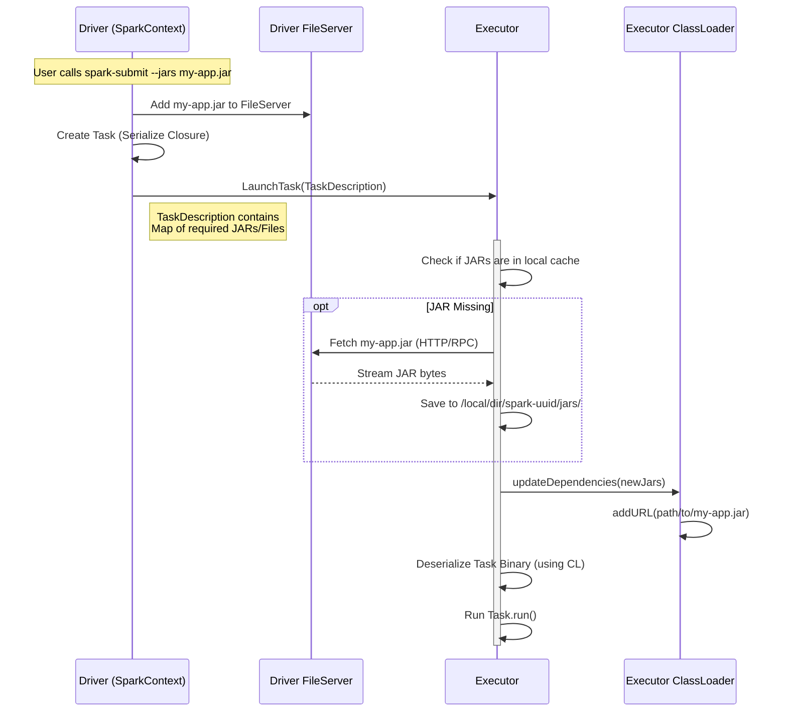

# Deep Dive: How User Code Executes on Executors

A common misconception is that the "Whole App/JAR" is baked into the Executor when it starts. The reality is more dynamic: Executors are generic "worker shells" that **download** your code on demand and use a specialized **ClassLoader** to run it.

## 1. The Big Picture: Driver vs Executor

*   **Driver**: The "Brain". It runs your `main()` function. It has your full application JAR on its classpath. It compiles code into tasks.
*   **Executor**: The "Muscle". It starts as a generic Spark JVM (CoarseGrainedExecutorBackend). It **does not** immediately have your user classes. It fetches them lazily.

### 6. Show Me The Code! (Evidence from source)

Here is exactly where this magic happens in the Spark codebase.

**1. The Lazy Download & ClassLoader Update**
*   **File**: [spark/core/src/main/scala/org/apache/spark/executor/Executor.scala](file:///Users/anmol.shrivastava/spark-code/spark/core/src/main/scala/org/apache/spark/executor/Executor.scala)
*   **Method**: `updateDependencies`

```scala
// Executor.scala
private[executor] def updateDependencies(...) {
  // ... fetching logic (Utils.fetchFile) ...
  if (currentTimeStamp < timestamp) {
    Utils.fetchFile(name, root, ...) // Download the JAR
    
    // THE MAGIC LINE: Add the new JAR to the ClassLoader!
    val url = new File(root, localName).toURI.toURL
    if (!state.urlClassLoader.getURLs().contains(url)) {
      state.urlClassLoader.addURL(url) 
    }
  }
}
```

*   **The ClassLoader Definition**:
    *   **File**: [spark/core/src/main/java/org/apache/spark/util/MutableURLClassLoader.java](file:///Users/anmol.shrivastava/spark-code/spark/core/src/main/java/org/apache/spark/util/MutableURLClassLoader.java)
    *   It extends `URLClassLoader` and adds the `addURL` method to modify the classpath at runtime.

**2. The Deserialization**
*   **File**: [spark/core/src/main/scala/org/apache/spark/executor/Executor.scala](file:///Users/anmol.shrivastava/spark-code/spark/core/src/main/scala/org/apache/spark/executor/Executor.scala)
*   **Method**: `TaskRunner.run`

```scala
// Executor.scala -> TaskRunner.run()
override def run(): Unit = {
  // 1. Fetch JARs and update ClassLoader
  updateDependencies(..., isolatedSession)

  // 2. Set the Thread's ClassLoader to the one holding your JARs
  Thread.currentThread.setContextClassLoader(isolatedSession.replClassLoader)

  // 3. Deserialize the Task (this triggers the class lookup!)
  task = ser.deserialize[Task[Any]](
    taskDescription.serializedTask, 
    Thread.currentThread.getContextClassLoader // Pass the loader here
  )

  // 4. Run it
  task.run(...) 
}
```

This confirms that **without downloading the JAR and updating the ClassLoader first**, the `ser.deserialize` step would fail with `ClassNotFoundException`.

## 2. Code Distribution Mechanism

Spark uses a combination of **RPC messages** and a **File Server** (Netty-based) to distribute code.

### Step-by-Step Flow



### Key Components

1.  **`SparkContext.addJar`**:
    *   When you run `spark-submit --jars app.jar`, or call `sc.addJar()`, the Driver registers this file with its internal **RpcEnv FileServer**.
    *   It assigns a unique timestamp/ID to it.

2.  **`Executor.updateDependencies`**:
    *   Before running *any* task, the Executor checks the `TaskDescription` received from the Driver.
    *   `TaskDescription` contains a map of `{jarName: timestamp}`.
    *   The Executor compares this map with its local cache. If it sees a new JAR or a newer timestamp, it calls `Utils.fetchFile` to download it from the Driver.

## 3. The "Closure" (How Code Gets to Tasks)

When you write:
```scala
val multiplier = 10
rdd.map(x => x * multiplier)
```
The executor doesn't get the variable `multiplier` by magic. Spark uses **Closure Serialization**.

### The Cleaning Process (`ClosureCleaner`)

1.  **Capture**: Java/Scala captures referenced variables (`multiplier`) into an anonymous class/function object.
2.  **Clean**: Spark's `ClosureCleaner` traverses this object to ensure everything inside it is `Serializable`. It nulls out unnecessary references (like the outer class if not used) to prevent `NotSerializableException`.
3.  **Serialize**: The cleaned function object is serialized into a byte array (Task Binary).

### Deserialization on Executor

1.  The Executor receives the byte array.
2.  It uses its **User ClassLoader** (which now points to the downloaded `my-app.jar`) to deserialize the object.
    *   *Critical*: If `my-app.jar` wasn't downloaded first, this step would fail with `ClassNotFoundException`.
3.  It calls the `.apply()` method on the deserialized function object.

## 4. ClassLoading Magic

Spark uses a custom ClassLoader architecture to isolate user code from Spark internals.

*   **`MutableURLClassLoader`**:
    *   This is the ClassLoader used for tasks.
    *   It is "Mutable" because Spark adds new URLs to it at runtime (whenever `updateDependencies` downloads a new JAR).
    *   This allows a long-running Executor to handle new code without restarting.

*   **`childFirst` Configuration**:
    *   Options like `spark.executor.userClassPathFirst` control whether this loader looks in your JARs before Spark's own JARs. This is crucial for fixing dependency conflicts (e.g., if you use a different version of Guava or Jackson than Spark does).

## Summary: Does it have the "Whole JAR"?

## 5. End-to-End Example: The Life of a "WordCount" Job

Let's walk through exactly what happens when you run a standard WordCount job with 2 stages.

**The Code (`MyWordCount.jar`)**:
```scala
val rdd = sc.textFile("hdfs://logs.txt")
val counts = rdd.flatMap(_.split(" "))   // Stage 0
                .map(w => (w, 1))        // Stage 0
                .reduceByKey(_ + _)      // Stage 1 (Shuffle)
counts.collect()                         // Action
```

### Phase 1: Bootstrap (The Setup)
1.  **Submit**: You run `spark-submit --jars MyWordCount.jar ...`.
2.  **Driver Starts**:
    *   Initializes `SparkContext`.
    *   Starts the **Netty RPC Env** and **FileServer**.
    *   **Registers JAR**: Calls `sc.addJar("MyWordCount.jar")`.
        *   **Timestamp (Version ID)**: The Driver assigns a timestamp (e.g., `1736952000`) to this JAR.
        *   *Why?* If you update the JAR later (e.g., in a Shell), the Driver sends a new timestamp. Executors compare this to know when to re-download.
    *   The Driver's FileServer now serves this file at `spark://driver-ip:port/files/MyWordCount.jar`.
3.  **Executors Start**:
    *   Executors launch on worker nodes (e.g., generic YARN containers).
    *   They register with the Driver.
    *   **State**: They have *Spark* JARs, but **NO** `MyWordCount.jar` yet.

### Phase 2: Stage 0 (The Lazy Download)
The Job starts. DAGScheduler creates **Stage 0** (flatMap + map).

1.  **Driver Serializes Task**:
    *   The `flatMap` and `map` functions are serialized.
    *   **Anonymous Class**: Scala compiles `rdd.map(x => x+1)` into an anonymous class like `MyCode$$anonfun$1.class` inside the JAR.
    *   Driver creates a `TaskDescription` encompassing these functions.
    *   **Metadata**: The TaskDescription includes `resources: { "MyWordCount.jar": timestamp_123 }`.
2.  **Sends to Executor 1**:
    *   Executor 1 receives the Task.
3.  **Executor Action**:
    *   **Check Cache**: "Do I have `MyWordCount.jar` with timestamp_123?" -> **NO**.
    *   **Download**: Executor calls `Utils.fetchFile` and pulls the JAR from the Driver's FileServer.
    *   **Store**: Saves it to local disk: `/var/data/spark-uuid/jars/MyWordCount.jar`.
    *   **Update ClassLoader**: Adds this local path to its `MutableURLClassLoader`.
    *   **Deserialize (The Lookup Logic)**:
        *   The Serialized Task says: *"Load class `MyCode$$anonfun$1`"*.
        *   Executor asks its **ClassLoader**: "Find this class."
        *   ClassLoader looks in `MyWordCount.jar`, finds the `.class` file, and loads it into memory.
    *   **Run**: Processes the data.

### Phase 3: Stage 1 (The Cache Hit)
Stage 0 finishes. Shuffle happens. DAGScheduler creates **Stage 1** (reduceByKey).

1.  **Driver Serializes Task**:
    *   The `reduce` function `(_ + _)` is serialized.
    *   Metadata again includes `resources: { "MyWordCount.jar": timestamp_123 }`.
2.  **Sends to Executor 1** (reuses the same executor):
    *   **Check Cache**: "Do I have `MyWordCount.jar` timestamp_123?" -> **YES**.
    *   **Download**: **SKIPPED**.
    *   **Run**: Immediately deserializes and runs the reduce task.

### Why this design?
1.  **Efficiency**: If you have 1000 tasks, you only download the JAR **once** per executor, not 1000 times.
2.  **Dynamism**: If you run a streaming job and add a *new* JAR later (`sc.addJar("patch.jar")`), the Executors will see the new timestamp and download just that file.
