# Spark Memory Management & Serialization

## 1. Memory Architecture: The Foundation

### What is Memory in Spark?

Every Spark executor JVM has a heap (e.g., 10GB) that must be carefully divided. Spark uses a **Unified Memory Manager** (since v1.6) to dynamically allocate memory between two competing needs:

1. **Execution Memory**: Used by tasks to perform computations (shuffles, joins, sorts, aggregations)
2. **Storage Memory**: Used to cache RDDs, DataFrames, and broadcast variables

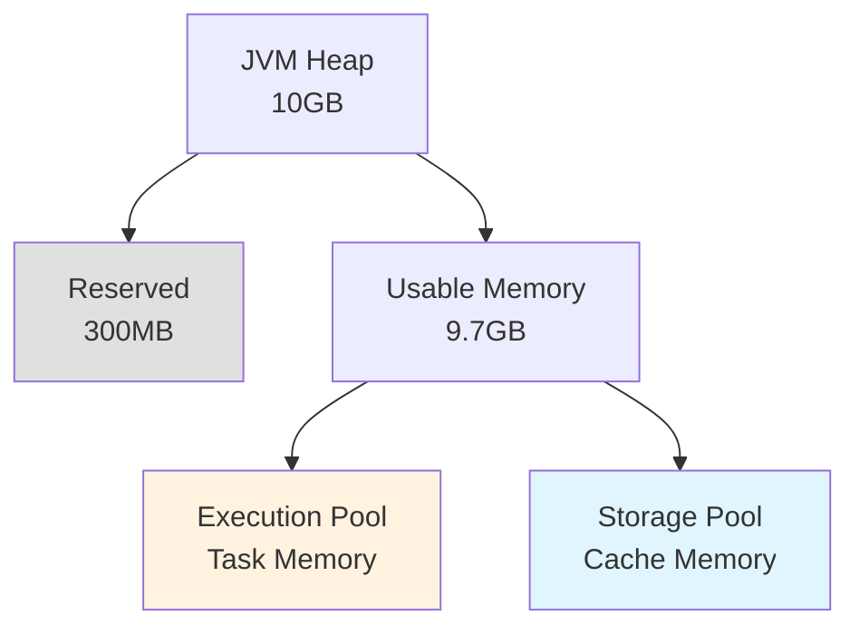

### Memory Division Formula

```
Reserved Memory = 300MB (hardcoded)
Usable Memory = Heap Size - Reserved Memory

Spark Memory = Usable × spark.memory.fraction (default 0.6)
User Memory = Usable × (1 - spark.memory.fraction)

Within Spark Memory:
  Execution (initial) = Spark Memory × (1 - spark.memory.storageFraction)
  Storage (initial) = Spark Memory × spark.memory.storageFraction (default 0.5)
```

**Example with 10GB heap**:
- Reserved: 300MB
- Usable: 9.7GB
- Spark Memory: 9.7GB × 0.6 = 5.82GB
  - Execution: 2.91GB (initial)
  - Storage: 2.91GB (initial)
- User Memory: 3.88GB

---

### Understanding User Memory

**User Memory** is often overlooked but critical—it's the portion of heap that **Spark does NOT manage**. With the default `spark.memory.fraction = 0.6`, 40% of usable memory is reserved for user code.

#### What Lives in User Memory?

**1. User Data Structures**

Objects your code creates outside RDD operations:
```scala
// These live in User Memory, NOT Spark Memory
val myLookup = new HashMap[String, Int]()
myLookup.put("key1", 100)

val config = new MyAppConfig()
val cache = new LRUCache[String, Data]()
```

**2. User-Defined Objects in Closures**

Variables captured by your transformations:
```scala
val processor = new DataProcessor()  // User Memory

rdd.map { record =>
  processor.transform(record)  // processor lives in User Memory
}
```

**3. Spark Internal Metadata**

- RDD lineage DAGs
- Task metadata and tracking
- Broadcast variable metadata (not the broadcasted data itself)
- Accumulator state
- SparkContext internal structures

**4. Third-Party Library Objects**

Any external libraries you use:
```scala
import org.apache.commons.lang3.StringUtils
import com.google.gson.Gson

val gson = new Gson()  // User Memory
```

**5. Temporary Objects in User Code**

```scala
rdd.map { line =>
  val parts = line.split(",")           // Temporary array: User Memory
  val obj = new MyRecord(parts)         // Temporary object: User Memory  
  val processed = obj.transform()       // Another temp: User Memory
  processed
}
```

#### Visual Breakdown

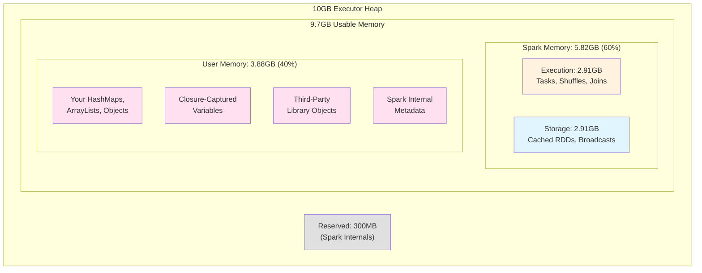

#### When User Memory Matters

**❌ You'll get OutOfMemoryError if User Memory is too small:**

```
java.lang.OutOfMemoryError: Java heap space
  at java.util.HashMap.resize()
  at your.code.YourClass.processData()
```

This error comes from **your code**, not Spark operations. Spark Memory is fine, but User Memory is exhausted.

**Common Scenarios:**

| Scenario | User Memory Usage | Recommendation |
|----------|------------------|----------------|
| **Heavy user data structures** | High (large HashMaps, caches) | Increase: `spark.memory.fraction = 0.5` |
| **Minimal user objects** | Low (simple transformations) | Decrease: `spark.memory.fraction = 0.7` |
| **Third-party libraries** | Medium-High (JSON parsers, ML libs) | Keep default or increase |
| **Pure Spark operations** | Low (just RDD, shuffle, cache) | Decrease to give Spark more |

#### Configuration Strategy

**Increase User Memory** (decrease `spark.memory.fraction`):
```scala
spark.memory.fraction = 0.5  // 50% Spark, 50% User
```

✅ Use when:
- Large HashMap/ArrayList in user code
- Heavy third-party libraries (Jackson, Gson, ML models)
- Complex object creation in transformations
- Getting OOM in user code

**Decrease User Memory** (increase `spark.memory.fraction`):
```scala
spark.memory.fraction = 0.75  // 75% Spark, 25% User
```

✅ Use when:
- Simple transformations (just map/filter)
- Heavy caching/shuffle workload
- Minimal user-created objects
- Spark operations need more memory

#### Common Misconception

**Wrong**: "Spark manages all executor memory"  
**Right**: "Spark only manages Execution + Storage pools. User Memory is for YOUR code."

The `spark.memory.fraction` parameter answers: **"What fraction should Spark control vs. what you control?"**

---

### The Dynamic Boundary

Unlike older static splits, the Unified Memory Manager allows the boundary between Execution and Storage to shift:

**Initial State**:
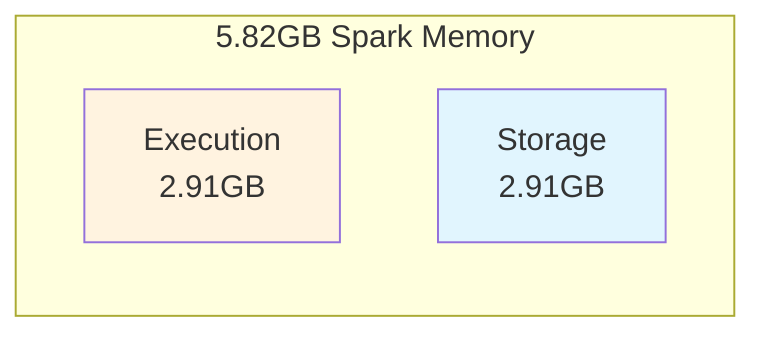

**After Caching 4GB RDD**:
Storage grows by borrowing unused execution memory:
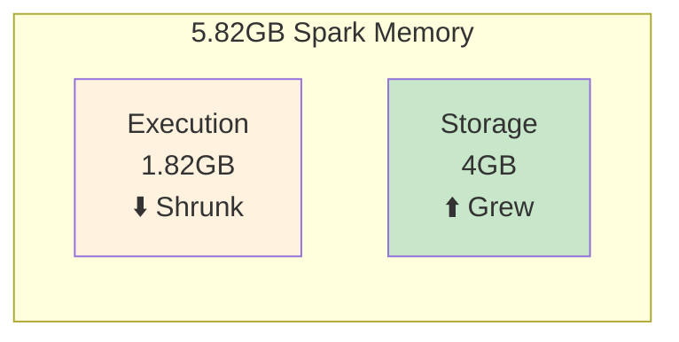

**When Join Needs 4GB**:
Execution evicts cached data to reclaim memory:
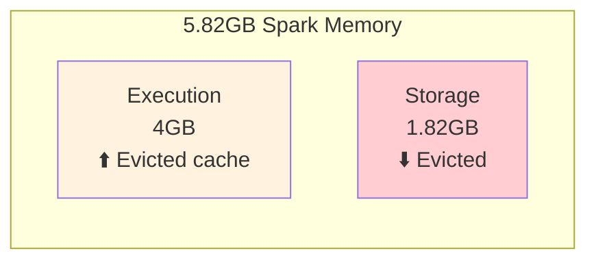

**Critical Rules**:
1. Execution can **always** evict Storage to reclaim memory
2. Storage can **only** borrow unused Execution memory
3. If a task fails due to OOM, the job fails (Execution is critical)
4. If cache is evicted, it can be recomputed (Storage is optional)

---

## 2. On-Heap vs Off-Heap Memory

### Understanding Memory Modes

Spark's memory architecture exists in two distinct modes: on-heap and off-heap. While most users default to on-heap memory, understanding when and why to use off-heap is crucial for scaling Spark applications beyond moderate data sizes.

### On-Heap Memory: The Default Approach

On-heap memory represents the traditional JVM memory model where all data structures exist as Java objects within the heap space managed by the garbage collector. When you allocate a 10GB heap to a Spark executor, this entire space is visible to the JVM's garbage collector.

The garbage collector's role is to identify and reclaim memory occupied by objects no longer in use. To accomplish this, it must periodically scan the heap space, marking live objects and sweeping away dead ones. This scanning process is comprehensive—the GC must examine object references, traverse object graphs, and track memory allocations across the entire heap.

### The Garbage Collection Challenge

Consider a Spark executor processing a large dataset with a 100GB heap. As your application runs, it creates millions of intermediate objects: RDD partitions, cached data structures, shuffle buffers, and temporary computation results. With 50 million objects in memory, each garbage collection cycle must scan this enormous object graph.

Modern JVMs use generational garbage collection, dividing the heap into young and old generations. Minor GC collections handle the young generation frequently and complete quickly—typically under 100ms. However, old generation collections (major GC or full GC) must scan the entire heap, including all 50 million objects and their interconnections. **These full GC pauses can easily exceed 10-30 seconds in large heaps.**

During these pauses, the entire JVM stops. All task threads freeze. No data processing occurs. No shuffle writes complete. No RDD partitions are computed. The executor becomes entirely unresponsive to the Spark scheduler. From the cluster's perspective, the executor appears dead.

When multiple executors pause simultaneously due to GC, the impact compounds. Shuffle operations stall waiting for data. Speculative execution launches redundant tasks on other executors. The job's end-to-end latency increases dramatically, and cluster resources are wasted on pause-induced retries.

**This is why GC pauses matter**: they directly translate to job slowdowns, wasted resources, and unpredictable performance. In production environments processing terabytes of data with strict SLAs, multi-second GC pauses are unacceptable.

### Off-Heap Memory: Bypassing the Garbage Collector

Off-heap memory represents a fundamentally different approach. Instead of allocating Java objects on the JVM heap, Spark allocates raw byte buffers in native OS memory using `sun.misc.Unsafe` APIs. This memory exists outside the JVM's heap space—the garbage collector cannot see it, cannot track it, and most importantly, **cannot pause to scan it**.

When you configure a Spark executor with 30GB on-heap and 70GB off-heap memory, the garbage collector only manages the 30GB heap. The 70GB of off-heap data—potentially containing most of your cached RDDs, shuffle data, and execution buffers—is invisible to GC. This dramatically reduces GC pause times from 10-30 seconds to 1-2 seconds or less.

The trade-off is manual memory management. On-heap memory is automatically managed—create an object, and eventually GC reclaims it. Off-heap memory requires explicit allocation and deallocation. Spark's memory manager handles this carefully, but the potential for memory leaks or segmentation faults (though rare) exists.

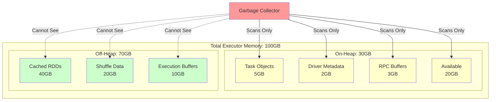

**GC Impact Comparison:**

| Configuration | Heap Size | Objects Scanned | Full GC Pause |
|--------------|-----------|-----------------|---------------|
| **On-Heap Only** | 100GB | ~50M objects | 10-30 seconds |
| **Hybrid (30GB + 70GB Off-Heap)** | 30GB | ~15M objects | 1-2 seconds |

### Off-Heap and the Unified Memory Model

A common misconception is that off-heap memory exists separately from Spark's unified memory management. In reality, **off-heap memory is fully integrated into the unified memory model**.

Recall from Section 1 that unified memory divides Spark's memory pool into Execution and Storage regions that dynamically borrow from each other. This same model applies to off-heap memory:

```
When off-heap is enabled:
  On-Heap Spark Memory = (Heap - 300MB) × spark.memory.fraction
    ├─ On-Heap Execution Pool (dynamic)
    └─ On-Heap Storage Pool (dynamic)
  
  Off-Heap Spark Memory = spark.memory.offHeap.size
    ├─ Off-Heap Execution Pool (dynamic)
    └─ Off-Heap Storage Pool (dynamic)
```

Tasks can request execution memory from either pool. Cached RDDs can reside in either pool. The MemoryManager treats them identically in terms of allocation policies and eviction rules. The only difference is GC visibility.

When you cache an RDD with `MEMORY_ONLY` on a cluster with off-heap enabled, Spark may place some partitions on-heap and others off-heap, dynamically balancing based on availability. The unified memory manager abstracts this complexity.

### What Can Be Stored Off-Heap?

Understanding what Spark stores off-heap is essential for configuration decisions. Off-heap memory exclusively stores **serialized, binary data**—never Java objects. This is a fundamental constraint because native memory cannot hold Java object references.

**Data Types Stored Off-Heap:**

1. **Cached RDD Partitions with Serialized Storage Levels**
   - `MEMORY_ONLY_SER`: Serialized RDD blocks in memory
   - `OFF_HEAP`: Explicitly stored in off-heap memory
   - Data is serialized to bytes using Kryo or Java serialization
   - Example: A 1GB RDD partition becomes a contiguous byte array in native memory

2. **Shuffle Data Buffers**
   - During shuffle write, map-side data is serialized and buffered
   - Shuffle sort operations maintain byte-level pointers in off-heap memory
   - Very effective: shuffle is often the largest memory consumer
   - Eliminates GC pressure during large-scale shuffles

3. **Execution Memory for Operations Requiring Serialization**
   - Sort operations maintain off-heap byte arrays
   - Hash aggregations can use off-heap hash maps (binary format)
   - Join operations buffer serialized records off-heap
   - All operations working with `UnsafeRow` format (Tungsten)

4. **Broadcast Variable Blocks**
   - Broadcasted data can be cached in off-heap memory
   - Particularly beneficial for large broadcast joins
   - Reduces GC pressure from frequently accessed broadcast data

**What CANNOT Be Stored Off-Heap:**

- **Deserialized RDD partitions** (`MEMORY_ONLY`, `MEMORY_AND_DISK`)
  - These are Java objects that must live on-heap
  - Off-heap only accepts serialized byte arrays

- **User code and closures**
  - Task code, lambda functions, and captured variables stay on-heap
  - The JVM must execute this code; cannot exist in native memory

- **Spark internal metadata**
  - RDD lineage graphs, task tracking, scheduler state
  - These are JVM objects required for Spark's operation

- **Driver memory**
  - Off-heap configuration applies only to executors
  - Driver always uses on-heap memory

**Storage Level Decision Matrix:**

| Storage Level | Location | GC Impact | When to Use |
|---------------|----------|-----------|-------------|
| `MEMORY_ONLY` | On-Heap (deserialized) | High | Small datasets, frequent access, GC pauses acceptable |
| `MEMORY_ONLY_SER` | On-Heap (serialized) | Medium | Moderate datasets, willing to trade CPU for memory savings |
| `OFF_HEAP` | Off-Heap (serialized) | **None** | **Large datasets (>10GB), GC pause sensitive, write-once-read-many** |
| `MEMORY_AND_DISK_SER` | Both (serialized) | Low | Very large datasets, spill tolerance |

### Configuration Strategy

Enable off-heap memory when:
- Executor heap size exceeds 40-50GB
- GC pauses observable in Spark UI exceed 5 seconds
- Workload is shuffle-intensive or caches large datasets
- Application can tolerate serialization/deserialization overhead

**Recommended Configuration for 100GB Total Memory:**

```scala
// Give 30GB to on-heap (for objects, metadata, user code)
spark.executor.memory = 30g

// Give 70GB to off-heap (for caches, shuffle data)
spark.memory.offHeap.enabled = true
spark.memory.offHeap.size = 70g

// Use Kryo for efficient serialization
spark.serializer = org.apache.spark.serializer.KryoSerializer
```

**Memory Allocation Result:**
- On-Heap Spark Memory: (30GB - 300MB) × 0.6 = ~17.8GB
  - GC scans only this region → Fast GC
  - Stores small objects, task overhead, metadata
  
- Off-Heap Spark Memory: 70GB
  - GC doesn't see this → Zero GC impact
  - Stores cached RDDs, shuffle blocks, execution buffers
  - Dynamically split between execution/storage

**Trade-offs:**
- ✅ **Benefit**: Eliminates 70GB from GC scanning → 75% reduction in GC work
- ✅ **Benefit**: Predictable, sub-second GC pauses
- ✅ **Benefit**: More stable throughput for long-running jobs
- ❌ **Cost**: Serialization/deserialization CPU overhead when accessing cached data
- ❌ **Cost**: Requires manual tuning; auto-tuning limited
- ❌ **Cost**: Slightly more complex memory debugging (native memory leaks)

---

## 3. Task Memory Management

### TaskMemoryManager

Each task gets its own `TaskMemoryManager` instance to track memory usage.

**Location**: [core/src/main/java/org/apache/spark/memory/TaskMemoryManager.java](file:///Users/anmol.shrivastava/spark-code/spark/core/src/main/java/org/apache/spark/memory/TaskMemoryManager.java)

**Responsibilities**:
1. Request memory from MemoryManager
2. Track allocated pages for this task
3. Release memory when task completes
4. Trigger spilling if memory unavailable

### Memory Acquisition Flow

When a task needs memory (e.g., for a sort buffer), this is the request flow:

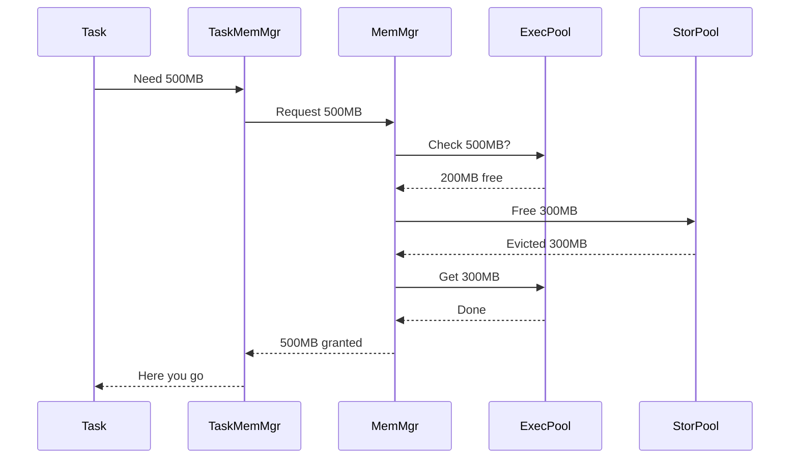

**Key Implementation** ([UnifiedMemoryManager.scala](file:///Users/anmol.shrivastava/spark-code/spark/core/src/main/scala/org/apache/spark/memory/UnifiedMemoryManager.scala)):

```scala
def acquireExecutionMemory(numBytes: Long, taskId: Long): Long = {
  val executionPool = getExecutionPool(memoryMode)
  var acquired = executionPool.acquireMemory(numBytes, taskId)
  
  if (acquired < numBytes) {
    // Try evicting storage
    val storagePool = getStoragePool(memoryMode)
    val evicted = storagePool.freeSpaceToShrinkPool(numBytes - acquired)
    
    // Try again
    acquired += executionPool.acquireMemory(numBytes - acquired, taskId)
  }
  
  acquired  // May be less than requested if eviction insufficient
}
```

**What happens if still not enough?**: Task must spill to disk (see next section).

---

## 4. Spilling: Handling Memory Pressure

### What is Spilling?

When a task cannot acquire enough memory, it **spills** intermediate data to disk. This allows processing unlimited data with limited RAM.

**Example**: Sorting 100GB data with 1GB RAM:
1. Load 1GB into memory
2. Sort in memory
3. Write to disk (spill file 1)
4. Load next 1GB
5. Sort in memory
6. Write to disk (spill file 2)
7. Repeat 100 times
8. Merge all 100 spill files → final sorted output

### Spilling Decision Flow

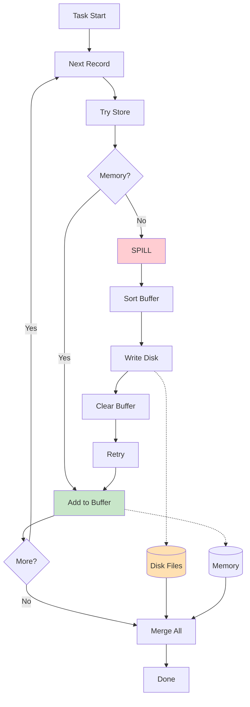

### Code Example: ShuffleExternalSorter

**Location**: `core/src/main/java/org/apache/spark/shuffle/sort/ShuffleExternalSorter.java`

```java
public void insertRecord(Object recordBase, long recordOffset, int length) {
  // Calculate memory needed
  long required = length + 8;  // 8 bytes for pointer
  
  // Try to acquire memory
  long got = taskMemoryManager.acquireExecutionMemory(required);
  
  if (got < required) {
    // Not enough memory! Spill current buffer to disk
    spill();
    
    // Try again (should succeed now that buffer is cleared)
    got = taskMemoryManager.acquireExecutionMemory(required);
  }
  
  // Store record in memory
  inMemSorter.insertRecord(recordBase, recordOffset, length);
}
```

**Configuration**:
```
spark.shuffle.spill = true                    # Enable spilling (default)
spark.shuffle.spill.compress = true           # Compress spilled data
spark.shuffle.spill.batchSize = 10000         # Records per spill batch
```

**Performance Impact**:
- **No spilling**: Fast (all in memory)
- **Some spilling**: Slower (disk I/O cost)
- **Heavy spilling**: Much slower (many disk writes + merge cost)

---

## 5. Serialization: Objects to Bytes

### Understanding the Fundamental Incompatibility

To understand why serialization is necessary, we must first understand what a Java object actually is in memory, and why this representation is fundamentally incompatible with network transmission.

### What is a Java Object?

When you create a Java object in memory, you're not creating a simple data structure. You're creating a complex network of memory references, pointers, and metadata that only makes sense within the context of a single JVM process.

Consider this simple class:

```java
public class Person {
    private String name;    // Reference to String object
    private int age;        // Primitive value
    private Address address;  // Reference to another object
}
```

When you instantiate `Person person = new Person("Alice", 30, addr)`, here's what actually exists in memory:

```
JVM Heap Memory Space:

Memory Address 0x1000: [Person Object Header]
  - Class metadata pointer     → 0x5000 (points to Person.class)
  - Object lock/hash info
  - Field 1: name reference    → 0x2000 (points to String "Alice")
  - Field 2: age value         → 30 (stored inline)
  - Field 3: address reference → 0x3000 (points to Address object)

Memory Address 0x2000: [String Object "Alice"]
  - Class metadata pointer     → 0x5100 (points to String.class)
  - char[] reference          → 0x2100 (points to actual characters)
  - length: 5
  - hash: cached hashcode

Memory Address 0x2100: [char array]
  - 'A', 'l', 'i', 'c', 'e'

Memory Address 0x3000: [Address Object]
  - Class metadata pointer     → 0x5200 (points to Address.class)
  - street reference          → 0x3100 (points to another String)
  - city reference            → 0x3200 (points to another String)
  ...
```

**The critical insight**: A Java object is not a single contiguous block of data. It's a web of **memory addresses** pointing to other memory addresses. The value `0x2000` stored in the `name` field isn't the string "Alice"—it's a memory address that only has meaning in this specific JVM process's address space.

### What are Bytes?

Bytes are raw data—numbers from 0 to 255 stored sequentially. A byte array is a contiguous block of memory containing only values, no pointers, no references, no metadata:

```
Byte Array: [65, 108, 105, 99, 101, 0, 30, ...]
             |<- "Alice" ->|    |<-age->|
```

Bytes are self-contained. The sequence `[65, 108, 105, 99, 101]` represents the ASCII characters for "Alice" regardless of where this byte array exists. There are no memory addresses, no pointers to other structures, no JVM-specific metadata.

### Why Objects Cannot Travel Over Networks

Networks transmit data as a stream of bytes over TCP/IP packets. When you send data from Machine A to Machine B:

1. **Data enters the network card** as a sequence of bytes
2. **Travels through routers** as packets of bytes
3. **Arrives at destination** as the same sequence of bytes

Now imagine trying to send our `Person` object across the network. You'd be sending:

```
Memory Address 0x1000 → [metadata pointer: 0x5000, name ref: 0x2000, age: 30, addr ref: 0x3000]
```

**The problem is catastrophic**: When this arrives on the remote machine (Executor JVM):

- Memory address `0x2000` on the remote machine likely contains completely different data
- Memory address `0x3000` might not even be allocated
- Memory address `0x5000` won't point to `Person.class` metadata
- Even if those addresses exist, they point to the remote JVM's memory, not the original data

**The object's internal structure—the pointers and references—only makes sense in the original JVM's memory space.** Sending these raw pointers to another machine would result in garbage data or segmentation faults.

This is not a Spark limitation. This is a fundamental constraint of how operating systems and networks work:
- Each process has its own virtual address space
- Memory addresses are meaningful only within a single process
- Networks transport bytes, not process-specific memory structures

### The Solution: Serialization

Serialization solves this by **flattening the object graph into a self-contained sequence of bytes**. Instead of sending memory pointers, we send the actual data values:

**Original Object (memory pointers):**
```
Person @ 0x1000
  ├─ name → 0x2000 → String @ 0x2100 → ['A','l','i','c','e']
  ├─ age = 30
  └─ address → 0x3000 → Address @ ...
```

**Serialized Bytes (self-contained values):**
```
[ClassID: Person] [Field1: "Alice" = 5 bytes: 65,108,105,99,101] [Field2: age = 30] [Field3: Address data...]
```

Now the byte sequence contains the **values** ("Alice", 30), not pointers (0x2000, 30). When this arrives on the remote machine, deserialization reconstructs the object using the remote JVM's memory:

**Reconstructed Object (new memory addresses):**
```
Person @ 0x7000 (different address!)
  ├─ name → 0x8000 → String @ 0x8100 → ['A','l','i','c','e'] (same data, different location)
  ├─ age = 30 (same value)
  └─ address → 0x9000 → Address @ ... (reconstructed)
```

The remote object has completely different memory addresses, but **logically identical data**. This is the essence of serialization: converting memory-address-based structures into value-based byte sequences that can be transmitted and reconstructed anywhere.

### Visualization: Object vs Bytes

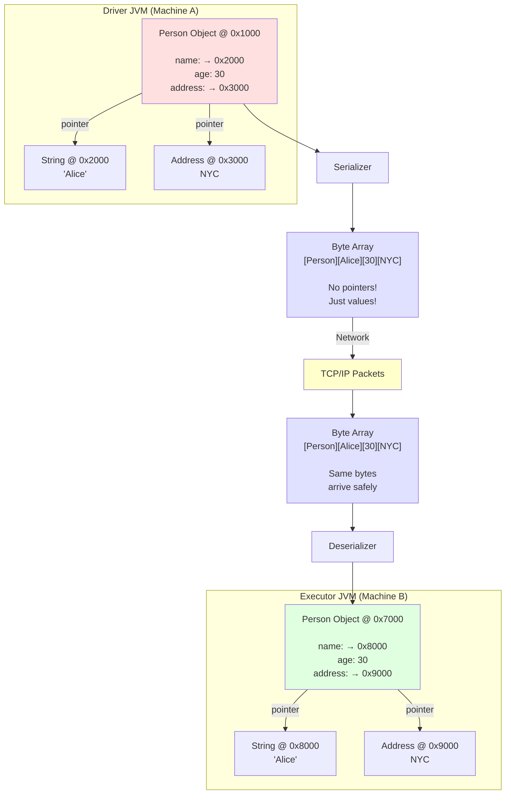

**Key Insights:**
- **Left side**: Object with pointers (0x1000 → 0x2000 → 0x3000) on Driver
- **Middle**: Serialized bytes containing only values, no pointers
- **Right side**: Reconstructed object with **different pointers** (0x7000 → 0x8000 → 0x9000) on Executor
- **Identity broken, equality preserved**: The reconstructed object has different memory addresses but identical logical values

### Serialization Use Cases in Spark

With this understanding, we can see why Spark serializes data extensively:

1. **Task Closures: Driver → Executors**
   - Your lambda function `x => x * 2` exists as a Java object with class metadata and field references
   - Spark serializes the closure's byte code and captured variables
   - Executors deserialize and reconstruct the function in their memory space

2. **Shuffle Data: Executor → Executor**
   - Map-side data exists as Java objects (key-value pairs)
   - Cannot send object pointers between executor JVMs
   - Serialize to bytes, write to disk, transfer over network, deserialize

3. **Broadcast Variables: Driver → All Executors**
   - A 10MB Map exists as a complex object graph on the driver
   - Serialize once to bytes, transmit to each executor
   - Each executor deserializes into its own memory space

4. **RDD Caching with Serialization: Memory Optimization**
   - 1 million objects take 74MB (objects) vs 9MB (serialized bytes)
   - Trade CPU (deser cost) for memory (8x compression)
   - Bonus: Also reduces GC pressure (fewer objects)

### Why This Matters for Performance

Understanding the object-to-bytes transformation explains several Spark behaviors:

**Serialization Cost**: Converting objects to bytes requires CPU—traversing object graphs, writing field values, maintaining type information. For 1 million objects, this can take seconds.

**Deserialization Cost**: Reconstructing objects from bytes also requires CPU—reading bytes, allocating new objects, setting field values, rebuilding references.

**Network Cost**: Smaller byte representation = faster network transfer. Java serialization produces 100 bytes per Person, Kryo produces 9 bytes. For 1 million objects over 100 Mbps network: 100MB takes 8 seconds, 9MB takes 0.7 seconds.

**Memory Cost**: Serialized data is compact (just values) vs objects (values + headers + pointers). This is why `MEMORY_ONLY_SER` saves memory.

This is why Kryo matters, why broadcast variables are critical, and why excessive shuffling kills performance—every serialization/deserialization and network hop has real cost.

---

### Concrete Example: Serialization in Action

**Step 1: Define a Java Class**

```java
public class Person implements Serializable {
    private String name;
    private int age;
    private String city;
    
    public Person(String name, int age, String city) {
        this.name = name;
        this.age = age;
        this.city = city;
    }
}
```

**Step 2: Create an Object on Driver**

```scala
// On Spark Driver
val alice = new Person("Alice", 30, "New York")
// Object in memory: takes ~64 bytes (object header + fields + references)
```

**Step 3: Serialization (Object → Bytes)**

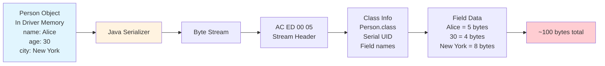

**Serialization Code**:
```java
// Spark does this internally
ByteArrayOutputStream bos = new ByteArrayOutputStream();
ObjectOutputStream oos = new ObjectOutputStream(bos);

oos.writeObject(alice);  // Convert object to bytes
oos.flush();

byte[] serializedBytes = bos.toByteArray();  // ~100 bytes
// Now these bytes can travel over network!
```

**Step 4: Network Transfer**

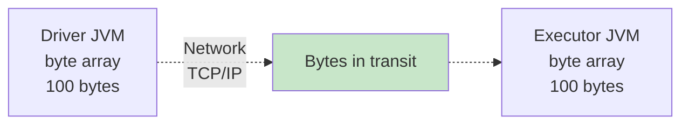

**Step 5: Deserialization (Bytes → Object)**

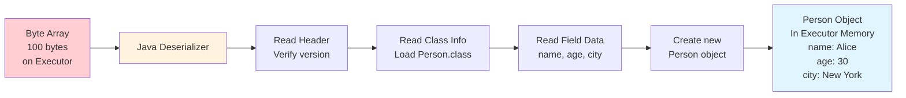

**Deserialization Code**:
```java
// Spark does this on executor
ByteArrayInputStream bis = new ByteArrayInputStream(serializedBytes);
ObjectInputStream ois = new ObjectInputStream(bis);

Person alice = (Person) ois.readObject();  // Reconstruct object from bytes
// Now executor has the exact same Person object as driver!

System.out.println(alice.name);   // "Alice"
System.out.println(alice.age);    // 30
System.out.println(alice.city);   // "New York"
```

**Complete Round-Trip Flow**:

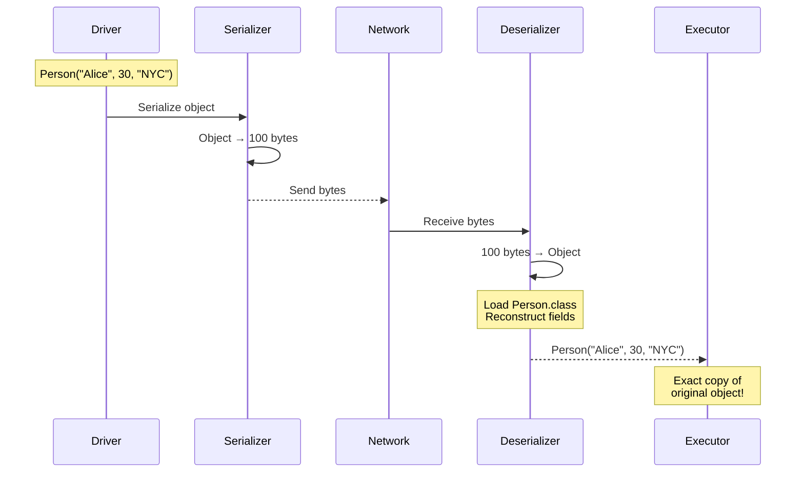

**Why This Matters in Spark**:

1. **Task Distribution**: When you write `rdd.map(x => transform(x))`, Spark serializes the `transform` function and sends it to executors
2. **Shuffle**: During `groupByKey`, each (key, value) pair is serialized, written to disk, transferred over network, then deserialized
3. **Closure Capture**: If your function references a large object (e.g., 10MB lookup table), that entire object gets serialized with every task


## 6. Java vs Kryo Serialization

### Java Serialization (Default)

**How it works**: Uses Java's built-in ObjectOutputStream. Writes full class metadata with every object.

**Format Breakdown** for `Person("Alice", 30)`:
```
Stream Header:        4 bytes
Class Descriptor:
  - Class name:      25 bytes  ("com.example.Person")
  - Serial UID:       8 bytes
  - Field count:      2 bytes
  - Field "name":    15 bytes  (descriptor)
  - Field "age":     12 bytes  (descriptor)
Object Data:
  - name type marker: 1 byte
  - name length:      2 bytes
  - name "Alice":     5 bytes
  - age type marker:  1 byte
  - age value:        4 bytes
-------------------------------------
Total:            ~100 bytes
```

### Kryo Serialization

**How it works**: Registers classes upfront. Only writes class ID + raw field data.

**Format Breakdown** for `Person("Alice", 30)`:
```
Class ID:             2 bytes  (pre-registered)
name length:          1 byte
name "Alice":         5 bytes
age (varint):         1 byte
-------------------------------------
Total:              ~9 bytes
```

### Visual Comparison

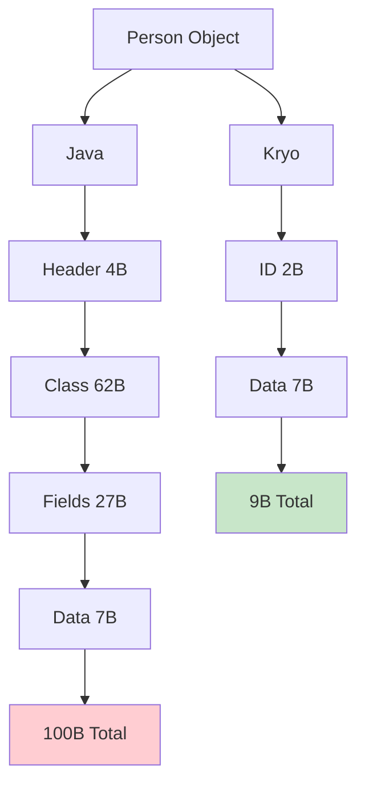

### Performance Impact

**For 1,000,000 Person objects**:

| Metric | Java | Kryo | Improvement |
|:-------|:-----|:-----|:------------|
| **Serialization Time** | 10 seconds | 1 second | **10x faster** |
| **Deserialization Time** | 15 seconds | 1.5 seconds | **10x faster** |
| **Output Size** | 100 MB | 9 MB | **11x smaller** |
| **Network Transfer** (100 Mbps) | 8 seconds | 0.7 seconds | **11x faster** |

**Configuration**:
```scala
// Enable Kryo
spark.serializer = org.apache.spark.serializer.KryoSerializer

// Register classes for best performance
conf.registerKryoClasses(Array(
  classOf[Person],
  classOf[MyDataStructure],
  classOf[scala.collection.mutable.HashMap]
))

// Require registration (fail fast on unregistered classes)
spark.kryo.registrationRequired = true

// Increase buffer for large objects
spark.kryoserializer.buffer.max = 1024m
```

---

## 7. RDD Caching Mechanics

### Why Caching Exists

RDD caching addresses a fundamental problem in Spark: **recomputation cost**. Spark RDDs are inherently lazy and immutable. When you define transformations, Spark doesn't execute them immediately—it builds a lineage graph (directed acyclic graph or DAG) that describes how to compute the RDD from source data.

Without caching, every action on an RDD recomputes the entire lineage from scratch:

```scala
val rawData = sc.textFile("data.csv")                    // RDD 1
val parsed = rawData.map(parse)                          // RDD 2  
val filtered = parsed.filter(_.isValid)                  // RDD 3
val transformed = filtered.map(transform)                 // RDD 4

// First action
val count = transformed.count()  
// Executes: textFile → parse → filter → transform → count

// Second action on same RDD
val sample = transformed.take(10)
// Executes: textFile → parse → filter → transform → take (AGAIN!)
```

Reading from disk, parsing, filtering, and transforming happens **twice** because Spark doesn't automatically keep intermediate results. For expensive transformations or slow data sources, this recomputation can dominate job time.

**Caching breaks this pattern**: Store the RDD in memory after the first computation, reuse it for subsequent actions.

```scala
transformed.cache()  // or .persist()

val count = transformed.count()   // Compute and cache
val sample = transformed.take(10)  // Read from cache (instant!)
```

But caching isn't free. It consumes memory, may involve serialization, and could evict other cached data. The choice of **how** to cache (storage level) fundamentally affects this trade-off.

---

### The Two Storage Philosophies

Spark offers two fundamentally different ways to store cached RDDs:

#### Philosophy 1: Deserialized Storage (MEMORY_ONLY)

Store RDD partitions as **Java objects** in the JVM heap.

**How it works:**
```
Partition Data: [Person("Alice", 30), Person("Bob", 25), ...]
                      ↓
                 Store as-is
                      ↓
Storage Memory: [Object references to Person instances]
```

Each `Person` object lives in memory with its full structure:
- Object header (12-16 bytes)
- Class metadata pointer
- Field values or references
- Padding for alignment

**Access pattern:**
```scala
// Later access
partition.foreach { person =>
  println(person.name)  // Direct field access - FAST!
}
```

**Pros:**
- ✅ **Zero deserialization overhead**: Objects ready to use immediately
- ✅ **Fast iteration**: Direct method calls, no byte-to-object conversion
- ✅ **Type-safe access**: Full type information preserved

**Cons:**
- ❌ **High memory usage**: Object overhead (~30-50% of actual data)
- ❌ **Severe GC pressure**: Millions of objects trigger frequent GC
- ❌ **Memory bloat**: String internals, padding, metadata add up

**Example memory cost:**
```scala
case class Person(name: String, age: Int, city: String)

// One Person object
Actual data: "Alice" (5 bytes) + 30 (4 bytes) + "NYC" (3 bytes) = 12 bytes

JVM storage:
  Person object header: 16 bytes
  name reference: 8 bytes → String object (24 bytes) → char array (10 bytes)
  age: 4 bytes (boxed: 16 bytes)
  city reference: 8 bytes → String object (24 bytes) → char array (6 bytes)
  -------------------------
  Total: ~120 bytes for 12 bytes of data (10x overhead!)
```

For 1 million objects: **12MB of data becomes 120MB in memory**.

#### Philosophy 2: Serialized Storage (MEMORY_ONLY_SER)

Store RDD partitions as **byte arrays**.

**How it works:**
```
Partition Data: [Person("Alice", 30), Person("Bob", 25), ...]
                      ↓
             Serialize to bytes
                      ↓
Storage Memory: [One big byte array: [Person bytes][Person bytes]...]
```

All objects in the partition are serialized into a single, compact byte buffer—no object headers, no pointers, just raw data.

**Access pattern:**
```scala
// Later access
partition.foreach { person =>  // Deserialize byte array first!
  println(person.name)
}
```

**Pros:**
- ✅ **Massive memory savings**: 5-10x less memory than deserialized
- ✅ **Reduced GC pressure**: One byte array instead of millions of objects
- ✅ **Off-heap compatible**: Can use OFF_HEAP storage level

**Cons:**
- ❌ **Deserialization CPU cost**: Must convert bytes → objects on every read
- ❌ **Slower access**: CPU-bound deserialization before using data
- ❌ **Serializer dependency**: Requires efficient serializer (Kryo recommended)

**Example memory cost:**
With Kryo serialization:
```
1 million Person objects:
  Kryo serialized size: ~15MB (efficient packing)
  vs. deserialized: 120MB
  Savings: 8x
```

---

### Visual Comparison: The Trade-Off

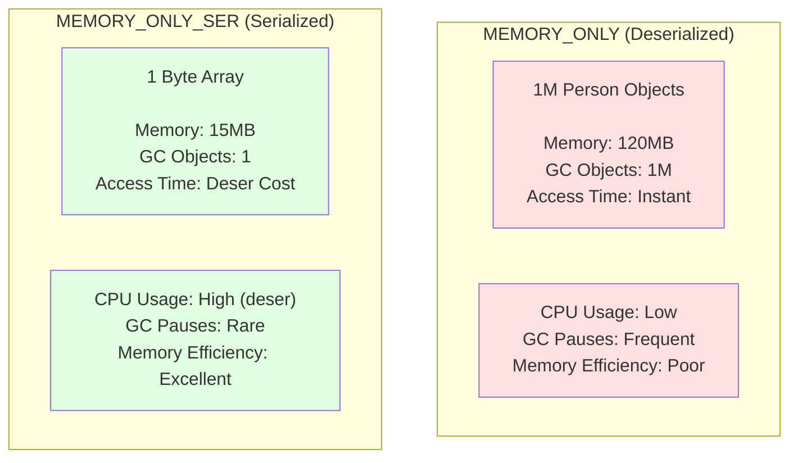

**The fundamental trade-off:**
- **Deserialized**: Trade memory for speed (120MB, instant access)
- **Serialized**: Trade CPU for memory (15MB, deserialize on each access)

---

### The Decision Framework

**Use MEMORY_ONLY when:**
- ✅ Dataset is small (< 20% of executor memory)
- ✅ RDD accessed frequently (> 5 times)
- ✅ Low-latency access required
- ✅ GC pauses acceptable (< 5-second pauses)
- ✅ Memory is abundant

**Use MEMORY_ONLY_SER when:**
- ✅ Dataset is large (> 50% of executor memory)
- ✅ Memory pressure exists (seeing evictions/spilling)
- ✅ GC pauses are severe (> 10 seconds)
- ✅ RDD accessed occasionally (< 5 times)
- ✅ Can tolerate deserialization cost

**Use MEMORY_AND_DISK_SER when:**
- ✅ Dataset larger than available memory
- ✅ Recomputation is expensive (slow source data)
- ✅ Spilling to disk acceptable

**Use OFF_HEAP when:**
- ✅ Very large datasets (multi-GB per executor)
- ✅ GC pauses unacceptable
- ✅ Long-running applications
- ✅ Willing to sacrifice access speed for GC stability

**Don't cache when:**
- ❌ RDD used only once
- ❌ Source data faster than recomputation (e.g., reading from local SSD)
- ❌ Transformation is trivial (simple map/filter)

---

### The Caching Flow

When you call `rdd.persist(StorageLevel.MEMORY_ONLY_SER)`:

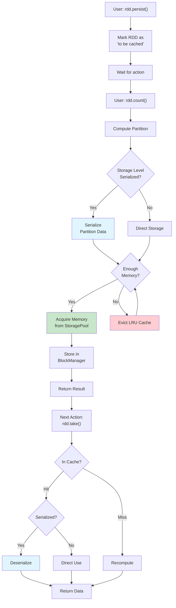

**Key points:**
1. `.persist()` is lazy—nothing happens until first action
2. First action computes and caches
3. Subsequent actions check cache first
4. If evicted, Spark recomputes from lineage (automatic)
5. Cache eviction uses LRU (Least Recently Used)

---

### Storage Levels Reference

| Level | Serialized | Location | Replicated | Disk Fallback | Best For |
|-------|-----------|----------|------------|---------------|----------|
| `MEMORY_ONLY` | ❌ | On-Heap | ❌ | ❌ | Small datasets, frequent access, plenty of RAM |
| `MEMORY_ONLY_2` | ❌ | On-Heap | ✅ (2x) | ❌ | Fault tolerance needed, acceptable 2x memory cost |
| `MEMORY_ONLY_SER` | ✅ | On-Heap | ❌ | ❌ | Large datasets, memory pressure, GC issues |
| `MEMORY_ONLY_SER_2` | ✅ | On-Heap | ✅ (2x) | ❌ | Serialized + fault tolerance |
| `MEMORY_AND_DISK` | ❌ | Both | ❌ | ✅ | Avoid recomputation, dataset > memory |
| `MEMORY_AND_DISK_SER` | ✅ | Both | ❌ | ✅ | **Most common**: Large datasets, acceptable disk I/O |
| `MEMORY_AND_DISK_2` | ❌ | Both | ✅ (2x) | ✅ | Deserialized + fault tolerance + disk |
| `MEMORY_AND_DISK_SER_2` | ✅ | Both | ✅ (2x) | ✅ | Serialized + fault tolerance + disk |
| `DISK_ONLY` | ✅ | Disk | ❌ | N/A | Recomputation more expensive than disk I/O |
| `OFF_HEAP` | ✅ | Off-Heap | ❌ | ❌ | Very large datasets, eliminate GC pauses |

**The "_2" suffix**: Replicates cache on two nodes for fault tolerance. Doubles memory cost but avoids recomputation if one node fails.

---

### Practical Example

```scala
val rawLogs = sc.textFile("hdfs://logs/")  // 100GB data
val parsed = rawLogs.map(parseLine)        // Expensive parsing
val filtered = parsed.filter(_.isError)    // Reduces to 1GB
val enriched = filtered.map(enrich)        // Expensive external API calls

// Decision: Which to cache?

// Option 1: Cache raw logs?
// rawLogs.persist(MEMORY_AND_DISK_SER)
// ❌ Bad: 100GB is huge, unnecessary

// Option 2: Cache parsed?
// parsed.persist(MEMORY_AND_DISK_SER)
// ⚠️ Maybe: Still large, but saves parsing

// Option 3: Cache filtered? ✅ BEST
filtered.persist(MEMORY_ONLY_SER)
// ✅ Only 1GB (manageable)
// ✅ Saves expensive parsing + filtering
// ✅ Before expensive enrichment

// Option 4: Cache enriched?
enriched.persist(MEMORY_ONLY_SER)
// ✅ Also good: Saves parsing + filtering + enrichment

// Run multiple analyses
enriched.filter(_.severity == "CRITICAL").count()  // Uses cache
enriched.groupBy(_.service).count()                // Uses cache
enriched.map(_.timestamp).distinct().count()       // Uses cache
```

**Guideline**: Cache the RDD that is:
- Reused multiple times
- After expensive operations (I/O, parsing, joins)
- Before fan-out (multiple downstream transformations)
- Reasonably sized (fits in memory)

---

### Memory Overhead Example

**Scenario**: 1 million records, each 50 bytes of raw data.

| Storage Level | Memory Used | GC Objects | Access Speed | Notes |
|---------------|-------------|------------|--------------|-------|
| **No Caching** | 0 MB | 0 | N/A | Recompute every time |
| **MEMORY_ONLY** | 380 MB | 1,000,000 | Instant | 7.6x overhead from objects |
| **MEMORY_ONLY_SER (Java)** | 100 MB | 1 | +5ms deser | 2x overhead (poor serializer) |
| **MEMORY_ONLY_SER (Kryo)** | 55 MB | 1 | +3ms deser | 1.1x overhead (efficient) |
| **OFF_HEAP (Kryo)** | 55 MB | 0 | +3ms deser | Off-heap, zero GC impact |

**Takeaway**: Kryo serialization with caching can reduce memory from 380MB → 55MB (7x savings) with only 3ms deserialization cost per access.

---

## 8. Broadcast Variables

### Understanding the Closure Capture Problem

To understand why broadcast variables exist, we must first understand a fundamental behavior of how functional programming works in distributed systems: **closure capture**.

### What is a Closure? (Simple Explanation)

**A closure is a function that "remembers" and uses variables from where it was created, even after moving to a different place.**

Think of it like a **function with a backpack**. When you create the function, it packs variables from its surroundings into its backpack and carries them wherever it goes.

#### Simple Example: Discount Calculator

Imagine you own a store with a daily discount:

```scala
// Today's special discount
val discountPercent = 20  // 20% off!

// Function to calculate discounted prices
val applyDiscount = (price: Int) => {
  price - (price * discountPercent / 100)
}

// The function "remembers" discountPercent even though it's defined outside
println(applyDiscount(100))  // Output: 80
println(applyDiscount(50))   // Output: 40
```

**What happened?**
- `discountPercent = 20` exists in the "store scope" (outer scope)
- `applyDiscount` function is created and "closes over" (captures) `discountPercent`
- Even when called later, the function still "remembers" the 20% discount
- **The closure is**: `applyDiscount` + its "memory" of `discountPercent = 20`

#### Another Example: Tax Calculator

```scala
// Tax rate in your state
val taxRate = 5  // 5% tax

// Function that uses taxRate from outside
val calculateTotal = (price: Int) => {
  val tax = price * taxRate / 100
  price + tax  // Uses taxRate from outer scope
}

calculateTotal(100)  // Output: 105
calculateTotal(200)  // Output: 210
```

The function `calculateTotal` "closes over" `taxRate` - it captures and remembers this variable from the surrounding environment.

#### Why It's Called "Closure"

The function **closes over** (wraps around) variables from its surrounding environment, like closing a backpack around items it carries.

**Without closure** - must pass everything explicitly:
```scala
val calculateTotal = (price: Int, taxRate: Int) => {
  price + (price * taxRate / 100)
}
calculateTotal(100, 5)  // Must provide taxRate every time
```

**With closure** - function remembers `taxRate`:
```scala
val taxRate = 5
val calculateTotal = (price: Int) => {
  price + (price * taxRate / 100)  // taxRate automatically available
}
calculateTotal(100)  // Cleaner! Function remembers taxRate
```

### How Closures Work in a Single JVM

In a single program on your computer, closures work perfectly by capturing references:

```scala
// Email configuration
val senderEmail = "support@mycompany.com"
val companyName = "MyCompany"

// Function that uses these variables
val sendWelcomeEmail = (customerEmail: String) => {
  s"""
  From: $senderEmail
  To: $customerEmail
  
  Welcome to $companyName!
  """
}

sendWelcomeEmail("alice@example.com")
sendWelcomeEmail("bob@example.com")
```

**Each time you call the function:**
- You only provide the customer email
- The function "remembers" `senderEmail` and `companyName` from when it was created
- It just looks in memory and finds these variables (they're at specific memory addresses)
- This is efficient: one copy of data, function stores a pointer to it

**The "backpack" mental model:**
- Function carries `senderEmail` and `companyName` in its "backpack"
- When called, it opens the backpack and uses these values
- In a single JVM, the backpack just contains memory addresses (pointers)

### The Problem in Distributed Spark

Now consider the same pattern in Spark across a cluster:

```scala
// On Driver
val largeLookup = Map(1 -> "A", 2 -> "B", ..., 1000000 -> "Z")  // 10MB Map
val rdd = sc.parallelize(1 to 1000000, 1000)  // 1000 partitions = 1000 tasks

// Distributed transformation
val result = rdd.map(x => largeLookup.get(x))  // Closure captures largeLookup
```

Here's what Spark **must** do to execute this on remote executors:

1. **The closure captures `largeLookup`**: The lambda function needs this variable to execute
2. **Spark must send the closure to executors**: Can't send memory pointers (as we learned in serialization)
3. **Spark serializes the entire closure**: This includes **everything the closure references**
4. **Critical**: `largeLookup` gets serialized **with every single task**

### Why Serialized Per-Task?

Each task is an independent unit of work that gets serialized separately and sent to potentially different executors. When Spark serializes a task, it must include everything that task needs:

```
Task 1 serialization:
  [Task metadata] + [Partition 1 info] + [Closure bytecode] + [largeLookup: 10MB]

Task 2 serialization:
  [Task metadata] + [Partition 2 info] + [Closure bytecode] + [largeLookup: 10MB]

...

Task 1000 serialization:
  [Task metadata] + [Partition 1000 info] + [Closure bytecode] + [largeLookup: 10MB]
```

**Each task carries its own copy** because:
- Tasks are independent (could run on different executors)
- No shared memory between executors
- No way to know if two tasks will run on the same executor
- Serialization happens once per task, not once per executor

### The Amplification Problem

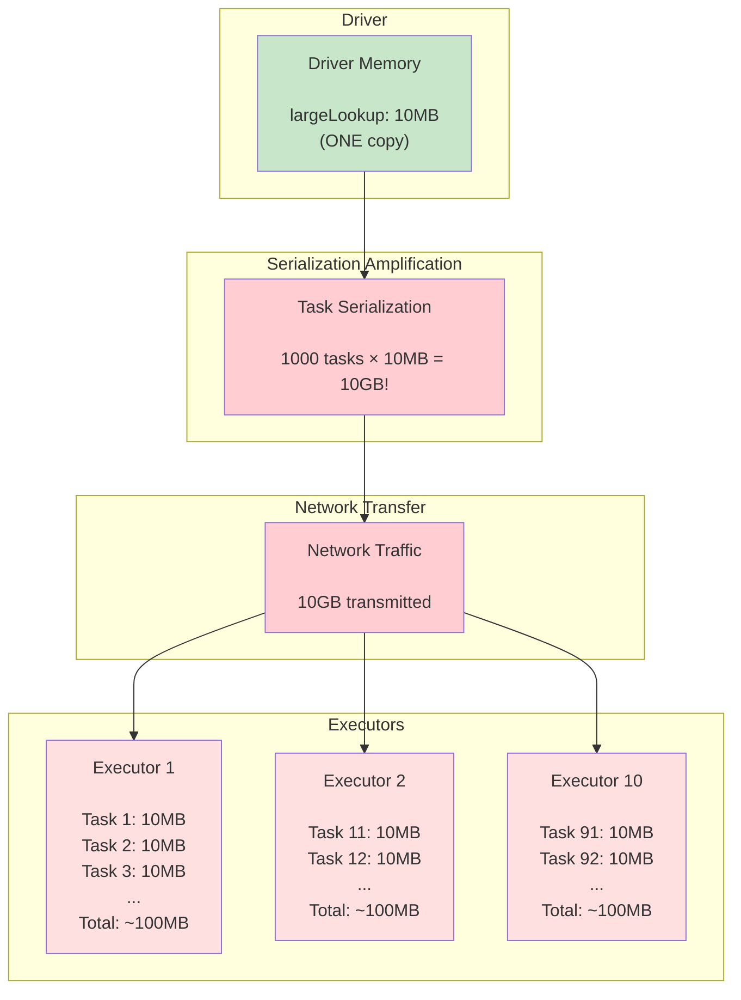

**The catastrophic result:**
- **10MB on driver** amplified to **10GB across tasks**
- **10GB network transfer**: Overwhelming bandwidth, minutes of transfer time
- **10 executors × ~100MB each = 1GB executor memory**: Wasteful duplication
- **All this for data that never changes!**

Notice the absurdity: `largeLookup` is **read-only**, **identical across all tasks**, yet we send 1000 copies over the network and store 100 copies in executor memory.

### The Solution: Broadcast Variables

Broadcast variables solve this by recognizing that **read-only data shared across tasks should be distributed once per executor, not once per task**.

Instead of:
- Serialize with each task (1000 times)
- Transfer with each task (10GB network)
- Store per task (~1GB total executor memory)

Broadcast does:
- Serialize once on driver
- Transfer once per executor (10MB × 10 executors =  100MB network)
- Store once per executor (10MB × 10 executors = 100MB executor memory)

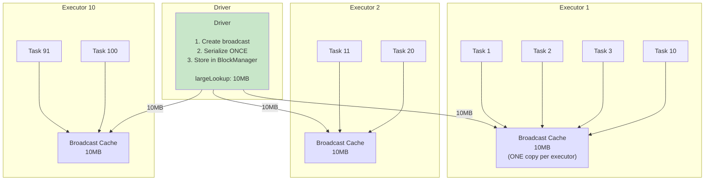

**Result:**
- **Network**: 10GB → 100MB (100x reduction!)
- **Executor Memory**: 1GB duplicated → 100MB total (10x reduction!)
- **Tasks**: Download once per executor, reuse across all tasks on that executor

### How Broadcast Works Internally

**Step 1: Driver creates broadcast** (`sc.broadcast(largeLookup)`)
- Serializes `largeLookup` once → 10MB bytes
- Splits into chunks (default 4MB blocks for efficient transfer)
- Stores chunks in driver's `BlockManager` with blockId `broadcast_0`
- Returns `Broadcast[Map]` wrapper object

**Step 2: Task closures capture broadcast reference**
```scala
val bc = sc.broadcast(largeLookup)
rdd.map(x => bc.value.get(x))  // Closure captures 'bc', NOT 'largeLookup'
```

The closure now captures a **lightweight reference object** (`bc`), not the 10MB map. The `Broadcast` object is tiny—maybe 100 bytes—containing:
- Broadcast ID
- BlockManager address for fetching
- No actual data!

**Step 3: First task on executor accesses broadcast**
```scala
// Task 1 on Executor 1
val result = bc.value.get(x)  // First access to bc.value on this executor
```

1. Executor checks local `BlockManager` for `broadcast_0` → **miss**
2. Executor contacts driver's `BlockManager`: "Send me broadcast_0"
3. Driver sends chunks over network
4. Executor reassembles chunks, deserializes to `Map` object
5. Executor stores in local `BlockManager` (memory)
6. Returns `Map` to task

**Step 4: Subsequent tasks on same executor**
```scala
// Task 2 on Executor 1 (runs later)
val result = bc.value.get(x)  // Second access to bc.value
```

1. Executor checks local `BlockManager` for `broadcast_0` → **hit!**
2. Returns cached `Map` immediately
3. No network transfer, no deserialization

**Cost comparison for 100 tasks on one executor:**

| Approach | Network per Executor | Memory per Executor | Total Network (10 executors) |
|----------|---------------------|---------------------|------------------------------|
| **Without Broadcast** | 1000MB (100 tasks × 10MB) | ~1000MB (duplicated) | 10GB |
| **With Broadcast** | 10MB (fetched once) | 10MB (stored once) | 100MB |

### Practical Usage

```scala
// WRONG: Closure captures large object
val lookup = Map(...)  // 10MB
rdd.map(x => lookup.get(x))  // Serialized with every task!

// RIGHT: Broadcast the large object
val lookupBC = sc.broadcast(Map(...))  // Serialize once
rdd.map(x => lookupBC.value.get(x))    // Only reference broadcasted

// Later, when done
lookupBC.unpersist()  // Free memory on executors
```

**When to broadcast:**
- ✅ Read-only data (lookup tables, ML model weights, configuration)
- ✅ Reused across many tasks (> 10 tasks)
- ✅ Size > 1MB (smaller data, overhead not worth it)
- ✅ Significantly smaller than RDD (otherwise, consider join)
- ❌ Mutable data (broadcast is immutable)
- ❌ Data that changes per task (task-specific data belongs in RDD)

---

### Broadcast Lifecycle

1. **Driver Side** (`TorrentBroadcast.scala`):
   - Serialize the variable once
   - Split into chunks (e.g., 4MB each for large broadcasts)
   - Store chunks in Driver's BlockManager

2. **Executor Side** (First access):
   - Task calls `broadcastVar.value`
   - Executor checks local cache → miss
   - Fetch chunks from Driver via network
   - Reassemble chunks
   - Deserialize once
   - Cache locally in Storage Pool

3. **Executor Side** (Subsequent tasks):
   - Task calls `broadcastVar.value`
   - Executor checks local cache → hit!
   - Return deserialized value (no network, no deserialization)

**Usage**:
```scala
val largeLookup = Map(1 -> "A", 2 -> "B", ..., 1000000 -> "Z")  // 10MB

// BAD: Closure serialization
rdd.map(x => largeLookup.get(x))  // 10MB × 1000 tasks = 10GB!

// GOOD: Broadcast
val bc = sc.broadcast(largeLookup)
rdd.map(x => bc.value.get(x))  // 10MB × 10 executors = 100MB
```

---

## 9. Configuration Tuning

### Memory Pool Tuning

```
# Spark memory as fraction of usable heap (default: 0.6)
spark.memory.fraction = 0.7  
# Increase if tasks need more memory

# Storage fraction within Spark memory (default: 0.5)
spark.memory.storageFraction = 0.3  
# Decrease for shuffle-heavy jobs (more execution memory)
# Increase for cache-heavy jobs (more storage memory)

# Off-heap memory for large heaps
spark.memory.offHeap.enabled = true
spark.memory.offHeap.size = 70g
```

### Serialization Tuning

```
# Use Kryo (10x faster than Java)
spark.serializer = org.apache.spark.serializer.KryoSerializer

# Require registration (fail fast on missing classes)
spark.kryo.registrationRequired = true

# Buffer sizes for large objects
spark.kryoserializer.buffer = 64k        # Initial buffer
spark.kryoserializer.buffer.max = 1024m  # Max buffer
```

### Spilling Tuning

```
# Enable compression (CPU vs I/O tradeoff)
spark.shuffle.spill.compress = true

# Batch size (records per spill)
spark.shuffle.spill.batchSize = 10000  
# Lower = more frequent spills (less memory)
# Higher = fewer spills (more memory needed)
```

---

## 10. Troubleshooting Guide

### OutOfMemoryError During Shuffle

**Symptom**: Tasks fail with OOM

**Diagnosis**:
1. Check Spark UI → Stage → Task Metrics → Memory Spilled to Disk
2. If 0 spilling → execution memory too small
3. If heavy spilling → data skew or inefficient serialization

**Solutions**:
```scala
// Increase executor memory
spark.executor.memory = 8g

// Enable off-heap
spark.memory.offHeap.enabled = true
spark.memory.offHeap.size = 6g

// Use Kryo (reduces serialization memory overhead)
spark.serializer = org.apache.spark.serializer.KryoSerializer
```

### Cached RDDs Constantly Evicted

**Symptom**: Low cache hit rate, frequent recomputation

**Solutions**:
```scala
// Increase storage fraction
spark.memory.storageFraction = 0.7

// Use MEMORY_AND_DISK instead of MEMORY_ONLY
rdd.persist(StorageLevel.MEMORY_AND_DISK_SER)

// Explicitly unpersist unused RDDs
oldRdd.unpersist()
```

### Slow Serialization

**Symptom**: Shuffle write/read time >> compute time

**Solution**:
```scala
// Switch to Kryo
val conf = new SparkConf()
  .set("spark.serializer", "org.apache.spark.serializer.KryoSerializer")
  .registerKryoClasses(Array(
    classOf[MyClass1],
    classOf[MyClass2]
  ))
```

---

## Summary

**Memory Architecture**:
- Unified Memory Manager divides heap into Execution (critical) and Storage (evictable)
- Dynamic boundary allows flexible resource usage
- Off-heap avoids GC pauses for large datasets

**Task Memory**:
- TaskMemoryManager requests memory per task
- If unavailable, evicts cache or spills to disk
- Spilling enables processing unlimited data with limited RAM

**Serialization**:
- Converts objects to bytes for network transfer
- Kryo: 10x faster and smaller than Java
- Used in shuffles, broadcasts, and serialized caching

**Best Practices**:
1. Use Kryo serialization for all production jobs
2. Enable off-heap for executors >50GB heap
3. Cache with MEMORY_AND_DISK_SER for large datasets
4. Broadcast large read-only variables (>1MB)
5. Tune memory fractions based on workload (shuffle-heavy vs cache-heavy)
