# Spark Memory Management & Serialization

## 1. Memory Architecture: The Foundation

### What is Memory in Spark?

Every Spark executor JVM has a heap (e.g., 10GB) that must be carefully divided. Spark uses a **Unified Memory Manager** (since v1.6) to dynamically allocate memory between two competing needs:

1. **Execution Memory**: Used by tasks to perform computations (shuffles, joins, sorts, aggregations)
2. **Storage Memory**: Used to cache RDDs, DataFrames, and broadcast variables

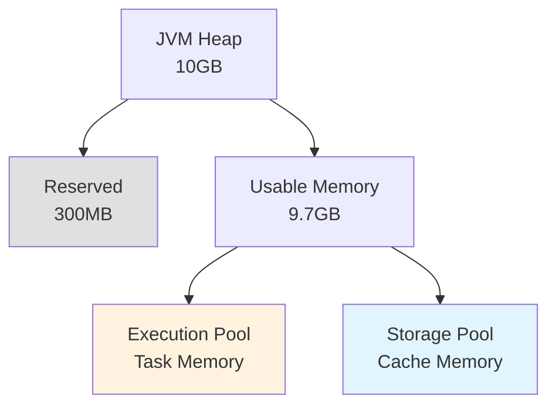

### Memory Division Formula

```
Reserved Memory = 300MB (hardcoded)
Usable Memory = Heap Size - Reserved Memory

Spark Memory = Usable × spark.memory.fraction (default 0.6)
User Memory = Usable × (1 - spark.memory.fraction)

Within Spark Memory:
  Execution (initial) = Spark Memory × (1 - spark.memory.storageFraction)
  Storage (initial) = Spark Memory × spark.memory.storageFraction (default 0.5)
```

**Example with 10GB heap**:
- Reserved: 300MB
- Usable: 9.7GB
- Spark Memory: 9.7GB × 0.6 = 5.82GB
  - Execution: 2.91GB (initial)
  - Storage: 2.91GB (initial)
- User Memory: 3.88GB

### The Dynamic Boundary

Unlike older static splits, the Unified Memory Manager allows the boundary between Execution and Storage to shift:

**Initial State**:
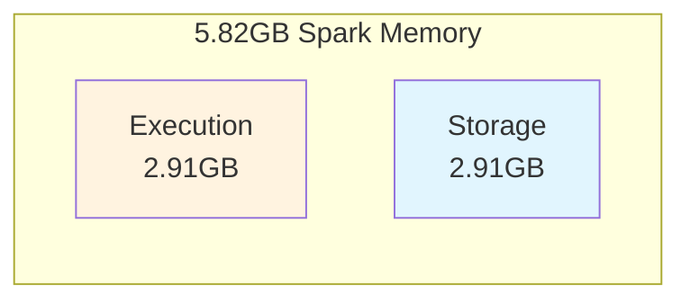

**After Caching 4GB RDD**:
Storage grows by borrowing unused execution memory:
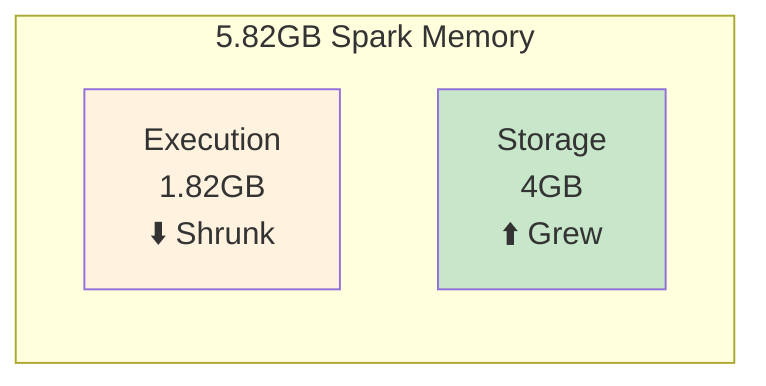

**When Join Needs 4GB**:
Execution evicts cached data to reclaim memory:
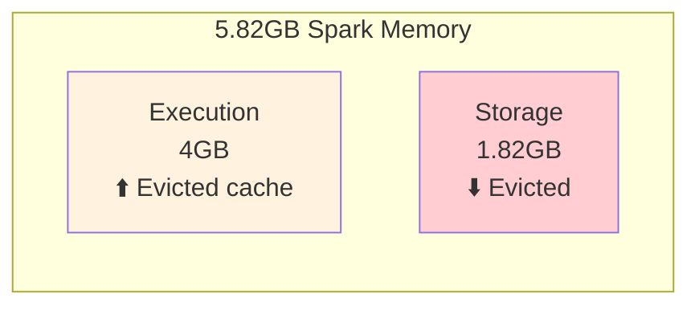

**Critical Rules**:
1. Execution can **always** evict Storage to reclaim memory
2. Storage can **only** borrow unused Execution memory
3. If a task fails due to OOM, the job fails (Execution is critical)
4. If cache is evicted, it can be recomputed (Storage is optional)

---

## 2. On-Heap vs Off-Heap Memory

### Understanding Memory Modes

Spark's memory architecture exists in two distinct modes: on-heap and off-heap. While most users default to on-heap memory, understanding when and why to use off-heap is crucial for scaling Spark applications beyond moderate data sizes.

### On-Heap Memory: The Default Approach

On-heap memory represents the traditional JVM memory model where all data structures exist as Java objects within the heap space managed by the garbage collector. When you allocate a 10GB heap to a Spark executor, this entire space is visible to the JVM's garbage collector.

The garbage collector's role is to identify and reclaim memory occupied by objects no longer in use. To accomplish this, it must periodically scan the heap space, marking live objects and sweeping away dead ones. This scanning process is comprehensive—the GC must examine object references, traverse object graphs, and track memory allocations across the entire heap.

### The Garbage Collection Challenge

Consider a Spark executor processing a large dataset with a 100GB heap. As your application runs, it creates millions of intermediate objects: RDD partitions, cached data structures, shuffle buffers, and temporary computation results. With 50 million objects in memory, each garbage collection cycle must scan this enormous object graph.

Modern JVMs use generational garbage collection, dividing the heap into young and old generations. Minor GC collections handle the young generation frequently and complete quickly—typically under 100ms. However, old generation collections (major GC or full GC) must scan the entire heap, including all 50 million objects and their interconnections. **These full GC pauses can easily exceed 10-30 seconds in large heaps.**

During these pauses, the entire JVM stops. All task threads freeze. No data processing occurs. No shuffle writes complete. No RDD partitions are computed. The executor becomes entirely unresponsive to the Spark scheduler. From the cluster's perspective, the executor appears dead.

When multiple executors pause simultaneously due to GC, the impact compounds. Shuffle operations stall waiting for data. Speculative execution launches redundant tasks on other executors. The job's end-to-end latency increases dramatically, and cluster resources are wasted on pause-induced retries.

**This is why GC pauses matter**: they directly translate to job slowdowns, wasted resources, and unpredictable performance. In production environments processing terabytes of data with strict SLAs, multi-second GC pauses are unacceptable.

### Off-Heap Memory: Bypassing the Garbage Collector

Off-heap memory represents a fundamentally different approach. Instead of allocating Java objects on the JVM heap, Spark allocates raw byte buffers in native OS memory using `sun.misc.Unsafe` APIs. This memory exists outside the JVM's heap space—the garbage collector cannot see it, cannot track it, and most importantly, **cannot pause to scan it**.

When you configure a Spark executor with 30GB on-heap and 70GB off-heap memory, the garbage collector only manages the 30GB heap. The 70GB of off-heap data—potentially containing most of your cached RDDs, shuffle data, and execution buffers—is invisible to GC. This dramatically reduces GC pause times from 10-30 seconds to 1-2 seconds or less.

The trade-off is manual memory management. On-heap memory is automatically managed—create an object, and eventually GC reclaims it. Off-heap memory requires explicit allocation and deallocation. Spark's memory manager handles this carefully, but the potential for memory leaks or segmentation faults (though rare) exists.

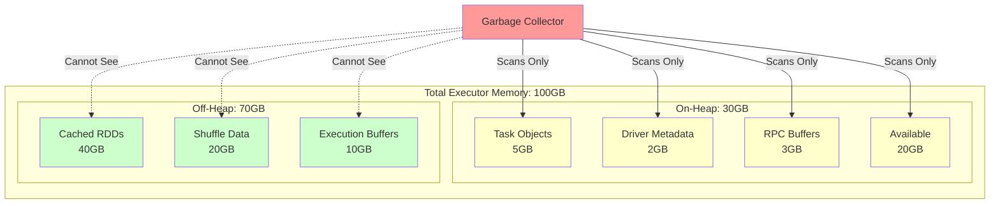

**GC Impact Comparison:**

| Configuration | Heap Size | Objects Scanned | Full GC Pause |
|--------------|-----------|-----------------|---------------|
| **On-Heap Only** | 100GB | ~50M objects | 10-30 seconds |
| **Hybrid (30GB + 70GB Off-Heap)** | 30GB | ~15M objects | 1-2 seconds |

### Off-Heap and the Unified Memory Model

A common misconception is that off-heap memory exists separately from Spark's unified memory management. In reality, **off-heap memory is fully integrated into the unified memory model**.

Recall from Section 1 that unified memory divides Spark's memory pool into Execution and Storage regions that dynamically borrow from each other. This same model applies to off-heap memory:

```
When off-heap is enabled:
  On-Heap Spark Memory = (Heap - 300MB) × spark.memory.fraction
    ├─ On-Heap Execution Pool (dynamic)
    └─ On-Heap Storage Pool (dynamic)
  
  Off-Heap Spark Memory = spark.memory.offHeap.size
    ├─ Off-Heap Execution Pool (dynamic)
    └─ Off-Heap Storage Pool (dynamic)
```

Tasks can request execution memory from either pool. Cached RDDs can reside in either pool. The MemoryManager treats them identically in terms of allocation policies and eviction rules. The only difference is GC visibility.

When you cache an RDD with `MEMORY_ONLY` on a cluster with off-heap enabled, Spark may place some partitions on-heap and others off-heap, dynamically balancing based on availability. The unified memory manager abstracts this complexity.

### What Can Be Stored Off-Heap?

Understanding what Spark stores off-heap is essential for configuration decisions. Off-heap memory exclusively stores **serialized, binary data**—never Java objects. This is a fundamental constraint because native memory cannot hold Java object references.

**Data Types Stored Off-Heap:**

1. **Cached RDD Partitions with Serialized Storage Levels**
   - `MEMORY_ONLY_SER`: Serialized RDD blocks in memory
   - `OFF_HEAP`: Explicitly stored in off-heap memory
   - Data is serialized to bytes using Kryo or Java serialization
   - Example: A 1GB RDD partition becomes a contiguous byte array in native memory

2. **Shuffle Data Buffers**
   - During shuffle write, map-side data is serialized and buffered
   - Shuffle sort operations maintain byte-level pointers in off-heap memory
   - Very effective: shuffle is often the largest memory consumer
   - Eliminates GC pressure during large-scale shuffles

3. **Execution Memory for Operations Requiring Serialization**
   - Sort operations maintain off-heap byte arrays
   - Hash aggregations can use off-heap hash maps (binary format)
   - Join operations buffer serialized records off-heap
   - All operations working with `UnsafeRow` format (Tungsten)

4. **Broadcast Variable Blocks**
   - Broadcasted data can be cached in off-heap memory
   - Particularly beneficial for large broadcast joins
   - Reduces GC pressure from frequently accessed broadcast data

**What CANNOT Be Stored Off-Heap:**

- **Deserialized RDD partitions** (`MEMORY_ONLY`, `MEMORY_AND_DISK`)
  - These are Java objects that must live on-heap
  - Off-heap only accepts serialized byte arrays

- **User code and closures**
  - Task code, lambda functions, and captured variables stay on-heap
  - The JVM must execute this code; cannot exist in native memory

- **Spark internal metadata**
  - RDD lineage graphs, task tracking, scheduler state
  - These are JVM objects required for Spark's operation

- **Driver memory**
  - Off-heap configuration applies only to executors
  - Driver always uses on-heap memory

**Storage Level Decision Matrix:**

| Storage Level | Location | GC Impact | When to Use |
|---------------|----------|-----------|-------------|
| `MEMORY_ONLY` | On-Heap (deserialized) | High | Small datasets, frequent access, GC pauses acceptable |
| `MEMORY_ONLY_SER` | On-Heap (serialized) | Medium | Moderate datasets, willing to trade CPU for memory savings |
| `OFF_HEAP` | Off-Heap (serialized) | **None** | **Large datasets (>10GB), GC pause sensitive, write-once-read-many** |
| `MEMORY_AND_DISK_SER` | Both (serialized) | Low | Very large datasets, spill tolerance |

### Configuration Strategy

Enable off-heap memory when:
- Executor heap size exceeds 40-50GB
- GC pauses observable in Spark UI exceed 5 seconds
- Workload is shuffle-intensive or caches large datasets
- Application can tolerate serialization/deserialization overhead

**Recommended Configuration for 100GB Total Memory:**

```scala
// Give 30GB to on-heap (for objects, metadata, user code)
spark.executor.memory = 30g

// Give 70GB to off-heap (for caches, shuffle data)
spark.memory.offHeap.enabled = true
spark.memory.offHeap.size = 70g

// Use Kryo for efficient serialization
spark.serializer = org.apache.spark.serializer.KryoSerializer
```

**Memory Allocation Result:**
- On-Heap Spark Memory: (30GB - 300MB) × 0.6 = ~17.8GB
  - GC scans only this region → Fast GC
  - Stores small objects, task overhead, metadata
  
- Off-Heap Spark Memory: 70GB
  - GC doesn't see this → Zero GC impact
  - Stores cached RDDs, shuffle blocks, execution buffers
  - Dynamically split between execution/storage

**Trade-offs:**
- ✅ **Benefit**: Eliminates 70GB from GC scanning → 75% reduction in GC work
- ✅ **Benefit**: Predictable, sub-second GC pauses
- ✅ **Benefit**: More stable throughput for long-running jobs
- ❌ **Cost**: Serialization/deserialization CPU overhead when accessing cached data
- ❌ **Cost**: Requires manual tuning; auto-tuning limited
- ❌ **Cost**: Slightly more complex memory debugging (native memory leaks)

---

## 3. Task Memory Management

### TaskMemoryManager

Each task gets its own `TaskMemoryManager` instance to track memory usage.

**Location**: [core/src/main/java/org/apache/spark/memory/TaskMemoryManager.java](file:///Users/anmol.shrivastava/spark-code/spark/core/src/main/java/org/apache/spark/memory/TaskMemoryManager.java)

**Responsibilities**:
1. Request memory from MemoryManager
2. Track allocated pages for this task
3. Release memory when task completes
4. Trigger spilling if memory unavailable

### Memory Acquisition Flow

When a task needs memory (e.g., for a sort buffer), this is the request flow:

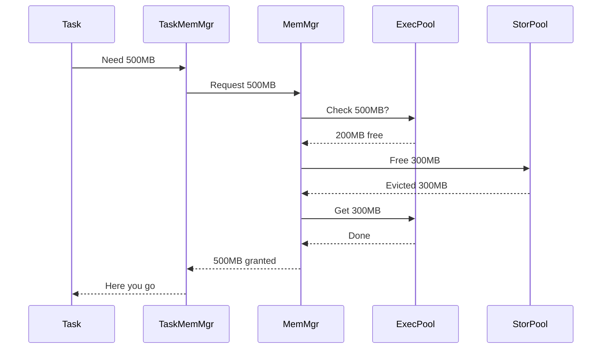

**Key Implementation** ([UnifiedMemoryManager.scala](file:///Users/anmol.shrivastava/spark-code/spark/core/src/main/scala/org/apache/spark/memory/UnifiedMemoryManager.scala)):

```scala
def acquireExecutionMemory(numBytes: Long, taskId: Long): Long = {
  val executionPool = getExecutionPool(memoryMode)
  var acquired = executionPool.acquireMemory(numBytes, taskId)
  
  if (acquired < numBytes) {
    // Try evicting storage
    val storagePool = getStoragePool(memoryMode)
    val evicted = storagePool.freeSpaceToShrinkPool(numBytes - acquired)
    
    // Try again
    acquired += executionPool.acquireMemory(numBytes - acquired, taskId)
  }
  
  acquired  // May be less than requested if eviction insufficient
}
```

**What happens if still not enough?**: Task must spill to disk (see next section).

---

## 4. Spilling: Handling Memory Pressure

### What is Spilling?

When a task cannot acquire enough memory, it **spills** intermediate data to disk. This allows processing unlimited data with limited RAM.

**Example**: Sorting 100GB data with 1GB RAM:
1. Load 1GB into memory
2. Sort in memory
3. Write to disk (spill file 1)
4. Load next 1GB
5. Sort in memory
6. Write to disk (spill file 2)
7. Repeat 100 times
8. Merge all 100 spill files → final sorted output

### Spilling Decision Flow

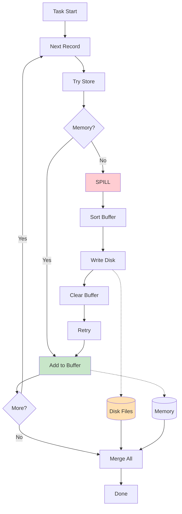

### Code Example: ShuffleExternalSorter

**Location**: `core/src/main/java/org/apache/spark/shuffle/sort/ShuffleExternalSorter.java`

```java
public void insertRecord(Object recordBase, long recordOffset, int length) {
  // Calculate memory needed
  long required = length + 8;  // 8 bytes for pointer
  
  // Try to acquire memory
  long got = taskMemoryManager.acquireExecutionMemory(required);
  
  if (got < required) {
    // Not enough memory! Spill current buffer to disk
    spill();
    
    // Try again (should succeed now that buffer is cleared)
    got = taskMemoryManager.acquireExecutionMemory(required);
  }
  
  // Store record in memory
  inMemSorter.insertRecord(recordBase, recordOffset, length);
}
```

**Configuration**:
```
spark.shuffle.spill = true                    # Enable spilling (default)
spark.shuffle.spill.compress = true           # Compress spilled data
spark.shuffle.spill.batchSize = 10000         # Records per spill batch
```

**Performance Impact**:
- **No spilling**: Fast (all in memory)
- **Some spilling**: Slower (disk I/O cost)
- **Heavy spilling**: Much slower (many disk writes + merge cost)

---

## 5. Serialization: Objects to Bytes

### The Fundamental Problem

Spark must send data over the network (Driver → Executor, Executor → Executor during shuffles). Java objects cannot travel over network - only bytes can.

**Problem Visualization**:
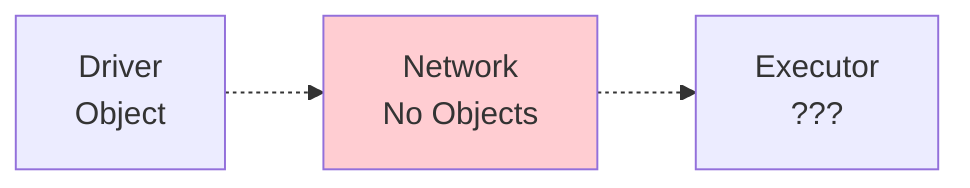

**Solution**: Serialization converts objects → bytes, Deserialization converts bytes → objects:


### Serialization Use Cases in Spark

1. **Task Closures**: Driver serializes task code/data, sends to Executors
2. **Shuffle Data**: Map task serializes output, Reduce task deserializes input
3. **Broadcast Variables**: Driver serializes once, Executors deserialize when needed
4. **RDD Caching**: Serialize RDD partitions to save memory (MEMORY_ONLY_SER)

### Concrete Example: How It Works

**Step 1: Define a Java Class**

```java
public class Person implements Serializable {
    private String name;
    private int age;
    private String city;
    
    public Person(String name, int age, String city) {
        this.name = name;
        this.age = age;
        this.city = city;
    }
}
```

**Step 2: Create an Object on Driver**

```scala
// On Spark Driver
val alice = new Person("Alice", 30, "New York")
// Object in memory: takes ~64 bytes (object header + fields + references)
```

**Step 3: Serialization (Object → Bytes)**

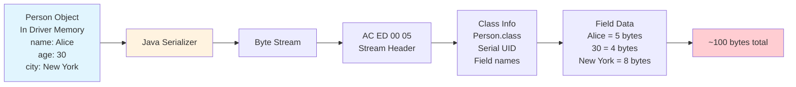

**Serialization Code**:
```java
// Spark does this internally
ByteArrayOutputStream bos = new ByteArrayOutputStream();
ObjectOutputStream oos = new ObjectOutputStream(bos);

oos.writeObject(alice);  // Convert object to bytes
oos.flush();

byte[] serializedBytes = bos.toByteArray();  // ~100 bytes
// Now these bytes can travel over network!
```

**Step 4: Network Transfer**

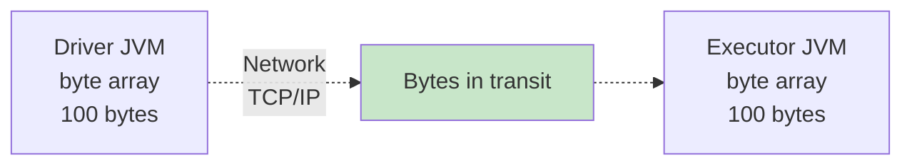

**Step 5: Deserialization (Bytes → Object)**

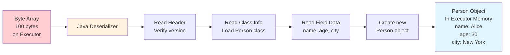

**Deserialization Code**:
```java
// Spark does this on executor
ByteArrayInputStream bis = new ByteArrayInputStream(serializedBytes);
ObjectInputStream ois = new ObjectInputStream(bis);

Person alice = (Person) ois.readObject();  // Reconstruct object from bytes
// Now executor has the exact same Person object as driver!

System.out.println(alice.name);   // "Alice"
System.out.println(alice.age);    // 30
System.out.println(alice.city);   // "New York"
```

**Complete Round-Trip Flow**:

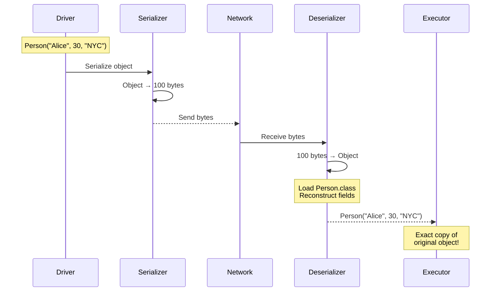

**Why This Matters in Spark**:

1. **Task Distribution**: When you write `rdd.map(x => transform(x))`, Spark serializes the `transform` function and sends it to executors
2. **Shuffle**: During `groupByKey`, each (key, value) pair is serialized, written to disk, transferred over network, then deserialized
3. **Closure Capture**: If your function references a large object (e.g., 10MB lookup table), that entire object gets serialized with every task


## 6. Java vs Kryo Serialization

### Java Serialization (Default)

**How it works**: Uses Java's built-in ObjectOutputStream. Writes full class metadata with every object.

**Format Breakdown** for `Person("Alice", 30)`:
```
Stream Header:        4 bytes
Class Descriptor:
  - Class name:      25 bytes  ("com.example.Person")
  - Serial UID:       8 bytes
  - Field count:      2 bytes
  - Field "name":    15 bytes  (descriptor)
  - Field "age":     12 bytes  (descriptor)
Object Data:
  - name type marker: 1 byte
  - name length:      2 bytes
  - name "Alice":     5 bytes
  - age type marker:  1 byte
  - age value:        4 bytes
-------------------------------------
Total:            ~100 bytes
```

### Kryo Serialization

**How it works**: Registers classes upfront. Only writes class ID + raw field data.

**Format Breakdown** for `Person("Alice", 30)`:
```
Class ID:             2 bytes  (pre-registered)
name length:          1 byte
name "Alice":         5 bytes
age (varint):         1 byte
-------------------------------------
Total:              ~9 bytes
```

### Visual Comparison

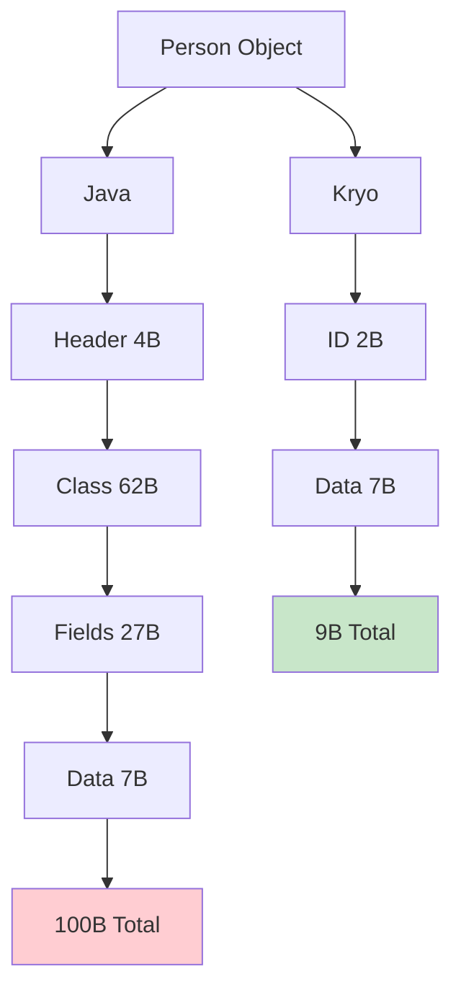

### Performance Impact

**For 1,000,000 Person objects**:

| Metric | Java | Kryo | Improvement |
|:-------|:-----|:-----|:------------|
| **Serialization Time** | 10 seconds | 1 second | **10x faster** |
| **Deserialization Time** | 15 seconds | 1.5 seconds | **10x faster** |
| **Output Size** | 100 MB | 9 MB | **11x smaller** |
| **Network Transfer** (100 Mbps) | 8 seconds | 0.7 seconds | **11x faster** |

**Configuration**:
```scala
// Enable Kryo
spark.serializer = org.apache.spark.serializer.KryoSerializer

// Register classes for best performance
conf.registerKryoClasses(Array(
  classOf[Person],
  classOf[MyDataStructure],
  classOf[scala.collection.mutable.HashMap]
))

// Require registration (fail fast on unregistered classes)
spark.kryo.registrationRequired = true

// Increase buffer for large objects
spark.kryoserializer.buffer.max = 1024m
```

---

## 7. RDD Caching Mechanics

### The Caching Process

When you call `rdd.persist(StorageLevel.MEMORY_ONLY_SER)`, here's the complete flow:

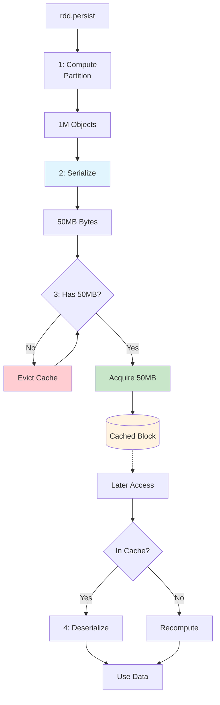

### Storage Levels Explained

| Level | Serialized? | Location | Spill to Disk? | Use Case |
|:------|:------------|:---------|:---------------|:---------|
| **MEMORY_ONLY** | No | On-Heap | No | Fast access, small datasets |
| **MEMORY_ONLY_SER** | Yes | On-Heap | No | Save memory, frequently reused |
| **MEMORY_AND_DISK** | No | On-Heap + Disk | Yes | Avoid recomputation |
| **MEMORY_AND_DISK_SER** | Yes | On-Heap + Disk | Yes | Best for large datasets |
| **OFF_HEAP** | Yes | Off-Heap | No | Very large datasets, avoid GC |

### Memory Comparison: Serialized vs Not

**MEMORY_ONLY** (Store as Objects):
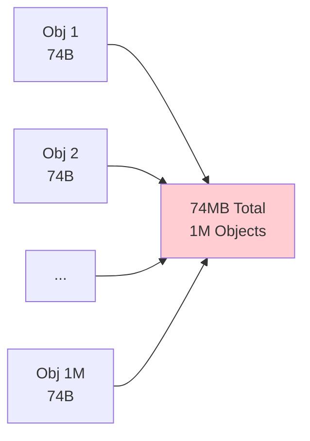

**MEMORY_ONLY_SER** (Store as Bytes):
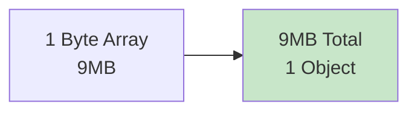

**Key Insights**:
- Serialized: 8x memory savings, but CPU cost to deserialize on each read
- Not Serialized: Fast access, but high GC pressure and memory usage

---

## 8. Broadcast Variables

### The Problem: Closure Serialization

When you reference a large object in a map function, Spark serializes it with **every task**:

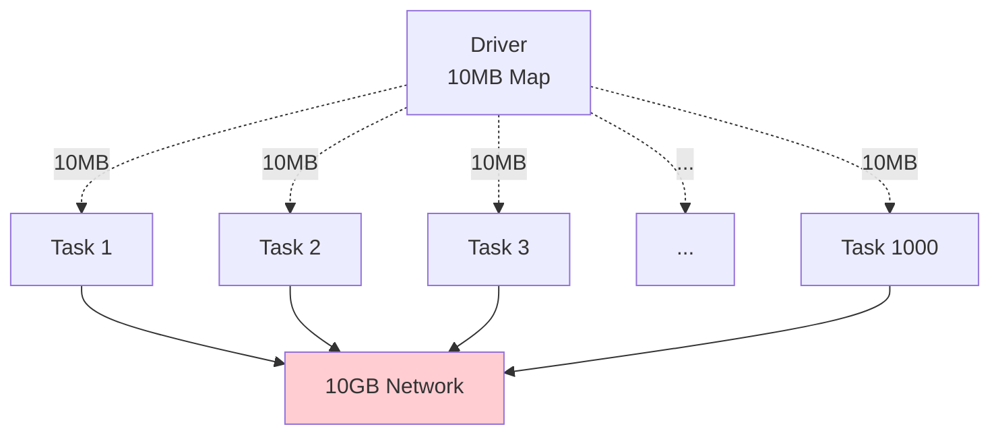

**Problem**: 1000 tasks × 10MB = 10GB network traffic + 10GB executor RAM!

### The Solution: Broadcast Variables

Broadcast once per executor, not per task:

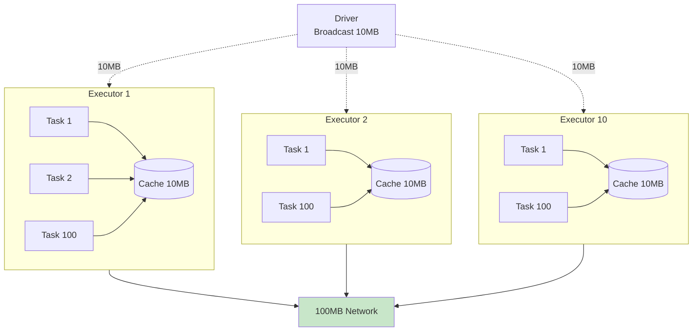

**Savings**: 10GB → 100MB (100x reduction in network + memory!)

### Broadcast Lifecycle

1. **Driver Side** (`TorrentBroadcast.scala`):
   - Serialize the variable once
   - Split into chunks (e.g., 4MB each for large broadcasts)
   - Store chunks in Driver's BlockManager

2. **Executor Side** (First access):
   - Task calls `broadcastVar.value`
   - Executor checks local cache → miss
   - Fetch chunks from Driver via network
   - Reassemble chunks
   - Deserialize once
   - Cache locally in Storage Pool

3. **Executor Side** (Subsequent tasks):
   - Task calls `broadcastVar.value`
   - Executor checks local cache → hit!
   - Return deserialized value (no network, no deserialization)

**Usage**:
```scala
val largeLookup = Map(1 -> "A", 2 -> "B", ..., 1000000 -> "Z")  // 10MB

// BAD: Closure serialization
rdd.map(x => largeLookup.get(x))  // 10MB × 1000 tasks = 10GB!

// GOOD: Broadcast
val bc = sc.broadcast(largeLookup)
rdd.map(x => bc.value.get(x))  // 10MB × 10 executors = 100MB
```

---

## 9. Configuration Tuning

### Memory Pool Tuning

```
# Spark memory as fraction of usable heap (default: 0.6)
spark.memory.fraction = 0.7  
# Increase if tasks need more memory

# Storage fraction within Spark memory (default: 0.5)
spark.memory.storageFraction = 0.3  
# Decrease for shuffle-heavy jobs (more execution memory)
# Increase for cache-heavy jobs (more storage memory)

# Off-heap memory for large heaps
spark.memory.offHeap.enabled = true
spark.memory.offHeap.size = 70g
```

### Serialization Tuning

```
# Use Kryo (10x faster than Java)
spark.serializer = org.apache.spark.serializer.KryoSerializer

# Require registration (fail fast on missing classes)
spark.kryo.registrationRequired = true

# Buffer sizes for large objects
spark.kryoserializer.buffer = 64k        # Initial buffer
spark.kryoserializer.buffer.max = 1024m  # Max buffer
```

### Spilling Tuning

```
# Enable compression (CPU vs I/O tradeoff)
spark.shuffle.spill.compress = true

# Batch size (records per spill)
spark.shuffle.spill.batchSize = 10000  
# Lower = more frequent spills (less memory)
# Higher = fewer spills (more memory needed)
```

---

## 10. Troubleshooting Guide

### OutOfMemoryError During Shuffle

**Symptom**: Tasks fail with OOM

**Diagnosis**:
1. Check Spark UI → Stage → Task Metrics → Memory Spilled to Disk
2. If 0 spilling → execution memory too small
3. If heavy spilling → data skew or inefficient serialization

**Solutions**:
```scala
// Increase executor memory
spark.executor.memory = 8g

// Enable off-heap
spark.memory.offHeap.enabled = true
spark.memory.offHeap.size = 6g

// Use Kryo (reduces serialization memory overhead)
spark.serializer = org.apache.spark.serializer.KryoSerializer
```

### Cached RDDs Constantly Evicted

**Symptom**: Low cache hit rate, frequent recomputation

**Solutions**:
```scala
// Increase storage fraction
spark.memory.storageFraction = 0.7

// Use MEMORY_AND_DISK instead of MEMORY_ONLY
rdd.persist(StorageLevel.MEMORY_AND_DISK_SER)

// Explicitly unpersist unused RDDs
oldRdd.unpersist()
```

### Slow Serialization

**Symptom**: Shuffle write/read time >> compute time

**Solution**:
```scala
// Switch to Kryo
val conf = new SparkConf()
  .set("spark.serializer", "org.apache.spark.serializer.KryoSerializer")
  .registerKryoClasses(Array(
    classOf[MyClass1],
    classOf[MyClass2]
  ))
```

---

## Summary

**Memory Architecture**:
- Unified Memory Manager divides heap into Execution (critical) and Storage (evictable)
- Dynamic boundary allows flexible resource usage
- Off-heap avoids GC pauses for large datasets

**Task Memory**:
- TaskMemoryManager requests memory per task
- If unavailable, evicts cache or spills to disk
- Spilling enables processing unlimited data with limited RAM

**Serialization**:
- Converts objects to bytes for network transfer
- Kryo: 10x faster and smaller than Java
- Used in shuffles, broadcasts, and serialized caching

**Best Practices**:
1. Use Kryo serialization for all production jobs
2. Enable off-heap for executors >50GB heap
3. Cache with MEMORY_AND_DISK_SER for large datasets
4. Broadcast large read-only variables (>1MB)
5. Tune memory fractions based on workload (shuffle-heavy vs cache-heavy)
