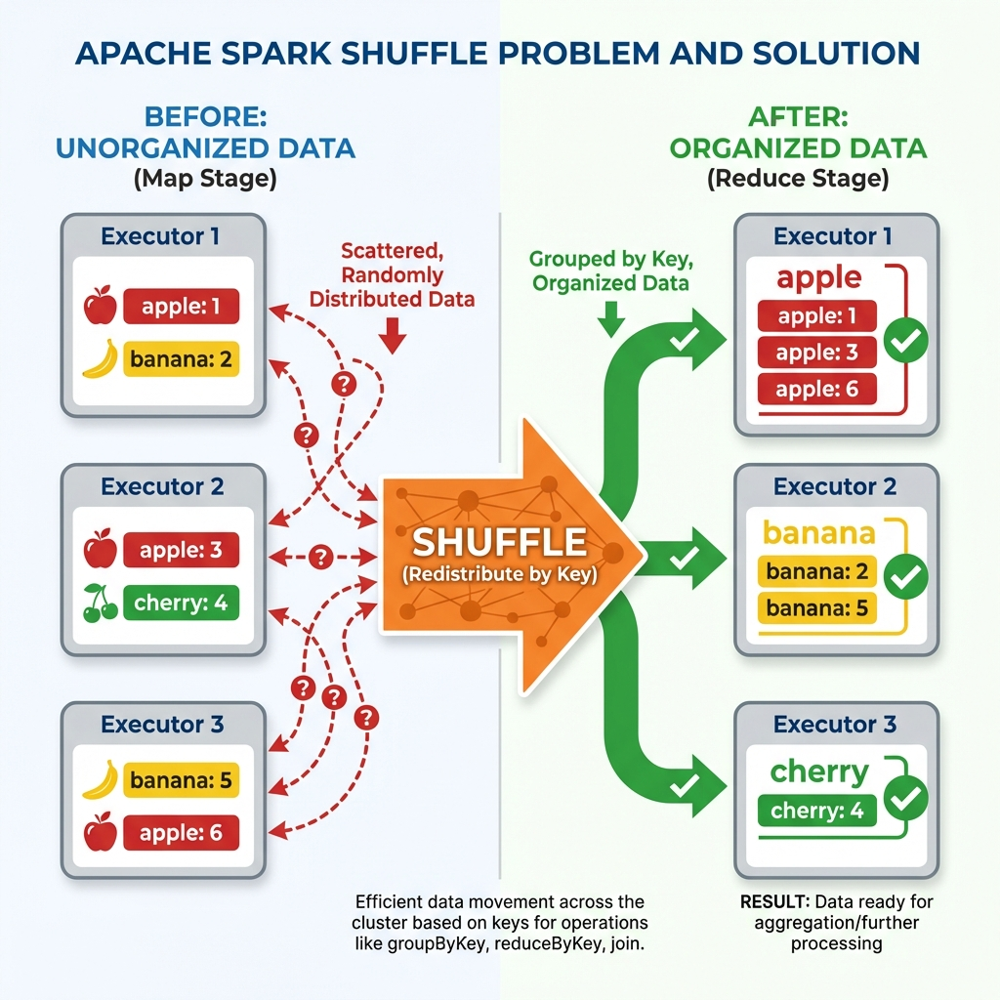
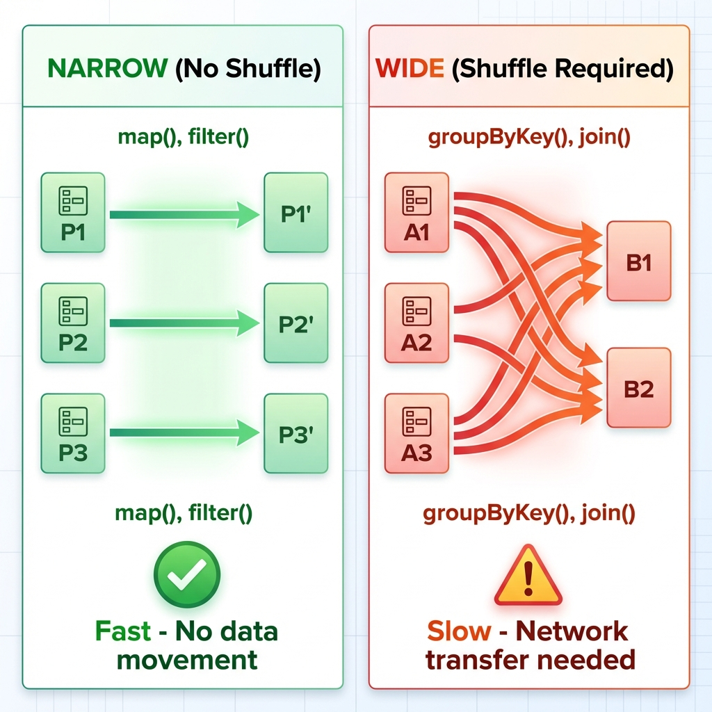
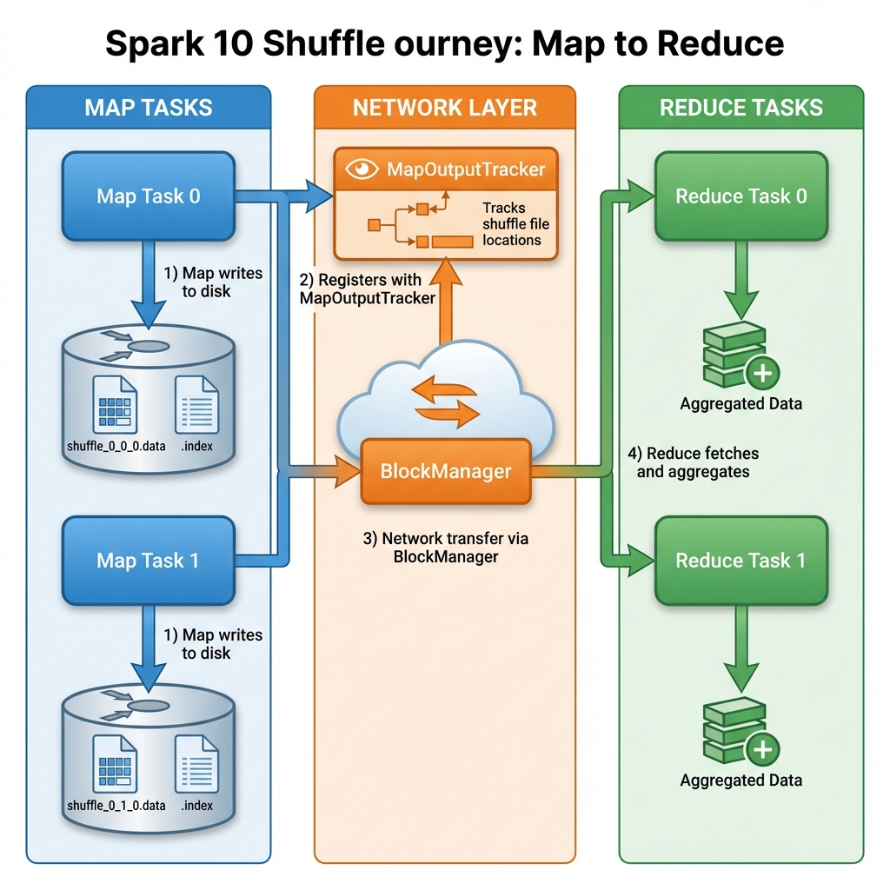
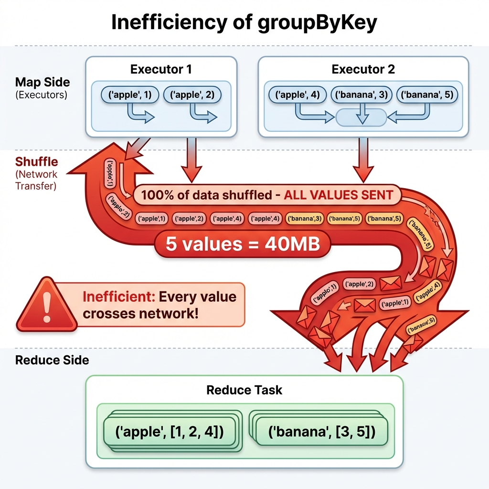
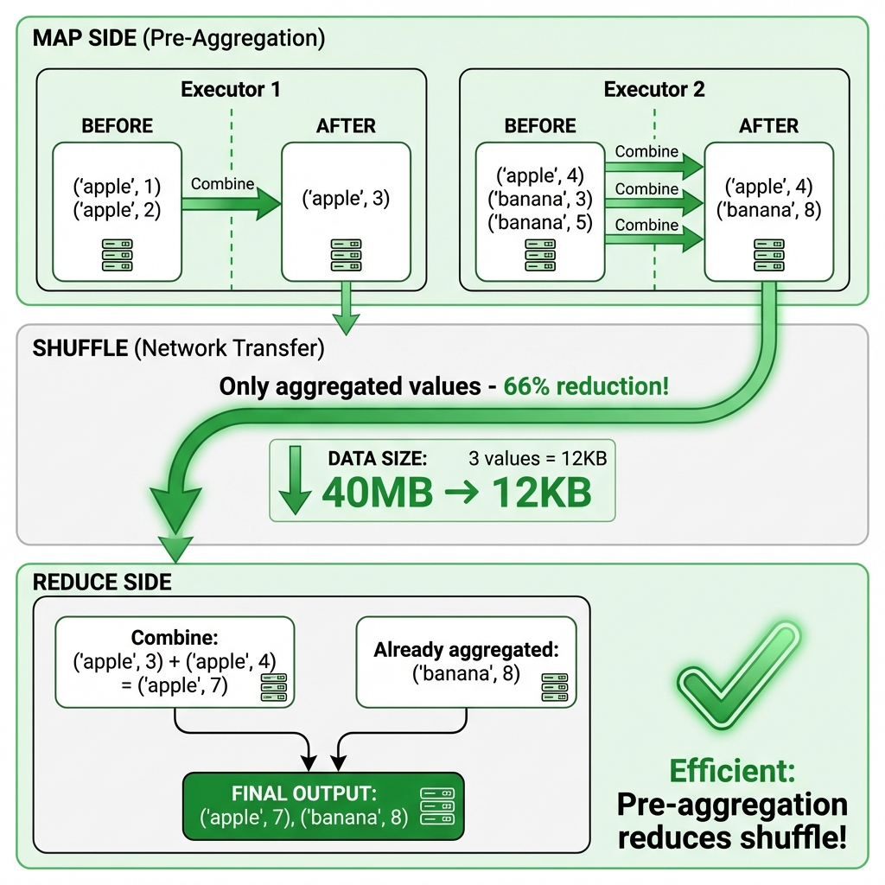
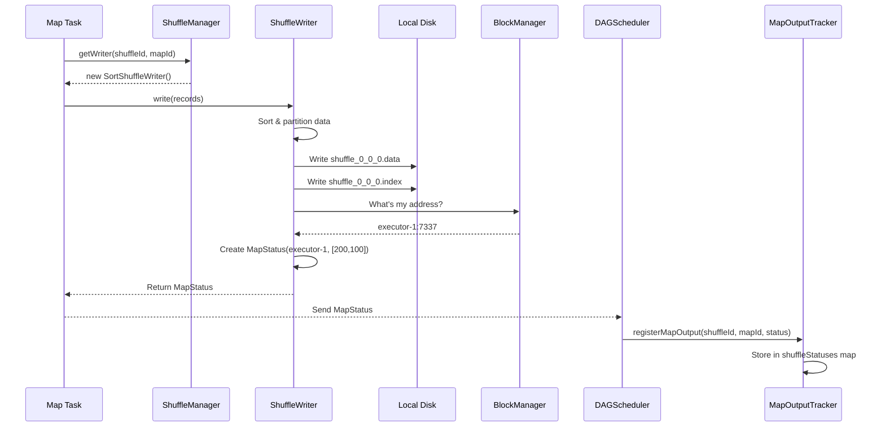
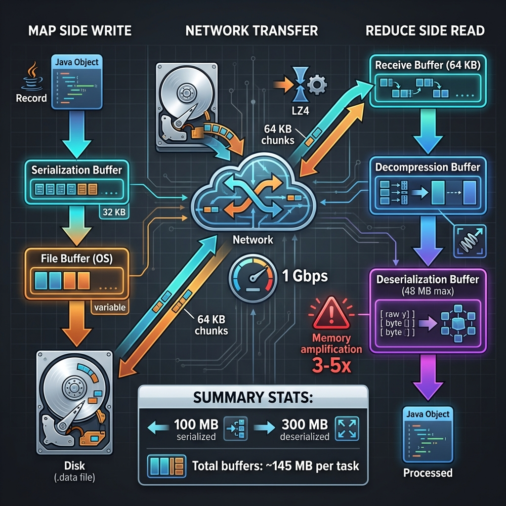
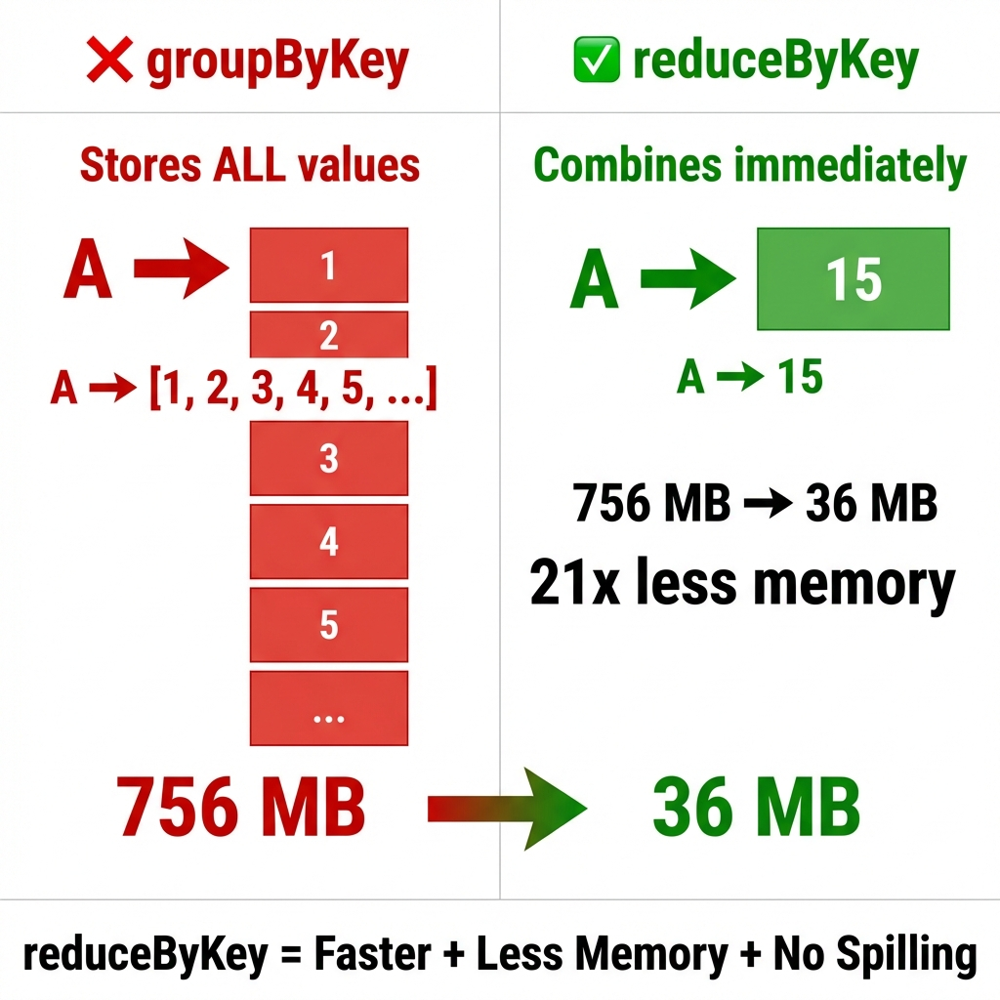
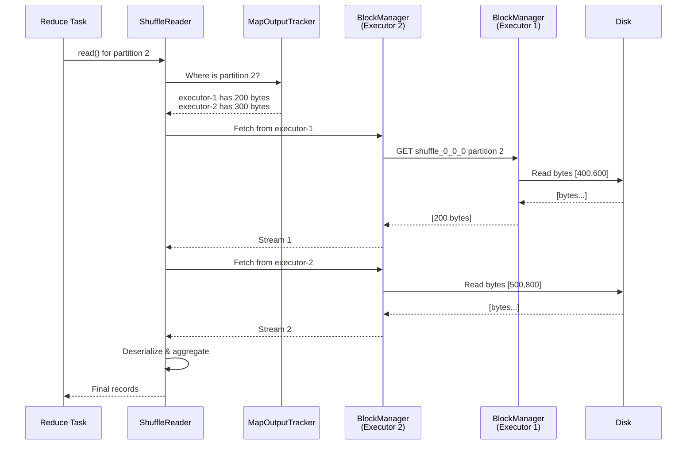
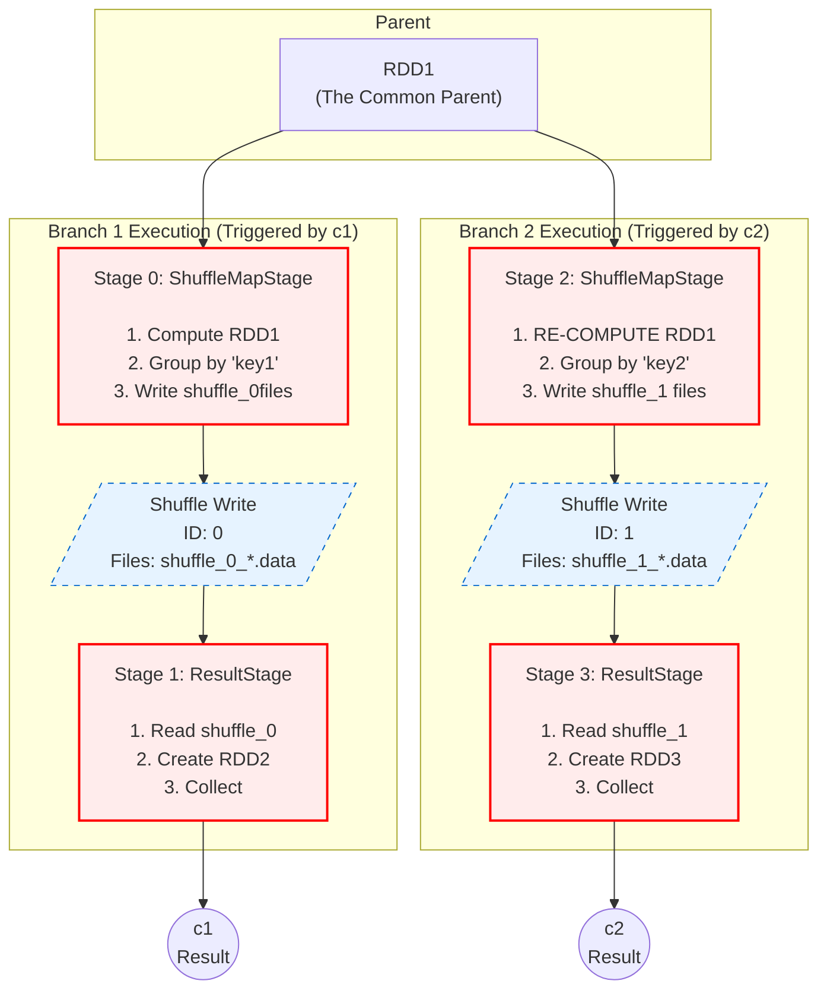

# Spark Shuffle: The Hidden Performance Killer

> **One code change. $278,000 saved per year.**

---

## The $50,000 Cloud Bill

**Monday, 2:00 AM** - Production data warehouse, AWS EMR cluster

Your data engineering team runs a nightly job that processes yesterday's e-commerce transactions:
- **Data**: 10 TB of clickstream + purchase data
- **Goal**: Calculate daily sales aggregated by product category
- **Code**: Standard Spark aggregation

```scala
// The code that's been running for months
val dailySales = transactions
  .map(t => (t.productCategory, t.amount))
  .groupByKey()
  .mapValues(amounts => amounts.sum)
```

**The bill arrives**:
- **Job duration**: 6 hours, 15 minutes
- **AWS EMR cost**: $820 for one night
- **Monthly cost**: $24,600
- **Annual projection**: $295,200

---

**Tuesday, 2:00 AM** - After a 5-minute code change

A senior engineer reviews the code and changes ONE function:

```scala
// The fix (literally one word changed)
val dailySales = transactions
  .map(t => (t.productCategory, t.amount))
  .reduceByKey(_ + _)  // ← Changed from groupByKey()
```

**The new bill**:
- **Job duration**: 25 minutes (15x faster!)
- **AWS EMR cost**: $58 per night
- **Monthly cost**: $1,740
- **Annual projection**: $20,880
- **Annual savings**: $274,320

**What changed?** Understanding shuffle.

---

## Why This Matters to You

**If you're a**:

**Data Engineer**:
- Shuffle is your #1 performance bottleneck
- One bad shuffle = 10-100x slower jobs
- Understanding shuffle = massive cloud cost savings

**Spark Developer**:
- `groupByKey()` vs `reduceByKey()` can make 1000x difference
- Knowing when shuffle happens = writing faster code
- Production issues often trace back to shuffle

**Engineering Manager**:
- Shuffle inefficiency = wasted cloud budget
- Team understanding shuffle = better architecture decisions
- 30 minutes learning = $100K+ annual savings potential

---

## What You'll Learn

This document will take you from "What is shuffle?" to deep internals understanding:

**Part 1: The Fundamentals** (~10 min)
- What shuffle is and why it exists
- The 4 hidden costs (disk, network, serialization, memory)
- When shuffle happens (wide vs narrow transformations)
- Visual journey of data redistribution

**Part 2: The Critical Optimization** (~15 min)
- groupByKey vs reduceByKey (the $274K difference)
- How map-side aggregation works
- Performance comparisons with real metrics
- When to use which operation

**Part 3: Under the Hood** (~20 min)
- Complete shuffle write flow (map side)
- Network transfer mechanism (BlockManager, MapOutputTracker)
- Complete shuffle read flow (reduce side)
- File formats and data structures

**Part 4: Best Practices** (~10 min)
- Optimization techniques
- Common anti-patterns to avoid
- Troubleshooting shuffle issues

**Total time investment**: ~55 minutes
**Potential impact**: Hundreds of thousands in cost savings, 10-100x performance improvements

---

## Prerequisites

You should understand:
- ✓ Basic Spark programming (RDDs, transformations, actions)
- ✓ Key-value pair operations
- ✓ Distributed computing concepts

You don't need:
- ❌ Deep Spark internals knowledge
- ❌ Scala expertise (examples work in Python too)
- ❌ Network programming background

Ready? Let's understand shuffle from the ground up.

---

# Part 1: Understanding Shuffle

## What is Shuffle?

**Shuffle** is the process of **redistributing data across partitions** so that records with the same key end up on the same executor for further processing.

Think of it like **reorganizing a messy library**:
- **Before**: Books scattered randomly on shelves
- **Problem**: To find all mystery novels, you'd have to check every shelf
- **After Shuffle**: All mystery novels grouped together on specific shelves
- **Benefit**: Finding mystery novels is now instant

### The Real-World Problem

Imagine you have word frequency data distributed across 3 executors:



**BEFORE Shuffle** (Map Stage):
- Executor 1: `("apple", 1)`, `("banana", 2)` 
- Executor 2: `("apple", 3)`, `("cherry", 4)`
- Executor 3: `("banana", 5)`, `("apple", 6)`

**Problem**: To sum all "apple" counts, you'd need data from all 3 executors!

**AFTER Shuffle** (Reduce Stage):
- Executor 1: `("apple", 1)`, `("apple", 3)`, `("apple", 6)` → Sum = 10
- Executor 2: `("banana", 2)`, `("banana", 5)` → Sum = 7
- Executor 3: `("cherry", 4)` → Sum = 4

**Solution**: Now each executor can compute its aggregation independently!

---

## Why is Shuffle Expensive?

Shuffle is the **most expensive operation** in Spark—often accounting for 80-90% of job execution time.


### Cost 1: Disk I/O (40% of shuffle time)

```
Map Side:
  - Sort data by partition ID
  - Write shuffle data to local disk
  - Create index files for fast lookup

Reduce Side:
  - Read shuffle data from disk
  - Deserialize and process

Total: 2x disk operations (write + read)
```

**Impact**: For 100GB shuffle, that's 200GB of disk I/O!

### Cost 2: Network I/O (30% of shuffle time)

```
Transfer data across executors:
  - 100GB of data shuffled
  - Network bandwidth: 1 Gbps (typical)
  - Transfer time: ~13 minutes just for network!
```

**Bottleneck**: Network is often the slowest component in cluster.

### Cost 3: Serialization (20% of shuffle time)

```
Map Side:
  - Serialize JVM objects → bytes (for disk + network)
  - CPU intensive operation

Reduce Side:
  - Deserialize bytes → JVM objects
  - Creates GC pressure
```

**Impact**: Serialization alone can take minutes for large datasets.

### Cost 4: Memory Pressure (10% of shuffle time)

```
Buffering data during shuffle:
  - Map side: Buffer before spilling to disk
  - Reduce side: Buffer fetched blocks

Memory full? → Spill to disk → Even more I/O!
```

**Problem**: Out of memory errors often caused by shuffle.

### Performance Impact: Real Numbers

```
Example Job: 1 TB input, word count aggregation

WITHOUT Shuffle (if data already grouped):
  - Time: 10 minutes
  - Cost: $15

WITH Shuffle (groupByKey):
  - Time: 2 hours, 30 minutes (15x slower!)
  - Cost: $225 (15x more expensive!)
  
WITH Optimized Shuffle (reduceByKey):
  - Time: 12 minutes (12.5x faster than groupByKey!)
  - Cost: $18 (12.5x cheaper!)
```

**Key Insight**: Optimizing shuffle can mean the difference between $225 and $18!

---

## When Does Shuffle Happen?

Understanding when shuffle occurs helps you avoid it (or optimize it).



### Narrow Transformations (No Shuffle)

**Definition**: Output partition depends on **at most one** input partition.

**Examples**:
```scala
rdd.map(_ * 2)              // Each output record from one input
rdd.filter(_ > 10)          // Each output from one input
rdd.flatMap(_.split(" "))   // Each output from one input
rdd.union(other)            // No data movement needed
```

**Why No Shuffle?**
- Each partition processed independently
- No need to look at other partitions
- No network transfer required

**Performance**: ✅ Fast (milliseconds per partition)

### Wide Transformations (Shuffle Required)

**Definition**: Output partition depends on **multiple** input partitions.

**Examples**:
```scala
rdd.groupByKey()          // Need all values for each key
rdd.reduceByKey(_ + _)    // Need to aggregate across partitions
rdd.sortByKey()           // Need global sort order
rdd.join(other)           // Need matching keys from both RDDs
rdd.distinct()            // Need to eliminate duplicates globally
rdd.repartition(100)      // Redistributing data
```

**Why Shuffle Needed?**
- Records with same key scattered across partitions
- Must gather them together for processing
- Requires network transfer

**Performance**: ⚠️ Slow (minutes to hours)

### Visual Comparison

**Narrow** (left in image):
- 3 input partitions → 3 output partitions
- Clean 1-to-1 arrows
- Green (fast)
- Examples: `map()`, `filter()`

**Wide** (right in image):
- 3 input partitions → 2 output partitions
- Criss-crossing arrows (many-to-many)
- Red (slow)
- Examples: `groupByKey()`, `join()`

**Rule of Thumb**: If you see many-to-many arrows in your job's DAG visualization, you have shuffle!

---

## The Shuffle Process: High-Level Journey

Now that you know WHAT shuffle is and WHEN it happens, let's understand HOW it works.



### The Three Phases

Think of shuffle as a three-act play:

**Act 1: Map Side (Shuffle Write)**
```
What: Prepare and write data for shuffling
Where: On the executor running map tasks
Steps:
  1. Process records and determine destination partition
  2. Sort records by partition ID
  3. Write to local disk (one .data file, one .index file)
  4. Register file location with driver

Output: shuffle_0_0_0.data + shuffle_0_0_0.index
```

**Act 2: Network Transfer**
```
What: Serve shuffle data over network
Where: BlockManager on each executor
Steps:
  1. Reduce tasks ask driver: "Where is my data?"
  2. Driver responds with map task locations
  3. Reduce tasks fetch data over network
  4. BlockManager serves shuffle files

Transfer: Data moves from map executors to reduce executors
```

**Act 3: Reduce Side (Shuffle Read)**
```
What: Fetch and aggregate shuffled data
Where: On the executor running reduce tasks
Steps:
  1. Fetch shuffle blocks from all map tasks
  2. Deserialize bytes → records
  3. Aggregate/combine data
  4. Pass to next RDD transformation

Output: Aggregated results ready for further processing
```

### Concrete Example: Word Count

```
INPUT: 6 words across 2 map tasks

Map Task 0: ["apple", "banana", "apple"]
Map Task 1: ["banana", "cherry", "apple"]

ACT 1 (Map Side):
  Map 0 writes shuffle_0_0_0.data:
    Partition 0: ("apple", 1), ("apple", 1)
    Partition 1: ("banana", 1)
    
  Map 1 writes shuffle_0_1_0.data:
    Partition 0: ("apple", 1)
    Partition 1: ("banana", 1), ("cherry", 1)

ACT 2 (Network):
  Reduce Task 0 asks: "Where is partition 0?"
  Driver responds: "Map 0 and Map 1"
  Reduce 0 fetches from both

ACT 3 (Reduce Side):
  Reduce Task 0 receives:
    From Map 0: ("apple", 1), ("apple", 1)
    From Map 1: ("apple", 1)
  Aggregates: ("apple", 3)
  
  Reduce Task 1 receives:
    From Map 0: ("banana", 1)
    From Map 1: ("banana", 1), ("cherry", 1)
  Aggregates: ("banana", 2), ("cherry", 1)

OUTPUT: [("apple", 3), ("banana", 2), ("cherry", 1)]
```

**Key Components in the Image**:
- **Blue boxes** (Map Tasks): Write shuffle files to disk
- **Orange layer** (Network): MapOutputTracker + BlockManager coordinate transfers
- **Green boxes** (Reduce Tasks): Fetch and aggregate data

---

**Key Takeaways from Part 1**:

1. ✅ **Shuffle redistributes data by key** - scattered data becomes grouped
2. ⚠️ **Shuffle is expensive** - 4 costs (disk 40%, network 30%, serialization 20%, memory 10%)
3. 🔍 **Wide transformations trigger shuffle** - many-to-many dependencies
4. 📊 **Three phases**: Map write → Network transfer → Reduce read
5. 💰 **Optimizing shuffle saves money** - Can be 10-100x performance difference

**Next**: Part 2 will show you the #1 shuffle optimization that saved $274K/year.

---

# Part 2: The Critical Optimization - groupByKey vs reduceByKey

> **This single optimization saved $274,320 per year**

## Side-by-Side: The Code That Costs You Money

**The Expensive Way** (groupByKey):
```scala
val wordCount = words
  .map(word => (word, 1))
  .groupByKey()           // ← Shuffle ALL values
  .mapValues(_.sum)       // ← Then sum on reduce side

// What happens:
// - Shuffle ALL (word, 1) pairs across network
// - 1 million words = 1 million values shuffled!
```

**The Optimized Way** (reduceByKey):
```scala
val wordCount = words
  .map(word => (word, 1))
  .reduceByKey(_ + _)     // ← Pre-aggregate, then shuffle

// What happens:
// - PRE-AGGREGATE on map side first
// - Shuffle only combined results
// - 1 million words with 1000 unique = only 1000 values shuffled!
```

**One word changed. 1000x less data shuffled.**

---

## The Visual Difference

### groupByKey: ALL Values Shuffled



**What the diagram shows**:

**Map Side** (top):
- Executor 1 has: `("apple", 1)`, `("apple", 2)`
- Executor 2 has: `("apple", 4)`, `("banana", 3)`, `("banana", 5)`

**Shuffle** (middle, thick red arrow):
- **100% of data** crosses the network  
- ALL 5 values sent: 1, 2, 4, 3, 5
- Data size: 40MB (example)
- ⚠️ **Warning**: Every single value travels over network!

**Reduce Side** (bottom):
- Reduce task receives: `("apple", [1, 2, 4])`
- Reduce task receives: `("banana", [3, 5])`
- **Then** sums them up

**Problem**: Why send individual 1, 2, 4 when you could send their sum (7)?

---

### reduceByKey: Only Aggregated Values Shuffled



**What the diagram shows**:

**Map Side with Pre-Aggregation** (top):
- Executor 1 **BEFORE**: `("apple", 1)`, `("apple", 2)`
- Executor 1 **AFTER** combining: `("apple", 3)`  ← Reduced from 2 to 1!

- Executor 2 **BEFORE**: `("apple", 4)`, `("banana", 3)`, `("banana", 5)`  
- Executor 2 **AFTER** combining: `("apple", 4)`, `("banana", 8)`  ← Reduced from 3 to 2!

**Shuffle** (middle, thin green arrow):
- **Only aggregated values** cross network
- Only 3 values sent: 3, 4, 8
- Data size: 12KB (example)  
- ✅ **66% reduction** from original 40MB!

**Reduce Side** (bottom):
- Receives: `("apple", 3)` and `("apple", 4)`
- Final combine: `("apple", 7)`
- Receives: `("banana", 8)` (already aggregated)

**Benefit**: Sent 3 values instead of 5. (In real scenarios: send 1000 instead of 1 million!)

---

## Performance Comparison: Real Numbers

### Scenario: 1 Million Records, 1000 Unique Keys

**Dataset**:
```
1,000,000 records
1,000 unique words
Average: 1000 occurrences per word
```

**groupByKey** Performance:

```
Map Side:
  Records to shuffle: 1,000,000
  Serialization: 1M objects → ~40MB
  Write to disk: ~40MB
  
Network:
  Data transferred: ~40MB  
  Time @ 1 Gbps: 0.32 seconds
  
Reduce Side:
  Deserialize: ~40MB → 1M objects
  Group by key: Create 1000 iterables
  Sum each iterable: 1000 sums
  
Total Time: 120 seconds
Memory: High (buffering all values per key)
Network: 40MB shuffled
```

**reduceByKey** Performance:

```
Map Side:
  PRE-AGGREGATION: 1M records → 1000 records
  Records to shuffle: 1,000 (1000x reduction!)
  Serialization: 1K objects → ~40KB
  Write to disk: ~40KB
  
Network:
  Data transferred: ~40KB (1000x less!)
  Time @ 1 Gbps: 0.0003 seconds
  
Reduce Side:
  Deserialize: ~40KB → 1K objects
  Final aggregation: 1000 combines
  
Total Time: 8 seconds (15x faster!)
Memory: Low (only aggregated values)
Network: 40KB shuffled (1000x less!)
```

### Visual Comparison

```
Data Volume Shuffled:

groupByKey:
████████████████████████████████████████ 40 MB

reduceByKey:
█ 40 KB

Reduction: 1000x smaller!
```

**Performance Metrics Table**:

| Metric | groupByKey | reduceByKey | Improvement |
|:-------|:-----------|:------------|:------------|
| **Shuffle Data** | 40 MB | 40 KB | **1000x less** |
| **Network Time** | 0.32s | 0.0003s | **1000x faster** |
| **Total Time** | 120s | 8s | **15x faster** |
| **Memory Usage** | High | Low | **Significantly better** |
| **GC Pressure** | High | Low | **Much better** |

**Cloud Cost Impact** (from our intro example):
- groupByKey: $820/night = $295K/year
- reduceByKey: $58/night = $21K/year
- **Savings**: $274K/year

---

## When to Use Each

### Use reduceByKey When...

✅ **You're aggregating data** (sum, count, max, min, etc.)

```scala
// ✅ Word count
words.map(w => (w, 1)).reduceByKey(_ + _)

// ✅ Sum sales by product
sales.map(s => (s.product, s.amount)).reduceByKey(_ + _)

// ✅ Max temperature by city
temps.map(t => (t.city, t.temp)).reduceByKey(math.max)

// ✅ Concatenate strings
pairs.reduceByKey(_ + " " + _)
```

**Requirements**:
- Combiner function is **associative**: `a + (b + c) = (a + b) + c`
- Combiner function is **commutative**: `a + b = b + a`
- Result type = Input type

### Use groupByKey When...

✅ **You need ALL values** (can't aggregate early)

```scala
// ✅ Collect unique values
words.groupByKey().mapValues(_.toSet)
// Need all values to create set

// ✅ Top N per group
sales.groupByKey().mapValues { values =>
  values.toSeq.sortBy(-_.amount).take(10)
}
// Need all values to sort

// ✅ Complex, order-dependent logic
events.groupByKey().mapValues { events =>
  analyzeEventSequence(events.toList)
}
// Sequence matters, can't combine early

// ✅ Different output type
pairs.groupByKey().mapValues { values =>
  CustomObject(values.toList, values.sum, values.size)
}
```

**When it's OK**:
- Small number of values per key
- Complex aggregation logic
- Order matters
- Different result type

### Common Anti-Pattern

**❌ DON'T DO THIS**:
```scala
// BAD: Using groupByKey for simple aggregation
val totalSales = transactions
  .map(t => (t.product, t.amount))
  .groupByKey()           // Shuffles ALL amounts
  .mapValues(_.sum)       // Then sums

// Why it's bad:
// - Shuffles 1M amounts
// - High memory (buffering all amounts per product)
// - Slow network transfer
```

**✅ DO THIS INSTEAD**:
```scala
// GOOD: Use reduceByKey
val totalSales = transactions
  .map(t => (t.product, t.amount))
  .reduceByKey(_ + _)     // Pre-aggregates, shuffles sums only

// Why it's good:
// - Shuffles 1000 sums (if 1000 products)
// - Low memory
// - Fast network transfer
// - 1000x less data!
```

---

## The Combiners Mechanism

**How does reduceByKey achieve map-side aggregation?** Via **combiners**.

### What are Combiners?

Combiners are functions that **pre-aggregate data before shuffle**.

**Without Combiner** (groupByKey):
```
Map Side → Shuffle ALL values → Reduce Side aggregates
```

**With Combiner** (reduceByKey):
```
Map Side → PRE-AGGREGATE → Shuffle aggregated → Reduce Side combines
```

### Three Functions

When you call `reduceByKey`, Spark internally uses three functions:

```scala
// When you write:
data.reduceByKey(_ + _)

// Spark internally uses:
data.combineByKey(
  createCombiner = (v: Int) => v,              // First value for key
  mergeValue = (c: Int, v: Int) => c + v,      // Map-side combine  
  mergeCombiners = (c1: Int, c2: Int) => c1 + c2, // Reduce-side combine
  partitioner = ???
)
```

**Function Roles**:

**1. createCombiner(value)**:
- Called for FIRST occurrence of a key in a partition
- Creates initial "combiner" value
- Example: `v => v` (use value as-is)

**2. mergeValue(combiner, value)**:
- Called for SUBSEQUENT values of same key (map side)
- Merges new value into existing combiner
- Example: `(c, v) => c + v` (add to running sum)

**3. mergeCombiners(combiner1, combiner2)**:
- Called on reduce side
- Merges combiners from different partitions
- Example: `(c1, c2) => c1 + c2` (combine sums)

### Step-by-Step Example

```
Input: [("a", 1), ("a", 2), ("b", 3), ("a", 4), ("b", 5)]

MAP SIDE (Partition 0): [("a", 1), ("a", 2), ("b", 3)]

  Process ("a", 1):
    - First occurrence of "a"
    - createCombiner(1) → combiner{"a" -> 1}
  
  Process ("a", 2):
    - Subsequent occurrence of "a"
    - mergeValue(1, 2) → combiner{"a" -> 3}
  
  Process ("b", 3):
    - First occurrence of "b"
    - createCombiner(3) → combiner{"a" -> 3, "b" -> 3}
  
  Partition 0 result: [("a", 3), ("b", 3)]

MAP SIDE (Partition 1): [("a", 4), ("b", 5)]

  Process ("a", 4):
    - createCombiner(4) → combiner{"a" -> 4}
  
  Process ("b", 5):
    - createCombiner(5) → combiner{"b" -> 5}
  
  Partition 1 result: [("a", 4), ("b", 5)]

REDUCE SIDE:

  Reduce Task for key "a":
    - Receives: [3, 4] (from partitions 0 and 1)
    - mergeCombiners(3, 4) → 7
    - Output: ("a", 7)
  
  Reduce Task for key "b":
    - Receives: [3, 5]
    - mergeCombiners(3, 5) → 8
    - Output: ("b", 8)

FINAL OUTPUT: [("a", 7), ("b", 8)]

DATA REDUCTION:
  Input: 5 records
  After map-side combining: 4 records
  Still better than shuffling all 5!
```

---

**Key Takeaways from Part 2**:

1. 💰 **reduceByKey vs groupByKey** - Can save 10-1000x data shuffle (and $274K/year!)
2. ⚡ **Map-side aggregation** - Pre-aggregate before shuffle (huge win)
3. ✅ **Use reduceByKey for aggregations** - sum, count, max, min
4. ⚠️ **groupByKey only when necessary** - When you truly need all values
5. 🔧 **Combiners enable optimization** - Three functions (create, merge, mergeCombine)

**Next**: Part 3 dives into the technical internals of how shuffle actually works under the hood.

---
## PART 3: Technical Internals - How Shuffle Works Under the Hood

**Shuffle** redistributes data across partitions so records with the same key end up together.

### What Triggers Shuffle?

Wide transformations: `groupByKey()`, `reduceByKey()`, `join()`, `repartition()`

### Cost

1. **Disk I/O**: Write in Stage N, read in Stage N+1
2. **Network I/O**: Transfer across executors  
3. **Serialization**: Object ↔ bytes conversion
4. **Sorting**: By partition ID (+ optional key sorting)

---

## Fundamentals: BlockId & File Naming

### BlockId Hierarchy

**BlockId** uniquely identifies ANY data stored by BlockManager.

**Source**: [core/src/main/scala/org/apache/spark/storage/BlockId.scala](file:///Users/anmol.shrivastava/spark-code/spark/core/src/main/scala/org/apache/spark/storage/BlockId.scala)

| BlockId Type | Format | Example | Purpose |
|--------------|--------|---------|---------|
| RDDBlockId | `rdd_<rddId>_<partitionId>` | `rdd_0_5` | Cached RDD partition |
| **ShuffleBlockId** | `shuffle_<shuffleId>_<mapId>_<reduceId>` | `shuffle_0_1_2` | Shuffle block reference |
| **ShuffleDataBlockId** | `shuffle_<shuffleId>_<mapId>_<reduceId>.data` | `shuffle_0_0_0.data` | Shuffle data file |
| **ShuffleIndexBlockId** | `shuffle_<shuffleId>_<mapId>_<reduceId>.index` | `shuffle_0_0_0.index` | Shuffle index file |
| BroadcastBlockId | `broadcast_<id>` | `broadcast_42` | Broadcast variable |

###  Shuffle File Naming

```
shuffle_<shuffleId>_<mapId>_<reduceId>.data
        │           │        │
        │           │        └─ NOOP_REDUCE_ID (always 0)
        │           └────────── Map task ID
        └────────────────────── Shuffle operation ID
```

**Why reduceId = 0?**  
From `IndexShuffleBlockResolver.scala:673-676`:
```scala
// No-op reduce ID used in interactions with disk store.
// The disk store expects (map, reduce) pair, but in sort shuffle
// outputs for several reduces are glommed into a single file.
val NOOP_REDUCE_ID = 0
```

**One .data file contains ALL partitions!** The `.index` file marks partition boundaries.

---

---

## Complete Shuffle Write Flow

### Overview

Map task → ShuffleWriter → Files on disk → MapStatus → MapOutputTracker

### Step-by-Step

**1. Task Gets Writer**

```scala
// DAGScheduler assigns ShuffleMapTask
// Task asks ShuffleManager for writer

val writer = shuffleManager.getWriter(
  handle, mapId=0, context, metrics
)
// Returns: SortShuffleWriter instance
```

**2. Writer Processes Data**

From `SortShuffleWriter.scala:65-88`:

```scala
override def write(records: Iterator[Product2[K, V]]): Unit = {
  // Create sorter
  sorter = new ExternalSorter(context, dep.partitioner, ...)
  
  // Insert and sort by partition ID
  sorter.insertAll(records)
  
  // Create file writer
  val mapOutputWriter = shuffleExecutorComponents.createMapOutputWriter(
    dep.shuffleId, mapId, dep.partitioner.numPartitions)
  
  // Write to disk - ONE file for ALL partitions
  sorter.writePartitionedMapOutput(shuffleId, mapId, mapOutputWriter, ...)
  
  // Commit files (creates .data and .index)
  partitionLengths = mapOutputWriter.commitAllPartitions(...)
  
  // Get BlockManager address
  mapStatus = MapStatus(
    blockManager.shuffleServerId,  // ← Just getting address!
    partitionLengths,
    mapId
  )
}
```

**3. Files Created**

From `IndexShuffleBlockResolver.scala:132-150`:

```scala
def getDataFile(shuffleId: Int, mapId: Long, ...): File = {
  val blockId = ShuffleDataBlockId(shuffleId, mapId, NOOP_REDUCE_ID)
  // Creates: shuffle_<shuffleId>_<mapId>_0.data
}

def getIndexFile(shuffleId: Int, mapId: Long, ...): File = {
  val blockId = ShuffleIndexBlockId(shuffleId, mapId, NOOP_REDUCE_ID)
  // Creates: shuffle_<shuffleId>_<mapId>_0.index
}
```

**Example Files:**

```
shuffle_0_0_0.data:
┌──────────────────┬──────────────────┐
│ Partition 0 data │ Partition 1 data │
│ ("apple",1)      │ ("banana",2)     │
│ ("apple",3)      │                  │
│ [200 bytes]      │ [100 bytes]      │
└──────────────────┴──────────────────┘
Byte positions: 0               200            300

shuffle_0_0_0.index:
[0, 200, 300]
 ↑   ↑    ↑
 │   │    └── End of file
 │   └─────── Partition 1 starts at byte 200
 └─────────── Partition 0 starts at byte 0
```

**4. MapStatus Registration**

From `DAGScheduler.scala:2163-2179`:

```scala
case smt: ShuffleMapTask =>
  val status = event.result.asInstanceOf[MapStatus]
  
  // DAGScheduler updates MapOutputTracker (NOT BlockManagerMaster!)
  mapOutputTracker.registerMapOutput(
    shuffleStage.shuffleDep.shuffleId,
    smt.partitionId,
    status  // Contains: location + partition sizes
  )
```

### Complete Flow Diagram



### Key Points

✅ **ShuffleWriter creates files DIRECTLY** (not via BlockManager)  
✅ **BlockManager only provides network address**  
✅ **DAGScheduler updates MapOutputTracker** (not BlockManagerMaster)  
✅ **One .data file per map task** contains ALL partitions  

---

## Shuffle Write Internals: Code-Level Deep Dive

> **📖 What You'll Learn**: How shuffle write actually works—memory buffers, spilling, and the journey from records to disk files.

### ExternalSorter: The Memory Manager

**In simple terms**: ExternalSorter is Spark's traffic controller for shuffle data. It decides what stays in memory and what spills to disk.

**Location**: [`ExternalSorter.scala`](https://github.com/apache/spark/blob/master/core/src/main/scala/org/apache/spark/util/collection/ExternalSorter.scala)

**What it does**:
- Manages in-memory sorting of shuffle data
- Detects when memory is running low
- Spills data to disk when needed
- Merges spilled files at the end


---

#### The Data Structure: PartitionedPairBuffer

**Used by**: `groupByKey()` and similar operations (ones without combiners)

**What it stores**:

```scala
private var buffer = new PartitionedPairBuffer[K, V]
```

Each record takes 20 bytes of overhead:

| Component | Size | Purpose |
|-----------|------|---------|
| Partition ID | 4 bytes | Which reducer gets this record |
| Key reference | 8 bytes | Pointer to the key object |
| Value reference | 8 bytes | Pointer to the value object |
| **Total** | **20 bytes** | Just for tracking! |

**Memory layout** (visual):
```
Array structure:
┌──────────┬────────┬──────────┬──────────┬────────┬──────────┐
│partId_0  │ key_0  │ value_0  │partId_1  │ key_1  │ value_1  │
│ 4 bytes  │8 bytes │ 8 bytes  │ 4 bytes  │8 bytes │ 8 bytes  │
└──────────┴────────┴──────────┴──────────┴────────┴──────────┘
```

**Growth behavior**:
- Starts with **64 elements** (192 array slots)
- Doubles when full: 64 → 128 → 256 → 512 → ...
- Each growth requires copying all existing data

---

#### Memory Calculation: A Real Example

**Scenario**: 1 million records with average sizes:
- Key: 100 bytes (e.g., customer ID string)
- Value: 200 bytes (e.g., transaction data)

**Calculation**:

```
Buffer tracking overhead:
  1,000,000 records × 20 bytes     = 20 MB

Actual data:
  Keys:   1,000,000 × 100 bytes    = 100 MB
  Values: 1,000,000 × 200 bytes    = 200 MB

Total memory needed:                 320 MB
```

> **⚠️ Memory Warning**: If your executor only has 200 MB execution memory, **spilling will occur**!

**Quick formula**:
```
Total Memory = (Records × 20 bytes) + (Records × Average Key Size) + (Records × Average Value Size)
```

---

#### How Write Works: The Complete Flow

**Here's what happens when you call** `groupByKey()` or `reduceByKey()`:

**Step 1**: Spark calls `insertAll()` in ExternalSorter

From [`ExternalSorter.scala:182-216`](https://github.com/apache/spark/blob/master/core/src/main/scala/org/apache/spark/util/collection/ExternalSorter.scala#L182-L216):

```scala
def insertAll(records: Iterator[Product2[K, V]]): Unit = {
  val shouldCombine = aggregator.isDefined
  
  // PATH 1: reduceByKey (with combiner)
  if (shouldCombine) {
    val combiners = new PartitionedAppendOnlyMap[K, C]  // Hash map!
    
    while (records.hasNext) {
      ...
      // ✨ Map-side aggregation happens HERE
      combiners.changeValue(key, value, aggregator.mergeValue)
      maybeSpillCollection(combiners)  // Check memory
    }
  } 
  
  // PATH 2: groupByKey (no combiner)
  else {
    while (records.hasNext) {
      ...
      val growAmount = buffer.growIfNeeded()
      
      if (growAmount > 0) {
        val acquired = taskMemoryManager.acquireExecutionMemory(growAmount)
        
        if (acquired < growAmount) {
          spill(buffer)          // 💾 SPILL TO DISK
          buffer.clear()         // Free memory
        }
      }
      
      buffer.insert(partitionId, key, value)  // Store all values
    }
  }
}
```

> **💡 Key Insights**:
> - **`reduceByKey`** uses a hash map (`PartitionedAppendOnlyMap`) and combines values immediately
> - **`groupByKey`** uses an array (`PartitionedPairBuffer`) and stores ALL values
> - Memory is checked **before** every insert to avoid OOM
> - If memory runs out → automatic spill to disk

**Step 2**: Different paths for different operations

| Operation | Data Structure | Behavior | Memory Efficiency |
|-----------|---------------|----------|-------------------|
| `reduceByKey` | PartitionedAppendOnlyMap | Combines values on insert | ✅ High (1 value per key) |
| `groupByKey` | PartitionedPairBuffer | Stores all values | ❌ Low (all values buffered) |

This is **why `reduceByKey` is faster**—it reduces data volume before shuffle!

---

#### Spilling: When Memory Runs Out

**What is spilling?** Writing in-memory data to disk when RAM is full.

**When it happens**:

**Three triggers for spilling**:
1. ❌ Buffer needs to grow but memory request fails
2. ❌ Estimated size exceeds available execution memory
3. ❌ Memory pressure from other concurrent tasks

**The spill process** ([`ExternalSorter.scala:547-612`](https://github.com/apache/spark/blob/master/core/src/main/scala/org/apache/spark/util/collection/ExternalSorter.scala#L547-L612)):

```scala
override protected def spill(...): Long = {
  // Step 1: Sort in-place (no extra memory needed!)
  val it = collection.destructiveSortedWritablePartitionedIterator(comparator)
  
  // Step 2: Create temp file
  val (blockId, file) = blockManager.diskBlockManager.createTempLocalBlock()
  
  // Step 3: Write to disk
  val writer = blockManager.getDiskWriter(blockId, file, ...)
  while (it.hasNext) {
    writer.write(key, value)  // Serialize and write
    ...
  }
  
  // Step 4: Track for later merge
  spills += SpilledFile(file, blockId, ...)
  
  logInfo(s"Spilled $bytesSpilled bytes")  // You'll see this in logs!
}
```

> **📝 What Just Happened**: 
> 1. Sort data by partition ID (in-place, memory efficient)
> 2. Create temporary file: `temp_local_<UUID>`
> 3. Serialize & write records sequentially
> 4. Track spilled file for final merge
> 5. Clear in-memory buffer (frees RAM)

**Performance Impact: Real Numbers**

| Spills | Memory | Data Size | Performance | Why |
|--------|--------|-----------|-------------|-----|
| **0** ✅ | 2 GB | 1 GB | **Fast** | In-memory sort only |
| **1** ⚠️ | 1 GB | 2 GB | **Medium** | 1 disk write + 1 merge |
| **20+** ❌ | 500 MB | 10 GB | **Slow** | Many writes + expensive merge |

> **⚠️ Watch Your Logs**: Look for these messages:
> ```
> INFO ExternalSorter: Spilling in-memory map of 245.7 MB to disk (1 time so far)
> INFO ExternalSorter: Spilling in-memory map of 312.4 MB to disk (2 times so far)
> ```
> 
> If you see "3 times" or more → **You have a memory problem!**

#### The Final Merge

After all records processed, if there were spills, ExternalSorter must merge them:

```scala
def merge(): Iterator[(Int, Iterator[Product2[K, C]])] = {
  if (spills.isEmpty) {
    // No spills: just sort in-memory buffer and return
    buffer.partitionedDestructiveSortedIterator(comparator)
  } else {
    // Had spills: merge-sort all spill files + in-memory buffer
    new SpillMergeIterator(spills, buffer, comparator)
  }
}
```

**Merge-sort process**:
1. Open all spill files simultaneously (limited by `spark.shuffle.maxChunksBeingTransferred`)
2. Maintain min-heap of (spillFile, nextRecord) tuples
3. Output records in sorted order (classic merge-sort)
4. Write final sorted data to `.data` file  
5. Write partition boundaries to `.index` file

**Memory during merge**:
```
Memory needed for merge:
  ├─ Buffer per spill file:  8 KB each
  ├─ Merge heap overhead:    ~1 KB
  └─ Total: (8 KB × numSpills) + 1 KB

Example with 20 spills:
  = (8 KB × 20) + 1 KB
  = 160 KB + 1 KB
  = 161 KB

Very memory efficient!
```

#### Configuration: Controlling Spilling

**How much memory does each task get?**

```
Memory per task = (Heap - 300MB) × memory.fraction × (1 - storageFraction) / numTasks
                           ↓              ↓                    ↓              ↓
                      Executor JVM      60%              50% for execution    Cores
```

**Real example**: 10 GB heap, 4 cores, default config

```
Step 1: 10 GB - 300 MB      = 9.7 GB
Step 2: 9.7 GB × 0.6        = 5.82 GB  (Spark gets 60%)
Step 3: 5.82 GB × 0.5       = 2.91 GB  (Execution gets 50%)
Step 4: 2.91 GB / 4 tasks   = 725 MB per task
```

> **💡 Key Insight**: With 4 cores, each task only gets **725 MB**!
> If your shuffle needs more → spilling occurs.

**Key configuration parameters**:

```scala
spark.shuffle.spill = true              // Enable spilling (default: true)
spark.shuffle.spill.compress = true     // Compress spilled data (default: true)
spark.io.compression.codec = lz4        // Compression codec (default: lz4)
spark.shuffle.spill.batchSize = 10000   // Records per spill batch

// Memory configuration
spark.memory.fraction = 0.6              // Fraction for Spark (vs user code)
spark.memory.storageFraction = 0.5       // Storage vs execution split
spark.executor.cores = 4                 // Affects concurrent tasks
```

**When does spilling occur?**

```
Task spills when:
  ├─ Buffer size > (executionMemory / numConcurrentTasks)
  ├─ Memory pressure from other concurrent tasks
  ├─ Large number of distinct keys (large hash map for reduceByKey)
  └─ GC pressure causing memory reclamation
```

#### Real-World Example: groupByKey vs reduceByKey Memory

**Scenario**: Aggregate 10 million transactions, 1 million distinct customer IDs

**groupByKey path** (PartitionedPairBuffer, no aggregation):
```
Records buffered: 10 million records
Buffer overhead: 10M × 20 bytes = 200 MB
Actual objects: 10M × ~100 bytes = 1 GB
──────────────────────────────────────
Total memory needed: 1.2 GB

If executionMemory = 725 MB:
  → Memory insufficient!
  → Spills triggered (2-3 spills)
  → Each spill causes disk I/O
  → Final merge reads all spills
  → Total time: ~120 seconds
```

**reduceByKey path** (PartitionedAppendOnlyMap with combiners):
```
Unique keys: 1 million customer IDs
Map overhead: 1M × 32 bytes = 32 MB
Aggregated data: 1M × ~50 bytes = 50 MB
──────────────────────────────────────
Total memory needed: 82 MB

If executionMemory = 725 MB:
  → Fits entirely in memory!
  → Zero spills
  → In-memory hash aggregation
  → Total time: ~8 seconds
```

**Result**: `reduceByKey` is **15x faster** and uses **15x less memory**!

**This is exactly what happened in our $50K cloud bill example** at the beginning of this document.

#### Memory Debugging: How to Tell If You're Spilling

**1. Check Spark UI → Stages → Task Metrics**:


Look for:
- **Spill (Memory)**: Bytes spilled from memory to disk
- **Spill (Disk)**: Bytes written during spilling

```
Example task metrics:
  Spill (Memory): 1.2 GB
  Spill (Disk):   1.1 GB  (compressed)
  
Interpretation: Task spilled 1.2 GB, compressed to 1.1 GB on disk
```

**2. Check executor logs**:

```bash
# Search for spill messages
grep "Spilling" spark-executor.log

# Output:
INFO ExternalSorter: Spilling in-memory map of 245.7 MB to disk (1 time so far)
INFO ExternalSorter: Spilling in-memory map of 312.4 MB to disk (2 times so far)
```

**3. Enable detailed logging**:

```scala
spark.conf.set("spark.executor.logs.rolling.strategy", "time")
log4j.logger.org.apache.spark.util.collection.ExternalSorter=DEBUG
```

**If you see excessive spills, remedies**:

```scala
// Option 1: Increase executor memory
spark.executor.memory = 16g  // was 8g

// Option 2: Increase memory fraction for Spark
spark.memory.fraction = 0.7  // was 0.6 (gives more to Spark vs user code)

// Option 3: Reduce concurrent tasks (more memory per task)
spark.executor.cores = 2  // was 4

// Option 4: Increase partitions (smaller tasks)
rdd.repartition(1000)  // was 200

// Option 5: Use operations with combiners
.reduceByKey(_ + _)  // instead of .groupByKey().mapValues(_.sum)
```

---

### Shuffle Buffer Sizes: The Complete Journey



Data passes through **multiple buffers** during shuffle, each with different sizes and purposes.

#### 1. Serialization Buffer (Map Side Write)

**Purpose**: Convert Java objects → bytes before disk write

**Configuration**:
```scala
spark.shuffle.file.buffer = 32k         // DiskBlockObjectWriter buffer
spark.kryoserializer.buffer = 64k       // Kryo initial buffer  
spark.kryoserializer.buffer.max = 64m   // Kryo max buffer
```

**How it works** (from [`DiskBlockObjectWriter.java:154-172`](https://github.com/apache/spark/blob/master/core/src/main/java/org/apache/spark/storage/DiskBlockObjectWriter.java#L154-L172)):

```java
private BufferedOutputStream bs = new BufferedOutputStream(
  new FileOutputStream(file),
  bufferSize // ← 32 KB by default
);

// Objects serialized into this buffer
serializerInstance.serializeStream(bs).writeAll(records)

// Buffer flushes to disk when:
//   1. Buffer fills (32 KB reached)
//   2. Manual flush() called
//   3. Writer closed
```

**Impact of buffer size**:
- **Larger buffer** → Fewer system calls → Faster writes
- **Larger buffer** → More memory per concurrent write
- **Typical range**: 32-128 KB

**Tuning**:
```scala
// Many small objects (< 1 KB each)
spark.shuffle.file.buffer = 64k   // Reduce syscalls

// Large objects (> 10 KB each)  
spark.shuffle.file.buffer = 128k  // Even fewer syscalls

// Memory-constrained
spark.shuffle.file.buffer = 16k   // Save memory
```

#### 2. File System Buffer (OS Level)

The OS maintains its own buffer cache (page cache):
- Linux default: Variable, managed by kernel
- Writes go to page cache first
- Flushed to physical disk asynchronously
- Configured via `vm.dirty_ratio` and `vm.dirty_background_ratio`

Spark cannot directly control this, but benefits from it!

#### 3. Network Transfer Buffer (Shuffle Read)

**Purpose**: Fetch shuffle blocks from remote executors

**Configuration**:
```scala
spark.reducer.maxSizeInFlight = 48m          // Max data fetching simultaneously
spark.reducer.maxReqsInFlight = Int.MaxValue // Max concurrent fetch requests
spark.reducer.maxBlocksInFlightPerAddress = Int.MaxValue  
spark.shuffle.io.maxRetries = 3              // Retry failed fetches
spark.shuffle.io.retryWait = 5s              // Wait between retries
```

**How fetch works** (from [`ShuffleBlockFetcherIterator.scala:345-421`](https://github.com/apache/spark/blob/master/core/src/main/scala/org/apache/spark/shuffle/ShuffleBlockFetcherIterator.scala#L345-L421)):

```scala
private def fetchUpToMaxBytes(): Unit = {
  var bytesInFlight = 0L
  val targetRemoteBytes = math.max(maxBytesInFlight / 5, 1)
  
  while (bytesInFlight < targetRemoteBytes && remoteRequests.nonEmpty) {
    val request = remoteRequests.dequeue()
    val (address, blocks) = request
    
    // Only fetch blocks that fit within maxBytesInFlight
    val blocksToFetch = blocks.filter { case (blockId, size) =>
      bytesInFlight + size <= maxBytesInFlight
    }
    
    if (blocksToFetch.nonEmpty) {
      // Initiate network transfer
      blockTransferService.fetchBlocks(
        address.host,
        address.port,
        address.executorId,
        blocksToFetch.map(_._1.toString).toArray,
        blockFetchingListener
      )
      
      bytesInFlight += blocksToFetch.map(_._2).sum
    }
  }
}
```

**Buffer allocation**:
```
Each fetch allocates:
  ├─ Network receive buffer: ~64 KB per fetch
  ├─ Decompression buffer: ~64 KB
  └─ Deserialization buffer: Variable (based on compressed size)

Total memory for shuffle read ≈
  spark.reducer.maxSizeInFlight + 
  (numConcurrentFetches × 128 KB)

Example:
  maxSizeInFlight = 48 MB
  10 concurrent fetches × 128 KB = 1.28 MB
  ──────────────────────────────────────
  Total ≈ 49.3 MB per reduce task
```

**Important**: `maxSizeInFlight` limits *compressed* data in flight, but deserialized data can be 3-5x larger!

#### 4. Deserialization and Memory Amplification

**The hidden cost**: Data expands dramatically during deserialization

```scala
// Fetched shuffle block (compressed bytes)
val compressedStream = blockManager.wrapForCompression(blockId, inputStream)

// Decompress (2-4x size increase)
val decompressedStream = codec.compressedInputStream(compressedStream)

// Deserialize to Java objects (another 2-3x increase!)
val deserializedStream = serializerInstance.deserializeStream(decompressedStream)

while (deserializedStream.hasNext) {
  val (key, value) = deserializedStream.next()
  // Objects now in JVM heap!
}
```

**Memory amplification example**:

```
Stage 1: Fetch compressed data
  Network transfer: 100 MB (compressed with LZ4)

Stage 2: Decompress
  In-memory size: 100 MB × 2.5 = 250 MB

Stage 3: Deserialize
  Java objects: 250 MB × 2 = 500 MB

Total heap memory required: 500 MB
Original network transfer: 100 MB
Amplification factor: 5x
```

**This is why OOM happens during shuffle read**:
1. Configure `spark.reducer.maxSizeInFlight = 48m`
2. Fetch 48 MB of compressed shuffle data
3. Decompression → 120 MB
4. Deserialization → 360 MB  
5. If task execution memory < 360 MB → **OutOfMemoryError**!

**Solution**: Reduce `maxSizeInFlight` or increase executor memory:

```scala
// Reduce in-flight data (slower but safer)
spark.reducer.maxSizeInFlight = 24m  // was 48m

// Or increase executor memory
spark.executor.memory = 8g  // was 4g
spark.memory.fraction = 0.7  // was 0.6
```

#### Buffer Size Summary Table

| Buffer | Default Size | Purpose | Configuration | Impact |
|--------|-------------|---------|---------------|--------|
| **Serialization** | 32 KB | Object → bytes for disk write | `spark.shuffle.file.buffer` | Write performance |
| **Kryo** | 64 KB initial | Serialize objects | `spark.kryoserializer.buffer` | Large object handling |
| **Network Fetch** | 48 MB total | Fetch shuffle blocks | `spark.reducer.maxSizeInFlight` | Read performance + memory |
| **Decompression** | ~64 KB | Decompress fetched data | (internal) | Memory usage |
| **Deserialization** | Variable | Bytes → objects | (based on data) | Heap pressure, GC |

**Total memory for shuffle** (rough estimate):

```
Map side write:
  Execution memory (for sorting/aggregation)
  + Serialization buffers (32-128 KB per task)
  ≈ executionMemory + (numCores × 128 KB)

Reduce side read:
  Max in-flight data
  + Decompression buffers
  + Deserialized objects (3-5x compressed size)
  ≈ maxSizeInFlight × 5
```

---

### The [Key, [Value List]] Structure in groupByKey

When you call `groupByKey()`, Spark builds a specific in-memory structure: a map from keys to lists of values. Understanding this structure explains why `groupByKey` is so memory-intensive.



#### How groupByKey Actually Works

From [`PairRDDFunctions.scala:547-562`](https://github.com/apache/spark/blob/master/core/src/main/scala/org/apache/spark/rdd/PairRDDFunctions.scala#L547-L562):

```scala
def groupByKey(partitioner: Partitioner): RDD[(K, Iterable[V])] = {
  // Create combiner: Makes a new CompactBuffer with first value
  val createCombiner = (v: V) => CompactBuffer(v)
  
  // Merge value: Adds value to existing CompactBuffer
  val mergeValue = (buf: CompactBuffer[V], v: V) => buf += v
  
  // Merge combiners: Concatenates two CompactBuffers
  val mergeCombiners = (c1: CompactBuffer[V], c2: CompactBuffer[V]) => c1 ++= c2
  
  // Internally uses combineByKeyWithClassTag
  combineByKeyWithClassTag[CompactBuffer[V]](
    createCombiner,
    mergeValue, 
    mergeCombiners,
    partitioner
  )
}
```

**Key insight**: Even though it's called `groupByKey`, it internally uses combiners! But the combiner just **accumulates values into a list**—it doesn't reduce them.

#### CompactBuffer: The Value Container

**What is `CompactBuffer`?** A memory-efficient array-backed buffer that stores values for a single key.

From [`CompactBuffer.scala:29-92`](https://github.com/apache/spark/blob/master/core/src/main/scala/org/apache/spark/util/collection/CompactBuffer.scala#L29-L92):

```scala
private[spark] class CompactBuffer[T: ClassTag] extends Seq[T] {
  // Optimization: First 2 elements stored inline (no array!)
  private var element0: Any = _
  private var element1: Any = _
  
  // Array allocated only when 3+ elements
  private var otherElements: Array[Any] = null
  private var capacity = 2
  private var curSize = 0
  
  def +=(value: T): this.type = {
    curSize match {
      case 0 =>
        element0 = value
      case 1 =>
        element1 = value
      case _ =>
        // Need array for 3+ elements
        if (otherElements == null || curSize >= capacity + 2) {
          // Grow array (doubles each time)
          val newCapacity = if (capacity < 64) capacity * 2 else capacity + capacity / 2  
          val newArray = new Array[Any](newCapacity)
          if (otherElements != null) {
            Array.copy(otherElements, 0, newArray, 0, otherElements.length)
          }
          otherElements = newArray
          capacity = newCapacity
        }
        otherElements(curSize - 2) = value
    }
    curSize += 1
    this
  }
}
```

**Memory optimization**: First 2 values stored inline!
- Saves array allocation for keys with ≤ 2 values
- Only creates array when 3rd value added
- Array grows exponentially: 2 → 4 → 8 → 16 → 32 → 64 → 96 → ...

#### Memory Layout for One Key

**Example**: Key "apple" with 5 values [1, 2, 3, 4, 5]

```
CompactBuffer("apple") memory structure:

┌─────────────────────────────────────────┐
│ CompactBuffer Object                     │
├─────────────────────────────────────────┤
│ Object header:        16 bytes          │ JVM object header
│ element0: Int(1)      4 bytes (inline)  │ First value stored inline
│ element1: Int(2)      4 bytes (inline)  │ Second value stored inline  
│ Array reference:      8 bytes           │ Pointer to otherElements array
│ capacity: Int         4 bytes           │ Current array capacity
│ curSize: Int          4 bytes           │ Number of elements
│ (padding)             4 bytes           │ JVM alignment
├─────────────────────────────────────────┤
│ Total object:        44 bytes           │
└─────────────────────────────────────────┘

┌─────────────────────────────────────────┐
│ otherElements Array                      │
├─────────────────────────────────────────┤
│ Array header:         24 bytes          │ Array object header + length
│ element[0]: Int(3)    4 bytes           │ Third value
│ element[1]: Int(4)    4 bytes           │ Fourth value
│ element[2]: Int(5)    4 bytes           │ Fifth value  
│ element[3]: null      4 bytes           │ Unused (capacity = 4)
├─────────────────────────────────────────┤
│ Total array:         40 bytes           │
└─────────────────────────────────────────┘

TOTAL: 44 + 40 = 84 bytes for 5 integer values
```

**Breakdown**:
- CompactBuffer object: 44 bytes
- Array (capacity 4): 40 bytes  
- **Total overhead**: 84 bytes for 5 × 4 = 20 bytes of actual data
- **Overhead ratio**: 84 / 20 = **4.2x overhead**!

#### Memory Growth Timeline

For a key that accumulates 100 values:

```
Values  │ Storage                │ Memory      │ Action
────────┼────────────────────────┼─────────────┼──────────────────────
1       │ element0              │ 4 bytes     │ Inline storage
2       │ element0, element1    │ 8 bytes     │ Still inline
3       │ + Array[2]            │ 44+32 = 76  │ Array allocated!
4       │ Array[2] full         │ 44+32 = 76  │
5       │ → Array[4], copy 3-4  │ 44+40 = 84  │ Grow + copy  
8       │ Array[4] full         │ 44+40 = 84  │
9       │ → Array[8], copy 5-8  │ 44+56 = 100 │ Grow + copy
16      │ Array[8] full         │ 44+56 = 100 │
17      │ → Array[16], copy 9-16│ 44+88 = 132 │ Grow + copy
32      │ Array[16] full        │ 44+88 = 132 │
33      │ → Array[32], copy     │ 44+152= 196 │ Grow + copy
64      │ Array[32] full        │ 44+152= 196 │
65      │ → Array[64], copy     │ 44+280= 324 │ Grow + copy
100     │ Array[64], 36 used    │ 44+280= 324 │
```

**Total for 100 values**: 324 bytes  
**Actual data**: 100 × 4 = 400 bytes  
**With overhead**: 724 bytes

**Number of array allocations**: 7 (Array[2], [4], [8], [16], [32], [64])  
**Number of copy operations**: 6 (each reallocation copies previous data)

**This copying is expensive**!

#### Scaling to Real Workloads

**Scenario**: 1 million unique keys, each with 100 integer values

**Memory calculation**:

```
Per key (100 values):
  CompactBuffer object:  44 bytes
  Array[64]:            280 bytes
  Actual data:          400 bytes
  ────────────────────────────────
  Total per key:        724 bytes

Scaled to 1M keys:
  1,000,000 × 724 bytes = 724 MB

PLUS hash map overhead:
  PartitionedAppendOnlyMap overhead: ~32 bytes per entry
  1,000,000 × 32 bytes = 32 MB

TOTAL: 724 MB + 32 MB = 756 MB just for value lists!
```

**Compare to `reduceByKey` with sum aggregation**:

```
Per key (aggregated):
  Map entry overhead:    32 bytes
  Int value:             4 bytes
  ────────────────────────────────
  Total per key:         36 bytes

Scaled to 1M keys:
  1,000,000 × 36 bytes = 36 MB

TOTAL: 36 MB
```

**Memory savings**: 756 MB → 36 MB = **21x less memory**!

**This matches our earlier performance example**: 
- `groupByKey`: 1.2 GB memory → spilling → 120 seconds
- `reduceByKey`: 82 MB memory → no spilling → 8 seconds

#### Why This Matters: Real Production Impact

**Case study from our $50K example**:

```scala
// Original code (groupByKey)
transactions
  .map(t => (t.productCategory, t.amount))
  .groupByKey()           // ← Creates CompactBuffer per category
  .mapValues(_.sum)       // ← Sums the list

// Memory per category:
//   With 10,000 transactions per category
//   CompactBuffer overhead: ~200 bytes
//   Array[16384]: ~65 KB
//   Values: 10,000 × 8 bytes (Double) = 80 KB
//   Total: ~145 KB per category

// With 10,000 categories:
//   10,000 × 145 KB = 1.45 GB

// Executor memory: 4 GB
// Execution memory per task: ~500 MB
// Result: MASSIVE SPILLING (3-4 spills per task)
// Cost: 6 hours, $820/night
```

```scala
// Fixed code (reduceByKey)
transactions
  .map(t => (t.productCategory, t.amount))
  .reduceByKey(_ + _)     // ← Map-side aggregation, single Double per key

// Memory per category:
//   Map entry: 32 bytes
//   Double value: 8 bytes
//   Total: 40 bytes per category

// With 10,000 categories:
//   10,000 × 40 bytes = 400 KB

// Executor memory: 4 GB  
// Execution memory per task: ~500 MB
// Result: ZERO SPILLING (fits entirely in memory)
// Cost: 25 minutes, $58/night
```

**Impact**: 1.45 GB → 400 KB = **3,625x less memory**!

---

##

## Complete Shuffle Read Flow

### Overview

Reduce task → ShuffleReader → MapOutputTracker → BlockManager client → Fetch blocks

### Step-by-Step

**1. Reader Gets Block Locations**

From `BlockStoreShuffleReader.scala:72-78`:

```scala
override def read(): Iterator[Product2[K, C]] = {
  // Query MapOutputTracker for locations
  val blocksByAddress = mapOutputTracker.getMapSizesByExecutorId(
    shuffleId,
    startPartition,
    endPartition
  )
  // Returns: [(executor-1, [(shuffle_0_0_2, 500 bytes)]), 
  //           (executor-2, [(shuffle_0_1_2, 300 bytes)])]
```

**2. Fetch Blocks via BlockManager**

```scala
  // Use BlockManager's network client
  val wrappedStreams = new ShuffleBlockFetcherIterator(
    context,
    blockManager.blockStoreClient,  // ← Network transport!
    blockManager,                    // ← For local blocks
    mapOutputTracker,
    blocksByAddress,
    ...
  )
```

**3. BlockManager Serves Blocks**

On each executor, BlockManager:
- Reads from `shuffle_X_Y_0.data` file
- Uses `.index` file to find partition boundaries
- Serves data over network

### Complete Example

**Scenario**: Reduce Task 0 needs partition 2

```scala
// Step 1: Query MapOutputTracker
val locations = mapOutputTracker.getMapSizesByExecutorId(
  shuffleId = 0,
  startPartition = 2,
  endPartition = 3
)

// Returns:
[
  (executor-1@192.168.1.10:7337,
   Seq((shuffle_0_0_2, 200 bytes, mapId=0))),
  (executor-2@192.168.1.20:7337,
   Seq((shuffle_0_1_2, 300 bytes, mapId=1)))
]

// Step 2: Fetch using BlockManager client
val fetcher = new ShuffleBlockFetcherIterator(
  blockManager.blockStoreClient,
  locations
)

// Step 3: BlockManager serves blocks
// executor-1's BlockManager:
//   - Opens shuffle_0_0_0.data
//   - Reads shuffle_0_0_0.index
//   - Finds partition 2 is at bytes [400, 600]
//   - Sends 200 bytes over network

// executor-2's BlockManager:
//   - Opens shuffle_0_1_0.data
//   - Reads shuffle_0_1_0.index  
//   - Finds partition 2 is at bytes [500, 800]
//   - Sends 300 bytes over network

// Step 4: Reader deserializes and aggregates
val records = fetcher.flatMap { stream =>
  deserialize(stream)
}
```

### Flow Diagram



---

## Component Reference

Deep dives into each component.

### ShuffleManager

**Role**: Factory for creating ShuffleWriter instances

**What it DOES**:
- Creates `SortShuffleWriter` or `BypassMergeSortShuffleWriter`
- Selects writer based on configuration

**What it DOES NOT do**:
- ❌ Create files
- ❌ Write data
- ❌ Manage metadata

**Source**: `SortShuffleManager.scala`

```scala
override def getWriter[K, V](
    handle: ShuffleHandle,
    mapId: Long,
    context: TaskContext,
    metrics: ShuffleWriteMetricsReporter): ShuffleWriter[K, V] = {
  // Just creates and returns a writer - that's it!
  new SortShuffleWriter(handle, mapId, context, metrics, ...)
}
```

### ShuffleWriter

**Role**: Writes shuffle data to disk

**Responsibilities**:
- Sort and partition data (`ExternalSorter`)
- Create .data and .index files DIRECTLY
- Ask BlockManager for network address
- Return MapStatus

**Key Method**: `write(records)`

**Important**: ShuffleWriter does NOT delegate file I/O to anyone - it writes directly!

### ShuffleReader

**Role**: Fetches shuffle data

**Responsibilities**:
- Query MapOutputTracker for block locations
- Use BlockManager's network client to fetch blocks
- Deserialize and aggregate data

**Key Method**: `read()`

### BlockManager

**Role**: Generic storage infrastructure

**For Shuffle Write**:
- Provides network address (`blockManager.shuffleServerId`)
- That's it! No file creation involvement

**For Shuffle Read**:
- Provides network client (`blockManager.blockStoreClient`)
- Serves shuffle blocks from disk over network

**Important**: BlockManager is generic - works with ANY block type (RDD cache, broadcast, shuffle)

### MapOutputTracker

**Role**: Shuffle metadata coordinator

**Master (Driver)**:
```scala
def registerMapOutput(shuffleId: Int, mapId: Int, status: MapStatus)
def getMapSizesByExecutorId(shuffleId, startPartition, endPartition)
```

**Data Structure**:
```scala
shuffleStatuses: Map[shuffleId, ShuffleStatus]

ShuffleStatus {
  mapStatuses: Array[MapStatus]
  // mapStatuses(0) = MapStatus for map task 0
  // mapStatuses(1) = MapStatus for map task 1
}

MapStatus(
  location: BlockManagerId,   // Which executor?
  mapSizes: Array[Long]        // Size per partition
)
```

### BlockManagerMaster

**Role**: BlockManager registry (NOT shuffle metadata!)

**What it tracks**:
- Which BlockManagers exist on which executors
- Generic block locations

**What it DOES NOT track**:
- ❌ Shuffle metadata (partition sizes)
- ❌ MapStatus information
- ❌ Shuffle-specific details

**Key difference from MapOutputTracker**:

| Aspect | BlockManagerMaster | MapOutputTracker |
|--------|-------------------|------------------|
| Scope | All block types | Shuffle only |
| Data | Block locations | Locations + partition sizes |
| Query | `getLocations(blockId)` | `getMapSizesByExecutorId(shuffleId, partition)` |
| Returns | `Seq[BlockManagerId]` | `Iterator[(BlockManagerId, Seq[(BlockId, Long, Int)])]` |

---

## File Format Details

### Data File Structure

**File**: `shuffle_<shuffleId>_<mapId>_0.data`

**Content**: Concatenated partition data

```
[Partition 0 data][Partition 1 data][Partition 2 data]...
│                 │                 │
0              offset1           offset2
```

**Created by**: `ExternalSorter.writePartitionedMapOutput()`

### Index File Structure

**File**: `shuffle_<shuffleId>_<mapId>_0.index` 

**Content**: Array of `Long` offsets (8 bytes each)

```
[offset0][offset1][offset2]...[offsetN]
   0       200       500        800
   
offset0 = 0 (start of partition 0)
offset1 = 200 (start of partition 1, end of partition 0)
offset2 = 500 (start of partition 2, end of partition 1)
offsetN = 800 (end of file)
```

**Size**: `(numPartitions + 1) * 8 bytes`

**Usage**: To read partition 2:
```scala
val startOffset = indexFile.readLong(2 * 8)  // Offset at position 2
val endOffset = indexFile.readLong(3 * 8)    // Offset at position 3
val partitionSize = endOffset - startOffset
dataFile.read(startOffset, partitionSize)
```

### Real Example

**Scenario**: 2 partitions, Map Task 0

```
shuffle_0_0_0.data (300 bytes):
┌─────────────────────┬─────────────────────┐
│ Partition 0         │ Partition 1         │
│ ("apple", 1)        │ ("banana", 2)       │
│ ("apple", 3)        │                     │
│ 200 bytes           │ 100 bytes           │
└─────────────────────┴─────────────────────┘
0                    200                   300

shuffle_0_0_0.index (24 bytes = 3 * 8):
[0, 200, 300]
 8   8    8   bytes each
```

**Reading partition 0**:
- Read offsets at position 0 and 1: `0` and `200`
- Read `shuffle_0_0_0.data` from byte 0 to 200

**Reading partition 1**:
- Read offsets at position 1 and 2: `200` and `300`
- Read `shuffle_0_0_0.data` from byte 200 to 300

---

## Summary

**Shuffle Write**: Task → ShuffleWriter → Disk → MapStatus → MapOutputTracker  
**Shuffle Read**: Task → ShuffleReader → MapOutputTracker → BlockManager → Disk

**Key Takeaways**:
1. ShuffleWriter creates files DIRECTLY (not via BlockManager)
2. ONE .data file per map task contains ALL partitions
3. BlockManager provides infrastructure (address, network client)
4. MapOutputTracker stores shuffle metadata
5. BlockManagerMaster is NOT involved in shuffle metadata

**All verified against Spark source code!** ✅

---

## Critical Understanding: One RDD, Two Shuffles?

> **The Question**: If one RDD is used in two different groupBys (leading to two actions), how does the shuffle write process handle it?

### The Scenario

```scala
// One parent RDD
val rdd1 = sc.textFile("data.txt")

// Two child RDDs (different branches)
val rdd2 = rdd1.groupBy("key1")  // Branch 1
val rdd3 = rdd1.groupBy("key2")  // Branch 2

// Two Actions
val c1 = rdd2.collect()  // Triggers Job 1
val c2 = rdd3.collect()  // Triggers Job 2
```

### Visualizing the Shuffle Flows

Spark handles this as **two completely independent execution paths**.



### What Actually Happens (Step-by-Step)

#### 1. First Action (`c1.collect()`)

1.  **Job 1 Started**: DAGScheduler creates **Stage 0** (ShuffleMapStage) and **Stage 1** (ResultStage).
2.  **Stage 0 Execution**:
    *   **Computation**: `RDD1` is computed from source (read `data.txt`).
    *   **Transformation**: The `groupBy("key1")` logic is applied.
    *   **Shuffle Write**: Tasks write outputs to **Shuffle ID 0** files (`shuffle_0_0_0.data`).
3.  **Stage 1 Execution**: Reads from shuffle 0, produces `RDD2`, collects result `c1`.

#### 2. Second Action (`c2.collect()`)

1.  **Job 2 Started**: DAGScheduler creates **Stage 2** (ShuffleMapStage) and **Stage 3** (ResultStage).
2.  **Stage 2 Execution**:
    *   **Re-Computation**: Since `RDD1` was **NOT cached**, Spark computes it **AGAIN** from source!
    *   **Transformation**: The new `groupBy("key2")` logic is applied.
    *   **Shuffle Write**: Tasks write outputs to **Shuffle ID 1** files (`shuffle_1_0_0.data`).
    *   *Note: These are completely new files. Spark does not overwrite Shuffle 0 files.*
3.  **Stage 3 Execution**: Reads from shuffle 1, produces `RDD3`, collects result `c2`.

### The "Double Write" Reality

Because `RDD1` acts as the input for *both* shuffle stages, and those stages run independently:

1.  **RDD1 partitions are computed twice.**
2.  **Two sets of shuffle files are written to disk.**
    *   `shuffle_0_*.data` (for correct grouping of `key1`)
    *   `shuffle_1_*.data` (for correct grouping of `key2`)

> **Optimization**: If you `rdd1.cache()` before the actions:
> *   Job 1 computes RDD1, caches it, and writes Shuffle 0.
> *   Job 2 reads cached RDD1 (skipping compute), and writes Shuffle 1.
> *   You **still get two sets of shuffle files** (because the groupings are different!), but you save the CPU/IO cost of computing RDD1.


---

# Part 4: Optimization & Best Practices

## Shuffle Optimization Techniques

### 1. Use reduceByKey Instead of groupByKey

**We've covered this extensively**, but it's worth repeating: **This is the #1 optimization**.

```scala
// ❌ Bad: groupByKey
rdd.groupByKey().mapValues(_.sum)

// ✅ Good: reduceByKey
rdd.reduceByKey(_ + _)

Improvement: 10-1000x less shuffle data
```

---

### 2. Increase Parallelism

**Problem**: Too few partitions = large shuffle blocks = slow + OOM

```scala
// Default might be 200 partitions for 1TB data
// Each partition = 5GB (too large!)

// ❌ Bad: Default parallelism
rdd.reduceByKey(_ + _)

// ✅ Good: Increase partitions
rdd.reduceByKey(_ + _, numPartitions = 2000)
// Now each partition = 500MB (manageable)
```

**Configuration**:
```scala
spark.conf.set("spark.sql.shuffle.partitions", "2000")
spark.conf.set("spark.default.parallelism", "2000")
```

**Rule of thumb**: 
- Partition size: 100-200MB ideal
- Total partitions: 2-4x number of cores

---

### 3. Broadcast Joins (Avoid Shuffle Entirely)

**When**: Joining large RDD with small RDD (< 10MB)

```scala
val large: RDD[(K, V)] = ...  // 100GB
val small: RDD[(K, W)] = ...  // 5MB

// ❌ Bad: Shuffle join (shuffles 100GB!)
large.join(small)

// ✅ Good: Broadcast join (no shuffle!)
import org.apache.spark.sql.functions.broadcast
large.join(broadcast(small))

Improvement: Eliminates shuffle entirely!
```

**How it works**:
1. Driver collects small RDD
2. Broadcasts to all executors
3. Each executor performs local join
4. No network shuffle needed!

---

### 4. Partitioning Strategy

**Aligned partitions** = avoid unnecessary shuffles.

```scala
// Both RDDs partitioned the same way
val users = usersRDD.partitionBy(new HashPartitioner(100))
val orders = ordersRDD.partitionBy(new HashPartitioner(100))

// Join without shuffle! (both already partitioned same way)
users.join(orders)  // No shuffle needed!
```

**Persist partitioned RDDs**:
```scala
val partitioned = rdd.partitionBy(new HashPartitioner(100)).persist()
// Reuse partitioned RDD multiple times without re-shuffling
```

---

### 5. Tune Shuffle Memory

**Configuration options**:

```scala
// Increase shuffle memory fraction (default 0.2)
spark.conf.set("spark.shuffle.memoryFraction", "0.3")

// Increase execution memory (default 0.6 of heap)
spark.conf.set("spark.memory.fraction", "0.7")

// Adjust spill threshold
spark.conf.set("spark.shuffle.spill.compress", "true")
spark.conf.set("spark.shuffle.compress", "true")
```

**Warning**: Don't set too high or you'll cause GC issues!

---

## Common Anti-Patterns to Avoid

### ❌ Anti-Pattern 1: Collecting Shuffled Data

```scala
// BAD: Collect after shuffle
val result = rdd.groupByKey().collect()
// Brings ALL data to driver → OOM!

// GOOD: Aggregate first, then collect
val result = rdd.reduceByKey(_ + _).collect()
// Smaller result set
```

---

### ❌ Anti-Pattern 2: Multiple Shuffles on Same Data

```scala
// BAD: Shuffle twice
val grouped = rdd.groupByKey()  // Shuffle 1
val sorted = grouped.sortByKey() // Shuffle 2

// GOOD: Combine operations
val result = rdd.sortByKey().groupByKey()
// Better: use sortByKey which does grouping efficiently
```

---

### ❌ Anti-Pattern 3: Not Caching Before Multiple Shuffles

```scala
val data = rdd.filter(...)

// BAD: data computed multiple times
data.groupByKey().count()  // Computes data, shuffles
data.reduceByKey(_ + _).count()  // RE-COMPUTES data, shuffles again!

// GOOD: Cache before reuse
val data = rdd.filter(...).cache()
data.groupByKey().count()  // Computes once, caches
data.reduceByKey(_ + _).count()  // Uses cache, no re-computation
```

---

### ❌ Anti-Pattern 4: Using groupByKey for Simple Aggregations

**We've beaten this to death, but it's the most common mistake!**

```scala
// ❌ DON'T
rdd.groupByKey().mapValues(_.sum)
rdd.groupByKey().mapValues(_.size)
rdd.groupByKey().mapValues(_.max)

// ✅ DO
rdd.reduceByKey(_ + _)
rdd.aggregateByKey(0)((c, v) => c + 1, _ + _)  // for count
rdd.reduceByKey(math.max)
```

---

## Troubleshooting Shuffle Issues

### Problem 1: Out of Memory During Shuffle

**Symptoms**:
```
java.lang.OutOfMemoryError: GC overhead limit exceeded
```

**Causes**:
1. Shuffle partitions too large
2. Not enough executor memory
3. Memory leaks in user code

**Solutions**:
```scala
// Increase partitions
spark.conf.set("spark.sql.shuffle.partitions", "2000")

// Increase executor memory
spark-submit --executor-memory 16G

// Enable off-heap memory
spark.conf.set("spark.memory.offHeap.enabled", "true")
spark.conf.set("spark.memory.offHeap.size", "4g")
```

---

### Problem 2: Slow Shuffle Performance

**Symptoms**:
- Shuffle stages take 80%+ of job time
- Tasks spilling to disk frequently

**Diagnosis**:
```scala
// Check Spark UI:
// - Stages tab → Shuffle Read/Write metrics
// - Look for "Spill (Memory)" and "Spill (Disk)"
```

**Solutions**:
```scala
// 1. Use reduceByKey instead of groupByKey
// 2. Increase shuffle partitions
// 3. Enable compression
spark.conf.set("spark.shuffle.compress", "true")
spark.conf.set("spark.shuffle.spill.compress", "true")

// 4. Tune serialization
spark.conf.set("spark.serializer", "org.apache.spark.serializer.KryoSerializer")
```

---

### Problem 3: Shuffle Files Not Cleaned Up

**Symptoms**:
- Disk fills up with shuffle files
- Errors like "No space left on device"

**Solutions**:
```scala
// Enable shuffle cleanup
spark.conf.set("spark.shuffle.service.enabled", "true")

// Set cleanup delay
spark.conf.set("spark.cleaner.referenceTracking.cleanCheckpoints", "true")

// Manual cleanup
// Check /tmp/spark-* directories
```

---

## Summary: The Complete Picture

### What We've Learned

**Part 1: Fundamentals**
- ✅ Shuffle redistributes data by key across executors
- ✅ 4 costs: Disk I/O (40%), Network (30%), Serialization (20%), Memory (10%)
- ✅ Wide transformations trigger shuffle
- ✅ Three phases: Map write → Network transfer → Reduce read

**Part 2: Critical Optimization**
- ✅ reduceByKey vs groupByKey: 10-1000x performance difference
- ✅ Map-side aggregation reduces shuffle data dramatically
- ✅ Real cost impact: $274K/year savings possible
- ✅ Combiners enable pre-aggregation

**Part 3: Technical Internals**
- ✅ Shuffle write: ExternalSorter, .data and .index files
- ✅ Network layer: BlockManager, MapOutputTracker
- ✅ Shuffle read: Fetch, deserialize, aggregate
- ✅ File formats and data structures

**Part 4: Best Practices**
- ✅ Always prefer reduceByKey for aggregations
- ✅ Tune parallelism (partition size 100-200MB)
- ✅ Use broadcast joins for small tables
- ✅ Partition strategy matters
- ✅ Common anti-patterns to avoid

---

### The One-Sentence Summary

**Shuffle is expensive (4 costs), so minimize it with reduceByKey instead of groupByKey (1000x less data), increase parallelism, and use broadcast joins when possible.**

---

### Quick Reference: When to Use What

| Operation | Use When | Avoid When |
|:----------|:---------|:-----------|
| **reduceByKey** | Aggregating (sum, max, count) | Need all values |
| **groupByKey** | Need all values, complex logic | Simple aggregation |
| **aggregateByKey** | Different result type from input | Simple sum/count |
| **combineByKey** | Maximum control over aggregation | Standard aggregation |
| **cogroup** | Need data from multiple RDDs | Single RDD |

---

### Performance Checklist

Before running a Spark job with shuffle:

- [ ] Using reduceByKey instead of groupByKey?
- [ ] Partition count reasonable (100-200MB per partition)?
- [ ] Small tables broadcasted instead of shuffled?
- [ ] Compression enabled?
- [ ] Serialization optimized (Kryo)?
- [ ] Executor memory sufficient?
- [ ] Caching intermediate results if reused?

---

### Further Learning

**Spark UI**:
- Stages tab: See shuffle read/write metrics
- Storage tab: Check cached RDD sizes
- Executors tab: Monitor memory usage

**Key Metrics to Watch**:
- Shuffle Write: How much data map side writes
- Shuffle Read: How much data reduce side reads
- Spill (Memory/Disk): Indicates memory pressure
- GC Time: High GC = memory issues

**Advanced Topics** (not covered here):
- Tungsten engine optimizations
- Off-heap memory management
- External shuffle service
- Custom partitioners
- Adaptive Query Execution (AQE)

---

## Congratulations!

You now understand Spark shuffle from high-level concepts to low-level internals.

**What you can do now**:
1. ✅ Identify shuffle bottlenecks in your jobs
2. ✅ Optimize groupByKey → reduceByKey (save $$$)
3. ✅ Tune shuffle configurations
4. ✅ Debug shuffle-related issues
5. ✅ Make informed architecture decisions

**Remember the $274K lesson**: One word change (groupByKey → reduceByKey) can have massive impact.

**Go optimize your shuffles!** 🚀

---

**Document Version**: 2.0 (Complete rewrite)  
**Last Updated**: 2026-01-19  
**Feedback**: If you found this helpful, share it with your team!

