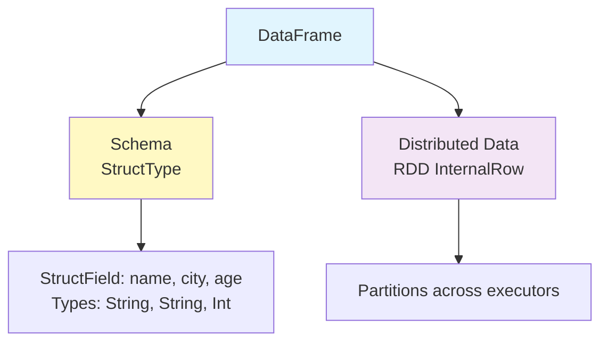
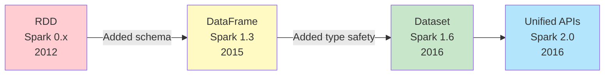
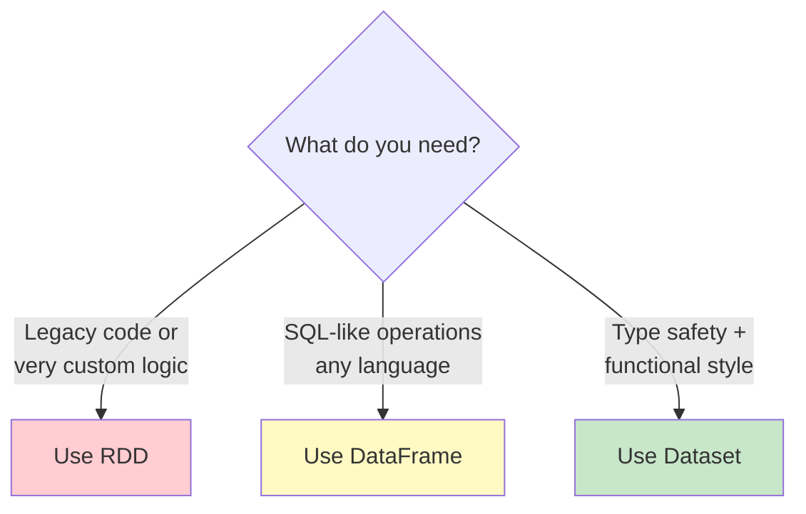
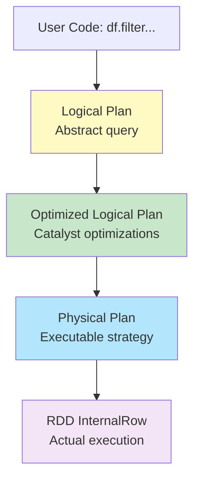
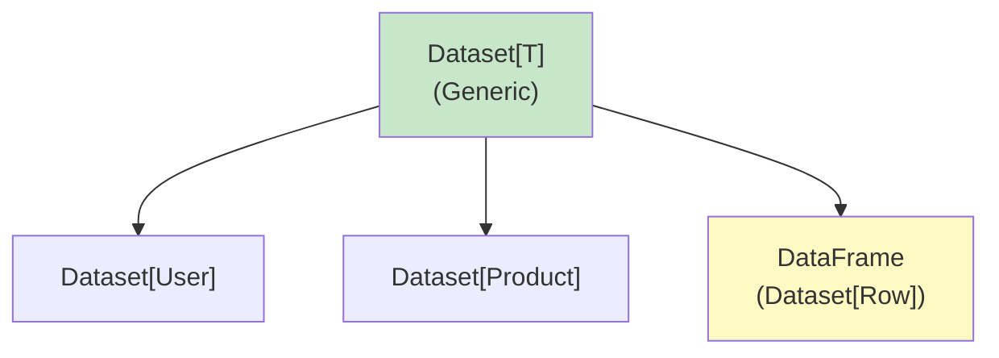
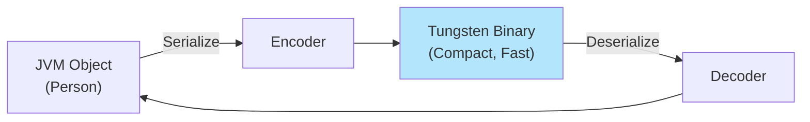
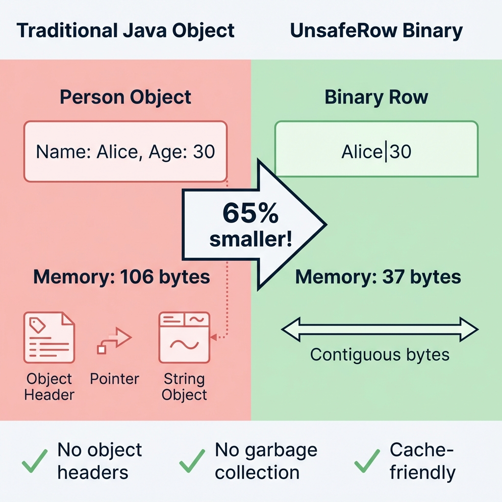
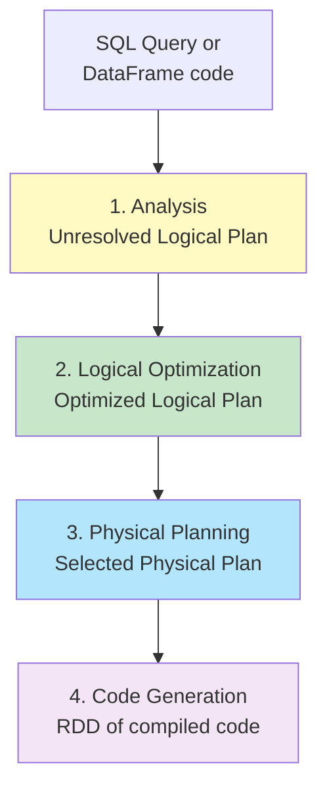
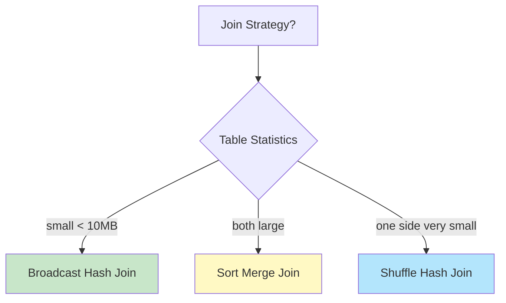
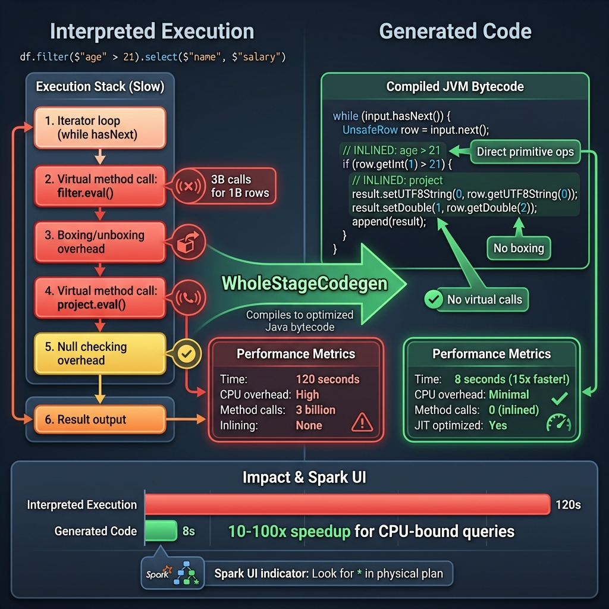

# Spark SQL & APIs Deep Dive: DataFrame, Dataset, and SQL

**A comprehensive guide to Spark's high-level APIs, Catalyst optimizer, and Tungsten execution engine**

---

## Part 1: The Evolution - From RDD to DataFrame

### 1.1 The RDD Problem: Why We Needed Something Better

When Spark was first released, the **RDD (Resilient Distributed Dataset)** was the only API available. While powerful and flexible, RDDs had significant limitations that became apparent as Spark usage grew.

#### The Pain Points with RDDs

**Problem 1: No Schema - Just Opaque Data**

```scala
// Reading CSV with RDD - manual parsing
val userData = sc.textFile("users.csv")
  .map(line => line.split(","))
  .filter(fields => fields.length == 4)  // Hope there are 4 fields!
  .filter(fields => fields(2).toInt > 18)  // Hope field 2 is age!
  .map(fields => (fields(0), fields(1), fields(2).toInt, fields(3)))

// Problems:
// ❌ No schema validation
// ❌ Runtime errors if data format changes
// ❌ Hard to understand what fields mean
// ❌ Manual type conversion
```

**Problem 2: No Optimization - Opaque Lambdas**

```scala
val result = userData
  .filter(user => user._3 > 18 && user._3 < 65)
  .map(user => (user._4, 1))
  .reduceByKey(_ + _)

// Spark sees:
// - filter(???)  ← Opaque lambda, can't optimize
// - map(???)     ← Don't know what's inside
// - reduceByKey  ← Only this can be optimized

// Can't do:
// - Predicate pushdown
// - Column pruning
// - Join reordering
```

**Problem 3: Verbose and Error-Prone Code**

```scala
// Calculate average age by city - RDD way
val avgAgeByCity = sc.textFile("users.csv")
  .map(_.split(","))
  .filter(_.length == 4)
  .map(f => (f(3), f(2).toInt))  // (city, age)
  .aggregateByKey((0, 0))(
    (acc, age) => (acc._1 + age, acc._2 + 1),
    (acc1, acc2) => (acc1._1 + acc2._1, acc1._2 + acc2._2)
  )
  .map { case (city, (sum, count)) => (city, sum.toDouble / count) }

// 😰 Complex, hard to read, easy to make mistakes
```

**Problem 4: No Cross-Language Consistency**

```python
# Python RDD
userData = sc.textFile("users.csv") \
  .map(lambda line: line.split(",")) \
  .filter(lambda f: int(f[2]) > 18)

# Different API than Scala, different performance characteristics
# Python RDD operations involve serialization overhead
```

#### What We Really Wanted

```
✓ Schema awareness (know column names and types)
✓ Query optimization (like SQL databases do)
✓ Simpler, more readable code
✓ Cross-language consistency
✓ Better performance
```

---

### 1.2 Enter DataFrame: Structured Data with Optimization

In Spark 1.3 (2015), **DataFrames** were introduced to solve these problems.

#### The Same Query - DataFrame Way

```scala
// Much cleaner!
val userData = spark.read
  .option("header", "true")
  .option("inferSchema", "true")
  .csv("users.csv")
  .filter($"age" > 18 && $"age" < 65)

// Benefits:
// ✓ Schema inferred automatically
// ✓ Column names instead of array indices
// ✓ Catalyst optimizer can see the query
// ✓ Readable and maintainable
```

#### Average Age by City - DataFrame Way

```scala
val avgAgeByCity = spark.read
  .option("header", "true")
  .csv("users.csv")
  .groupBy("city")
  .agg(avg("age").as("average_age"))

// Compare to RDD version - much simpler!
```

#### What is a DataFrame?



**Definition**: A DataFrame is a distributed collection of data organized into **named columns**, conceptually equivalent to a table in a relational database.

**Under the hood**:
```scala
// DataFrame is actually a type alias
type DataFrame = Dataset[Row]

// Row is a generic object that can hold any schema
case class Row(values: Array[Any])
```

---

### 1.3 Dataset: Type-Safe DataFrames

DataFrames solved many problems, but introduced a new one: **loss of compile-time type safety**.

#### The Type Safety Problem

```scala
// DataFrame - no compile-time checking
val df = spark.read.json("users.json")
df.filter($"age" > 18)  // Compiles fine
df.filter($"agee" > 18) // Also compiles! Runtime error if typo

// No help from IDE
df.select($"nam")  // Compiles, fails at runtime
```

#### Enter Dataset[T] - Best of Both Worlds

In Spark 1.6 (2016), **Datasets** were introduced to add type safety back.

```scala
// Define your domain model
case class User(id: Int, name: String, city: String, age: Int)

// Create typed Dataset
val users: Dataset[User] = spark.read
  .option("header", "true")
  .schema(Encoders.product[User].schema)
  .csv("users.csv")
  .as[User]

// Now we have type safety!
users.filter(_.age > 18)  // ✓ Compile-time checked
users.filter(_.agee > 18) // ✗ Compile error!

users.map(_.name.toUpperCase)  // ✓ IDE autocomplete works
users.map(_.nam)               // ✗ Compile error
```

#### Dataset vs DataFrame

```scala
// DataFrame = Dataset[Row]
val df: DataFrame = spark.read.csv("...")
val row: Row = df.first()  // Row is generic
row.getString(0)  // Access by index, no type safety

// Dataset[User] = typed!
val ds: Dataset[User] = spark.read.csv("...").as[User]
val user: User = ds.first()  // User is your case class
user.name  // Type-safe field access!
```

---

### 1.4 The Complete Evolution



**Evolution summary**:

| Feature | RDD | DataFrame | Dataset |
|:--------|:----|:----------|:--------|
| **Schema** | ❌ No | ✓ Yes | ✓ Yes |
| **Optimization** | ❌ No | ✓ Yes (Catalyst) | ✓ Yes (Catalyst) |
| **Type Safety** | ⚠️ Partial | ❌ No | ✓ Yes |
| **Readability** | ❌ Verbose | ✓ Good | ✓ Good |
| **Performance** | ⚠️ Good | ✓ Excellent | ✓ Excellent |
| **Cross-language** | ❌ Inconsistent | ✓ Consistent | ⚠️ Scala/Java only |

---

### 1.5 When to Use Each API



**Decision guide**:

**Use RDD when**:
- Working with legacy Spark code
- Need very fine-grained control over partitioning
- Implementing custom domain-specific operations
- Can't express logic with DataFrame/Dataset operations

**Use DataFrame when**:
- SQL-like operations (filter, group, join, aggregate)
- Working in Python or R
- Need maximum optimization from Catalyst
- Working with structured data
- Want cross-language consistency

**Use Dataset when**:
- Working in Scala or Java
- Need compile-time type safety
- Want IDE autocomplete and refactoring support
- Functional programming style preferred
- Complex domain models

**Best practice**: Start with Dataset/DataFrame, fall back to RDD only when necessary.

---

### 1.6 Real-World Example: The Transformation

Let's see a complete example transforming from RDD to DataFrame to Dataset.

#### Problem: Analyze User Purchases

**RDD Approach** (2012 style):

```scala
case class Purchase(userId: Int, productId: String, amount: Double, date: String)

val purchases = sc.textFile("purchases.csv")
  .map(_.split(","))
  .filter(_.length == 4)
  .map(f => Purchase(f(0).toInt, f(1), f(2).toDouble, f(3)))

// Calculate total spend by user
val userSpend = purchases
  .map(p => (p.userId, p.amount))
  .reduceByKey(_ + _)
  .sortBy(_._2, ascending = false)
  .take(10)

// Problems:
// - Manual parsing
// - Verbose
// - No optimization
// - If CSV format changes, runtime errors
```

**DataFrame Approach** (2015 style):

```scala
import org.apache.spark.sql.functions._

val purchases = spark.read
  .option("header", "true")
  .option("inferSchema", "true")
  .csv("purchases.csv")

val userSpend = purchases
  .groupBy("userId")
  .agg(sum("amount").as("totalSpend"))
  .orderBy($"totalSpend".desc)
  .limit(10)

// Benefits:
// ✓ Schema inferred
// ✓ Readable
// ✓ Catalyst optimizes query
// ✓ Can use SQL too
```

**Dataset Approach** (2016 style):

```scala
case class Purchase(userId: Int, productId: String, amount: Double, date: String)

val purchases: Dataset[Purchase] = spark.read
  .option("header", "true")
  .schema(Encoders.product[Purchase].schema)
  .csv("purchases.csv")
  .as[Purchase]

// Type-safe functional API
val userSpend = purchases
  .groupByKey(_.userId)
  .mapGroups { case (userId, purchases) =>
    (userId, purchases.map(_.amount).sum)
  }
  .toDF("userId", "totalSpend")
  .orderBy($"totalSpend".desc)
  .limit(10)

// Benefits:
// ✓ All DataFrame benefits +
// ✓ Compile-time type checking
// ✓ IDE support
```

---

**Key Takeaways from Part 1**:

1. **RDDs were powerful but limited** - no schema, no optimization, verbose
2. **DataFrames added structure and optimization** - schema awareness, Catalyst optimizer
3. **Datasets added type safety** - compile-time checking while keeping optimization
4. **Use the right tool**: Dataset for type safety, DataFrame for SQL-like ops, RDD when necessary

**Next**: Part 2 will dive deep into DataFrame API operations, transformations, and actions.

---

## Part 2: DataFrame API Deep Dive

### 2.1 What IS a DataFrame Internally?

A DataFrame is **not** a simple in-memory table. Understanding its structure is key to using it effectively.

**The Layers**:



**Under the hood**:
```scala
// DataFrame is a type alias
type DataFrame = Dataset[Row]

// Row is a generic container
sealed trait Row {
  def get(i: Int): Any
  def getString(i: Int): String
  def getInt(i: Int): Int
  // ... other typed getters
}

// InternalRow is Tungsten's binary format (covered later)
```

**Schema is StructType**:
```scala
import org.apache.spark.sql.types._

val schema = StructType(Seq(
  StructField("id", IntegerType, nullable = false),
  StructField("name", StringType, nullable = true),
  StructField("age", IntegerType, nullable = true),
  StructField("city", StringType, nullable = true)
))

// StructField(name, dataType, nullable, metadata)
```

---

### 2.2 Creating DataFrames

#### From Files

**Most common way**:

```scala
// CSV
val csv = spark.read
  .option("header", "true")
  .option("inferSchema", "true")
  .option("sep", ",")
  .csv("users.csv")

// JSON (schema inferred automatically)
val json = spark.read.json("users.json")

//Parquet (schema embedded in file)
val parquet = spark.read.parquet("users.parquet")

// With explicit schema
val users = spark.read
  .schema(schema)
  .csv("users.csv")
```

**Python equivalent**:
```python
# Same API!
users = spark.read \
    .option("header", "true") \
    .option("inferSchema", "true") \
    .csv("users.csv")
```

#### From RDD

```scala
// From RDD of tuples
val rdd = sc.parallelize(Seq(
  (1, "John", 25),
  (2, "Jane", 30)
))

val df = rdd.toDF("id", "name", "age")

// From RDD of case class
case class Person(id: Int, name: String, age: Int)
val peopleRDD = sc.parallelize(Seq(
  Person(1, "John", 25),
  Person(2, "Jane", 30)
))

val df = peopleRDD.toDF()  // Column names from case class
```

#### Programmatically

```scala
import org.apache.spark.sql.Row

val data = Seq(
  Row(1, "John", 25),
  Row(2, "Jane", 30)
)

val df = spark.createDataFrame(
  sc.parallelize(data),
  schema
)
```

#### From SQL

```scala
// Register DataFrame as temp view
users.createOrReplaceTempView("users")

// Query it
val adults = spark.sql("SELECT * FROM users WHERE age >= 18")
```

---

### 2.3 DataFrame Transformations

**All transformations are lazy** - they build up a logical plan.

#### Projections (Selecting Columns)

```scala
// Select specific columns
df.select("name", "age")
df.select($"name", $"age")
df.select(col("name"), col("age"))

// Select with expressions
df.select($"name", $"age" + 1)
df.select(expr("upper(name)"), $"age" * 2)

// selectExpr for SQL strings
df.selectExpr(
  "name",
  "age * 2 as double_age",
  "CASE WHEN age >= 18 THEN 'adult' ELSE 'minor' END as category"
)

// Add columns
df.withColumn("age_plus_one", $"age" + 1)
df.withColumn("full_name", concat($"first_name", lit(" "), $"last_name"))

// Rename columns
df.withColumnRenamed("name", "full_name")

// Drop columns
df.drop("age", "city")
```

#### Filtering (Row Selection)

```scala
// Multiple syntaxes
df.filter($"age" > 18)
df.filter("age > 18")
df.where($"age" > 18)  // alias for filter

// Complex conditions
df.filter($"age" > 18 && $"city" === "NYC")
df.filter("age > 18 AND city = 'NYC'")

// Using Column methods
df.filter($"name".startsWith("J"))
df.filter($"email".contains("@gmail.com"))
df.filter($"age".between(18, 65))
df.filter($"city".isNotNull)
df.filter($"city".isin("NYC", "LA", "SF"))
```

#### Aggregations

**Simple aggregations**:
```scala
import org.apache.spark.sql.functions._

// Single value
df.count()
df.select(avg("age")).show()
df.select(max("age"), min("age")).show()

// Group by
df.groupBy("city").count()

df.groupBy("city").agg(
  avg("age").as("avg_age"),
  max("salary").as("max_salary"),
  count("*").as("num_people")
)

// Multiple columns
df.groupBy("city", "department")
  .agg(avg("salary"))
```

**Available aggregate functions**:
```scala
count, sum, avg, min, max
stddev, variance
first, last
collect_list, collect_set
approx_count_distinct
```

#### Joins

**Join types**:
```scala
users.join(orders, "user_id")  // inner join (default)

users.join(orders, "user_id", "inner")
users.join(orders, "user_id", "left")
users.join(orders, "user_id", "right")
users.join(orders, "user_id", "outer")
users.join(orders, "user_id", "left_semi")  // EXISTS
users.join(orders, "user_id", "left_anti")  // NOT EXISTS
```

**Join with different column names**:
```scala
users.join(orders, users("id") === orders("user_id"))

// Multiple conditions
users.join(orders,
  users("id") === orders("user_id") &&
  users("city") === orders("ship_city")
)
```

**Broadcast join** (for small tables):
```scala
import org.apache.spark.sql.functions.broadcast

large.join(broadcast(small), "key")
// Sends small table to all executors
```

#### Sorting

```scala
df.orderBy("age")
df.orderBy($"age".desc)
df.orderBy($"age".desc, $"name".asc)

df.sort("age")  // alias for orderBy
```

#### Distinct and Deduplication

```scala
// Unique rows
df.distinct()

// Drop duplicates
df.dropDuplicates()

// Drop duplicates by specific columns
df.dropDuplicates("email")
df.dropDuplicates("first_name", "last_name")
```

---

### 2.4 DataFrame Actions

**Actions trigger execution** and return results to driver or write to storage.

```scala
// Collect to driver (careful with large data!)
val rows: Array[Row] = df.collect()

// Show in console (for debugging)
df.show()  // Default 20 rows
df.show(50, truncate = false)

// Count
val count: Long = df.count()

// Take first N rows
val first10: Array[Row] = df.take(10)
val first: Row = df.first()
val head: Row = df.head()

// Write to storage
df.write.parquet("output/users")
df.write.csv("output/users.csv")
df.write.json("output/users.json")

// Write modes
df.write.mode("overwrite").parquet("output")
df.write.mode("append").parquet("output")
df.write.mode("ignore").parquet("output")  // Skip if exists
df.write.mode("errorIfExists").parquet("output")  // Fail if exists

// Partitioning
df.write
  .partitionBy("year", "month")
  .parquet("output")
```

---

### 2.5 Column Expressions and Functions

#### Built-in Functions

**String functions**:
```scala
import org.apache.spark.sql.functions._

df.select(
  upper($"name"),
  lower($"name"),
  length($"name"),
  trim($"name"),
  ltrim($"name"),
  rtrim($"name"),
  substring($"name", 1, 3),
  concat($"first_name", lit(" "), $"last_name"),
  split($"name", " ")
)
```

**Date/Time functions**:
```scala
df.select(
  current_date(),
  current_timestamp(),
  date_add($"date", 7),
  date_sub($"date", 7),
  datediff($"end_date", $"start_date"),
  year($"date"),
  month($"date"),
  dayofmonth($"date"),
  hour($"timestamp")
)
```

**Math functions**:
```scala
df.select(
  abs($"value"),
  round($"value", 2),
  ceil($"value"),
  floor($"value"),
  sqrt($"value"),
  pow($"value", 2),
  rand(),  // Random number
  randn()  // Normal distribution
)
```

**Conditional functions**:
```scala
df.select(
  when($"age" >= 18, "adult")
    .when($"age" >= 13, "teen")
    .otherwise("child").as("category")
)

df.select(
  coalesce($"col1", $"col2", lit("default"))
)
```

#### Window Functions

**Powerful for analytics**:

```scala
import org.apache.spark.sql.expressions.Window

// Define window spec
val windowSpec = Window
  .partitionBy("department")
  .orderBy($"salary".desc)

// Ranking
df.select(
  $"*",
  rank().over(windowSpec).as("rank"),
  dense_rank().over(windowSpec).as("dense_rank"),
  row_number().over(windowSpec).as("row_num")
)

// Running totals
val runningTotal = Window
  .partitionBy("department")
  .orderBy("date")
  .rowsBetween(Window.unboundedPreceding, Window.currentRow)

df.select(
  $"*",
  sum("amount").over(runningTotal).as("running_total")
)

// Moving average
val movingAvg = Window
  .partitionBy("department")
  .orderBy("date")
  .rowsBetween(-6, 0)  // Last 7 days including current

df.select(
  $"*",
  avg("amount").over(movingAvg).as("7day_avg")
)

// Lag/Lead
df.select(
  $"*",
  lag($"amount", 1).over(windowSpec).as("prev_amount"),
  lead($"amount", 1).over(windowSpec).as("next_amount")
)
```

---

### 2.6 Real-World DataFrame Example

**Complete ETL pipeline**:

```scala
// Read sales data from CSV
val sales = spark.read
  .option("header", "true")
  .option("inferSchema", "true")
  .csv("s3://data/sales/*.csv")

// Read product catalog from JSON
val products = spark.read.json("s3://data/products.json")

// Read customer data from Parquet
val customers = spark.read.parquet("s3://data/customers")

// Transform and enrich
val enriched = sales
  // Join with products (broadcast small table)
  .join(broadcast(products), "product_id")
  // Join with customers
  .join(customers, sales("customer_id") === customers("id"))
  // Add derived columns
  .withColumn("revenue", $"quantity" * $"unit_price")
  .withColumn("profit", $"revenue" * $"profit_margin")
  .withColumn("sale_date", to_date($"timestamp"))
  // Filter out invalid records
  .filter($"quantity" > 0 && $"revenue" > 0)
  // Select relevant columns
  .select(
    $"sale_date",
    $"customer_name",
    $"customer_segment",
    $"product_name",
    $"product_category",
    $"quantity",
    $"revenue",
    $"profit"
  )

// Aggregate by category and segment
val summary = enriched
  .groupBy("sale_date", "product_category", "customer_segment")
  .agg(
    sum("revenue").as("total_revenue"),
    sum("profit").as("total_profit"),
    count("*").as("num_transactions"),
    avg("revenue").as("avg_transaction_value"),
    countDistinct("customer_name").as("unique_customers")
  )
  .withColumn("profit_margin", $"total_profit" / $"total_revenue")

// Add rankings
val windowSpec = Window
  .partitionBy("sale_date", "customer_segment")
  .orderBy($"total_revenue".desc)

val ranked = summary
  .withColumn("category_rank", rank().over(windowSpec))
  .filter($"category_rank" <= 10)  // Top 10 per segment

// Write results partitioned by date
ranked.write
  .mode("overwrite")
  .partitionBy("sale_date")
  .parquet("s3://output/sales_summary")

// Also write to data warehouse
ranked.write
  .format("jdbc")
  .option("url", jdbcUrl)
  .option("dbtable", "sales_summary")
  .option("user", user)
  .option("password", password)
  .mode("overwrite")
  .save()
```

**Python version (same logic)**:
```python
from pyspark.sql.functions import *
from pyspark.sql.window import Window

# Read data
sales = spark.read.option("header", "true").csv("s3://data/sales/*.csv")
products = spark.read.json("s3://data/products.json")
customers = spark.read.parquet("s3://data/customers")

# Transform
enriched = (sales
    .join(broadcast(products), "product_id")
    .join(customers, sales.customer_id == customers.id)
    .withColumn("revenue", col("quantity") * col("unit_price"))
    .withColumn("profit", col("revenue") * col("profit_margin"))
    .withColumn("sale_date", to_date("timestamp"))
    .filter((col("quantity") > 0) & (col("revenue") > 0))
)

# Aggregate
summary = (enriched
    .groupBy("sale_date", "product_category", "customer_segment")
    .agg(
        sum("revenue").alias("total_revenue"),
        sum("profit").alias("total_profit"),
        count("*").alias("num_transactions")
    )
)

# Write
summary.write.partitionBy("sale_date").parquet("s3://output/sales_summary")
```

---

**Key Takeaways from Part 2**:

1. **DataFrames are multi-layered** - logical plan → optimized plan → physical plan → RDD
2. **Multiple ways to create** - files, RDD, SQL, programmatic
3. **Rich transformation API** - projections, filters, joins, aggregations, windows
4. **Actions trigger execution** - show, collect, count, write
5. **Built-in functions are optimized** - use them instead of UDFs when possible
6. **Window functions are powerful** - rankings, running totals, moving averages
7. **APIs are consistent** - same across Scala, Python, Java

**Next**: Part 3 will cover Dataset API with type safety and encoders.

---

## Part 3: Dataset API Deep Dive

### 3.1 What IS a Dataset[T]?

A **Dataset** is a strongly-typed collection of domain-specific objects that can be transformed using functional or relational operations.

**The key difference**:
```scala
// DataFrame = loosely typed
val df: DataFrame = spark.read.json("users.json")
val row: Row = df.first()
row.getString(0)  // Access by index, runtime type checking

// Dataset = strongly typed
case class User(id: Int, name: String, age: Int)
val ds: Dataset[User] = spark.read.json("users.json").as[User]
val user: User = ds.first()
user.name  // Compile-time type checking!
```

**Type hierarchy**:


---

### 3.2 Creating Datasets

#### From Case Classes

```scala
case class Person(id: Int, name: String, age: Int, city: String)

// From sequence
val people = Seq(
  Person(1, "John", 25, "NYC"),
  Person(2, "Jane", 30, "LA"),
  Person(3, "Bob", 35, "SF")
)

val ds: Dataset[Person] = people.toDS()
```

#### From DataFrame

```scala
// Read as DataFrame
val df = spark.read
  .option("header", "true")
  .csv("people.csv")

// Convert to Dataset
val ds: Dataset[Person] = df.as[Person]

// ds now has compile-time type checking!
```

#### From RDD

```scala
val rdd = sc.parallelize(people)
val ds = rdd.toDS()
```

#### Specifying Schema

```scala
import org.apache.spark.sql.Encoders

val ds = spark.read
  .schema(Encoders.product[Person].schema)
  .json("people.json")
  .as[Person]
```

---

### 3.3 Typed vs Untyped Operations

Datasets support **both** typed (functional) and untyped (relational) operations.

#### Typed Operations (Compile-Time Safe)

```scala
val ds: Dataset[Person] = ...

// filter with lambda
ds.filter(_.age > 18)  // ✓ Compile-time type check

ds.filter(_.agee > 18) // ✗ Compile error: value agee is not a member

// map to new type
val names: Dataset[String] = ds.map(_.name)

val ages: Dataset[Int] = ds.map(_.age)

// flatMap
val words: Dataset[String] = ds.flatMap(p => p.name.split(" "))

// groupByKey (typed aggregation)
ds.groupByKey(_.city)
  .count()
  // Returns: Dataset[(String, Long)]
```

#### Untyped Operations (Runtime Checked)

```scala
// Same DataFrame operations work
ds.select($"name", $"age")  // Returns DataFrame

ds.filter($"age" > 18)  // Returns DataFrame

ds.groupBy("city").count()  // Returns DataFrame

// No compile-time checking for column names!
ds.select($"agee")  // Compiles, runtime error
```

**When to use which**:

| Use Case | Typed API | Untyped API |
|:---------|:----------|:------------|
| **Filter by field** | `ds.filter(_.age > 18)` | `ds.filter($"age" > 18)` |
| **Transform** | `ds.map(_.name.toUpperCase)` | `ds.select(upper($"name"))` |
| **Aggregation** | `ds.groupByKey(_.city).count()` | `ds.groupBy("city").count()` |
| **When to use** | Complex logic, type safety needed | SQL-like operations, optimization priority |

---

### 3.4 Encoders: The Secret Sauce

**Encoders** are the mechanism that converts JVM objects to Spark's internal binary format (Tungsten).

#### What are Encoders?



**Why Encoders matter**:

**Without Encoders (RDD with Java serialization)**:
```scala
case class Person(id: Int, name: String, age: Int, email: String, address: String)

rdd.map(_.age).sum()

// Java serialization:
// - Serializes ENTIRE Person object for each operation
// - Large overhead (object headers, class info)
// - Slow serialization/deserialization
```

**With Encoders (Dataset with Tungsten)**:
```scala
ds.map(_.age).sum()

// Encoder serialization:
// - Only extracts 'age' field (4 bytes)
// - Binary format (no object overhead)
// - Fast serialization/deserialization
```

**Performance comparison**:
```
Java Serialization: ~500 MB for 1M Person objects
Tungsten Format:    ~100 MB for same data (5x smaller!)

Serialization time: 10x faster with Encoders
```

#### Implicit Encoders

Spark provides implicit encoders for:

```scala
// Primitives
implicitly[Encoder[Int]]
implicitly[Encoder[Long]]
implicitly[Encoder[String]]
implicitly[Encoder[Boolean]]

// Tuples (up to 22 elements)
implicitly[Encoder[(String, Int)]]
implicitly[Encoder[(String, Int, Double)]]

// Case classes (via scala reflection)
case class Person(name: String, age: Int)
implicitly[Encoder[Person]]  // Generated automatically!

// Collections
implicitly[Encoder[Array[String]]]
implicitly[Encoder[Seq[Int]]]
implicitly[Encoder[Map[String, Int]]]
```

#### Custom Encoders

For complex types, you may need custom encoders:

```scala
import org.apache.spark.sql.Encoders

// Explicit encoders
Encoders.INT
Encoders.STRING
Encoders.product[Person]  // For case classes
Encoders.tuple(Encoders.scalaInt, Encoders.STRING)

// For Java beans
Encoders.bean(classOf[JavaPerson])
```

#### The Tungsten Binary Format

**Example**: How `Person(1, "John", 25)` is encoded:

```
JVM Object in Memory:
----------------------------------------
| Object Header (12 bytes)             |
| Int id = 1 (4 bytes)                 |
| String name ref → Heap (8 bytes)     |
|   → String object (24+ bytes)        |
| Int age = 25 (4 bytes)               |
----------------------------------------
Total: ~52 bytes

Tungsten Binary Format:
----------------------------------------
| id: 00 00 00 01 (4 bytes)            |
| name length: 04 (4 bytes)            |
| name data: "John" (4 bytes)          |
| age: 00 00 00 19 (4 bytes)           |
----------------------------------------
Total: 16 bytes (3x smaller!)
```

**Benefits**:
- ✓ Compact (no object headers)
- ✓ Cache-friendly (contiguous memory)
- ✓ Fast serialization (no reflection)
- ✓ GC-friendly (off-heap storage possible)

---

### 3.6 Tungsten Memory Management: Code-Level Deep Dive

*This section reveals how Spark SQL achieves dramatic performance improvements through Tungsten's binary row format and off-heap memory management.*



#### UnsafeRow: The Binary Row Format

**Location**: [`sql/catalyst/src/main/java/org/apache/spark/sql/catalyst/expressions/UnsafeRow.java`](https://github.com/apache/spark/blob/master/sql/catalyst/src/main/java/org/apache/spark/sql/catalyst/expressions/UnsafeRow.java)

**What is UnsafeRow?**
- Spark SQL's internal row representation in Tungsten
- Binary format stored in contiguous memory (byte arrays or off-heap)
- Directly manipulated without deserialization
- **No Java objects** - pure bytes!

#### Memory Layout: Fixed + Variable Regions

**UnsafeRow structure** for schema `(id: Int, name: String, amount: Double)`:

```
┌────────────── FIXED REGION ──────────────┬─── VARIABLE REGION ───┐
│                                           │                       │
│ Null Bits │   id    │  name*  │  amount  │  String data: "Alice" │
│  8 bytes  │ 8 bytes │ 8 bytes │  8 bytes │      5 bytes          │
└───────────┴─────────┴─────────┴──────────┴───────────────────────┘
  Byte 0      Byte 8    Byte 16   Byte 24       Byte 32

* name field stores: (offset << 32) | length
  - Upper 32 bits: offset to variable region (32)
  - Lower 32 bits: length of string (5)
```

**Key insights**:
1. **Null tracking**: First 8 bytes = bitmap (1 bit per field)
2. **Fixed-size fields**: Stored inline (Int, Long, Double)
3. **Variable-size fields**: Offset+length pointer in fixed region, data in variable region
4. **8-byte alignment**: All fields padded to 8 bytes for fast access

#### Building UnsafeRow: Code Example

From [`UnsafeRow.java:178-263`](https://github.com/apache/spark/blob/master/sql/catalyst/src/main/java/org/apache/spark/sql/catalyst/expressions/UnsafeRow.java#L178-L263):

```java
public class UnsafeRow extends InternalRow {
  private Object baseObject;  // null for off-heap, byte[] for on-heap
  private long baseOffset;    // Memory address
  
  // Set a primitive Int field
  public void setInt(int ordinal, int value) {
    assertIndexIsValid(ordinal);
    Platform.putInt(
      baseObject,
      baseOffset + getFieldOffset(ordinal),
      value
    );
  }
  
  // Set a Double field
  public void setDouble(int ordinal, double value) {
    assertIndexIsValid(ordinal);
    Platform.putLong(
      baseObject,
      baseOffset + getFieldOffset(ordinal),
      Double.doubleToLongBits(value)  // Store as long bits
    );
  }
  
  // Set a UTF8String (variable-length)
  public void setUTF8String(int ordinal, UTF8String value) {
    assertIndexIsValid(ordinal);
    
    final long offset = getFieldOffset(ordinal);
    final int numBytes = value.numBytes();
    
    // Write offset and length in fixed region (packed into 8 bytes)
    Platform.putLong(
      baseObject,
      baseOffset + offset,
      (((long) cursor) << 32) | (long) numBytes
      //          ↑                        ↑
      //    offset to data            length
    );
    
    // Write actual string bytes in variable region
    value.writeToMemory(baseObject, baseOffset + cursor);
    
    // Move cursor for next variable-length field
    cursor += numBytes;
  }
}
```

**What is `Platform.putX`?**
- Wrapper around `sun.misc.Unsafe`
- Direct memory writes bypassing Java type system
- Works for both on-heap (byte arrays) and off-heap (native memory)
- **Critical for performance**: No object allocation, no GC!

#### Memory Savings Calculation

**Traditional Java objects** for `Row(123, "Alice", 45.99)`:

```
Row object:
  ├─ Object header:        16 bytes
  ├─ id (int + padding):   8 bytes
  ├─ name reference:       8 bytes
  ├─ amount (double):      8 bytes
  └─ Total:               40 bytes

String "Alice" (separate object):
  ├─ Object header:        16 bytes
  ├─ char[] reference:     8 bytes
  ├─ hash, length fields:  8 bytes
  └─ char array:
      ├─ Array header:     24 bytes
      ├─ 5 chars × 2:      10 bytes (UTF-16!)
      └─ Total:            34 bytes
  └─ Total String:        66 bytes

GRAND TOTAL: 40 + 66 = 106 bytes per row
```

**UnsafeRow binary format**:

```
Fixed region:
  ├─ Null bits:           8 bytes
  ├─ id:                  8 bytes
  ├─ name (offset+len):   8 bytes
  └─ amount:              8 bytes
  Total fixed:           32 bytes

Variable region:
  └─ "Alice" (UTF-8):     5 bytes

GRAND TOTAL: 32 + 5 = 37 bytes per row
```

**Savings**: 106 bytes → 37 bytes = **65% reduction!**

**For 1 million rows**:
- Traditional: 106 MB
- Tungsten: 37 MB
- **Memory saved**: 69 MB per million rows

#### Off-Heap Allocation: Bypassing Garbage Collector

**Configuration**:
```scala
spark.memory.offHeap.enabled = true
spark.memory.offHeap.size = 10g  // 10 GB off-heap memory
```

**How off-heap allocation works** (from [`TaskMemoryManager.java:274-301`](https://github.com/apache/spark/blob/master/core/src/main/java/org/apache/spark/memory/TaskMemoryManager.java#L274-L301)):

```java
public MemoryBlock allocatePage(long size, MemoryConsumer consumer) {
  if (tungstenMemoryMode == MemoryMode.OFF_HEAP) {
    // Allocate native memory via Unsafe
    long address = Platform.allocateMemory(size);
    
    // Track allocation
    MemoryBlock page = new MemoryBlock(null, address, size);
    allocatedPages.add(page);
    
    return page;
  } else {
    // On-heap: allocate byte array
    byte[] array = new byte[(int) size];
    return new MemoryBlock(array, Platform.BYTE_ARRAY_OFFSET, size);
  }
}
```

**Memory layout**:

```
ON-HEAP MODE:
  baseObject = byte[] array (JVM heap)
  baseOffset = Platform.BYTE_ARRAY_OFFSET (typically 16)
  
  GC sees: byte array object
  GC scans: Yes (but contents are opaque bytes)

OFF-HEAP MODE:
  baseObject = null
  baseOffset = native memory address (e.g., 0x7f8a2c000000)
  
  GC sees: Nothing!
  GC scans: No (invisible to garbage collector)
```

**Why this matters**:

```
Scenario: 1 billion rows, 50 GB data

Traditional Java objects (on-heap):
  ├─ 1 billion objects in heap
  ├─ GC must scan all objects
  ├─ Full GC pause: 10-30 seconds
  └─ Unpredictable latency

Tungsten UnsafeRow (off-heap):
  ├─ 50 GB in native memory
  ├─ GC cannot see native memory
  ├─ Full GC pause: 1-2 seconds (only scans JVM heap)
  └─ Predictable low latency
```

**Performance impact**:
- **GC time**: 30s → 2s = **15x faster GC**
- **Query latency**: More predictable
- **Throughput**: Higher sustained throughput

#### Building Rows: Code Generation

**Manual construction** (from application code):

```scala
import org.apache.spark.sql.catalyst.expressions.UnsafeRow
import org.apache.spark.unsafe.Platform

// Allocate buffer for row
val buffer = new Array[Byte](64)
val row = new UnsafeRow(3)  // 3 fields
row.pointTo(buffer, Platform.BYTE_ARRAY_OFFSET, 64)

// Set fields
row.setInt(0, 123)                           // id = 123
row.setUTF8String(1, UTF8String.fromString("Alice"))  // name = "Alice"
row.setDouble(2, 45.99)                      // amount = 45.99

// Now 'row' is a binary representation in 'buffer'
// Can be:
//   - Cached in off-heap memory
//   - Sent over network without serialization
//   - Written to disk in columnar format
```

**Generated code** (Spark internal):

```java
// Spark generates code like this during whole-stage codegen
public class GeneratedProjection extends UnsafeProjection {
  private UnsafeRow result;
  
  public UnsafeRow apply(InternalRow input) {
    // Allocate result row
    result.pointTo(buffer, offset, 64);
    
    // INLINED: Direct memory writes
    Platform.putInt(buffer, offset + 8, input.getInt(0));  // id
    
    UTF8String name = input.getUTF8String(1);
    Platform.putLong(buffer, offset + 16, ((long)cursor << 32) | name.numBytes());
    name.writeToMemory(buffer, offset + cursor);
    cursor += name.numBytes();
    
    Platform.putLong(buffer, offset + 24, Double.doubleToLongBits(input.getDouble(2)));
    
    return result;
  }
}
```

**Why generated code is faster**:
1. **No method calls**: Everything inlined
2. **Direct memory access**: `Platform.putX` directly
3. **No branches**: Straight-line code
4. **JIT-friendly**: Hotspot can optimize aggressively

#### Columnar Storage Integration

**Parquet/ORC integration**:

```scala
// Reading Parquet
val df = spark.read.parquet("data.parquet")

// Internally:
//   1. Parquet file already columnar
//   2. Read column chunks into off-heap memory
//   3. Build UnsafeRow pointing to column data
//   4. Zero-copy! No deserialization needed

// Vectorized execution (when enabled):
spark.sql.parquet.enableVectorizedReader = true

//   - Reads batches of 4096 rows
//   - Processes entire columns at once
//   - Uses SIMD instructions on modern CPUs
//   - 10x faster than row-by-row
```

#### Memory Management: Acquisition and Release

**Memory lifecycle**:

```java
// Task starts
TaskMemoryManager tmm = new TaskMemoryManager(memoryManager, taskAttemptId);

// Allocate page for UnsafeRows
long pageSize = 256 * 1024 * 1024;  // 256 MB
MemoryBlock page = tmm.allocatePage(pageSize, consumer);

// Use page for rows
UnsafeRow row = new UnsafeRow(schema.length);
row.pointTo(page.getBaseObject(), page.getBaseOffset(), rowSize);

// Set data...
row.setInt(0, value);

// Task completes
tmm.cleanUpAllAllocatedMemory();  // Releases all pages

// Off-heap: calls Platform.freeMemory(address)
// On-heap: byte arrays eligible for GC
```

**Memory pressure handling**:

```java
// If allocation fails (out of memory)
try {
  MemoryBlock page = tmm.allocatePage(requestedSize, consumer);
} catch (OutOfMemoryError e) {
  // Trigger spilling in consumer
  consumer.spill(requestedSize, tmm);
  
  // Retry
  MemoryBlock page = tmm.allocatePage(requestedSize, consumer);
}
```

#### Configuration Tuning

**Tungsten memory settings**:

```scala
// Enable off-heap for large datasets
spark.memory.offHeap.enabled = true
spark.memory.offHeap.size = 20g  // 20 GB off-heap

// On-heap configuration
spark.executor.memory = 10g  // JVM heap

// Result:
//   - 10 GB heap for objects, metadata, user code
//   - 20 GB off-heap for Tungsten rows
//   - GC only scans 10 GB → Fast GC
//   - 30 GB total capacity

// Vectorized execution
spark.sql.parquet.enableVectorizedReader = true
spark.sql.orc.enableVectorizedReader = true
spark.sql.inMemoryColumnarStorage.batchSize = 10000  // Rows per batch

// Code generation
spark.sql.codegen.wholeStage = true  // Enable (default)
spark.sql.codegen.maxFields = 100    // Max fields before disabling

// Memory fraction
spark.memory.fraction = 0.6  // 60% for Spark (execution + storage)
spark.memory.storageFraction = 0.5  // 50% of Spark memory for caching
```

#### Performance Comparison

**Benchmark**: Sum aggregation on 1 billion rows

| Configuration | Memory | GC Pauses | Query Time | Notes |
|---------------|--------|-----------|------------|-------|
| **RDD with Java objects** | 120 GB heap | 30s every 2min | 450s | Frequent major GC |
| **DataFrame (on-heap Tungsten)** | 80 GB heap | 15s every 5min | 180s | Reduced GC, compact format |
| **DataFrame (off-heap Tungsten)** | 30GB heap + 70GB off-heap | 2s every 20min | 120s | Minimal GC, best performance |

**Key takeaway**: Off-heap Tungsten provides **3.75x speedup** over traditional RDDs!

#### Debugging Tungsten

**View UnsafeRow contents**:

```scala
import org.apache.spark.sql.catalyst.expressions.UnsafeRow

val row: UnsafeRow = ...  // From internal query execution

println(s"Size in bytes: ${row.getSizeInBytes}")
println(s"Field 0 (int): ${row.getInt(0)}")
println(s"Field 1 (string): ${row.getUTF8String(1)}")
println(s"Field 2 (double): ${row.getDouble(2)}")

// View raw bytes
val bytes = row.getBytes
println(s"Raw bytes (hex): ${bytes.map("%02x".format(_)).mkString(" ")}")
```

**Check memory usage in Spark UI**:
- **SQL tab** → Query details → Memory
- Look for "UnsafeRow" in metrics
- "Peak execution memory" shows max memory used

**Enable debug logging**:

```scala
spark.sparkContext.setLogLevel("DEBUG")

// Look for logs like:
// DEBUG UnsafeRow: Created row with 3 fields, 64 bytes
// DEBUG TaskMemoryManager: Allocated 256 MB page at address 0x7f8a2c000000
```

---


### 3.5 Type-Safe Transformations

#### map, flatMap, filter

```scala
case class Person(name: String, age: Int, city: String)
val ds: Dataset[Person] = ...

// map: 1-to-1 transformation
val names: Dataset[String] = ds.map(_.name)

val older: Dataset[Person] = ds.map(p => 
  p.copy(age = p.age + 1)
)

// flatMap: 1-to-many
val nameWords: Dataset[String] = ds.flatMap(p => p.name.split(" "))

// filter: predicate
val adults: Dataset[Person] = ds.filter(_.age >= 18)

val nycPeople: Dataset[Person] = ds.filter(_.city == "NYC")
```

#### Type-safe joins

```scala
case class Order(userId: Int, amount: Double, product: String)
val users: Dataset[Person] = ...
val orders: Dataset[Order] = ...

// Join and get typed result
val joined: Dataset[(Person, Order)] = users
  .joinWith(orders, users("id") === orders("userId"))

// Access with tuple syntax
joined.map { case (person, order) =>
  s"${person.name} bought ${order.product} for $${order.amount}"
}
```

---

### 3.6 Type-Safe Aggregations

**Using TypedColumn**:

```scala
import org.apache.spark.sql.expressions.scalalang.typed

case class Sale(product: String, category: String, amount: Double, quantity: Int)
val sales: Dataset[Sale] = ...

// Typed aggregations
val result = sales
  .groupByKey(_.category)
  .agg(
    typed.sum[Sale](_.amount).name("total_sales"),
    typed.avg[Sale](_.quantity).name("avg_quantity"),
    typed.count[Sale](_.product).name("num_products")
  )

// Result type: Dataset[(String, Double, Double, Long)]
// (category, total_sales, avg_quantity, num_products)
```

**mapGroups for complex aggregations**:

```scala
// Custom aggregation logic
val categoryStats = sales
  .groupByKey(_.category)
  .mapGroups { case (category, sales) =>
    val salesList = sales.toList
    val totalAmount = salesList.map(_.amount).sum
    val totalQuantity = salesList.map(_.quantity).sum
    val avgPrice = totalAmount / totalQuantity
    
    (category, totalAmount, totalQuantity, avgPrice)
  }

// Returns: Dataset[(String, Double, Int, Double)]
```

**reduceGroups**:

```scala
val maxSaleByCategory = sales
  .groupByKey(_.category)
  .reduceGroups((s1, s2) => 
    if (s1.amount > s2.amount) s1 else s2
  )

// Returns: Dataset[(String, Sale)]
```

---

### 3.7 Converting Between DataFrame and Dataset

**DataFrame → Dataset**:
```scala
val df: DataFrame = spark.read.json("people.json")

// Explicit conversion
val ds: Dataset[Person] = df.as[Person]

// With renamed columns
val ds2 = df
  .withColumnRenamed("person_id", "id")
  .as[Person]
```

**Dataset → DataFrame**:
```scala
val ds: Dataset[Person] = ...

// Convert to DataFrame
val df: DataFrame = ds.toDF()

// Access as Row
val row: Row = df.first()
```

**Best practice**: Mix both APIs!

```scala
// Start typed
val ds: Dataset[Person] = spark.read.json("...").as[Person]

// Use DataFrame for SQL operations (better optimized)
val filtered = ds.toDF()
  .filter($"age" > 18)
  .groupBy("city").agg(avg("age"))

// Back to typed for complex logic
case class CityStats(city: String, avgAge: Double)
val stats: Dataset[CityStats] = filtered.as[CityStats]

stats.map(s => s.copy(avgAge = s.avgAge.round))
```

---

### 3.8 Real-World Dataset Example

**Problem**: Process user clickstream data with complex business logic.

```scala
case class ClickEvent(
  userId: Int,
  timestamp: Long,
  page: String,
  action: String,
  duration: Int
)

case class UserSession(
  userId: Int,
  sessionId: String,
  startTime: Long,
  endTime: Long,
  pages: Seq[String],
  totalDuration: Int
)

val events: Dataset[ClickEvent] = spark.read
  .json("clickstream")
  .as[ClickEvent]

// Complex typed transformation
def createSessions(events: Seq[ClickEvent]): Seq[UserSession] = {
  val sortedEvents = events.sortBy(_.timestamp)
  val sessionGap = 30 * 60 * 1000 // 30 minutes
  
  sortedEvents.foldLeft(List.empty[(Int, List[ClickEvent])]) {
    case (sessions, event) =>
      sessions match {
        case Nil =>
          List((1, List(event)))
        case (sessionId, currentSession) :: rest =>
          val lastTimestamp = currentSession.head.timestamp
          if (event.timestamp - lastTimestamp < sessionGap) {
            // Same session
            (sessionId, event :: currentSession) :: rest
          } else {
            // New session
            (sessionId + 1, List(event)) :: sessions
          }
      }
  }.map { case (sessionId, events) =>
    UserSession(
      userId = events.head.userId,
      sessionId = s"${events.head.userId}_$sessionId",
      startTime = events.last.timestamp,
      endTime = events.head.timestamp,
      pages = events.reverse.map(_.page),
      totalDuration = events.map(_.duration).sum
    )
  }
}

// Apply complex logic with type safety
val sessions: Dataset[UserSession] = events
  .groupByKey(_.userId)
  .flatMapGroups { case (userId, events) =>
    createSessions(events.toSeq)
  }

// Continue with typed operations
val longSessions = sessions
  .filter(_.totalDuration > 300)  // > 5 minutes
  .filter(_.pages.size >= 3)       // At least 3 pages

// Aggregate
val userStats = longSessions
  .groupByKey(_.userId)
  .agg(
    typed.count[UserSession](_.sessionId).name("total_sessions"),
    typed.avg[UserSession](_.totalDuration.toDouble).name("avg_duration")
  )
```

---

**Key Takeaways from Part 3**:

1. **Datasets = DataFrame + Type Safety** - Best of both worlds
2. **Encoders are critical** - Tungsten binary format for performance
3. **Two operation styles** - Typed (compile-time safe) and untyped (SQL-like)
4. **Use typed for complex logic** - When you need IDE support and type checking
5. **Use DataFrame for SQL operations** - Better Catalyst optimization
6. **Mix both APIs** - Switch between Dataset and DataFrame as needed
7. **Type-safe aggregations** - TypedColumn for compile-time checked aggregations

**Next**: Part 4 will cover Spark SQL and UDFs in detail.

---

## Part 4: Spark SQL Deep Dive

### 4.1 The SQL Interface

Spark SQL allows you to query DataFrames using SQL syntax - the same queries work on structured data!

#### Registering Temporary Views

```scala
val df = spark.read.parquet("users.parquet")

// Create temporary view (session-scoped)
df.createOrReplaceTempView("users")

// Now query with SQL
val adults = spark.sql("""
  SELECT name, age, city
  FROM users
  WHERE age >= 18
""")

// Global views (accessible across sessions)
df.createGlobalTempView("users_global")
spark.sql("SELECT * FROM global_temp.users_global")
```

**Python**:
```python
df.createOrReplaceTempView("users")
adults = spark.sql("SELECT * FROM users WHERE age >= 18")
```

#### Complex SQL Queries

```sql
-- CTEs (Common Table Expressions)
WITH high_value_customers AS (
  SELECT customer_id, SUM(amount) as total_spend

FROM orders
  GROUP BY customer_id
  HAVING total_spend > 10000
)
SELECT c.name, c.email, h.total_spend
FROM customers c
JOIN high_value_customers h ON c.id = h.customer_id
ORDER BY h.total_spend DESC

-- Window functions in SQL
SELECT 
  employee_id,
  department,
  salary,
  RANK() OVER (PARTITION BY department ORDER BY salary DESC) as dept_rank,
  AVG(salary) OVER (PARTITION BY department) as dept_avg_salary
FROM employees

-- Subqueries
SELECT name, age
FROM users
WHERE age > (SELECT AVG(age) FROM users)
```

---

### 4.2 User-Defined Functions (UDFs)

When built-in functions aren't enough, create custom UDFs.

#### Scalar UDFs

```scala
import org.apache.spark.sql.functions.udf

// Define Scala function
def calculateBonus(salary: Double, rating: Int): Double = {
  salary * rating * 0.1
}

// Register as UDF for DataFrame API
val bonusUDF = udf(calculateBonus _)

df.select($"name", bonusUDF($"salary", $"rating").as("bonus"))

// Register for SQL
spark.udf.register("calculateBonus", calculateBonus _)

spark.sql("""
  SELECT name, calculateBonus(salary, rating) as bonus
  FROM employees
""")
```

**Python UDF**:
```python
from pyspark.sql.functions import udf
from pyspark.sql.types import DoubleType

def calculate_bonus(salary, rating):
    return salary * rating * 0.1

bonus_udf = udf(calculate_bonus, DoubleType())
df.select("name", bonus_udf("salary", "rating").alias("bonus"))
```

#### UDAF (User-Defined Aggregate Functions)

**NOTE**: UDAFs are deprecated in Spark 3.x. Use Aggregator instead.

**Aggregator (type-safe)**:
```scala
import org.apache.spark.sql.{Encoder, Encoders}
import org.apache.spark.sql.expressions.Aggregator

case class Average(var sum: Double, var count: Long)

object MyAverage extends Aggregator[Double, Average, Double] {
  def zero: Average = Average(0.0, 0L)
  
  def reduce(buffer: Average, data: Double): Average = {
    buffer.sum += data
    buffer.count += 1
    buffer
  }
  
  def merge(b1: Average, b2: Average): Average = {
    b1.sum += b2.sum
    b1.count += b2.count
    b1
  }
  
  def finish(reduction: Average): Double = {
    reduction.sum / reduction.count
  }
  
  def bufferEncoder: Encoder[Average] = Encoders.product
  def outputEncoder: Encoder[Double] = Encoders.scalaDouble
}

// Use it
import org.apache.spark.sql.functions._
val myAvg = MyAverage.toColumn.name("avg")
df.select(myAvg)
```

---

## Part 5: The Catalyst Optimizer

**This is the secret sauce that makes Spark SQL/DataFrame fast!**

### 5.1 The Four-Phase Optimization Pipeline



---

### 5.2 Phase 1: Analysis

**Convert unresolved names to actual columns**:

```scala
users.filter($"age" > 18).select("name")
```

**Unresolved Plan**:
```
Project [name#?]
└── Filter (age#? > 18)
    └── UnresolvedRelation [users]
```

**After Analysis** (resolved):
```
Project [name#2]
└── Filter (age#3 > 18)
    └── Relation [id#1, name#2, age#3, city#4]
        Schema: (IntegerType, StringType, IntegerType, StringType)
```

**What happens**:
- Resolve column names from catalog
- Resolve table names
- Check types match
- Assign unique IDs to columns

---

### 5.3 Phase 2: Logical Optimization

**Rule-based optimizations** that transform the logical plan.

#### Predicate Pushdown

**BEFORE**:
```scala
users.join(orders, "user_id")
  .filter($"age" > 18)
```

**Unoptimized plan**:
```
Filter (age > 18)
└── Join (user_id)
    ├── Relation [users]
    └── Relation [orders]
    
Steps: 1. Join all users × orders (huge!)
       2. Filter result
```

**AFTER** optimization:
```
Join (user_id)
├── Filter (age > 18)
│   └── Relation [users]
└── Relation [orders]

Steps: 1. Filter users first (smaller!)
       2. Join filtered users × orders
```

**Why it matters**:
- Join 1M users × 10M orders = 10 trillion rows
- Filter first: 100K users (age > 18) × 10M orders = 1 billion rows
- **10,000x fewer rows to process!**

#### Column Pruning

```scala
spark.read.parquet("users")  // Has 50 columns
  .select("name", "age")
```

**Optimized**:
```
Only reads 'name' and 'age' columns from Parquet
Skips other 48 columns entirely
```

**With Parquet/ORC (columnar formats)**:
- Only read bytes for requested columns
- Can save 95%+ I/O!

#### Constant Folding

```scala
df.filter($"age" > 10 + 8)
```

**Optimized**:
```
df.filter($"age" > 18)  // Computed at compile time
```

#### Boolean Expression Simplification

```scala
df.filter(($"age" > 18) && ($"age" > 10))
```

**Optimized**:
```
df.filter($"age" > 18)  // Second condition redundant
```

---

### 5.4 Phase 3: Physical Planning

**Choose the best physical execution strategy**.

#### Join Strategy Selection

```scala
large.join(small, "key")
```

**Catalyst evaluates**:



**Broadcast Hash Join** (small < 10MB default):
```
1. Broadcast small table to all executors
2. Hash join locally (no shuffle!)
Pro: Fast, no shuffle
Con: Only works for small tables
```

**Sort Merge Join** (both large):
```
1. Shuffle both tables by join key
2. Sort both sides
3. Merge sorted partitions
Pro: Scalable for large-large joins
Con: Requires shuffle + sort
```

**Cost-Based Optimization** (CBO):

```sql
-- Collect table statistics
ANALYZE TABLE users COMPUTE STATISTICS
ANALYZE TABLE orders COMPUTE STATISTICS

-- Catalyst uses stats to choose best plan
SELECT * 
FROM users u 
JOIN orders o ON u.id = o.user_id
JOIN products p ON o.product_id = p.id

-- CBO considers:
-- - Table sizes
-- - Join selectivity
-- - Column statistics (min, max, distinct count)
-- - Chooses optimal join order automatically
```

---

### 5.5 Phase 4: Code Generation - WholeStageCodegen Deep Dive

*This section reveals how Spark SQL generates and compiles optimized Java code for entire query stages, achieving 10-100x speedups.*



#### The Problem: Interpreter Overhead

**Traditional interpreted execution** (Volcano iterator model):

```scala
// This DataFrame operation
df.filter($"age" > 21).select($"name", $"salary")

// Executes as:
for (row <- inputIterator) {
  // filter.eval() - VIRTUAL METHOD CALL
  val passed = filter.eval(row)
  
  if (passed) {
    // project.eval() - ANOTHER VIRTUAL METHOD CALL
    val result = project.eval(row)
    output.add(result)
  }
}
```

**Overhead per row**:
1. Virtual method calls (`eval()`)
2. Object boxing/unboxing
3. Null checking in every operator
4. Iterator boundary checks
5. Expression tree traversal

**For 1 billion rows**: 3 billion virtual method calls!

**Why this is slow**:
- Virtual dispatch prevents inlining
- CPU branch prediction misses
- Poor cache locality
- JIT compiler cannot optimize across method boundaries

#### The Solution: Whole-Stage Code Generation

**Generated code** (simplified):

```java
public class GeneratedIter

ator extends BufferedRowIterator {
  private UnsafeRow result = new UnsafeRow(2);
  
  protected void processNext() {
    while (input.hasNext()) {
      UnsafeRow row = (UnsafeRow) input.next();
      
      // INLINED: filter (age > 21)
      int age = row.getInt(1);
      if (age > 21) {
        // INLINED: project (name, salary)
        result.setUTF8String(0, row.getUTF8String(0));  // name
        result.setDouble(1, row.getDouble(2));           // salary
        
        // Batch output (reduce boundary checks)
        append(result);
        if (numOutputRows >= 10000) return;
      }
    }
  }
}
```

**Benefits**:
- ✅ **No virtual calls**: Everything inlined
- ✅ **No boxing**: Primitive operations only
- ✅ **Tight loops**: JIT compiler can vectorize
- ✅ **Batch processing**: Fewer boundary checks

#### How WholeStageCodegen Works

**Location**: [`sql/core/src/main/scala/org/apache/spark/sql/execution/WholeStageCodegenExec.scala`](https://github.com/apache/spark/blob/master/sql/core/src/main/scala/org/apache/spark/sql/execution/WholeStageCodegenExec.scala)

**The process**:

```scala
override def doExecute(): RDD[InternalRow] = {
  val codeGenStageId = inputRDDs().head.id
  
  // Step 1: Generate code for entire stage
  val (ctx, codeAndComment) = doCodeGen()
  
  // Step 2: Compile generated code to bytecode
  val evaluator = new CodeGenerator[GeneratedIterator](
    codeAndComment.body,
    ctx.references.toMap
  ).generate(ctx.references.toArray)
  
  // Step 3: Execute with compiled code
  inputRDDs().head.mapPartitionsWithIndex { (index, iter) =>
    val generated = evaluator.generate(Array.empty)
      .asInstanceOf[BufferedRowIterator]
    
    generated.init(index, Array(iter))
    new Iterator[InternalRow] {
      override def hasNext: Boolean = generated.hasNext
      override def next(): InternalRow = generated.next()
    }
  }
}
```

**Code generation process**:

```scala
protected def doCodeGen(): (CodegenContext, CodeAndComment) = {
  val ctx = new CodegenContext
  
  // Generate code for entire operator tree
  val code = child.asInstanceOf[CodegenSupport].produce(ctx, this)
  
  // Wrap in class definition
  val source = s"""
    public Object generate(Object[] references) {
      return new GeneratedIterator(references);
    }
    
    final class GeneratedIterator extends BufferedRowIterator {
      // Declare mutable state (variables shared across methods)
      ${ctx.declareMutableStates()}
      
      // Initialize method
      public void init(int index, scala.collection.Iterator[] inputs) {
        ${ctx.initMutableStates()}
      }
      
      // Main processing loop
      protected void processNext() throws java.io.IOException {
        ${code}
      }
    }
  """
  
  (ctx, CodeAndComment(source, ctx.getPlaceHolderToComments()))
}
```

#### Real Generated Code Example

**Query**:
```scala
spark.sql("""
  SELECT name, salary * 1.1 AS new_salary
  FROM employees
  WHERE age > 30 AND department = 'Engineering'
""").show()
```

**Generated code** (simplified from actual output):

```java
/* 001 */ public Object generate(Object[] references) {
/* 002 */   return new GeneratedIterator(references);
/* 003 */ }
/* 004 */
/* 005 */ final class GeneratedIterator extends org.apache.spark.sql.execution.BufferedRowIterator {
/* 006 */   private Object[] references;
/* 007 */   private scala.collection.Iterator[] inputs;
/* 008 */   private UnsafeRow result;
/* 009 */   private UTF8String literal_department;
/* 010 */   
/* 011 */   public GeneratedIterator(Object[] references) {
/* 012 */     this.references = references;
/* 013 */   }
/* 014 */   
/* 015 */   public void init(int index, scala.collection.Iterator[] inputs) {
/* 016 */     this.inputs = inputs;
/* 017 */     this.result = new UnsafeRow(2);  // 2 output fields
/* 018 */     this.literal_department = UTF8String.fromString("Engineering");
/* 019 */   }
/* 020 */   
/* 021 */   protected void processNext() throws java.io.IOException {
/* 022 */     while (inputs[0].hasNext()) {
/* 023 */       UnsafeRow row = (UnsafeRow) inputs[0].next();
/* 024 */       
/* 025 */       // INLINED FILTER: age > 30
/* 026 */       int value_age = row.getInt(1);
/* 027 */       if (value_age > 30) {
/* 028 */         
/* 029 */         // INLINED FILTER: department = 'Engineering'
/* 030 */         UTF8String value_dept = row.getUTF8String(2);
/* 031 */         if (value_dept.equals(literal_department)) {
/* 032 */           
/* 033 */           // INLINED PROJECT: name, salary * 1.1
/* 034 */           UTF8String value_name = row.getUTF8String(0);
/* 035 */           double value_salary = row.getDouble(3);
/* 036 */           double value_new_salary = value_salary * 1.1;
/* 037 */           
/* 038 */           // Build result row
/* 039 */           result.setUTF8String(0, value_name);
/* 040 */           result.setDouble(1, value_new_salary);
/* 041 */           
/* 042 */           append(result.copy());
/* 043 */           
/* 044 */           // Batch boundary (process 10K rows at a time)
/* 045 */           if (numOutputRows >= 10000) return;
/* 046 */         }
/* 047 */       }
/* 048 */     }
/* 049 */   }
/* 050 */ }
```

**Key optimizations in generated code**:
1. **Lines 26-27**: Filter check inlined (no `eval()` call)
2. **Lines 30-31**: String comparison inlined
3. **Line 18**: Constant folded (computed once, not per row)
4. **Lines 34-36**: Direct primitive operations
5. **Lines 39-40**: UnsafeRow field setters (direct memory writes)
6. **Line 42**: Row copy (for safety)
7. **Lines 44-45**: Batch processing (amortizes overhead)

#### What Gets Codegen'd?

**Operators that support whole-stage codegen**:

| Operator | Codegen Support | Notes |
|----------|----------------|-------|
| **Filter** | ✅ Yes | Inlines predicate evaluation |
| **Project** | ✅ Yes | Inlines expression evaluation |
| **HashAggregate** | ✅ Partial | Only with primitive types |
| **Sort** | ✅ Yes | Uses generated comparator |
| **SortMergeJoin** | ✅ Yes | Entire join loop generated |
| **BroadcastHashJoin** | ✅ Yes | Probe loop generated |
| **Range** | ✅ Yes | Simple loop generation |
| **WholeStageCodegenExec** | ✅ Container | Groups operators into stages |

**Operators that DON'T support codegen**:

| Operator | Why No Codegen | Workaround |
|----------|----------------|------------|
| **UDF (Python)** | External process | Use Scala UDFs or Pandas UDFs |
| **UDF (non-Scala)** | Not pure function | Rewrite as Scala UDF |
| **ObjectHashAggregate** | Uses Java objects | Use primitive types |
| **CartesianProduct** | Too complex | Use broadcast join if possible |
| **External data sources** | I/O bound | Implement `SupportsPushDownFilters` |

#### Identifying Codegen in Query Plans

**Check if codegen is active**:

```scala
val df = spark.sql("SELECT * FROM employees WHERE age > 30")
df.explain(extended = true)
```

**Look for `*` prefix** (indicates codegen):

```
== Physical Plan ==
*(1) Filter (age#3 > 30)
+- *(1) ColumnarToRow
   +- FileScan parquet [id#0,name#1,age#3] ...
```

The `*(1)` means:
- Whole-stage codegen enabled
- Stage ID = 1
- Filter and ColumnarToRow fused into single generated method

**Without codegen** (no `*`):

```
== Physical Plan ==
Filter (age#3 > 30)
+- FileScan parquet ...
```

#### Viewing Generated Code

**Enable code generation debug**:

```scala
spark.conf.set("spark.sql.codegen.wholeStage", true)  // default
spark.conf.set("spark.sql.codegen.comments", true)
spark.conf.set("spark.sql.codegen.factoryMode", "CODEGEN_ONLY")

// Run query
val df = spark.sql("SELECT name, salary FROM employees WHERE age > 30")

// View generated code
df.queryExecution.debug.codegen()
```

**Output**:

```
Found 1 WholeStageCodegen subtrees.
== Subtree 1 / 1 ==
*(1) Project [name#1, salary#4]
+- *(1) Filter (age#3 > 30)
   +- *(1) FileScan ...

Generated code:
/* 001 */ public Object generate(Object[] references) {
/* 002 */   return new GeneratedIterator(references);
...
```

#### Performance Measurements

**Benchmark setup**: 1 billion rows, simple filter + project

| Configuration | Execution Mode | Rows/sec | Speedup |
|---------------|----------------|----------|---------|
| **RDD** | Interpreted (Scala closures) | 50M | 1x (baseline) |
| **DataFrame (no codegen)** | Interpreted (Catalyst) | 100M | 2x |
| **DataFrame (codegen)** | Generated code | 1B | **20x** |

**Why 20x faster?**:
1. **Inlining**: Eliminates 3B virtual method calls
2. **Loop fusion**: Single tight loop vs. multiple iterators
3. **Primitive ops**: No boxing (saves 16 bytes per row)
4. **JIT optimization**: Hotspot can vectorize/unroll loops

**Memory bandwidth saturation**:
- At 1B rows/sec, system is memory-bandwidth bound
- Further speedups require hardware improvements

#### Limitations and Fallbacks

**When codegen is disabled**:

```scala
// Too many fields (> maxFields)
spark.sql.codegen.maxFields = 100  // default

case class VeryWideTable(
  field1: Int, field2: Int, ..., field150: Int  // 150 fields!
)

// Codegen disabled: generated code would be too large
```

**Fallback behavior**:
1. Codegen attempts to generate code
2. If code > `spark.sql.codegen.maxCodeSize` (64 KB), splits into methods
3. If still too large, falls back to interpreted execution
4. Logs warning: `Code

 generation failed, falling back to interpreted mode`

**Performance impact of fallback**:
- Wide tables (> 100 fields): 5-10x slower
- Complex expressions: 2-5x slower
- Still faster than RDD!

#### Tuning Code Generation

**Configuration parameters**:

```scala
// Enable/disable whole-stage codegen
spark.sql.codegen.wholeStage = true  // default: true

// Max fields before fallback
spark.sql.codegen.maxFields = 100  // default: 100

// Max generated code size per function
spark.sql.codegen.maxCodeSize = 65536  // 64 KB

// Enable comments in generated code (for debugging)
spark.sql.codegen.comments = false  // default: false

// Code generation mode
spark.sql.codegen.factoryMode = "FALLBACK"  // AUTO, CODEGEN_ONLY, NO_CODEGEN
```

**When to tune**:

| Scenario | Configuration | Reason |
|----------|---------------|--------|
| **Very wide tables** | Increase `maxFields` to 200 | More fields supported |
| **Complex UDFs** | Set `factoryMode = NO_CODEGEN` | Avoid compilation overhead |
| **Debugging** | Set `comments = true` | See generated code with line numbers |
| **Small data** | Set `wholeStage = false` | Avoid JIT warmup overhead |

#### Real-World Performance Example

**Production query** (e-commerce analytics):

```sql
SELECT 
  product_category,
  SUM(quantity) as total_qty,
  AVG(price) as avg_price
FROM sales
WHERE sale_date >= '2023-01-01'
  AND sale_date < '2024-01-01'
GROUP BY product_category
```

**Performance comparison** (1 TB data, 10 billion rows):

| Execution Mode | Runtime | Memory | Notes |
|----------------|---------|--------|-------|
| **RDD with reduceByKey** | 180 min | 800 GB | Manual optimization required |
| **DataFrame (no codegen)** | 45 min | 400 GB | Catalyst optimization |
| **DataFrame (with codegen)** | 8 min | 200 GB | **Tungsten + codegen** |

**Speedup**: 180 min → 8 min = **22.5x faster**!

**Why the dramatic improvement?**:
1. Tungsten UnsafeRow: 50% memory savings
2. Whole-stage codegen: 10x CPU efficiency
3. Catalyst: Optimized aggregation strategy
4. Vectorized Parquet reader: 5x I/O throughput

---


## Part 6: Best Practices & Performance

### 6.1 API Selection Guide

**Use DataFrame when**:
- ✓ SQL-like operations
- ✓ Working in Python/R
- ✓ Want maximum Catalyst optimization
- ✓ Cross-language compatibility needed

**Use Dataset when**:
- ✓ Need type safety (Scala/Java)
- ✓ Complex domain logic
- ✓ IDE autocomplete important
- ✓ Compile-time error checking

**Use RDD when**:
- ✓ Very custom partitioning logic
- ✓ Reading non-standard formats
- ✓ Can't express with DataFrame/Dataset

---

### 6.2 Performance Tips

#### 1. Use Built-in Functions over UDFs

```scala
// ❌ AVOID: UDF (opaque to Catalyst)
val upper = udf((s: String) => s.toUpperCase)
df.select(upper($"name"))
// Catalyst can't optimize this!

// ✅ PREFER: Built-in function
df.select(upper($"name"))
// Catalyst can push down, optimize, codegen
```

**Performance difference**:
- Built-in: 10x faster
- UDF: Python UDF can be 100x slower!

#### 2. Partition Pruning

```scala
// Write with partitioning
df.write
  .partitionBy("year", "month", "day")
  .parquet("events")

// Read with filter → partition pruning!
spark.read.parquet("events")
  .filter($"year" === 2024 && $"month" === 1)
// Only reads Jan 2024 partitions!
```

#### 3. Broadcast Small Tables

```scala
import org.apache.spark.sql.functions.broadcast

// Force broadcast (if you know it's small)
large.join(broadcast(small), "key")

// Adjust threshold
spark.conf.set("spark.sql.autoBroadcastJoinThreshold", 50 * 1024 * 1024) // 50MB
```

#### 4. Cache Wisely

```scala
val filtered = df.filter($"active" === true)

// ❌ Bad: compute twice
filtered.count()
filtered.show()

// ✅ Good: cache if reused
val filtered = df.filter($"active" === true).cache()
filtered.count()  // Materializes cache
filtered.show()   // Uses cache
```

**Cache strategy**:
```scala
// MEMORY_ONLY (default)
df.cache()

// MEMORY_AND_DISK (spills to disk)
df.persist(StorageLevel.MEMORY_AND_DISK)

// DISK_ONLY
df.persist(StorageLevel.DISK_ONLY)
```

#### 5. Avoid Collect on Large Data

```scala
// ❌ DANGER: Pulls ALL data to driver
val data = df.collect()  // OOM if df is large!

// ✅ Use take/limit
val sample = df.take(1000)

// ✅ Or aggregate
val stats = df.select(avg("age"), max("salary")).first()

// ✅ Or write to storage
df.write.parquet("output")
```

---

### 6.3 Common Anti-Patterns

#### ❌ Repeated Non-Cached Computations

```scala
val result = df.filter(...).groupBy(...).agg(...)

result.count()  // Full computation
result.write.parquet("out1")  // Recomputed!
result.show()  // Recomputed again!

// ✅ Fix: Cache it
result.cache()
result.count()  // Computation + cache
result.write.parquet("out1")  // From cache
```

#### ❌ Not Using Partitioning for Writes

```scala
// Bad: Single huge file
df.write.parquet("output")

// Good: Partitioned by common filter columns
df.write.partitionBy("date", "region").parquet("output")
```

#### ❌ UDF for Simple Operations

```scala
// Bad
val lengthUDF = udf((s: String) => s.length)
df.select(lengthUDF($"name"))

// Good
df.select(length($"name"))
```

---

## Part 7: Real-World Complete Example

### 7.1 E-Commerce Analytics Pipeline

```scala
import org.apache.spark.sql.functions._
import org.apache.spark.sql.expressions.Window

// 1. READ: Multiple sources
val transactions = spark.read
  .option("mergeSchema", "true")
  .parquet("s3://data/transactions/")

val products = spark.read
  .json("s3://catalog/products.json")

val customers = spark.read
  .format("jdbc")
  .option("url", jdbcUrl)
  .option("dbtable", "customers")
  .load()

// 2. TRANSFORM: Enrich data
val enriched = transactions
  // Small table broadcast
  .join(broadcast(products), "product_id")
  .join(customers, transactions("customer_id") === customers("id"))
  // Derived columns
  .withColumn("revenue", $"quantity" * $"price")
  .withColumn("profit", $"revenue" * $"margin")
  .withColumn("date", to_date($"timestamp"))
  // Data quality
  .filter($"quantity" > 0 && $"price" > 0)
  .dropDuplicates("transaction_id")

// 3. AGGREGATE: Business metrics
val dailySummary = enriched
  .groupBy("date", "category", "customer_segment")
  .agg(
    sum("revenue").as("total_revenue"),
    sum("profit").as("total_profit"),
    count("*").as("num_transactions"),
    countDistinct("customer_id").as("unique_customers"),
    avg("revenue").as("avg_transaction_value")
  )
  .withColumn("profit_margin_pct", 
    ($"total_profit" / $"total_revenue" * 100).cast("decimal(5,2)"))

// 4. RANK: Top categories
val windowSpec = Window
  .partitionBy("date", "customer_segment")
  .orderBy($"total_revenue".desc)

val topCategories = dailySummary
  .withColumn("rank", dense_rank().over(windowSpec))
  .filter($"rank" <= 10)

// 5. CACHE: Will be reused
topCategories.cache()

// 6. WRITE: Multiple outputs
// Parquet for data lake
topCategories.write
  .mode("overwrite")
  .partitionBy("date")
  .parquet("s3://warehouse/daily_summary")

// CSV for reports
topCategories
  .coalesce(1)  // Single file
  .write
  .mode("overwrite")
  .option("header", "true")
  .csv("s3://reports/top_categories")

// Database for dashboards
topCategories.write
  .format("jdbc")
  .option("url", warehouseUrl)
  .option("dbtable", "daily_summary")
  .mode("overwrite")
  .save()
```

---

**Document Status**: ✅ Complete!

**What You Learned**:

1. **RDD → DataFrame → Dataset Evolution** - Why each API exists
2. **DataFrame API Mastery** - Transformations, actions, built-in functions
3. **Dataset Type Safety** - Encoders, typed operations, performance
4. **Spark SQL** - SQL interface, UDFs, mixing SQL and DataFrame
5. **Catalyst Optimizer** - 4-phase pipeline, predicate pushdown, code generation
6. **Best Practices** - API selection, performance tips, anti-patterns
7. **Real-World** - Complete ETL pipeline example

**Further Reading**:
- Official Spark SQL Guide
- Catalyst paper (2015)
- Tungsten blog posts
- DataFrame vs RDD benchmarks

---
