# Spark Join Internals: Complete Guide

> **Focus**: Understanding RDD types, join mechanics, strategies, and memory management  
> **All information verified from Spark codebase**

---

## Table of Contents

1. [Understanding RDD Types](#understanding-rdd-types)
2. [Join Basics](#join-basics)
3. [How Joins Work Internally](#how-joins-work-internally)
4. [Join Strategies](#join-strategies)
5. [Memory Management](#memory-management)
6. [Practical Guide](#practical-guide)

---

## Understanding RDD Types

Before understanding joins, you need to know **which RDDs can join**.

### Two Main Categories

**1. Regular RDD** - Contains any single type:
```scala
RDD[Int]           // Numbers
RDD[String]        // Text
RDD[User]          // Custom objects
```

**2. Pair RDD** - Contains key-value pairs (2-tuples):
```scala
RDD[(Int, String)]      // Key=Int, Value=String
RDD[(String, User)]     // Key=String, Value=User
```

### Key Difference

```
Regular RDD[Int]:           1, 2, 3, 4, 5
                           ❌ No join method

Pair RDD[(Int, String)]:   (1,"a"), (2,"b"), (3,"c")
                           ✅ Can join, groupByKey, reduceByKey
```

### Operation Availability

| RDD Type | map | filter | join | groupByKey | reduceByKey |
|----------|-----|--------|------|------------|-------------|
| `RDD[T]` | ✅ | ✅ | ❌ | ❌ | ❌ |
| `RDD[(K,V)]` | ✅ | ✅ | ✅ | ✅ | ✅ |

### Why Only Pair RDDs Can Join?

**Joins need keys to match records!**

Pair RDDs have a **built-in key** (first element of tuple) that Spark uses for:
- Partitioning (shuffle by key)
- Grouping (group all values with same key)
- Joining (match records with same key)

### How to Create Pair RDDs

**From regular RDD:**
```scala
val numbers = sc.parallelize(Seq(1, 2, 3))
val pairs = numbers.map(x => (x, x * 2))
// Result: RDD[(Int, Int)] = [(1,2), (2,4), (3,6)]
```

**From case class:**
```scala
case class User(id: Int, name: String, age: Int)
val users: RDD[User] = ...

// Join by ID
val byId = users.map(u => (u.id, u))
// Result: RDD[(Int, User)]

// Join by name
val byName = users.map(u => (u.name, u))
// Result: RDD[(String, User)]
```

**From tuples with more than 2 elements:**
```scala
val triples = sc.parallelize(Seq((1, "a", 2.0), (2, "b", 3.0)))
// This is RDD[(Int, String, Double)] - NOT a pair!

// Convert to pair RDD:
val pairs = triples.map { case (k, v1, v2) => (k, (v1, v2)) }
// Result: RDD[(Int, (String, Double))] - now it's a pair!
```

### Implicit Conversions (How It Works)

**The Mystery**: `RDD` class itself doesn't have `join()`, `groupByKey()`, etc.

**The Magic**: Scala **automatically wraps** Pair RDDs to add these methods!

#### Step-by-Step Example

**1. You have a Pair RDD:**
```scala
val users: RDD[(Int, String)] = sc.parallelize(Seq((1, "Alice"), (2, "Bob")))
```

**2. You call `join()`:**
```scala
users.join(cities)
```

**3. Scala compiler sees:**
- "`users` is type `RDD[(Int, String)]`"
- "`RDD` class doesn't have `join()` method" 
- "But there's an implicit conversion available!"

**4. Compiler automatically applies the conversion:**
```scala
// What you write:
users.join(cities)

// What compiler does:
new PairRDDFunctions(users).join(cities)
```

**5. Now `join()` exists** because `PairRDDFunctions` has it!

#### The Implicit Definition

From `SparkContext.scala`:
```scala
implicit def rddToPairRDDFunctions[K, V](rdd: RDD[(K, V)])
    (implicit kt: ClassTag[K], vt: ClassTag[V]): PairRDDFunctions[K, V] = {
  new PairRDDFunctions(rdd)
}
```

This says: "For any `RDD[(K, V)]`, automatically convert to `PairRDDFunctions`"

#### Visual Flow

```
You write:          users.join(cities)
                         ↓
Compiler checks:    Does RDD have join()? NO
                         ↓
Compiler searches:  Any implicit conversion? YES!
                         ↓
Compiler applies:   new PairRDDFunctions(users).join(cities)
                         ↓
Code runs:          Join executes successfully
```

#### Why Only Pair RDDs?

The conversion has a **type constraint** - only works for 2-tuples:

```scala
RDD[(Int, String)]           // ✅ Matches RDD[(K, V)]
                             // → Conversion applies

RDD[Int]                     // ❌ Not RDD[(K, V)]
                             // → No conversion, no join()

RDD[(Int, String, Double)]   // ❌ Not RDD[(K, V)] (3-tuple!)
                             // → No conversion, no join()
```

#### Without Implicits (Ugly)

```scala
// Manual wrapping (what we'd have to write):
new PairRDDFunctions(users).join(new PairRDDFunctions(cities))

// With implicits (clean):
users.join(cities)  // Compiler handles wrapping automatically!
```

**Bottom line**: Implicits = Compiler magic that makes your code cleaner by adding methods automatically!

---

## Join Basics

### What is a Join?

**Join** combines two Pair RDDs based on matching keys.

**Example:**
```scala
val users = sc.parallelize(Seq(
  (1, "Alice"),
  (2, "Bob"),
  (3, "Charlie")
))

val cities = sc.parallelize(Seq(
  (1, "NYC"),
  (2, "LA"),
  (4, "SF")
))

users.join(cities)
// Result: [(1, ("Alice", "NYC")), (2, ("Bob", "LA"))]
```

**Visual:**
```
Users:    1→Alice    2→Bob    3→Charlie
Cities:   1→NYC      2→LA     4→SF
          ↓          ↓
Result:   1→(Alice,NYC)  2→(Bob,LA)
```

Keys 3 and 4 are dropped because they don't match on both sides.

### Type Safety

**Join checks types at compile time!**

```scala
val rdd1: RDD[(Int, String)] = ...     // K=Int
val rdd2: RDD[(Int, Double)] = ...     // K=Int
val rdd3: RDD[(String, Int)] = ...     // K=String

rdd1.join(rdd2)  // ✅ Compiles (same key type: Int)
rdd1.join(rdd3)  // ❌ Compile error (Int ≠ String)
```

The type signature ensures safety:
```scala
def join[W](other: RDD[(K, W)]): RDD[(K, (V, W))]
//              Same K type ↑           ↑ Output type
```

### Join Keys

**The key is ALWAYS the first element** of the tuple:

```scala
(1, "Alice")  // Key=1, Value="Alice"
(2, "Bob")    // Key=2, Value="Bob"
```

No need to specify `ON` clause like SQL - the tuple structure defines it!

**To join on different fields**, transform first:
```scala
case class User(id: Int, name: String, dept: String)

// Join by ID
users.map(u => (u.id, u)).join(other)

// Join by department
users.map(u => (u.dept, u)).join(other)
```

### Join Types

**1. Inner Join** - Only matching keys:
```scala
rdd1.join(rdd2)
// Returns: (K, (V, W)) for keys in both
```

**2. Left Outer Join** - All from left + matching from right:
```scala
rdd1.leftOuterJoin(rdd2)
// Returns: (K, (V, Option[W]))
// None if key not in rdd2
```

**3. Right Outer Join** - All from right + matching from left:
```scala
rdd1.rightOuterJoin(rdd2)
// Returns: (K, (Option[V], W))
```

**4. Full Outer Join** - All keys from both:
```scala
rdd1.fullOuterJoin(rdd2)
// Returns: (K, (Option[V], Option[W]))
```

**Comparison:**
```
Data:
  Left:  1→a, 2→b, 3→c
  Right: 1→x, 2→y, 4→z

Inner:         1→(a,x), 2→(b,y)
Left Outer:    1→(a,Some(x)), 2→(b,Some(y)), 3→(c,None)
Right Outer:   1→(Some(a),x), 2→(Some(b),y), 4→(None,z)
Full Outer:    1→(Some(a),Some(x)), 2→(Some(b),Some(y)),
               3→(Some(c),None), 4→(None,Some(z))
```

---

## How Joins Work Internally

### The Secret: Cogroup

> **All RDD joins are built on `cogroup()`!**

From `PairRDDFunctions.scala:544-547`:
```scala
def join[W](other: RDD[(K, W)], partitioner: Partitioner) = {
  this.cogroup(other, partitioner).flatMapValues( pair =>
    for (v <- pair._1.iterator; w <- pair._2.iterator) yield (v, w)
  )
}
```

**Cogroup** groups values from both RDDs by key:

```scala
rdd1: (1,a), (1,b), (2,c)
rdd2: (1,x), (2,y), (2,z)

rdd1.cogroup(rdd2):
  1 → ([a,b], [x])      // All values for key 1 from both RDDs
  2 → ([c], [y,z])      // All values for key 2 from both RDDs

join (via flatMapValues):
  1 → (a,x), (b,x)      // Cartesian product: [a,b] × [x]
  2 → (c,y), (c,z)      // Cartesian product: [c] × [y,z]
```

### Step-by-Step Join Execution

**Given**: `rdd1.join(rdd2)`

**Step 1: Shuffle Both RDDs**

Both RDDs shuffle so matching keys land on the same partition:

```
Before Shuffle:
  Executor 1: rdd1: (1,a), (1,b), (3,c)
              rdd2: (1,x), (2,y)
  
  Executor 2: rdd1: (2,d)
              rdd2: (3,z)

After Shuffle (by key hash):
  Partition 0: (1,a) from rdd1, (1,b) from rdd1, (1,x) from rdd2
  Partition 1: (2,d) from rdd1, (2,y) from rdd2
  Partition 2: (3,c) from rdd1, (3,z) from rdd2
```

**Step 2: Per-Partition Grouping**

Each partition uses `ExternalAppendOnlyMap` to group by key:

```
Partition 0 processes:
  Input: (1,a,dep=0), (1,b,dep=0), (1,x,dep=1)
  
  Hash map builds:
    Key 1 → [[a, b], [x]]    (dep=0 is rdd1, dep=1 is rdd2)
  
  Output: (1, ([a, b], [x]))

Partition 1 processes:
  Input: (2,d,dep=0), (2,y,dep=1)
  
  Hash map builds:
    Key 2 → [[d], [y]]
  
  Output: (2, ([d], [y]))
```

**Step 3: Cartesian Product (flatMapValues)**

```
Partition 0:
  Input:  1 → ([a, b], [x])
  
  For each v in [a, b]:
    For each w in [x]:
      Yield (v, w)
  
  Output: 1 → (a, x)
          1 → (b, x)

Partition 1:
  Input:  2 → ([d], [y])
  
  For each v in [d]:
    For each w in [y]:
      Yield (v, w)
  
  Output: 2 → (d, y)
```

### Complete End-to-End Example

**Scenario**: `users.join(cities)` with 2 partitions

**Input:**
```scala
users: [(1,"Alice"), (2,"Bob"), (1,"Carol")]
cities: [(1,"NYC"), (2,"LA"), (3,"SF")]
```

#### Stage 0 & 1: ShuffleMapStages (Write)


**Details:**
- Task 0.0: Processes `(1,Alice), (2,Bob)` → Partition 0: 50 bytes, Partition 1: 50 bytes
- Task 0.1: Processes `(1,Carol)` → Partition 0: 40 bytes, Partition 1: 0 bytes
- Task 1.0: Processes `(1,NYC), (2,LA)` → Partition 0: 45 bytes, Partition 1: 45 bytes
- Task 1.1: Processes `(3,SF)` → Partition 0: 0 bytes, Partition 1: 35 bytes

#### Shuffle File Physical Structure

**Example: How `shuffle_0_0_0.data` and `shuffle_0_0_0.index` are stored**

```
shuffle_0_0_0.data (100 bytes total):
┌─────────────────────────────────┬─────────────────────────────────┐
│     Partition 0 Data            │     Partition 1 Data            │
│     (1, "Alice")                │     (2, "Bob")                  │
│     Serialized bytes            │     Serialized bytes            │
│     50 bytes                    │     50 bytes                    │
└─────────────────────────────────┴─────────────────────────────────┘
Byte position: 0                 50                               100


shuffle_0_0_0.index (24 bytes = 3 × 8 bytes):
┌──────────┬──────────┬──────────┐
│    0     │    50    │   100    │  ← Long values (8 bytes each)
└──────────┴──────────┴──────────┘
   ↑          ↑          ↑
   │          │          └─ End of file
   │          └──────────── Partition 1 starts at byte 50
   └─────────────────────── Partition 0 starts at byte 0


To read Partition 0:
  1. Read index[0] = 0, index[1] = 50
  2. Read data[0:50] → (1, "Alice")

To read Partition 1:
  1. Read index[1] = 50, index[2] = 100
  2. Read data[50:100] → (2, "Bob")
```

**Similarly for `shuffle_0_1_0.data`:**

```
shuffle_0_1_0.data (40 bytes total):
┌─────────────────────────────────┬──────┐
│     Partition 0 Data            │ P1   │
│     (1, "Carol")                │ Empty│
│     40 bytes                    │ 0    │
└─────────────────────────────────┴──────┘
Byte position: 0                 40     40


shuffle_0_1_0.index:
┌──────────┬──────────┬──────────┐
│    0     │    40    │    40    │
└──────────┴──────────┴──────────┘
           └── Partition 1 is empty (same offset)
```

**Key Points:**
- `.data` file contains ALL partitions concatenated
- `.index` file contains (numPartitions + 1) offsets
- Each partition's size = `index[i+1] - index[i]`
- Empty partitions have same start/end offset

#### MapOutputTracker State


**Stored metadata:**
- Shuffle 0 (users): `mapStatuses[0]` = executor-1, [50,50] | `mapStatuses[1]` = executor-2, [40,0]
- Shuffle 1 (cities): `mapStatuses[0]` = executor-1, [45,45] | `mapStatuses[1]` = executor-2, [0,35]

#### Stage 2: ResultStage - Task 2.0 (Partition 0)


**Detailed steps:**
1. Query MapOutputTracker: Shuffle 0 at executor-1 (50b), executor-2 (40b); Shuffle 1 at executor-1 (45b)
2. Fetch: executor-1 gives `(1,Alice)` and `(1,NYC)`; executor-2 gives `(1,Carol)`
3. Cogroup: Insert all pairs → Key 1 maps to `[[Alice, Carol], [NYC]]`
4. Join: Cartesian product → `(Alice,NYC)` and `(Carol,NYC)`

#### Stage 2: ResultStage - Task 2.1 (Partition 1)


**Detailed steps:**
1. Query MapOutputTracker: Shuffle 0 at executor-1 (50b); Shuffle 1 at executor-1 (45b), executor-2 (35b)
2. Fetch: executor-1 gives `(2,Bob)` and `(2,LA)`; executor-2 gives `(3,SF)`
3. Cogroup: Key 2 → `[[Bob], [LA]]`, Key 3 → `[[], [SF]]` (no matching user)
4. Join: `Bob×LA` produces `(2,(Bob,LA))`; Key 3 dropped (inner join, empty left side)

#### Final Result

```mermaid
graph LR
    P0["Partition 0
    P1["Partition 1"]
    
    P0 --> R["Final RDD"]
    P1 --> R
    
    style R fill:#ccffcc
```

**Complete result:**
- Partition 0: `(1,(Alice,NYC))`, `(1,(Carol,NYC))`
- Partition 1: `(2,(Bob,LA))`
- Final RDD: `[(1,(Alice,NYC)), (1,(Carol,NYC)), (2,(Bob,LA))]`

**Key Insights from Visual Flow:**

1. **Two shuffle stages** - one per input RDD
2. **MapStatus per task** - stores location + partition sizes
3. **MapOutputTracker** - central registry queried by reduce tasks
4. **Fetch only needed partition** - Task 2.0 fetches partition 0 from all map outputs
5. **Cogroup in ExternalAppendOnlyMap** - groups by key across both RDDs
6. **flatMapValues creates join** - Cartesian product of grouped values

### ❓ Deep Dive: Why Spilling Saves "Many Keys" but Not "Skew"

**Context**: Remember that `join` = `cogroup` + `flatMapValues`.
The `cogroup` step **MUST** create this object for every key:
```scala
(Key, (Iterator[Value], Iterator[Value]))
```

#### Scenario A: 1 Million Keys (Safe ✅)
**Data**: 1 million users, each buying 1 item.
**Context**: Spark processes keys **one by one**.

1. **Shuffle Read**: Spark reads shuffled data. Memory fills up with keys 1-500k.
2. **Spill**: Spark sorts these keys and writes `spill_1.data`. Memory is empty.
3. **Merge**: Spark streams data from `spill_1.data` and `spill_2.data`.
4. **Processing**:
   - Spark reads Key 1. It has 1 value. Fits in RAM? **Yes**.
   - Output `(1, ([Item], [City]))`.
   - Discard Key 1.
   - Read Key 2...

**Result**: We never hold more than a few users in memory at once. **No OOM.**


#### Scenario B: Data Skew (Unsafe ❌)
**Data**: Key "Alice" has **100 Million** items (10GB).
**Context**: To join "Alice", `cogroup` needs to return lists of *all her values*.

1. **Shuffle Read**: Executor reads blocks containing "Alice".
2. **Spill**: Memory fills. Spark spills "Alice" chunks to disk multiple times.
3. **Merge (The Problem)**:
   - Spark starts processing Key "Alice".
   - It needs to construct `(Alice, (Iterator[100M items], ...))`.
   - **Crucial Detail**: `CoGroupedRDD` uses `CoGroupCombiner` (an in-memory buffer) to physically collect **ALL** values for the current key. It does not provide a lazy stream for a single key's values.
   - It pulls "Alice" values from Spill 1, Spill 2... into a single buffer.
   
**Result**: The buffer grows to 10GB. Executor has 4GB RAM. **OOM**.

> **Note**: Even if your action is just `.count()`, Spark **WILL STILL OOM**.
> Why? Because `cogroup` must construct the full value lists for "Alice" in memory *before* passing them to the join logic, regardless of what the final action is.

```mermaid
graph TD
    subgraph "The Crash"
        S1[("Spill 1<br/>Alice: 2GB")]
        S2[("Spill 2<br/>Alice: 2GB")]
        S3[("Spill 3<br/>Alice: 2GB")]
        
        S1 -- "Load Alice" --> Buffer
        S2 -- "Load Alice" --> Buffer
        S3 -- "Load Alice" --> Buffer
        
        Buffer["In-Memory Buffer for 'Alice'<br/>Current Size: 6GB"]
        
        Buffer -- "Exceeds 4GB RAM" --> Boom["💥 OOM Error"]
    end
    style Buffer fill:#ffcccc
    style Boom fill:#ff0000,color:white
```



#### The Core Difference

1. **Many Keys**: You process small chunks (one key) at a time. Spilling works because you park "future keys" on disk.
2. **Skew**: You process one **massive chunk** (one key) at a time. The merge logic needs all of "Alice" types to match them, and `CoGroupCombiner` materializes them in memory.

**The Fix**:
You must prevent the massive key from existing.
**Solution**: Salt the key (`Alice_1`, `Alice_2`) so Spark treats it as multiple smaller keys.

---

### Complete Flow

```
rdd1.join(rdd2)
      ↓
Call cogroup(partitioner)
      ↓
Shuffle both RDDs by key hash
      ↓
Per-partition: Create ExternalAppendOnlyMap
      ↓
Insert all (key, value, rddNum) pairs
      ↓
Group by key → (K, (Iterable[V], Iterable[W]))
      ↓
flatMapValues: Cartesian product
      ↓
Result: (K, (V, W))
```

---

## Join Strategies

### RDD vs SQL

**RDD Join**:
- **Mechanism**: ALWAYS uses `cogroup` + `flatMapValues`.
- **Downside**: `cogroup` is a generic "heavy hammer" that groups *all* values for a key before passing them to the join logic. It doesn't know you just want to stream them.

**SQL Join (DataFrames)**:
- **Mechanism**: DOES NOT USE `cogroup`.
- **Upside**: It uses specialized physical operators (like `SortMergeJoinExec`).
- **Benefit**: These operators are specific to joining. They can stream data, ignore nulls early, and manage buffers more efficiently than the generic `cogroup`.

### SQL Join Strategies

**1. Broadcast Hash Join (BHJ)**
*The "Fastest" Option*

- **When**: One side is small (< 10MB by default).
- **Goal**: Avoid shuffling the large table.

| Step | Action | **Where?** |
| :--- | :--- | :--- |
| 1. Collect | Send small table data to the Driver. | **Executors → Driver** |
| 2. Broadcast | Driver sends specific copy to *every* executor. | **Driver → Executors** |
| 3. Build | Executors build a Hash Map of the small table in RAM. | **Executors (RAM)** |
| 4. Probe | Stream large table, look up keys in Hash Map. | **Executors (RAM)** |

- **Pros**: 🚀 No Shuffle! Very fast.
- **Cons**: 💥 OOM if "small" table is actually too big for Executor RAM.

---

**2. Sort Merge Join (SMJ)**
*The "Scalable Default" for Big Data*

- **When**: Both sides are large.
- **Goal**: Join massive datasets without running out of memory.

| Phase | Step | Action | **Where?** |
| :--- | :--- | :--- | :--- |
| **Prep** | 1. Shuffle | Move data so matching keys are on same node. | **Network** |
| **Prep** | 2. Sort | Sort each partition by the join key. | **Executors (Disk/RAM)** |
| **Join** | 3. Merge | Stream both sorted sides like a zipper. | **Executors (RAM)** |

- **Buffering**: Only buffers duplicate keys (Cartesian product).
- **Pros**: 🐘 Handle Petabytes of data. Spills to disk safely.
- **Cons**: 🐢 Sorting is slow (CPU heavy). Skewed keys cause OOM.

---

**3. Shuffled Hash Join (SHJ)**
*The "Middle Ground"*

- **When**: One side is "medium" (won't fit in broadcast, but fits in partition RAM).
- **Goal**: Faster than Sort Merge (avoids sorting) but riskier.

| Step | Action | **Where?** |
| :--- | :--- | :--- |
| 1. Shuffle | Move data so matching keys are on same node. | **Network** |
| 2. Build | Build Hash Map of the *smaller side* (per partition). | **Executors (RAM)** |
| 3. Probe | Stream larger side, look up keys in Hash Map. | **Executors (RAM)** |

- **Pros**: ⚡ Faster than SMJ (no sorting).
- **Cons**: 💥 OOM if a single partition is too big (can't spill hash map easily).

---

### Strategy Selection Logic (Catalyst)


**Use DataFrames when possible** - much smarter than RDD joins!

---

## Memory Management

### ExternalAppendOnlyMap

**Purpose**: Hash map for cogroup that **spills to disk** when memory is full

**Key features**:
- In-memory hash table for key grouping
- Automatic spilling when memory threshold hit
- Merge spilled files with in-memory data at end

### Memory Regions

Spark divides executor memory into two regions:

```
Executor Memory (Total)
├── Execution Memory (60%)  ← Join hash maps, sort buffers
└── Storage Memory (40%)    ← Cached RDDs, broadcasts
```

Join uses **Execution Memory** - shared with sorting, aggregation.

### Spilling Process

**Trigger**: Memory usage exceeds threshold

**Steps**:
1. **Sort** in-memory map by key hash
2. **Write** to temporary spill file  
3. **Clear** in-memory map
4. **Continue** processing

**Example**:
```
Processing partition with 1M keys:
  
Insert keys 1-500K → Fits in memory
Insert keys 500K-700K → Memory threshold hit!
  → Spill to /tmp/spark-xxx/spill_0.data
  → Clear memory
Insert keys 700K-1M → Fits in memory again

Final merge:
  Merge spill_0.data + in-memory map → Output
```

### Final Merge

When outputting results, merge all sources:

```
Sources:
  - In-memory hash map
  - spill_0.data (if spilled)
  - spill_1.data (if spilled multiple times)
  - ...

Merge iterator:
  - Reads all sources in parallel
  - Merges by key hash (already sorted)
  - Outputs (K, grouped values)
```

### Tuning Parameters

| Parameter | Default | Description |
|-----------|---------|-------------|
| `spark.memory.fraction` | 0.6 | Fraction for execution+storage |
| `spark.shuffle.spill.numElementsForceSpillThreshold` | 1M | Force spill threshold |
| `spark.sql.autoBroadcastJoinThreshold` | 10MB | Max size for broadcast join |

---

## Practical Guide

### When to Use Each Join Type

**RDD Join**:
- ✅ Custom join logic needed
- ✅ Working with low-level RDD API
- ❌ Large datasets (use DataFrame instead)

**DataFrame Join**:
- ✅ Standard joins on large data
- ✅ Want automatic optimization
- ✅ Better performance

### Common Issues

**1. OutOfMemoryError**

**Cause**: Skewed keys (one key has millions of values)

**Solution**:
- Use salting: Add random suffix to split large keys
- Increase executor memory
- Use SQL with broadcast join for small side

**2. Slow Shuffle**

**Cause**: Both RDDs need shuffle, lots of data movement

**Solution**:
- Pre-partition both RDDs with same partitioner
- Use broadcast join if one side is small
- Increase parallelism (more partitions)

**3. Type Mismatch**

**Cause**: Trying to join RDDs with different key types

**Solution**:
- Transform keys to same type: `.map { case (k, v) => (k.toString, v) }`
- Check types at compile time

### Best Practices

**1. Use DataFrames for standard joins**
```scala
// Instead of:
rdd1.join(rdd2)

// Use:
df1.join(df2, "key")  // Catalyst optimizes!
```

**2. Pre-partition when joining multiple times**
```scala
val partitioner = new HashPartitioner(100)
val users = rawUsers.partitionBy(partitioner)
val orders = rawOrders.partitionBy(partitioner)

// No shuffle needed!
users.join(orders)
```

**3. Broadcast small tables**
```scala
val smallRDD = sc.broadcast(small.collectAsMap())

large.mapPartitions { iter =>
  val map = smallRDD.value
  iter.flatMap { case (k, v) =>
    map.get(k).map(w => (k, (v, w)))
  }
}
```

### Performance Checklist

- [ ] Using DataFrames instead of RDDs?
- [ ] Small table < 10MB? Use broadcast join
- [ ] Pre-partitioned both sides with same partitioner?
- [ ] Filtered data before join to reduce shuffle size?
- [ ] Checked for skewed keys?
- [ ] Tuned parallelism (spark.sql.shuffle.partitions)?

---

## Summary

### Core Concepts

1. **Only Pair RDDs `RDD[(K, V)]` can join** - regular RDDs need transformation
2. **Join key is always first element** of tuple - no explicit `ON` clause
3. **All RDD joins use cogroup internally** - shuffle + group + cartesian product
4. **SQL joins are smarter** - Catalyst chooses best strategy
5. **Memory management uses spilling** - `ExternalAppendOnlyMap` spills to disk

### The Big Picture

```
Regular RDD → Transform → Pair RDD → Join (via cogroup)
                                          ↓
                                    Shuffle both sides
                                          ↓
                                    Group by key (ExternalAppendOnlyMap)
                                          ↓
                                    Cartesian product of values
                                          ↓
                                    Result pairs
```

### Key Takeaway

**For production**: Use DataFrames - they optimize join strategy automatically!

**For learning**: Understanding RDD joins teaches you the fundamentals that DataFrames build upon.
