# Spark Parallelism and Task Scheduling

This document covers key concepts about how Spark determines parallelism, schedules tasks, and manages resources across different deployment environments.

---

## Task Scheduling and Data Locality

### Is Task Scheduling Generic to Spark?

**Answer**: YES - The task scheduling flow with locality preferences is **generic to Apache Spark** and works across:
- **All cluster managers**: Standalone, YARN, Mesos, Kubernetes
- **All storage systems**: HDFS, S3, Azure Blob, GCS, local files, cached RDDs
- **All deployment environments**: On-premise, cloud, hybrid

### The Universal Scheduling Flow

```mermaid
sequenceDiagram
    participant User
    participant DAG as DAGScheduler
    participant TS as TaskScheduler
    participant Executors
    
    User->>DAG: submitTasks(TaskSet: 4 tasks)
    
    Note over TS: Analyze task data locality
    TS->>TS: Build locality preferences<br/>Task 0 → Executor 1<br/>Task 1 → Executor 2
    
    Note over TS: Wait for resource offers
    
    Executors->>TS: resourceOffers([Executor 1: 2 cores,<br/>Executor 2: 2 cores])
    
    Note over TS: Match tasks to executors
    TS->>TS: Task 0 → Executor 1 (PROCESS_LOCAL)<br/>Task 1 → Executor 2 (PROCESS_LOCAL)
    
    TS->>Executors: Execute tasks
```



### Locality Levels (Best to Worst)

| Locality Level | Description | Example |
|---------------|-------------|---------|
| **PROCESS_LOCAL** | Data in same JVM (executor memory) | Cached RDD partition |
| **NODE_LOCAL** | Data on same node (different process) | HDFS block on same node |
| **NO_PREF** | No preference | S3/cloud storage |
| **RACK_LOCAL** | Same rack (network topology aware) | Different node, same rack |
| **ANY** | Any executor in cluster | Cross-rack transfer |

### Locality in Different Scenarios

#### HDFS on YARN/Bare Metal
```
Task 0 needs block blk_1234 located on [Node A, Node B, Node C]
→ Prefer executors on these nodes
→ Achieve NODE_LOCAL or RACK_LOCAL locality
```

#### S3 or Cloud Storage (on K8s/EMR)
```
Task 0 needs s3://bucket/part-00000
→ NO_PREF locality (data not co-located with compute)
→ Any executor can fetch data over network
```

#### Cached RDD
```
RDD partition 0 cached in Executor 1's memory
→ Prefer Executor 1 for dependent tasks
→ Achieve PROCESS_LOCAL locality ✅ (best case!)
```

### Kubernetes-Specific Behavior

The scheduling algorithm remains the same, but achieving good locality requires additional configuration:

#### Challenges on K8s
1. **Ephemeral pods**: Executors can be rescheduled anywhere
2. **External storage** (S3, GCS): Data isn't co-located → `NO_PREF`
3. **Volume-backed data**: Can achieve locality with proper pod placement

#### Achieving Locality on K8s with HostPath Volumes

```yaml
# Use hostPath to expose node-local data
volumes:
- name: data-volume
  hostPath:
    path: /mnt/disks/ssd0/spark-data
    type: Directory
```

**Plus pod affinity**:
```yaml
spec:
  affinity:
    nodeAffinity:
      requiredDuringSchedulingIgnoredDuringExecution:
        nodeSelectorTerms:
        - matchExpressions:
          - key: has-spark-data
            operator: In
            values:
            - "true"
```

This achieves **NODE_LOCAL** locality even on Kubernetes! 🎯

---

## Default Parallelism: How Many Partitions?

### The Question
```scala
val rdd1 = sc.parallelize(1 to 100)
// How many partitions will be created?
```

### The Answer

**Number of partitions = `sc.defaultParallelism`** (when not explicitly specified)

### `defaultParallelism` by Deployment Mode

| Deployment Mode | Default Value | Example |
|----------------|---------------|---------|
| **Local mode** | Number of cores on local machine | `local[*]` with 8 cores → **8 partitions**<br/>`local[4]` → **4 partitions** |
| **Standalone/YARN/Mesos** | Total cores across all executors | 3 executors × 4 cores = **12 partitions** |
| **Kubernetes** | Total executor cores | 5 executors × 2 cores = **10 partitions** |

**Formula**:
```
defaultParallelism = Total Cluster Cores
```

### Examples

#### Local Mode
```scala
// Local with 8 cores
val conf = new SparkConf().setMaster("local[*]")
val sc = new SparkContext(conf)
val rdd = sc.parallelize(1 to 100)

println(s"Partitions: ${rdd.getNumPartitions}")  // Output: 8
```

```scala
// Local with specific cores
val conf = new SparkConf().setMaster("local[4]")
val sc = new SparkContext(conf)
val rdd = sc.parallelize(1 to 100)

println(s"Partitions: ${rdd.getNumPartitions}")  // Output: 4
```

#### Cluster Mode
```scala
// 3 executors, 4 cores each = 12 total cores
val rdd = sc.parallelize(1 to 100)

println(s"Partitions: ${rdd.getNumPartitions}")  // Output: 12
```

#### Explicit Partitions (Recommended)
```scala
val rdd = sc.parallelize(1 to 100, numSlices = 10)
// Creates exactly 10 partitions

println(s"Partitions: ${rdd.getNumPartitions}")  // Output: 10
```

> [!IMPORTANT]
> Always specify partitions explicitly for predictable behavior across environments!

### How Data is Distributed

```scala
val rdd = sc.parallelize(1 to 100, numSlices = 4)

// Partition 0: [1, 2, ..., 25]    (25 elements)
// Partition 1: [26, 27, ..., 50]  (25 elements)
// Partition 2: [51, 52, ..., 75]  (25 elements)
// Partition 3: [76, 77, ..., 100] (25 elements)
```

**Verify partition contents**:
```scala
rdd.glom().collect().foreach { partition =>
  println(partition.mkString(", "))
}
// Output:
// 1, 2, 3, ..., 25
// 26, 27, 28, ..., 50
// 51, 52, 53, ..., 75
// 76, 77, 78, ..., 100
```

---

## `spark.task.cpus`: Cores Per Task

### Two Separate Concepts

> [!WARNING]
> `spark.task.cpus` does **NOT** change `defaultParallelism`!

| Concept | What It Controls | Default |
|---------|-----------------|---------|
| **`defaultParallelism`** | Number of partitions created | Total cluster cores |
| **`spark.task.cpus`** | CPU cores consumed per task | 1 |

### The Relationship

```
Concurrent Tasks = Total Cores ÷ spark.task.cpus
```

**Key Insight**: 
- `defaultParallelism` determines **how many partitions exist**
- `spark.task.cpus` determines **how many tasks run simultaneously**

### Example 1: Default Configuration

```scala
// Cluster: 3 executors × 4 cores = 12 total cores
// spark.task.cpus = 1 (default)

val rdd = sc.parallelize(1 to 100)
// defaultParallelism = 12 partitions
// Concurrent tasks = 12 cores ÷ 1 = 12 tasks at once
```

All 12 tasks can run simultaneously.

### Example 2: CPU-Intensive Tasks

```scala
// Same cluster: 12 total cores
spark.conf.set("spark.task.cpus", "2")

val rdd = sc.parallelize(1 to 100)
// defaultParallelism = STILL 12 partitions! ⚠️
// Concurrent tasks = 12 cores ÷ 2 = 6 tasks at once

// Timeline:
// Wave 1: Tasks 0-5 run   (6 tasks × 2 cores = 12 cores used)
// Wave 2: Tasks 6-11 run  (wait for wave 1 to complete)
```

### Example 3: Heavy ML Workload

```scala
// Cluster: 16 total cores
spark.conf.set("spark.task.cpus", "4")  // Each task needs 4 cores

val rdd = sc.parallelize(1 to 100)
// defaultParallelism = 16 partitions
// Concurrent tasks = 16 ÷ 4 = 4 tasks at a time

// Timeline:
// Wave 1: Tasks 0-3 run    (4 tasks × 4 cores = 16 cores)
// Wave 2: Tasks 4-7 run    (wait for wave 1)
// Wave 3: Tasks 8-11 run   (wait for wave 2)
// Wave 4: Tasks 12-15 run  (wait for wave 3)
```

### Visual Explanation


### When to Use `spark.task.cpus > 1`

| Use Case | Configuration | Reason |
|----------|---------------|--------|
| **Default (Most workloads)** | `spark.task.cpus = 1` | Standard I/O or light computation |
| **CPU-intensive ML** | `spark.task.cpus = 4-8` | XGBoost, deep learning training |
| **GPU tasks** | `spark.task.cpus = 4`<br/>`spark.task.resource.gpu.amount = 1` | Reserve cores for GPU coordination |
| **Vector operations** | `spark.task.cpus = 2-4` | Parallel math libraries (BLAS, MKL) |

### Common Misconception

```scala
// ❌ WRONG ASSUMPTION:
// "If I set spark.task.cpus = 2, defaultParallelism will be total_cores ÷ 2"

// ✅ CORRECT:
// defaultParallelism = total_cores (always!)
// concurrent_tasks = total_cores ÷ spark.task.cpus
```

### Best Practice for CPU-Intensive Workloads

If using `spark.task.cpus > 1`, manually reduce partition count to avoid inefficient waves:

```scala
spark.conf.set("spark.task.cpus", "4")

// ❌ Bad: Creates too many partitions
val rdd1 = sc.parallelize(data)  
// 16 partitions, only 4 run at once = 4 waves (inefficient!)

// ✅ Good: Match partitions to concurrent tasks
val optimalPartitions = sc.defaultParallelism / 4  // 16 ÷ 4 = 4
val rdd2 = sc.parallelize(data, numSlices = optimalPartitions)
// 4 partitions, all 4 run at once = 1 wave (efficient!)
```

### Real-World Configuration

```scala
// For CPU-bound machine learning pipeline
spark.conf.set("spark.task.cpus", "4")
spark.conf.set("spark.executor.cores", "8")  // 2 concurrent tasks per executor
spark.conf.set("spark.task.maxFailures", "1")

val optimalPartitions = totalCores / 4
val data = sc.parallelize(trainingData, numSlices = optimalPartitions)
val model = data.map(trainHeavyModel).collect()
```

---

## Summary Table

| Aspect | Configuration | Effect |
|--------|--------------|--------|
| **Partition Count** | `sc.defaultParallelism` or explicit `numSlices` | Total parallelism potential |
| **Concurrent Execution** | `total_cores ÷ spark.task.cpus` | Actual concurrent tasks |
| **Data Locality** | Automatic (TaskScheduler) | Task placement optimization |
| **Best Practice** | Explicitly set all parameters | Avoid surprises across environments |

---

## Key Takeaways

1. **Task scheduling is universal** - Same algorithm works on YARN, K8s, Standalone
2. **Locality varies by storage** - HDFS achieves better locality than S3
3. **`defaultParallelism`** = total cores (unaffected by `spark.task.cpus`)
4. **`spark.task.cpus`** controls concurrent execution, not partition count
5. **Always specify partitions explicitly** for production code
6. **Match partitions to concurrent tasks** when using `spark.task.cpus > 1`
