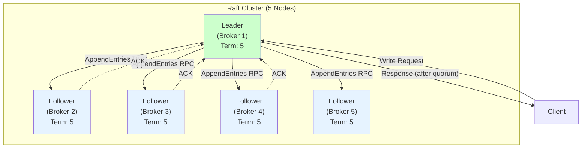
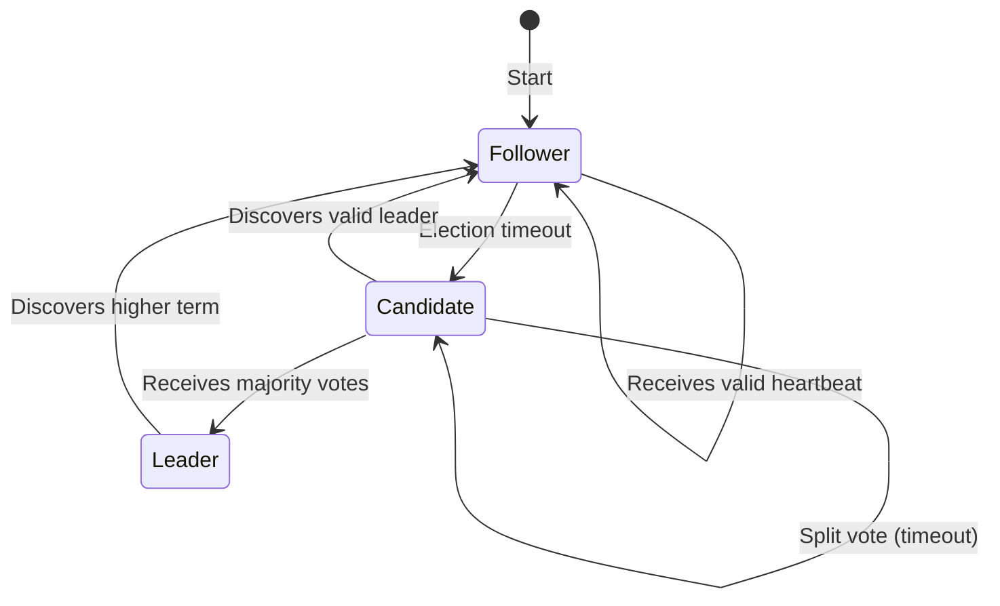
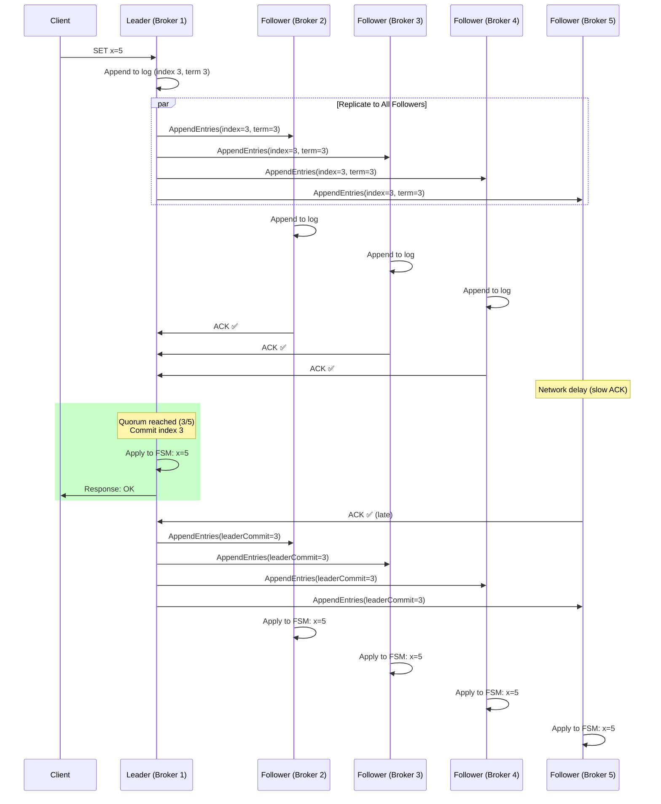
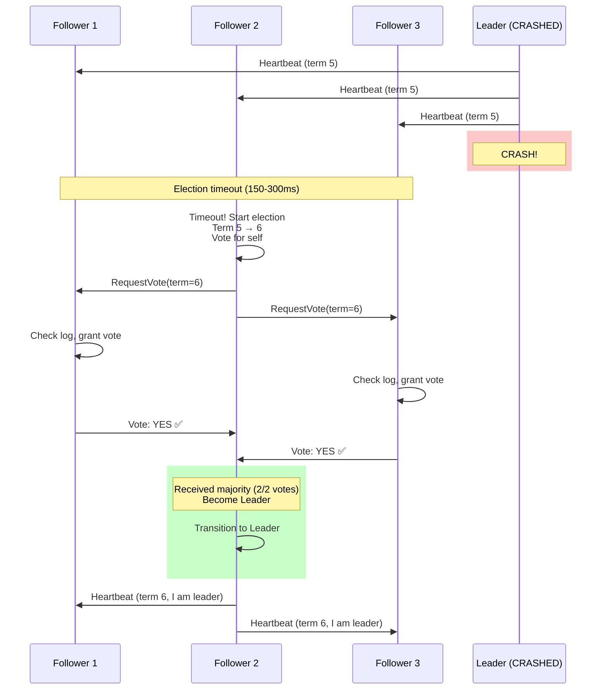
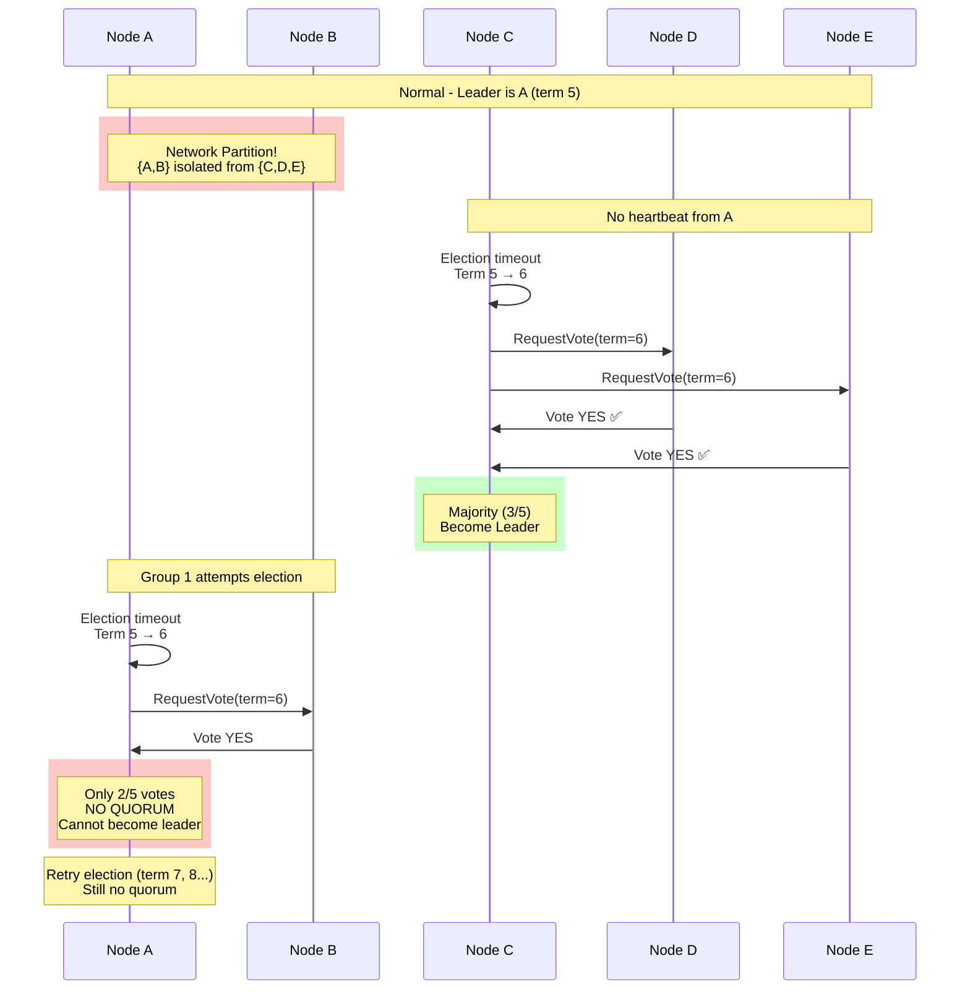
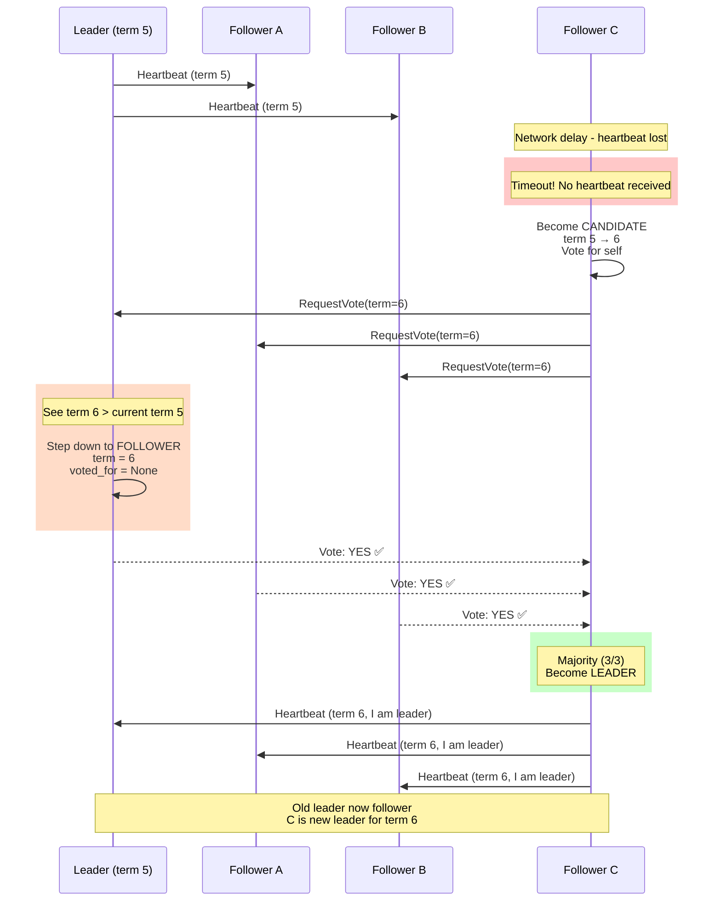

# 01. Raft Consensus Algorithm

## 1. Introduction

**Demo**: [The Secret Lives of Data - Raft Visualization](https://thesecretlivesofdata.com/raft/)

In distributed systems, **consensus** is the fundamental challenge of getting independent computers to agree on shared state, even during failures. For years, **Paxos** was the dominant solution—mathematically correct but notoriously complex and difficult to implement.

In 2014, Diego Ongaro and John Ousterhout introduced **Raft**, a consensus algorithm designed with a primary goal: **understandability**. Raft achieves the same guarantees as Paxos but is far easier to understand by breaking consensus into three distinct subproblems: **leader election**, **log replication**, and **safety**.

**Why Raft Matters**: Raft is the de-facto standard for building **strongly-consistent, fault-tolerant services** in modern distributed systems. It powers critical infrastructure like:
- **etcd** (Kubernetes cluster metadata)
- **Consul** (service discovery and configuration)
- **CockroachDB** (distributed SQL database)

**Key Differentiator**: Unlike Paxos, Raft prioritizes **understandability** without sacrificing correctness or performance. This makes it easier to implement, debug, and reason about in production systems.

---

## 2. Core Architecture

Raft implements **replicated state machines**: a log of commands is replicated across servers, and each server's state machine executes the same sequence of commands, ensuring all servers arrive at the same state.



### Key Components

1.  **Server States**: Every server is in one of three states:
    - **Leader**: Handles all client requests, manages log replication, sends heartbeats
    - **Follower**: Passive, responds to leader/candidate requests
    - **Candidate**: Transitional state during leader election

2.  **Term**: Logical clock dividing time into arbitrary periods. Each term begins with an election. Terms detect stale leaders.

3.  **Replicated Log**: Ordered sequence of commands stored on each server. Consistency achieved when all servers agree on entries and order.

4.  **Finite State Machine (FSM)**: Deterministic state machine on each server. Applying the same log entries in order produces identical states.

5.  **Quorum**: Majority of servers ((N/2) + 1). Required for leader election and log commits. Enables fault tolerance.

6.  **RPCs**:
    - **RequestVote**: Candidates request votes during elections
    - **AppendEntries**: Leader replicates log entries + heartbeats

---

## 3. How It Works: The Three Subproblems

### A. Leader Election

**Goal**: Elect a single leader to manage the cluster.

**Process**:
1.  **Timeout**: Follower starts election if no heartbeat within election timeout (150-300ms)
2.  **Candidacy**: Follower → Candidate, increments term, votes for self, sends RequestVote RPCs
3.  **Voting**: Each server votes once per term
4.  **Outcome**:
    - **Win**: Receives majority votes → Becomes leader, sends heartbeats
    - **Discover Leader**: Receives AppendEntries from valid leader → Becomes follower
    - **Split Vote**: No majority → New term, new election (randomized timeouts prevent cycles)



### B. Log Replication

**Goal**: Ensure all servers have identical, ordered logs.

**Process**:
1.  **Client Request**: Leader appends command to its log
2.  **Replicate**: Leader sends AppendEntries RPCs to all followers (parallel)
3.  **Acknowledge**: Followers append entry, send ACK
4.  **Commit**: Leader commits entry when **quorum** ACKs (entry is durable)
5.  **Apply**: Leader applies to FSM, returns result to client, notifies followers to apply

**Log Matching Property**: If two logs have an entry with the same index and term, all preceding entries are identical.

### C. Safety

**Critical Guarantees**:

| Property | Guarantee |
| :--- | :--- |
| **Election Safety** | Only one leader per term (majority vote requirement) |
| **Leader Append-Only** | Leader never overwrites/deletes log entries |
| **Log Matching** | Same index+term → identical logs up to that point |
| **Leader Completeness** | Committed entries present in all future leaders |
| **State Machine Safety** | Servers never apply different commands at same index |

---

## 4. Deep Dive: Internal Implementation

### A. Term Numbers and Voting

**Term as Logical Clock**:
- Server A: Term 5 (Leader)
- Server B: Term 5 (Follower)
- Server C: Term 3 (Stale, must update)
- **Rule**: Server rejects RPCs with term < current term

**Voting Process Steps**:

1. **Reject Stale Candidates**:
   - If candidate's term < current term → Reject immediately

2. **Update Term When Candidate is Ahead**:
   - If candidate's term > current term → Update current term to match
   - Reset the vote (haven't voted for anyone yet)
   - **CRITICAL**: Even if you're the LEADER, step down to follower when seeing higher term

3. **Cast Vote Based on Eligibility**:
   - Only vote if: (haven't voted yet OR already voted for this candidate) AND
   - Candidate's log is at least as up-to-date as yours
   - If both conditions met → Grant vote

**Determining if Candidate's Log is Up-to-Date**:

1. **Compare Last Term**:
   - If candidate's last log term > your last log term → Candidate is up-to-date ✅

2. **If Terms Equal, Compare Length**:
   - If candidate's last log term == your last log term AND
   - Candidate's log length >= your log length → Candidate is up-to-date ✅

3. **Otherwise**:
   - Candidate's log is behind → Do NOT grant vote ❌

### B. Log Replication Mechanics

**AppendEntries RPC Contains**:
- `term`: Leader's current term
- `leader_id`: ID of the leader sending this request
- `prev_log_index`: Index of log entry immediately before the new ones
- `prev_log_term`: Term of the entry at prev_log_index
- `entries`: Log entries to replicate (empty for heartbeat)
- `leader_commit`: Leader's commit index

**Follower's Steps When Receiving AppendEntries**:

1. **Validate Leader's Term**:
   - If leader's term < current term → Reject (leader is stale) ❌

2. **Acknowledge Leader**:
   - Recognize this node as the current leader
   - Reset election timer (prevents starting unnecessary election)

3. **Check Log Consistency**:
   - Verify that the log entry at `prev_log_index` has term matching `prev_log_term`
   - If log doesn't match → Reject (logs are inconsistent) ❌

4. **Append New Entries**:
   - For each entry to append:
     - If an existing entry conflicts (same index, different term) → Delete that entry and all following it
     - Append the new entry

5. **Update Commit Index**:
   - If leader's commit index > follower's commit index
   - Update follower's commit index to min(leader_commit, last log index)

6. **Return Success** ✅

### C. Commit Index Propagation

**Leader Tracks Followers Using**:

1. **For Each Follower, Maintain**:
   - `next_index[follower]`: Index of next log entry to send to this follower
   - `match_index[follower]`: Highest log entry known to be replicated on this follower

2. **After Successful AppendEntries ACK**:
   - Update `match_index[follower]` = last appended index
   - Update `next_index[follower]` = last appended index + 1

3. **Commit Rule - Advance commit_index When**:
   - For each log index from (current commit_index + 1) to (end of log):
     - Check if entry's term == current term (only commit entries from current term)
     - Count how many followers have replicated this entry (match_index >= n)
     - If count >= quorum → Commit entry at index n
     - Apply committed entry to state machine

### D. Commit Index vs Applied Index

**Understanding Two Important Indices**:

In Raft, there are two separate indices that track different stages of log processing:

1. **`commit_index`**: 
   - Highest log entry that is **committed** (safe, durable, won't be lost)
   - Entry is committed when replicated to majority
   - Updates immediately when quorum is reached

2. **`applied_index`**: 
   - Highest log entry that has been **applied to the state machine**
   - Entry is applied when actually executed (e.g., updating database, modifying data structures)
   - Updates after commit, usually with some delay

**Why They're Different:**

```
Timeline of a Write Operation:

t=1: Entry replicated to majority → commit_index = 5 ✅
t=2: Entry applied to state machine → applied_index = 5 ✅
     
There's a gap because applying can be slower than committing!
```

**Example Scenario:**

```
Current Log: [1] [2] [3] [4] [5]

commit_index = 5     (entries 1-5 are safe/durable)
applied_index = 3    (only 1-3 executed by state machine)

Gap: Entries 4-5 are committed but not yet applied
```

**Why the Gap Exists:**

| Reason | Explanation |
|:-------|:------------|
| **Async Processing** | State machine processes entries in background to avoid blocking |
| **Slow Operations** | Applying might involve disk I/O, database updates, complex computation |
| **Batching** | State machine might batch multiple entries for efficiency |
| **Performance** | Leader can commit faster than it can apply, improving throughput |

**Safety Guarantee:**

- **Committed but not applied** → Safe! Entry won't be lost, will eventually be applied ✅
- **Applied but not committed** → **IMPOSSIBLE!** Never happens in Raft ❌

**Key Rule**: `applied_index` ≤ `commit_index` (always)

---

### E. Processing Read-Only Queries (ReadIndex)

**Problem**: Read-only queries don't modify state, so they don't need to be written to the log. However, **reading directly from state machine can return stale data**.

**Why Stale Reads Happen**:

**Scenario**: Leader is partitioned but doesn't know it yet
- **Old Leader (isolated)**:
  - Thinks it's still leader
  - commit_index = 100
  - Serves reads from stale state
  
- **New Leader (with majority)**:
  - Elected in term 6
  - commit_index = 105
  - Has latest committed data
  
- **Problem**: If old leader serves reads without verification → Returns data from index 100 (STALE!) ❌

---

**Solution 1: Read Through Log (Too Expensive)**

Treat every read as a write:

1. Client sends: "Read X"
2. Leader appends "Read X" to log (**disk write!**)
3. Leader replicates to majority (full Raft consensus)
4. **Each follower writes "Read X" to their log (disk I/O!)**
5. Followers ACK after disk write completes
6. Leader commits the read entry
7. Leader applies to state machine and returns value

**Guarantee**: Linearizable (always latest) ✅  
**Problem**: Requires **full log replication with disk writes** for EVERY read (very slow!) ⚠️  
**Typical Latency**: ~50ms (disk I/O bound)

---

**Solution 2: ReadIndex (Recommended by Paper)**

Verify leadership without going through the log:

1. Leader receives read request
2. Leader records `readIndex` = current `commit_index` **(memory only, no disk!)**
3. Leader sends **heartbeat** (empty AppendEntries, **no log entries!**)
4. **Followers immediately ACK (no disk I/O needed!)**
5. Wait for majority ACKs (proves still leader)
6. Wait until `applied_index` >= `readIndex` (usually instant)
7. Read from state machine and return

**Guarantee**: Linearizable ✅  
**Cost**: 1 network round-trip only (no disk I/O!)  
**Typical Latency**: ~5-10ms (network only, **5-10x faster** than reading through log)

**Key Difference**: The heartbeat doesn't carry log entries, so followers can ACK immediately without writing to disk!

---

**ReadIndex Steps in Detail**:

1. **Record Current Commit Point**:
   - Store `read_index` = current `commit_index`

2. **Verify Leadership**:
   - Send heartbeat (AppendEntries) to all followers
   - Count ACKs received
   - If ACKs >= quorum → Leadership confirmed ✅
   - If ACKs < quorum → Return error (might be partitioned) ❌

3. **Wait for State Machine to Catch Up**:
   - Wait until `applied_index` >= `read_index`

4. **Safe to Read**:
   - Read value from state machine
   - Return to client

---

**Why This Works**:

**If leader gets majority ACKs**:
- Leader is definitely current (not partitioned) ✅
- No new leader could have been elected ✅
- Data at readIndex is committed and won't be lost ✅

**If leader cannot get majority**:
- Leader might be partitioned ⚠️
- Return error, client can retry with actual leader

---

**Example Timeline**:

- **t=0**: Client → Leader: Read("config/db")
- **t=1**: Leader: `readIndex = 100` (current commit_index)
- **t=2**: Leader → Follower 1: Heartbeat  
          Leader → Follower 2: Heartbeat
- **t=3**: Follower 1 → Leader: ACK  
          Follower 2 → Leader: ACK
- **t=4**: Leader: Majority confirmed! (3/3 nodes)
- **t=5**: Leader: Check `applied_index >= 100` ✅
- **t=6**: Leader: Read from state machine
- **t=7**: Leader → Client: "config/db = postgres:5432"

**Total latency**: ~5-10ms (vs ~50ms for log-based read)

---

**Performance Comparison**:

| Operation | Read Through Log | ReadIndex |
|:----------|:----------------|:----------|
| **Leader disk writes** | ✍️ Yes (append to log) | ❌ No |
| **Follower disk writes** | ✍️ Yes (all followers) | ❌ No |
| **Log operations** | Append, replicate, commit | ❌ None |
| **What followers do** | Write "Read X" to log, then ACK | Immediately ACK heartbeat |
| **Network round-trips** | 1 (but waiting for disk I/O) | 1 (network only) |
| **Typical latency** | ~50ms (disk I/O bound) | ~5-10ms (network only) |
| **Speedup** | Baseline | **5-10x faster** ⚡ |

**Bottom Line**: Both approaches contact followers and wait for majority ACKs, but ReadIndex uses empty heartbeats (no log entries), so followers respond instantly without disk I/O!

---

## 5. End-to-End Walkthrough: Client Write

Let's trace a client write (`SET x=5`) through a 5-node Raft cluster.

### Step 1: Client Sends Request to Leader
```
Client → Leader (Broker 1): SET x=5
```

### Step 2: Leader Appends to Log
```
Leader's Log:
Index: 0     1     2     3  ← New
Term:  1     1     2     3
Entry: ...  ...  ...  SET x=5
```

### Step 3: Leader Replicates (AppendEntries)


### Step 4: Commit and Apply
```
Leader state:
- match_index: {F1: 3, F2: 3, F3: 3, F4: 2}
- Quorum (3/5) has index 3 → Commit index 3
- Apply to FSM: x=5
- Return to client: OK

Followers (on next heartbeat):
- Receive leaderCommit=3
- Update their own commit_index to 3
- Apply to FSM: x=5
```

**Result**: All 5 servers have `x=5` in their state machines, even though F4 was slow.

---

## 6. Failure Scenarios

### Scenario A: Leader Failure (Election)

**Symptom**: Leader crashes, followers stop receiving heartbeats.
**Cause**: Hardware failure, network partition, process crash.

#### The Mechanism



**Timeline**:
1.  **t=0**: Leader sends heartbeat (term 5)
2.  **t=1s**: Leader crashes
3.  **t=1.2s**: Follower 2's election timeout triggers (fastest)
4.  **t=1.2s**: Follower 2 → Candidate, term 5→6, votes for self
5.  **t=1.25s**: sends RequestVote RPCs
6.  **t=1.3s**: Receives 2 votes (majority) → Becomes leader
7.  **t=1.31s**: Sends heartbeats (establishes authority)

**Result**: New leader elected in ~100-200ms. No data loss (all committed entries preserved by Leader Completeness Property).

---

### Scenario B: Network Partition (Split-Brain Prevention)

**Symptom**: Cluster divided into two groups, both try to elect leaders.
**Cause**: Network failure splits cluster into isolated groups.

#### The Problem

```
Cluster: 5 nodes {A, B, C, D, E}
Network partition: {A, B} | {C, D, E}

Could we get 2 leaders?
- Group 1 (A, B): 2/5 nodes (NO QUORUM)
- Group 2 (C, D, E): 3/5 nodes (QUORUM)

Raft's safety: Only Group 2 can elect a leader
```

#### The Mechanism



**Why No Split-Brain**:
1.  **Quorum Requirement**: Leader needs (N/2)+1 votes
2.  **Group 1** (A, B): Only 2/5 votes → Cannot elect leader
3.  **Group 2** (C, D, E): 3/5 votes → Can elect leader (C)
4.  **Result**: Only one group can have a leader at any time

**Impact**: Group 1 (A, B) becomes **unavailable** (cannot serve writes). Group 2 (C, D, E) continues serving traffic.

---

### Scenario C: Log Divergence (Committed vs Uncommitted Entries)

**Symptom**: Follower's log conflicts with leader's log after crashes.
**Cause**: Leaders crash at different stages of commit process.

#### Key Insight: Replicated ≠ Committed

```
Entry is REPLICATED: Stored on majority of nodes
Entry is COMMITTED:  Replicated + leader applied to FSM + follower notified
```

**Commit Process:**
1. Leader receives write, replicates to majority (REPLICATED)
2. Leader applies to state machine, returns "OK" to client (COMMITTED)  
3. Leader sends heartbeat with `leader_commit` (followers commit)

**If leader crashes between steps, different outcomes occur.**

---

#### The Scenario

**Initial State (Leader A, term 3)**:
```
Leader A:    [1:1] [2:1] [3:2] [4:3]  ← Entry [4:3] replicated to A+B
Follower B:  [1:1] [2:1] [3:2] [4:3]  
Follower C:  [1:1] [2:1] [3:2]        ← Missing [4:3]
```

**Case 1: Entry [4:3] NOT Committed**
```
A crashes before sending heartbeat → B's commit_index = 3 (doesn't know [4:3] committed)
B becomes leader (term 4), adds [5:4]
B crashes
C becomes leader (term 5) by default, adds [4:5]

When B recovers:
Leader C:  [1:1] [2:1] [3:2] [4:5]
B:         [1:1] [2:1] [3:2] [4:3] [5:4] ← CONFLICT

C sends AppendEntries → B deletes [4:3] and [5:4], accepts [4:5]
✅ SAFE: Client never got "OK" for [4:3]/[5:4], must retry
```

**Case 2: Entry [4:3] IS Committed**
```
A sends heartbeat → B commits [4:3] (commit_index=4, applied to FSM)
A crashes

Election: C tries to become leader
B votes NO (C's log behind: last term 2 < B's last term 3)
B becomes leader, replicates [4:3] to C
✅ SAFE: Committed entry preserved (Leader Completeness Property)
```

---

#### Leader Completeness Property

**Guarantee**: If an entry is committed, all future leaders will have it.

**How**: 
- Committed entry → On majority of nodes
- New leader → Must get majority votes
- Voting rule → Only vote if candidate's log ≥ mine
- Result → Leader always has committed entries ✅

---

#### Majority Failure

**If both A and B die after [4:3] is committed:**
```
- C cannot elect itself (needs 2/3 votes, only has 1)
- Cluster UNAVAILABLE ❌
- Data safe on A/B's disks ✅
- Recovers when A or B restarts

Fault tolerance: 3-node cluster tolerates 1 failure, not 2
```

**Summary Table:**

| Scenario | [4:3] Committed? | C Can Become Leader? | Safe? |
|----------|------------------|----------------------|-------|
| A crashes before heartbeat | ❌ NO | ✅ YES | ✅ Client didn't get "OK" |
| A crashes after B commits | ✅ YES | ❌ NO | ✅ B votes against C |
| Both A+B dead | ✅ YES (on disk) | ❌ NO | ✅ Cluster unavailable, data safe |

---

### Scenario D: Late Leader Heartbeat → Unnecessary Election

**Symptom**: Leader is alive and functioning, but one follower starts an unnecessary election due to missed heartbeats.
**Cause**: Network delay/packet loss causes heartbeat to arrive late at one follower.

#### The Problem

```
t=0s:  Leader (term 5) sends heartbeat to all followers
t=0.1s: Follower A receives heartbeat → reset timer
t=0.1s: Follower B receives heartbeat → reset timer  
t=0.1s: Follower C's heartbeat LOST (network glitch)

t=5s:  Leader sends another heartbeat
t=5.1s: A, B receive → reset timers
t=5.1s: C's heartbeat LOST again (bad network path)

t=10s: C's election timeout fires (no heartbeat for 10s)
t=10s: C → CANDIDATE, term 5 → 6, votes for self
```

#### The Mechanism



#### Timeline Breakdown

```
t=10.0s: C's election timeout expires
         C → CANDIDATE
         current_term = 6
         voted_for = C (self)
         
t=10.1s: C sends RequestVote(term=6) to Leader, A, B

# At the old Leader:
t=10.2s: Leader receives RequestVote(term=6)
         → def on_request_vote(C, term=6, ...):
         → See: candidate_term (6) > current_term (5)
         → Action: current_term = 6
         → Action: step_down_to_follower()  # Leader → Follower!
         → Action: voted_for = None
         → Check: C's log up-to-date? YES
         → Return: Vote YES ✅

# At Follower A:
t=10.2s: A receives RequestVote(term=6)
         → See: term 6 > current term 5
         → Update: current_term = 6
         → voted_for = None
         → Check: C's log up-to-date? YES
         → Return: Vote YES ✅

# At Follower B:
t=10.2s: (same as A, votes YES)

t=10.3s: C receives 3 votes (including self)
         → 3/3 = majority!
         → Transition: CANDIDATE → LEADER
         → Start sending heartbeats

t=10.4s: All nodes receive heartbeat(term=6) from C
         → They recognize C as new leader

t=10.5s: System back to normal, C is now leader
```

**Total Disruption Time**: ~300ms (from when C starts election to when it sends first heartbeat as leader)

#### Why This is SAFE (Not a Bug, It's a Feature!)

**This behavior prevents split-brain scenarios:**

```python
# Imagine the old leader was actually partitioned:
# - Old leader can see Follower A (minority)
# - Followers B, C can't reach old leader (majority)
# 
# Without stepping down:
# - Old leader thinks it's still leader
# - B, C elect new leader
# - TWO LEADERS → Split brain!
#
# With stepping down:
# - Old leader sees higher term → steps down immediately
# - Even if it was healthy, it recognizes newer authority
# - Only ONE leader can exist (C in term 6)
```

**Key Safety Properties:**
1. **Old leader cannot commit** any writes once C starts election (term mismatch)
2. **No data loss**: All committed entries preserved (Leader Completeness Property)
3. **Brief unavailability**: Writes fail for ~100-300ms during election
4. **Automatic recovery**: System self-heals, new leader established

#### Prevention Strategies

**1. Tune Election Timeout Higher**:
- Increase election timeout: `random(1500ms, 3000ms)` instead of `150-300ms`
- Keep heartbeat interval: `100ms`
- **Effect**: Now need to miss 15-30 consecutive heartbeats before election starts
- **Benefit**: Much less likely to trigger from transient network issues

**2. Monitor Network Health**:
- **Track packet loss** between Raft nodes:
  - Use: `ping -c 100 node-C`
  - If packet loss > 1% → investigate network issues

- **Monitor leader election rate**:
  - Use: `rate(raft_leader_elections_total[1h])`
  - Alert if > 1 election/hour (indicates instability)

**3. Use Dedicated Network**:
- Don't share network with application traffic
- Give Raft its own VLAN/subnet for reliable heartbeats
- Prevents application traffic from interfering with consensus

**4. Pre-Vote Extension** (Raft optimization):
- **Before becoming CANDIDATE**, ask: "Would you vote for me?"
- Only become CANDIDATE if majority says "yes"
- **Steps**:
  1. Node about to timeout sends "pre-vote" request
  2. Other nodes respond: "I would vote for you" (but don't actually vote yet)
  3. If majority would vote → become CANDIDATE and start real election
  4. If majority wouldn't vote → stay FOLLOWER
- **Benefit**: Prevents unnecessary elections from a single slow node

#### When Is This Actually a Problem?

**Bad Network Patterns**:

**Symptom**: Follower C consistently slower than A, B  
**Cause**: C is in different rack/AZ with higher latency

**Timeline**:
- **t=0s**: Heartbeat sent → A receives in 1ms, B receives in 1ms, C receives in 15ms
- **t=0.05s**: Leader sends another heartbeat
- **t=0.06s**: A and B receive immediately
- **t=0.07s**: C receives previous heartbeat (delayed 70ms!)
- **t=0.10s**: Leader sends another heartbeat
- C still processing previous one, misses this one
- **t=0.15s**: Election timeout triggered!

**Solution**: Move C to same datacenter/AZ as other nodes

**Statistics from Production Systems**:
- **etcd**: Recommends election timeout = 10× heartbeat interval
- **Consul**: Default 150-300ms election timeout, 50ms heartbeat
- **Research**: <1% false elections if timeout > 30× network latency

---

## 7. Performance Tuning

| Configuration | Default | Recommended Range | Impact |
| :--- | :--- | :--- | :--- |
| **Election Timeout** | 150-300ms | 150-300ms (randomized) | Lower = faster failover, higher = fewer spurious elections |
| **Heartbeat Interval** | 50ms | heartbeat < election_timeout / 2 | Prevents unnecessary elections |
| **Batch Commit** | Disabled | 10-100 entries/batch | Reduces AppendEntries RPCs (trades latency for throughput) |
| **Snapshot Interval** | 10,000 entries | 5,000-50,000 entries | More frequent = smaller log, less frequent = faster recovery |
| **Max Log Size** | Unlimited | 1GB-10GB | Prevent unbounded log growth |

**Election Timeout Tuning**:

**Rule**: `election_timeout >> network_latency`

**Examples**:
- **Same datacenter**:
  - Network latency: 5ms
  - Recommended: 150-300ms (30-60x network latency)

- **Cross-AZ**:
  - Network latency: 50ms
  - Recommended: 500ms-1s

---

**Batch Commit Optimization**:

**Instead of**: Committing each entry individually
- Each entry needs 1 RTT
- Low throughput for many small writes

**Better approach**: Batch multiple entries
1. Collect entries for 10ms
2. Replicate and commit entire batch in 1 RTT

**Result**: 10x throughput improvement for write-heavy workloads

---

## 8. Constraints & Limitations

| Constraint | Limit | Why? |
| :--- | :--- | :--- |
| **Fault Tolerance** | Can tolerate (N-1)/2 failures | Requires majority quorum ((N/2)+1) |
| **Minimum Cluster Size** | 3 nodes | 1-node: no fault tolerance, 2-node: split-brain risk |
| **Write Latency** | 2 RTTs minimum | 1 RTT: replicate, 1 RTT: commit notification |
| **Cross-Region** | NOT recommended | High latency (80-100ms) causes frequent elections |
| **Total Throughput** | ~10k writes/sec | Single-leader bottleneck (all writes go through leader) |
| **Log Growth** | Unbounded (without snapshots) | Must implement snapshotting for long-running systems |

**Key Limitation**: **Cannot tolerate N/2 failures**.

| Cluster Size | Tolerated Failures | Quorum |
|:-------------|:-------------------|:-------|
| 3            | 1                  | 2      |
| 5            | 2                  | 3      |
| 7            | 3                  | 4      |
| 9            | 4                  | 5      |

**Why Odd Numbers?**: 4-node cluster tolerates only 1 failure (same as 3-node), so 3 is more cost-effective.

---

## 9. When to Use Raft?

| Use Case | Verdict | Alternative |
| :--- | :--- | :--- |
| **Cluster Configuration** (etcd, Consul) | ✅ **BEST CHOICE** | ZAB (ZooKeeper) |
| **Distributed Lock Service** | ✅ **BEST CHOICE** | Chubby (Google), ZooKeeper |
| **Metadata Store** (Kubernetes, CockroachDB) | ✅ **BEST CHOICE** | Paxos (harder to implement) |
| **Single-Region Strong Consistency** | ✅ **YES** | Multi-Paxos |
| **Cross-Region Replication** | ❌ **NO** | Async replication (Kafka, Postgres WAL) |
| **High-Throughput Writes** (>100k/sec) | ❌ **NO** | Leaderless (Cassandra) or Sharding |
| **Understandability Required** | ✅ **YES** | Paxos is more complex |

### Raft vs Alternatives

**Raft vs Paxos**:
- Raft: Easier to understand, easier to implement
- Paxos: More variants (Multi-Paxos, Fast Paxos), more research literature
- **Verdict**: Use Raft unless you need a specific Paxos variant

**Raft vs ZAB (ZooKeeper Atomic Broadcast)**:
- Both leader-based, similar performance
- ZAB: Tightly coupled to ZooKeeper
- Raft: General-purpose, more implementations
- **Verdict**: Use Raft for new projects, ZAB if using ZooKeeper

**Raft vs Leaderless (Cassandra, DynamoDB)**:
- Raft: Strong consistency, single leader (bottleneck)
- Leaderless: Eventual consistency, higher throughput
- **Verdict**: Use Raft for strong consistency, Leaderless for high availability

---

## 10. Production Checklist

1.  [ ] **Cluster Size**: Use odd numbers (3, 5, 7). Don't exceed 7 (diminishing returns).
2.  [ ] **Same Region**: Deploy all nodes in same region (cross-region breaks Raft assumptions).
3.  [ ] **Election Timeout**: Set to 30-60x network latency. Use randomization (150-300ms range).
4.  [ ] **Heartbeat Interval**: Set to < election_timeout / 2 (typically 50ms).
5.  [ ] **Monitor Elections**: Alert on frequent leader changes (>1/hour indicates instability).
6.  [ ] **Snapshot Configuration**: Enable automatic snapshots every 5k-50k log entries.
7.  [ ] **Disk I/O**: Use SSDs for log storage (faster commits, faster recovery).
8.  [ ] **Network Reliability**: Ensure low latency (<10ms) and low packet loss (<0.1%).
9.  [ ] **Capacity Planning**: Leader CPU is bottleneck. Monitor leader CPU usage.
10. [ ] **Test Failover**: Run chaos testing (kill leader, verify <1s recovery time).

---

## Works Cited

1. What is the Raft Consensus Algorithm? - Yugabyte, [https://www.yugabyte.com/key-concepts/raft-consensus-algorithm/](https://www.yugabyte.com/key-concepts/raft-consensus-algorithm/)
2. Deep Dive into Raft: Consensus Algorithms in Distributed Systems | Medium, [https://medium.com/@hsinhungw/deep-dive-into-raft-consensus-algorithms-in-distributed-systems-6052231ca0e5](https://medium.com/@hsinhungw/deep-dive-into-raft-consensus-algorithms-in-distributed-systems-6052231ca0e5)
3. What is Paxos Consensus Algorithm? Definition & FAQs | ScyllaDB, [https://www.scylladb.com/glossary/paxos-consensus-algorithm/](https://www.scylladb.com/glossary/paxos-consensus-algorithm/)
4. Raft (algorithm) - Wikipedia, [https://en.wikipedia.org/wiki/Raft_(algorithm)](https://en.wikipedia.org/wiki/Raft_(algorithm))
5. Consensus | Consul - HashiCorp Developer, [https://developer.hashicorp.com/consul/docs/concept/consensus](https://developer.hashicorp.com/consul/docs/concept/consensus)
6. Leader Follower Pattern in Distributed Systems - GeeksforGeeks, [https://www.geeksforgeeks.org/system-design/leader-follower-pattern-in-distributed-systems/](https://www.geeksforgeeks.org/system-design/leader-follower-pattern-in-distributed-systems/)
