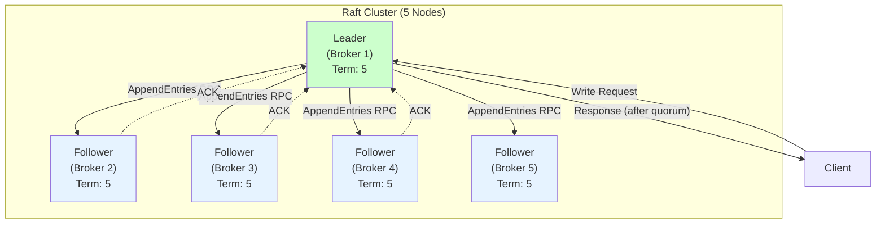
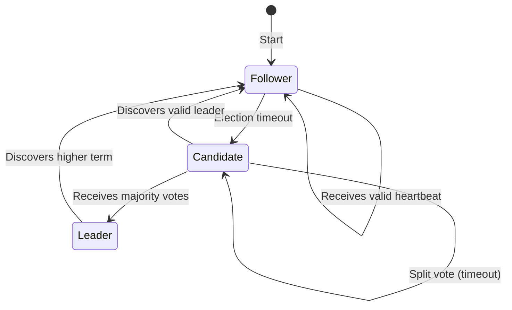
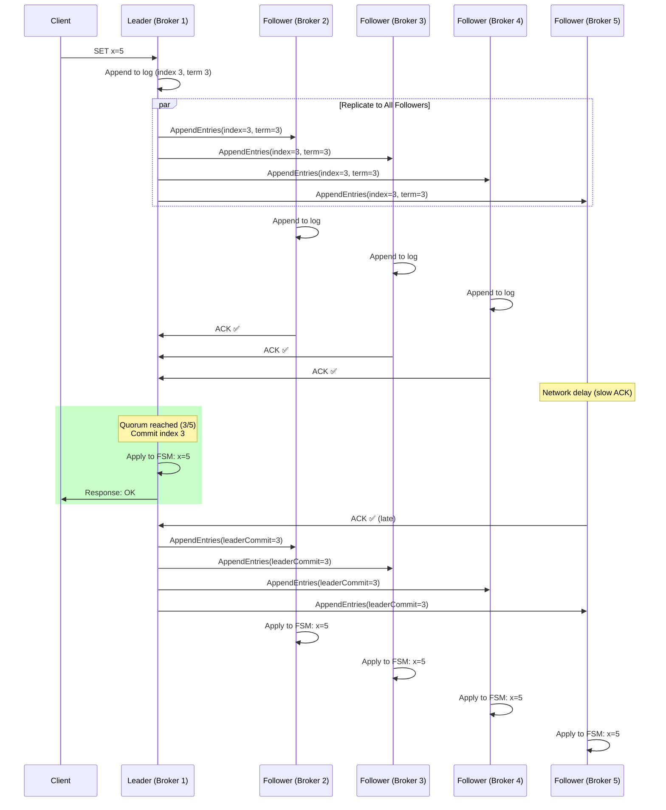
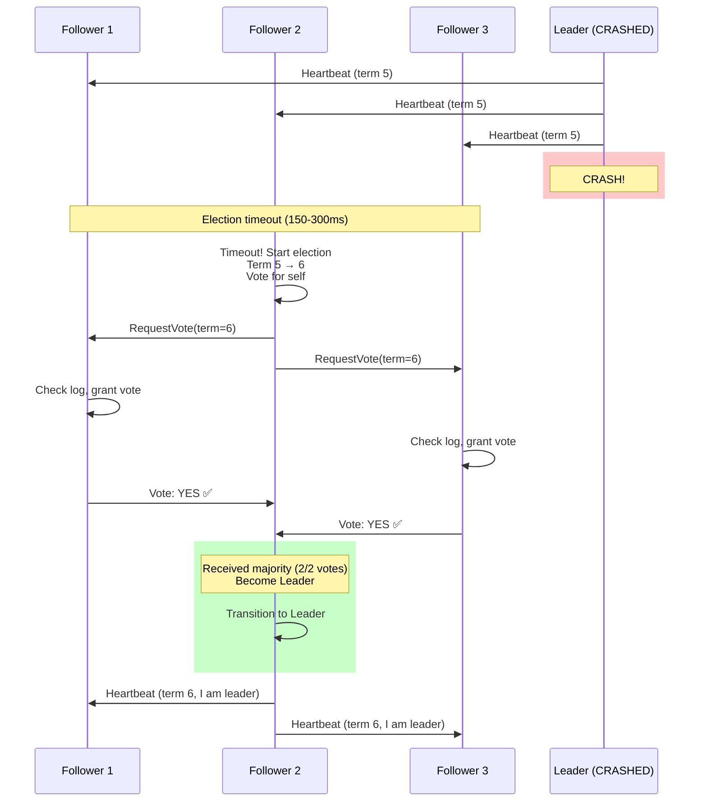
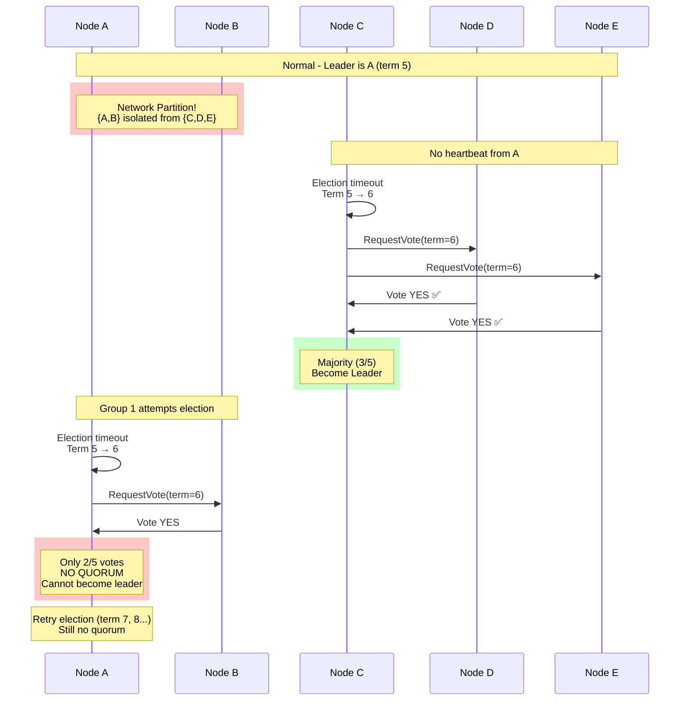

# 01. Raft Consensus Algorithm

## 1. Introduction

**Demo**: [The Secret Lives of Data - Raft Visualization](https://thesecretlivesofdata.com/raft/)

In distributed systems, **consensus** is the fundamental challenge of getting independent computers to agree on shared state, even during failures. For years, **Paxos** was the dominant solution—mathematically correct but notoriously complex and difficult to implement.

In 2014, Diego Ongaro and John Ousterhout introduced **Raft**, a consensus algorithm designed with a primary goal: **understandability**. Raft achieves the same guarantees as Paxos but is far easier to understand by breaking consensus into three distinct subproblems: **leader election**, **log replication**, and **safety**.

**Why Raft Matters**: Raft is the de-facto standard for building **strongly-consistent, fault-tolerant services** in modern distributed systems. It powers critical infrastructure like:
- **etcd** (Kubernetes cluster metadata)
- **Consul** (service discovery and configuration)
- **CockroachDB** (distributed SQL database)

**Key Differentiator**: Unlike Paxos, Raft prioritizes **understandability** without sacrificing correctness or performance. This makes it easier to implement, debug, and reason about in production systems.

---

## 2. Core Architecture

Raft implements **replicated state machines**: a log of commands is replicated across servers, and each server's state machine executes the same sequence of commands, ensuring all servers arrive at the same state.



### Key Components

1.  **Server States**: Every server is in one of three states:
    - **Leader**: Handles all client requests, manages log replication, sends heartbeats
    - **Follower**: Passive, responds to leader/candidate requests
    - **Candidate**: Transitional state during leader election

2.  **Term**: Logical clock dividing time into arbitrary periods. Each term begins with an election. Terms detect stale leaders.

3.  **Replicated Log**: Ordered sequence of commands stored on each server. Consistency achieved when all servers agree on entries and order.

4.  **Finite State Machine (FSM)**: Deterministic state machine on each server. Applying the same log entries in order produces identical states.

5.  **Quorum**: Majority of servers ((N/2) + 1). Required for leader election and log commits. Enables fault tolerance.

6.  **RPCs**:
    - **RequestVote**: Candidates request votes during elections
    - **AppendEntries**: Leader replicates log entries + heartbeats

---

## 3. How It Works: The Three Subproblems

### A. Leader Election

**Goal**: Elect a single leader to manage the cluster.

**Process**:
1.  **Timeout**: Follower starts election if no heartbeat within election timeout (150-300ms)
2.  **Candidacy**: Follower → Candidate, increments term, votes for self, sends RequestVote RPCs
3.  **Voting**: Each server votes once per term
4.  **Outcome**:
    - **Win**: Receives majority votes → Becomes leader, sends heartbeats
    - **Discover Leader**: Receives AppendEntries from valid leader → Becomes follower
    - **Split Vote**: No majority → New term, new election (randomized timeouts prevent cycles)



### B. Log Replication

**Goal**: Ensure all servers have identical, ordered logs.

**Process**:
1.  **Client Request**: Leader appends command to its log
2.  **Replicate**: Leader sends AppendEntries RPCs to all followers (parallel)
3.  **Acknowledge**: Followers append entry, send ACK
4.  **Commit**: Leader commits entry when **quorum** ACKs (entry is durable)
5.  **Apply**: Leader applies to FSM, returns result to client, notifies followers to apply

**Log Matching Property**: If two logs have an entry with the same index and term, all preceding entries are identical.

### C. Safety

**Critical Guarantees**:

| Property | Guarantee |
| :--- | :--- |
| **Election Safety** | Only one leader per term (majority vote requirement) |
| **Leader Append-Only** | Leader never overwrites/deletes log entries |
| **Log Matching** | Same index+term → identical logs up to that point |
| **Leader Completeness** | Committed entries present in all future leaders |
| **State Machine Safety** | Servers never apply different commands at same index |

---

## 4. Deep Dive: Internal Implementation

### A. Term Numbers and Voting

**Term as Logical Clock**:
```
Server A: Term 5 (Leader)
Server B: Term 5 (Follower)
Server C: Term 3 (Stale, must update)

Rule: Server rejects RPCs with term < current term
```

**Voting Algorithm**:
```python
def on_request_vote(candidate_id, candidate_term, last_log_index, last_log_term):
    # Reject if candidate's term is stale
    if candidate_term < current_term:
        return False
    
    # Update term if candidate is ahead
    if candidate_term > current_term:
        current_term = candidate_term
        voted_for = None  # Reset vote
    
    # Vote if haven't voted yet AND candidate's log is up-to-date
    if (voted_for is None or voted_for == candidate_id) and \
       is_log_up_to_date(last_log_term, last_log_index):
        voted_for = candidate_id
        return True
    
    return False

def is_log_up_to_date(candidate_last_term, candidate_last_index):
    # Candidate's log is up-to-date if:
    # 1. Last term is greater, OR
    # 2. Last term is same AND last index >= ours
    my_last_term = log[-1].term
    my_last_index = len(log) - 1
    
    if candidate_last_term > my_last_term:
        return True
    if candidate_last_term == my_last_term and candidate_last_index >= my_last_index:
        return True
    return False
```

### B. Log Replication Mechanics

**AppendEntries RPC**:
```python
class AppendEntriesRPC:
    term: int                # Leader's term
    leader_id: str           # Leader's ID
    prev_log_index: int      # Index of log entry immediately preceding new ones
    prev_log_term: int       # Term of prev_log_index entry
    entries: List[LogEntry]  # Log entries to replicate (empty for heartbeat)
    leader_commit: int       # Leader's commit index

def on_append_entries(rpc):
    # Reject if leader's term is stale
    if rpc.term < current_term:
        return False
    
    # Recognize leader, reset election timer
    current_leader = rpc.leader_id
    reset_election_timer()
    
    # Check log consistency
    if len(log) <= rpc.prev_log_index or \
       log[rpc.prev_log_index].term != rpc.prev_log_term:
        return False  # Log doesn't match
    
    # Append new entries (delete conflicting entries first)
    for i, entry in enumerate(rpc.entries):
        index = rpc.prev_log_index + 1 + i
        if index < len(log):
            if log[index].term != entry.term:
                log = log[:index]  # Delete conflicting entry and all following
        log.append(entry)
    
    # Update commit index
    if rpc.leader_commit > commit_index:
        commit_index = min(rpc.leader_commit, len(log) - 1)
    
    return True
```

### C. Commit Index Propagation

**Leader Tracks Followers**:
```python
# Leader maintains for each follower:
next_index[follower] = index of next log entry to send
match_index[follower] = highest log entry known to be replicated

# After successful AppendEntries ACK from follower:
match_index[follower] = last_appended_index
next_index[follower] = last_appended_index + 1

# Commit rule: advance commit_index when majority have replicated
for n in range(commit_index + 1, len(log)):
    if log[n].term == current_term:  # Only commit entries from current term
        if count(match_index >= n) >= quorum:
            commit_index = n
            apply_to_state_machine(log[commit_index])
```

---

## 5. End-to-End Walkthrough: Client Write

Let's trace a client write (`SET x=5`) through a 5-node Raft cluster.

### Step 1: Client Sends Request to Leader
```
Client → Leader (Broker 1): SET x=5
```

### Step 2: Leader Appends to Log
```
Leader's Log:
Index: 0     1     2     3  ← New
Term:  1     1     2     3
Entry: ...  ...  ...  SET x=5
```

### Step 3: Leader Replicates (AppendEntries)


### Step 4: Commit and Apply
```
Leader state:
- match_index: {F1: 3, F2: 3, F3: 3, F4: 2}
- Quorum (3/5) has index 3 → Commit index 3
- Apply to FSM: x=5
- Return to client: OK

Followers (on next heartbeat):
- Receive leaderCommit=3
- Update their own commit_index to 3
- Apply to FSM: x=5
```

**Result**: All 5 servers have `x=5` in their state machines, even though F4 was slow.

---

## 6. Failure Scenarios

### Scenario A: Leader Failure (Election)

**Symptom**: Leader crashes, followers stop receiving heartbeats.
**Cause**: Hardware failure, network partition, process crash.

#### The Mechanism



**Timeline**:
1.  **t=0**: Leader sends heartbeat (term 5)
2.  **t=1s**: Leader crashes
3.  **t=1.2s**: Follower 2's election timeout triggers (fastest)
4.  **t=1.2s**: Follower 2 → Candidate, term 5→6, votes for self
5.  **t=1.25s**: sends RequestVote RPCs
6.  **t=1.3s**: Receives 2 votes (majority) → Becomes leader
7.  **t=1.31s**: Sends heartbeats (establishes authority)

**Result**: New leader elected in ~100-200ms. No data loss (all committed entries preserved by Leader Completeness Property).

---

### Scenario B: Network Partition (Split-Brain Prevention)

**Symptom**: Cluster divided into two groups, both try to elect leaders.
**Cause**: Network failure splits cluster into isolated groups.

#### The Problem

```
Cluster: 5 nodes {A, B, C, D, E}
Network partition: {A, B} | {C, D, E}

Could we get 2 leaders?
- Group 1 (A, B): 2/5 nodes (NO QUORUM)
- Group 2 (C, D, E): 3/5 nodes (QUORUM)

Raft's safety: Only Group 2 can elect a leader
```

#### The Mechanism



**Why No Split-Brain**:
1.  **Quorum Requirement**: Leader needs (N/2)+1 votes
2.  **Group 1** (A, B): Only 2/5 votes → Cannot elect leader
3.  **Group 2** (C, D, E): 3/5 votes → Can elect leader (C)
4.  **Result**: Only one group can have a leader at any time

**Impact**: Group 1 (A, B) becomes **unavailable** (cannot serve writes). Group 2 (C, D, E) continues serving traffic.

---

### Scenario C: Log Divergence (Conflict Resolution)

**Symptom**: Follower's log conflicts with leader's log after leader crash.
**Cause**: Previous leader crashed before replicating all entries.

#### The Problem

```
Before crash:
Leader (A):  [1:1] [2:1] [3:2] [4:3]
Follower (B):[1:1] [2:1] [3:2] [4:3]
Follower (C):[1:1] [2:1] [3:2]        ← Missing entry 4

Leader A crashes, B becomes new leader (term 4)

B appends new entry:
Leader (B):  [1:1] [2:1] [3:2] [4:3] [5:4] ← New entry term 4

B crashes, C becomes leader (term 5)

C's log is BEHIND:
Leader (C):  [1:1] [2:1] [3:2]

C appends entry:
Leader (C):  [1:1] [2:1] [3:2] [4:5] ← CONFLICT! Different term at index 4

When B recovers, its log conflicts with C
```

#### The Fix: Leader Overwrites Follower

```python
# Leader C sends AppendEntries to Follower B
AppendEntries(
    prev_log_index=3,
    prev_log_term=2,
    entries=[LogEntry(index=4, term=5, cmd="SET y=10")]
)

# Follower B checks:
# - log[3].term == 2? YES (match)
# - log[4] exists? YES
# - log[4].term == 5? NO (B has term 3, leader has term 5)

# Follower B's action:
# 1. Delete conflicting entry and all following: log = log[:4]
# 2. Append leader's entry: log.append(LogEntry(4, 5, "SET y=10"))

# Result: B's log now matches leader C
```

**Safety Guarantee**: Uncommitted entries can be overwritten. Committed entries (replicated to majority) are NEVER lost (Leader Completeness Property).

---

## 7. Performance Tuning

| Configuration | Default | Recommended Range | Impact |
| :--- | :--- | :--- | :--- |
| **Election Timeout** | 150-300ms | 150-300ms (randomized) | Lower = faster failover, higher = fewer spurious elections |
| **Heartbeat Interval** | 50ms | heartbeat < election_timeout / 2 | Prevents unnecessary elections |
| **Batch Commit** | Disabled | 10-100 entries/batch | Reduces AppendEntries RPCs (trades latency for throughput) |
| **Snapshot Interval** | 10,000 entries | 5,000-50,000 entries | More frequent = smaller log, less frequent = faster recovery |
| **Max Log Size** | Unlimited | 1GB-10GB | Prevent unbounded log growth |

**Election Timeout Tuning**:
```
Rule: election_timeout >> network_latency

Example:
- Network latency: 5ms (same datacenter)
- Recommended: 150-300ms (30-60x network latency)

- Network latency: 50ms (cross-AZ)
- Recommended: 500ms-1s
```

**Batch Commit Optimization**:
```python
# Instead of committing each entry individually:
for entry in entries:
    replicate_and_commit(entry)  # 1 RTT each

# Batch multiple entries:
batch = collect_entries_for_10ms()  # Collect entries for 10ms
replicate_and_commit(batch)  # 1 RTT for entire batch

# Result: 10x throughput improvement for write-heavy workloads
```

---

## 8. Constraints & Limitations

| Constraint | Limit | Why? |
| :--- | :--- | :--- |
| **Fault Tolerance** | Can tolerate (N-1)/2 failures | Requires majority quorum ((N/2)+1) |
| **Minimum Cluster Size** | 3 nodes | 1-node: no fault tolerance, 2-node: split-brain risk |
| **Write Latency** | 2 RTTs minimum | 1 RTT: replicate, 1 RTT: commit notification |
| **Cross-Region** | NOT recommended | High latency (80-100ms) causes frequent elections |
| **Total Throughput** | ~10k writes/sec | Single-leader bottleneck (all writes go through leader) |
| **Log Growth** | Unbounded (without snapshots) | Must implement snapshotting for long-running systems |

**Key Limitation**: **Cannot tolerate N/2 failures**.

```
Cluster Size | Tolerated Failures | Quorum
     3       |         1          |   2
     5       |         2          |   3
     7       |         3          |   4
     9       |         4          |   5
```

**Why Odd Numbers?**: 4-node cluster tolerates only 1 failure (same as 3-node), so 3 is more cost-effective.

---

## 9. When to Use Raft?

| Use Case | Verdict | Alternative |
| :--- | :--- | :--- |
| **Cluster Configuration** (etcd, Consul) | ✅ **BEST CHOICE** | ZAB (ZooKeeper) |
| **Distributed Lock Service** | ✅ **BEST CHOICE** | Chubby (Google), ZooKeeper |
| **Metadata Store** (Kubernetes, CockroachDB) | ✅ **BEST CHOICE** | Paxos (harder to implement) |
| **Single-Region Strong Consistency** | ✅ **YES** | Multi-Paxos |
| **Cross-Region Replication** | ❌ **NO** | Async replication (Kafka, Postgres WAL) |
| **High-Throughput Writes** (>100k/sec) | ❌ **NO** | Leaderless (Cassandra) or Sharding |
| **Understandability Required** | ✅ **YES** | Paxos is more complex |

### Raft vs Alternatives

**Raft vs Paxos**:
- Raft: Easier to understand, easier to implement
- Paxos: More variants (Multi-Paxos, Fast Paxos), more research literature
- **Verdict**: Use Raft unless you need a specific Paxos variant

**Raft vs ZAB (ZooKeeper Atomic Broadcast)**:
- Both leader-based, similar performance
- ZAB: Tightly coupled to ZooKeeper
- Raft: General-purpose, more implementations
- **Verdict**: Use Raft for new projects, ZAB if using ZooKeeper

**Raft vs Leaderless (Cassandra, DynamoDB)**:
- Raft: Strong consistency, single leader (bottleneck)
- Leaderless: Eventual consistency, higher throughput
- **Verdict**: Use Raft for strong consistency, Leaderless for high availability

---

## 10. Production Checklist

1.  [ ] **Cluster Size**: Use odd numbers (3, 5, 7). Don't exceed 7 (diminishing returns).
2.  [ ] **Same Region**: Deploy all nodes in same region (cross-region breaks Raft assumptions).
3.  [ ] **Election Timeout**: Set to 30-60x network latency. Use randomization (150-300ms range).
4.  [ ] **Heartbeat Interval**: Set to < election_timeout / 2 (typically 50ms).
5.  [ ] **Monitor Elections**: Alert on frequent leader changes (>1/hour indicates instability).
6.  [ ] **Snapshot Configuration**: Enable automatic snapshots every 5k-50k log entries.
7.  [ ] **Disk I/O**: Use SSDs for log storage (faster commits, faster recovery).
8.  [ ] **Network Reliability**: Ensure low latency (<10ms) and low packet loss (<0.1%).
9.  [ ] **Capacity Planning**: Leader CPU is bottleneck. Monitor leader CPU usage.
10. [ ] **Test Failover**: Run chaos testing (kill leader, verify <1s recovery time).

---

## Works Cited

1. What is the Raft Consensus Algorithm? - Yugabyte, [https://www.yugabyte.com/key-concepts/raft-consensus-algorithm/](https://www.yugabyte.com/key-concepts/raft-consensus-algorithm/)
2. Deep Dive into Raft: Consensus Algorithms in Distributed Systems | Medium, [https://medium.com/@hsinhungw/deep-dive-into-raft-consensus-algorithms-in-distributed-systems-6052231ca0e5](https://medium.com/@hsinhungw/deep-dive-into-raft-consensus-algorithms-in-distributed-systems-6052231ca0e5)
3. What is Paxos Consensus Algorithm? Definition & FAQs | ScyllaDB, [https://www.scylladb.com/glossary/paxos-consensus-algorithm/](https://www.scylladb.com/glossary/paxos-consensus-algorithm/)
4. Raft (algorithm) - Wikipedia, [https://en.wikipedia.org/wiki/Raft_(algorithm)](https://en.wikipedia.org/wiki/Raft_(algorithm))
5. Consensus | Consul - HashiCorp Developer, [https://developer.hashicorp.com/consul/docs/concept/consensus](https://developer.hashicorp.com/consul/docs/concept/consensus)
6. Leader Follower Pattern in Distributed Systems - GeeksforGeeks, [https://www.geeksforgeeks.org/system-design/leader-follower-pattern-in-distributed-systems/](https://www.geeksforgeeks.org/system-design/leader-follower-pattern-in-distributed-systems/)
