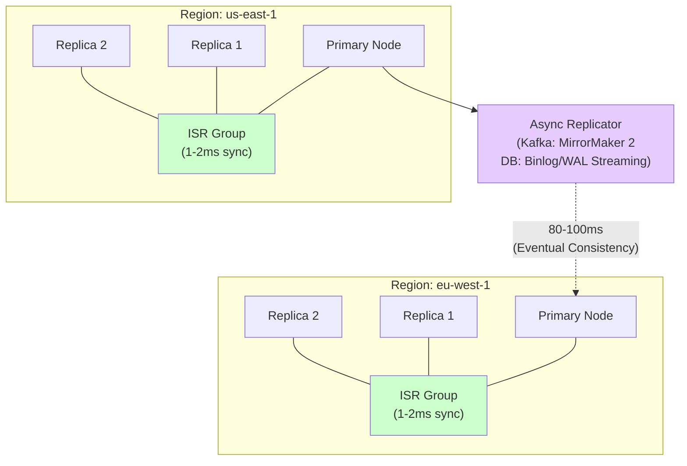
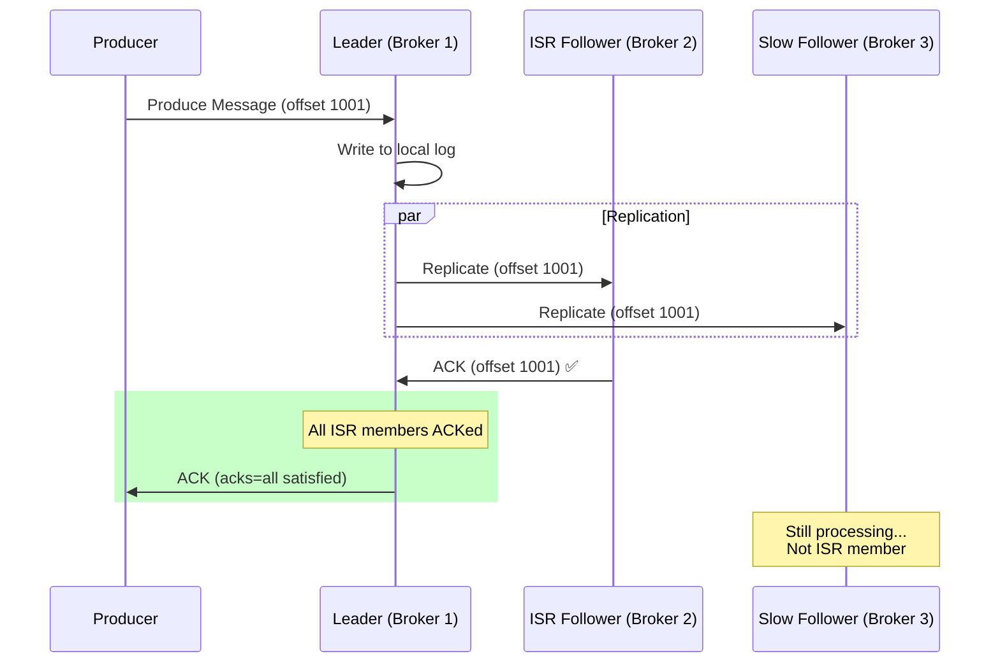
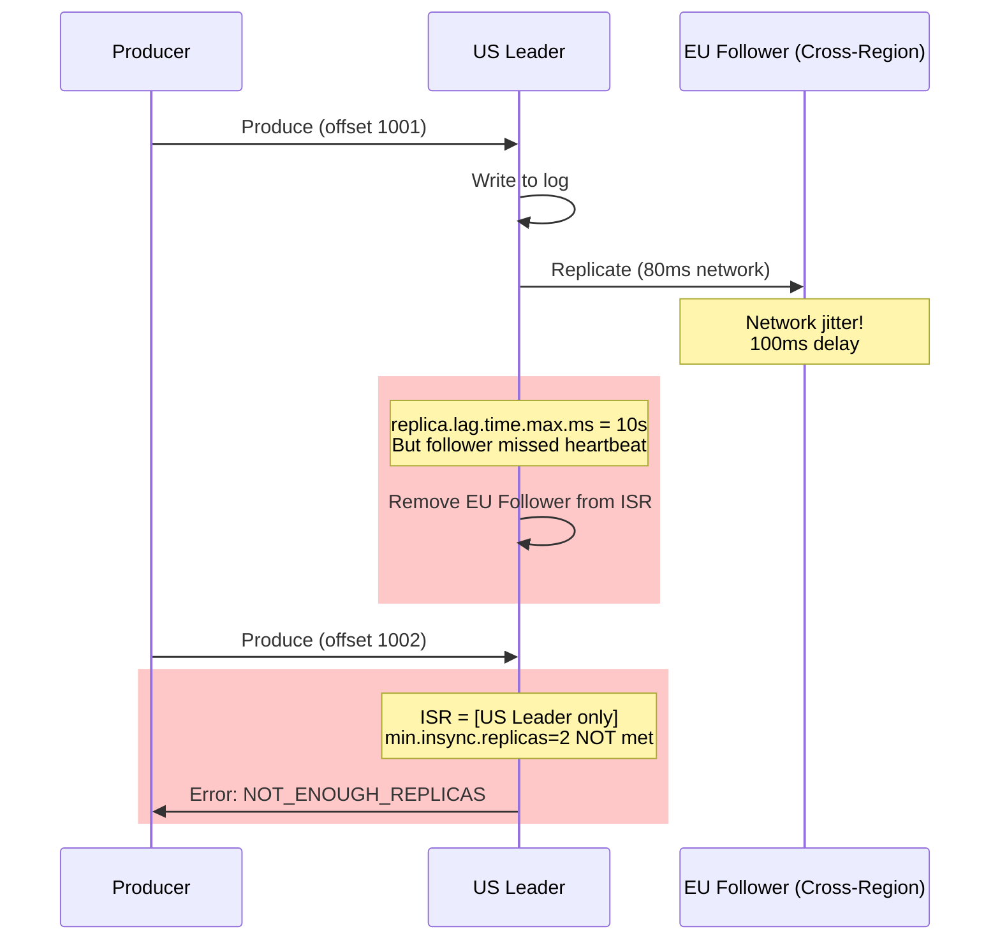

# 02. Multi-Region Replication: ISR, Active-Active, and DR Strategies

## 1. Introduction

In distributed systems, **multi-region replication** is the practice of maintaining data copies across geographically separated data centers. This pattern is critical for:
- **Disaster Recovery (DR)**: Surviving regional outages
- **Low-Latency Reads**: Serving users from nearby regions
- **Data Sovereignty**: Complying with regulations (GDPR, data residency)

The challenge: **Cross-region network latency (80-100ms)** makes synchronous replication impractical for production systems.

**The Solution**: Keep clusters **regional** with fast synchronous replication (1-2ms), and use **asynchronous replication** between regions.

This document explains the **universal pattern** used by Kafka, PostgreSQL, MySQL, MongoDB, Redis, and Cassandra to achieve multi-region durability without sacrificing performance.

---

## 2. Core Architecture

The fundamental pattern: **Regional ISR + Cross-Region Async Replication**.



### Key Components

1.  **ISR (In-Sync Replicas)**: Group of replicas within a region that are fully caught up (1-2ms latency).
2.  **Primary/Leader**: Node handling writes within a region.
3.  **Async Replicator**: Component that copies data cross-region (MirrorMaker 2, binlog streaming, WAL shipping).
4.  **Eventual Consistency**: Writes in US appear in EU after 100ms-1s delay.

---

## 3. How It Works: ISR Fundamentals

### A. What is ISR (In-Sync Replicas)?

**Definition**: ISR is the set of replicas that are **fully caught up** with the leader, meaning they have received and acknowledged all recent writes.

**Why It Matters**: Systems only acknowledge writes when **all ISR members** confirm (when using strong consistency settings).

**Example (Kafka)**:
```
Topic: orders, Partition 0
Leader: Broker 1 (Offset: 1000)
Replicas:
- Broker 2 (Offset: 1000) ✅ IN-SYNC
- Broker 3 (Offset: 850)  ❌ OUT-OF-SYNC (lag: 150)

ISR = [Broker 1, Broker 2]
```

**Write Flow with ISR**:


### B. Why Regional ISR is Required

**The Latency Problem**:
| Setup | Leader → Follower Latency | ISR Stability |
| :--- | :--- | :--- |
| Single Region (us-east-1a → us-east-1b) | 1-2ms | ✅ Stable |
| Cross-Region (us-east-1 → eu-west-1) | 80-100ms | ❌ Unstable |

**What Breaks with Cross-Region ISR**:
```
ISR Timeout Config: replica.lag.time.max.ms = 10000 (10 seconds)

Scenario:
1. Leader in US, Follower in EU (80ms latency)
2. Network jitter causes occasional 100ms delays
3. Follower misses heartbeat within 10s window
4. Result: Follower removed from ISR
5. Problem: Producer writes fail (min.insync.replicas not met)
```

**Why Async Cross-Region Wins**:
```
Sync Replication (Cross-Region):
Write → Wait for EU ACK (80ms) → Return to user
Result: Every write takes 80ms+ (UNACCEPTABLE)

Async Replication:
Write → Wait for regional ISR ACK (1ms) → Return to user
Background: Replicate to EU (80ms, doesn't block)
Result: Fast writes (1ms) + eventual consistency
```

---

## 4. Deep Dive: Implementation Across Technologies

### A. Apache Kafka (MirrorMaker 2)

**Architecture**:
```
US Cluster (us-east-1):
- 3 brokers with ISR (replication.factor=3)
- Serves US producers/consumers

MirrorMaker 2:
- Kafka Connect-based consumer/producer
- Consumes from US cluster
- Produces to EU cluster

EU Cluster (eu-west-1):
- 3 brokers with ISR
- Topics:
  - orders (local EU writes)
  - us.orders (replicated from US)
```

**Internal Mechanism**:
```java
// MirrorMaker 2 internally runs:
KafkaConsumer<byte[], byte[]> sourceConsumer = 
    new KafkaConsumer<>(usClusterConfig);
sourceConsumer.subscribe(Arrays.asList("orders", "payments"));

KafkaProducer<byte[], byte[]> targetProducer = 
    new KafkaProducer<>(euClusterConfig);

while (true) {
    ConsumerRecords<byte[], byte[]> records = sourceConsumer.poll(Duration.ofMillis(100));
    for (ConsumerRecord<byte[], byte[]> record : records) {
        // Add source cluster prefix to topic name
        String targetTopic = "us." + record.topic();
        
        targetProducer.send(new ProducerRecord<>(
            targetTopic,
            record.key(),
            record.value()
        ));
    }
}
```

### B. PostgreSQL (Streaming Replication)

**Architecture**:
```
Primary Cluster (us-east-1):
- Primary node + 2 sync replicas (quorum commit)
- synchronous_standby_names = 'ANY 2 (replica1, replica2)'

Async Standby (eu-west-1):
- Reads WAL (Write-Ahead Log) from US primary
- Applies changes asynchronously
- Can be promoted to primary during DR
```

**WAL Streaming**:
```
US Primary:
1. Write to WAL (durable on disk)
2. Send WAL records to sync replicas (wait for 2 ACKs)
3. Send WAL records to EU async replica (no wait)
4. Commit transaction

EU Replica:
1. Receive WAL stream
2. Apply WAL records to local database
3. Lag: typically 100ms-1s
```

### C. MySQL (Binlog Replication)

**Architecture**:
```
Master (us-east-1):
- Handles writes
- Semi-sync replication to local replicas

Slave (eu-west-1):
- Reads binlog from master
- Async replication
- Can be read-only or promoted
```

**Binlog Streaming**:
```sql
-- On master
SET GLOBAL rpl_semi_sync_master_enabled = 1;  -- Local sync
SET GLOBAL rpl_semi_sync_master_timeout = 10000;  -- 10s timeout

-- On EU slave
CHANGE MASTER TO
  MASTER_HOST='us-master.example.com',
  MASTER_PORT=3306,
  MASTER_AUTO_POSITION=1;  -- GTID-based replication

START SLAVE;
```

### D. Redis (Master-Replica + Replication Streams)

**Architecture**:
```
US Cluster:
- Master + 2 replicas (async within region)
- redis.conf: min-replicas-to-write 2

EU Cluster:
- Separate master (not replica of US master)
- Redis Streams used for data sync:
  - App writes to US Redis Streams
  - Consumer reads from US, writes to EU
```

**Why Not Master-Replica Cross-Region**:
Redis replication is **async by default**, but cross-region makes it unusable:
- Network partition → EU replica diverges
- Failover complications (split-brain risk)

**Alternative**: Use Redis Streams as event log (like Kafka).

---

## 5. End-to-End Walkthrough: Order Processing

Let's trace an order through a multi-region Kafka setup.

### Step 1: US Customer Places Order
```
User (New York) → API (us-east-1) → Kafka US Cluster

Producer:
topic: orders
partition: 0 (hashed by order_id)
message: {"order_id": "123", "amount": 50, "region": "US"}
```

### Step 2: US Cluster ISR Write
```
1. Leader (Broker 1) receives message
2. Leader writes to local log → Offset 1001
3. Leader replicates to ISR followers (Broker 2, 3)
   - Broker 2 writes → ACK (1ms)
   - Broker 3 writes → ACK (1ms)
4. Leader sends ACK to producer (total: 2ms)
```

### Step 3: MirrorMaker 2 Replicates to EU
```
1. MirrorMaker consumer (in US) polls:
   - Fetches offset 1001 from "orders" topic
2. MirrorMaker producer writes to EU cluster:
   - Topic: "us.orders"
   - Partition: 0
   - Message: Same payload ({"order_id": "123", ...})
3. Latency: 80ms (cross-region network)
```

### Step 4: EU Analytics Processes
```
EU Consumer Group:
- Subscribes to: "orders" (local EU), "us.orders" (replicated)
- Reads offset 1001 from "us.orders"
- Processes: Aggregates global order volume
- Result: Global dashboard shows US order (with 100ms delay)
```

### Step 5: Disaster Recovery Scenario
```
t=0:  US region fails (AWS outage)
t=1s: Application fails over to EU cluster
t=2s: EU producers start writing to EU "orders" topic
t=5s: US region recovers
t=10s: MirrorMaker starts replicating EU → US (bidirectional)
```

---

## 6. Failure Scenarios (The Senior View)

### Scenario A: Cross-Region ISR Attempt (Anti-Pattern)

**Symptom**: Producer writes timeout, ISR keeps shrinking.
**Cause**: Follower in EU can't stay in-sync due to 80ms latency.

#### The Mechanism



**Result**: Writes fail, cluster unusable.

#### The Fix

**Use Regional ISR + Async Replication**:
```properties
# US Cluster config
replication.factor = 3  # All 3 brokers in us-east-1
min.insync.replicas = 2  # At least 2 US brokers in-sync

# EU Cluster is SEPARATE (not part of US ISR)
# MirrorMaker 2 replicates async (no ISR dependency)
```

---

### Scenario B: Replication Lag Spike

**Symptom**: MirrorMaker consumer lag grows from 100ms to 10 minutes.
**Cause**: US traffic spike (10x normal) overwhelms MirrorMaker.

#### The Mechanism

```
Normal:
US writes: 10k msgs/sec
MirrorMaker throughput: 15k msgs/sec (buffer: 5k msgs/sec)
Lag: 100ms ✅

Black Friday:
US writes: 100k msgs/sec (10x spike)
MirrorMaker throughput: 15k msgs/sec (bottleneck!)
Lag grows: 100ms → 10 minutes ❌

Why:
- Single MirrorMaker instance (limited CPU)
- Cross-region bandwidth saturated
```

#### The Fix

**Option 1: Scale MirrorMaker Horizontally**
```properties
# Increase parallel tasks
us->eu.tasks.max = 10  # Was 1, now 10 parallel consumers/producers
```

**Option 2: Rate Limiting (Circuit Breaker)**
```properties
# If EU cluster CPU > 85%, pause replication
us->eu.producer.max.in.flight.requests.per.connection = 1
us->eu.consumer.max.poll.records = 500  # Smaller batches
```

**Option 3: Selective Replication**
```properties
# Only replicate critical topics
us->eu.topics = orders, payments  # Don't replicate logs, metrics
```

---

### Scenario C: Topic Collision (Active-Active)

**Symptom**: EU consumer sees duplicate messages with different order IDs.
**Cause**: Same topic name used in both regions without MirrorMaker prefix.

#### The Problem

```
US Producer writes to: orders (order_id: 123)
EU Producer writes to: orders (order_id: 456)

Without MirrorMaker prefix:
EU Cluster "orders" topic contains:
- order_id: 456 (local write)
- order_id: 123 (replicated from US, COLLISION!)

Consumer can't distinguish source region
```

#### The Fix

**Use MirrorMaker Prefixing**:
```
EU Cluster Topics:
- orders: Local EU writes (order_id: 456)
- us.orders: Replicated from US (order_id: 123)

Consumer logic:
if (record.topic().equals("orders")) {
    // EU order
} else if (record.topic().equals("us.orders")) {
    // US order (replicated)
}
```

---

## 7. Performance Tuning / Scaling Strategies

### A. Capacity Planning Formula

**EU Cluster Sizing**:
```
Required Capacity = (EU Local Traffic) + (US Replication Overhead) + 30% Buffer

Example:
- EU Local Traffic: 60k msgs/sec
- US Traffic: 200k msgs/sec
- Replication Overhead: 200k × 0.15 = 30k msgs/sec
- Total: 60k + 30k = 90k msgs/sec
- With 30% buffer: 117k msgs/sec

EU Cluster Size: 8 brokers (each handles ~15k msgs/sec)
```

### B. MirrorMaker Tuning

| Configuration | Recommendation | Why? |
| :--- | :--- | :--- |
| `tasks.max` | Number of partitions / 2 | Parallel replication per partition |
| `consumer.max.poll.records` | 500 | Batch size (balance lag vs throughput) |
| `producer.linger.ms` | 100 | Batch writes to EU cluster |
| `producer.compression.type` | `lz4` | Reduce cross-region bandwidth |
| `producer.acks` | `all` | Ensure EU ISR writes are durable |

### C. Monitoring Metrics

**Critical Alerts**:
```yaml
# Prometheus alerts
- alert: ReplicationLagHigh
  expr: kafka_mirrormaker_consumer_lag_seconds > 60
  annotations:
    summary: "Replication lag exceeds 1 minute"

- alert: ISRDropped
  expr: kafka_broker_isr_shrink_rate > 0
  annotations:
    summary: "Follower dropped from ISR"

- alert: CrossRegionBandwidthSaturated
  expr: network_transmit_bytes > 900000000  # 900 Mbps
  annotations:
    summary: "Network approaching 1 Gbps limit"
```

---

## 8. Constraints & Limitations

| Constraint | Limit | Why? |
| :--- | :--- | :--- |
| **Replication Lag** | 100ms-1s typical | Cross-region network latency (80-100ms base) |
| **Eventual Consistency** | No strong consistency across regions | Async replication means reads may be stale |
| **Bandwidth** | Limited by WAN link | Typically 1-10 Gbps between regions |
| **Cost** | 2-3x infrastructure | Each region needs full cluster |
| **Conflict Resolution** | Manual (Active-Active) | Last write wins or custom logic required |
| **Failover Time** | 1-5 minutes | DNS propagation + application restart |

**Key Limitation**: **You cannot have synchronous cross-region replication at scale** due to the CAP theorem (must choose Availability over Consistency).

---

## 9. When to Use Multi-Region Replication?

| Use Case | Verdict | Why? |
| :--- | :--- | :--- |
| **Disaster Recovery** | **YES** | Survive regional outages (AWS us-east-1 failure) |
| **Global Read Scaling** | **YES** | Serve users from nearest region (low latency) |
| **Data Sovereignty** | **YES** | GDPR, data residency laws require local data |
| **Real-Time Sync** | **NO** | 100ms lag is too slow for real-time |
| **Strong Consistency** | **NO** | Async replication = eventual consistency only |
| **Single-Region App** | **NO** | Overkill, use single region with AZ failover |

---

## 10. Production Checklist

1.  [ ] **Define Strategy**: Active-Passive (DR) or Active-Active (geo-distribution)?
2.  [ ] **Regional ISR**: Ensure all replicas in ISR are in the same region (1-2ms latency).
3.  [ ] **Async Replication**: Use MirrorMaker 2, binlog streaming, or WAL shipping for cross-region.
4.  [ ] **Topic Naming**: Use prefixes (e.g., `us.orders`) to avoid collisions in Active-Active.
5.  [ ] **Capacity Planning**: Size EU cluster for local traffic + replication overhead + 30% buffer.
6.  [ ] **Monitor Lag**: Alert on replication lag > 60s (Prometheus, CloudWatch).
7.  [ ] **Selective Replication**: Only replicate critical topics (not logs, metrics).
8.  [ ] **Failover Plan**: Document DNS/load balancer changes for DR scenario.
9.  [ ] **Test DR**: Run quarterly failover drills to ensure process works.
10. [ ] **Circuit Breaker**: Pause replication if destination cluster CPU > 85% (protect primary workload).
