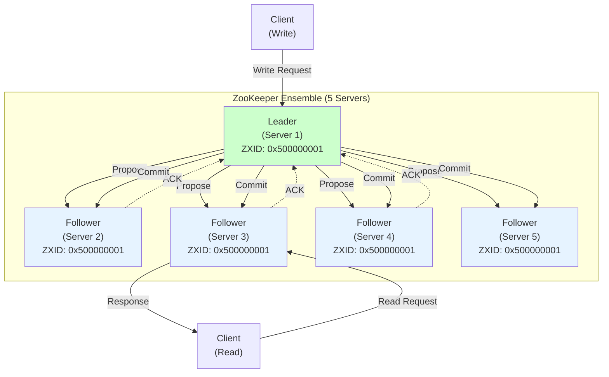
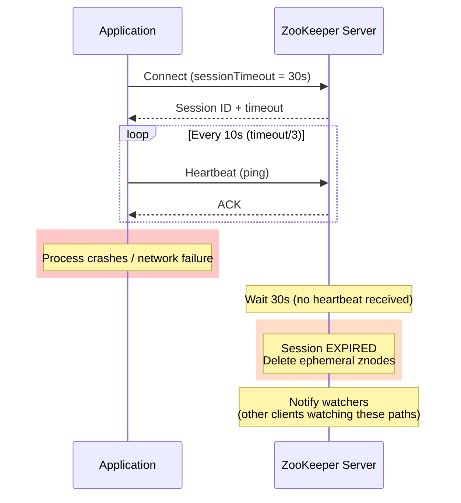
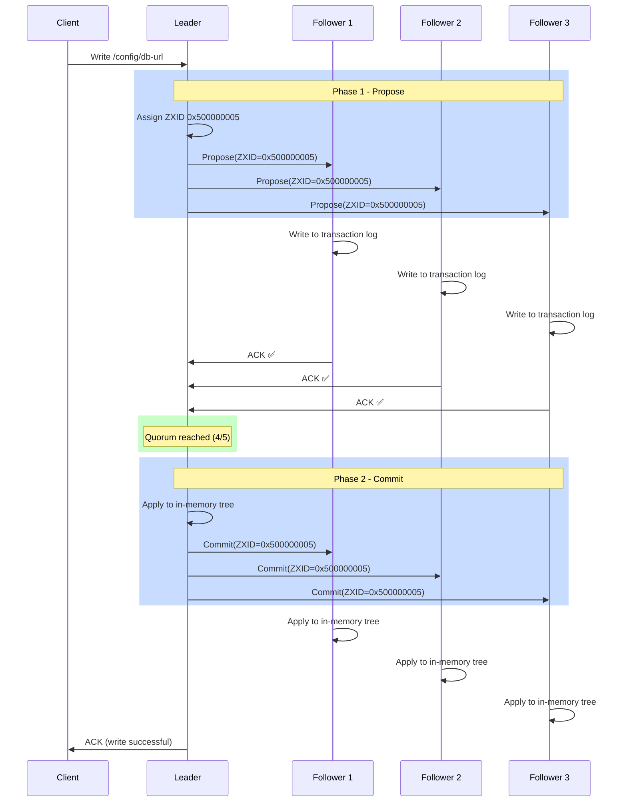
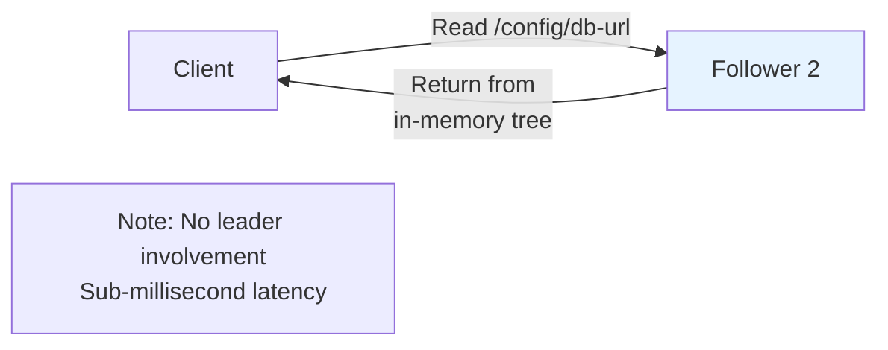
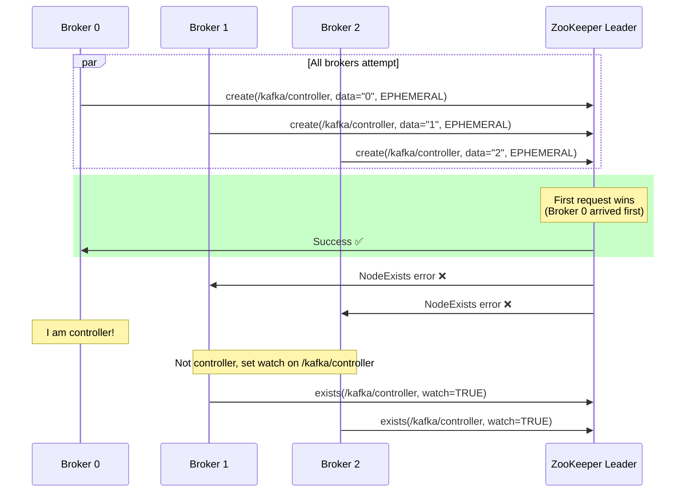
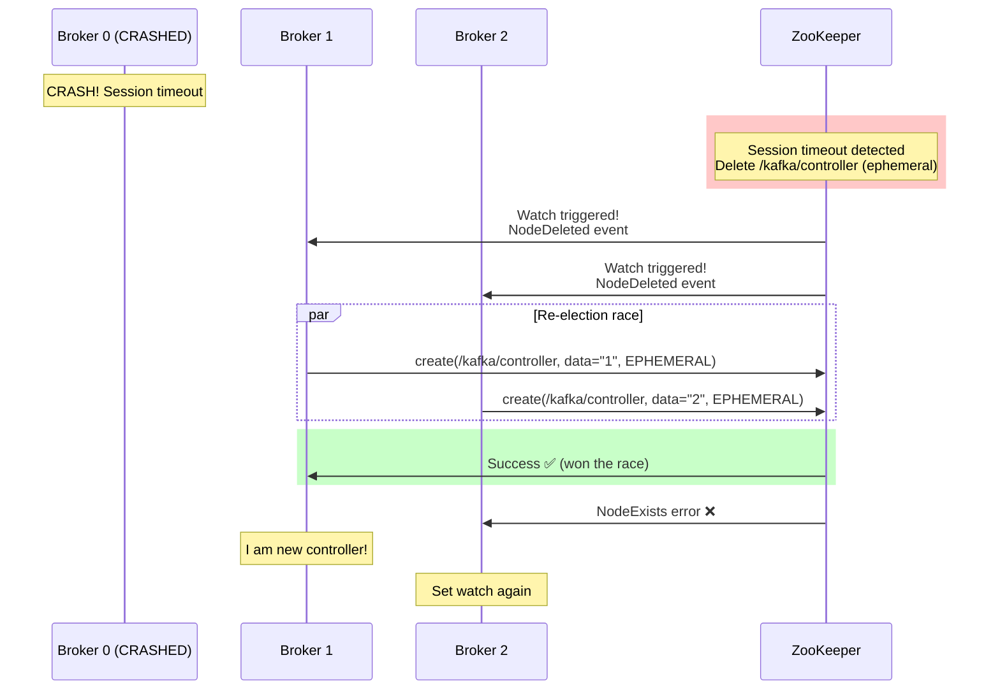
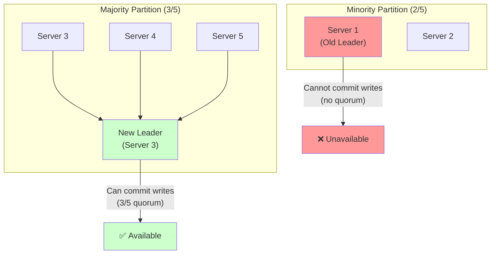
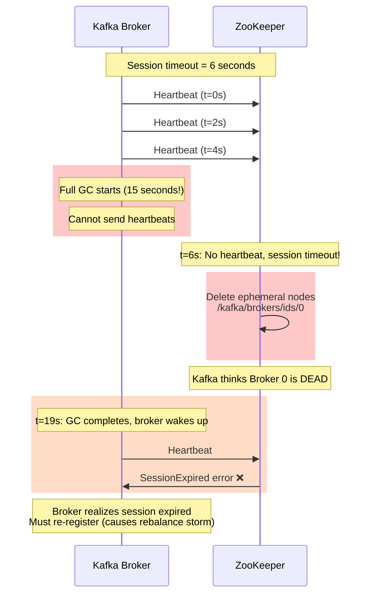
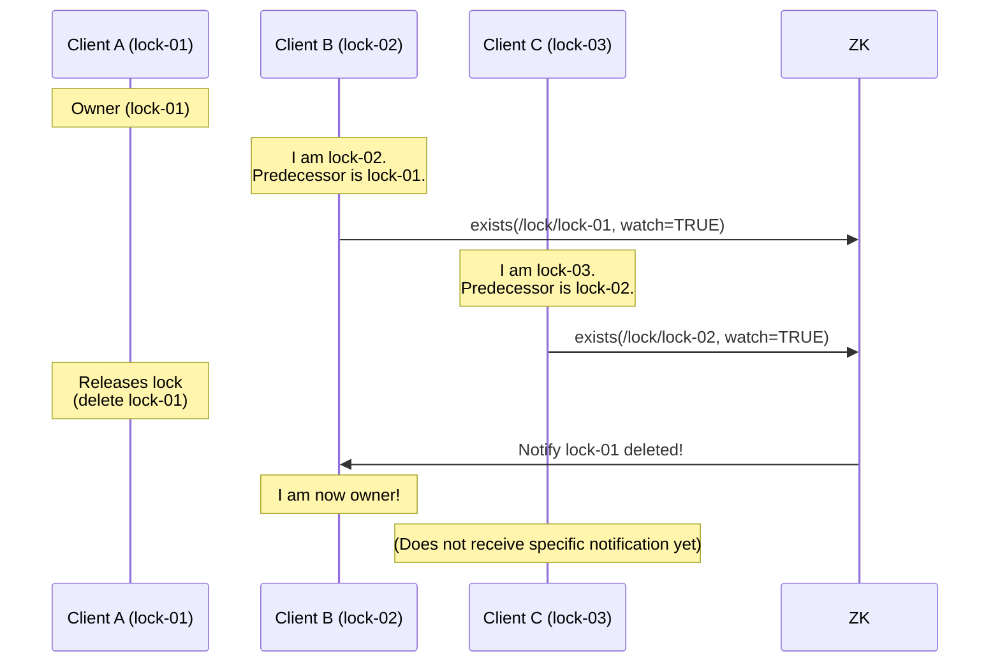

# 03. Apache ZooKeeper: Coordinating Distributed Systems

## 1. Introduction

**Apache ZooKeeper** is a centralized service for maintaining configuration information, naming, providing distributed synchronization, and providing group services. Despite its humble name, ZooKeeper is the critical coordination backbone for many large-scale distributed systems.

**Why ZooKeeper Matters**: ZooKeeper solves the hardest problems in distributed systems:
- **Leader Election**: Automatically elect a leader when the current one fails
- **Distributed Locks**: Safely coordinate access to shared resources
- **Configuration Management**: Centralized, consistent configuration across thousands of servers
- **Service Discovery**: Track which servers are alive and available

**Powered By ZooKeeper**:
- **Kafka** (until KRaft): Cluster metadata, controller election, topic configuration
- **Hadoop** (HDFS, YARN): NameNode HA, ResourceManager HA
- **HBase**: Master election, region assignment
- **Solr**: SolrCloud coordination
- **Dubbo**: Service registry

**Key Differentiator**: ZooKeeper provides **simple primitives** (znodes, watches, ephemeral nodes) that can be combined to build complex coordination patterns. Unlike Raft or Paxos (which are consensus algorithms), ZooKeeper is a **coordination service** built on top of the **ZAB (ZooKeeper Atomic Broadcast)** consensus protocol.

---

## 2. Core Architecture

ZooKeeper maintains data in a **hierarchical namespace** (like a file system) where each node (called a **znode**) can store data and have children.



### Key Components

**1. Ensemble**: Cluster of ZooKeeper servers (typically 3, 5, or 7). Uses majority quorum for fault tolerance.

**2. Leader**: Elected server that handles all **write** requests and coordinates transaction commits.

**3. Followers**: Replicate data from leader, handle **read** requests, participate in voting.

**4. Znodes**: Nodes in the hierarchical namespace. Types:
   - **Persistent**: Remain until explicitly deleted
   - **Ephemeral**: Deleted when client session ends (used for liveness detection)
   - **Sequential**: Appends monotonic counter (used for distributed locks, leader election)

**5. ZXID (ZooKeeper Transaction ID)**: 64-bit number uniquely identifying each state change. Format: `epoch (32 bits) | counter (32 bits)`.

**6. Watches**: Clients can set one-time triggers on znodes to get notified of changes.

**7. Sessions**: Client maintains persistent TCP connection with session timeout (heartbeats every `sessionTimeout/3`, typically 10s for 30s timeout).

---

## 3. How It Works: Sessions, Znodes, and ZAB Protocol

### A. Session Management and Heart beats (Node Liveness Detection)

**How ZooKeeper Knows if a Node is Active:**

ZooKeeper uses **session-based heartbeats** to detect node failures automatically.



**Session Lifecycle**:

1. **Connection**: Client connects to any ZooKeeper server
2. **Session Created**: ZooKeeper assigns unique session ID and timeout
3. **Heartbeats**: Client sends ping every `sessionTimeout/3` (e.g., every 10s for 30s timeout)
4. **Session Active**: As long as heartbeats received, session  stays alive
5. **Timeout**: If no heartbeat for `sessionTimeout` seconds → Session EXPIRED
6. **Cleanup**: ZooKeeper automatically deletes all ephemeral znodes from expired session

**Session States**:
- `CONNECTING`: Initial connection attempt
- `CONNECTED`: Active session, heartbeats flowing ✅
- `DISCONNECTED`: Temporary network issue (session still valid, will retry)
- `EXPIRED`: Timeout exceeded, ephemeral znodes deleted ❌

**Example: Detecting Kafka Broker Failure**:
```
t=0:  Kafka broker crashes
t=0:  ZooKeeper stops receiving heartbeats from broker's session
t=30: Session timeout expires (30s default)
t=30: ZooKeeper deletes /kafka/brokers/ids/0 (ephemeral node)
t=30: Kafka controller's watch fires → Reassigns partitions

Total detection time: 30 seconds
```

### B. Znode Types and Use Cases

**Znode Type Summary**:

| Type | Created When | Deleted When | Use Case |
|------|--------------|--------------|----------|
| **PERSISTENT** | Config deployment, app setup | Explicit `delete()` call | Configuration, metadata |
| **EPHEMERAL** | Service starts, leader election | Session expires (node dies) | Service registration, leader election |
| **PERSISTENT_SEQUENTIAL** | Queue operations, logs | Explicit delete | Task queues, audit logs |
| **EPHEMERAL_SEQUENTIAL** | Lock acquisition, election | Session expires | Distributed locks, ordered elections |

### C. Coordination Patterns: How Systems Use ZooKeeper

This section demonstrates how distributed systems leverage ZooKeeper for common coordination tasks.

#### Pattern 1: Configuration Management

**Use Case**: Centralized configuration that updates live across distributed services.

**Implementation Steps**:
1. **Store Config**: DevOps creates a persistent znode `/config/database/connection-string` with the config data.
2. **Initial Read**: Service reads the znode on startup to get current configuration.
3. **Set Watch**: Service sets a watch on the config znode.
4. **Receive Update**: When DevOps updates the config, ZooKeeper sends notification to watching services.
5. **Re-read and Apply**: Service receives watch event, reads new config, and hot-reloads (e.g., reconnect DB pool).
6. **Re-register Watch**: Service sets a new watch (watches are one-time triggers).

**Key Characteristics**:
- **Watch is one-time**: Must re-register after each notification
- **Small data**: Config should be < 1 MB (typically few KB)
- **No polling**: Push-based notifications eliminate constant polling

**Real-World: Kafka Broker Configuration**
```
ZooKeeper stores Kafka broker configs:
  Path: /config/brokers/1001
  Data: {"max.connections": 100, "retention.ms": 86400000}

Broker 1001 watches this path. When SRE updates:
1. ZooKeeper notifies broker via watch
2. Broker reads new config
3. Broker applies changes without restart
4. Broker re-registers watch
```

#### Pattern 2: Leader Election

**Use Case**: Ensure only ONE controller/coordinator is active across N replicas.

**Implementation Steps**:
1. **Race to Create**: All replicas try to create ephemeral znode `/elections/controller` with their ID.
2. **Winner Determination**: 
   - **First to succeed** → Becomes leader, starts coordinator work
   - **Others fail** → Get `NodeExistsException`, become followers
3. **Watch Leader**: Followers set watch on `/elections/controller` to detect leader failure.
4. **Leader Work**: Leader does coordination while maintaining session (heartbeats).
5. **Automatic Failover**: If leader crashes:
   - Session expires → Z ooKeeper deletes ephemeral znode
   - Followers' watches fire
   - Followers race again to create the znode (Step 1)

**Why It's Safe**:
- **Atomic Create**: ZooKeeper guarantees only ONE client succeeds
- **Session Binding**: Ephemeral node automatically deleted on crash
- **No Split-Brain**: Only one znode can exist at a time

**Real-World: Kafka Controller Election**
```
Kafka Controller Election Flow:

Initial State:
- Brokers {0, 1, 2} all try: create("/kafka/controller", EPHEMERAL)
- Broker 0 wins → Creates znode with data "0"
- Brokers 1, 2 → Watch "/kafka/controller"

Broker 0 dies:
→ Session expires (30s timeout)
→ ZooKeeper deletes "/kafka/controller"
→ Brokers 1, 2 get watch notification
→ Race again: Broker 1 wins
→ Broker 1 becomes new controller

Total failover time: ~30-35 seconds
```

#### Pattern 3: Service Discovery / Cluster Membership

**Use Case**: Track which service instances are alive and available.

**Service Registration Steps (Each Instance)**:
1. **Create Parent**: Ensure parent path `/services/web` exists (persistent).
2. **Register Self**: Create ephemeral sequential znode:
   - Path: `/services/web/instance-` (ZK appends sequence number)
   - Data: `"192.168.1.10:8080"` (instance endpoint)
   - Returns: `/services/web/instance-0000000001`
3. **Automatic Cleanup**: When instance crashes, session expires → znode auto-deleted.

**Service Discovery Steps (Load Balancer)**:
1. **Get All Instances**: Load balancer calls `getChildren("/services/web")`.
2. **Read Endpoints**: For each child, read znode data to get endpoint.
3. **Build Routing Table**: Populate backend pool with live instances.
4. **Watch for Changes**: Set watch on `/services/web` to detect additions/removals.
5. **Update on Notification**: When watch fires, re-fetch children and update routing table.

**ZooKeeper State Example**:
```
/services/web/instance-0000000001 → "192.168.1.10:8080" (Session: 0xabc)
/services/web/instance-0000000002 → "192.168.1.11:8080" (Session: 0xdef)
/services/web/instance-0000000003 → "192.168.1.12:8080" (Session: 0x123)

If instance-2 crashes:
→ Session 0xdef expires (30s timeout)
→ ZooKeeper deletes /services/web/instance-0000000002
→ Load balancer's watch fires
→ Load balancer re-fetches children, sees only instance-1 and instance-3
→ Removes 192.168.1.11:8080 from routing pool

Detection time: ~30 seconds
```

**Real-World: Apache Solr Cloud**
```
Solr uses ZooKeeper for cluster state:

/solr/collections/logs/shards/shard1/replicas/
  ├── core_node1 → {"node_name": "solr1:8983", "state": "active"}
  ├── core_node2 → {"node_name": "solr2:8983", "state": "active"}
  └── core_node3 → {"node_name": "solr3:8983", "state": "active"}

Solr nodes watch this path. When a node dies:
→ ZooKeeper removes its ephemeral replica znode
→ Cluster rebalances queries to remaining nodes
```

### D. ZAB Protocol Mechanics

ZooKeeper uses **ZAB (ZooKeeper Atomic Broadcast)** for consensus. ZAB is similar to Raft but optimized for ZooKeeper's read-heavy workload.

### E. Data Model

**Hierarchical Namespace** (like a Unix file system):

```
/
├── /kafka
│   ├── /brokers
│   │   └── /ids
│   │       ├── /0  (ephemeral, broker 0 metadata)
│   │       ├── /1  (ephemeral, broker 1 metadata)
│   │       └── /2  (ephemeral, broker 2 metadata)
│   ├── /controller  (ephemeral, current controller ID)
│   └── /topics
│       └── /orders
│           └── /partitions
│               └── /0
│                   └── /state  (leader, ISR info)
├── /lock
│   └── /distributed-lock-0000000001  (sequential ephemeral)
└── /config
    └── /app-settings  (persistent, config data)
```

**Znode Properties**:
- **Data**: Up to 1 MB (typically few KB)
- **Version**: Incremented on each update (used for optimistic locking)
- **ACL**: Access control list
- **Stat**: Metadata (creation time, modification time, children count)

### F. Write Flow (ZAB Protocol)

**2-Phase Commit**:



**Key Points**:
1. **Writes only to leader** (followers forward to leader)
2. **Propose**: Leader sends proposal to all followers
3. **ACK**: Followers write to transaction log, send ACK
4. **Commit**: Leader commits when quorum ACKs, broadcasts commit

### G. Read Flow

**Reads from any server** (no consensus required):



**Trade-off**: Reads may return slightly stale data (eventual consistency). For **linearizable reads**, client can issue `sync()` first.

### H. Leader Election (Fast Leader Election)

**Triggers**: Leader crash, network partition, startup.

**Process**:
1. Each server proposes itself as leader
2. Servers vote for the server with:
   - Highest ZXID (most up-to-date)
   - If tied, highest server ID
3. Server with majority votes becomes leader

**Fast**: Typically completes in <200ms.

---

## 4. Deep Dive: ZAB vs Raft

### Similarities
- Both leader-based consensus protocols
- Both require majority quorum
- Both use epochs/terms for detecting stale leaders

### Key Differences

| Feature | ZAB (ZooKeeper) | Raft |
| :--- | :--- | :--- |
| **Read Optimization** | Reads from any server (eventual consistency) | Reads from leader only (strong consistency) |
| **Write Path** | 2-phase (Propose → Commit) | 2-phase (Append → Commit) |
| **ZXID/Term** | ZXID includes epoch + counter | Term is just epoch |
| **Election** | Highest ZXID wins | Most up-to-date log wins |
| **Use Case** | Read-heavy coordination | General-purpose consensus |

**Why ZAB for ZooKeeper?**
- **Read-heavy workload**: 90%+ reads in typical ZooKeeper usage
- **Fast reads**: No leader involvement (sub-ms latency)
- **Trade-off**: Reads may see slightly stale data (acceptable for coordination)

---

## 5. End-to-End Walkthrough: Leader Election Pattern

Let's trace Kafka's controller election using ZooKeeper.

### Scenario: Elect Kafka Controller

**Step 1: Initial State**
```
ZooKeeper znodes:
/kafka/controller: (does not exist)

Kafka brokers: {0, 1, 2} all trying to become controller
```

### Step 2: Brokers Race to Create Ephemeral Node



**Step 3: Controller Works**
```
Broker 0 (controller):
- Manages partition leader elections
- Coordinates replica assignments
- Heartbeats to ZooKeeper (via session)
```

### Step 4: Controller Crashes



**Result**: New controller elected in <100ms. Automatic failover.

---

## 6. Failure Scenarios

### Scenario A: Split-Brain (Network Partition)

**Symptom**: Cluster divided into two groups, both think they can operate.
**Cause**: Network failure isolates leader from majority.

#### The Problem

```
Ensemble: 5 servers {S1, S2, S3, S4, S5}
Leader: S1

Network partition: {S1, S2} | {S3, S4, S5}

Question: Can both groups elect leaders?
```

#### The Mechanism



**What Happens**:
1. **Minority (S1, S2)**:
   - S1 (old leader) cannot get quorum (only 2/5 servers)
   - Writes FAIL (no quorum ACKs)
   - Eventually, S1 steps down (cannot reach majority)

2. **Majority (S3, S4, S5)**:
   - Detects leader timeout
   - Elects new leader (S3)
   - Can commit writes (3/5 quorum)

**Result**: Only majority partition remains available. **No split-brain**.

---

### Scenario B: Session Expiration (False Positive)

**Symptom**: Client's ephemeral nodes deleted even though client is alive.
**Cause**: Long GC pause prevents heartbeats, session expires.

#### The Timeline



**Impact**:
- False failure detection
- Unnecessary rebalances
- Temporary service disruption

#### The Fix

**Increase session timeout**:
```properties
# ZooKeeper config
tickTime = 2000  # Basic time unit (2 seconds)
sessionTimeout = 30000  # 30 seconds (was 6 seconds)

# Trade-off: Slower real failure detection
```

**Tune JVM GC**:
```bash
# Use low-pause GC (G1GC)
-XX:+UseG1GC
-XX:MaxGCPauseMillis=200  # Try to keep pauses < 200ms
```

---

### Scenario C: Thundering Herd (Distributed Lock)

**Symptom**: Massive spike in CPU/Network when a lock is released.
**Cause**: All N clients watching the parent node wake up simultaneously.

#### Incorrect Implementation (Thundering Herd)

**Bad Pattern**:
```
Client A: create(/lock/lock-01, EPHEMERAL_SEQUENTIAL)
Client B: create(/lock/lock-02, EPHEMERAL_SEQUENTIAL)
Client C: create(/lock/lock-03, EPHEMERAL_SEQUENTIAL)
... 1000 clients ...

# Client B sees it's not first.
# BAD: Client B watches parent /lock for ANY change
zk.getChildren("/lock", watch=TRUE)

# Client C watches parent /lock
zk.getChildren("/lock", watch=TRUE)
```

**What Happens**:
1. Client A releases lock (deletes `lock-01`).
2. ZooKeeper sends `NodeChildrenChanged` event to **ALL 999 waiting clients**.
3. All 999 clients wake up and send `getChildren("/lock")` to check if they are next.
4. Only Client B succeeds. The other 998 go back to sleep.
5. **Result**: Massive wasted resources (O(N) notifications).

#### Correct Implementation (Chain Watch)

**Good Pattern**:


**Key**: Watch **only the specific predecessor node** (O(1) notification).
- If `lock-01` deleted → Only `lock-02` notified.
- If `lock-02` deleted → Only `lock-03` notified.
- **Linear scalability**.

---

## 7. Performance Tuning

| Configuration | Default | Recommended | Impact |
| :--- | :--- | :--- | :--- |
| **tickTime** | 2000ms | 2000-3000ms | Base time unit for heartbeats, session timeouts |
| **initLimit** | 10 ticks | 10-20 ticks | Follower connection timeout (10 × tickTime) |
| **syncLimit** | 5 ticks | 5-10 ticks | Follower sync lag tolerance |
| **sessionTimeout** | 6-60s | 20-40s | Balance failure detection vs false positives |
| **snapCount** | 100,000 | 100,000-500,000 | Transactions before snapshot (affects recovery time) |
| **maxClientCnxns** | 60 | 0 (unlimited) | Max connections per client IP |

### Read Performance

**Enable Read-Only Mode** (followers serve stale reads):
```properties
# Client config
readonlymode.enabled = true

# Result: Reads continue even if disconnected from quorum
```

**Local Session** (experimental, ZK 3.5+):
```properties
# Reduces session overhead for read-heavy clients
connectionFactory = local
```

### Write Performance

**Batch Writes**:
```java
// Instead of:
for (int i = 0; i < 1000; i++) {
    zk.create("/batch/node-" + i, data, PERSISTENT);  // 1000 RTTs
}

// Use multi:
List<Op> ops = new ArrayList<>();
for (int i = 0; i < 1000; i++) {
    ops.add(Op.create("/batch/node-" + i, data, PERSISTENT));
}
zk.multi(ops);  // 1 RTT (atomic transaction)
```

---

## 8. Constraints & Limitations

| Constraint | Limit | Why? |
| :--- | :--- | :--- |
| **Data Size per Znode** | 1 MB (default) | Designed for coordination metadata, not data storage |
| **Total Znodes** | ~1-2 million | In-memory storage, limited by RAM |
| **Write Throughput** | ~10k writes/sec | Single-leader bottleneck |
| **Read Throughput** | ~100k reads/sec | Scales with followers |
| **Session Timeout Min** | 2 × tickTime | Prevent false positives |
| **Ensemble Size** | 3, 5, 7 (odd) | Beyond 7, diminishing returns (slower writes) |
| **Cross-Region** | NOT recommended | High latency breaks session timeouts |

**Key Limitation**: **Not a database**. ZooKeeper is for **small, critical metadata** (KB range), not large datasets.

**Failure Tolerance**:
```
Ensemble Size | Tolerated Failures
      3       |         1
      5       |         2
      7       |         3
```

---

## 9. When to Use ZooKeeper?

| Use Case | Verdict | Alternative |
| :--- | :--- | :--- |
| **Leader Election** | ✅ **YES** | etcd (Raft-based), Consul |
| **Distributed Locks** | ✅ **YES** | Redis RedLock, etcd |
| **Configuration Management** | ✅ **YES** | Consul, etcd |
| **Service Discovery** | ⚠️ **MAYBE** | Consul (better), etcd, Eureka |
| **Cluster Coordination** (Kafka, Hadoop) | ✅ **YES** | Built-in (KRaft for Kafka) |
| **Large Data Storage** (>1MB per node) | ❌ **NO** | Etcd, Cassandra, Redis |
| **High Write Throughput** (>50k/sec) | ❌ **NO** | Kafka, Pulsar |

### ZooKeeper vs Alternatives

**ZooKeeper vs etcd**:
- ZooKeeper: Mature (2008), ZAB protocol, read-optimized
- etcd: Modern (2013), Raft protocol, gRPC API
- **Verdict**: Use etcd for new projects (simpler), ZooKeeper if already in the stack

**ZooKeeper vs Consul**:
- ZooKeeper: Coordination primitives
- Consul: Full service mesh (discovery, health checks, KV store)
- **Verdict**: Use Consul for service discovery, ZooKeeper for general coordination

**ZooKeeper vs Redis**:
- ZooKeeper: Strong consistency, durable
- Redis: Fast (in-memory), eventual consistency (replication)
- **Verdict**: Use ZooKeeper for critical coordination, Redis for caching

---

## 10. Production Checklist

1.  [ ] **Ensemble Size**: Use 3, 5, or 7 servers (odd numbers). 5 is the sweet spot.
2.  [ ] **Same Region**: Deploy all servers in the same region (<10ms latency).
3.  [ ] **Separate Disks**: Use dedicated disk for transaction log (separate from data dir).
4.  [ ] **Session Timeout**: Set to 20-40s (balance failure detection vs false positives).
5.  [ ] **Monitor Latency**: Alert on request latency >100ms (indicates overload).
6.  [ ] **Monitor Outstanding Requests**: Alert on >100 queued requests (leader overload).
7.  [ ] **Snapshot Management**: Keep at least 3 recent snapshots for recovery.
8.  [ ] **Disable Swap**: Swapping causes GC pauses → session timeouts.
9.  [ ] **Firewall**: Only allow ZooKeeper client port (2181) from trusted networks.
10. [ ] **Backup**: Regularly backup data directory (snapshots + transaction logs).
11. [ ] **Upgrade Strategy**: Rolling restart (one server at a time, wait for sync).
12. [ ] **Monitoring**: Use JMX metrics (`zk_outstanding_requests`, `zk_avg_latency`).

**Critical Metrics**:
```
zk_server_state: 1=follower, 2=leader (detect leader changes)
zk_avg_latency: <10ms (good), >50ms (investigate)
zk_max_latency: <100ms (good), >500ms (critical)
zk_num_alive_connections: Track client connections
zk_outstanding_requests: <10 (good), >100 (overloaded leader)
```

---

ZooKeeper remains the battle-tested foundation for distributed coordination. While newer alternatives exist (etcd, Consul), ZooKeeper's maturity and proven track record make it the go-to choice for critical infrastructure requiring strong consistency guarantees.
