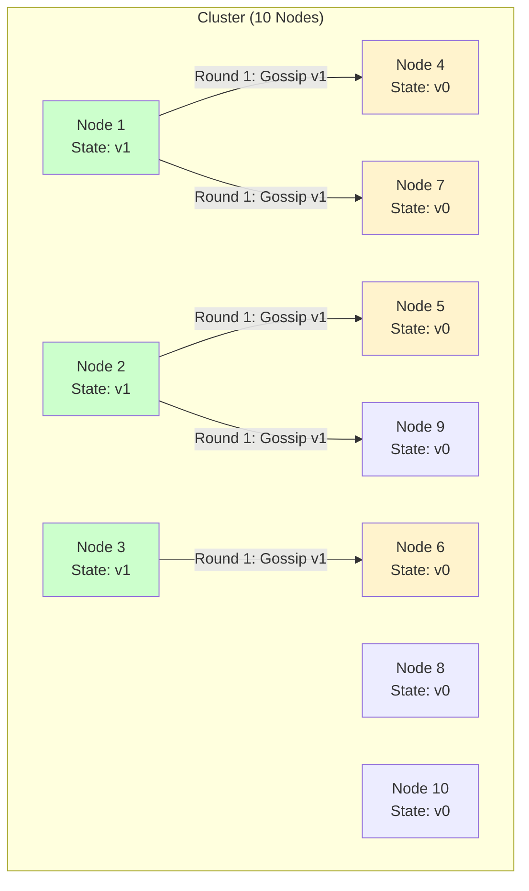
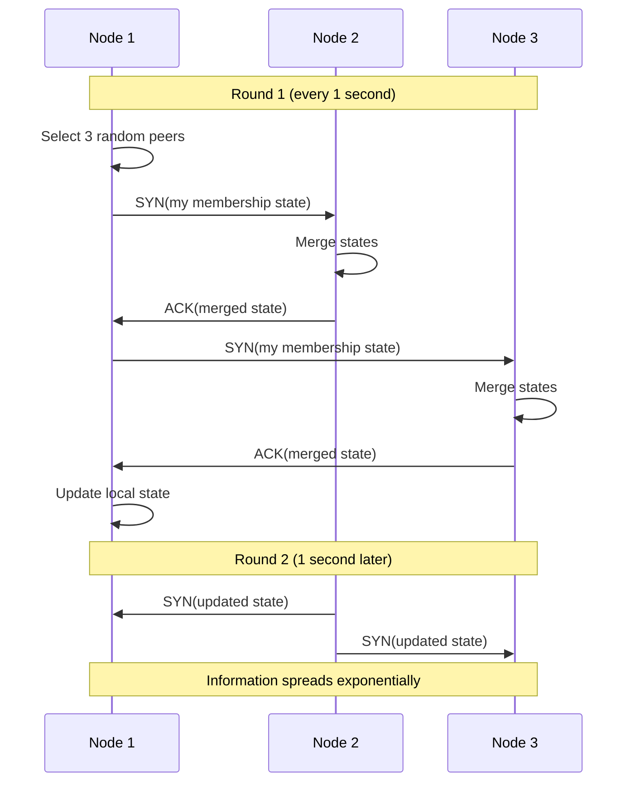
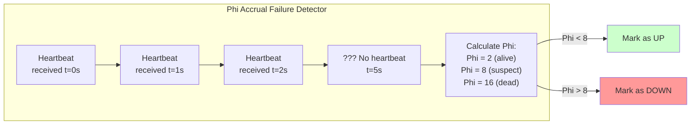
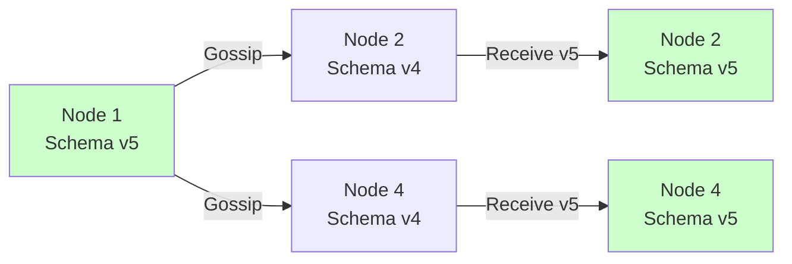
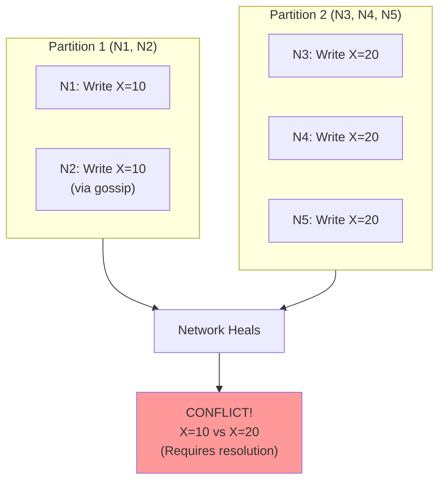
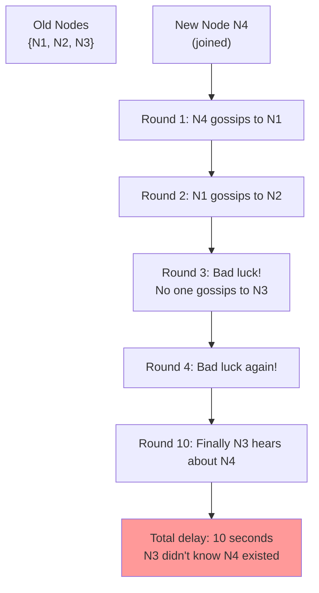

# 04. Gossip Protocol: Epidemic Communication in Distributed Systems

## 1. Introduction

**Gossip Protocol** (also called **Epidemic Protocol**) is a peer-to-peer communication pattern where nodes randomly exchange state with other nodes, causing information to spread through the cluster like an epidemic disease. Unlike leader-based consensus (Raft, Paxos), gossip is **leaderless** and **eventually consistent**.

**Why Gossip Matters**: Gossip is the foundation for **AP (Available, Partition-Tolerant)** systems in the CAP theorem. It enables:
- **Failure Detection**: Detect crashed nodes without a central monitor
- **Membership Management**: Track which nodes are in the cluster
- **State Dissemination**: Spread configuration changes across 1000+ nodes
- **Anti-Entropy**: Detect and repair data inconsistencies

**Powered By Gossip**:
- **Cassandra**: Membership, failure detection, schema propagation
- **DynamoDB**: Membership, hinted handoff
- **Redis Cluster**: Cluster bus for node discovery
- **Consul**: Membership (Serf gossip library)
- **Akka Cluster**: Distributed actor system coordination

**Key Differentiator**: Gossip trades **strong consistency** for **high availability** and **scalability**. It can handle 1000+ node clusters where Raft/Paxos would struggle.

---

## 2. Core Architecture

Gossip operates through **periodic, random peer-to-peer exchanges** where nodes send their state to a few randomly selected peers.



**After Multiple Rounds** (with fanout=2 per node):
```
Round 0: 3 nodes have new state (v1) - N1, N2, N3 (initial infected)
Round 1: 8 nodes infected - N4, N5, N6, N7, N9 added (Nodes 8, 10 still behind)
Round 2: 10 nodes - N8, N10 infected (full propagation)

Result: O(log N) rounds to reach all nodes (exponential spread)
```

**Why Exponential?**
- Each infected node gossips to multiple peers (fanout)
- Number of infected nodes roughly doubles/triples each round
- 1 → 3 → 9 → 27 → 81 (grows exponentially)
- For N=1000 nodes: ~log₂(1000) ≈ 10 rounds to full propagation

### Key Components

**1. Gossip Interval**: How often each node gossips (typically 1 second)

**2. Fanout**: Number of random peers to gossip with per round (typically 3)

**3. Message Types**:
   - **Push**: Send my state to peers
   - **Pull**: Request state from peers
   - **Push-Pull**: Exchange states (most common)

**4. Version Vectors**: Track causality and detect conflicts

**5. Heartbeat**: Periodic message to prove liveness

---

## 3. How It Works: Membership & Failure Detection

### A. Membership Gossip (Cassandra Example)

**Goal**: Every node knows about every other node in the cluster.

**Mechanism**:



**State Includes**:
- Node ID and IP address
- Heartbeat counter (increments each round)
- Generation number (increments on restart)
- Status (UP, DOWN, LEAVING)

### B. Failure Detection (Phi Accrual)

**Traditional Approach** (heartbeat timeout):
```
If no heartbeat for 10 seconds → Node is DEAD
Problem: Network jitter causes false positives
```

**Gossip Approach** (Phi Accrual):

Instead of a binary timeout, Phi Accrual calculates a **suspicion level** that adapts to network conditions.

**How It Works**:
1. Track heartbeat arrival times (build history)
2. Calculate mean and standard deviation of intervals  
3. Compute Phi value: How much current delay deviates from expected
4. If Phi > threshold (e.g., 8) → Declare node dead

**Phi Formula** (simplified):
```
Phi(t) = -log₁₀(P(heartbeat arrives after time t))

Higher Phi = Higher suspicion of failure
Phi = 8 means 99.999999% confident node is dead
```

**Concrete Example 1: Stable Network**

```
Heartbeat History: t=0s, 1s, 2s, 3s, 4s, 5s, 6s, 7s, 8s, 9s
Mean interval: 1.0 second
Std deviation: 0.1 seconds (very stable!)

Current time: t=11s (last heartbeat at t=9s)
Delay: 2 seconds

Analysis:
- Expected: 1.0s ± 0.1s
- Actual: 2s (10 standard deviations away!)
- Phi ≈ 5.0 (suspicious but < 8)
- Decision: Still ALIVE ✅

At t=13s (delay=4s):
- Phi ≈ 9.0 (exceeds threshold!)
- Decision: Node declared DEAD ❌
```

**Concrete Example 2: Variable Network** (same delay, WAN with jitter)

```
Heartbeat History: t=0s, 1.2s, 2.8s, 3.5s, 5.1s, 6.8s, 7.3s, 9.0s, 10.5s
Mean interval: 1.5 seconds
Std deviation: 0.8 seconds (high variance!)

Current time: t=15s (last heartbeat at t=10.5s)
Delay: 4.5 seconds

Analysis:
- Expected: 1.5s ± 0.8s
- Actual: 4.5s (3.75 standard deviations)
- Phi ≈ 3.0 (not suspicious given variance)
- Decision: Still ALIVE ✅
```

**Key Insight**: Same 4.5s delay, different outcomes:
- Stable network: Phi ≈ 9.0 → DEAD ❌
- Variable network: Phi ≈ 3.0 → ALIVE ✅

**Phi adapts to each node's network characteristics!**

**Phi Scale**:

| Phi Value | Confidence | Action |
|:----------|:-----------|:-------|
| 0-2 | Alive ✅ | None |
| 3-5 | Probably alive ✅ | None |
| 6-7 | Getting suspicious ⚠️ | Monitor |
| **8+** | **Very likely dead** | **Mark DOWN** ❌ |
| 10+ | Almost certain | Remove from cluster |

**Benefits**:
1. **Adaptive**: Adjusts to each node's network patterns automatically
2. **Fewer False Positives**: Tolerates variance without false alarms
3. **Tunable**: Adjust threshold based on tolerance (Cassandra default: 8)
4. **Gradual**: Provides suspicion level, not just binary alive/dead

**Real Configuration** (Cassandra):
```yaml
phi_convict_threshold: 8   # Default - balanced
phi_convict_threshold: 12  # For variable networks (more tolerance)
phi_convict_threshold: 6   # For stable networks (faster detection)
```

**Phi Accrual Diagram**:



---

## 4. Deep Dive: Gossip Variants

### Push Gossip

**Mechanism**: Infected nodes actively push updates to random peers.

**Example**:
```
Node A has new config (version 5)
Round 1: A pushes to B, C → Now B, C have v5
Round 2: A, B, C each push to 3 random peers → 9 nodes have v5
Round 3: 9 nodes push → ~27 nodes have v5
```

**Properties**:
- Fast propagation: O(log N) rounds
- High network traffic (redundant messages)

### Pull Gossip

**Mechanism**: Nodes periodically pull state from random peers.

**Example**:
```
Node A polls Node B: "What's your latest state?"
Node B: "I have version 5"
Node A: "I only have v3, send me v5"
```

**Properties**:
- Slower than push (O(N log N) rounds)
- Lower network traffic
- Better for anti-entropy (detecting missing updates)

### Push-Pull Gossip (Hybrid)

**Best of both worlds**:
```
Node A → Node B: SYN(my state digest: v5)
Node B compares: I have v3, A has newer
Node B → Node A: ACK(my state: v3, please send missing updates)
Node A → Node B: Updates (v4, v5)
```

**Used By**: Cassandra, DynamoDB (most production systems)

---

## 5. End-to-End Walkthrough: Schema Change in Cassandra

Let's trace how a schema change (adding a column) propagates through a 5-node Cassandra cluster.

### Step 1: Client Sends DDL to Node 1

```
Client → Node 1: ALTER TABLE users ADD email VARCHAR;
```

### Step 2: Node 1 Applies Locally and Increments Schema Version

```
Node 1:
- Applies schema change
- Schema version: v4 → v5
- Gossip state updated
```

### Step 3: Gossip Round 1 (Push)



**After Round 1**: 3/5 nodes have v5

### Step 4: Gossip Round 2 (Exponential Spread)

```
Node 1 → gossips to Node 3
Node 2 → gossips to Node 5
Node 4 → gossips to Node 3, Node 5

After Round 2: 5/5 nodes have v5
```

### Step 5: All Nodes Converge

```
Total time: ~2-3 seconds (2 gossip rounds × 1s interval)
Result: All nodes have schema v5, cluster is consistent
```

**Timeline**:
```
t=0s:    Node 1 applies schema change
t=0-1s:  Gossip round 1 (3 nodes have v5)
t=1-2s:  Gossip round 2 (5 nodes have v5)
t=2s:    Convergence achieved
```

---

## 6. Failure Scenarios

### Scenario A: Network Partition (Split-Brain)

**Symptom**: Cluster divided into two groups, both accept writes.
**Cause**: Network failure splits cluster.

#### The Problem

```
Cluster: 5 nodes {N1, N2, N3, N4, N5}
Network partition: {N1, N2} | {N3, N4, N5}

Key question: Can both sides accept writes?
Answer: YES (unlike Raft/Paxos)
```

#### What Happens



**Result**: **Split-brain allowed**. Both partitions accept writes independently.

#### Resolution Strategies

**Last-Write-Wins (LWW)**:
```
N1: X=10 (timestamp: t=100)
N3: X=20 (timestamp: t=105)

After merge: X=20 (t=105 > t=100)
```

**Vector Clocks** (detect concurrent writes):
```
N1: X=10 [N1:1]
N3: X=20 [N3:1]

After merge: CONFLICT! Both are concurrent (no causal order)
Application must resolve (or use CRDTs)
```

---

### Scenario B: Slow Gossip Propagation

**Symptom**: New node joins cluster, but some nodes don't see it for 30+ seconds.
**Cause**: Random selection didn't pick the new node quickly.

#### The Mechanism



**Impact**: Temporary inconsistency, but eventually converges.

#### The Fix

**Seed Nodes** (Cassandra):
```
Configuration:
seed_provider:
  - class_name: SimpleSeedProvider
    parameters:
      seeds: "192.168.1.1,192.168.1.2"  # Always gossip with seeds

Result: New nodes guaranteed to reach seeds quickly
```

**Directed Gossip** (first few rounds):
```
New node N4 joins:
Round 1: N4 gossips with ALL seed nodes (not random)
Round 2: N4 gossips normally (random)

Result: Faster propagation to critical nodes
```

---

### Scenario C: Tombstone Resurrection

**Symptom**: Deleted data reappears after being deleted.
**Cause**: Replica missed the delete, later gossips old value back.

#### The Problem

```
Timeline:
t=0: Node N1 has data: {"user_id": 123, "name": "Alice"}
t=1: Client deletes user 123 (DELETE command to N2)
t=2: N2 gossips tombstone to N1, N3 (user 123 deleted)
t=3: N4 was down during gossip, still has old value
t=10: N4 comes back online
t=11: N4 gossips: "I have user 123 = Alice"
t=12: N1, N2, N3 receive gossip from N4
t=13: RESURRECTION! User 123 reappears
```

#### The Fix: Tombstones with TTL

```
Cassandra approach:
DELETE user WHERE id = 123;

Internal representation:
{"user_id": 123, "tombstone": true, "timestamp": t=100}

Tombstone stays for gc_grace_seconds = 10 days
After 10 days: Tombstone is garbage collected

Rule: Tombstone ALWAYS wins over old data (if timestamp is newer)
```

**Merge Logic**:
```
Node N1 has: Tombstone(t=100)
Node N4 has: Data(t=50)

N4 gossips to N1:
N1 compares: Tombstone timestamp (100) > Data timestamp (50)
N1 keeps: Tombstone (delete wins)
```

---

## 7. Performance Tuning

| Configuration | Default | Recommended | Impact |
| :--- | :--- | :--- | :--- |
| **Gossip Interval** | 1 second | 1-3 seconds | Lower = faster convergence, higher network traffic |
| **Fanout** | 3 | 3-5 | Higher = faster convergence, more redundant messages |
| **Phi Threshold** | 8 | 8-12 | Higher = fewer false positives, slower failure detection |
| **Seed Nodes** | 2-3 | 3-5 (per DC) | More seeds = faster bootstrapping |

**Gossip Message Size Optimization**:
```
Bad: Send entire state (10 KB per message)
Good: Send state digest (checksums, 100 bytes)
      Only send full state if digests differ

Result: 100x less network traffic
```

**Convergence Time**:
```
Formula: ~log₂(N) × gossip_interval

Example:
- 100 nodes, gossip_interval=1s, fanout=3
- Convergence: log₂(100) ≈ 7 rounds × 1s = ~7 seconds
```

---

## 8. Constraints & Limitations

| Constraint | Limit | Why? |
| :--- | :--- | :--- |
| **Consistency** | Eventual (not strong) | No quorum, no leader |
| **Convergence Time** | O(log N) rounds | Exponential spread, not instant |
| **Network Traffic** | O(N²) per round | Each node gossips to fanout peers |
| **Message Loss** | Tolerates up to 50% loss | Redundancy via multiple rounds |
| **Split-Brain** | Allowed (must resolve conflicts) | No quorum check |
| **Maximum Cluster Size** | 1000+ nodes | Gossip scales well, but state size grows |

**Gossip vs Consensus**:

| Property | Gossip (AP) | Raft/Paxos (CP) |
| :--- | :--- | :--- |
| **Consistency** | Eventual | Strong |
| **Availability** | High (tolerates partitions) | Medium (requires quorum) |
| **Leader** | None | Required |
| **Failure Detection** | Phi accrual (adaptive) | Heartbeat timeout |
| **Use Case** | Large clusters, metadata | Small clusters, critical data |

---

## 9. When to Use Gossip?

| Use Case | Verdict | Alternative |
| :--- | :--- | :--- |
| **Cluster Membership** (100+ nodes) | ✅ **YES** | Raft (for <10 nodes) |
| **Failure Detection** | ✅ **YES** | Heartbeat monitoring |
| **Configuration Propagation** | ✅ **YES** | ZooKeeper (if strong consistency needed) |
| **Anti-Entropy (Cassandra, DynamoDB)** | ✅ **YES** | N/A |
| **Strong Consistency Required** | ❌ **NO** | Raft, Paxos, ZAB |
| **Real-Time Coordination** | ❌ **NO** | ZooKeeper |
| **Small Clusters** (<10 nodes) | ⚠️ **MAYBE** | Raft is simpler |

**Gossip vs Alternatives**:

- **Gossip vs Raft**: Use Gossip for membership, Raft for critical data
- **Gossip vs ZooKeeper**: Use Gossip for large clusters, ZooKeeper for small, critical coordination
- **Gossip vs Centralized Monitoring**: Use Gossip for decentralized, peer-to-peer detection

---

## 10. Production Checklist

1.  [ ] **Seed Nodes**: Configure 3-5 seed nodes per datacenter for fast bootstrapping.
2.  [ ] **Gossip Interval**: Set to 1-3 seconds (balance convergence speed vs network traffic).
3.  [ ] **Fanout**: Use 3-5 (3 for small clusters, 5 for large clusters).
4.  [ ] **Phi Threshold**: Set to 8-12 (lower = faster detection, more false positives).
5.  [ ] **Network Bandwidth**: Monitor gossip traffic (<1% of total bandwidth is healthy).
6.  [ ] **Convergence Time**: Alert if convergence >10 seconds (indicates network issues).
7.  [ ] **Tombstone GC**: Set `gc_grace_seconds` to 10 days (Cassandra-specific).
8.  [ ] **State Size**: Keep gossip state <10 KB per node (use digests, not full state).
9.  [ ] **Multi-DC Gossip**: Use separate gossip for each datacenter (reduce WAN traffic).
10. [ ] **Monitor False Positives**: Alert on frequent UP→DOWN→UP transitions (network jitter).

**Critical Metrics**:
```
gossip_convergence_time: <10s (good), >30s (investigate)
gossip_message_rate: Stable (good), spikes (network issue)
false_positive_rate: <1% (good), >5% (tune phi_threshold)
cluster_size: Track expected vs actual node count
unreachable_nodes: Should be 0 in healthy cluster
```

---

Gossip Protocol provides the foundation for building **highly available, scalable distributed systems** that can tolerate network partitions and node failures without sacrificing availability. It's the perfect complement to strong consistency protocols like Raft.
