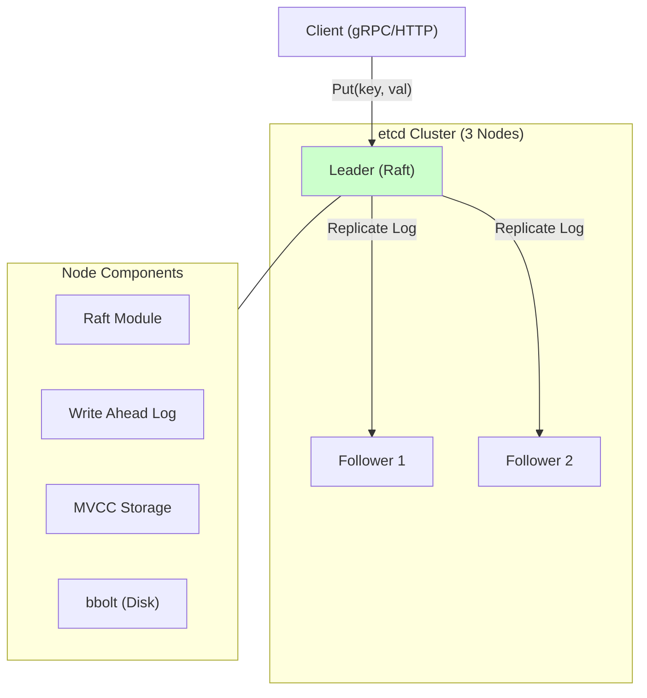
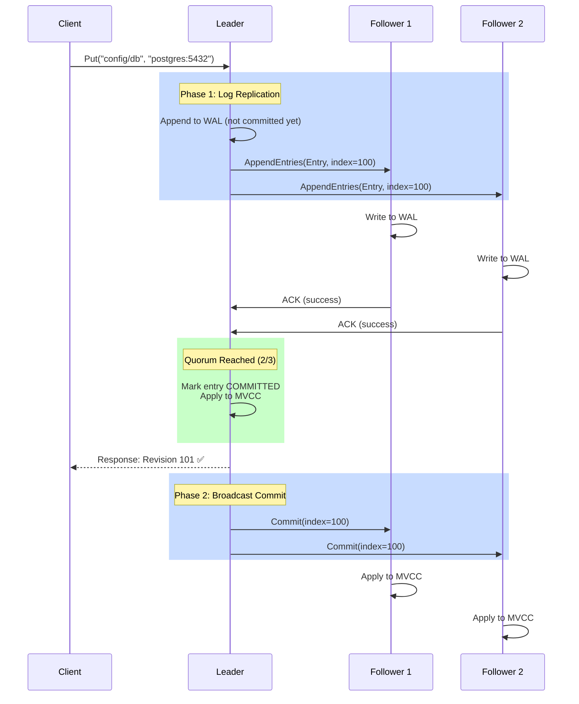

# 04. etcd: Distributed Key-Value Store (Kubernetes Brain)

## 1. Introduction

**etcd** is a strongly consistent, distributed key-value store that provides a reliable way to store data that needs to be accessed by a distributed system or cluster of machines. It is best known as the "brain" of **Kubernetes**, storing all cluster state, configuration, and secrets.

**Name Origin**: The name "etcd" comes from the Unix/Linux convention:
- **`/etc`** = Directory where configuration files are stored on Unix/Linux systems
- **`d`** = "distributed"
- **etcd = "/etc distributed"** - a distributed configuration directory for clusters

Just as `/etc` stores system configuration locally (e.g., `/etc/hosts`, `/etc/nginx.conf`), etcd stores configuration and state across a distributed cluster, making it accessible to all nodes.

**Key Differentiator**: Unlike ZooKeeper which manages a custom hierarchical namespace, etcd is a **flat key-value store** with powerful range query capabilities, built on **Raft** for consensus and offering **Multi-Version Concurrency Control (MVCC)** out of the box.

**Industry Adoption**:
- **Kubernetes**: Primary datastore for all cluster state (Pods, Services, ConfigMaps).
- **CoreDNS**: Backend storage for service discovery.
- **Rook**: Cloud-native storage orchestration.
- **TiKV**: Uses etcd for metadata storage (Placement Driver).

---

## 2. Core Architecture

etcd uses a leader-based architecture where a single leader handles all writes and replicates them to followers.



### Key Components
1.  **Raft Module**: Implements the Raft consensus algorithm for leader election and log replication. Ensures strict ordering of operations.
2.  **WAL (Write Ahead Log)**: The "journal" of the database. Every change is appended here first (`fsync`) before being applied to the state machine. Ensures durability on crash.
3.  **MVCC Backend**: The state machine. It handles multi-version concurrency control, allowing clients to read past versions of keys ("Time Travel").
4.  **bbolt (Storage Engine)**: A memory-mapped B+Tree implementation (fork of BoltDB). It stores the actual data on disk, keyed by **Revision ID**, not the user's key.

---

## 3. How It Works: Basic Mechanics

### A. Data Model (Flat Key-Value with Ranges)
etcd stores keys in a flat binary key space. Hierarchy (folders) is simulated using key prefixes.
*   **Key**: `Binary` (no character set restrictions).
*   **Value**: `Binary` (typically JSON or Protobuf).
*   **Range Query**: `Get("services/", Prefix=true)` effectively gets all keys starting with `services/`.

### B. MVCC (Multi-Version Concurrency Control)
etcd doesn't overwrite data. It creates a new **Revision** for every modification.
*   **Revision**: Global 64-bit counter, acts as the logical clock.
*   **Generations**: How many times a key has been created/deleted.

```javascript
// Timeline of Key "foo"
Revision 1: Put("foo", "bar")  -> {Key: "foo", Val: "bar", CreateRev: 1, ModRev: 1, Ver: 1}
Revision 2: Put("foo", "baz")  -> {Key: "foo", Val: "baz", CreateRev: 1, ModRev: 2, Ver: 2}
Revision 3: Delete("foo")      -> {Key: "foo", Val: "",   CreateRev: 0, ModRev: 3, Ver: 0} (Tombstone)
```

### C. Watch Streams (Long-Lived Notifications)
Unlike ZooKeeper's one-time triggers, etcd uses **gRPC bidirectional streams**.
*   **Multiplexing**: One connection can handle thousands of watchers.
*   **Resiliency**: If connection drops, client reconnects and asks for "events since Revision X". No events are missed.

### D. Leases (Session Management with TTL)

**What is a Lease?**

A **lease** is etcd's mechanism for **time-based session management**. It's a token with a **Time-To-Live (TTL)** that automatically expires if not renewed.

**Key Concepts**:

1. **TTL (Time-To-Live)**: 
   - Duration before the lease expires (e.g., 10 seconds, 30 seconds)
   - Lease is created with: `LeaseGrant(TTL=30s)` → Returns Lease ID (e.g., `12345`)

2. **Attaching Keys to Leases**:
   - Keys can be bound to a lease
   - When lease expires → **etcd automatically deletes all keys attached to it**
   - Example: `Put("/service/instance-1", "http://10.0.1.5", LeaseID=12345)`

3. **KeepAlive (Renewal)**:
   - Client sends periodic heartbeats to keep lease alive
   - If client crashes/disconnects → No more KeepAlive → Lease expires
   - Typical pattern: KeepAlive every `TTL/3` (e.g., every 10s for 30s TTL)

**Why Leases Are Useful**:

| Use Case | How Lease Helps |
|:---------|:----------------|
| **Leader Election** | Leader holds lease; if leader crashes, lease expires → Others detect via watch |
| **Service Discovery** | Service instance registers with lease; if instance dies, registration auto-removed |
| **Distributed Locks** | Lock holder maintains lease; if holder crashes, lock auto-released |
| **Session Management** | Track active connections; auto-cleanup when connection dies |

**Example Flow**:

```
1. Client creates lease: LeaseGrant(TTL=30s) → LeaseID=100
2. Client puts key with lease: Put("/lock/resource", "client-1", LeaseID=100)
3. Client keeps lease alive: KeepAlive(LeaseID=100) every 10 seconds
4. If client crashes:
   → No more KeepAlive
   → After 30s, lease expires
   → etcd deletes "/lock/resource" automatically
   → Other clients watching the key get notified
```

**Lease Lifecycle**:

```
t=0s:   LeaseGrant(TTL=30s) → LeaseID=100
t=5s:   KeepAlive(100) → TTL reset to 30s ✅
t=15s:  KeepAlive(100) → TTL reset to 30s ✅
t=25s:  KeepAlive(100) → TTL reset to 30s ✅
t=35s:  (Client crashes - no KeepAlive)
t=65s:  Lease expires → All keys with LeaseID=100 deleted automatically
```

**Key Guarantee**: Leases provide **automatic cleanup** without manual intervention. No orphaned keys!

---

**Leases vs ZooKeeper Sessions (Why Leases Are Better)**:

| Feature | ZooKeeper Sessions | etcd Leases | Winner |
|:--------|:-------------------|:------------|:-------|
| **Granularity** | One session per connection | Multiple leases per connection | etcd ✅ |
| **TTL Control** | Global session timeout (same for all ephemeral nodes) | Per-lease TTL (different resources can have different timeouts) | etcd ✅ |
| **Resource Management** | All ephemeral nodes tied to one session | Different keys can attach to different leases | etcd ✅ |
| **Network Efficiency** | One heartbeat per connection | Batch KeepAlive for multiple leases in single RPC | etcd ✅ |
| **Failure Isolation** | Session dies → ALL ephemeral nodes die | Lease dies → Only keys attached to that lease die | etcd ✅ |
| **Flexibility** | Can't have different TTLs for different resources | Leader election (10s TTL) + Service registration (30s TTL) in same app | etcd ✅ |

**Concrete Example**:

**ZooKeeper** (Session-based):
```
Client connects → Creates session (timeout=30s)
Creates ephemeral nodes:
  /elections/leader → "node-1"
  /services/api/instance-1 → "10.0.1.5"
  /locks/resource-X → "node-1"

Problem: ALL three use same 30s timeout!
- Leader election might need aggressive 5s timeout
- Service registration might be fine with 60s timeout
- No way to differentiate!

If session dies → ALL nodes deleted (might want different behavior)
```

**etcd** (Lease-based):
```
Client connects
Creates multiple leases:
  Lease1 (TTL=5s)  → For leader election (fast failover)
  Lease2 (TTL=30s) → For service registration (reduce heartbeat overhead)
  Lease3 (TTL=10s) → For distributed locks

Attaches keys to appropriate leases:
  Put("/elections/leader", "node-1", Lease=1)
  Put("/services/api/instance-1", "10.0.1.5", Lease=2)
  Put("/locks/resource-X", "node-1", Lease=3)

Batch KeepAlive:
  KeepAlive([Lease1, Lease2, Lease3]) → Single RPC!

If lock holder crashes:
  → Only Lease3 dies
  → Only /locks/resource-X deleted
  → Leader and service registration still active ✅
```

**Key Improvements**:

1. **Flexible TTLs**: Leader election needs fast failover (5s), but service discovery can use longer TTLs (30s) to reduce heartbeat overhead
2. **Failure Isolation**: If lock acquisition code crashes, only the lock is released—leader status and service registration remain
3. **Reduced Network Overhead**: Batch KeepAlive for multiple leases in single RPC vs separate heartbeats per resource
4. **Fine-grained Control**: Can selectively revoke individual leases without affecting others

**ZooKeeper Limitation**:
```
Session timeout = 30s
BUT need fast leader failover (5s)

Choices:
1. Set session timeout = 5s
   → Leader failover fast ✅
   → But ALL ephemeral nodes have 5s timeout
   → Service registrations flap on minor network hiccups ❌

2. Set session timeout = 30s
   → Service registrations stable ✅
   → But leader failover takes 30s ❌
   → Unacceptable for HA systems

Result: One-size-fits-all doesn't work!
```

**etcd Solution**:
```
Lease1 (5s TTL) → Leader election (fast failover) ✅
Lease2 (30s TTL) → Service discovery (stability) ✅
Both in same application, same connection!
```

---

### E. Coordination Patterns: How Systems Use etcd

This section demonstrates how distributed systems leverage etcd for common coordination tasks.

#### Pattern 1: Configuration Management

**Use Case**: Centralized config that updates live across 100 microservices.

**Implementation Steps**:
1. **Initial Read**: Service starts and reads current config from etcd (e.g., `/config/db/connection-string`).
2. **Apply Config**: Service uses the config to establish database connections.
3. **Watch for Changes**: Service opens a gRPC watch stream on the config key.
4. **Receive Update**: When DevOps updates the config in etcd, watch stream fires an event.
5. **Hot Reload**: Service receives new value, closes old DB connections, opens new ones with updated config.

**Key Benefit**: Zero-downtime config updates. No service restart needed.


**Real-World Example: Kubernetes ConfigMaps**
```
Kubernetes stores ConfigMaps in etcd:
  Key: /registry/configmaps/default/app-config
  Value: {"db_host": "postgres.svc", "timeout": "30s"}

Kubelet watches this key. When updated:
1. etcd sends event to Kubelet
2. Kubelet remounts config volume in Pod
3. App detects file change, reloads config
```

#### Pattern 2: Leader Election

**Use Case**: Ensure only ONE controller processes jobs across N replicas to avoid duplicate work.

**Implementation Steps**:
1. **Create Session**: Each replica creates an etcd lease with TTL (e.g., 10 seconds).
2. **Campaign for Leadership**: Replica tries to create a key `/elections/controller` with its ID, attached to its lease.
3. **Check Result**:
   - **First to create wins** → Becomes leader, starts processing jobs.
   - **Key already exists** → Becomes follower, watches the leader's key.
4. **Leader Maintains Session**: Leader continuously renews its lease (KeepAlive every ~3 seconds).
5. **Automatic Failover**: If leader crashes:
   - Lease expires (no KeepAlive)
   - etcd deletes the key
   - Follower watching the key gets notified
   - First follower to recreate the key becomes new leader

**How Election Safety Works**:
- Internally uses **CreateRevision** ordering
- Multiple replicas may try to create simultaneously
- etcd's atomic operations ensure only ONE succeeds
- Others get sorted by CreateRevision and watch their predecessor

**Real-World: Kubernetes Controller Manager**
```
Multiple controller-manager replicas run, but only ONE is active:

Key: /kube-system/kube-controller-manager
Value: {"holderIdentity": "node-1", "leaseDurationSeconds": 15}

If node-1 crashes:
→ Lease expires (no KeepAlive)
→ node-2 watches deletion
→ node-2 becomes leader
→ Takes over reconciliation loops
```

#### Pattern 3: Service Discovery / Cluster Status

**Use Case**: Microservices register themselves; load balancers discover available instances dynamically.

**Service Registration Steps (Each Instance)**:
1. **Create Lease**: Service creates a 30-second TTL lease on startup.
2. **Register Endpoint**: Writes key `/services/payment-api/instance-1` with value `http://10.0.1.5:8080`, attached to the lease.
3. **Keep-Alive Loop**: Continuously renews lease every 10 seconds.
4. **Automatic Cleanup**: If instance crashes, lease expires → etcd deletes the key.

**Service Discovery Steps (Load Balancer)**:
1. **Initial Discovery**: Load balancer reads all keys under `/services/payment-api/` prefix.
2. **Build Routing Table**: Extracts all instance endpoints from returned keys.
3. **Watch for Changes**: Opens watch stream on the prefix.
4. **Dynamic Updates**:
   - **PUT event** (new instance) → Add to routing pool
   - **DELETE event** (instance died) → Remove from routing pool


**etcd State**:
```
/services/payment-api/instance-1 -> "http://10.0.1.5:8080" (Lease: 100)
/services/payment-api/instance-2 -> "http://10.0.1.6:8080" (Lease: 101)
/services/payment-api/instance-3 -> "http://10.0.1.7:8080" (Lease: 102)

If instance-2 crashes:
→ Lease 101 expires (no KeepAlive)
→ etcd deletes /services/payment-api/instance-2
→ API Gateway watch fires: EventTypeDelete
→ Gateway removes 10.0.1.6 from routing table
```

**Real-World: CoreDNS + etcd**
```
CoreDNS uses etcd as backend for service discovery:

$ etcdctl put /skydns/local/cluster/web/x1 '{"host":"10.0.1.5","port":8080}'

DNS Query:
$ dig web.cluster.local
Answer: 10.0.1.5

CoreDNS watches /skydns/ prefix. On changes:
→ Automatically updates DNS records
→ No restart needed
```

---

## 4. Deep Dive: Internal Implementation

### A. Storage Layout: KeyIndex vs BoltDB
etcd separates the "index" from the "data".

1.  **RAM (KeyIndex)**: A B-Tree that maps **User Key → Revision**.
    *   Example: `"config/db"` → `Revision 55`.
    *   This index is rebuilt from disk on startup.
2.  **Disk (BoltDB)**: A B+Tree that maps **Revision → KeyValue**.
    *   Example: `Revision 55` → `{Key: "config/db", Value: "192.168.1.5"}`.

**Why?** This enables O(1) lookups for "history". To get "all changes since revision 10", etcd simply scans the B+Tree on disk starting at key `10`.

### B. The Life of a `Put` (Internal Flow)
```go
// Simplified flow in code
func (s *EtcdServer) Put(ctx context.Context, r *pb.PutRequest) {
    // 1. Propose to Raft
    err := s.raftNode.Propose(ctx, data)
    
    // 2. Wait for Commit (Apply)
    <-s.applyWait
    
    // 3. Update MVCC
    rev := s.kv.Write()
    index.Put(key, rev)      // Update RAM index
    bolt.Put(rev, value)     // Write to Disk
}
```

### C. Compaction (Garbage Collection)
Since etcd keeps every version, the disk fills up. **Compaction** removes old revisions.
*   **Periodic**: `auto-compaction-retention=1h` (keeps last hour of history).
*   **Mechanism**: Removes entries from BoltDB and frees pages.
*   **Defrag**: BoltDB doesn't return space to OS automatically. You must run `etcdctl defrag` to shrink the file size.

### D. Raft Consensus Flow (How etcd Achieves Agreement)

etcd uses Raft to ensure all nodes agree on the order of operations. Here's the detailed flow:



**Key Points**:
1. **WAL First**: All nodes write to WAL before acknowledging (durability).
2. **Quorum**: Leader waits for majority ACKs before committing.
3. **Two-Phase**: First replicate log, then apply to state machine.
4. **Linearizability**: Client sees committed state immediately after response.

### E. Read Consistency Models

etcd supports two read modes with different trade-offs:

#### Linearizable Read (Default - Strong Consistency)
```go
cli.Get(context.Background(), "config/db") // Linearizable by default
```

**How it works**:
1. Leader receives read request.
2. Leader sends **ReadIndex** heartbeat to followers.
3. Followers ACK (proves leader is still leader).
4. Leader confirms commit index advancing.
5. Leader reads from local MVCC and returns.

**Guarantee**: Sees all writes committed before this read started.
**Cost**: ~1 RTT to followers (1-2ms overhead).

#### Serializable Read (Relaxed - May be Stale)
```go
cli.Get(context.Background(), "config/db", clientv3.WithSerializable())
```

**How it works**:
1. Any node (leader or follower) receives read.
2. Reads directly from local MVCC.
3. Returns immediately (no network check).

**Guarantee**: Linearizable **prefix** (may miss latest writes).
**Cost**: ~100μs (local read).
**Use When**: Reading dashboards, metrics (eventual consistency OK).

**Stale Read Example**:
```
t=0: Client A writes "v2" to leader (committed, revision 100)
t=1: Follower still at revision 99 (replication lag)
t=2: Client B reads from Follower (Serializable)
     → Returns "v1" (stale!)
t=3: Follower applies revision 100
t=4: Client B reads again → Returns "v2" ✅
```

### F. etcd Cluster Coordination (How Nodes Stay in Sync)

#### Heartbeat Mechanism
```
Leader sends heartbeat every 100ms:
  AppendEntries(entries=[], term=5, leaderCommit=100)

Followers respond:
  - Reset election timeout
  - Update commit index if behind
  - Advance MVCC state machine
```

#### Leader Election (When Leader Fails)
```
t=0:  Follower B stops receiving heartbeats
t=1s: B's election timeout fires (random 1000-2000ms)
t=1s: B → CANDIDATE
      B: term 5 → 6
      B: votes for self (1 vote)
      B → All: RequestVote(term=6, lastLogIndex=100)

t=1.1s: Follower C receives RequestVote
        C: "My log is at index 100, term 5"
        C: "Candidate's log is at index 100, term 5"
        C: "Candidate is up-to-date" → Vote YES

t=1.2s: B receives votes: {B, C} = 2/3 majority ✅
        B → LEADER (term 6)
        B sends heartbeat to all
```

**Election Safety**: Only nodes with **most up-to-date log** can win.
- Compare last log term (higher wins).
- If tied, compare last log index (higher wins).

---

## 5. End-to-End Walkthrough: Life of a Transaction

### Scenario: Kubernetes Updates Pod Status
Kubernetes wants to update a Pod's status to "Running", but only if the current version matches (Optimistic Locking).

### Step 1: Client Request (Txn)
Kube-apiserver sends a conditional transaction:
```text
If:   ModRevision("pod/web-1") == 100
Then: Put("pod/web-1", "Running")
Else: Get("pod/web-1")
```

### Step 2: Leader Processing (Raft)
1.  Leader receives request.
2.  Appends `Txn` proposal to its **WAL**.
3.  Broadcasts `AppendEntries` to followers.

### Step 3: Consensus & Commit
1.  Followers receive log, write to their WAL, return `ACK`.
2.  Leader counts ACKs. Once `(N/2)+1` reached, marks entry **COMMITTED**.

### Step 4: Application (MVCC)
1.  Leader executes the `If` check against local state.
2.  If true, generates new Revision (e.g., 101).
3.  Writes `{Rev: 101, Key: "pod/web-1", Val: "Running"}` to **BoltDB**.
4.  Updates RAM index: `"pod/web-1" -> 101`.

### Step 5: Notification
1.  Leader responds to client: "Success".
2.  Any controllers watching `pod/` receive the update event via their open gRPC streams.

---

## 6. Failure Scenarios (The Senior View)

### Scenario A: Split Brain (Network Partition)
**Symptom**: 3-node cluster splits into {A} and {B, C}.
**Mechanism**:
*   **A (Minority)**: Tries to lead, but cannot get quorum (needs 2 votes). Writes time out.
*   **B, C (Majority)**: B detects A is gone. B starts election. C votes for B. B becomes Leader.
**Result**: {B, C} accept writes. {A} is read-only (or unavailable).
**Fix**: Ensure `min-election-timeout` > network RTT to prevent flaky elections.

### Scenario B: Database Space Exceeded
**Symptom**: `etcdserver: mvcc: database space exceeded`. Writes fail immediately.
**Cause**: etcd has a hard limit (default 2GB). Compaction isn't keeping up, or leak.
**The Fix**:
1.  Get current revision: `etcdctl endpoint status`.
2.  Compact: `etcdctl compact <revision>`.
3.  Defrag: `etcdctl defrag`.
4.  Disarm Alarm: `etcdctl alarm disarm`.

### Scenario C: Slow Disk (High fsync latency)
**Symptom**: `etcdserver: operations applied too slowly`. Leader elections happen randomly.
**Cause**: WAL writes (fsync) taking > 10ms. Raft heartbeat is blocked.
**Fix**: Move WAL to dedicated SSD. Use `ionice` to prioritize etcd process.

---

## 7. Performance Tuning / Scaling Strategies

### A. Tuning Configuration
| Configuration | Recommended | Why? |
| :--- | :--- | :--- |
| `--quota-backend-bytes` | 8GB (Default 2GB) | Default is too small for K8s. raising avoids "space exceeded". |
| `--snapshot-count` | 100,000 | Controls how often snapshots are saved to disk. |
| `--heartbeat-interval` | 100ms | Fast failure detection. |
| `--election-timeout` | 1000ms | 10x heartbeat. Tolerates minor network blips. |

### B. Hardware Recommendations
*   **Disk**: NVMe SSD is essentially required. Latency < 1ms for fsync.
*   **CPU**: 4+ Cores. Gzip compression and TLS termination are expensive.
*   **Network**: 10Gbps low latency. Cross-region is discouraged.

---

## 8. Constraints & Limitations

| Constraint | Limit | Why? |
| :--- | :--- | :--- |
| **Max DB Size** | ~8 GB | BoltDB uses `mmap`. Large DBs cause huge RAM usage and GC pauses. |
| **Value Size** | < 1.5 MB | Large values block the single Raft log stream, spiking latency for everyone. |
| **Transaction Size** | < 128 Ops | Transactions are atomic; large ones lock the MVCC state. |
| **Cluster Size** | 3, 5, or 7 | 9+ nodes add almost no availability value but severely hurt write speed. |

---

## 9. When to Use etcd?

| Use Case | Verdict | Why? |
| :--- | :--- | :--- |
| **Kubernetes / Orchestration** | **YES** | The standard. Watch streams perfect for state reconciliation loops. |
| **Configuration Management** | **YES** | Reliable, provides history/rollback via MVCC. |
| **Service Discovery** | **YES** | Leases allow efficient heartbeat/TTL management. |
| **High-Volume Analytics** | **NO** | 8GB limit and strict consistency make it unsuitable for data lakes. |
| **Message Queue** | **NO** | Not designed for high-throughput sequential reads/writes like Kafka. |
| **Cache (Redis repl)** | **NO** | Disk-based durability and consensus make it too slow for caching. |

---

## 10. Production Checklist

1.  [ ] **Set Quota**: `etcd --quota-backend-bytes=8589934592` (8GB).
2.  [ ] **Enable Auto-Compaction**: `etcd --auto-compaction-retention=1`.
3.  [ ] **Separate WAL Disk**: Mount WAL on a separate physical SSD if possible.
4.  [ ] **Monitor Metrics**:
    *   `etcd_disk_wal_fsync_duration_seconds` (Should be p99 < 10ms).
    *   `etcd_server_has_leader` (Alert if 0).
5.  [ ] **Backup Strategy**: Cron job running `etcdctl snapshot save` hourly.
6.  [ ] **Client KeepAlive**: Configure gRPC keepalive to typical 10s-30s to detect broken connections.


