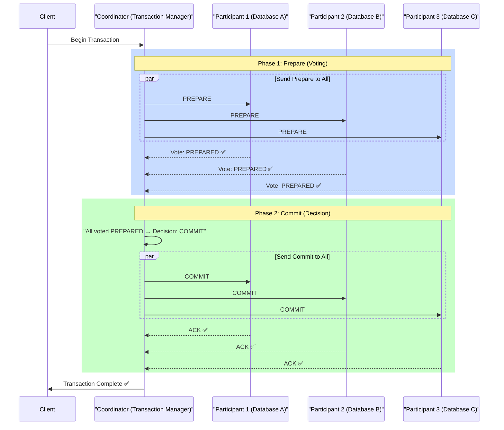
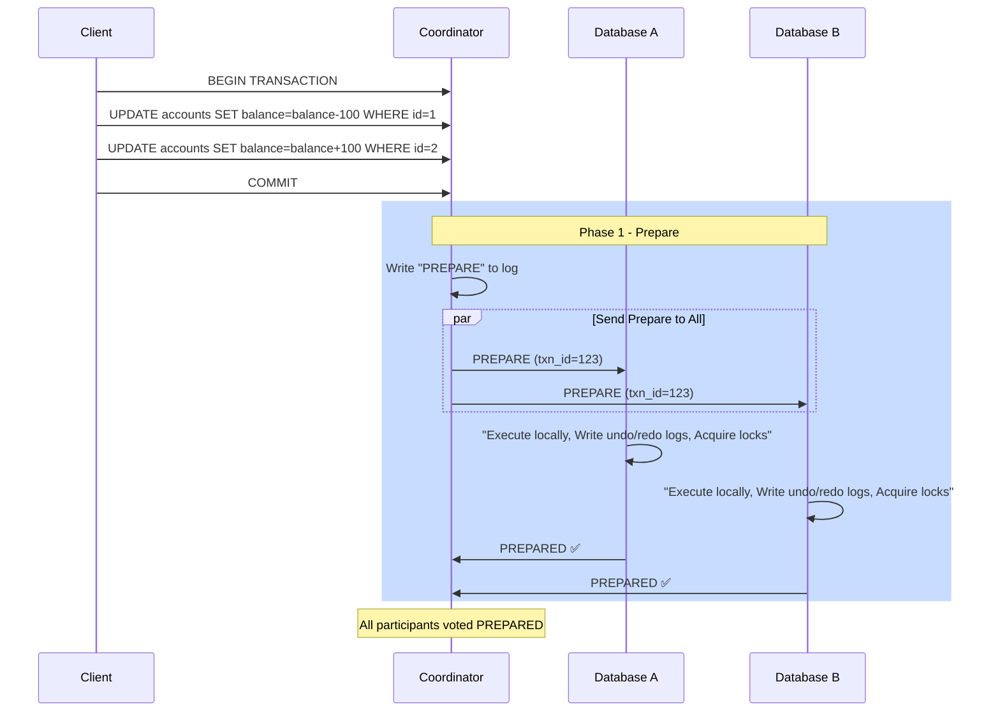
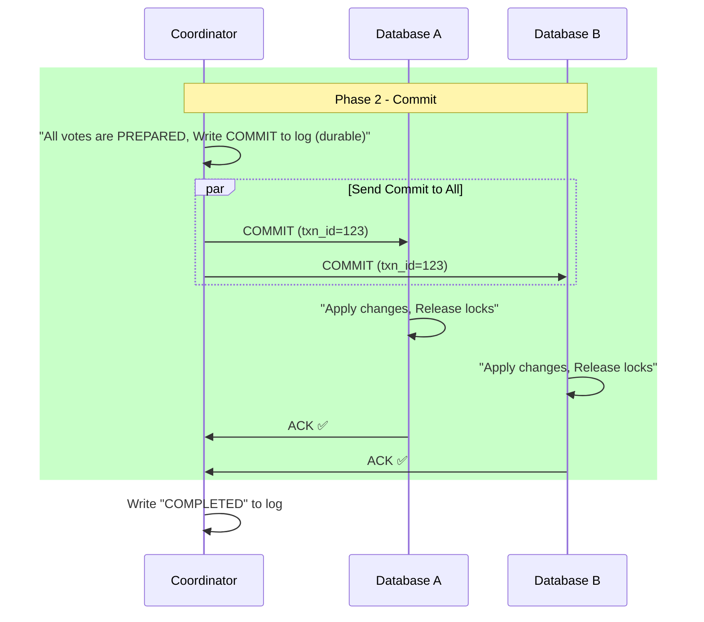
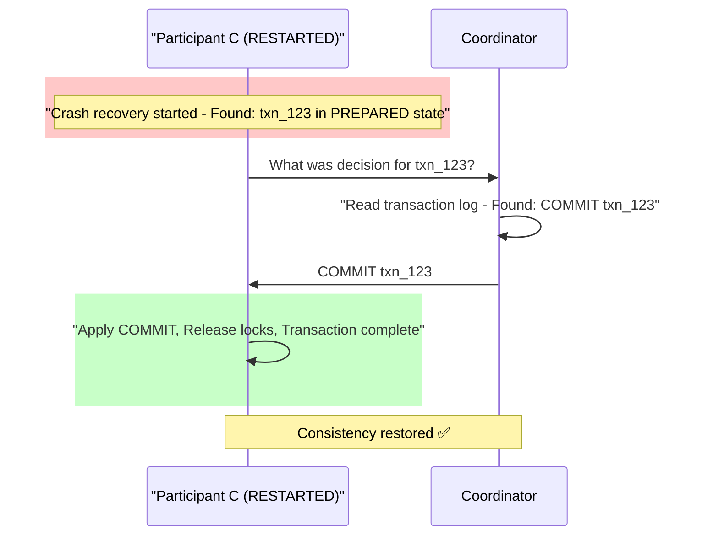
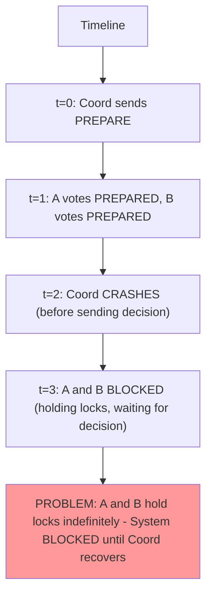
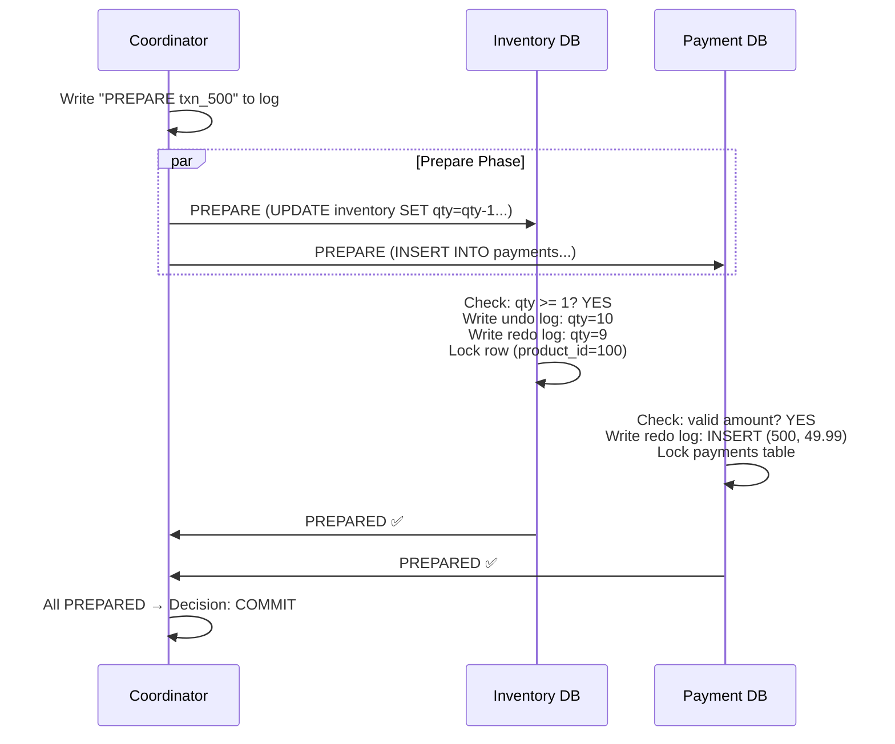
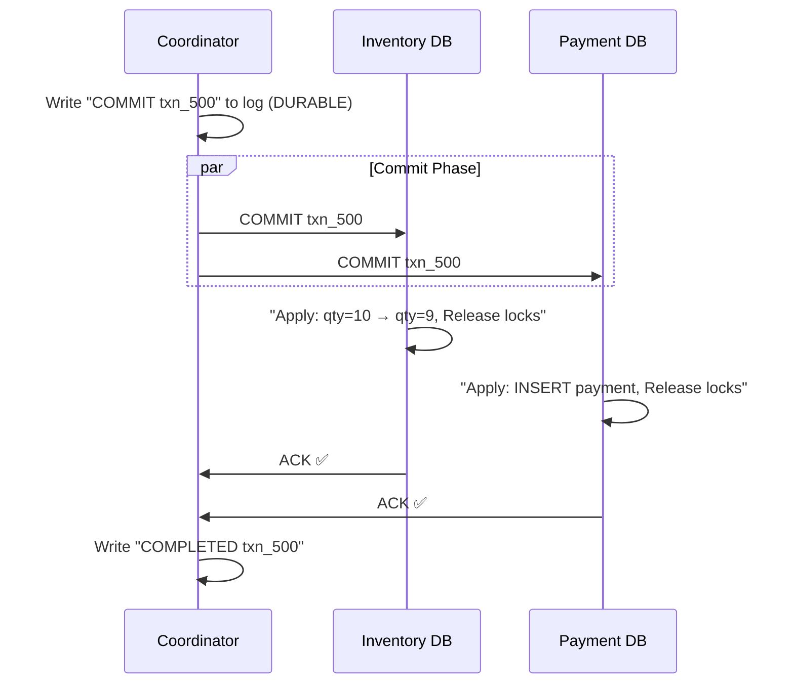
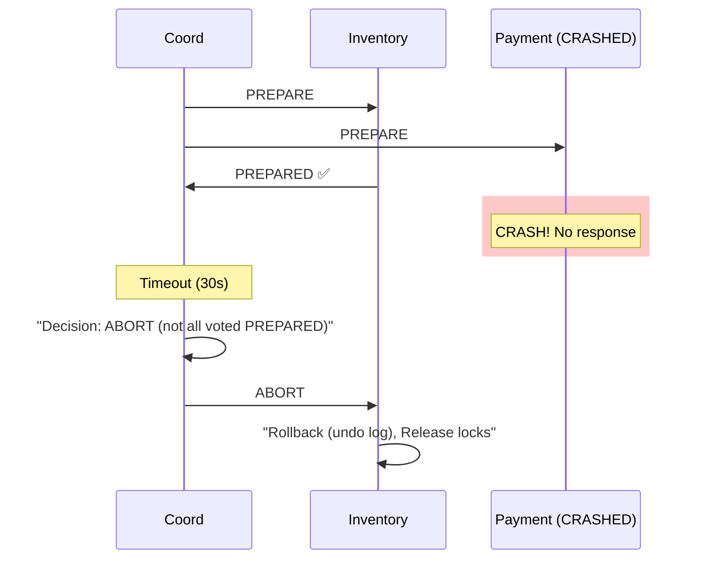
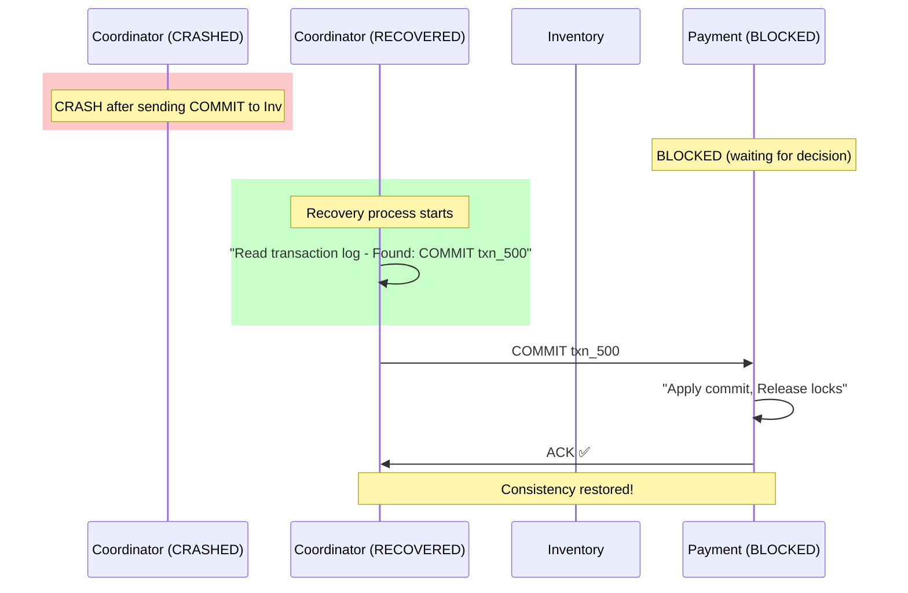
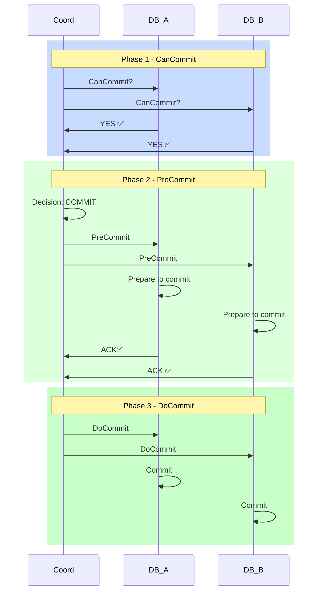

# 05. Two-Phase & Three-Phase Commit: Distributed Transactions

## 1. Introduction

**Two-Phase Commit (2PC)** and **Three-Phase Commit (3PC)** are distributed transaction protocols that ensure **atomicity** across multiple nodes: either all nodes commit a transaction, or all abort.

**Why 2PC/3PC Matter**: They solve the fundamental problem of **distributed transactions**:
- **E-commerce**: Deduct payment AND reserve inventory atomically
- **Banking**: Withdraw from Account A AND deposit to Account B atomically
- **Microservices**: Update Order service AND Inventory service atomically

**Used By**:
- **Traditional Databases**: MySQL Cluster, PostgreSQL (2PC)
- **XA Transactions**: Java EE, Spring (@Transactional across databases)
- **Google Spanner**: TrueTime + 2PC for global consistency
- **Saga Pattern**: Compensating transactions (alternative to 2PC)

**Key Differentiator**: 2PC provides **strong consistency** (ACID) but sacrifices **availability** during coordinator failure. 3PC attempts to improve availability but is rarely used in practice due to complexity.

---

## 2. Core Architecture

2PC uses a **coordinator-participant** model where one node (coordinator) orchestrates the commit across multiple participants.



### Key Components

**1. Coordinator (Transaction Manager)**: Orchestrates the transaction. Single point of failure.

**2. Participants**: Database nodes that execute local transactions. Must support "prepare" state (write-ahead log).

**3. Transaction Log**: Durable log for coordinator decisions. Critical for recovery.

**4. Locks**: Participants hold locks during prepare phase (blocking).

**5. Timeout**: Participants abort if no decision from coordinator within timeout.

---

## 3. How It Works: Two-Phase Commit

### A. Phase 1: Prepare (Voting Phase)

**Goal**: Ask all participants: "Are you ready to commit?"



**What Happens**:
1. Coordinator sends PREPARE to all participants
2. Each participant:
   - Executes transaction locally (but doesn't commit)
   - Writes undo/redo logs to disk (durable)
   - Acquires all necessary locks
   - Responds PREPARED (yes) or ABORT (no)

**Critical Point**: Once a participant votes PREPARED, it **must be able to commit** (cannot back out).

### B. Phase 2: Commit (Decision Phase)

**Goal**: If all voted PREPARED → COMMIT, else → ABORT.



**What Happens**:
1. Coordinator decides:
   - If **all** PREPARED → Send COMMIT
   - If **any** ABORT → Send ABORT
2. Coordinator writes decision to durable log (critical!)
3. Participants apply decision and release locks

---

## 4. Deep Dive: Failure Scenarios

### A. Participant Fails During Prepare

**Scenario**: Database B crashes before voting.

```
Timeline:
t=0: Coordinator sends PREPARE to A, B
t=1: A responds PREPARED ✅
t=2: B crashes (no response) ❌
t=5: Coordinator timeout → Decision: ABORT

Result: Coordinator sends ABORT to A
        A rolls back, releases locks
        Transaction aborted (safe)
```

**Outcome**: **Transaction aborted**. Safe because no commit decision was made.

---

### B. Participant Fails After Voting PREPARED (Before Receiving COMMIT)

**Scenario**: Participant crashes after voting PREPARED but before receiving the COMMIT decision.

**Why This is Different**: The participant voted YES, so the coordinator will decide COMMIT. But the participant is now down.

#### The Problem

```
Timeline:
t=0: Coordinator sends PREPARE to A, B, C
t=1: A responds PREPARED ✅
t=2: B responds PREPARED ✅
t=3: C responds PREPARED ✅
t=4: Coordinator decides COMMIT (all voted yes)
t=5: Coordinator writes "COMMIT txn_123" to durable log ✅
t=6: C CRASHES ❌ (before receiving COMMIT message)
t=7: Coordinator sends COMMIT to A, B (successful)
t=8: Coordinator tries to send COMMIT to C (fails - C is down)

State:
- Coordinator: Decided COMMIT ✅ (logged)
- Participant A: Committed ✅
- Participant B: Committed ✅
- Participant C: Still in PREPARED state (crashed, holding locks) ❌
```

**Impact**: **Partial commit** - Some participants committed, one is down but will commit on recovery.

---

#### Recovery Mechanism

**When Participant C Restarts**:



**Recovery Steps**:

1. **C Discovers Incomplete Transaction**:
   - On restart, C scans its transaction log
   - Finds txn_123 in PREPARED state (not committed or aborted)
   
2. **C Contacts Coordinator**:
   - Sends: "What was the decision for txn_123?"
   
3. **Coordinator Responds**:
   - Reads durable log: "COMMIT txn_123"
   - Sends: COMMIT to C
   
4. **C Applies Decision**:
   - Commits the transaction
   - Releases locks
   - Marks txn_123 as COMPLETED

**Alternative: Coordinator Proactive Retry**:
```
Coordinator detects C is back online
Coordinator: "I have pending COMMIT for you: txn_123"
C: Applies COMMIT ✅
```

---

#### Why This is Safe

**Critical Guarantee**: Once a participant votes PREPARED, it **MUST be able to commit**.

**How Participant Guarantees This**:
```
When voting PREPARED, participant ensures:
1. All constraints validated ✅
2. Undo/redo logs written to disk ✅
3. Locks acquired ✅
4. Transaction can survive crash and be committed later ✅
```

**Durable Log on Coordinator**:
```
Coordinator's transaction log (durable):
- PREPARE txn_123 (written at t=0)
- COMMIT txn_123 (written at t=5)

Even if coordinator crashes:
→ On restart, reads log
→ Knows to send COMMIT to any missing participants
```

---

#### Comparison: Different Failure Timings

| Failure Timing | Coordinator Decision | Outcome |
|:---------------|:---------------------|:--------|
| Before voting PREPARE | ABORT (didn't get all votes) | All abort ✅ |
| **After voting PREPARED** | **COMMIT** (got all votes) | **Partial commit, recovery needed** ⚠️ |
| After receiving COMMIT | COMMIT (normal) | All commit ✅ |

**Key Difference**: 
- Before voting: Safe to ABORT (participant can rollback)
- After voting: Must COMMIT (participant promised it can)

---

### C. Coordinator Fails After Prepare

**The Blocking Problem**:



**Impact**: **Blocking** - Participants hold locks until coordinator recovers. This is 2PC's biggest weakness.

**Recovery**:
```
When coordinator recovers:
1. Read transaction log
2. If log says "PREPARE" → Send ABORT (safe default)
3. If log says "COMMIT" → Send COMMIT (complete transaction)
4. If log says nothing → Send ABORT
```

**Timeout Strategy**:
```
Participant timeout (unilateral abort):
- If no decision after 30s → ABORT locally
- Risk: Coordinator might have decided COMMIT (inconsistency)
- Solution: Coordinator must log decision BEFORE sending it
```

---

## 5. End-to-End Walkthrough: E-Commerce Order

**Scenario**: Place order (deduct inventory AND charge payment atomically).

### Step 1: Client Initiates Transaction

```
Client → Coordinator: BEGIN TRANSACTION
Client → Coordinator: UPDATE inventory SET qty=qty-1 WHERE product_id=100
Client → Coordinator: INSERT INTO payments (order_id, amount) VALUES (500, 49.99)
Client → Coordinator: COMMIT
```

### Step 2: Phase 1 - Prepare



### Step 3: Phase 2 - Commit



### Step 4: Result

```
Inventory DB: product_id=100, qty=9 (was 10) ✅
Payment DB: payment record created ✅
Client: Order confirmed ✅

Atomicity achieved: Either both succeed or both fail
```

---

## 6. Failure Scenarios

### Scenario A: Payment Service Fails During Prepare

**Symptom**: Payment DB crashes before voting.
**Cause**: Hardware failure, network timeout.

#### The Mechanism



**Result**: Transaction aborted. Inventory change rolled back. **Consistent**.

---

### Scenario B: Coordinator Crashes After Commit Decision

**Symptom**: Coordinator crashes after deciding COMMIT but before sending to all.
**Cause**: Coordinator node failure.

#### The Problem

```
Timeline:
t=0: Coord receives PREPARED from Inv, Pay
t=1: Coord writes "COMMIT txn_500" to log ✅
t=2: Coord sends COMMIT to Inv ✅
t=3: Coord CRASHES before sending to Pay ❌

State:
- Coordinator: Log says "COMMIT" (durable)
- Inventory: Committed (qty=9)
- Payment: Still in PREPARED state (holding locks, BLOCKED)
```

#### The Fix: Log-Based Recovery



**Key**: **Durable log** enables recovery. Coordinator must log decision BEFORE sending.

---

### Scenario C: Network Partition (Coordinator Isolated)

**Symptom**: Coordinator can't reach participants after PREPARE.
**Cause**: Network partition.

#### The Problem

```
Network partition: {Coordinator} | {Inv, Pay}

Coordinator state:
- Sent PREPARE, waiting for votes
- Cannot reach participants (timeout)

Participants state:
- Executed PREPARE, holding locks
- Waiting for COMMIT/ABORT decision

Result: DEADLOCK (both sides waiting)
```

#### The Fix: Participant Timeout + Unilateral Abort

```
Participant timeout strategy:
IF no decision after 60 seconds:
  → Unilateral ABORT
  → Release locks
  → Log "ABORTED (timeout)"

Risk: If coordinator actually decided COMMIT → Inconsistency

Mitigation: Coordinator logs decision BEFORE sending
            → Replay log on recovery
```

**Trade-off**: Availability (abort on timeout) vs Consistency (risk of divergence).

---

## 7. Three-Phase Commit (3PC)

**Goal**: Eliminate 2PC's blocking problem.

### How 3PC Works

**Phases**:
1. **CanCommit**: Ask if participants can commit (like 2PC PREPARE)
2. **PreCommit**: Coordinator decides, tells participants to prepare for commit
3. **DoCommit**: Final commit

**Key Difference**: PreCommit phase allows participants to know that coordinator decided COMMIT. If coordinator fails, participants can complete commit autonomously.

### 3PC Flow



**Advantage**: If coordinator fails after PreCommit, participants can timeout and commit autonomously (they know the decision).

**Problem**: **Network partitions** can still cause inconsistency. If partition happens during PreCommit, some participants may commit, others abort.

**Why Rarely Used**: Complexity outweighs benefits. Paxos/Raft provide better solutions.

---

## 8. Constraints & Limitations

| Constraint | Limit | Why? |
| :--- | :--- | :--- |
| **Blocking (2PC)** | Participants block if coordinator fails | Must wait for recovery |
| **Performance** | 2 network round-trips minimum | Prepare + Commit phases |
| **Lock Duration** | Locks held during both phases | Reduces concurrency |
| **Coordinator SPOF** | Single coordinator failure blocks all | No built-in failover |
| **Cross-Region** | NOT recommended | High latency (>100ms RTT = slow) |
| **Partition Tolerance** | Poor (CAP: chooses C over A) | Blocks on network partition |

**2PC vs Alternatives**:

| Protocol | Consistency | Availability | Use Case |
| :--- | :--- | :--- | :--- |
| **2PC** | Strong | Low (blocks) | Database transactions |
| **Saga** | Eventual | High | Microservices |
| **Raft** | Strong | Medium (quorum) | Replicated state machine |
| **Gossip** | Eventual | High | Membership |

---

## 9. When to Use 2PC/3PC?

| Use Case | Verdict | Alternative |
| :--- | :--- | :--- |
| **Single Database Transactions** | ✅ **YES** | N/A (ACID built-in) |
| **XA Transactions** (2 databases, same DC) | ⚠️ **MAYBE** | Saga pattern |
| **Microservices** (cross-service transactions) | ❌ **NO** | Saga, Event Sourcing |
| **Cross-Region Transactions** | ❌ **NO** | Async replication |
| **High Availability Required** | ❌ **NO** | Eventual consistency |
| **Strong Consistency Critical** (banking) | ✅ **YES** | Spanner (2PC + Paxos) |

**2PC vs Saga Pattern**:

**2PC**:
- ✅ Strong consistency (ACID)
- ❌ Blocking (low availability)
- ✅ Simple rollback (ABORT)

**Saga**:
- ✅ High availability (no blocking)
- ⚠️ Eventual consistency
- ❌ Complex: requires compensating transactions

**Verdict**: Use **Saga** for microservices, **2PC** only when ACID is absolutely required.

---

## 10. Production Checklist

1.  [ ] **Coordinator HA**: Deploy coordinator with failover (shared transaction log).
2.  [ ] **Transaction Log**: Use durable storage (SSD, replicated).
3.  [ ] **Timeout Configuration**: Set participant timeout = 2× expected commit time.
4.  [ ] **Lock Timeout**: Auto-rollback after max lock duration (prevent deadlocks).
5.  [ ] **Monitor Block Time**: Alert if participants blocked >10 seconds.
6.  [ ] **Same Region**: Deploy all participants in same datacenter (<5ms latency).
7.  [ ] **Limit Scope**: Keep transactions small (2-3 participants max).
8.  [ ] **Monitoring**: Track prepare time, commit time, abort rate.
9.  [ ] **Avoid Cross-Service 2PC**: Use Saga pattern for microservices instead.
10. [ ] **Test Coordinator Failure**: Verify recovery from crash (log replay works).

**Critical Metrics**:
```
transaction_prepare_latency: <50ms (good), >200ms (slow)
transaction_commit_latency: <100ms (good), >500ms (slow)
transaction_abort_rate: <1% (good), >10% (investigate)
participant_block_time: <1s (good), >10s (blocking issue)
coordinator_failures: 0 (good), >1/day (HA issue)
```

---

**Conclusion**: 2PC provides strong consistency but sacrifices availability. It's best suited for traditional database scenarios. Modern distributed systems prefer **Saga** (eventual consistency) or **Raft/Paxos** (replicated state machines) to avoid the blocking problem.
