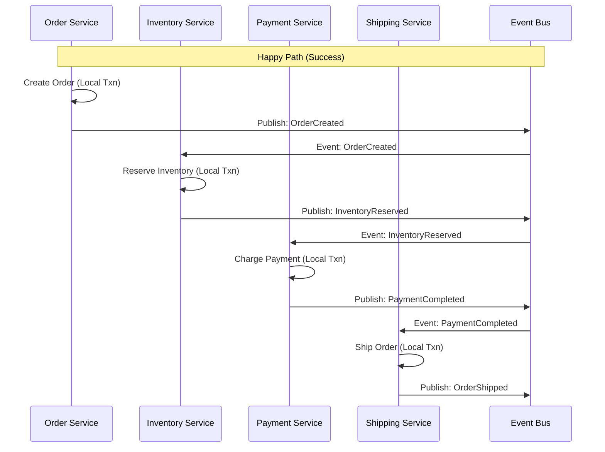
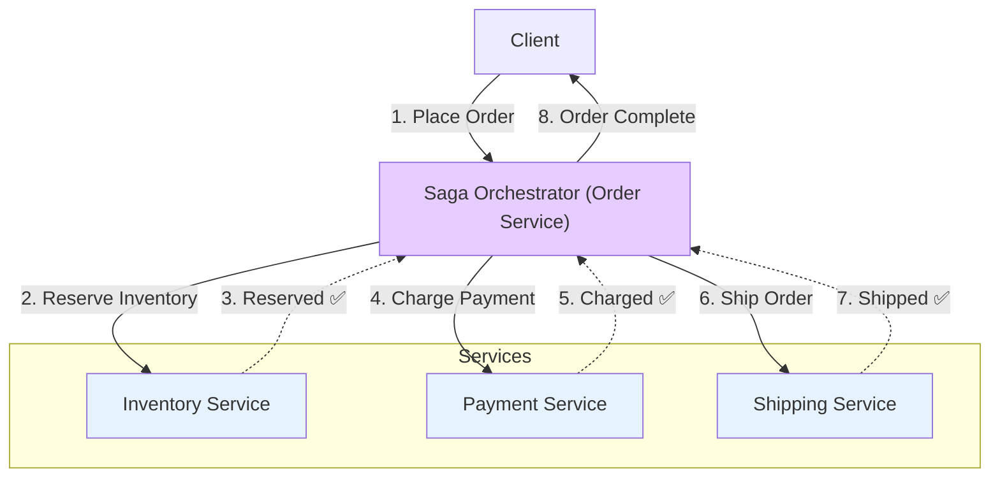
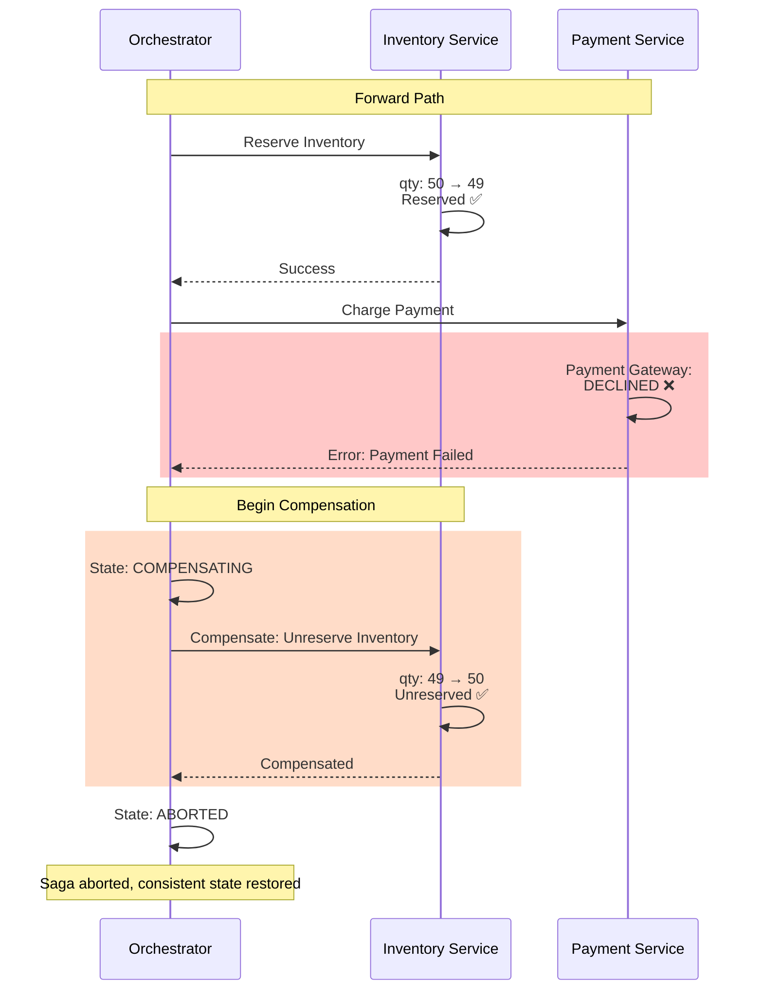
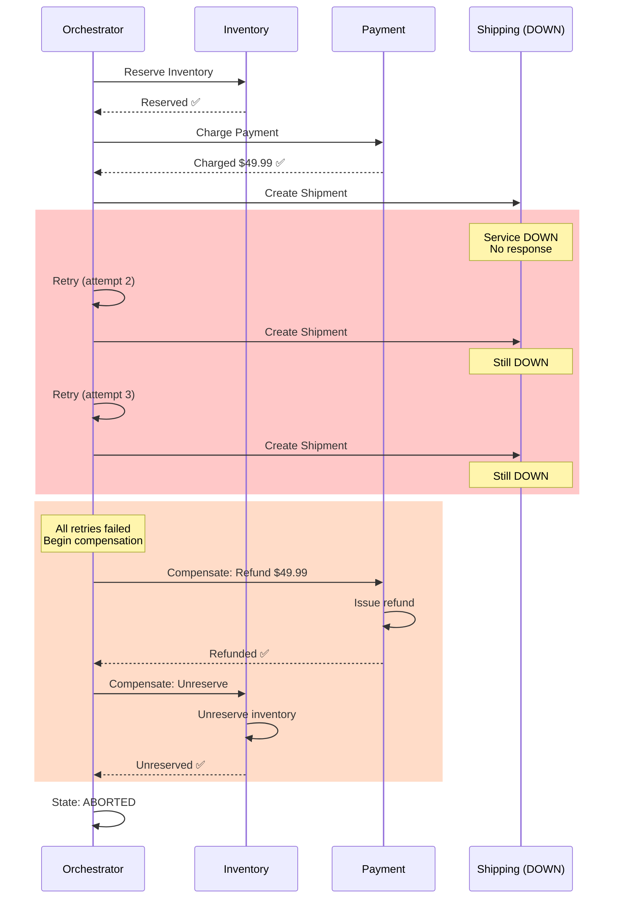
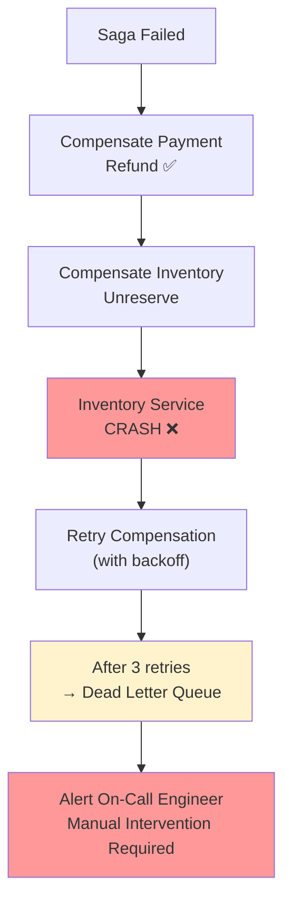

# 06. Saga Pattern: Distributed Transactions Without 2PC

## 1. Introduction

The **Saga Pattern** is a design pattern for managing **long-running distributed transactions** across multiple microservices without using two-phase commit (2PC). Instead of locking resources and coordinating an atomic commit, Sagas break transactions into a sequence of **local transactions**, each with a **compensating transaction** to undo changes if the overall saga fails.

**Problem It Solves**: How do you maintain data consistency across microservices when:
- Each service has its own database (no shared transaction manager)
- 2PC is too slow/blocking for distributed environments
- Services may be owned by different teams/languages/technologies

**Key Differentiator**: Unlike 2PC which provides **strong consistency** through locking and coordination, Sagas provide **eventual consistency** through choreography or orchestration of compensating actions.

**Industry Adoption**:
- **E-Commerce**: Order placement (reserve inventory → charge payment → ship order)
- **Travel Booking**: Flight reservation + hotel booking + car rental
- **Banking**: Fund transfers across accounts/institutions
- **Microservices**: Any multi-service transaction

**Used By**:
- **Netflix**: Internal microservices coordination
- **Uber**: Trip booking and payments
- **Airbnb**: Booking flow
- **Most modern microservice architectures**

**Historical Context**: Introduced in 1987 by Hector Garcia-Molina and Kenneth Salem in their paper "Sagas" to handle long-lived database transactions. Rediscovered and adapted for microservices in the 2010s.

---

## 2. Core Architecture

Sagas can be implemented using two main patterns: **Choreography** (event-driven) and **Orchestration** (centrally coordinated).

### Choreography-Based Saga



### Orchestration-Based Saga



### Key Components

**1. Local Transaction**: Each service executes its own database transaction independently.

**2. Compensating Transaction**: Reverses the effect of a committed local transaction (e.g., unreserve inventory, refund payment).

**3. Saga Execution Coordinator (SEC)**:
   - **Choreography**: Distributed across services (event-driven)
   - **Orchestration**: Centralized coordinator service

**4. Event Bus / Message Broker**: Kafka, RabbitMQ, or similar for event propagation.

**5. Idempotency**: Each service must handle duplicate requests safely.

**6. State Machine**: Tracks saga progress and determines next steps or compensations.

---

## 3. How It Works: Basic Mechanics

### A. Forward Recovery vs Backward Recovery

**Forward Recovery** (Retry until success):
- Continue trying failed steps until they succeed
- Assumes eventual success is possible
- Example: Network timeout → Retry API call

**Backward Recovery** (Compensate):
- Undo completed steps when a later step fails
- Roll back to consistent state
- Example: Payment fails → Unreserve inventory

**Steps**:

**Happy Path** (All steps succeed):
1. Execute Step 1 local transaction → Commit
2. Execute Step 2 local transaction → Commit
3. Execute Step 3 local transaction → Commit
4. Saga completes successfully ✅

**Failure Path** (Step 3 fails):
1. Execute Step 1 → Commit ✅
2. Execute Step 2 → Commit ✅
3. Execute Step 3 → **FAIL** ❌
4. Execute Compensating Transaction 2 (undo Step 2) ✅
5. Execute Compensating Transaction 1 (undo Step 1) ✅
6. Saga aborted, system in consistent state ✅

---

### B. Choreography vs Orchestration

| Aspect | Choreography | Orchestration |
|:-------|:-------------|:--------------|
| **Coordination** | Distributed (event-driven) | Centralized (one orchestrator) |
| **Coupling** | Loose (services don't know about each other) | Tight (orchestrator knows all services) |
| **Complexity** | Higher (distributed state management) | Lower (centralized logic) |
| **Failure Handling** | Each service handles own compensation | Orchestrator manages all compensations |
| **Observability** | Harder (events scattered) | Easier (single source of truth) |
| **Scalability** | Better (no single bottleneck) | Orchestrator can be bottleneck |
| **Use When** | Simple workflows, high autonomy needed | Complex workflows, clear ownership |

---

### C. Compensating Transactions

**Rules for Compensating Transactions**:

1. **Semantic Undo**: Cannot always technically undo (e.g., email sent), must undo **semantically** (send cancellation email)

2. **Idempotency**: Must be safe to retry (network failures may cause duplicate compensation requests)

3. **Always Succeed**: Compensations should not fail. If they do, require manual intervention

4. **Ordering**: Execute in reverse order of original transactions

**Examples**:

| Original Transaction | Compensating Transaction |
|:--------------------|:-------------------------|
| Reserve inventory (qty -= 1) | Unreserve inventory (qty += 1) |
| Charge credit card | Refund credit card |
| Send confirmation email | Send cancellation email |
| Create shipping label | Cancel shipment |
| Deduct loyalty points | Add loyalty points back |

---

### D. Idempotency and Exactly-Once Semantics

**Problem**: Network failures cause duplicate messages

**Example Without Idempotency**:
```
t=0: Orchestrator: "Reserve inventory for Order #123"
t=1: Inventory Service: Reserves 1 unit, qty: 100 → 99
t=2: Network timeout (ACK lost)
t=3: Orchestrator retries: "Reserve inventory for Order #123"
t=4: Inventory Service: Reserves AGAIN, qty: 99 → 98 ❌ WRONG!
```

**Solution: Idempotent Requests**

**Steps**:
1. Include unique request ID (e.g., Order ID)
2. Service checks: "Have I processed this Order ID before?"
3. If yes → Return cached result (no-op)
4. If no → Process and cache result

**Implementation Pattern**:
```
Inventory Service receives: ReserveInventory(OrderID="123", ProductID="P100", Qty=1)

Check database:
  SELECT * FROM reservations WHERE order_id = '123' AND product_id = 'P100'

If found:
  → Return "Already reserved" (idempotent ✅)

If not found:
  → Reserve inventory
  → INSERT INTO reservations (order_id, product_id, qty) VALUES ('123', 'P100', 1)
  → Return "Reserved successfully"
```

---

## 4. Deep Dive: Internal Implementation

### A. State Machine for Saga Execution

**Orchestrator State Machine**:

**States**:
- `STARTED`: Saga initiated
- `IN_PROGRESS`: Executing forward transactions
- `COMPENSATING`: Executing compensating transactions
- `COMPLETED`: All steps succeeded
- `ABORTED`: All compensations executed
- `FAILED`: Unrecoverable error (manual intervention needed)

**State Transitions**:

```
STARTED
  ↓ (start execution)
IN_PROGRESS
  ↓ (step succeeds) → Continue to next step
  ↓ (step fails) → COMPENSATING
COMPENSATING
  ↓ (compensation succeeds) → Continue compensating previous steps
  ↓ (all compensations done) → ABORTED
  ↓ (compensation fails) → FAILED ❌

IN_PROGRESS
  ↓ (all steps succeed) → COMPLETED ✅
```

**Saga State Persistence**:
```
Database Table: saga_executions

Columns:
- saga_id (UUID)
- saga_type (e.g., "OrderPlacement")
- current_state (STARTED, IN_PROGRESS, COMPLETED, etc.)
- current_step (integer: which step currently executing)
- context (JSON: order details, user ID, etc.)
- created_at
- updated_at

After each step:
  UPDATE saga_executions 
  SET current_step = current_step + 1, current_state = 'IN_PROGRESS'
  WHERE saga_id = '...'
```

---

### B. Choreography Implementation Details

**Event-Driven Flow**:

1. **Service A completes local transaction**
2. **Service A publishes event** to message broker (Kafka/RabbitMQ)
3. **Service B listens** for Service A's event
4. **Service B executes its local transaction**
5. **Service B publishes confirmation event**
6. **Cycle continues** until saga completes or fails

**Compensation on Failure**:

1. **Service C fails** during its local transaction
2. **Service C publishes failure event**: `PaymentFailed`
3. **Service B listens** for `PaymentFailed`
4. **Service B executes compensation**: Unreserve inventory
5. **Service B publishes**: `InventoryUnreserved`
6. **Service A listens** for `InventoryUnreserved`
7. **Service A executes compensation**: Cancel order
8. **Service A publishes**: `OrderCancelled`

**Challenges**:
- **No single view** of saga state (distributed across services)
- **Circular dependencies** risk (A → B → A events)
- **Hard to debug** (trace events across multiple services)

---

### C. Orchestration Implementation Details

**Centralized Coordinator Steps**:

1. **Orchestrator receives** request (e.g., Place Order)
2. **Orchestrator creates** saga instance with ID
3. **Orchestrator persists** initial state to database
4. **For each step**:
   - Send sync/async request to target service
   - Wait for response
   - Update saga state in database
   - If success → Move to next step
   - If failure → Begin compensations

**Compensation Flow**:

1. **Step N fails** (e.g., Shipping service unavailable)
2. **Orchestrator marks** state as `COMPENSATING`
3. **For each completed step in reverse order**:
   - Call compensation endpoint on service
   - Wait for confirmation
   - Mark step as compensated
4. **After all compensations** → Mark saga as `ABORTED`

**Retry Logic**:
```
Steps:
1. Orchestrator calls Service A: Reserve Inventory
2. Timeout (no response after 5 seconds)
3. Orchestrator retries (with same request ID for idempotency)
4. Retry attempts: 3 times with exponential backoff (1s, 2s, 4s)
5. If all retries fail → Begin compensation
```

**Dead Letter Queue** (DLQ):
```
If a step fails after all retries:
  → Move saga to FAILED state
  → Publish to Dead Letter Queue
  → Alert on-call engineer
  → Requires manual intervention
```

---

### D. Outbox Pattern for Reliable Event Publishing

**Problem**: Service commits local transaction but crashes before publishing event

**Example**:
```
t=0: Inventory Service: UPDATE inventory SET qty = qty - 1
t=1: Inventory Service: COMMIT transaction ✅
t=2: Inventory Service: CRASH ❌ (before publishing InventoryReserved event)

Result: Inventory updated but event never sent → Saga stuck!
```

**Solution: Outbox Pattern**

**Steps**:
1. **Single transaction** writes both:
   - Business data (e.g., update inventory)
   - Event to `outbox` table

2. **Separate process** (relay) reads from `outbox` table

3. **Relay publishes** events to message broker

4. **Relay deletes** processed events from outbox

**Database Transaction**:
```
BEGIN TRANSACTION;

-- Business logic
UPDATE inventory SET qty = qty - 1 WHERE product_id = 'P100';

-- Event to outbox
INSERT INTO outbox (event_id, event_type, payload, created_at)
VALUES (
  'uuid-123',
  'InventoryReserved',
  '{"order_id": "O456", "product_id": "P100", "qty": 1}',
  NOW()
);

COMMIT;
```

**Relay Process** (runs separately):
```
Steps:
1. SELECT * FROM outbox WHERE published = false ORDER BY created_at LIMIT 100
2. For each event:
   - Publish to Kafka/RabbitMQ
   - If publish succeeds:
     → UPDATE outbox SET published = true WHERE event_id = '...'
   - If publish fails:
     → Retry (with exponential backoff)
3. Periodically DELETE FROM outbox WHERE published = true AND created_at < NOW() - INTERVAL '7 days'
```

**Advantages**:
- **Atomicity**: Event persisted in same transaction as business data
- **No message loss**: Even if service crashes, event is in database
- **At-least-once delivery**: Relay ensures event eventually published

---

## 5. End-to-End Walkthrough: E-Commerce Order Placement

### Scenario: Order with Inventory, Payment, and Shipping

**Services Involved**:
- **Order Service**: Creates order
- **Inventory Service**: Reserves products
- **Payment Service**: Charges customer
- **Shipping Service**: Creates shipment

### Step 1: Client Places Order

**Request**:
```
POST /orders
{
  "customer_id": "C123",
  "items": [{"product_id": "P100", "quantity": 1}],
  "payment_method": "card_4242"
}
```

**Order Service**:
1. Validates request
2. Creates saga instance: `saga_id = "S789"`
3. Persists saga state: `STARTED`
4. Begins execution

---

### Step 2: Reserve Inventory (Orchestration Approach)

**Orchestrator → Inventory Service**:
```
POST /inventory/reserve
{
  "request_id": "S789-step1",  ← Idempotency key
  "product_id": "P100",
  "quantity": 1
}
```

**Inventory Service Steps**:
1. Check idempotency: "Have I seen request_id 'S789-step1' before?"
   - If yes → Return cached response
   - If no → Continue

2. Check stock availability:
   ```
   SELECT qty FROM inventory WHERE product_id = 'P100'
   Result: qty = 50
   ```

3. Reserve inventory (atomic transaction):
   ```
   BEGIN TRANSACTION;
   
   UPDATE inventory 
   SET qty = qty - 1, reserved = reserved + 1 
   WHERE product_id = 'P100' AND qty >= 1;
   
   INSERT INTO reservations (request_id, product_id, qty, order_id)
   VALUES ('S789-step1', 'P100', 1, 'S789');
   
   COMMIT;
   ```

4. Return success:
   ```
   {
     "status": "reserved",
     "reservation_id": "R456"
   }
   ```

**Orchestrator Updates State**:
```
UPDATE saga_executions
SET current_step = 2, current_state = 'IN_PROGRESS'
WHERE saga_id = 'S789';
```

---

### Step 3: Charge Payment

**Orchestrator → Payment Service**:
```
POST /payments/charge
{
  "request_id": "S789-step2",
  "customer_id": "C123",
  "amount": 49.99,
  "payment_method": "card_4242",
  "order_id": "S789"
}
```

**Payment Service Steps**:
1. Check idempotency
2. Call payment gateway (Stripe/PayPal):
   ```
   Stripe API: Create Charge
   → Returns: charge_id = "ch_abc123"
   ```

3. Record payment:
   ```
   INSERT INTO payments (request_id, order_id, charge_id, amount, status)
   VALUES ('S789-step2', 'S789', 'ch_abc123', 49.99, 'completed');
   ```

4. Return success:
   ```
   {
     "status": "charged",
     "charge_id": "ch_abc123"
   }
   ```

**Orchestrator Updates State**:
```
UPDATE saga_executions
SET current_step = 3
WHERE saga_id = 'S789';
```

---

### Step 4: Create Shipment

**Orchestrator → Shipping Service**:
```
POST /shipments/create
{
  "request_id": "S789-step3",
  "order_id": "S789",
  "customer_id": "C123",
  "items": [{"product_id": "P100", "quantity": 1}]
}
```

**Shipping Service Steps**:
1. Check idempotency
2. Create shipping label with carrier (FedEx/UPS)
3. Record shipment:
   ```
   INSERT INTO shipments (request_id, order_id, tracking_number, status)
   VALUES ('S789-step3', 'S789', 'TRACK123', 'created');
   ```

4. Return success:
   ```
   {
     "status": "created",
     "tracking_number": "TRACK123"
   }
   ```

---

### Step 5: Saga Completion

**Orchestrator Updates State**:
```
UPDATE saga_executions
SET current_state = 'COMPLETED', completed_at = NOW()
WHERE saga_id = 'S789';
```

**Orchestrator → Client**:
```
{
  "order_id": "S789",
  "status": "confirmed",
  "tracking_number": "TRACK123"
}
```

**Final State**:
- Inventory: 1 unit reserved
- Payment: $49.99 charged
- Shipment: Created with tracking number
- Saga: Completed ✅

---

## 6. Failure Scenarios (The Senior View)

### Scenario A: Payment Fails After Inventory Reserved

**Symptom**: Customer sees "Payment declined" but inventory shows as reserved.

**Cause**: Payment gateway rejects card.

#### The Mechanism

**Timeline**:
```
t=0: Orchestrator → Inventory: Reserve Product P100
t=1: Inventory: Reserved ✅ (qty: 50 → 49)
t=2: Orchestrator → Payment: Charge $49.99
t=3: Payment Gateway: DECLINED ❌ (insufficient funds)
t=4: Payment Service: Returns error to Orchestrator
t=5: Orchestrator: Begins compensation
```

**Compensation Flow**:



**Compensation Steps**:

1. **Orchestrator detects failure**:
   ```
   Payment Service returned: {"error": "payment_declined"}
   ```

2. **Orchestrator updates state**:
   ```
   UPDATE saga_executions
   SET current_state = 'COMPENSATING'
   WHERE saga_id = 'S789';
   ```

3. **Orchestrator calls compensation**:
   ```
   POST /inventory/unreserve
   {
     "request_id": "S789-comp-step1",  ← Different ID for compensation
     "reservation_id": "R456"
   }
   ```

4. **Inventory Service unreserves**:
   ```
   BEGIN TRANSACTION;
   
   UPDATE inventory 
   SET qty = qty + 1, reserved = reserved - 1 
   WHERE product_id = 'P100';
   
   DELETE FROM reservations WHERE reservation_id = 'R456';
   
   COMMIT;
   ```

5. **Orchestrator marks saga aborted**:
   ```
   UPDATE saga_executions
   SET current_state = 'ABORTED', aborted_at = NOW()
   WHERE saga_id = 'S789';
   ```

6. **Client notified**:
   ```
   {
     "error": "payment_declined",
     "message": "Your payment was declined. Please try a different payment method."
   }
   ```

**Result**: System in consistent state ✅
- Inventory unreserved
- No charge
- Customer informed

---

### Scenario B: Shipping Service Unavailable

**Symptom**: Order placement times out after payment charged.

**Cause**: Shipping service is down (network partition, service crash).

#### The Problem

**Timeline**:
```
t=0: Inventory reserved ✅
t=1: Payment charged ✅ ($49.99 deducted)
t=2: Orchestrator → Shipping Service: Create shipment
t=3: Timeout (no response after 5 seconds)
t=4: Orchestrator retries (attempt 2)
t=7: Timeout again
t=8: Orchestrator retries (attempt 3)
t=11: Timeout again
t=12: All retries exhausted → Begin compensation
```

**Compensation Challenge**: Payment already charged, must refund

**Compensation Flow**:



**Compensation Steps**:

1. **Compensate Payment** (in reverse order):
   ```
   POST /payments/refund
   {
     "request_id": "S789-comp-step2",
     "charge_id": "ch_abc123",
     "amount": 49.99,
     "reason": "order_cancelled"
   }
   ```

   Payment Service:
   ```
   Stripe API: Create Refund (charge_id = "ch_abc123")
   → Refund processed (may take 5-10 business days)
   
   INSERT INTO refunds (request_id, charge_id, amount, status)
   VALUES ('S789-comp-step2', 'ch_abc123', 49.99, 'pending');
   ```

2. **Compensate Inventory**:
   ```
   POST /inventory/unreserve
   {
     "request_id": "S789-comp-step1",
     "reservation_id": "R456"
   }
   ```

3. **Notify Customer**:
   ```
   {
     "error": "service_unavailable",
     "message": "We're unable to process your order at this time. Your payment will be refunded within 5-10 business days."
   }
   ```

**Important Note**: Refund is **async** - takes days to complete. Customer charged temporarily!

---

### Scenario C: Compensation Failure (The Nightmare Scenario)

**Symptom**: Saga fails, compensation also fails.

**Cause**: Inventory service crashes during compensation.

#### The Problem

**Timeline**:
```
t=0: Inventory reserved ✅
t=1: Payment charged ✅
t=2: Shipping fails ❌
t=3: Begin compensation
t=4: Orchestrator → Payment: Refund → Success ✅
t=5: Orchestrator → Inventory: Unreserve → CRASH ❌
```

**Current State**:
- Inventory: Still reserved (qty shows 49)
- Payment: Refunded
- Customer: Refunded but inventory stuck

#### The Mechanism



**Steps**:

1. **Orchestrator detects compensation failure**:
   ```
   Inventory Service returned HTTP 500
   ```

2. **Orchestrator retries** (exponential backoff):
   ```
   Attempt 1: Wait 1 second, retry
   Attempt 2: Wait 2 seconds, retry
   Attempt 3: Wait 4 seconds, retry
   ```

3. **All retries fail** → Move to Dead Letter Queue:
   ```
   INSERT INTO dlq (saga_id, failed_step, error, retry_count, created_at)
   VALUES ('S789', 'compensate_inventory', 'HTTP 500', 3, NOW());
   
   UPDATE saga_executions
   SET current_state = 'FAILED'  ← Requires manual intervention
   WHERE saga_id = 'S789';
   ```

4. **Alert on-call engineer**:
   ```
   PagerDuty Alert:
   Title: "Saga Compensation Failed - Manual Intervention Required"
   Details:
     - Saga ID: S789
     - Failed Step: Compensate Inventory
     - Error: Inventory Service HTTP 500
     - Customer Impact: Inventory stuck in reserved state
   ```

5. **Manual Resolution**:
   ```
   Engineer investigates:
   - Checks Inventory Service logs
   - Service was OOM, restarted
   - Manually calls compensation API or SQL:
   
   UPDATE inventory SET qty = qty + 1, reserved = reserved - 1 
   WHERE product_id = 'P100';
   
   DELETE FROM reservations WHERE reservation_id = 'R456';
   
   UPDATE saga_executions SET current_state = 'ABORTED' WHERE saga_id = 'S789';
   ```

**Mitigation Strategies**:

1. **Design Compensations to Never Fail**:
   - Use soft deletes instead of hard deletes
   - Use idempotent operations
   - Accept eventual consistency

2. **Exponential Backoff with Circuit Breaker**:
   ```
   Max retries: 10 (not 3)
   Max backoff: 60 seconds
   Circuit breaker: Stop retrying after 5 minutes
   ```

3. **Compensation Queue**:
   ```
   Instead of giving up, publish to compensation queue
   Background worker continuously retries
   Allows service to recover and complete compensation later
   ```

4. **Monitoring**:
   ```
   Alert if:
   - Any saga in FAILED state > 5 minutes
   - Compensation retry count > 5
   - DLQ message age > 1 hour
   ```

---

## 7. Performance Tuning / Scaling Strategies

### A. Horizontal Scaling

**Orchestrator Scaling**:
- Deploy multiple orchestrator instances
- Use database for saga state (shared across instances)
- Any instance can pick up and execute sagas
- Use leader election for singleton tasks (cleanup, monitoring)

**Service Scaling**:
- Scale each service independently
- Use load balancers to distribute requests
- Ensure idempotency to handle duplicate retries

---

### B. Configuration Tuning

| Configuration | Recommended | Why? |
|:--------------|:------------|:-----|
| **Retry Attempts** | 3-5 | Balance between recovery and latency |
| **Retry Backoff** | Exponential (1s, 2s, 4s) | Avoid overwhelming failing service |
| **Timeout** | 5-10 seconds per step | Long enough for network latency, short enough to fail fast |
| **Compensation Timeout** | 30 seconds | Compensations should be fast, but allow for retries |
| **DLQ TTL** | 7 days | Allow time for manual intervention |
| **Saga State Retention** | 30-90 days | For auditing and debugging |

---

### C. Database Optimization

**Indexing**:
```
CREATE INDEX idx_saga_state ON saga_executions(current_state);
CREATE INDEX idx_saga_created ON saga_executions(created_at);
CREATE INDEX idx_outbox_published ON outbox(published, created_at);
```

**Partitioning**:
```
Partition saga_executions by created_at (monthly partitions)
Allows efficient cleanup of old sagas
```

---

## 8. Constraints & Limitations

| Constraint | Limit | Why? |
|:-----------|:------|:-----|
| **Consistency** | Eventual (not strong) | No global locks, windows of inconsistency |
| **Isolation** | Low (dirty reads possible) | Other transactions see intermediate states |
| **Compensation Complexity** | High | Each step needs compensating transaction |
| **Latency** | Higher than 2PC | Multiple request/response cycles |
| **Observability** | Complex | Distributed traces across multiple services |
| **Failure Windows** | Temporary inconsistency | Between step failure and compensation completion |

**Saga vs 2PC**:

| Property | Saga | 2PC |
|:---------|:-----|:----|
| **Consistency** | Eventual | Strong (ACID) |
| **Availability** | High (no blocking) | Low (locks held) |
| **Latency** | Higher (more steps) | Lower (2 phases) |
| **Complexity** | High (compensations) | Medium (coordinator) |
| **Use Case** | Microservices | Monolith/same-DC databases |

---

## 9. When to Use Saga Pattern?

| Use Case | Verdict | Why? |
|:---------|:--------|:-----|
| **Microservices Transactions** | ✅ **YES** | Each service has own database, 2PC not feasible |
| **Long-Running Workflows** | ✅ **YES** | No locks held, services available |
| **Cross-Team Services** | ✅ **YES** | Loose coupling, each team owns compensation |
| **Banking Core Transactions** | ❌ **NO** | Need strong consistency (use 2PC or single DB) |
| **Real-Time Trading** | ❌ **NO** | Need immediate consistency (use 2PC or synchronous) |
| **E-Commerce Orders** | ✅ **YES** | Eventual consistency acceptable, complex workflow |

**Saga vs Alternatives**:

- **Saga vs 2PC**: Use Saga for microservices, 2PC for monolith
- **Saga vs Event Sourcing**: Saga focuses on coordination, Event Sourcing on state reconstruction
- **Saga vs Distributed Transaction Manager**: Saga is application-level, DTM is infrastructure-level

---

## 10. Production Checklist

1. [ ] **Implement Idempotency**: Every service endpoint must use request IDs
2. [ ] **Use Outbox Pattern**: Don't publish events directly, use outbox table
3. [ ] **Design Compensations Carefully**: Ensure they always succeed or have fallback
4. [ ] **Set Retry Limits**: 3-5 retries with exponential backoff
5. [ ] **Configure Timeouts**: 5-10 seconds per step, 30 seconds for compensations
6. [ ] **Monitor Saga State**: Alert on FAILED state > 5 minutes
7. [ ] **Set Up Dead Letter Queue**: For failed compensations requiring manual intervention
8. [ ] **Enable Distributed Tracing**: Use Trace IDs (e.g., OpenTelemetry) to track saga flow
9. [ ] **Test Compensation Paths**: Don't just test happy path, test failures
10. [ ] **Document Compensations**: Each step's compensation must be documented

**Critical Metrics**:
```
saga_execution_time: p50 < 1s, p99 < 5s
saga_success_rate: > 95%
compensation_execution_time: p50 < 500ms
saga_failed_state_count: 0 (alert if > 0)
dlq_message_age: < 1 hour
```

---

**Conclusion**: Sagas provide a practical solution for distributed transactions in microservices, trading strong consistency for availability and scalability. They require careful design of compensating transactions and robust retry/timeout strategies, but enable complex workflows across independent services.
