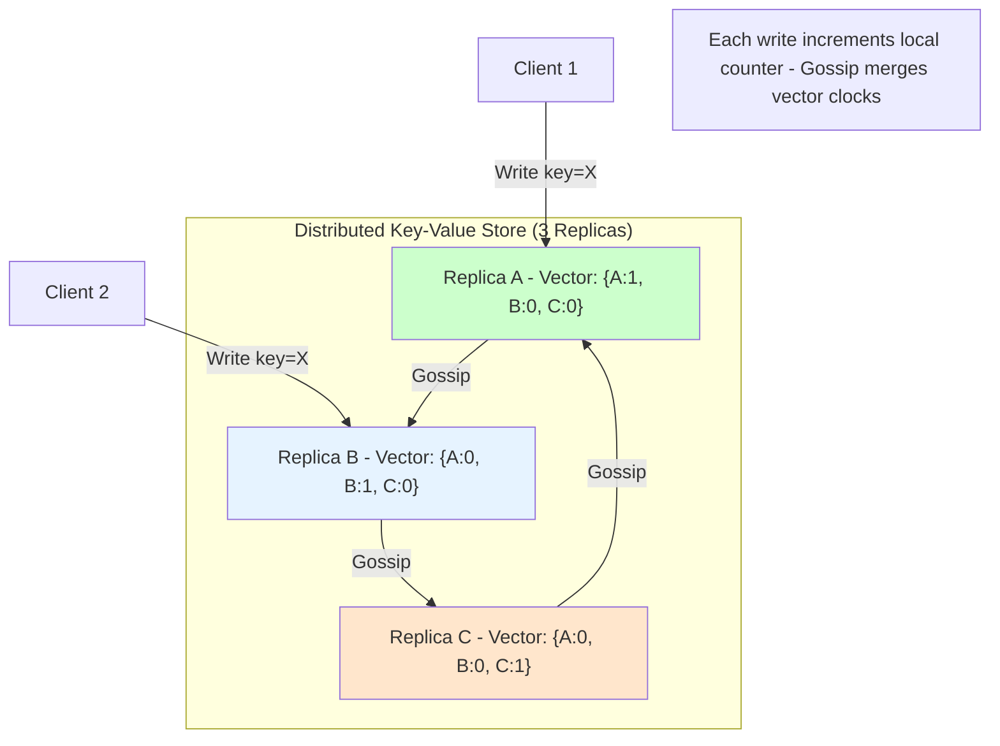
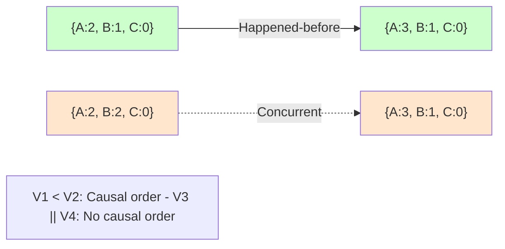
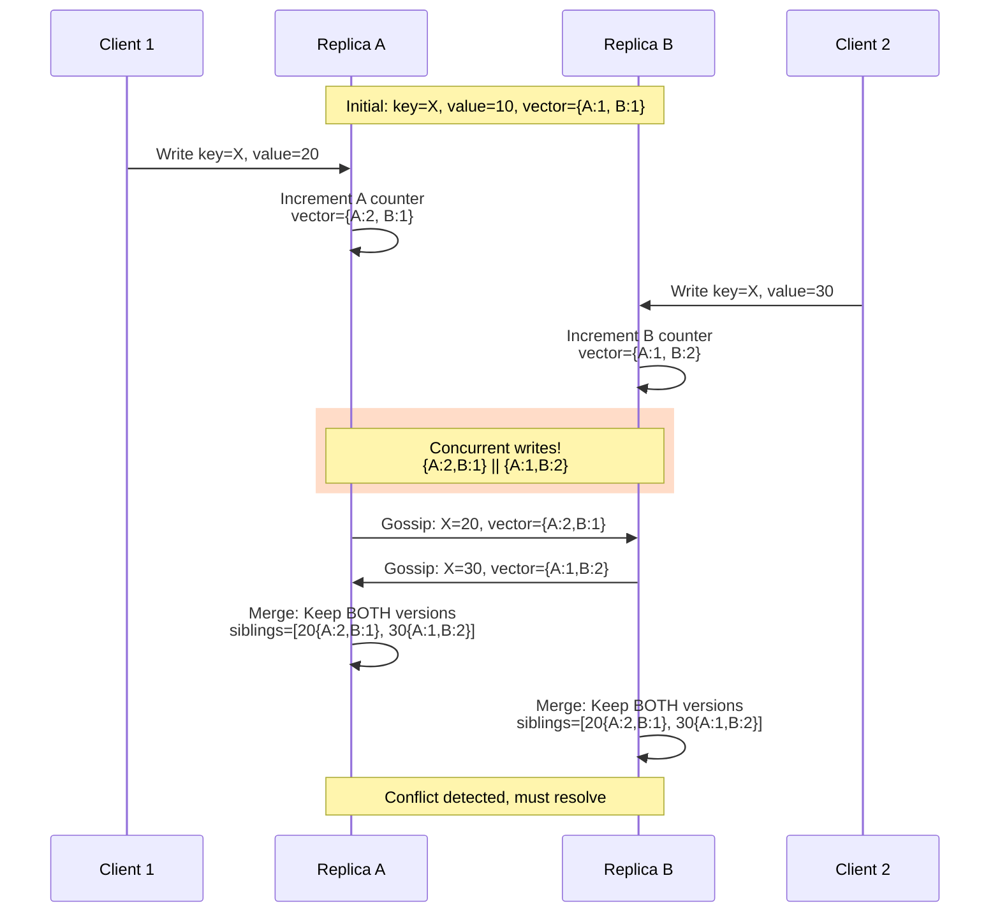
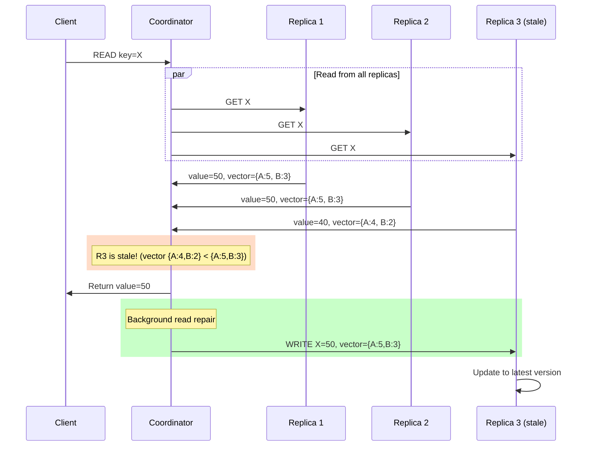
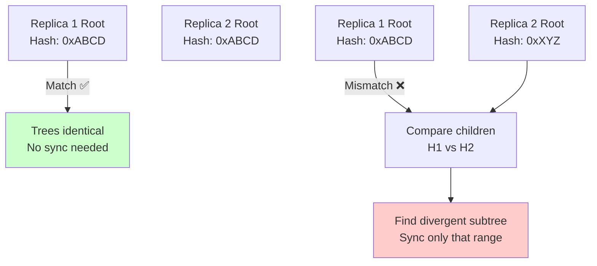
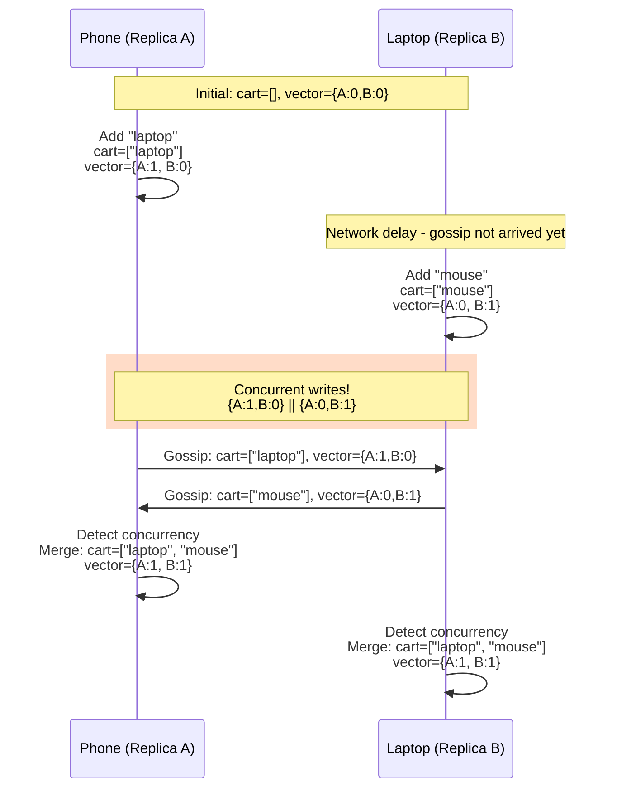
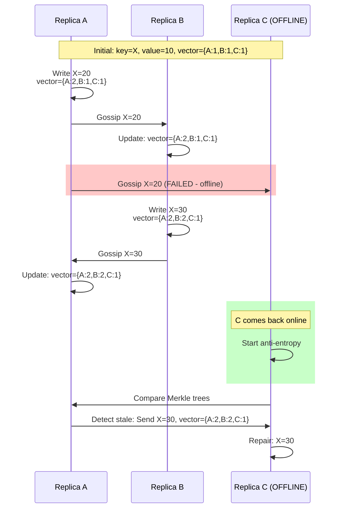

# 06. Vector Clocks & Anti-Entropy: Conflict Detection in Distributed Systems

## 1. Introduction

**Vector Clocks** are a mechanism for tracking **causality** in distributed systems without synchronized clocks. They enable systems to detect whether two events are causally related, concurrent, or in conflict.

**Anti-Entropy** is a process where replicas periodically synchronize to repair inconsistencies caused by network failures, ensuring **eventual consistency**.

**Why Vector Clocks & Anti-Entropy Matter**:
- **Conflict Detection**: Identify concurrent writes that need resolution
- **Eventual Consistency**: Guarantee all replicas converge despite failures
- **Offline-First Systems**: Enable local writes without coordination
- **Data Repair**: Detect and fix missing or corrupted data

**Used By**:
- **DynamoDB**: Version vectors for conflict detection
- **Riak**: Vector clocks for eventual consistency
- **Cassandra**: Anti-entropy repair, Merkle trees
- **CouchDB**: Vector clocks for multi-master replication
- **Voldemort**: Versioned values

**Key Differentiator**: Vector clocks provide **causality tracking** without requiring synchronized clocks or a central coordinator, enabling AP (Available, Partition-Tolerant) systems.

---

## 2. Core Architecture

Vector clocks assign each replica a counter and track the maximum counter seen from each replica.



### Key Components

**1. Vector Clock**: Map of `{replica_id → counter}`
   - Example: `{A:3, B:5, C:2}` means "seen 3 events from A, 5 from B, 2 from C"

**2. Causality Rules**:
   - `V1 < V2` (V1 happened-before V2): V1[i] ≤ V2[i] for all i
   - `V1 || V2` (concurrent): Neither V1 < V2 nor V2 < V1

**3. Versioned Data**: Each replica stores multiple versions with vector clocks

**4. Read Repair**: Detect missing data during reads, repair on-the-fly

**5. Merkle Trees**: Efficiently compare large datasets for anti-entropy

**6. Hinted Handoff**: Temporarily store writes for offline replicas

---

## 3. How It Works: Vector Clocks

### A. Happens-Before Relationship

**Lamport's Definition**: Event A happened-before event B (A → B) if:
1. A and B on same node, A occurred before B
2. A is send event, B is receive event
3. Transitive: A → C and C → B implies A → B

**Vector Clock Comparison**:

```
V1 = {A:2, B:1, C:0}
V2 = {A:3, B:1, C:0}

V1 < V2? Check: V1[A]=2 < V2[A]=3, V1[B]=1 = V2[B]=1, V1[C]=0 = V2[C]=0
Result: YES, V1 happened-before V2
```

**Example Visualization**:



### B. Detecting Concurrent Writes

**Scenario**: Two clients write to same key simultaneously.



**Result**: System keeps **both versions** (siblings). Application must resolve.

### C. Conflict Resolution Strategies

**1. Last-Write-Wins (LWW)**:
```
Conflict: value=20 (timestamp: t=100) vs value=30 (timestamp: t=105)
Resolution: value=30 (newer timestamp)
Problem: Loses writes if clocks are skewed
```

**2. Application-Level Merge**:
```
Shopping cart example:
Cart 1: [item_A, item_B]  (vector: {A:2, B:1})
Cart 2: [item_B, item_C]  (vector: {A:1, B:2})

Concurrent! Merge: [item_A, item_B, item_C] (union)
Result: User sees all items (no data loss)
```

**3. CRDTs (Conflict-Free Replicated Data Types)**:
```
G-Counter (Grow-only counter):
Replica A: {A:5, B:3, C:2}  → Total = 10
Replica B: {A:4, B:6, C:2}  → Total = 12

Merge: {A:max(5,4), B:max(3,6), C:max(2,2)} = {A:5, B:6, C:2} → Total = 13
Conflict-free! Merge is commutative, associative, idempotent
```

---

## 4. Deep Dive: Anti-Entropy

Anti-entropy ensures all replicas eventually have the same data by periodically comparing and syncing.

### A. Read Repair

**Mechanism**: During reads, detect stale data and repair on-the-fly.



**Result**: Stale replica repaired automatically during read.

### B. Merkle Trees (Efficient Comparison)

**Problem**: Comparing millions of keys is expensive.

**Solution**: Merkle trees (hash trees) enable efficient comparison.

**Structure**:

```
Root Hash: H(H1 + H2)
    ├── H1: H(H3 + H4)  [keys 0-50K]
    │   ├── H3 [keys 0-25K]
    │   └── H4 [keys 25K-50K]
    └── H2: H(H5 + H6)  [keys 50K-100K]
        ├── H5 [keys 50K-75K]
        └── H6 [keys 75K-100K]
```

**Comparison**:



**Efficiency**:
```
Without Merkle tree: Compare 1M keys (1M comparisons)
With Merkle tree: Compare log₂(1M) ≈ 20 hashes → Find divergent range
Result: 50,000x fewer comparisons
```

---

## 5. End-to-End Walkthrough: Shopping Cart with Vector Clocks

**Scenario**: User adds items to cart from multiple devices.

### Step 1: Initial State

```
Shopping cart (key="cart_user123"):
Replica A: empty, vector={A:0, B:0}
Replica B: empty, vector={A:0, B:0}
```

### Step 2: User Adds Item from Phone (Replica A)

```
User → Replica A: Add "laptop"

Replica A:
- cart = ["laptop"]
- Increment A counter: vector={A:1, B:0}
- Gossip to Replica B
```

### Step 3: User Adds Item from Laptop (Replica B) - Before Gossip Arrives



### Step 4: Conflict Resolution (Application-Level Merge)

```
Conflict:
- Version 1: ["laptop"], vector={A:1, B:0}
- Version 2: ["mouse"], vector={A:0, B:1}

Concurrent? YES (neither vector dominates)

Resolution (shopping cart semantic):
- UNION: ["laptop", "mouse"]
- Merged vector: {A:max(1,0), B:max(0,1)} = {A:1, B:1}

Result: User sees both items (no data loss)
```

---

## 6. Failure Scenarios

### Scenario A: Replica Offline During Writes

**Symptom**: Replica C is down, misses writes. When it comes back online, it's stale.
**Cause**: Network partition or node crash.

#### The Mechanism



**Result**: Anti-entropy repairs stale replica.

---

### Scenario B: Vector Clock Explosion

**Symptom**: Vector clocks grow too large (hundreds of entries).
**Cause**: Many clients, each increments own counter.

#### The Problem

```
DynamoDB approach: Client-side vector clocks

Client 1 writes: vector={client1:1}
Client 2 writes: vector={client1:1, client2:1}
Client 3 writes: vector={client1:1, client2:1, client3:1}
...
Client 100 writes: vector={client1:1, ..., client100:1}

Result: Vector clock has 100 entries (100 × 16 bytes = 1.6 KB overhead per value)
```

#### The Fix: Pruning

**Strategy 1: Limit Size**:
```
DynamoDB: Keep only 25 most recent entries
When adding 26th entry → Remove oldest entry

Risk: May lose causality info (false concurrency)
```

**Strategy 2: Server-Side Clocks** (Cassandra):
```
Instead of client IDs, use replica IDs
3 replicas → Maximum 3 entries in vector clock

Result: Bounded vector clock size
```

**Strategy 3: Dotted Version Vectors**:
```
Track only causally relevant entries
Remove entries when all replicas have seen them

Result: Compact representation
```

---

### Scenario C: False Concurrency After Pruning

**Symptom**: Two causally related writes detected as concurrent.
**Cause**: Vector clock pruning removed causal information.

#### The Mechanism

```
Original:
Write 1: vector={A:1, B:1, C:1, D:1}
Write 2: vector={A:1, B:1, C:1, D:1, E:1}  (E added laptop)

Pruned (limit=3 entries):
Write 1: vector={A:1, B:1, C:1}  (D removed)
Write 2: vector={B:1, C:1, E:1}  (A,D removed)

Comparison: {A:1,B:1,C:1} || {B:1,C:1,E:1}
Result: CONCURRENT (false! E happened-after)

Impact: User sees duplicate items in cart (merge conflict)
```

#### The Fix: Timestamps as Hint

```
Enhanced vector clock:
{A:1 @t=100, B:1 @t=105, C:1 @t=110}

If vectors appear concurrent, fall back to timestamps
timestamp(Write 2) > timestamp(Write 1) → Write 2 wins

Not perfect (clock skew), but reduces false conflicts
```

---

## 7. Performance Tuning

| Configuration | Default | Recommended | Impact |
| :--- | :--- | :--- | :--- |
| **Anti-Entropy Interval** | 1 hour | 1-24 hours | Lower = faster repair, higher network traffic |
| **Read Repair Chance** | 10% | 10-100% | Higher = faster repair, slower reads |
| **Vector Clock Pruning** | 25 entries | 10-50 | Lower = compact, risk false concurrency |
| **Merkle Tree Depth** | 15 levels | 10-20 | Deeper = finer granularity, more memory |

**Anti-Entropy Optimization**:
```
Strategy: Incremental repair
- Divide keyspace into ranges
- Repair 1 range per hour (rotating)
- Complete vs full scan every 24 hours

Result: Continuous repair without spikes
```

**Read Repair Tuning**:
```
Critical data: read_repair_chance = 100%
  → Always repair stale replicas

Non-critical data: read_repair_chance = 10%
  → Repair occasionally, reduce latency

Result: Balance consistency vs performance
```

---

## 8. Constraints & Limitations

| Constraint | Limit | Why? |
| :--- | :--- | :--- |
| **Vector Clock Size** | 1-2 KB | Grows with number of clients/replicas |
| **Causality Tracking** | Only tracks happens-before | Cannot detect all conflicts |
| **Clock Drift** | Timestamps unreliable | No global time in distributed systems |
| **Conflict Resolution** | Application responsibility | System cannot auto-resolve all conflicts |
| **Anti-Entropy Overhead** | O(N) comparisons | Merkle trees reduce to O(log N) |

**Vector Clocks vs Alternatives**:

| Mechanism | Pros | Cons |
| :--- | :--- | :--- |
| **Vector Clocks** | Exact causality | Size grows with actors |
| **Timestamps** | Compact (8 bytes) | Clock skew causes errors |
| **Version Numbers** | Simple | No concurrency detection |
| **CRDTs** | Conflict-free | Limited data types |

---

## 9. When to Use Vector Clocks?

| Use Case | Verdict | Alternative |
| :--- | :--- | :--- |
| **Multi-Master Replication** | ✅ **YES** | Timestamps (weaker guarantees) |
| **Offline-First Apps** | ✅ **YES** | Operational Transforms |
| **Shopping Carts** (Dynamo, Riak) | ✅ **YES** | LWW (loses data) |
| **Collaborative Editing** | ⚠️ **MAYBE** | CRDTs (better) |
| **Distributed Databases** (Cassandra, Riak) | ✅ **YES** | N/A (core feature) |
| **Strong Consistency Needed** | ❌ **NO** | Raft, Paxos |

**Vector Clocks vs CRDTs**:

**Vector Clocks**:
- ✅ General-purpose (any data type)
- ❌ Requires application-level conflict resolution

**CRDTs**:
- ✅ Conflict-free merge (automatic)
- ❌ Limited to specific data types (counters, sets, maps)

**Verdict**: Use **CRDTs** if your data fits (counters, sets). Use **Vector Clocks** for general conflict detection.

---

## 10. Production Checklist

1.  [ ] **Conflict Resolution**: Implement application-level merge logic for concurrent writes.
2.  [ ] **Vector Clock Pruning**: Enable pruning to prevent unbounded growth (limit=25).
3.  [ ] **Anti-Entropy**: Schedule anti-entropy repair every 24 hours (off-peak).
4.  [ ] **Merkle Trees**: Build Merkle trees for efficient comparison (depth=15).
5.  [ ] **Read Repair**: Enable read repair for critical data (chance=100%).
6.  [ ] **Monitor Siblings**: Alert if >10% of reads return concurrent versions (conflict storm).
7.  [ ] **Timestamps**: Use timestamps as hints (NTP sync required).
8.  [ ] **Test Offline Scenarios**: Verify offline writes merge correctly.
9.  [ ] **Limit Concurrency**: Design UX to reduce concurrent writes (optimistic locking hints).
10. [ ] **Document Semantics**: Clearly document merge behavior for each data type (union for carts, LWW for config).

**Critical Metrics**:
```
sibling_count: <5% (good), >10% (conflict storm)
anti_entropy_duration: <1hr (good), >3hr (slow)
read_repair_triggered: Track repair frequency
vector_clock_size: <500 bytes (good), >1KB (pruning needed)
stale_read_rate: <1% (good), >5% (poor replication)
```

---

**Conclusion**: Vector clocks enable **causality tracking** and **conflict detection** in eventually consistent systems, making them essential for AP (Available, Partition-Tolerant) distributed databases. Combined with anti-entropy, they ensure all replicas eventually converge to the same state.
