# 07. TCC Pattern: Try-Confirm-Cancel for Distributed Transactions

## 1. Introduction

**TCC (Try-Confirm-Cancel)** is a distributed transaction pattern that provides **eventual consistency** through explicit three-phase protocol at the application level. Unlike Saga which relies on compensating transactions after failures, TCC uses **resource reservation** in the Try phase and explicit **confirmation** or **cancellation** in subsequent phases.

**Problem It Solves**: How to coordinate transactions across distributed services while:
- Maintaining business consistency without distributed locks
- Providing explicit control over each phase of the transaction
- Minimizing the window of inconsistency
- Avoiding the blocking problem of 2PC

**Key Differentiator**: TCC explicitly **reserves resources** during the Try phase (like 2PC's PREPARE), but without blocking. Resources are held in a "pending" state and can be queried, unlike 2PC where they're locked.

**Industry Adoption**:
- **Alibaba**: Seata TCC mode for e-commerce transactions
- **Ant Financial (Alipay)**: Payment processing
- **Banking Systems**: Account transfers, fund reservations
- **Booking Systems**: Hotel/flight reservations with holds

**TCC vs Saga**:
- **TCC**: Explicit reservation phase, predictable rollback
- **Saga**: No reservation, compensating transactions may be complex

**TCC vs 2PC**:
- **TCC**: Application-level, no resource locking, eventually consistent
- **2PC**: Infrastructure-level, resource locking, strongly consistent

**Historical Context**: TCC emerged from the need for a middle ground between 2PC (too blocking) and Saga (too eventually consistent). Popular in financial systems where reservations are a natural business concept.

---

## 2. Core Architecture

TCC uses a **coordinator** (like 2PC) but with three application-defined operations instead of database-level PREPARE/COMMIT.

```mermaid
sequenceDiagram
    participant Client
    participant Coord as TCC Coordinator
    participant AS as Account Service
    participant IS as Inventory Service
    participant PS as Payment Service
    
    Client->>Coord: Initiate Transaction
    
    rect rgb(200, 220, 255)
        Note over Coord,PS: Phase 1: Try (Reserve Resources)
        
        par Try on All Services
            Coord->>AS: Try(Reserve Account Balance)
            Coord->>IS: Try(Reserve Inventory)
            Coord->>PS: Try(Reserve Payment Method)
        end
        
        AS-->>Coord: Try Success (Reserved) ✅
        IS-->>Coord: Try Success (Reserved) ✅
        PS-->>Coord: Try Success (Reserved) ✅
    end
    
    rect rgb(200, 255, 200)
        Note over Coord,PS: Phase 2: Confirm (Commit Reservations)
        
        par Confirm on All Services
            Coord->>AS: Confirm(Deduct Balance)
            Coord->>IS: Confirm(Deduct Inventory)
            Coord->>PS: Confirm(Charge Payment)
        end
        
        AS-->>Coord: Confirmed ✅
        IS-->>Coord: Confirmed ✅
        PS-->>Coord: Confirmed ✅
    end
    
    Coord->>Client: Transaction Complete ✅
```



### Key Components

**1. Try Operation**: 
- **Purpose**: Reserve resources without committing
- **Example**: Reserve $100 from account (balance - 100, pending + 100)
- **Must be**: Idempotent, reversible

**2. Confirm Operation**:
- **Purpose**: Commit reserved resources (finalize transaction)
- **Example**: Move $100 from pending to completed (pending - 100)
- **Must be**: Idempotent, guaranteed to succeed

**3. Cancel Operation**:
- **Purpose**: Release reserved resources (rollback)
- **Example**: Return $100 from pending to available (balance + 100, pending - 100)
- **Must be**: Idempotent, guaranteed to succeed

**4. TCC Coordinator**:
- Orchestrates three phases
- Persists transaction state
- Handles retries and timeouts
- Ensures all participants reach same final state

**5. Transaction Log**:
- Records Try, Confirm, Cancel status for each participant
- Enables recovery after coordinator crashes
- Contains participant list and current phase

**6. Timeout Mechanism**:
- **Try timeout**: Cancel if confirm doesn't arrive within X seconds
- **Confirm/Cancel timeout**: Retry until succeed

---

## 3. How It Works: Basic Mechanics

### A. The Three Phases

**Phase 1: Try (Resource Reservation)**

**Goal**: Check if transaction is feasible and reserve resources

**Steps for Each Service**:
1. Validate business rules (e.g., sufficient inventory, account balance)
2. If validation passes: Reserve resources in "pending" state
3. Record reservation ID
4. Return success to coordinator

**Example - Account Service**:
```
Initial State:
- Account balance: $1000
- Pending withdrawals: $0

Try(amount=$100):
  1. Check: balance >= amount? ($1000 >= $100) ✅
  2. Reserve:
     - balance = $1000 (unchanged)
     - pending_withdrawal = $100
  3. Return: {status: "reserved", reservation_id: "R123"}

New State:
- Account balance: $1000
- Pending withdrawals: $100
- Available balance: $900 ($1000 - $100)
```

**Phase 2: Confirm (Commit)**

**Goal**: Finalize the transaction by committing reserved resources

**Steps for Each Service**:
1. Locate reservation by reservation_id
2. Apply the reserved change to actual state
3. Clear the reservation
4. Return success

**Example - Account Service**:
```
Current State:
- Account balance: $1000
- Pending withdrawals: $100

Confirm(reservation_id="R123"):
  1. Find reservation R123 (amount=$100)
  2. Apply withdrawal:
     - balance = $1000 - $100 = $900
     - pending_withdrawal = $100 - $100 = $0
  3. Delete reservation R123
  4. Return: {status: "confirmed"}

New State:
- Account balance: $900
- Pending withdrawals: $0
```

**Phase 3: Cancel (Rollback)**

**Goal**: Release reserved resources (transaction aborted)

**Steps for Each Service**:
1. Locate reservation by reservation_id
2. Release the reservation
3. Restore available resources
4. Return success

**Example - Account Service**:
```
Current State:
- Account balance: $1000
- Pending withdrawals: $100

Cancel(reservation_id="R123"):
  1. Find reservation R123 (amount=$100)
  2. Release reservation:
     - balance = $1000 (unchanged)
     - pending_withdrawal = $100 - $100 = $0
  3. Delete reservation R123
  4. Return: {status: "cancelled"}

New State:
- Account balance: $1000
- Pending withdrawals: $0
- Available balance: $1000
```

---

### B. TCC vs Saga vs 2PC Comparison

| Aspect | TCC | Saga | 2PC |
|:-------|:----|:-----|:----|
| **Phases** | Try → Confirm/Cancel | Local Txn → Compensate | Prepare → Commit |
| **Resource State** | Reserved (visible) | Committed (may need undo) | Locked (invisible) |
| **Blocking** | None | None | Blocks during prepare |
| **Consistency** | Eventual | Eventual | Strong (ACID) |
| **Visibility** | Pending state visible | Intermediate state visible | Hidden until commit |
| **Cancel Complexity** | Simple (release reservation) | Complex (compensation logic) | Simple (rollback) |
| **Performance** | Medium | Fast | Slow |
| **Use Case** | Financial reservations | General microservices | Single-DC databases |

---

### C. Idempotency Requirements

**Why Critical in TCC**: Each phase may be retried due to network failures

**Try Idempotency**:
```
First Try(amount=$100, txn_id="T123"):
  → Create reservation R123 for $100
  → Return: {reservation_id: "R123"}

Retry Try(amount=$100, txn_id="T123"):
  → Check: Does reservation for txn_id="T123" exist?
  → Yes: Return existing reservation_id "R123" (no-op)
  → Don't create duplicate reservation!
```

**Confirm Idempotency**:
```
First Confirm(reservation_id="R123"):
  → Apply withdrawal: balance $1000 → $900
  → Delete reservation
  → Return: {status: "confirmed"}

Retry Confirm(reservation_id="R123"):
  → Check: Does reservation R123 exist?
  → No: Assume already confirmed
  → Return: {status: "confirmed"} (no-op, safe)
```

**Cancel Idempotency**:
```
Same pattern as Confirm - safe to retry
```

---

### D. Timeout Handling

**Try Timeout** (Coordinator perspective):
```
Steps:
1. Coordinator sends Try to all services
2. Wait for responses (timeout: 5 seconds)
3. If timeout on any service:
   → Decision: CANCEL
   → Send Cancel to services that responded with Try success
   → Transaction aborted
```

**Confirm/Cancel Timeout** (Service perspective):
```
After successful Try, service waits for Confirm/Cancel

If no decision received within timeout (e.g., 30 seconds):
  → Service autonomously Cancels the reservation
  → Releases resources
  → Prevents resource leak

Coordinator must send Confirm within timeout window!
```

**Retry Strategy**:
```
Confirm/Cancel operations:
  - Retry indefinitely until success
  - Exponential backoff: 1s, 2s, 4s, 8s, ...
  - Max backoff: 60 seconds
  - These operations MUST eventually succeed
```

---

## 4. Deep Dive: Internal Implementation

### A. Transaction State Machine

**States**:
- `TRYING`: Try phase in progress
- `TRIED`: All Try operations succeeded
- `CONFIRMING`: Confirm phase in progress
- `CONFIRMED`: All Confirm operations succeeded (final)
- `CANCELLING`: Cancel phase in progress
- `CANCELLED`: All Cancel operations succeeded (final)
- `FAILED`: Unrecoverable error (manual intervention)

**Transitions**:

```
TRYING
  ↓ (all Try succeed)
TRIED
  ↓ (coordinator decides confirm)
CONFIRMING
  ↓ (all Confirm succeed)
CONFIRMED ✅

TRYING
  ↓ (any Try fails OR timeout)
CANCELLING
  ↓ (all Cancel succeed)
CANCELLED ✅
```

**State Persistence**:
```
Table: tcc_transactions

Columns:
- txn_id (UUID)
- state (TRYING, TRIED, CONFIRMING, etc.)
- created_at
- updated_at
- timeout_at

Table: tcc_participants

Columns:
- txn_id (FK to tcc_transactions)
- service_name (e.g., "AccountService")
- try_status (SUCCESS, FAILED, PENDING)
- reservation_id (from Try response)
- confirm_status (SUCCESS, FAILED, PENDING)
- cancel_status (SUCCESS, FAILED, PENDING)
```

---

### B. Service-Level Implementation

**Account Service - Try Operation**:

**Steps**:
1. Receive request: `Try(txn_id, account_id, amount)`

2. Check idempotency:
   ```
   SELECT * FROM reservations WHERE txn_id = 'T123'
   If found: Return existing reservation_id
   ```

3. Validate business rules:
   ```
   SELECT balance, pending_withdrawal FROM accounts WHERE account_id = 'A456'
   available = balance - pending_withdrawal
   IF available < amount:
     Return: {status: "failed", reason: "insufficient_funds"}
   ```

4. Create reservation:
   ```
   BEGIN TRANSACTION;
   
   INSERT INTO reservations (reservation_id, txn_id, account_id, amount, created_at)
   VALUES ('R789', 'T123', 'A456', 100, NOW());
   
   UPDATE accounts 
   SET pending_withdrawal = pending_withdrawal + 100
   WHERE account_id = 'A456';
   
   COMMIT;
   ```

5. Return success:
   ```
   {
     "status": "reserved",
     "reservation_id": "R789"
   }
   ```

---

**Account Service - Confirm Operation**:

**Steps**:
1. Receive request: `Confirm(reservation_id)`

2. Check idempotency:
   ```
   SELECT * FROM confirmed_reservations WHERE reservation_id = 'R789'
   If found: Return {status: "confirmed"} (already done)
   ```

3. Apply reservation:
   ```
   BEGIN TRANSACTION;
   
   SELECT account_id, amount FROM reservations WHERE reservation_id = 'R789';
   
   IF NOT FOUND:
     -- Assume already confirmed
     RETURN {status: "confirmed"};
   
   UPDATE accounts
   SET balance = balance - amount,
       pending_withdrawal = pending_withdrawal - amount
   WHERE account_id = 'A456';
   
   DELETE FROM reservations WHERE reservation_id = 'R789';
   
   INSERT INTO confirmed_reservations (reservation_id, confirmed_at)
   VALUES ('R789', NOW());
   
   COMMIT;
   ```

4. Return success:
   ```
   {
     "status": "confirmed"
   }
   ```

---

**Account Service - Cancel Operation**:

**Steps**:
1. Receive request: `Cancel(reservation_id)`

2. Release reservation:
   ```
   BEGIN TRANSACTION;
   
   SELECT account_id, amount FROM reservations WHERE reservation_id = 'R789';
   
   IF NOT FOUND:
     -- Assume already cancelled
     RETURN {status: "cancelled"};
   
   UPDATE accounts
   SET pending_withdrawal = pending_withdrawal - amount
   WHERE account_id = 'A456';
   
   DELETE FROM reservations WHERE reservation_id = 'R789';
   
   COMMIT;
   ```

3. Return success:
   ```
   {
     "status": "cancelled"
   }
   ```

---

### C. Coordinator Implementation

**Try Phase Logic**:

**Steps**:
1. Coordinator receives transaction request

2. Create transaction record:
   ```
   INSERT INTO tcc_transactions (txn_id, state, timeout_at)
   VALUES ('T123', 'TRYING', NOW() + INTERVAL '30 seconds');
   ```

3. Call Try on all participants:
   ```
   responses = []
   
   For each service in [AccountService, InventoryService, PaymentService]:
     Send: Try(txn_id='T123', service_specific_params)
     Wait for response (timeout: 5 seconds)
     Store response in responses[]
   ```

4. Evaluate responses:
   ```
   If ALL responses successful:
     → Update state to 'TRIED'
     → Store reservation_ids
     → Proceed to Confirm phase
   
   If ANY response failed OR timeout:
     → Update state to 'CANCELLING'
     → Proceed to Cancel phase
   ```

---

**Confirm Phase Logic**:

**Steps**:
1. Update transaction state:
   ```
   UPDATE tcc_transactions SET state = 'CONFIRMING' WHERE txn_id = 'T123';
   ```

2. Call Confirm on all participants:
   ```
   For each participant with stored reservation_id:
     retry_count = 0
     
     LOOP:
       Send: Confirm(reservation_id)
       
       If SUCCESS:
         Mark participant as confirmed
         BREAK
       
       If FAILED:
         retry_count++
         backoff = min(2^retry_count, 60) seconds
         Sleep(backoff)
         Continue LOOP
   ```

3. After all confirmations succeed:
   ```
   UPDATE tcc_transactions SET state = 'CONFIRMED' WHERE txn_id = 'T123';
   ```

---

### D. Failure Recovery

**Coordinator Crash Recovery**:

**Steps**:
1. On coordinator restart, scan for incomplete transactions:
   ```
   SELECT * FROM tcc_transactions 
   WHERE state IN ('TRYING', 'TRIED', 'CONFIRMING', 'CANCELLING')
   AND created_at < NOW() - INTERVAL '5 minutes';
   ```

2. For each incomplete transaction:
   ```
   If state = 'TRYING':
     → Decision: CANCEL (timeout exceeded)
     → Send Cancel to all participants
   
   If state = 'TRIED' OR 'CONFIRMING':
     → Continue Confirm phase
     → Retry Confirm on participants
   
   If state = 'CANCELLING':
     → Continue Cancel phase
     → Retry Cancel on participants
   ```

**Service Crash Recovery**:

**Steps**:
1. Service restarts, scans for orphaned reservations:
   ```
   SELECT * FROM reservations 
   WHERE created_at < NOW() - INTERVAL '30 seconds';
   ```

2. For each orphaned reservation:
   ```
   Contact coordinator: "What is status of txn_id='T123'?"
   
   If coordinator says CONFIRMED:
     → Execute Confirm operation locally
   
   If coordinator says CANCELLED:
     → Execute Cancel operation locally
   
   If coordinator doesn't know (crashed/lost data):
     → Default action: Cancel (safe choice)
   ```

---

## 5. End-to-End Walkthrough: Money Transfer Between Accounts

### Scenario: Transfer $100 from Account A to Account B

**Participants**:
- **Account Service**: Manages both accounts
- **Audit Service**: Records all transactions
- **TCC Coordinator**: Orchestrates the transfer

---

### Step 1: Client Initiates Transfer

**Request**:
```
POST /transfers
{
  "from_account": "A123",
  "to_account": "A456",
  "amount": 100
}
```

**Coordinator Actions**:
1. Generate transaction ID: `txn_id = "T789"`
2. Persist transaction:
   ```
   INSERT INTO tcc_transactions (txn_id, state, timeout_at)
   VALUES ('T789', 'TRYING', NOW() + INTERVAL '30 seconds');
   ```
3. Begin Try phase

---

### Step 2: Try Phase - Reserve Resources

**Try on Account Service (Withdraw from A123)**:

**Request**:
```
POST /accounts/try-withdraw
{
  "txn_id": "T789",
  "account_id": "A123",
  "amount": 100
}
```

**Account Service Steps**:
1. Check current state:
   ```
   Account A123: balance = $1000, pending = $0
   Available = $1000 - $0 = $1000 ✅
   ```

2. Validate: $1000 >= $100? Yes ✅

3. Create reservation:
   ```
   BEGIN TRANSACTION;
   
   INSERT INTO reservations (reservation_id, txn_id, account_id, amount, type)
   VALUES ('R111', 'T789', 'A123', 100, 'withdraw');
   
   UPDATE accounts 
   SET pending_withdrawal = pending_withdrawal + 100
   WHERE account_id = 'A123';
   
   COMMIT;
   ```

4. New state:
   ```
   Account A123: balance = $1000, pending = $100
   Available = $900
   ```

5. Return:
   ```
   {
     "status": "reserved",
     "reservation_id": "R111"
   }
   ```

---

**Try on Account Service (Deposit to A456)**:

**Request**:
```
POST /accounts/try-deposit
{
  "txn_id": "T789",
  "account_id": "A456",
  "amount": 100
}
```

**Account Service Steps**:
1. Create reservation for deposit:
   ```
   INSERT INTO reservations (reservation_id, txn_id, account_id, amount, type)
   VALUES ('R222', 'T789', 'A456', 100, 'deposit');
   
   UPDATE accounts
   SET pending_deposit = pending_deposit + 100
   WHERE account_id = 'A456';
   ```

2. Return:
   ```
   {
     "status": "reserved",
     "reservation_id": "R222"
   }
   ```

---

**Try on Audit Service**:

**Request**:
```
POST /audit/try-record
{
  "txn_id": "T789",
  "transaction_type": "transfer",
  "details": {...}
}
```

**Audit Service Steps**:
1. Reserve audit log entry:
   ```
   INSERT INTO pending_audit_logs (reservation_id, txn_id, details)
   VALUES ('R333', 'T789', '{...}');
   ```

2. Return:
   ```
   {
     "status": "reserved",
     "reservation_id": "R333"
   }
   ```

---

**Coordinator After Try Phase**:
```
All participants returned success ✅

Update state:
  UPDATE tcc_transactions SET state = 'TRIED' WHERE txn_id = 'T789';

Store reservation IDs:
  INSERT INTO tcc_participants VALUES 
    ('T789', 'AccountService-Withdraw', 'R111', ...),
    ('T789', 'AccountService-Deposit', 'R222', ...),
    ('T789', 'AuditService', 'R333', ...);

Proceed to Confirm phase
```

---

### Step 3: Confirm Phase - Commit Reservations

**Confirm on Account Service (Withdraw)**:

**Request**:
```
POST /accounts/confirm
{
  "reservation_id": "R111"
}
```

**Account Service Steps**:
1. Find reservation:
   ```
   SELECT * FROM reservations WHERE reservation_id = 'R111'
   Result: account_id='A123', amount=100, type='withdraw'
   ```

2. Apply withdrawal:
   ```
   BEGIN TRANSACTION;
   
   UPDATE accounts
   SET balance = balance - 100,
       pending_withdrawal = pending_withdrawal - 100
   WHERE account_id = 'A123';
   
   DELETE FROM reservations WHERE reservation_id = 'R111';
   
   COMMIT;
   ```

3. New state:
   ```
   Account A123: balance = $900, pending = $0
   ```

4. Return: `{status: "confirmed"}`

---

**Confirm on Account Service (Deposit)**:

**Request**:
```
POST /accounts/confirm
{
  "reservation_id": "R222"
}
```

**Account Service Steps**:
1. Apply deposit:
   ```
   UPDATE accounts
   SET balance = balance + 100,
       pending_deposit = pending_deposit - 100
   WHERE account_id = 'A456';
   
   DELETE FROM reservations WHERE reservation_id = 'R222';
   ```

2. New state:
   ```
   Account A456: balance = $600 (was $500), pending = $0
   ```

3. Return: `{status: "confirmed"}`

---

**Confirm on Audit Service**:

**Request**:
```
POST /audit/confirm
{
  "reservation_id": "R333"
}
```

**Audit Service Steps**:
1. Finalize audit log:
   ```
   INSERT INTO audit_logs 
   SELECT * FROM pending_audit_logs WHERE reservation_id = 'R333';
   
   DELETE FROM pending_audit_logs WHERE reservation_id = 'R333';
   ```

2. Return: `{status: "confirmed"}`

---

### Step 4: Transaction Complete

**Coordinator Final Steps**:
```
All confirms succeeded ✅

UPDATE tcc_transactions 
SET state = 'CONFIRMED', completed_at = NOW()
WHERE txn_id = 'T789';

Response to client:
{
  "status": "success",
  "transaction_id": "T789",
  "from_account": "A123",
  "to_account": "A456",
  "amount": 100
}
```

**Final State**:
- Account A123: $900 (was $1000)
- Account A456: $600 (was $500)
- Transfer completed atomically ✅

---

## 6. Failure Scenarios (The Senior View)

### Scenario A: Try Phase Fails on One Service

**Symptom**: Account A123 has sufficient funds, but Account A456 is frozen.

**Cause**: Validation fails on deposit (account frozen/closed).

#### The Mechanism

**Timeline**:
```
t=0: Coordinator begins Try phase
t=1: Try on Withdraw (A123) → SUCCESS ✅ (reservation R111 created)
t=2: Try on Deposit (A456) → FAILED ❌ (account frozen)
t=3: Coordinator decides: CANCEL
```

**Cancel Flow**:

```mermaid
sequenceDiagram
    participant Coord as Coordinator
    participant AS as Account Service
    
    Note over Coord,AS: Try Phase
    
    Coord->>AS: Try Withdraw(A123, $100)
    AS->>AS: Reserve: pending=$100
    AS-->>Coord: Success (R111) ✅
    
    Coord->>AS: Try Deposit(A456, $100)
    
    rect rgb(255, 200, 200)
        AS->>AS: Check: Account frozen ❌
        AS-->>Coord: Failed (account_frozen)
    end
    
    Note over Coord: Decision: CANCEL
    
    rect rgb(255, 220, 200)
        Coord->>Coord: State: CANCELLING
        
        Coord->>AS: Cancel(R111)
        AS->>AS: Release reservation<br/>pending: $100 → $0
        AS-->>Coord: Cancelled ✅
    end
    
    Coord->>Coord: State: CANCELLED
```



**Cancel Steps**:

1. **Coordinator detects failure**:
   ```
   Account Service returned: {"status": "failed", "reason": "account_frozen"}
   ```

2. **Coordinator updates state**:
   ```
   UPDATE tcc_transactions SET state = 'CANCELLING' WHERE txn_id = 'T789';
   ```

3. **Coordinator cancels successful Try operations**:
   ```
   POST /accounts/cancel
   {
     "reservation_id": "R111"
   }
   ```

4. **Account Service releases reservation**:
   ```
   UPDATE accounts 
   SET pending_withdrawal = pending_withdrawal - 100
   WHERE account_id = 'A123';
   
   DELETE FROM reservations WHERE reservation_id = 'R111';
   
   New state: A123 balance=$1000, pending=$0 (back to original)
   ```

5. **Coordinator marks as cancelled**:
   ```
   UPDATE tcc_transactions SET state = 'CANCELLED' WHERE txn_id = 'T789';
   ```

6. **Client receives error**:
   ```
   {
     "error": "transaction_failed",
     "reason": "destination_account_frozen"
   }
   ```

**Result**: Clean rollback, no side effects ✅

---

### Scenario B: Coordinator Crashes After Try Phase

**Symptom**: Resources reserved but no confirm/cancel received.

**Cause**: Coordinator crashes after all Try operations succeed.

#### The Problem

**Timeline**:
```
t=0: All Try operations succeed ✅
t=1: Coordinator updates state to 'TRIED'
t=2: Coordinator CRASHES ❌ (before sending Confirm)
t=5: Services waiting for decision...
t=30: Service timeout expires
```

**Service Timeout Handler**:

```mermaid
graph TD
    TrySuccess["Try Success<br/>Reservation Created"]
    WaitConfirm["Wait for Confirm/Cancel<br/>(timeout: 30s)"]
    Timeout["Timeout Expired"]
    
    CheckCoord["Query Coordinator:<br/>What is status of txn?"]
    
    CoordUp{"Coordinator<br/>Available?"}
    
    CoordSaysConfirm["Coordinator:<br/>State=TRIED<br/>→ Send Confirm"]
    CoordSaysCancel["Coordinator:<br/>State=CANCELLED<br/>→ Already handled"]
    
    CoordDown["Coordinator Down<br/>or Unknown"]
    
    DefaultCancel["Default Action:<br/>Cancel Reservation<br/>(safe choice)"]
    
    TrySuccess --> WaitConfirm
    WaitConfirm --> Timeout
    Timeout --> CheckCoord
    
    CheckCoord --> CoordUp
    
    CoordUp -->|Yes| CoordSaysConfirm
    CoordUp -->|Yes| CoordSaysCancel
    CoordUp -->|No| CoordDown
    
    CoordDown --> DefaultCancel
    
    style Timeout fill:#fff3cd
    style CoordDown fill:#ff9999
    style DefaultCancel fill:#ffcccc
```



**Service-Side Timeout Logic**:

**Steps**:
1. Service creates reservation with timestamp:
   ```
   INSERT INTO reservations (reservation_id, txn_id, created_at, expires_at)
   VALUES ('R111', 'T789', NOW(), NOW() + INTERVAL '30 seconds');
   ```

2. Background job checks for expired reservations:
   ```
   Cron job (runs every 10 seconds):
   
   SELECT * FROM reservations WHERE expires_at < NOW();
   
   For each expired reservation:
     1. Query coordinator: GET /transactions/T789/status
     2. If coordinator responds "TRIED" or "CONFIRMING":
        → Extend timeout, wait longer
     3. If coordinator responds "CANCELLED":
        → Already cancelled, delete reservation
     4. If coordinator unreachable:
        → Default action: Cancel reservation (release resources)
   ```

3. **Automatic cancellation**:
   ```
   UPDATE accounts 
   SET pending_withdrawal = pending_withdrawal - 100
   WHERE account_id = 'A123';
   
   DELETE FROM reservations WHERE reservation_id = 'R111';
   
   LOG: "Auto-cancelled reservation R111 for txn T789 due to coord timeout"
   ```

**Coordinator Recovery**:

**Steps**:
1. Coordinator restarts

2. Scan for incomplete transactions:
   ```
   SELECT * FROM tcc_transactions WHERE state = 'TRIED';
   Result: txn_id='T789', state='TRIED'
   ```

3. Resume Confirm phase:
   ```
   For each participant in txn T789:
     Send: POST /confirm (reservation_id)
     
     If service says "reservation not found":
       → Service already auto-cancelled due to timeout
       → Decision: Abort entire transaction
       → Cancel other participants
   ```

**Trade-off**: **Availability over consistency** - Services release resources rather than waiting forever

---

### Scenario C: Confirm Phase Partial Failure

**Symptom**: Some services confirmed, others timed out.

**Cause**: Network partition during Confirm phase.

#### The Problem

**Timeline**:
```
t=0: Coordinator sends Confirm to all services
t=1: Account Service (Withdraw): Confirmed ✅ (balance deducted)
t=2: Account Service (Deposit): TIMEOUT ❌ (network partition)
t=3: Audit Service: Confirmed ✅

State:
- Withdraw: Confirmed (A123 balance reduced)
- Deposit: Unknown (A456 unchanged)
- Audit: Confirmed
```

**Inconsistent State**: Money deducted from A123 but not added to A456! 💰❌

**Recovery Flow**:

```mermaid
sequenceDiagram
    participant Coord as Coordinator
    participant ASW as Account Service<br/>(Withdraw)
    participant ASD as Account Service<br/>(Deposit - Partitioned)
    
    Coord->>ASW: Confirm(R111)
    ASW->>ASW: Deduct $100<br/>Balance: $1000 → $900
    ASW-->>Coord: Confirmed ✅
    
    Coord->>ASD: Confirm(R222)
    
    rect rgb(255, 200, 200)
        Note over ASD: Network Partition<br/>No response
        Coord->>Coord: Timeout after 5s
    end
    
    rect rgb(255, 220, 200)
        Note over Coord: Retry Confirm with backoff
        loop Retry until success
            Coord->>Coord: Wait 1s, 2s, 4s, 8s...
            Coord->>ASD: Retry Confirm(R222)
            Note over ASD: Network still down...
            Note over ASD: Network recovers!
            ASD->>ASD: Apply deposit<br/>Balance: $500 → $600
            ASD-->>Coord: Confirmed ✅
        end
    end
    
    Note over Coord,ASD: Consistency restored ✅
```



**Coordinator Retry Logic**:

**Steps**:
1. Initial Confirm times out:
   ```
   Attempt 1: POST /confirm (R222) → Timeout after 5s
   ```

2. Retry with exponential backoff:
   ```
   retry_count = 0
   backoff_seconds = [1, 2, 4, 8, 16, 32, 60, 60, 60, ...]
   
   LOOP:
     retry_count++
     Sleep(backoff_seconds[retry_count])
     
     Send: POST /confirm (R222)
     
     If SUCCESS:
       Mark as confirmed
       BREAK
     
     If TIMEOUT or FAILED:
       Continue LOOP (retry forever)
   ```

3. Eventually succeeds:
   ```
   After 15 retries over 5 minutes:
   Network recovers
   → Confirm succeeds
   → Deposit applied
   → Consistency restored ✅
   ```

**Why Retry Forever**:
- Confirm **must** eventually succeed
- Already deducted from source account
- Cannot cancel (would leave source account short $100)
- Must keep retrying until deposit succeeds

**Alerting**:
```
If retry_count > 10:
  Alert: "TCC Confirm stuck for txn T789, retrying for 3 minutes"
  
If retry_count > 100:
  Critical Alert: "TCC Confirm failed for 1 hour, manual intervention may be needed"
```

**Manual Intervention** (if retries exhausted):
```
Engineer manually applies deposit:
  UPDATE accounts SET balance = balance + 100 WHERE account_id = 'A456';
  DELETE FROM reservations WHERE reservation_id = 'R222';
  
  UPDATE tcc_participants 
  SET confirm_status = 'SUCCESS'
  WHERE txn_id = 'T789' AND reservation_id = 'R222';
```

---

## 7. Performance Tuning / Scaling Strategies

### A. Configuration Tuning

| Configuration | Recommended | Why? |
|:--------------|:------------|:-----|
| **Try Timeout** | 5-10 seconds | Balance between fast failure and network tolerance |
| **Reservation TTL** | 30-60 seconds | Auto-cancel if coordinator doesn't confirm |
| **Confirm/Cancel Retry Interval** | Exponential (1s, 2s, 4s, ..., 60s) | Avoid overwhelming failed service |
| **Max Confirm Retries** | Unlimited | Must eventually succeed |
| **Coordinator State Cleanup** | 7-30 days | Keep for auditing, then archive |
| **Reservation Cleanup Job** | Every 10 seconds | Prevent resource leaks |

---

### B. Database Optimization

**Indexes**:
```
CREATE INDEX idx_reservations_txn_id ON reservations(txn_id);
CREATE INDEX idx_reservations_expires_at ON reservations(expires_at);
CREATE INDEX idx_tcc_txn_state ON tcc_transactions(state, created_at);
```

**Partitioning**:
```
Partition tcc_transactions by created_at (monthly)
Partition reservations by expires_at (daily)
```

---

### C. Horizontal Scaling

**Coordinator Scaling**:
- Multiple coordinator instances
- Use distributed lock (Redis, ZooKeeper) for transaction ownership
- Each coordinator handles subset of transactions

**Service Scaling**:
- Standard horizontal scaling strategies
- Ensure Try/Confirm/Cancel operations are idempotent
- Use database read replicas for validation queries

---

## 8. Constraints & Limitations

| Constraint | Limit | Why? |
|:-----------|:------|:-----|
| **Consistency** | Eventual (not strong) | Window between Try and Confirm |
| **Resource Holding** | Reservation TTL duration | Resources temporarily unavailable |
| **Application Complexity** | High | Must implement 3 operations per service |
| **Retry Overhead** | Confirm retries indefinitely | Network failures extend transaction time |
| **Reservation Leaks** | Possible | If timeout cleanup fails, manual intervention needed |
| **Cross-Region** | Not recommended | High latency compounds retry delays |

**TCC Trade-offs**:

**Advantages over Saga**:
- ✅ Predictable rollback (just release reservation)
- ✅ Visible pending state (can query reserved resources)
- ✅ No complex compensation logic

**Disadvantages vs Saga**:
- ❌ Requires explicit reservation mechanism in each service
- ❌ Resources held during try-confirm window
- ❌ More API calls (3 phases instead of 2)

**Advantages over 2PC**:
- ✅ No resource locking (pending state is visible/queryable)
- ✅ No blocking (services continue operating)
- ✅ Better for distributed systems

**Disadvantages vs 2PC**:
- ❌ Eventual consistency (not strong)
- ❌ Application-level implementation (more code)

---

## 9. When to Use TCC?

| Use Case | Verdict | Why? |
|:---------|:--------|:-----|
| **Financial Transactions** (reservations) | ✅ **YES** | Natural fit - hold funds, confirm transfer |
| **Booking Systems** (hotels, flights) | ✅ **YES** | Explicit reservation period matches business model |
| **Inventory Management** | ✅ **YES** | Reserve items, confirm purchase later |
| **General Microservices** | ⚠️ **MAYBE** | Use Saga if no natural reservation concept |
| **High-Throughput Systems** | ❌ **NO** | Overhead of 3 phases reduces throughput |
| **Strong Consistency Required** | ❌ **NO** | Use 2PC or single database |

**TCC vs Alternatives**:

- **TCC vs Saga**: Use TCC when reservation is natural business concept
- **TCC vs 2PC**: Use TCC for microservices, 2PC for single-DC databases
- **TCC vs Event Sourcing**: TCC for transactions, Event Sourcing for audit/replay

---

## 10. Production Checklist

1. [ ] **Implement Idempotency**: All Try/Confirm/Cancel operations must handle duplicates
2. [ ] **Set Reservation TTL**: Auto-cancel reservations after 30-60 seconds
3. [ ] **Enable Retry with Backoff**: Exponential backoff for Confirm/Cancel (1s, 2s, 4s, ...)
4. [ ] **Monitor Stuck Transactions**: Alert if transaction in CONFIRMING > 10 minutes
5. [ ] **Implement Reservation Cleanup**: Cron job to release expired reservations
6. [ ] **Log All Phases**: Trace ID through Try → Confirm/Cancel for debugging
7. [ ] **Implement Circuit Breaker**: Prevent cascading failures during Confirm retries
8. [ ] **Set Up Dead Letter Queue**: For transactions requiring manual intervention
9. [ ] **Test Failure Scenarios**: Especially coordinator crash during Confirm
10. [ ] **Monitor Resource Leaks**: Alert on old reservations not cleaned up

**Critical Metrics**:
```
tcc_try_success_rate: > 95%
tcc_confirm_retry_count: p99 < 5 retries
tcc_transaction_duration: p50 < 2s, p99 < 10s
tcc_stuck_transaction_count: 0 (alert if > 0)
reservation_leak_count: 0 (alert if > 10)
```

---

**Conclusion**: TCC provides a middle ground between Saga and 2PC, offering explicit resource reservation with eventual consistency. It's ideal for financial systems and booking platforms where "holding" resources is a natural business concept. The three-phase protocol is more complex than Saga but provides predictable rollback and visible pending states.
