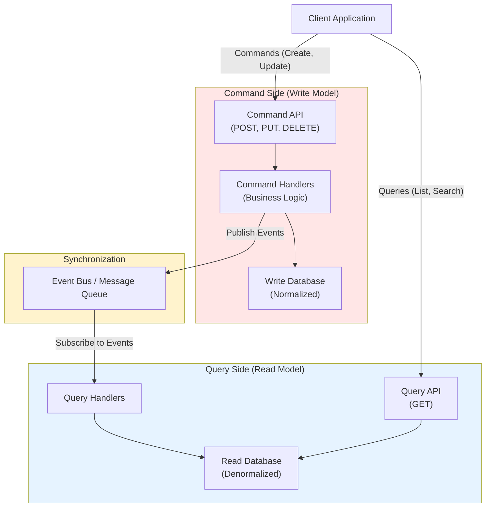
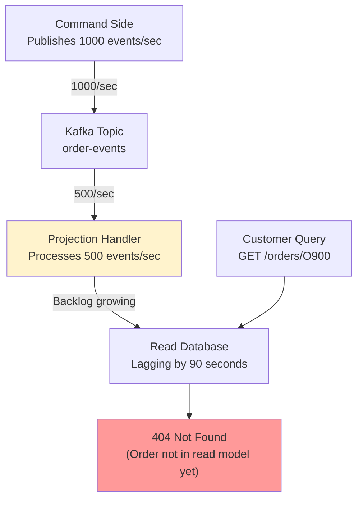

# 08. CQRS: Command Query Responsibility Segregation

## 1. Introduction

**CQRS (Command Query Responsibility Segregation)** is an architectural pattern that separates **read operations** (queries) from **write operations** (commands) using different models. Instead of using a single model for both reading and writing data, CQRS splits the responsibility into two distinct pathways optimized for their specific purposes.

**Problem It Solves**: How do you optimize a system when:
- Read and write patterns have vastly different characteristics
- Reads far outnumber writes (or vice versa)
- Complex queries slow down write performance
- You need different consistency guarantees for reads vs writes
- Scaling reads and writes independently is required

**Key Differentiator**: Unlike traditional CRUD where one model serves both reads and writes, CQRS uses:
- **Command Model** (Write): Optimized for data integrity, validation, business logic
- **Query Model** (Read): Optimized for fast retrieval, denormalized for specific views

**Industry Adoption**:
- **E-Commerce**: Product catalog (writes) vs search/browse (reads)
- **Social Media**: Post creation vs feed generation
- **Banking**: Transaction processing vs account statements
- **Analytics Dashboards**: Event ingestion vs reporting queries

**Used By**:
- **Microsoft**: Azure Cosmos DB, Event Store
- **Amazon**: Various AWS services internally
- **Netflix**: Viewing history and recommendations
- **Uber**: Trip data and analytics

**Historical Context**: Introduced by Greg Young around 2010, popularized alongside Event Sourcing and Domain-Driven Design (DDD). CQRS addresses the fundamental impedance mismatch between optimal write structures (normalized) and optimal read structures (denormalized).

---

## 2. Core Architecture

CQRS separates the application into two distinct sides: **Command Side** (writes) and **Query Side** (reads), synchronized via eventual consistency.



### Key Components

**1. Command Side (Write Model)**:
- **Purpose**: Handle state changes, enforce business rules
- **Database**: Normalized relational database (PostgreSQL, MySQL)
- **Optimized for**: Write consistency, referential integrity, atomic transactions
- **Example**: `CreateOrder`, `UpdateInventory`, `CancelSubscription`

**2. Query Side (Read Model)**:
- **Purpose**: Serve read requests optimized for specific views
- **Database**: Denormalized store (MongoDB, Elasticsearch, Redis cache)
- **Optimized for**: Read speed, aggregations, search
- **Example**: `GetOrderHistory`, `SearchProducts`, `GenerateReport`

**3. Event Bus / Synchronization**:
- **Purpose**: Keep read model in sync with write model
- **Technology**: Kafka, RabbitMQ, AWS EventBridge
- **Pattern**: Eventual consistency

**4. Command Handlers**:
- Validate commands
- Execute business logic
- Persist to write database
- Publish domain events

**5. Projection Handlers** (Query Side):
- Subscribe to events
- Update read models
- Maintain denormalized views

**6. Read Model (Materialized Views)**:
- Pre-computed, denormalized data
- Optimized for specific query patterns
- May have multiple read models for different use cases

---

## 3. How It Works: Basic Mechanics

### A. Command Flow (Write Path)

**Steps**:

1. **Client sends command**:
   ```
   POST /api/orders
   {
     "command": "CreateOrder",
     "customer_id": "C123",
     "items": [{"product_id": "P100", "quantity": 2}]
   }
   ```

2. **Command API validates**:
   - Check authentication
   - Basic input validation (required fields, formats)

3. **Command Handler executes business logic**:
   - Load aggregate from write database
   - Validate business rules (inventory available, customer credit limit)
   - Apply state change
   - Persist to write database

4. **Publish domain event**:
   ```
   Event: OrderCreated
   {
     "event_id": "E456",
     "order_id": "O789",
     "customer_id": "C123",
     "items": [...],
     "total": 99.99,
     "timestamp": "2024-01-01T10:00:00Z"
   }
   ```

5. **Return acknowledgment**:
   ```
   {
     "status": "accepted",
     "order_id": "O789"
   }
   ```

   **Note**: Does NOT wait for read model update!

---

### B. Query Flow (Read Path)

**Steps**:

1. **Client sends query**:
   ```
   GET /api/orders/O789
   ```

2. **Query API routes to handler**:
   - No business logic
   - Direct database query

3. **Query Handler fetches from read database**:
   ```
   SELECT * FROM order_view WHERE order_id = 'O789'
   ```

4. **Return denormalized data**:
   ```
   {
     "order_id": "O789",
     "customer_name": "John Doe",
     "customer_email": "john@example.com",
     "items": [
       {
         "product_name": "Widget",
         "quantity": 2,
         "price": 49.99
       }
     ],
     "total": 99.99,
     "status": "pending"
   }
   ```

   **Advantage**: Single query, no joins, pre-computed aggregations

---

### C. Event-Driven Synchronization

**Projection Handler Flow**:

**Steps**:

1. **Event published** to event bus:
   ```
   Event: OrderCreated (published by Command Handler)
   ```

2. **Projection Handler subscribes** to event:
   ```
   Projection: OrderViewProjection
   Subscribes to: OrderCreated, OrderUpdated, OrderCancelled
   ```

3. **Handler processes event**:
   ```
   ON OrderCreated:
     1. Extract event data
     2. Fetch related data (customer details, product details)
     3. Build denormalized order view
     4. INSERT or UPDATE read database
   ```

4. **Read model updated**:
   ```
   INSERT INTO order_view (order_id, customer_name, items_json, total, status)
   VALUES ('O789', 'John Doe', '[...]', 99.99, 'pending')
   ```

**Eventual Consistency Window**: Typically milliseconds to seconds between command and visible query result.

---

### D. Multiple Read Models

**Why Multiple Read Models**: Different queries need different optimizations

**Example - E-Commerce**:

**Read Model 1**: Order History (per customer)
```
Database: PostgreSQL
Table: customer_order_history
Columns: customer_id, order_id, date, total, status
Index: customer_id, date DESC
Use Case: "Show my recent orders"
```

**Read Model 2**: Product Search
```
Database: Elasticsearch
Index: products
Fields: product_id, name, category, tags, price, rating
Use Case: "Search for 'wireless headphones' under $100"
```

**Read Model 3**: Real-Time Dashboard
```
Database: Redis
Key: dashboard:sales:today
Value: {total_orders: 1523, revenue: 45230.50}
TTL: 60 seconds (refreshed every minute)
Use Case: "Live sales dashboard"
```

**Each model optimized for its specific query pattern!**

---

## 4. Deep Dive: Internal Implementation

### A. Command Model Implementation

**Aggregate Design** (Domain-Driven Design):

**Order Aggregate**:
```
Aggregate: Order
Root Entity: Order
Value Objects: OrderItem, Address

Business Rules:
- Order total = sum of item prices
- Cannot cancel shipped order
- Minimum order total: $10

Commands:
- CreateOrder
- AddItem
- RemoveItem
- CancelOrder

Events:
- OrderCreated
- ItemAdded
- ItemRemoved
- OrderCancelled
```

**Command Handler Steps**:

**CreateOrder Handler**:

1. **Receive command**:
   ```
   Command: CreateOrder
   {
     "customer_id": "C123",
     "items": [{"product_id": "P100", "quantity": 2, "price": 49.99}]
   }
   ```

2. **Validate command**:
   ```
   - customer_id exists?
   - items array non-empty?
   - quantities > 0?
   ```

3. **Load related entities** (if needed):
   ```
   SELECT * FROM customers WHERE id = 'C123'
   SELECT * FROM products WHERE id IN ('P100')
   ```

4. **Execute business logic**:
   ```
   Order aggregate = new Order()
   
   For each item:
     aggregate.addItem(product_id, quantity, price)
   
   Calculate total:
     total = sum(item.quantity * item.price)
   
   Validate business rules:
     IF total < 10:
       THROW MinimumOrderException
   ```

5. **Persist to write database**:
   ```
   BEGIN TRANSACTION;
   
   INSERT INTO orders (order_id, customer_id, total, status, created_at)
   VALUES ('O789', 'C123', 99.99, 'pending', NOW());
   
   INSERT INTO order_items (order_id, product_id, quantity, price)
   VALUES ('O789', 'P100', 2, 49.99);
   
   COMMIT;
   ```

6. **Publish event**:
   ```
   Publish to Kafka topic "order-events":
   
   {
     "event_type": "OrderCreated",
     "event_id": "E456",
     "order_id": "O789",
     "customer_id": "C123",
     "items": [{"product_id": "P100", "quantity": 2}],
     "total": 99.99,
     "timestamp": "2024-01-01T10:00:00Z"
   }
   ```

7. **Return response**:
   ```
   HTTP 201 Created
   {
     "order_id": "O789",
     "status": "accepted"
   }
   ```

---

### B. Projection Implementation

**Order View Projection Handler**:

**Steps**:

1. **Subscribe to events**:
   ```
   Kafka Consumer subscribes to topic "order-events"
   Consumer Group: "order-view-projection"
   ```

2. **Receive event**:
   ```
   Event: OrderCreated
   {
     "order_id": "O789",
     "customer_id": "C123",
     "items": [...],
     "total": 99.99
   }
   ```

3. **Enrich event with related data**:
   ```
   Fetch customer details:
     SELECT name, email FROM customers WHERE id = 'C123'
     Result: {name: "John Doe", email: "john@example.com"}
   
   Fetch product details:
     SELECT name, image_url FROM products WHERE id = 'P100'
     Result: {name: "Widget", image_url: "https://..."}
   ```

4. **Build denormalized view**:
   ```
   Denormalized Order View:
   {
     "order_id": "O789",
     "customer_id": "C123",
     "customer_name": "John Doe",
     "customer_email": "john@example.com",
     "items": [
       {
         "product_id": "P100",
         "product_name": "Widget",
         "product_image": "https://...",
         "quantity": 2,
         "price": 49.99
       }
     ],
     "total": 99.99,
     "status": "pending",
     "created_at": "2024-01-01T10:00:00Z"
   }
   ```

5. **Persist to read database**:
   ```
   MongoDB:
   
   db.order_views.insertOne({
     _id: "O789",
     customer_id: "C123",
     customer_name: "John Doe",
     customer_email: "john@example.com",
     items: [...],
     total: 99.99,
     status: "pending",
     created_at: ISODate("2024-01-01T10:00:00Z")
   })
   ```

6. **Commit offset**:
   ```
   Kafka: Commit offset for processed event
   Ensures exactly-once processing (with Kafka transactions)
   ```

**Error Handling**:
```
If projection fails:
  1. Log error
  2. Do NOT commit Kafka offset
  3. Retry processing (Kafka will redeliver)
  4. If retry exhausted (e.g., 3 attempts):
     → Send to Dead Letter Queue
     → Alert on-call engineer
```

---

### C. Handling Complex Queries

**Problem**: Query requires data from multiple aggregates

**Example**: "Show all orders for customer C123 with product details and inventory status"

**Solution 1: Denormalized Read Model** (Preferred)

```
Projection combines data from:
- Orders (from order-events)
- Products (from product-events)
- Inventory (from inventory-events)

Read Model Schema:
{
  "customer_id": "C123",
  "orders": [
    {
      "order_id": "O789",
      "products": [
        {
          "product_id": "P100",
          "name": "Widget",
          "inventory_status": "in_stock"  ← Denormalized!
        }
      ]
    }
  ]
}

Query:
  db.customer_order_views.findOne({customer_id: "C123"})
  
Result: Single query, no joins, instant response
```

**Solution 2: API Composition** (Fallback)

```
If real-time accuracy needed (can't wait for projection):

Query Side API:
  1. Query order_views for customer C123
  2. Extract product IDs
  3. Query product service for current inventory
  4. Merge results
  5. Return combined response

Trade-off: Slower (multiple queries), but always current
```

---

### D. Rebuilding Read Models

**Why Rebuild**: Bug in projection logic, schema change, data corruption

**Steps**:

1. **Deploy new projection version**:
   ```
   Version 2 of OrderViewProjection with bug fix
   ```

2. **Create new read model table/collection**:
   ```
   MongoDB: Create collection order_views_v2
   ```

3. **Replay events from beginning**:
   ```
   Kafka:
   - Reset consumer offset to 0 (start of topic)
   - Or use Event Store replay feature
   
   Process all historical events in order:
     OrderCreated (event #1)
     OrderUpdated (event #2)
     ...
     OrderCancelled (event #1000000)
   ```

4. **Monitor rebuild progress**:
   ```
   Events processed: 500,000 / 1,000,000 (50%)
   ETA: 2 hours
   ```

5. **Switch traffic to new read model**:
   ```
   Once rebuild complete:
   - Update Query API to use order_views_v2
   - Blue-green deployment
   ```

6. **Delete old read model**:
   ```
   db.order_views.drop()
   ```

**Rebuild Time**: Depends on event count (1M events ~1-3 hours)

---

## 5. End-to-End Walkthrough: E-Commerce Product Search

### Scenario: Customer searches for products and orders

**Services Involved**:
- **Product Service** (Command Side)
- **Order Service** (Command Side)
- **Search Service** (Query Side)
- **Event Bus**: Kafka

---

### Step 1: Add New Product (Command)

**Admin Request**:
```
POST /api/products
{
  "name": "Wireless Headphones",
  "category": "Electronics",
  "price": 79.99,
  "description": "Noise-cancelling Bluetooth headphones with 20-hour battery",
  "tags": ["wireless", "bluetooth", "audio", "noise-cancelling"]
}
```

**Product Service (Command Side)**:

1. Validate command
2. Create product aggregate:
   ```
   INSERT INTO products (product_id, name, category, price, description)
   VALUES ('P200', 'Wireless Headphones', 'Electronics', 79.99, '...');
   ```

3. Publish event:
   ```
   Event: ProductCreated
   {
     "product_id": "P200",
     "name": "Wireless Headphones",
     "category": "Electronics",
     "price": 79.99,
     "tags": ["wireless", "bluetooth", "audio", "noise-cancelling"]
   }
   ```

---

### Step 2: Index Product for Search (Projection)

**Search Service (Query Side)**:

1. Projection handler receives `ProductCreated` event

2. Build search index entry:
   ```
   Elasticsearch Document:
   {
     "_id": "P200",
     "name": "Wireless Headphones",
     "category": "Electronics",
     "subcategory": null,
     "price": 79.99,
     "description": "Noise-cancelling Bluetooth headphones...",
     "tags": ["wireless", "bluetooth", "audio", "noise-cancelling"],
     "rating": 0,
     "review_count": 0,
     "in_stock": true,
     "created_at": "2024-01-01T10:00:00Z"
   }
   ```

3. Index in Elasticsearch:
   ```
   POST /products/_doc/P200
   {
     "name": "Wireless Headphones",
     ...
   }
   ```

---

### Step 3: Customer Searches (Query)

**Customer Request**:
```
GET /api/products/search?q=wireless+headphones&max_price=100&category=Electronics
```

**Search Service (Query Side)**:

1. Build Elasticsearch query:
   ```
   {
     "query": {
       "bool": {
         "must": [
           {"match": {"name": "wireless headphones"}},
           {"term": {"category": "Electronics"}}
         ],
         "filter": [
           {"range": {"price": {"lte": 100}}}
         ]
       }
     },
     "sort": [{"rating": "desc"}]
   }
   ```

2. Execute query:
   ```
   Elasticsearch response time: 50ms
   
   Results:
   [
     {
       "product_id": "P200",
       "name": "Wireless Headphones",
       "price": 79.99,
       "rating": 0,
       "in_stock": true
     },
     {
       "product_id": "P150",
       "name": "Bluetooth Wireless Earbuds",
       "price": 59.99,
       "rating": 4.5,
       "in_stock": true
     }
   ]
   ```

3. Return results:
   ```
   HTTP 200 OK
   {
     "results": [...],
     "total": 2,
     "took_ms": 50
   }
   ```

**Note**: Blazing fast because data is pre-indexed and denormalized!

---

### Step 4: Customer Places Order (Command)

**Customer Request**:
```
POST /api/orders
{
  "customer_id": "C123",
  "items": [{"product_id": "P200", "quantity": 1}]
}
```

**Order Service (Command Side)**:

1. Validate and persist order (see previous sections)

2. Publish event:
   ```
   Event: OrderCreated
   {
     "order_id": "O800",
     "customer_id": "C123",
     "items": [{"product_id": "P200", "quantity": 1}],
     "total": 79.99
   }
   ```

---

### Step 5: Update Product Stats (Projection)

**Product Stats Projection (Query Side)**:

1. Receives `OrderCreated` event

2. Update product purchase count:
   ```
   MongoDB:
   
   db.product_stats.updateOne(
     {product_id: "P200"},
     {$inc: {purchase_count: 1}}
   )
   ```

3. Update customer order history read model:
   ```
   db.customer_order_views.updateOne(
     {customer_id: "C123"},
     {
       $push: {
         orders: {
           order_id: "O800",
           products: [{product_id: "P200", name: "Wireless Headphones"}],
           total: 79.99,
           date: "2024-01-01"
         }
       }
     }
   )
   ```

---

### Step 6: Customer Views Order History (Query)

**Customer Request**:
```
GET /api/customers/C123/orders
```

**Order History Service (Query Side)**:

1. Query read model:
   ```
   db.customer_order_views.findOne({customer_id: "C123"})
   ```

2. Return denormalized data:
   ```
   {
     "customer_id": "C123",
     "customer_name": "John Doe",
     "orders": [
       {
         "order_id": "O800",
         "date": "2024-01-01",
         "products": [
           {
             "product_id": "P200",
             "name": "Wireless Headphones",
             "price": 79.99,
             "image_url": "https://..."
           }
         ],
         "total": 79.99,
         "status": "pending"
       }
     ]
   }
   ```

**Query time**: <10ms (single MongoDB query, all data denormalized)

---

## 6. Failure Scenarios (The Senior View)

### Scenario A: Projection Falls Behind

**Symptom**: Customer sees stale data in query results.

**Cause**: Event processing slow (high event rate, slow projection logic).

#### The Problem

**Timeline**:
```
t=0: Customer creates order O900
t=1: OrderCreated event published to Kafka
t=2: Projection handler falls behind (processing t-60s events)
t=3: Customer queries order: GET /orders/O900
t=4: Read model doesn't have O900 yet → Returns 404 or empty

Customer sees: "Order not found" (but it exists!)
```

**Lag Measurement**:
```
Event timestamp: 2024-01-01T10:00:00Z
Current time: 2024-01-01T10:01:30Z
Projection lag: 90 seconds
```

#### The Mechanism



#### The Fix

**Solution 1: Fallback to Command Side**

```
Query Side API logic:

GET /orders/{order_id}:
  1. Query read model (MongoDB)
  2. If found: Return result ✅
  3. If NOT found:
     → Fallback: Query write database (PostgreSQL)
     → If found there: Return result (with freshness=stale flag)
     → If not found anywhere: 404
```

**Solution 2: Scale Projection Processing**

```
Current: 1 projection handler instance
Problem: Processing 500 events/sec, but receiving 1000/sec

Fix:
- Deploy 4 instances of projection handler
- Use Kafka consumer groups (auto-load balancing)
- Each instance processes 250 events/sec
- Total throughput: 1000 events/sec ✅
```

**Solution 3: Optimize Projection Logic**

```
Before (slow):
  For each OrderCreated event:
    1. Query customer details (DB call)
    2. Query product details (DB call)
    3. Build denormalized view
    4. Insert to read DB

After (fast):
  Batch process 100 events:
    1. Collect all customer IDs
    2. Single query: SELECT * FROM customers WHERE id IN (...)
    3. Collect all product IDs
    4. Single query: SELECT * FROM products WHERE id IN (...)
    5. Build all views in memory
    6. Bulk insert to read DB
  
  Throughput: 500 → 2000 events/sec ✅
```

**Monitoring**:
```
Alert if:
  projection_lag_seconds > 60
  projection_throughput < event_publish_rate
  
Metrics:
  projection_events_processed_total
  projection_lag_seconds
  projection_error_rate
```

---

### Scenario B: Read Model Inconsistency (Duplicate Events)

**Symptom**: Order shows quantity as 4 instead of 2.

**Cause**: Projection processed same event twice.

#### The Problem

**Timeline**:
```
t=0: OrderCreated event published (order_id=O900, quantity=2)
t=1: Projection processes event, inserts to read DB ✅
t=2: Projection crashes before committing Kafka offset
t=3: Projection restarts
t=4: Kafka redelivers same event (offset not committed)
t=5: Projection processes AGAIN → quantity doubled (2 + 2 = 4) ❌
```

**MongoDB State**:
```
Before duplicate:
{
  "order_id": "O900",
  "items": [{"product_id": "P100", "quantity": 2}],
  "total": 99.99
}

After duplicate:
{
  "order_id": "O900",
  "items": [{"product_id": "P100", "quantity": 4}],  ← WRONG!
  "total": 199.98  ← WRONG!
}
```

#### The Fix: Idempotent Projections

**Solution: Event Deduplication**

```
Projection Handler:

ON OrderCreated event:
  1. Check if already processed:
     
     SELECT * FROM processed_events WHERE event_id = 'E456'
     
     If found: Skip processing (idempotent) ✅
  
  2. Process event:
     UPSERT into read model (use order_id as key, not append)
     
     db.order_views.replaceOne(
       {_id: "O900"},
       {order_id: "O900", items: [...], total: 99.99},
       {upsert: true}
     )
  
  3. Record processed event:
     INSERT INTO processed_events (event_id, processed_at)
     VALUES ('E456', NOW())
```

**Alternative: Use Event ID as Idempotency Key**

```
Read Model Schema:
{
  "_id": "O900",
  "items": [...],
  "last_processed_event_id": "E456",  ← Track last event
  "last_updated_at": "2024-01-01T10:00:00Z"
}

Projection Logic:
  event_id_from_event = "E456"
  current_last_event = db.order_views.findOne({_id: "O900"}).last_processed_event_id
  
  IF event_id_from_event == current_last_event:
    SKIP (already processed)
  
  ELSE:
    Update read model
    Set last_processed_event_id = current_event_id
```

---

### Scenario C: Event Ordering Issues

**Symptom**: Read model shows order as "delivered" but never shows "shipped".

**Cause**: Events processed out of order.

#### The Problem

**Timeline**:
```
t=0: OrderCreated (status: pending) → Event E1
t=1: OrderShipped (status: shipped) → Event E2
t=2: OrderDelivered (status: delivered) → Event E3

Kafka partition assignment:
- E1 → Partition 0
- E2 → Partition 1  
- E3 → Partition 0

Projection consumes:
- E1 from Partition 0: status=pending ✅
- E3 from Partition 0: status=delivered ✅ (but E2 not seen yet!)
- E2 from Partition 1: status=shipped (arrives late, overwrites "delivered") ❌

Final state: Order shows as "shipped" (should be "delivered")
```

#### The Fix: Event Sequencing

**Solution 1: Partition by Aggregate ID**

```
Kafka Producer:
  Publish event with key = order_id
  
  OrderCreated (order_id=O900) → Partition based on hash(O900)
  OrderShipped (order_id=O900) → Same partition ✅
  OrderDelivered (order_id=O900) → Same partition ✅
  
Result: All events for same order in same partition → Ordered delivery ✅
```

**Solution 2: Sequence Number per Aggregate**

```
Event Schema:
{
  "event_id": "E2",
  "order_id": "O900",
  "event_type": "OrderShipped",
  "sequence_number": 2,  ← Sequence per order
  "timestamp": "2024-01-01T10:01:00Z"
}

Projection Logic:
  current_sequence = db.order_views.findOne({_id: "O900"}).sequence_number || 0
  event_sequence = event.sequence_number
  
  IF event_sequence <= current_sequence:
    SKIP (old event, already processed later one)
  
  ELSE:
    Apply event
    Update sequence_number = event_sequence
```

**Solution 3: Event Sourcing (Full History)**

```
Instead of updating status, store all events:

{
  "order_id": "O900",
  "events": [
    {"type": "OrderCreated", "at": "10:00:00", "seq": 1},
    {"type": "OrderShipped", "at": "10:01:00", "seq": 2},
    {"type": "OrderDelivered", "at": "10:02:00", "seq": 3}
  ],
  "current_status": "delivered"  ← Derived from events
}

On query: Return current_status (latest event wins)
```

---

## 7. Performance Tuning / Scaling Strategies

### A. Configuration Tuning

| Configuration | Recommended | Why? |
|:--------------|:------------|:-----|
| **Event Batch Size** | 100-500 | Balance latency vs throughput |
| **Projection Concurrency** | 4-8 instances | Match event rate |
| **Read Model Cache TTL** | 30-300 seconds | Reduce DB load |
| **Kafka Consumer Lag** | < 60 seconds | Alerting threshold |
| **Event Retention** | 7-30 days | For read model rebuild |

---

### B. Scaling Read Side

**Strategy 1: Read Model Caching**

```
Add Redis cache layer:

GET /orders/O900:
  1. Check Redis: GET order:O900
  2. If cache hit: Return immediately (< 5ms)
  3. If cache miss:
     → Query MongoDB
     → Store in Redis (TTL=60s)
     → Return result
```

**Strategy 2: Read Replicas**

```
MongoDB read replicas:
- Primary: Receives writes from projections
- Replicas (3): Serve read queries

Load balancer distributes queries across replicas
Throughput: 10,000 → 40,000 queries/sec
```

**Strategy 3: Specialized Read Models**

```
Different databases for different query patterns:

- Elasticsearch: Full-text search, aggregations
- Redis: Real-time dashboards, counters
- PostgreSQL: Complex analytical queries
- MongoDB: General-purpose queries

Each optimized for its use case
```

---

### C. Scaling Write Side

**Strategy 1: Command Validation Caching**

```
Cache frequently accessed validation data:

Example: Check if customer exists
- Cache customer IDs in Redis
- TTL: 5 minutes
- Reduces DB queries by 80%
```

**Strategy 2: Async Event Publishing**

```
Don't wait for event publish in response:

1. Persist to write DB (synchronous)
2. Return HTTP 201 to client ✅
3. Publish event asynchronously (background job)

Trade-off: Faster response, but slight projection delay
```

---

## 8. Constraints & Limitations

| Constraint | Limit | Why? |
|:-----------|:------|:-----|
| **Consistency** | Eventual (not immediate) | Projection lag between write and read |
| **Complexity** | High | Two models to maintain, event handling |
| **Storage** | Higher | Duplicate data in write and read models |
| **Event Replay** | Can be slow | Rebuilding read model takes hours for large datasets |
| **Learning Curve** | Steep | Event sourcing, projections, eventual consistency |

**CQRS Trade-offs**:

**Pros**:
- ✅ Independent read/write scaling
- ✅ Optimized query performance
- ✅ Multiple specialized read models
- ✅ Audit trail (events)

**Cons**:
- ❌ Eventual consistency
- ❌ Increased complexity
- ❌ Data duplication
- ❌ More infrastructure (event bus, multiple DBs)

---

## 9. When to Use CQRS?

| Use Case | Verdict | Why? |
|:---------|:--------|:-----|
| **High Read/Write Ratio** (10:1 or more) | ✅ **YES** | Optimize reads independently |
| **Complex Reporting Queries** | ✅ **YES** | Pre-compute denormalized views |
| **Different Consistency Needs** | ✅ **YES** | Strong writes, eventual reads OK |
| **Event Sourcing Systems** | ✅ **YES** | Natural fit with event-driven architecture |
| **Simple CRUD Applications** | ❌ **NO** | Overhead not worth it |
| **Strong Read Consistency Required** | ❌ **NO** | Eventual consistency is a blocker |
| **Small Team / Limited Resources** | ❌ **NO** | Complexity burden too high |

**CQRS vs Alternatives**:

- **CQRS vs Traditional CRUD**: Use CQRS when read/write patterns diverge significantly
- **CQRS vs Materialized Views**: CQRS offers more flexibility, materialized views simpler but less control
- **CQRS vs Read Replicas**: CQRS allows different storage types, read replicas just scale same model

---

## 10. Production Checklist

1. [ ] **Partition Events by Aggregate ID**: Ensure ordering for same entity
2. [ ] **Implement Idempotent Projections**: Handle duplicate events safely
3. [ ] **Monitor Projection Lag**: Alert if lag > 60 seconds
4. [ ] **Set Up Event Retention**: Keep events for 7-30 days for rebuilds
5. [ ] **Implement Fallback to Write Model**: Handle projection lag gracefully
6. [ ] **Cache Read Model Queries**: Redis cache for hot data
7. [ ] **Enable Event Replay**: Tool to rebuild read models
8. [ ] **Track Processed Events**: Deduplication table/collection
9. [ ] **Configure Consumer Groups**: Kafka consumer groups for scaling
10. [ ] **Test Read Model Rebuild**: Verify process works before production

**Critical Metrics**:
```
projection_lag_seconds: < 60s
projection_throughput: >= event_publish_rate
read_query_latency_p99: < 100ms
write_command_latency_p99: < 500ms
event_processing_error_rate: < 0.1%
```

---

**Conclusion**: CQRS provides powerful separation of read and write concerns, enabling independent optimization and scaling. It's ideal for systems with divergent query patterns and high read/write ratios, but comes with the complexity of managing eventual consistency and multiple data models. When applied correctly with event sourcing, it creates highly scalable and maintainable systems.
