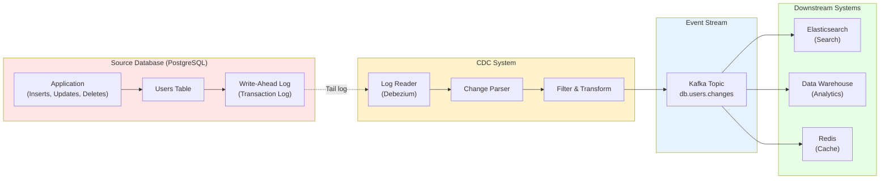

# 09. CDC: Change Data Capture for Real-Time Data Sync

## 1. Introduction

**Change Data Capture (CDC)** is a design pattern that identifies and captures changes made to data in a database and delivers those changes in real-time to downstream systems. Instead of periodically polling databases for changes or manually triggering updates, CDC provides continuous, low-latency data synchronization.

**Problem It Solves**: How do you:
 - Keep multiple data stores in sync without polling
- Replicate data to analytics systems in real-time
- Build event-driven architectures from legacy databases
- Maintain audit trails of all data changes
- Enable zero-downtime database migrations

**Key Differentiator**: Unlike batch ETL which processes data periodically (hourly, daily), CDC streams changes continuously as they occur, enabling:
- **Real-time** data replication (milliseconds to seconds delay)
- **Low overhead** (captures only changes, not full table scans)
- **Ordering guarantees** (changes processed in commit order)

**Industry Adoption**:
- **Analytics Pipelines**: Stream database changes to data warehouses (Snowflake, BigQuery)
- **Search Indexing**: Keep Elasticsearch in sync with PostgreSQL
- **Cache Invalidation**: Update Redis when database changes
- **Microservices**: Synchronize databases across services
- **Audit Logging**: Track all changes for compliance

**Used By**:
- **Debezium**: Open-source CDC platform (MySQL, PostgreSQL, MongoDB)
- **AWS DMS**: Database Migration Service with CDC
- **Google Datastream**: CDC for BigQuery, Cloud SQL
- **Confluent**: Kafka Connect with CDC connectors
- **Airbyte**: Data integration with CDC support

**Historical Context**: CDC emerged from database replication technology in the 1990s. Modern CDC leverages database transaction logs (WAL, binlog) to capture changes without impacting source database performance.

---

## 2. Core Architecture

CDC systems read database transaction logs and publish changes to an event stream (Kafka, Pub/Sub).



### Key Components

**1. Source Database**:
- **Transaction Log**: WAL (PostgreSQL), binlog (MySQL), oplog (MongoDB)
- **Purpose**: Durable record of all committed changes
- **CDC reads this log** without querying tables directly

**2. CDC Connector** (Debezium, AWS DMS):
- **Log Reader**: Tails the transaction log
- **Change Parser**: Converts log entries to change events
- **Snapshot Module**: Initial full table copy

**3. Event Stream** (Kafka, Kinesis, Pub/Sub):
- **Purpose**: Buffer and distribute change events
- **Topic per table**: `db.users.changes`, `db.orders.changes`
- **Ordering**: Preserves commit order per partition

**4. Consumer Applications**:
- **Elasticsearch**: Index changes for search
- **Data Warehouse**: Sync data for analytics
- **Cache**: Invalidate or update cached entries
- **Microservices**: React to data changes

**5. Schema Registry**:
- **Purpose**: Manage change event schemas (Avro, Protobuf)
- **Version Control**: Handle schema evolution

**6. Offset Storage**:
- **Purpose**: Track which log position has been processed
- **Recovery**: Resume from last position after failure

---

## 3. How It Works: Basic Mechanics

### A. Transaction Log-Based CDC

**How Databases Record Changes**:

**PostgreSQL Write-Ahead Log (WAL)**:
```
Every transaction generates WAL entries:

BEGIN TRANSACTION
INSERT INTO users (id, name, email) VALUES (123, 'Alice', 'alice@example.com');
COMMIT

WAL Entry:
{
  "lsn": "0/1A2B3C4D",  ← Log Sequence Number (position)
  "timestamp": "2024-01-01T10:00:00Z",
  "transaction_id": 98765,
  "operation": "INSERT",
  "table": "users",
  "schema": "public",
  "new_row": {"id": 123, "name": "Alice", "email": "alice@example.com"}
}
```

**MySQL Binary Log (binlog)**:
```
Similar to WAL, records row-level changes:

Binlog Event:
{
  "position": 12345678,
  "timestamp": 1704096000,
  "type": "WRITE_ROWS",
  "database": "mydb",
  "table": "users",
  "rows": [
    {"id": 123, "name": "Alice", "email": "alice@example.com"}
  ]
}
```

---

### B. CDC Processing Flow

**Steps**:

1. **Application writes to database**:
   ```
   INSERT INTO users (id, name, email) 
   VALUES (123, 'Alice', 'alice@example.com');
   
   Database commits transaction ✅
   ```

2. **Database writes to transaction log**:
   ```
   WAL entry appended to log
   LSN (Log Sequence Number): 0/1A2B3C4D
   ```

3. **CDC connector reads log**:
   ```
   CDC Reader:
   - Current offset: 0/1A2B3C00
   - Read next entry: 0/1A2B3C4D
   - Parse entry: INSERT into users
   ```

4. **CDC parses change event**:
   ```
   Change Event:
   {
     "operation": "insert",
     "table": "public.users",
     "before": null,  ← No previous value (INSERT)
     "after": {"id": 123, "name": "Alice", "email": "alice@example.com"},
     "source": {
       "lsn": "0/1A2B3C4D",
       "timestamp": "2024-01-01T10:00:00Z"
     }
   }
   ```

5. **CDC publishes to Kafka**:
   ```
   Topic: db.users.changes
   Key: 123  ← PK of changed row
   Value: {above change event}
   ```

6. **Consumers receive event**:
   ```
   Elasticsearch Consumer:
   - Receives event
   - Indexes document: {"id": 123, "name": "Alice", "email": "alice@example.com"}
   ```

**Latency**: Typically 100ms - 1s from database commit to consumer

---

### C. Change Event Types

**INSERT Event**:
```
{
  "operation": "insert",
  "table": "users",
  "before": null,  ← No previous state
  "after": {"id": 123, "name": "Alice", "email": "alice@example.com"}
}

Consumer Action:
  Elasticsearch: Index new document
  Cache: Warm cache with new entry
  Data Warehouse: INSERT into staging table
```

**UPDATE Event**:
```
{
  "operation": "update",
  "table": "users",
  "before": {"id": 123, "name": "Alice", "email": "alice@example.com"},
  "after": {"id": 123, "name": "Alice", "email": "alice@newdomain.com"}
}

Consumer Action:
  Elasticsearch: Update document (partial update)
  Cache: Invalidate cached entry for id=123
  Data Warehouse: UPDATE or INSERT (upsert)
```

**DELETE Event**:
```
{
  "operation": "delete",
  "table": "users",
  "before": {"id": 123, "name": "Alice", "email": "alice@newdomain.com"},
  "after": null  ← No new state (deleted)
}

Consumer Action:
  Elasticsearch: Delete document with id=123
  Cache: Evict from cache
  Data Warehouse: Soft delete or physical DELETE
```

---

### D. Initial Snapshot

**Problem**: CDC only captures changes after it starts. How to get existing data?

**Solution: Initial Snapshot + CDC**

**Steps**:

1. **Take consistent snapshot**:
   ```
   Debezium:
   - Lock table (briefly) or use snapshot isolation
   - SELECT * FROM users → 10,000 existing rows
   - Record snapshot position: LSN=0/1A2B3C00
   ```

2. **Publish snapshot as inserts**:
   ```
   For each row in snapshot:
     Publish INSERT event to Kafka
   
   10,000 events published (one per existing row)
   ```

3. **Start CDC from snapshot position**:
   ```
   CDC Reader:
   - Start reading WAL from LSN=0/1A2B3C00
   - Capture all changes after snapshot
   ```

4. **Consumers receive**:
   ```
   First: 10,000 snapshot events (existing data)
   Then: Ongoing changes (live CDC)
   
   Result: Full data sync + real-time updates ✅
   ```

**Snapshot Strategies**:
- **Consistent Snapshot**: Single transaction (may be slow for large tables)
- **Incremental Snapshot**: Chunk table by primary key (reduces lock time)
- **Schema-Only**: Skip data, only capture schema for new deployments

---

## 4. Deep Dive: Internal Implementation

### A. Log Reading Mechanics

**PostgreSQL Logical Decoding**:

**Enable Logical Replication**:
```
PostgreSQL Configuration:
postgresql.conf:
  wal_level = logical       ← Enable logical replication
  max_replication_slots = 5  ← Slots for CDC connectors

Create replication slot:
  SELECT * FROM pg_create_logical_replication_slot('debezium_slot', 'pgoutput');
  
  Result:
  - Slot name: debezium_slot
  - Plugin: pgoutput (built-in decoder)
```

**CDC Connector Uses Slot**:
```
Debezium connects and reads changes:

1. Connect to replication slot:
   START_REPLICATION SLOT debezium_slot LOGICAL 0/0
   
2. Receive stream of changes:
   {
     "lsn": "0/1A2B3C4D",
     "table": "users",
     "action": "I",  ← Insert
     "columns": {...}
   }

3. Acknowledge processed LSN:
   Debezium commits offset to Kafka
   PostgreSQL knows: "Debezium processed up to 0/1A2B3C4D"
```

**WAL Retention**:
```
PostgreSQL keeps WAL until acknowledged by all slots:
  
If Debezium crashes:
  - WAL retained from last acknowledged LSN
  - Debezium restarts, resumes from last offset
  - No data loss ✅

If WAL grows too large:
  - Alert: Replication slot behind
  - Risk: Disk full if slot never advances
```

---

**MySQL Binlog Reading**:

**Enable Row-Based Replication**:
```
MySQL Configuration:
my.cnf:
  server-id = 1
  log_bin = mysql-bin
  binlog_format = ROW     ← Row-based (not statement-based)
  binlog_row_image = FULL  ← Capture full row (before + after)
```

**CDC Connector Reads Binlog**:
```
Debezium:
1. SHOW BINARY LOGS → Get current binlog file
2. mysqlbinlog --start-position=1234 mysql-bin.000001
3. Parse binlog events:
   - Table_map (schema)
   - Write_rows (INSERT)
   - Update_rows (UPDATE)
   - Delete_rows (DELETE)
```

**Binlog Position Tracking**:
```
Kafka offset:
{
  "file": "mysql-bin.000001",
  "position": 12345678,
  "gtid": "3E11FA47-71CA-11E1-9E33-C80AA9429562:1-5"
}

On restart: Resume from this position
```

---

### B. Schema Evolution

**Problem**: Source table schema changes (add/remove column)

**Scenario**:
```
Initial Schema:
  users: (id, name, email)

Change:
  ALTER TABLE users ADD COLUMN phone VARCHAR(20);

New Schema:
  users: (id, name, email, phone)
```

**CDC Behavior**:

**Before ALT ER**:
```
Change Event:
{
  "schema": {
    "version": 1,
    "fields": [
      {"name": "id", "type": "int32"},
      {"name": "name", "type": "string"},
      {"name": "email", "type": "string"}
    ]
  },
  "payload": {"id": 123, "name": "Alice", "email": "alice@example.com"}
}
```

**After ALTER**:
```
Change Event:
{
  "schema": {
    "version": 2,  ← Schema version incremented
    "fields": [
      {"name": "id", "type": "int32"},
      {"name": "name", "type": "string"},
      {"name": "email", "type": "string"},
      {"name": "phone", "type": "string", "optional": true}  ← New field
    ]
  },
  "payload": {"id": 124, "name": "Bob", "email": "bob@example.com", "phone": "555-1234"}
}
```

**Consumer Handling**:
```
Elasticsearch Consumer:
  - Detects schema version change
  - Updates index mapping (add phone field)
  - Continues processing with new schema

Data Warehouse Consumer:
  - ALTER TABLE users ADD COLUMN phone VARCHAR(20)  ← Apply to warehouse
  - Continue loading data
```

**Schema Registry**:
```
Confluent Schema Registry:
  - Stores schema versions
  - Enforces compatibility rules (forward/backward/full)
  - Consumers fetch schema by version ID
```

---

### C. Tombstone Events (Deletes)

**Problem**: Kafka topic compaction may remove DELETE events

**Scenario**:
```
t=0: INSERT user id=123 → Event published
t=1: DELETE user id=123 → Event published
t=2: Kafka compaction runs → Keeps only latest event per key

Result: DELETE event compacted away, consumer never sees it!
```

**Solution: Tombstone Events**

**Steps**:

1. **Publish DELETE as two events**:
   ```
   Event 1 (actual delete):
   {
     "operation": "delete",
     "before": {"id": 123, "name": "Alice"},
     "after": null
   }
   
   Event 2 (tombstone):
   {
     "key": 123,
     "value": null  ← Null value = tombstone
   }
   ```

2. **Consumer processes delete**:
   ```
   Elasticsearch:
   - Receives DELETE event → Deletes document
   - Receives tombstone → Confirms deletion
   ```

3. **Kafka compaction**:
   ```
   Keeps tombstone event
   Eventually removes tombstone after retention period
   ```

**Tombstone Retention**:
```
Kafka configuration:
  delete.retention.ms = 86400000  (24 hours)
  
Tombstone kept for 24 hours, then removed
Consumers have 24 hours to process deletion
```

---

### D. Exactly-Once Semantics

**Problem**: CDC connector crashes after publishing event but before committing offset

**Scenario**:
```
t=0: CDC reads WAL entry (LSN=100)
t=1: CDC publishes event to Kafka ✅
t=2: CDC CRASHES ❌ (before committing offset)
t=3: CDC restarts
t=4: Reads from last committed offset (LSN=90)
t=5: Republishes event for LSN=100 → Duplicate!
```

**Solution 1: Idempotent Consumers**

```
Consumer tracks processed IDs:

ON Receive EVENT:
  event_id = event.source.lsn + event.source.txid
  
  IF event_id IN processed_events:
    SKIP (already processed)
  ELSE:
    Process event
    INSERT INTO processed_events (event_id)
```

**Solution 2: Kafka Transactions**

```
Debezium with Kafka Transactions:

BEGIN TRANSACTION
  1. Publish event to Kafka
  2. Commit offset to Kafka
  3. COMMIT TRANSACTION

Result: Atomic (both or neither)
```

**Solution 3: Deduplication Window**

```
Kafka Streams:
  - Deduplicate by key + LSN + txid
  - Window: 5 minutes
  - If duplicate seen within window: Drop
```

---

## 5. End-to-End Walkthrough: Syncing PostgreSQL to Elasticsearch

### Scenario: E-Commerce product search powered by CDC

**Components**:
- **Source**: PostgreSQL (products table)
- **CDC**: Debezium PostgreSQL connector
- **Stream**: Apache Kafka
- **Target**: Elasticsearch (product index)

---

### Step 1: Enable CDC on PostgreSQL

**Configure PostgreSQL**:
```
1. Edit postgresql.conf:
   wal_level = logical
   max_replication_slots = 5

2. Restart PostgreSQL

3. Create replication slot:
   SELECT pg_create_logical_replication_slot('debezium', 'pgoutput');

4. Grant permissions:
   GRANT USAGE ON SCHEMA public TO debezium_user;
   ALTER TABLE products REPLICA IDENTITY FULL;  ← Capture full row on UPDATE/DELETE
```

---

### Step 2: Deploy Debezium Connector

**Connector Configuration**:
```
{
  "name": "products-cdc-connector",
  "config": {
    "connector.class": "io.debezium.connector.postgresql.PostgresConnector",
    "database.hostname": "postgres.example.com",
    "database.port": "5432",
    "database.user": "debezium_user",
    "database.password": "...",
    "database.dbname": "ecommerce",
    "database.server.name": "ecommerce-db",
    "table.include.list": "public.products",
    "plugin.name": "pgoutput",
    "publication.autocreate.mode": "filtered",
    "slot.name": "debezium",
    "topic.prefix": "ecommerce"
  }
}
```

**Deploy**:
```
POST /connectors
Content-Type: application/json
{above config}

Response:
{
  "name": "products-cdc-connector",
  "state": "RUNNING"
}
```

---

### Step 3: Initial Snapshot

**Debezium Actions**:
```
1. Take snapshot of products table:
   SELECT * FROM products
   Result: 10,000 existing products

2. For each row, publish INSERT event:
   Topic: ecommerce.public.products
   Events: 10,000 snapshot events

3. Record snapshot completion:
   Last LSN: 0/5A6B7C8D

4. Start CDC from snapshot LSN:
   Read WAL from 0/5A6B7C8D onwards
```

**Kafka Topics Created**:
```
ecommerce.public.products     ← Product change events
ecommerce.public.products-schema  ← Schema changes (if using Avro)
```

---

### Step 4: Application Inserts New Product

**E-Commerce App**:
```
INSERT INTO products (id, name, category, price, description, in_stock)
VALUES (10001, 'Wireless Mouse', 'Electronics', 29.99, 'Ergonomic wireless mouse', true);

COMMIT;
```

**PostgreSQL**:
```
Writes to WAL:
  LSN: 0/5A6B7D00
  Operation: INSERT
  Table: public.products
  New Row: {"id": 10001, "name": "Wireless Mouse", ...}
```

---

### Step 5: Debezium Captures Change

**Debezium**:
```
1. Reads WAL entry at LSN 0/5A6B7D00

2. Parses change:
   Operation: INSERT
   Table: products
   After: {"id": 10001, "name": "Wireless Mouse", ...}

3. Builds change event:
   {
     "schema": {...},
     "payload": {
       "op": "c",  ← Create
       "before": null,
       "after": {
         "id": 10001,
         "name": "Wireless Mouse",
         "category": "Electronics",
         "price": 29.99,
         "description": "Ergonomic wireless mouse",
         "in_stock": true
       },
       "source": {
         "lsn": "0/5A6B7D00",
         "timestamp": 1704096000
       }
     }
   }

4. Publishes to Kafka:
   Topic: ecommerce.public.products
   Key: 10001  ← Product ID
   Value: {above payload}
```

---

### Step 6: Elasticsearch Consumer Indexes Product

**ES Sink Connector**:
```
Config:
{
  "name": "elasticsearch-sink",
  "connector.class": "ElasticsearchSinkConnector",
  "topics": "ecommerce.public.products",
  "connection.url": "http://elasticsearch:9200",
  "type.name": "_doc",
  "key.ignore": "false",
  "schema.ignore": "true",
  "behavior.on.null.values": "delete"  ← Handle tombstones
}
```

**Consumes Event**:
```
1. Receive change event from Kafka

2. Extract fields:
   id = 10001
   name = "Wireless Mouse"
   category = "Electronics"
   ...

3. Index in Elasticsearch:
   PUT /products/_doc/10001
   {
     "id": 10001,
     "name": "Wireless Mouse",
     "category": "Electronics",
     "price": 29.99,
     "description": "Ergonomic wireless mouse",
     "in_stock": true,
     "indexed_at": "2024-01-01T10:00:05Z"
   }

4. Commit Kafka offset
```

---

### Step 7: Customer Searches for Product

**Search Request**:
```
GET /products/_search
{
  "query": {
    "multi_match": {
      "query": "wireless mouse",
      "fields": ["name^2", "description"]
    }
  },
  "filter": {
    "term": {"in_stock": true}
  }
}
```

**Elasticsearch Response**:
```
{
  "hits": [
    {
      "_id": "10001",
      "_score": 15.3,
      "_source": {
        "id": 10001,
        "name": "Wireless Mouse",
        "price": 29.99,
        "in_stock": true
      }
    }
  ]
}

Response time: 20ms
```

**Total Latency**: Database insert → Searchable: ~300ms

---

### Step 8: Product Updated (Price Change)

**E-Commerce App**:
```
UPDATE products 
SET price = 24.99, description = 'Ergonomic wireless mouse - ON SALE!'
WHERE id = 10001;

COMMIT;
```

**CDC Flow**:
```
1. Debezium captures UPDATE:
   {
     "op": "u",  ← Update
     "before": {"id": 10001, "price": 29.99, "description": "Ergonomic..."},
     "after": {"id": 10001, "price": 24.99, "description": "Ergonomic... ON SALE!"}
   }

2. Kafka publishes event

3. Elasticsearch Sink receives event

4. Updates document:
   POST /products/_update/10001
   {
     "doc": {
       "price": 24.99,
       "description": "Ergonomic wireless mouse - ON SALE!"
     }
   }

5. Search reflects new price instantly ✅
```

---

## 6. Failure Scenarios (The Senior View)

### Scenario A: CDC Connector Falls Behind

**Symptom**: Elasticsearch shows stale data (missing recent products).

**Cause**: CDC connector processing slower than database write rate.

#### The Problem

**Timeline**:
```
t=0: Database receiving 500 inserts/sec
Connector processing: 300 events/sec

Lag accumulates:
t=0: Lag = 0 events
t=60: Lag = 12,000 events (200/sec * 60s)
t=120: Lag = 24,000 events

Current WAL position: 0/8A9B0C0D
Connector position: 0/7A8B9C0D (far behind)
```

**Impact**:
```
Customer inserts product at t=0
Product visible in search at t=80 (80 seconds lag!)

Acceptable for analytics, NOT for real-time search
```

#### The Fix

**Solution 1: Scale CDC Connector**

```
Deploy multiple connector tasks:

Original: 1 task processing all changes
New: 4 tasks, each handling subset of tables

Kafka Connect:
{
  "tasks.max": 4  ← Parallel processing
}

Result: 300 → 1200 events/sec ✅
```

**Solution 2: Optimize Processing**

```
Batch processing:

Before:
  For each event:
    Publish to Kafka (network call)
    
After:
  Batch 100 events:
    Single Kafka publish (bulk)

Throughput: 300 → 1000 events/sec
```

**Solution 3: Increase WAL Retention**

```
PostgreSQL:
  wal_keep_size = 10GB  ← Keep more WAL segments

Prevents WAL deletion while connector catches up
```

**Monitoring**:
```
Metrics:
  cdc_lag_seconds: < 10s (good), > 60s (alert)
  cdc_throughput_events_per_sec: > database_write_rate
  wal_disk_usage_gb: < 5GB (good), > 8GB (alert)
```

---

### Scenario B: Duplicate Events in Elasticsearch

**Symptom**: Product appears twice in search results with different prices.

**Cause**: CDC connector reprocessed events after crash.

#### The Problem

**Timeline**:
```
t=0: Product price updated: $29.99 → $24.99
t=1: Debezium publishes UPDATE event to Kafka ✅
t=2: ES Sink indexes update ✅ (price now $24.99)
t=3: ES Sink CRASHES ❌ (before committing Kafka offset)
t=4: ES Sink restarts
t=5: Kafka redelivers event (offset not committed)
t=6: ES Sink indexes AGAIN → Creates duplicate document ❌
```

**Elasticsearch State**:
```
GET /products/_search?q=id:10001

Results:
{
  "hits": [
    {
      "_id": "10001",
      "_source": {"id": 10001, "price": 24.99}
    },
    {
      "_id": "10001-duplicate",  ← Duplicate!
      "_source": {"id": 10001, "price": 24.99}
    }
  ]
}
```

#### The Fix: Idempotent Operations

**Solution: Use Upsert with ID**

```
Elasticsearch Sink Configuration:
{
  "write.method": "upsert",  ← Don't create duplicate
  "pk.mode": "record_key",    ← Use Kafka key as document ID
  "key.ignore": "false"
}

Behavior:
  PUT /products/_doc/10001  ← Always same ID
  {
    "id": 10001,
    "price": 24.99
  }

Result: Overwrite existing document, no duplicates ✅
```

**Alternative: Track Processed Events**

```
Elasticsearch Consumer:
  ON Receive Event:
    event_id = event.source.lsn + event.source.txid
    
    Check: GET /processed_events/_doc/{event_id}
    
    If found:
      SKIP (already processed)
    Else:
      Index product
      Index processed_event
```

---

### Scenario C: Schema Change Breaks Consumer

**Symptom**: Elasticsearch consumer crashes after column added to PostgreSQL.

**Cause**: Consumer not handling new schema version.

#### The Problem

**Timeline**:
```
t=0: PostgreSQL schema:
  products: (id, name, price, description)

t=1: DBA adds column:
  ALTER TABLE products ADD COLUMN rating FLOAT;

t=2: Debezium publishes event with new schema (version 2)

t=3: Elasticsearch Sink receives event:
  Schema version 2 (includes rating field)
  
t=4: ES index mapping doesn't have rating field:
  PUT /products/_doc/10001
  {
    "id": 10001,
    "name": "Widget",
    "rating": 4.5  ← Field not in mapping!
  }

t=5: Elasticsearch Dynamic Mapping:
  Auto-creates field as "float"
  
t=6: Later, text value sent for rating:
  {"rating": "N/A"}
  
  Error: "mapper_parsing_exception: failed to parse field [rating]"
  Consumer crashes ❌
```

#### The Fix: Schema Evolution Strategy

**Solution 1: Pre-Create Mapping with All Fields**

```
PUT /products
{
  "mappings": {
    "properties": {
      "id": {"type": "long"},
      "name": {"type": "text"},
      "price": {"type": "float"},
      "description": {"type": "text"},
      "rating": {"type": "float"},  ← Pre-create even if not used yet
      "review_count": {"type": "integer"}
    }
  }
}

Benefit: New fields don't break indexing
```

**Solution 2: Schema Registry with Compatibility**

```
Confluent Schema Registry:
  - Register initial schema (version 1)
  - On ALTER TABLE: Register new schema (version 2)
  - Enforce backward compatibility
  - Consumer gracefully handles missing fields
```

**Solution 3: Fallback to Default Values**

```
ES Sink Config:
{
  "errors.tolerance": "all",  ← Don't crash on errors
  "errors.deadletterqueue.topic.name": "dlq-products"
}

Behavior:
  If indexing fails → Send to DLQ
  Alert on-call engineer
  Continue processing other events
```

---

## 7. Performance Tuning / Scaling Strategies

### A. Configuration Tuning

| Configuration | Recommended | Why? |
|:--------------|:------------|:-----|
| **Batch Size** | 500-2000 | Balance latency vs throughput |
| **Max Tasks** | 4-8 per connector | Parallel processing |
| **Poll Interval** | 100-500ms | Trade-off: latency vs CPU |
| **WAL Sender Timeout** | 60s | Prevent connection drops |
| **Offset Flush Interval** | 10-60s | Balance durability vs performance |

---

### B. Scaling Strategies

**CDC Connector Scaling**:
```
Kafka Connect:
  - Deploy on Kubernetes (3-5 nodes)
  - Auto-scale based on lag metrics
  - Distribute tables across tasks
  
Example:
  Table products → Task 1
  Table orders → Task 2
  Table users → Task 3
```

**Kafka Partitioning**:
```
Partition change events by table primary key:

products table:
  Partition 0: id % 4 == 0
  Partition 1: id % 4 == 1
  Partition 2: id % 4 == 2
  Partition 3: id % 4 == 3

Benefit: 4 consumers process in parallel
```

---

## 8. Constraints & Limitations

| Constraint | Limit | Why? |
|:-----------|:------|:-----|
| **Latency** | 100ms - 5s | Log reading + network + processing |
| **WAL Retention** | Limited by disk | Connector must keep up to avoid WAL deletion |
| **Schema Changes** | Requires coordination | Consumers must handle new schemas |
| **Database Load** | Low but not zero | Logical decoding has CPU cost |
| **Exactly-Once** | Complex | Requires idempotent consumers or transactions |

---

## 9. When to Use CDC?

| Use Case | Verdict | Why? |
|:---------|:--------|:-----|
| **Real-Time Analytics** | ✅ **YES** | Stream DB changes to data warehouse |
| **Search Indexing** | ✅ **YES** | Keep Elasticsearch in sync |
| **Cache Invalidation** | ✅ **YES** | Update Redis when DB changes |
| **Event-Driven Architecture** | ✅ **YES** | Turn DB into event source |
| **Database Migration** | ✅ **YES** | Zero-downtime migration with CDC |
| **Batch ETL** | ❌ **NO** | Use traditional ETL if real-time not needed |
| **Small Scale** | ⚠️ **MAYBE** | Overhead may not be worth it for small DBs |

---

## 10. Production Checklist

1. [ ] **Enable Logical Replication**: Configure WAL level and replication slots
2. [ ] **Monitor WAL Disk Usage**: Alert if > 80% capacity
3. [ ] **Set Up Schema Registry**: Manage schema evolution
4. [ ] **Implement Idempotent Consumers**: Handle duplicate events
5. [ ] **Configure Offset Retention**: Retain offsets for 7+ days
6. [ ] **Monitor CDC Lag**: Alert if lag > 60 seconds
7. [ ] **Test Schema Changes**: Simulate ALTER TABLE scenarios
8. [ ] **Set Up Dead Letter Queue**: For failed events
9. [ ] **Backup Replication Slot**: Prevent WAL deletion during outages
10. [ ] **Load Test**: Verify throughput meets write rate

**Critical Metrics**:
```
cdc_lag_seconds: < 10s
cdc_throughput_events_per_sec: >= db_write_rate
wal_disk_usage_percent: < 80%
consumer_offset_lag: < 1000 events
schema_registry_availability: 100%
```

---

**Conclusion**: CDC provides real-time data synchronization by capturing changes from database transaction logs and streaming them to downstream systems. It enables event-driven architectures, real-time analytics, and zero-downtime migrations. While it adds operational complexity, CDC is essential for modern data pipelines requiring sub-second latency.
