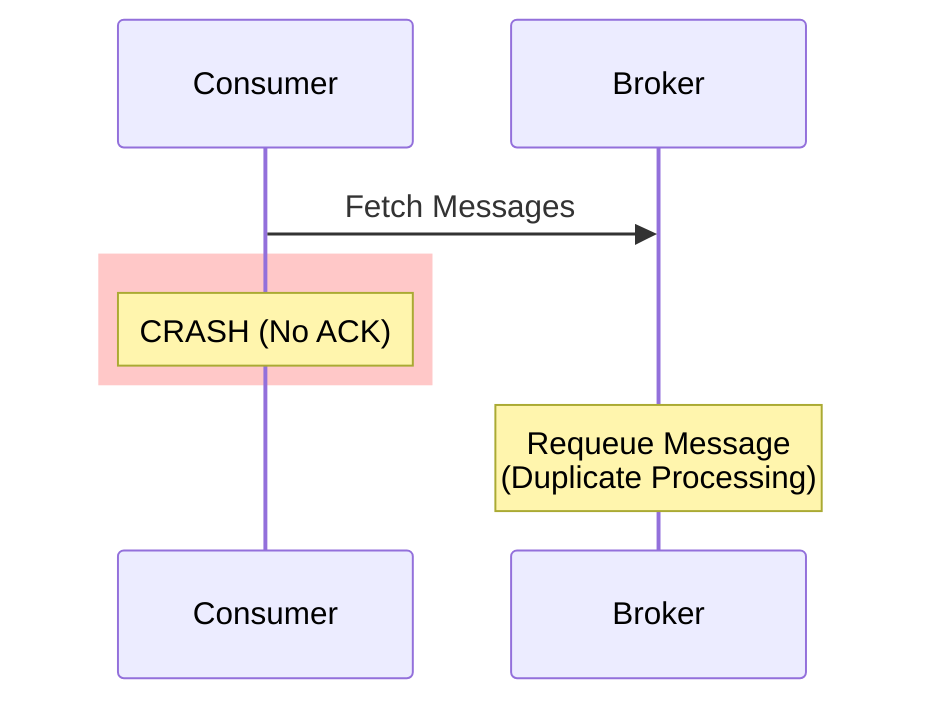

# Documentation Standards for System Design Documents

This guide defines the structure, depth, and style for creating technical documentation in this repository. All framework/technology documents should follow this consistent pattern.

---

## Document Structure (10 Sections)

All documents must follow this exact organizational flow:

### 1. Introduction
**Purpose**: Set context and explain what the technology is.

**Required Content**:
*   What problem does it solve?
*   Key differentiator from alternatives
*   Industry adoption/use case summary
*   Origins (optional but valuable context)

**Example**:
> Apache Kafka is a distributed event streaming platform designed for **High Throughput**, **Fault Tolerance**, and **Replayability**. Unlike traditional message brokers, it functions as a **Distributed Commit Log**: an append-only, immutable sequence of records.

---

### 2. Core Architecture
**Purpose**: Visual overview of the system's main components.

**Required Content**:
*   **Mermaid diagram** showing key components and their relationships
*   Clear separation of control plane vs data plane (if applicable)
*   Key components list (4-6 items with brief descriptions)

**Diagram Requirements**:
*   Use `mermaid` code blocks
*   Quote all node labels containing special characters: `N1["Node 1 (Leader)"]`
*   Use subgraphs to group related components
*   Include arrows showing data flow

**Example Component List**:
```markdown
### Key Components
1.  **Topic**: A logical category of messages (e.g., `user-events`).
2.  **Partition**: The unit of parallelism. A topic is split into $N$ partitions.
3.  **Controller**: One broker acts as the "brain", managing leader election.
```

---

### 3. How It Works: Basic Mechanics
**Purpose**: Explain the fundamental operations without deep implementation details.

**Required Subsections** (choose 2-4 relevant to the technology):
*   **A. Core Workflow** (e.g., how messages flow, how queries execute)
*   **B. Time/State Management** (if applicable)
*   **C. Distribution Model** (partitioning, sharding, routing)
*   **D. Delivery Guarantees** (at-most-once, at-least-once, exactly-once)

**Style**:
*   Use concrete examples
*   Avoid deep technical jargon
*   Focus on "what happens" not "how it's implemented"

---

### 4. Deep Dive: Internal Implementation
**Purpose**: Detailed technical explanation of how the system works internally.

**Required Content**:
*   **Subsection A-D** covering key internals (4-6 subsections)
*   C-level code snippets (show actual structs/functions where relevant)
*   Mermaid diagrams for complex flows
*   Performance characteristics (O(N) complexity, latency numbers)

**Topics to Cover**:
*   Data structures (hash tables, trees, queues)
*   Network protocols (zero-copy, credit-based flow control)
*   Consensus mechanisms (Raft, Chandy-Lamport)
*   Memory management (heap vs off-heap, GC considerations)
*   Disk I/O optimizations (sequential writes, page cache)

**Example**:
```c
// Simplified internal structure
typedef struct stream {
    rax *rax;           // Radix tree of entry IDs
    streamCG *cgroups;  // Linked list of consumer groups
} stream;
```

---

### 5. End-to-End Walkthrough: Life of [Entity]
**Purpose**: Trace a concrete example through the entire system lifecycle.

**Required Content**:
*   Pick a representative entity (message, query, event, request)
*   **Step 1-4**: Break down the full lifecycle
*   Show state transitions
*   Include sequence diagrams where helpful

**Example Title Formats**:
*   "Life and Death of a Query" (Spark)
*   "The Flow of the Stream" (Flink)
*   "Life and Death of a Message" (SQS, RabbitMQ)
*   "Life of a Stream Event" (Redis Streams)

**Each Step Should Include**:
*   What happens
*   Which component is involved
*   State changes
*   Complexity or timing (if relevant)

---

### 6. Failure Scenarios (The Senior View)
**Purpose**: Detailed debugging knowledge for production issues.

**Required Content**:
*   **Scenario A-D**: 3-4 common failure modes
*   Each scenario must include:
    - **Symptom**: What the user/developer sees
    - **Cause**: Root technical reason
    - **Mechanism**: Step-by-step explanation of how it happens
    - **Visual Diagram**: Sequence or graph diagram showing the failure
    - **The Fix**: Specific, actionable solutions

**Example Scenarios**:
*   Consumer crashes (offset management, duplicates, data loss)
*   Memory exhaustion (OOM, backpressure, watermarks)
*   Network partitions (split-brain, rebalancing)
*   Poison messages (infinite loops, crash loops)
*   Timeouts (heartbeats, checkpoints, session timeouts)

**Diagram Style**:


**Required Detail Level**:
*   Configuration parameters (exact names, default values)
*   Timeout values (e.g., `session.timeout.ms=10s`)
*   Code examples showing the fix (Java, Python, Scala as appropriate)

---

### 7. Performance Tuning / Scaling Strategies
**Purpose**: How to optimize and scale the system.

**Required Subsections**:
*   **A. Horizontal Scaling**: Adding nodes/instances
*   **B. Vertical Scaling**: Increasing resources per node
*   **C. Configuration Tuning**: Key parameters (table format)

**Configuration Table Format**:
```markdown
| Configuration | Recommendation | Why? |
| :--- | :--- | :--- |
| `param.name` | Value or Formula | Technical explanation |
```

**Example**:
| Configuration | Recommendation | Why? |
| :--- | :--- | :--- |
| `spark.sql.shuffle.partitions` | `DataSize / 128MB` | 200 is too small for TBs (OOM). |

---

### 8. Constraints & Limitations
**Purpose**: Honest assessment of what the technology cannot do well.

**Required Format**: Table

```markdown
| Constraint | Limit | Why? |
| :--- | :--- | :--- |
| **Feature Name** | Specific Number/Limit | Technical reason |
```

**Examples**:
*   Throughput limits (msgs/sec, queries/sec)
*   Memory/disk bounds
*   Latency characteristics
*   Scalability ceilings
*   Ordering guarantees (or lack thereof)

---

### 9. When to Use [Technology]?
**Purpose**: Decision matrix for technology selection.

**Required Format**: Table with Verdict column

```markdown
| Use Case | Verdict | Why? |
| :--- | :--- | :--- |
| **Specific Use Case** | **YES/NO/MAYBE** | Technical justification |
```

**Guidelines**:
*   Include at least 5 use cases
*   Mix positive (YES) and negative (NO) recommendations
*   Be honest about weaknesses
*   Compare to alternatives where relevant

**Example**:
| Use Case | Verdict | Why? |
| :--- | :--- | :--- |
| **Event Sourcing** | **YES** | Immutable log is perfect for audit trails. |
| **Request-Reply (RPC)** | **NO** | Use gRPC. Kafka is for async workflows. |

---

### 10. Production Checklist
**Purpose**: Actionable deployment recommendations.

**Required Format**: Numbered checklist (6-8 items)

**Each Item Should**:
*   Start with `[ ]` checkbox
*   Be specific and actionable
*   Include the exact configuration/command where applicable

**Example**:
```markdown
1.  [ ] **Set `min.insync.replicas=2`**: With `acks=all`, guarantees no data loss if one node dies.
2.  [ ] **Monitor Consumer Lag**: The most critical metric. If lag grows, you're falling behind.
```

---

## Writing Style Guidelines

### Tone
*   **Technical but Accessible**: Write for senior engineers, not academics
*   **Narrative, Not Reference**: Tell a story, don't just list facts
*   **Role-Agnostic**: Avoid "Junior Engineer" vs "Senior Engineer" labels in prose
*   **Honest**: Acknowledge weaknesses and trade-offs

### Language
*   Use **active voice**: "Kafka stores messages" not "Messages are stored by Kafka"
*   Use **concrete examples**: Don't say "large dataset", say "10GB partition"
*   Use **precise terminology**: "Offset 500" not "around offset 500"
*   **Avoid jargon** without explanation: Define acronyms on first use

### Formatting
*   Use **bold** for emphasis on key terms and concepts
*   Use `backticks` for:
    - Code identifiers (function names, variables, commands)
    - Configuration parameters
    - File paths
*   Use **$math$** notation for complexity: $O(N)$, $O(\log N)$

### Technical Depth
*   **Include actual values**: "Default timeout is 10s" not "Default timeout is short"
*   **Show the code**: Include C/Java/Python snippets for structs, configs, fixes
*   **Quantify everything**: "500k msgs/sec" not "high throughput"
*   **Explain WHY**: Don't just say "use this config", explain the technical reason

---

## Diagram Standards

### Mermaid Syntax Rules
1.  **Always quote labels with special characters**:
    
    **CORRECT**:
    ```mermaid
    graph TD
        N1["Node 1 (Leader)"]
    ```
    
    **INCORRECT** (will break):
    ```
    graph TD
        N1[Node 1 (Leader)]
    ```

2.  **Use subgraphs for grouping**:
    ```mermaid
    graph TD
        subgraph CP["Control Plane"]
            Controller["Controller"]
        end
        subgraph DP["Data Plane"]
            Worker["Worker Node"]
        end
    ```

3.  **Color coding**:
    *   Red (`fill:#ff9999`) for failures, crashes, errors
    *   Yellow (`fill:#fff3cd`) for warnings, alternatives
    *   Green (`fill:#ccffcc`) for success, solutions
    *   Blue (`fill:#e6f3ff`) for normal operations

4.  **Sequence diagrams for workflows**:
    ```mermaid
    sequenceDiagram
        participant C as Client
        participant S as Server
        C->>S: Request
        S-->>C: Response
    ```

5.  **Graph diagrams for architecture**:
    ```mermaid
    graph TD
        A[Component A] --> B[Component B]
    ```

### When to Include Diagrams
*   **Core Architecture** (Section 2): Always
*   **Internal Implementation** (Section 4): For complex flows (2-3 diagrams)
*   **Failure Scenarios** (Section 6): For each scenario (3-4 diagrams)
*   **End-to-End Walkthrough** (Section 5): Optional but helpful

---

## Content Checklist

Before finalizing a document, ensure:

**Structure**:
- [ ] All 10 sections are present in order
- [ ] Each section has the required subsections
- [ ] No sections are missing

**Visual Elements**:
- [ ] At least 5 Mermaid diagrams total
- [ ] All diagrams render correctly (test in preview)
- [ ] All node labels with special characters are quoted
- [ ] Color coding is used appropriately

**Technical Depth**:
- [ ] Includes C/Java/Python code snippets (at least 3)
- [ ] Configuration parameters have exact names and default values
- [ ] Timeout/latency values are quantified (not "fast" or "slow")
- [ ] Complexity analysis included where relevant ($O(N)$, etc.)

**Failure Scenarios**:
- [ ] At least 3 detailed scenarios with diagrams
- [ ] Each scenario has Symptom/Cause/Mechanism/Fix
- [ ] Includes code examples for fixes
- [ ] Shows configuration parameters

**Tables**:
- [ ] Constraints & Limitations table (Section 8)
- [ ] When to Use table (Section 9)
- [ ] Configuration tuning table (Section 7)

**Examples**:
- [ ] Concrete numbers (not vague "many" or "large")
- [ ] Real-world scenarios (not abstract "Entity A processes Entity B")
- [ ] Specific commands/configs users can copy-paste

---

## Example Documents

Refer to these documents as gold standards:

*   **Message Brokers**:
    - `03_Kafka.md` (offset management, rebalance storm)
    - `02_RabbitMQ.md` (memory alarm, prefetch problem)
    - `06_Redis_Streams.md` (PEL mechanics, Radix Tree compression)
    - `07_Redis_PubSub.md` (C-level internals, buffer management)

*   **Stream/Batch Processing**:
    - `02_Apache_Spark.md` (DAGScheduler, shuffle physics)
    - `02_Apache_Flink.md` (checkpoint barriers, backpressure)

All follow the same 10-section structure with deep technical detail, visual diagrams, and production-ready debugging knowledge.

---

## Quick Reference Template

```markdown
# [Technology Name]: [One-Line Description]

## 1. Introduction
[What it is, key differentiator, problem it solves]

## 2. Core Architecture
[Mermaid diagram + Key Components list]

## 3. How It Works: [Fundamental Concept]
### A. [Basic Operation 1]
### B. [Basic Operation 2]

## 4. Deep Dive: Internal Implementation
### A. [Internal Detail 1]
### B. [Internal Detail 2]
### C. [Internal Detail 3]
[C/Java code snippets, diagrams]

## 5. End-to-End Walkthrough: Life of [Entity]
### Step 1: [Phase 1]
### Step 2: [Phase 2]
[Sequence diagram]

## 6. Failure Scenarios (The Senior View)
### Scenario A: [Failure Mode 1]
**Symptom**: 
**Cause**:
**Mechanism**:
[Diagram]
**The Fix**:

### Scenario B: [Failure Mode 2]
[Same structure]

## 7. Performance Tuning / Scaling Strategies
### A. Horizontal Scaling
### B. Vertical Scaling
### C. Configuration Table
| Configuration | Recommendation | Why? |

## 8. Constraints & Limitations
| Constraint | Limit | Why? |

## 9. When to Use [Technology]?
| Use Case | Verdict | Why? |

## 10. Production Checklist
1.  [ ] [Checklist item 1]
2.  [ ] [Checklist item 2]
```

---

**Remember**: The goal is to create documentation that serves as a comprehensive debugging and decision-making resource for senior engineers tackling complex production scenarios. Depth, honesty, and clarity are more valuable than brevity.
