# Documentation Standards for System Design Documents

This guide defines the structure, depth, and style for creating technical documentation in this repository. All framework/technology documents should follow this consistent pattern.

---

## Document Type Classification

Before writing a document, identify which category it belongs to. This determines your approach to code examples, technical depth, and explanation style.

### Type 1: Tool/Technology Documentation

**Purpose**: Explain how a specific software system works internally and how to use it.

**Examples**: Kafka, PostgreSQL, Redis, Elasticsearch, Kubernetes, RabbitMQ

**Characteristics**:
- **Code Level**: Include actual implementation snippets (C/Java/Python/Go)
- **Configuration**: Show exact parameter names and values
- **API Examples**: Demonstrate actual API calls with request/response
- **Step Description**: Explain "what code executes" with actual code blocks

**When to Use**: Documenting a real software product that users install and operate.

**Example Snippet**:
```java
// Kafka Consumer - Actual code
KafkaConsumer<String, String> consumer = new KafkaConsumer<>(props);
consumer.subscribe(Collections.singletonList("user-events"));

while (true) {
    ConsumerRecords<String, String> records = consumer.poll(Duration.ofMillis(100));
    for (ConsumerRecord<String, String> record : records) {
        processMessage(record);
        consumer.commitSync();
    }
}
```

---

### Type 2: Concept/Pattern Documentation

**Purpose**: Explain architectural patterns, algorithms, and coordination protocols.

**Examples**: Saga Pattern, TCC, CQRS, CDC, Raft Consensus, Two-Phase Commit, Gossip Protocol

**Characteristics**:
- **Code Level**: Minimal - only for illustrating data structures or schemas
- **Step Description**: Use numbered, procedural steps describing "what happens"
- **Pseudocode**: Acceptable for clarity, but avoid language-specific code
- **Focus**: Understanding the pattern/algorithm, not implementation details

**When to Use**: Documenting a design pattern, algorithm, or protocol that can be implemented in any language.

**Example Snippet**:
```
Steps:
1. Coordinator sends PREPARE to all participants
2. Each participant validates and locks resources
3. If validation succeeds: Reply PREPARED
4. If validation fails: Reply ABORT
5. Coordinator waits for all responses (or timeout)
6. If ALL replied PREPARED: Send COMMIT
7. If ANY replied ABORT or timeout: Send ABORT
```

---

### Type 3: First Principles Documentation

**Purpose**: Deep technical explanations of fundamental computer science concepts.

**Examples**: TCP/IP mechanics, DNS resolution, File system internals, OS scheduling, Memory management

**Characteristics**:
- **Code Level**: System-level code (kernel, syscalls, assembly where relevant)
- **Layered Explanation**: Trace through application → OS → kernel → hardware
- **Step Description**: Packet-by-packet, syscall-by-syscall, instruction-level detail
- **Focus**: Teaching fundamental principles that apply across all implementations

**When to Use**: Documenting how foundational systems work at the OS/network/hardware level.

**Example Snippet**:
```c
// Linux kernel: TCP socket accept() syscall
struct socket *sock;
struct sock *sk;

// Accept queue lookup (completed 3-way handshake)
sk = inet_csk_accept(sock, flags, &err);

// Create new socket for accepted connection
struct socket *newsock = sock_alloc();
newsock->type = sock->type;
newsock->ops = sock->ops;

return newfd; // Return file descriptor to userspace
```

---

### Decision Tree: Which Document Type?

```mermaid
graph TD
    Start["📄 What are you documenting?"]
    
    Start --> Q1{"Specific software product<br/>users install/deploy?"}
    Q1 -->|Yes| Tool["📦 Tool/Technology Doc<br/>(Use code snippets)"]
    Q1 -->|No| Q2
    
    Q2{"Algorithm, pattern,<br/>or protocol?"}
    Q2 -->|Yes| Concept["🧩 Concept/Pattern Doc<br/>(Use step descriptions)"]
    Q2 -->|No| Q3
    
    Q3{"Fundamental CS concept<br/>(OS/network/hardware)?"}
    Q3 -->|Yes| Principles["⚙️ First Principles Doc<br/>(Use system-level code)"]
    Q3 -->|No| Unknown["❓ Clarify scope<br/>with team"]
    
    style Tool fill:#e6f3ff
    style Concept fill:#ffe6f3
    style Principles fill:#fff3cd
    style Unknown fill:#ffcccc
```



---

## Document Structure (10 Sections)

All documents must follow this exact organizational flow:

### 1. Introduction
**Purpose**: Set context and explain what the technology is.

**Required Content**:
*   What problem does it solve?
*   Key differentiator from alternatives
*   Industry adoption/use case summary
*   Origins (optional but valuable context)

**Example**:
> Apache Kafka is a distributed event streaming platform designed for **High Throughput**, **Fault Tolerance**, and **Replayability**. Unlike traditional message brokers, it functions as a **Distributed Commit Log**: an append-only, immutable sequence of records.

---

### 2. Core Architecture
**Purpose**: Visual overview of the system's main components.

**Required Content**:
*   **Mermaid diagram** showing key components and their relationships
*   Clear separation of control plane vs data plane (if applicable)
*   Key components list (4-6 items with brief descriptions)

**Diagram Requirements**:
*   Use `mermaid` code blocks
*   Quote all node labels containing special characters: `N1["Node 1 (Leader)"]`
*   Use subgraphs to group related components
*   Include arrows showing data flow

**Example Component List**:
```markdown
### Key Components
1.  **Topic**: A logical category of messages (e.g., `user-events`).
2.  **Partition**: The unit of parallelism. A topic is split into $N$ partitions.
3.  **Controller**: One broker acts as the "brain", managing leader election.
```

---

### 3. How It Works: Basic Mechanics
**Purpose**: Explain the fundamental operations without deep implementation details.

**Required Subsections** (choose 2-4 relevant to the technology):
*   **A. Core Workflow** (e.g., how messages flow, how queries execute)
*   **B. Time/State Management** (if applicable)
*   **C. Distribution Model** (partitioning, sharding, routing)
*   **D. Delivery Guarantees** (at-most-once, at-least-once, exactly-once)

**For Distributed Systems (Databases, Message Brokers, etc.)**:
*   **Global-Level Deployment**: Multi-region, cross-datacenter, geo-replication strategies
*   **Consensus Mechanisms**: Raft, Paxos, Gossip, or custom protocols (if used)
*   **Replication**: Master-slave, multi-master, leaderless architectures
*   **Consistency Models**: Strong, eventual, causal consistency trade-offs
*   **Failure Detection**: How nodes detect failures (heartbeats, timeouts)
*   **Network Partitions**: How system behaves during split-brain scenarios

**Style**:
*   Use concrete examples
*   Avoid deep technical jargon
*   Focus on "what happens" not "how it's implemented"

---

### 4. Deep Dive: Internal Implementation
**Purpose**: Detailed technical explanation of how the system works internally.

**Required Content**:
*   **Subsection A-D** covering key internals (4-6 subsections)
*   Mermaid diagrams for complex flows (2-3 diagrams)
*   Performance characteristics (O(N) complexity, latency numbers with units)
*   Code/pseudocode appropriate to document type (see below)

**Content by Document Type**:

**For Tool/Technology Docs**:
*   Include C/Java/Python code snippets showing actual structs/functions
*   Configuration parameters with defaults and ranges
*   Internal data structure implementations

**For Concept/Pattern Docs**:
*   State machine diagrams with transitions
*   Algorithm pseudocode or step-by-step breakdowns
*   Database schema or data model examples (not implementation code)

**For First Principles Docs**:
*   Kernel/OS-level code snippets
*   System call traces
*   Hardware-level explanations where applicable

---

#### Technical Depth Requirements (Principal Engineer Level)

All documents must meet these standards for depth:

**1. For Distributed Systems**:
*   **Consensus**: Explain at Raft/Paxos paper level (not just "it uses Raft")
   - Show term numbers, log indices, state transitions
   - Example: "Follower increments term from 5 to 6, transitions to Candidate, sends RequestVote(term=6, lastLogIndex=103)"
   
*   **Network Partitions**: Concrete scenarios with node failures
   - Example: "5-node cluster, nodes 1-2 partitioned from 3-4-5. Partition A cannot form quorum (2/5). Partition B forms quorum (3/5) and elects new leader."
   
*   **Failure Recovery**: Exact state machine transitions
   - Not: "System recovers gracefully"
   - Yes: "Leader crashes at t=10s. Followers detect missing heartbeat at t=10.15s (election timeout=150ms). Node 3 becomes candidate, wins election, resumes at t=10.35s."

**2. For Data Systems**:
*   **Data Structures**: Specific implementation details
   - Not: "Uses a tree structure"
   - Yes: "B+ tree with node size=4KB, fanout=~100 entries. Leaf nodes linked for range scans."
   
*   **Disk I/O**: Quantify patterns
   - Not: "Sequential writes are faster"
   - Yes: "Sequential write: 400MB/s on NVMe SSD. Random write: 80k IOPS = ~40MB/s for 512-byte blocks."
   
*   **Memory**: Heap vs off-heap trade-offs
   - Example: "Kafka uses off-heap (OS page cache) to avoid GC pauses. 32GB JVM heap for broker metadata, 96GB RAM for OS to cache log segments."

**3. For Network Systems**:
*   **Protocol State Machines**: All states and transitions
   - Example: "TCP states: CLOSED → SYN_SENT → ESTABLISHED → FIN_WAIT1 → FIN_WAIT2 → TIME_WAIT (2*MSL=240s) → CLOSED"
   
*   **Buffer Management**: Exact sizes and behavior
   - Not: "Has receive buffer"
   - Yes: "Receive buffer: socket.SO_RCVBUF=256KB. If full, TCP advertises window=0 to sender (backpressure)."
   
*   **Zero-Copy**: Syscall-level explanation
   - Example: "sendfile(out_fd, in_fd, offset, count) copies from page cache to socket buffer without user-space copy. Saves 2 context switches and 1 copy."

---

**Depth Examples**:

❌ **Too Shallow**:
```
Kafka uses zero-copy to improve performance.
```

✅ **Appropriate Depth**:
```
Kafka uses the sendfile() syscall for zero-copy optimization:

Traditional path (4 copies):
  Disk → Kernel Buffer → User Space (JVM) → Kernel Socket Buffer → NIC
  Cost: 4 context switches, 2 CPU copies

Kafka path (2 copies):
  Disk → Kernel Page Cache → NIC (DMA)
  Cost: 2 context switches, 0 CPU copies
  
Result: Saturates 10Gbps link with <50% CPU usage.
```

❌ **Too Vague**:
```
Raft handles leader failures well.
```

✅ **Appropriate Depth**:
```
When a 5-node Raft cluster's leader (Node 1, term=5) fails:

1. Followers detect missing heartbeats within election timeout (150-300ms)
2. Node 3's timeout expires first at t=150ms (randomized)
3. Node 3 transitions: Follower → Candidate
4. Node 3 increments term: 5 → 6
5. Node 3 votes for self and sends RequestVote RPCs:
   RequestVote(term=6, candidateId=3, lastLogIndex=42, lastLogTerm=5)
6. Nodes 2, 4, 5 vote for Node 3 (first candidate they see in term 6)
7. Node 3 receives 4/5 votes (majority) → Becomes leader
8. Node 3 sends AppendEntries heartbeats to establish authority
9. Total failover time: ~200ms
```

---

**Topics to Cover**:
*   Data structures (hash tables, trees, queues) with specific implementations
*   Network protocols (zero-copy, credit-based flow control) with syscalls
*   Consensus mechanisms (Raft, Paxos) with term/index details
*   Memory management (heap vs off-heap, GC tuning) with sizes
*   Disk I/O optimizations (sequential writes, page cache) with MB/s numbers

**Example Code Snippet**:
```c
// Redis Streams internal structure (Radix Tree)
typedef struct stream {
    rax *rax;           // Radix tree: keys=entry IDs, values=messages
    streamCG *cgroups;  // Linked list of consumer groups
    long length;        // Total entries in stream
    streamID last_id;   // Last entry ID (timestamp-sequence)
} stream;
```

---

### 5. End-to-End Walkthrough: Life of [Entity]
**Purpose**: Trace a concrete example through the entire system lifecycle.

**Required Content**:
*   Pick a representative entity (message, query, event, request)
*   **Step 1-4**: Break down the full lifecycle
*   Show state transitions
*   Include sequence diagrams where helpful

**Example Title Formats**:
*   "Life and Death of a Query" (Spark)
*   "The Flow of the Stream" (Flink)
*   "Life and Death of a Message" (SQS, RabbitMQ)
*   "Life of a Stream Event" (Redis Streams)

**Each Step Should Include**:
*   What happens
*   Which component is involved
*   State changes
*   Complexity or timing (if relevant)

---

### 6. Failure Scenarios (The Senior View)
**Purpose**: Detailed debugging knowledge for production issues.

**Required Content**:
*   **Scenario A-D**: 3-4 common failure modes
*   Each scenario must include:
    - **Symptom**: What the user/developer sees
    - **Cause**: Root technical reason
    - **Mechanism**: Step-by-step explanation of how it happens
    - **Visual Diagram**: Sequence or graph diagram showing the failure
    - **The Fix**: Specific, actionable solutions

**Example Scenarios**:
*   Consumer crashes (offset management, duplicates, data loss)
*   Memory exhaustion (OOM, backpressure, watermarks)
*   Network partitions (split-brain, rebalancing)
*   Poison messages (infinite loops, crash loops)
*   Timeouts (heartbeats, checkpoints, session timeouts)

**Diagram Style**:


**Required Detail Level**:
*   Configuration parameters (exact names, default values)
*   Timeout values (e.g., `session.timeout.ms=10s`)
*   Code examples showing the fix (Java, Python, Scala as appropriate)

---

### 7. Performance Tuning / Scaling Strategies
**Purpose**: How to optimize and scale the system.

**Required Subsections**:
*   **A. Horizontal Scaling**: Adding nodes/instances
*   **B. Vertical Scaling**: Increasing resources per node
*   **C. Configuration Tuning**: Key parameters (table format)

**Configuration Table Format**:
```markdown
| Configuration | Recommendation | Why? |
| :--- | :--- | :--- |
| `param.name` | Value or Formula | Technical explanation |
```

**Example**:
| Configuration | Recommendation | Why? |
| :--- | :--- | :--- |
| `spark.sql.shuffle.partitions` | `DataSize / 128MB` | 200 is too small for TBs (OOM). |

---

### 8. Constraints & Limitations
**Purpose**: Honest assessment of what the technology cannot do well.

**Required Format**: Table

```markdown
| Constraint | Limit | Why? |
| :--- | :--- | :--- |
| **Feature Name** | Specific Number/Limit | Technical reason |
```

**Examples**:
*   Throughput limits (msgs/sec, queries/sec)
*   Memory/disk bounds
*   Latency characteristics
*   Scalability ceilings
*   Ordering guarantees (or lack thereof)

---

### 9. When to Use [Technology]?
**Purpose**: Decision matrix for technology selection.

**Required Format**: Table with Verdict column

```markdown
| Use Case | Verdict | Why? |
| :--- | :--- | :--- |
| **Specific Use Case** | **YES/NO/MAYBE** | Technical justification |
```

**Guidelines**:
*   Include at least 5 use cases
*   Mix positive (YES) and negative (NO) recommendations
*   Be honest about weaknesses
*   Compare to alternatives where relevant

**Example**:
| Use Case | Verdict | Why? |
| :--- | :--- | :--- |
| **Event Sourcing** | **YES** | Immutable log is perfect for audit trails. |
| **Request-Reply (RPC)** | **NO** | Use gRPC. Kafka is for async workflows. |

---

### 10. Production Checklist
**Purpose**: Actionable deployment recommendations.

**Required Format**: Numbered checklist (6-8 items)

**Each Item Should**:
*   Start with `[ ]` checkbox
*   Be specific and actionable
*   Include the exact configuration/command where applicable

**Example**:
```markdown
1.  [ ] **Set `min.insync.replicas=2`**: With `acks=all`, guarantees no data loss if one node dies.
2.  [ ] **Monitor Consumer Lag**: The most critical metric. If lag grows, you're falling behind.
```

---

## Writing Style Guidelines

### Tone
*   **Technical but Accessible**: Write for senior engineers, not academics
*   **Narrative, Not Reference**: Tell a story, don't just list facts
*   **Role-Agnostic**: Avoid "Junior Engineer" vs "Senior Engineer" labels in prose
*   **Honest**: Acknowledge weaknesses and trade-offs

### Language
*   Use **active voice**: "Kafka stores messages" not "Messages are stored by Kafka"
*   Use **concrete examples**: Don't say "large dataset", say "10GB partition"
*   Use **precise terminology**: "Offset 500" not "around offset 500"
*   **Avoid jargon** without explanation: Define acronyms on first use

### Formatting
*   Use **bold** for emphasis on key terms and concepts
*   Use `backticks` for:
    - Code identifiers (function names, variables, commands)
    - Configuration parameters
    - File paths
*   Use **$math$** notation for complexity: $O(N)$, $O(\log N)$

### Technical Depth
*   **Include actual values**: "Default timeout is 10s" not "Default timeout is short"
*   **Show the code**: Include C/Java/Python snippets for structs, configs, fixes
*   **Quantify everything**: "500k msgs/sec" not "high throughput"
*   **Explain WHY**: Don't just say "use this config", explain the technical reason

---

## Diagram Standards

### Diagram Purpose Matrix

Choose the right diagram type for your purpose:

| Purpose | Diagram Type | When to Use | Example Scenario |
|:--------|:-------------|:------------|:-----------------|
| **System Components** | `graph TD/LR` | Showing architecture, component relationships | Kafka cluster layout, microservices architecture |
| **Workflow/Process** | `sequenceDiagram` | Time-based interactions between components | 2PC prepare phase, HTTP request flow |
| **State Changes** | `stateDiagram-v2` | State machine transitions | Raft server states, TCP connection states |
| **Data Flow** | `graph` with arrows | How data moves through system | Event stream pipeline, ETL process |
| **Failure Scenarios** | `sequenceDiagram` + colored rects | Showing crashes and recovery | Consumer rebalance, network partition |

### Diagram Best Practices

**1. Complexity Limit**:
- Maximum 10 nodes per diagram
- If more needed: split into multiple diagrams
- One diagram per concept

**2. Color Discipline** (use consistently):
- **Normal operations**: Blue `fill:#e6f3ff`
- **Success/completion**: Green `fill:#ccffcc`
- **Failures/errors**: Red `fill:#ff9999`
- **Warnings/alternatives**: Yellow `fill:#fff3cd`

**3. Labeling**:
- Use descriptive labels (not "Node A", use "Leader Broker 1")
- Include relevant state (e.g., "Term: 5", "Offset: 1234")
- Add timing annotations for time-sensitive flows (t=0, t=1s, t=2s)

**4. Annotations**:
- Use `Note over` for critical explanations
- Add notes for non-obvious behavior
- Explain what's happening at each critical step

**5. Minimum Diagram Count by Section**:
- Section 2 (Core Architecture): 1 diagram (mandatory)
- Section 4 (Deep Dive): 2-3 diagrams
- Section 6 (Failure Scenarios): 1 diagram per scenario (3-4 total)
- Section 5 (End-to-End): 1 diagram (optional but recommended)

---

## Diagram Standards (Mermaid Syntax)

### Mermaid Syntax Rules
1.  **Always quote labels with special characters**:
    
    **CORRECT**:
    ```mermaid
    graph TD
        N1["Node 1 (Leader)"]
    ```
    
    **INCORRECT** (will break):
    ```
    graph TD
        N1[Node 1 (Leader)]
    ```

2.  **Use subgraphs for grouping**:
    ```mermaid
    graph TD
        subgraph CP["Control Plane"]
            Controller["Controller"]
        end
        subgraph DP["Data Plane"]
            Worker["Worker Node"]
        end
    ```

3.  **Color coding**:
    *   Red (`fill:#ff9999`) for failures, crashes, errors
    *   Yellow (`fill:#fff3cd`) for warnings, alternatives
    *   Green (`fill:#ccffcc`) for success, solutions
    *   Blue (`fill:#e6f3ff`) for normal operations

4.  **Sequence diagrams for workflows**:
    ```mermaid
    sequenceDiagram
        participant C as Client
        participant S as Server
        C->>S: Request
        S-->>C: Response
    ```

5.  **Graph diagrams for architecture**:
    ```mermaid
    graph TD
        A[Component A] --> B[Component B]
    ```

### When to Include Diagrams
*   **Core Architecture** (Section 2): Always
*   **Internal Implementation** (Section 4): For complex flows (2-3 diagrams)
*   **Failure Scenarios** (Section 6): For each scenario (3-4 diagrams)
*   **End-to-End Walkthrough** (Section 5): Optional but helpful

---

## Content Checklist

Before finalizing a document, ensure:

**Structure**:
- [ ] All 10 sections are present in order
- [ ] Each section has the required subsections
- [ ] No sections are missing

**Visual Elements**:
- [ ] At least 5 Mermaid diagrams total
- [ ] All diagrams render correctly (test in preview)
- [ ] All node labels with special characters are quoted
- [ ] Color coding is used appropriately

**Technical Depth**:
- [ ] Includes C/Java/Python code snippets (at least 3)
- [ ] Configuration parameters have exact names and default values
- [ ] Timeout/latency values are quantified (not "fast" or "slow")
- [ ] Complexity analysis included where relevant ($O(N)$, etc.)

**Failure Scenarios**:
- [ ] At least 3 detailed scenarios with diagrams
- [ ] Each scenario has Symptom/Cause/Mechanism/Fix
- [ ] Includes code examples for fixes
- [ ] Shows configuration parameters

**Tables**:
- [ ] Constraints & Limitations table (Section 8)
- [ ] When to Use table (Section 9)
- [ ] Configuration tuning table (Section 7)

**Examples**:
- [ ] Concrete numbers (not vague "many" or "large")
- [ ] Real-world scenarios (not abstract "Entity A processes Entity B")
- [ ] Specific commands/configs users can copy-paste

---

## Table Usage Guidelines

Tables are mandatory for specific sections and should follow these patterns:

### 1. Comparison Tables (Throughout Document)

**Purpose**: Compare alternatives, modes, or approaches

**Required Columns**: Feature/Aspect | Option A | Option B | Option C

**Guidelines**:
- Minimum 5 rows comparing key aspects
- Use **bold** for column headers
- Include technical details (not just "better" or "worse")
- Add concrete examples or numbers

**Example**: Saga vs TCC vs 2PC comparison showing consistency model, latency, complexity

---

### 2. Configuration Tables (Section 7)

**Purpose**: Performance tuning parameters

**Required Format**:
```
| Configuration | Recommendation | Why? |
```

**Guidelines**:
1. Use actual parameter names (e.g., `session.timeout.ms`)
2. Include formulas where applicable (e.g., `DataSize / 128MB`)
3. Explain the technical reason (not just "improves performance")
4. Include default values if different from recommendation
5. Minimum 5-8 parameters

**Quality Check**:
- ❌ Bad: `timeout | 10s | Better performance`
- ✅ Good: `session.timeout.ms | 30s (default: 10s) | Allows for GC pauses without triggering rebalance`

---

### 3. Constraints Tables (Section 8)

**Purpose**: Honest limitations assessment

**Required Format**:
```
| Constraint | Limit | Why? |
```

**Guidelines**:
1. Specific numbers (not "large" or "many")
2. Technical explanation of the constraint
3. Include both hard limits and practical limits
4. Mention workarounds if they exist

**Quality Check**:
- ❌ Bad: `Partitions | Many | Metadata overhead`
- ✅ Good: `Total Partitions | 200k (ZK) / 1M (KRaft) | Controller loads all partition metadata into RAM on startup`

---

### 4. Decision Tables (Section 9)

**Purpose**: Help readers decide when to use the technology

**Required Format**:
```
| Use Case | Verdict | Why? |
```

**Guidelines**:
1. Minimum 5 use cases
2. Must include YES, NO, and MAYBE verdicts (balanced view)
3. Compare to alternatives in "Why?"
4. Be honest about weaknesses

**Verdict Guide**:
- **YES**: Strong fit, recommended
- **NO**: Poor fit, use alternative
- **MAYBE**: Depends on specific requirements

---

### Table Anti-Patterns ❌

**Avoid These**:
1. Generic "Pros/Cons" tables (too high-level)
2. Tables with vague values:
   - "High throughput" → Specify "1M msgs/sec"
   - "Low latency" → Specify "<10ms p99"
   - "Many nodes" → Specify "1000+ nodes"
3. Tables without technical explanations
4. Single-row tables (just use text)
5. Tables that repeat information from prose

---

## Quality Assessment Rubric

Use this rubric to self-assess documents before publishing:

### 1. Technical Depth (Target: 7-9/10)

**Scoring**:
- **1-3**: Surface-level (definitions only, no implementation details)
- **4-6**: Good (covers how it works, some internals)
- **7-9**: Excellent (implementation details, performance characteristics, failure modes)
- **10**: Research paper quality (novel insights, formal proofs)

**Check**:
- [ ] Includes actual numbers (latency, throughput, sizes)
- [ ] Explains WHY, not just WHAT
- [ ] Covers failure scenarios with concrete examples
- [ ] Shows state transitions for distributed systems

---

### 2. Diagram Quality (Target: 8-10/10)

**Scoring**:
- **1-3**: No diagrams or broken/unreadable diagrams
- **4-6**: Basic diagrams, some missing from complex sections
- **7-9**: Comprehensive diagrams, properly colored, easy to understand
- **10**: Every complex concept visualized, publication-quality

**Check**:
- [ ] Minimum 5 diagrams total
- [ ] All failure scenarios have sequence diagrams
- [ ] Color coding used consistently
- [ ] No diagram exceeds 10 nodes (split if needed)
- [ ] Labels are descriptive (not "Node A")

---

### 3. Practicality (Target: 8-10/10)

**Scoring**:
- **1-3**: Pure theory, no production guidance
- **4-6**: Some practical advice, missing failure scenarios
- **7-9**: Production checklist, concrete debugging knowledge
- **10**: Battle-tested insights from real outages

**Check**:
- [ ] Production checklist with 6-8 items
- [ ] 3-4 detailed failure scenarios with fixes
- [ ] Configuration recommendations with exact values
- [ ] "When to Use" table with honest assessments

---

### Overall Quality Threshold

**Minimum to Publish**: 7/10 on all three dimensions

**Gold Standard**: 8-9/10 on all three dimensions

**Review Questions**:
1. Can a principal engineer use this to debug production issues? (Practicality)
2. Does it explain implementation details, not just concepts? (Depth)
3. Can someone understand the system without reading code? (Diagrams)

---

## Example Documents

Refer to these documents as gold standards, organized by document type:

### Type 1: Tool/Technology Documentation

**Message Brokers** (include code, configs, API examples):
- `03_Kafka.md` - Offset management, consumer rebalance, zero-copy optimization
- `02_RabbitMQ.md` - Memory alarms, prefetch tuning, queue mechanics
- `06_Redis_Streams.md` - PEL mechanics, Radix Tree internals, consumer groups
- `07_Redis_PubSub.md` - C-level buffer management, channel subscriptions

**Databases**:
- `01_PostgreSQL.md` - MVCC internals, WAL mechanics, index structures
- `02_MongoDB.md` - Document storage, replication, sharding
- `03_Redis.md` - Data structures, persistence, clustering

**Stream/Batch Processing**:
- `02_Apache_Spark.md` - DAGScheduler, shuffle mechanics, memory management
- `02_Apache_Flink.md` - Checkpoint barriers, backpressure, watermarks

---

### Type 2: Concept/Pattern Documentation

**Coordination Patterns** (use steps, minimal code):
- `01_Raft_Consensus_Algorithm.md` - Leader election, log replication steps
- `06_Saga_Pattern.md` - Choreography vs orchestration, compensating transactions
- `07_TCC_Pattern.md` - Try-Confirm-Cancel phases, resource reservation
- `08_CQRS.md` - Command-query separation, projection patterns
- `09_CDC.md` - Change data capture, event streaming
- `05_Two_Phase_Commit.md` - Prepare-commit protocol, blocking scenarios
- `04_Gossip_Protocol.md` - Propagation rounds, Phi Accrual failure detection

---

### Type 3: First Principles Documentation

**Networking** (include syscalls, kernel-level details):
- `01_tcp_ip_deep_dive.md` - Packet flow, socket mechanics, kernel buffers
- `08_dns_deep_dive.md` - Resolution process, caching, delegation

**Storage**:
- `gfs_internals_guide.md` - ChunkServer architecture, master operations
- `s3_internals_guide.md` - Object storage, erasure coding, replication

---

**All documents follow**:
- Same 10-section structure
- Deep technical detail appropriate to type
- Comprehensive visual diagrams
- Production-ready debugging knowledge

---

## Quick Reference Template

```markdown
# [Technology Name]: [One-Line Description]

## 1. Introduction
[What it is, key differentiator, problem it solves]

## 2. Core Architecture
[Mermaid diagram + Key Components list]

## 3. How It Works: [Fundamental Concept]
### A. [Basic Operation 1]
### B. [Basic Operation 2]

## 4. Deep Dive: Internal Implementation
### A. [Internal Detail 1]
### B. [Internal Detail 2]
### C. [Internal Detail 3]
[C/Java code snippets, diagrams]

## 5. End-to-End Walkthrough: Life of [Entity]
### Step 1: [Phase 1]
### Step 2: [Phase 2]
[Sequence diagram]

## 6. Failure Scenarios (The Senior View)
### Scenario A: [Failure Mode 1]
**Symptom**: 
**Cause**:
**Mechanism**:
[Diagram]
**The Fix**:

### Scenario B: [Failure Mode 2]
[Same structure]

## 7. Performance Tuning / Scaling Strategies
### A. Horizontal Scaling
### B. Vertical Scaling
### C. Configuration Table
| Configuration | Recommendation | Why? |

## 8. Constraints & Limitations
| Constraint | Limit | Why? |

## 9. When to Use [Technology]?
| Use Case | Verdict | Why? |

## 10. Production Checklist
1.  [ ] [Checklist item 1]
2.  [ ] [Checklist item 2]
```

---

**Remember**: The goal is to create documentation that serves as a comprehensive debugging and decision-making resource for senior engineers tackling complex production scenarios. Depth, honesty, and clarity are more valuable than brevity.
