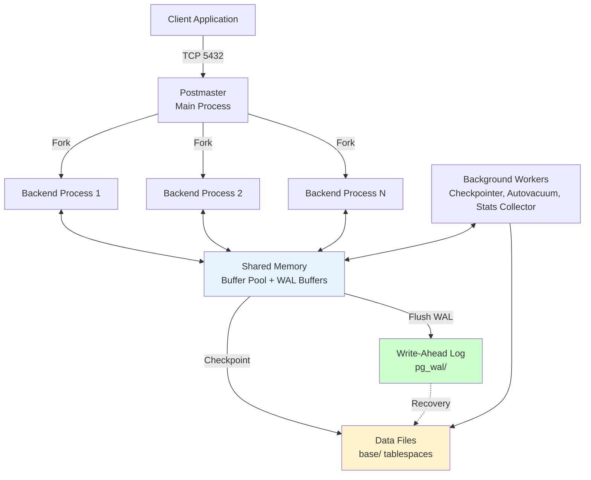
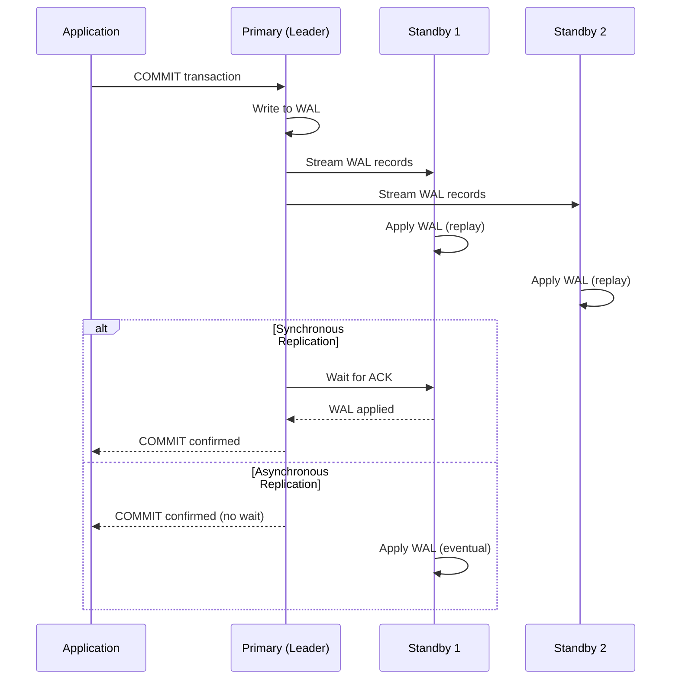
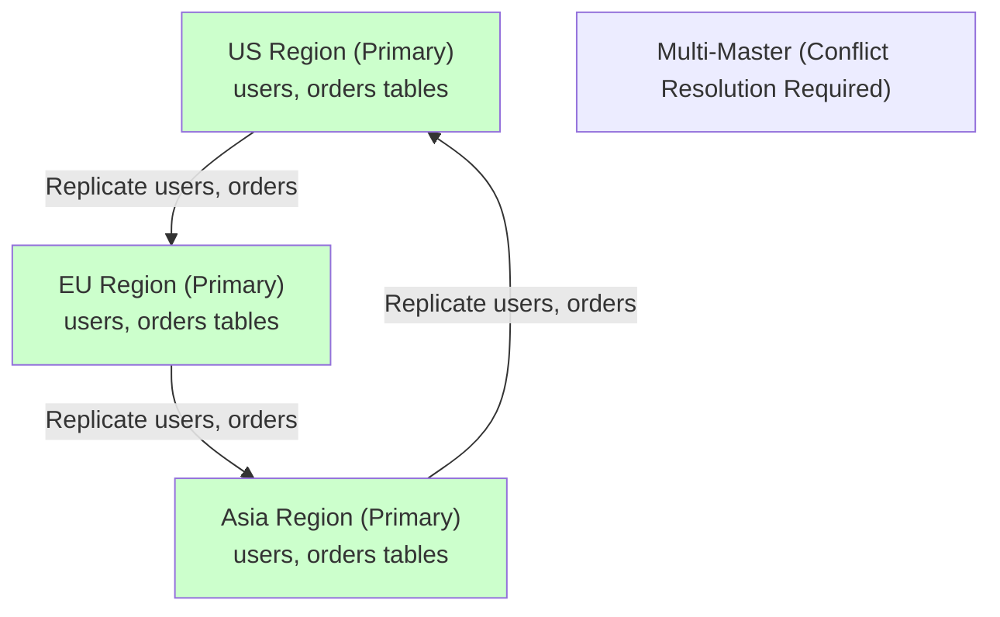
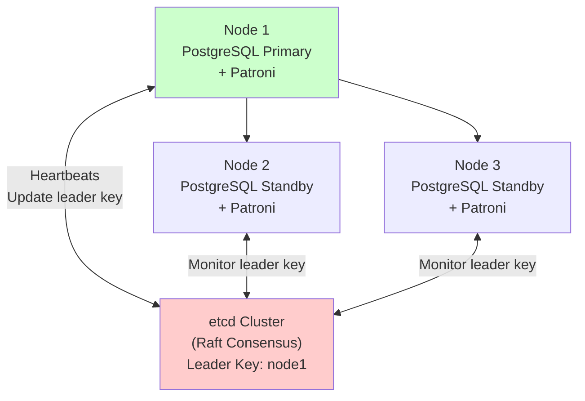
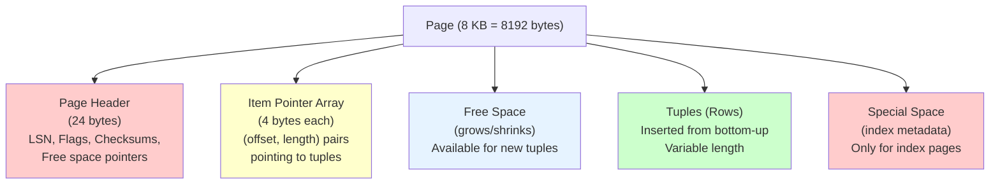
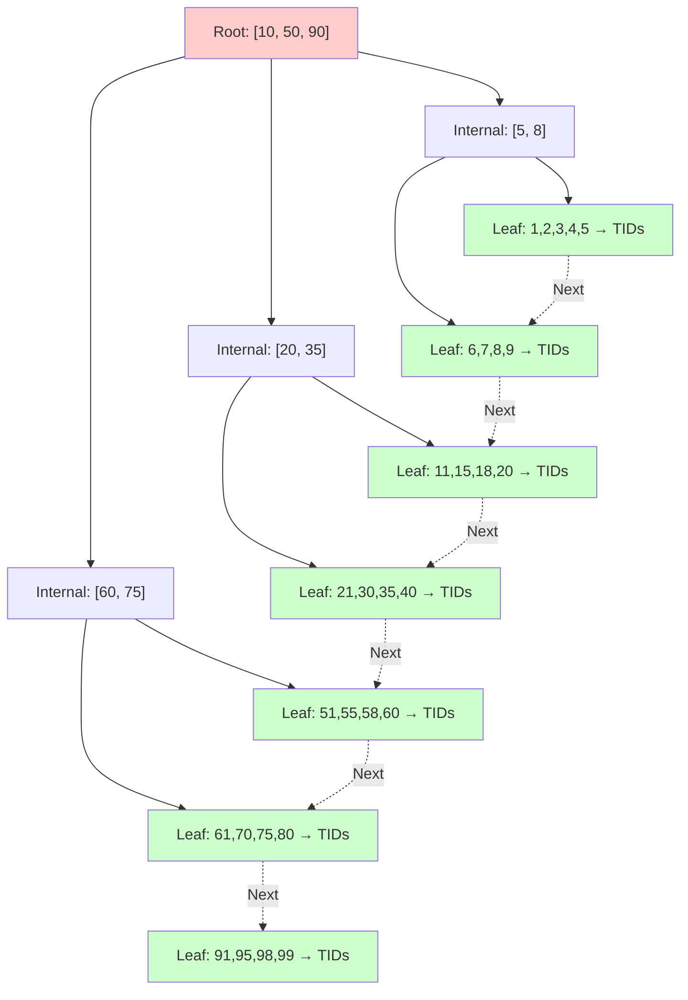
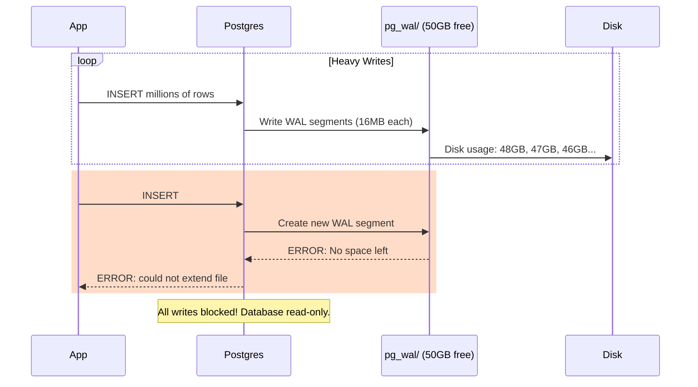
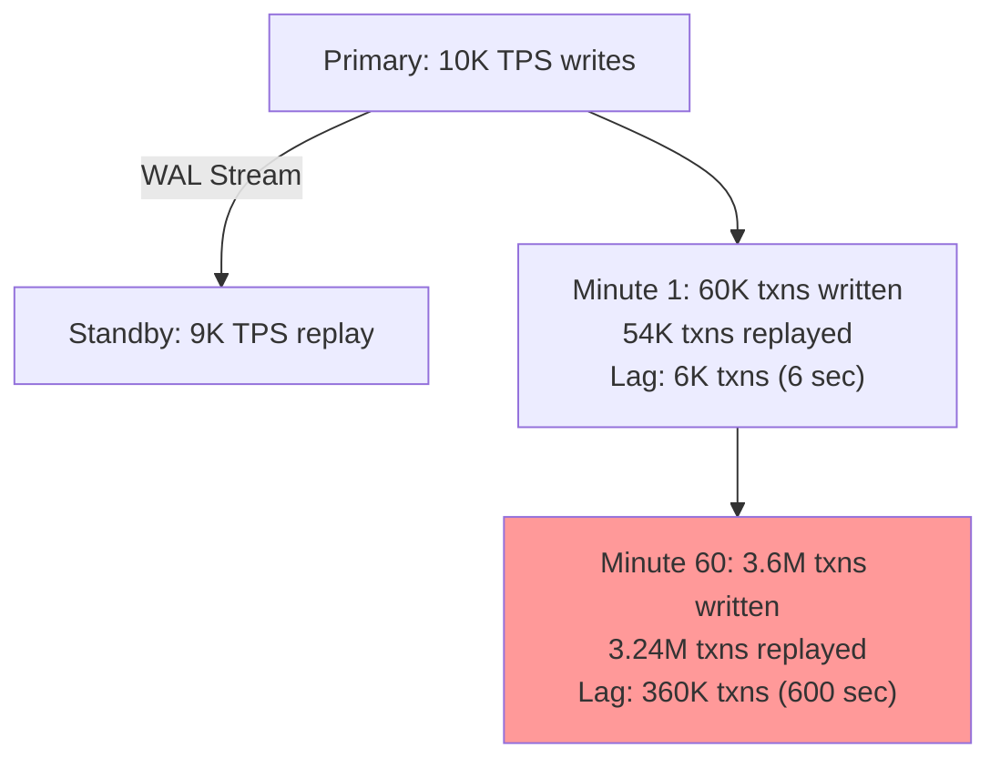

# 01. PostgreSQL: The ACID Gold Standard

## 1. Introduction

PostgreSQL is a powerful open-source relational database management system (RDBMS) that has **always** prioritized correctness over raw speed. Unlike MySQL (which historically defaulted to the non-ACID MyISAM engine), PostgreSQL was designed from day one to guarantee that your data is safe and consistent.

When transactions matter—when you're building a financial system where a failed transfer absolutely cannot leave one account debited without crediting the other—PostgreSQL is the database you reach for. It implements full ACID compliance through a combination of Write-Ahead Logging (WAL) and Multi-Version Concurrency Control (MVCC), techniques that allow high read concurrency while maintaining strict isolation guarantees.

**The Origin Story**: PostgreSQL traces its lineage back to the POSTGRES project at UC Berkeley (1986), led by Michael Stonebraker. It evolved from INGRES, one of the earliest relational database systems. The "Post" in PostgreSQL means "after INGRES"—it's the successor that added concepts like user-defined types, rules, and eventually MVCC.

**Industry Adoption**: PostgreSQL powers Instagram's photo metadata (billions of images), Spotify's user data, Reddit's posts and comments, and countless financial services. It's chosen when **data integrity is non-negotiable** and when developers need advanced SQL features like window functions, CTEs (Common Table Expressions), and full-text search without bolting on external tools.

---

## 2. Core Architecture

PostgreSQL follows a **process-per-connection architecture**. Unlike some databases that use a thread-pool model, PostgreSQL forks a new operating system process for each client connection. This design choice makes it robust (a crashing connection doesn't take down other connections) but limits the number of direct connections to a few hundred. For applications with thousands of concurrent clients, a connection pooler like pgBouncer sits between the application and PostgreSQL.



### The Data Flow

When a client connects, the **Postmaster** (the master daemon listening on port 5432) forks a **Backend Process** dedicated to that client. This backend process becomes the client's private executor: it parses SQL, plans queries, executes them, and manages the client's transaction state.

All changes go through **Shared Memory**, specifically the **Buffer Pool** (configured via `shared_buffers`, typically 4-8 GB). Before any data page is modified in the buffer pool, the change is first written to the **Write-Ahead Log (WAL)**. This is the "write-ahead" in WAL: the log entry hits disk before the data page does. This ordering guarantees that if the system crashes, PostgreSQL can replay the WAL during recovery to reconstruct any committed transactions.

Periodically (every ~5 minutes by default, controlled by `checkpoint_timeout`), the **Checkpointer** process flushes all dirty buffers to the data files. This creates a "checkpoint"—a known-good state. During crash recovery, PostgreSQL only needs to replay WAL entries from the most recent checkpoint forward, not from the beginning of time.

---

## 3. How It Works: ACID, MVCC, and Global Deployment

### A. ACID Guarantees

**Atomicity** is achieved through WAL. When you issue `BEGIN; UPDATE accounts SET balance = balance - 100 WHERE user_id = 1; UPDATE accounts SET balance = balance + 100 WHERE user_id = 2; COMMIT;`, PostgreSQL writes each change as a WAL record. If the power fails after the first UPDATE but before COMMIT, the entire transaction is rolled back during recovery—neither account is modified. The transaction is atomic: all or nothing.

**Consistency** is enforced via constraints. If you define `FOREIGN KEY(user_id) REFERENCES users(id)`, PostgreSQL will abort any INSERT that violates this relationship. Similarly, `CHECK` constraints, `NOT NULL`, and `UNIQUE` constraints guard data integrity at the schema level.

**Isolation** is where PostgreSQL shines. It uses **Multi-Version Concurrency Control (MVCC)** to allow readers and writers to operate concurrently without blocking each other. When you UPDATE a row, PostgreSQL doesn't overwrite it in place. Instead, it creates a **new version** of the row with a new transaction ID (`xmin`). The old version remains visible to any transaction that started before the UPDATE committed. This means a long-running report query sees a consistent snapshot of the database, even as other transactions are modifying data. No read locks, no write locks for readers—just snapshotting.

PostgreSQL supports four isolation levels:
- **Read Uncommitted** (actually behaves like Read Committed in PostgreSQL—there's no dirty read support)
- **Read Committed** (default): Each statement sees a fresh snapshot
- **Repeatable Read**: The entire transaction sees the same snapshot
- **Serializable**: Uses predicate locking (SSI - Serializable Snapshot Isolation) to prevent anomalies

**Durability** comes from `fsync`. When you COMMIT, PostgreSQL waits for the WAL to be flushed to disk (via `fsync()` system call) before returning success to the client. This guarantees that a committed transaction survives a crash. The tradeoff is latency: `fsync` on spinning disks can add ~10ms; on SSDs, ~1ms.

### B. MVCC Implementation Details

Every tuple (row) in PostgreSQL has hidden system columns:
- `xmin`: The transaction ID that INSERTed this row
- `xmax`: The transaction ID that DELETEd or UPDATEd this row (0 if still current)
- `ctid`: Physical location (page number, offset)

When you run `UPDATE users SET name = 'Alice' WHERE id = 1`, PostgreSQL:
1. Finds the old tuple (let's say it has `xmin=100, xmax=0`)
2. Marks it as deleted by setting `xmax=101` (your current transaction ID)
3. Inserts a new tuple with `xmin=101, xmax=0`

Now two versions of the row exist. A concurrent transaction that started before txn 101 committed sees the old version (because its snapshot doesn't include txn 101 yet). A new transaction sees the new version.

**The Vacuum Problem**: Over time, dead tuples accumulate (old versions that no transaction can see anymore). **Autovacuum** runs in the background, scanning tables to mark dead tuples as reusable. If autovacuum can't keep up with your update rate, the table "bloats"—it grows larger than necessary because it's full of dead tuples. This is the #1 operational pain point: tuning autovacuum for high-update workloads.

### C. Global-Level Deployment and Replication

**Out-of-the-Box Scaling**: PostgreSQL is fundamentally a **single-node system**. There's no built-in sharding. For writes, you're limited by one server's capacity (typically 10K-50K transactions per second depending on hardware and workload).

**Replication** is how PostgreSQL achieves read scalability and high availability:

#### Streaming Replication (Physical)

PostgreSQL ships with **streaming replication**, where a **standby** server continuously receives and applies WAL records from the **primary**. This is a block-level, byte-for-byte copy—the standby is an exact replica.



**Synchronous vs Asynchronous**:
- **Async** (default): Primary returns COMMIT immediately. Standby lags by milliseconds to seconds. Risk: if primary crashes, recent commits may be lost.
- **Sync** (`synchronous_commit = remote_apply`): Primary waits for at least one standby to acknowledge WAL receipt before confirming COMMIT. Zero data loss, but ~10-50ms latency penalty.

**Use Case**: High availability. If the primary dies, promote a standby to primary (manual or automated via tools like Patroni).

#### Logical Replication

Introduced in PostgreSQL 10, **logical replication** replicates changes at the row level (not block level). You can replicate specific tables or even specific rows (via filters).

**Global Deployment with Logical Replication**:


**Challenge**: PostgreSQL doesn't natively handle **multi-master conflicts**. If a user updates their profile in the US region and simultaneously in the EU region, both updates will replicate, and one will overwrite the other (last-write-wins). For true multi-master, you need extensions like **BDR (Bi-Directional Replication)** or move to a different database.

#### Sharding with Citus

For horizontal scale-out (sharding), the **Citus extension** turns PostgreSQL into a distributed database. Citus adds a **coordinator node** and **worker nodes**. The coordinator routes queries to the appropriate workers based on a shard key (similar to MongoDB's sharding).

#### High Availability with Patroni and Consensus

PostgreSQL itself doesn't implement a consensus algorithm. For automatic failover and leader election, you need an external HA solution like **Patroni**.

**Patroni Architecture**:


**How Patroni Works**:
1. **Leader Election**: Patroni agents on each PostgreSQL node race to acquire a **leader lock** in etcd (a distributed key-value store). The first one to acquire the lock becomes the leader and promotes its PostgreSQL instance to primary.
2. **Heartbeats**: The leader (Patroni on the primary node) continuously **renews the lease** on the leader lock (every 30 seconds, configurable via `loop_wait`).
3. **Failure Detection**: If the leader fails (process crash, network partition), it stops renewing the lease. The lease expires after `ttl` seconds (default: 30s).
4. **Automatic Failover**: When the lease expires, the remaining Patroni agents detect this. They hold a new election in etcd (via the Raft algorithm). The Patroni agent with the most up-to-date standby (based on WAL position) promotes its PostgreSQL instance to primary.
5. **Old Primary Re-joins**: When the old primary comes back online, Patroni automatically demotes it to a standby to prevent split-brain.

**etcd Consensus (Raft)**:
- **etcd** is a distributed key-value store that uses **Raft** for consensus.
- Patroni leverages etcd's **Compare-And-Swap (CAS)** operations to implement distributed locking.
- Raft ensures that all etcd nodes agree on which Patroni holds the leader lock, preventing split-brain.

**Failover Time**:
- **Detection**: ~30 seconds (`ttl`)
- **Election**: ~2-5 seconds (Patroni + etcd Raft election)
- **Promotion**: ~5-15 seconds (PostgreSQL promotion to primary)
- **Total**: ~40-50 seconds

**This is why PostgreSQL's consensus happens externally**—it delegates leader election to etcd (Raft), allowing Patroni to coordinate failover without modifying PostgreSQL itself.

---

## 4. Deep Dive: Storage Engine and Indexing

### A. On-Disk Storage Structure

PostgreSQL organizes data on disk in a specific directory structure under the **data directory** (typically `/var/lib/postgresql/data`):

```
$PGDATA/
├── base/              # Default tablespace (databases stored here)
│   ├── 12345/         # Database OID (each database is a directory)
│   │   ├── 16384      # Table file (relation OID)
│   │   ├── 16384_fsm  # Free Space Map
│   │   ├── 16384_vm   # Visibility Map
│   │   ├── 16385      # Index file
│   │   └── ...
│   └── ...
├── pg_wal/            # Write-Ahead Log segments
│   ├── 000000010000000100000042  # WAL segment (16 MB)
│   ├── 000000010000000100000043
│   └── ...
├── pg_xact/           # Transaction commit status
├── pg_multixact/      # Multi-transaction state
├── pg_tblspc/         # Tablespace symbolic links
└── global/            # Cluster-wide tables (pg_database, etc.)
```

#### Physical File Layout

Each table is stored as one or more **1 GB segment files**. If a table exceeds 1 GB, PostgreSQL creates additional segments:
- First segment: `16384`
- Second segment: `16384.1`
- Third segment: `16384.2`

This prevents filesystem limitations on maximum file size and allows parallel I/O.

#### Page Structure (8 KB)

Every table and index file is divided into **8 KB pages** (also called blocks). This is the atomic unit of I/O—PostgreSQL always reads/writes full pages.



**Page Header Fields** (24 bytes):
- `pd_lsn` (8 bytes): Log Sequence Number (last WAL record that modified this page)
- `pd_checksum` (2 bytes): CRC checksum (if `data_checksums` enabled)
- `pd_flags` (2 bytes): Status bits (all-visible, all-frozen, etc.)
- `pd_lower` (2 bytes): Byte offset to start of free space
- `pd_upper` (2 bytes): Byte offset to end of free space
- `pd_special` (2 bytes): Offset to special space (for index pages)
- `pd_pagesize_version` (2 bytes): Page size and layout version
- `pd_prune_xid` (4 bytes): Oldest unpruned transaction ID

**Item Pointers**: PostgreSQL uses **indirect addressing**. Instead of storing tuples sequentially, the page contains an array of pointers. Each pointer is 4 bytes: 2 bytes for offset within the page, 2 bytes for length. This allows:
- **Tuple Reordering**: Without changing external references (indexes point to item pointer, not tuple)
- **Dead Tuple Reclamation**: Mark the item pointer as dead without moving other tuples

**Tuple Format**:
```
Tuple:
  Header (23 bytes):
    - xmin: 4 bytes (transaction ID that created this tuple)
    - xmax: 4 bytes (transaction ID that deleted/updated this tuple, 0 if current)
    - ctid: 6 bytes (current tuple ID: block number + offset, used for MVCC chains)
    - natts: 2 bytes (number of attributes/columns)
    - infomask: 2 bytes (status bits: has nulls, has varwidth columns, etc.)
    - ...
  Null Bitmap (optional, variable):
    - 1 bit per column (1 = NULL, 0 = not NULL)
  Data:
    - Fixed-width columns stored directly
    - Variable-width columns (TEXT, VARCHAR) stored with length prefix
    - Columns aligned to 4-byte boundaries (padding added)
```

**Example**: A row with `id INT, name VARCHAR(50), age INT` stored as:
```
[Header: 23 bytes] [Null Bitmap: 1 byte] [id: 4 bytes] [name length: 1 byte] [name data: N bytes] [age: 4 bytes]
```

#### TOAST (The Oversized-Attribute Storage Technique)

When a tuple's data exceeds ~2 KB (approximately 1/4 of the 8 KB page size), PostgreSQL cannot efficiently store it inline. The page would hold only 3-4 rows, wasting space. Instead, PostgreSQL **TOASTs** large columns:

1. **Compression**: Try compressing the value (using LZ algorithm)
2. **Out-of-line Storage**: If still >2 KB, split into **2 KB chunks** and store in a separate TOAST table (`pg_toast.pg_toast_<OID>`)
3. **Pointer**: Main table stores a **TOAST pointer** (20 bytes) instead of the actual data

**TOAST Storage Strategies**:
- **PLAIN**: Never compress or move out-of-line (for small fixed-width types like INT)
- **EXTENDED** (default): Compress first, then move out-of-line if needed
- **EXTERNAL**: Don't compress, but allow out-of-line storage (for pre-compressed data like JPEG)
- **MAIN**: Prefer compression but avoid out-of-line (keep in main table if possible)

**Performance Impact**: If you `SELECT big_text FROM articles WHERE id = 1` and `big_text` is TOASTed, PostgreSQL must:
1. Read the main table page (~0.1ms on SSD)
2. Follow the TOAST pointer
3. Read N pages from the TOAST table (N × 0.1ms)

For a 10 MB column (5,000 TOAST chunks), that's an additional ~500ms just to fetch one column. This is why frequently-accessed large columns should be stored in a separate table or filtered out of queries.

#### Free Space Map (FSM)

PostgreSQL maintains a **Free Space Map** for each table (`<tableOID>_fsm`). This is a compact data structure (typically 1% of the table size) that tracks how much free space exists on each page. When inserting a new row, PostgreSQL consults the FSM to find a page with enough free space, rather than scanning every page.

Without FSM, inserts would degrade to O(N) as the table grows. With FSM, inserts are O(1) (constant time to find a page with space).

#### Visibility Map (VM)

The **Visibility Map** (`<tableOID>_vm`) is a bitmap (1 bit per page) tracking which pages contain **only tuples visible to all transactions**. If a page is "all-visible," autovacuum can skip it during scans. This dramatically speeds up vacuuming of large tables where most data is static.

When a page is modified (INSERT, UPDATE, DELETE), the corresponding bit in the VM is cleared. The next vacuum scan will re-mark it as all-visible if appropriate.

### B. Indexing Internals

#### B-Tree: The Workhorse

PostgreSQL's default index is a **B+ tree**. Internal nodes store keys and pointers to child nodes; leaf nodes store (key, tuple-id) pairs and are linked together for range scans.



A B-tree with fanout 300 (300 keys per internal node) has:
- **Height 2**: 300 × 300 = 90,000 rows
- **Height 3**: 300 × 300 × 300 = 27 million rows
- **Height 4**: 8 billion rows

For a 100 million row table, PostgreSQL needs **4 I/Os** (1 root, 2 internal, 1 leaf) to find a specific row. On SSD (~0.1ms per random read), that's ~0.4ms for the index lookup plus the heap fetch.

#### GIN: Inverted Indexes for Arrays and JSONB

**GIN (Generalized Inverted Index)** is designed for columns where each row contains multiple values (arrays, JSONB, full-text search). A GIN index on `tags JSONB` creates an inverted map:

```
"postgresql" → [row1, row5, row99, row1000, ...]
"database"   → [row2, row5, row50, ...]
```

Querying `WHERE tags @> '{"skill": "postgresql"}'` becomes a fast lookup in the GIN index: "Give me all rows that contain the key 'postgresql'."

**Trade-off**: GIN indexes are larger than B-trees (they store every distinct value times the number of rows containing it) and slower to build. They're a win when you query arrays/JSONB frequently.

#### BRIN: Block Range Indexes for Time-Series

**BRIN (Block Range Index)** stores summary information (min, max) for a range of pages. If you have a table with 1 billion rows, and it's naturally sorted by `created_at` (because rows are INSERTed in chronological order), BRIN stores:

```
Pages 0-127:   created_at MIN = 2023-01-01, MAX = 2023-01-05
Pages 128-255: created_at MIN = 2023-01-06, MAX = 2023-01-10
Pages 256-383: created_at MIN = 2023-01-11, MAX = 2023-01-15
...
```

A query `WHERE created_at > '2023-06-01'` can skip entire page ranges where MAX < 2023-06-01.

**Size Comparison**: A B-tree on `created_at` for 1 billion rows might be 10 GB. The equivalent BRIN index is ~10 MB—1000x smaller. The tradeoff? BRIN is only effective if the column is naturally sorted.

---

## 5. End-to-End Walkthrough: Life and Death of a Query

Let's trace a moderately complex query: `UPDATE users SET balance = balance + 100 WHERE user_id = 42;`

### Step 1: Connection and Parsing

The client connects to PostgreSQL (port 5432). The Postmaster forks a Backend Process for this client. The backend receives the SQL string and passes it to the **Parser**. The parser tokenizes the SQL and builds an **Abstract Syntax Tree (AST)**. At this stage, the backend doesn't yet know if `users` exists or if `user_id` is a column—it's just syntax validation.

### Step 2: Rewriting and Planning

The **Analyzer** takes the AST and resolves symbols: "Does the table `users` exist? Does it have a column `user_id`? What's the data type?" It produces a **Query Tree**.

The **Planner/Optimizer** generates multiple execution plans:
- Plan A: Sequential scan (read every row, check `user_id = 42`)
- Plan B: Index scan (if there's an index on `user_id`, use it)

The planner uses **cost estimates** based on table statistics (`pg_stats`). For a table with 10 million rows and an index on `user_id`, the index scan costs ~10 (4 I/Os: 3 for the B-tree, 1 for the heap). The sequential scan costs ~100,000 (reading all 10 million rows). The planner chooses the index scan.

### Step 3: Execution

The **Executor** fetches the old row via the index. Let's say the current tuple is `{user_id: 42, balance: 500, xmin: 100, xmax: 0}`.

The executor:
1. Computes the new balance: `500 + 100 = 600`
2. Generates a new tuple: `{user_id: 42, balance: 600, xmin: 101, xmax: 0}`
3. Marks the old tuple as dead: sets `xmax = 101`

Before modifying the buffer pool, the executor writes a **WAL record**:
```
LSN: 0x1234ABCD
Type: UPDATE
Table OID: 16384
Old Tuple: (user_id: 42, balance: 500)
New Tuple: (user_id: 42, balance: 600)
```

This WAL record is appended to the current WAL segment file (e.g., `pg_wal/000000010000000100000042`).

### Step 4: Commit

The client issues `COMMIT`. The backend:
1. Flushes the WAL buffers to disk (`fsync(pg_wal/...)`)
2. Marks the transaction as committed in the **commit log (pg_xact)**
3. Returns "COMMIT" to the client

The dirty buffer (containing the new tuple) remains in the buffer pool. The **Checkpointer** will eventually flush it to the data file (`base/16384/table_file`).

### Step 5: Crash and Recovery

If PostgreSQL crashes after the COMMIT but before the checkpoint, the data file still has the old tuple (`balance: 500`). On restart:
1. PostgreSQL reads the WAL from the last checkpoint
2. Replays the UPDATE transaction
3. Reconstructs the new tuple in memory
4. Flushes it to disk
5. The database is now in a consistent state: `balance: 600`

This is why WAL is critical. The data files can be out-of-date, but the WAL is always correct.

---

## 6. Failure Scenarios: The Senior View

### Scenario A: The Disk-Full WAL Disaster

**Symptom**: All writes fail with `ERROR: could not extend file "pg_wal/000000010000000100000042": No space left on device`.

**The Mechanism**:

PostgreSQL continuously generates WAL segments (16 MB each by default). When a segment fills up, PostgreSQL creates the next one. Normally, old segments are recycled (deleted or renamed) after they're archived or no longer needed by replication.

If your write rate is 10 GB/hour of WAL, and your disk has only 50 GB free, you have 5 hours before disaster. What triggers this?
1. **No WAL Archiving**: You've configured `archive_mode = on` but `archive_command` is failing (typo in the script, destination disk full). PostgreSQL refuses to delete old WAL segments until they're archived. WAL accumulates.
2. **Replication Lag**: A standby is 10 hours behind. `wal_keep_size` is set to keep enough WAL for the standby to catch up. If lag grows, WAL grows.
3. **Runaway Transaction**: A single transaction that does 100 million INSERTs generates gigabytes of WAL before COMMITting.



**The Fix**:

**Immediate**: Free disk space. Delete old log files (`/var/log/postgresql/*`), or temporarily disable archiving to let PostgreSQL recycle WAL. Dangerous: you may lose data if the primary crashes before a standby catches up.

**Long-term**:
1. **Monitor Disk Usage**: Alert at 80% full.
2. **Archive WAL Reliably**: Test your `archive_command`. Use `pg_receivewal` to stream WAL to a remote server.
3. **Limit `wal_keep_size`**: Don't set it to infinity. If a standby is too far behind, consider rebuilding it from a base backup.

---

### Scenario B: Autovacuum Cannot Keep Up (Table Bloat)

**Symptom**: A table that should be 1 GB is actually 10 GB on disk. Queries slow down (more pages to scan).

**The Mechanism**:

You have a `user_sessions` table with 10 million rows. Users log in and out frequently, so you're doing 100 UPDATEs per second on this table. Each UPDATE creates a new tuple version (MVCC). Autovacuum scans the table periodically to mark dead tuples as reusable.

**Autovacuum's Logic**:
- It targets tables where `dead_tuples > (total_tuples * autovacuum_vacuum_scale_factor + autovacuum_vacuum_threshold)`
- Default: `scale_factor = 0.2, threshold = 50`
- For a 10M row table: autovacuum runs when dead_tuples > 2,000,050

If you're doing 100 UPDATEs/sec, you hit 2M dead tuples in ~5.5 hours. Autovacuum kicks in and scans the table. But scanning 10M rows takes time (say, 10 minutes). During those 10 minutes, you've accumulated another 60,000 dead tuples. Autovacuum finishes, but 60K > threshold, so it immediately runs again. This is sustainable.

**The Problem**: Now your update rate spikes to 1,000 UPDATEs/sec (10x). Autovacuum can't keep up. Dead tuples accumulate faster than vacuum can reclaim them. The table bloats to 10 GB (90% dead tuples).

**The Fix**:

**Option 1**: Tune autovacuum for this table:
```sql
ALTER TABLE user_sessions SET (
  autovacuum_vacuum_scale_factor = 0.05,  -- Run more frequently
  autovacuum_vacuum_cost_delay = 2        -- Vacuum faster (less throttling)
);
```

**Option 2**: Partition the table by date. Drop old partitions instead of DELETEing rows (no dead tuples).

**Option 3**: `VACUUM FULL` (nuclear option). Rewrites the entire table to reclaim space. **Warning**: Locks the table. Only do this during maintenance windows.

---

### Scenario C: Replication Lag Spirals Out of Control

**Symptom**: Standby is 10 minutes behind primary. It was 1 minute behind an hour ago.

**The Mechanism**:

Streaming replication works by the standby continuously fetching WAL from the primary and replaying it. **Replay** is single-threaded in PostgreSQL (one process applies WAL sequentially).

If the primary is doing 10,000 transactions per second, it's generating WAL at a certain rate. The standby must replay WAL at least that fast to stay caught up. But replay is slower than initial execution because:
1. **Disk Contention**: The standby is replaying writes to random pages while also serving read queries. Reads compete with WAL replay for disk I/O.
2. **Hot Standby Feedback Delay**: If `hot_standby_feedback = on`, the standby tells the primary "don't vacuum rows I can still see" to prevent query cancellations. This slows down the primary's vacuum, which increases bloat, which slows down queries on both sides.

**The Spiral**:
1. Primary write rate: 10K TPS
2. Standby replay rate: 9K TPS (lagging by 1K TPS)
3. After 1 hour: Standby is 3,600 seconds × 1K = 3.6M transactions behind
4. WAL files pile up on the primary (or in the WAL stream buffer)
5. Replication lag grows exponentially if the gap widens



**The Fix**:

**Option 1**: Offload read queries to a different standby. Reads slow down WAL replay.

**Option 2**: Increase standby's disk I/O capacity (faster SSDs, more IOPS).

**Option 3**: **Synchronous replication** forces the primary to wait for the standby. This prevents lag but sacrifices throughput on the primary.

**Option 4**: Rebuild the standby from a fresh base backup if lag exceeds several hours.

---

## 7. Performance Tuning

**Shared Buffers**: This is PostgreSQL's buffer pool (cache). Default is 128 MB, which is criminally low for a production server. Set it to **25% of RAM** (e.g., 8 GB on a 32 GB server). Why not more? PostgreSQL relies on the OS page cache for additional caching. Going above 40% of RAM often shows diminishing returns.

**Work Memory**: Each sort or hash operation (ORDER BY, GROUP BY, hash joins) can use up to `work_mem` (default: 4 MB). If a sort exceeds this, PostgreSQL spills to disk, which is 100x slower. For a reporting query that sorts 10 million rows, 4 MB is not enough. Increase to 64 MB or higher. **Warning**: This is per operation, not per query. A complex query with 3 sorts uses 3 × `work_mem`. Set it per-session for heavy queries:
```sql
SET work_mem = '256MB';
SELECT ... ORDER BY ... GROUP BY ...;
```

**Checkpoint Tuning**: Longer checkpoints (`checkpoint_timeout = 15min`) reduce I/O spikes but increase crash recovery time. Shorter checkpoints (5 min) mean faster recovery but more frequent I/O storms. On SSDs, 10-15 minutes is reasonable.

**Random Page Cost**: On SSDs, sequential and random I/O are similar. Lower `random_page_cost` from 4.0 to **1.1** to make the planner favor index scans over sequential scans.

**Connection Pooling**: PostgreSQL forks a process per connection (~10 MB per process). At 1,000 connections, that's 10 GB of RAM just for connection overhead. Use **pgBouncer** in transaction pooling mode: the application connects to pgBouncer (10,000 connections), but pgBouncer maintains only 200 connections to PostgreSQL.

---

## 8. Constraints and Limitations

PostgreSQL is **not designed for horizontal write scalability**. A single primary can handle 10K-50K TPS (transactions per second). If you need 500K TPS, PostgreSQL (without sharding) is the wrong choice. Use Cassandra or DynamoDB.

**Row Size**: Theoretically, a row can be up to 400 GB (via TOAST). Practically, once a row exceeds 10 MB, performance degrades. TOAST chunks are fetched sequentially, and even with SSDs, fetching a 100 MB column takes tens of milliseconds.

**Connections**: PostgreSQL can handle a few hundred concurrent connections before context-switching overhead becomes prohibitive. pgBouncer is mandatory for applications with thousands of clients.

**MVCC Overhead**: UPDATE and DELETE don't free space immediately. Vacuuming is essential. High-update workloads require careful autovacuum tuning.

---

## 9. When to Use?

| Use Case | PostgreSQL | MongoDB | Cassandra | Redis | DynamoDB |
| :--- | :---: | :---: | :---: | :---: | :---: |
| **ACID Transactions** | ✅ | ⚠️ (4.0+) | ❌ | ❌ | ⚠️ |
| **Complex Queries (JOINs)** | ✅ | ❌ | ❌ | ❌ | ❌ |
| **High Write Throughput (>100K TPS)** | ❌ | ⚠️ | ✅ | ✅ | ✅ |
| **Horizontal Sharding** | ❌ (needs Citus) | ✅ | ✅ | ✅ | ✅ |
| **Geospatial** | ✅ (PostGIS) | ✅ | ❌ | ❌ | ❌ |
| **Full-Text Search** | ✅ | ✅ | ❌ | ❌ | ❌ |

Choose PostgreSQL when data integrity is paramount, when you need complex SQL (window functions, CTEs, recursive queries), or when you want a mature, open-source system with no vendor lock-in. Avoid PostgreSQL when you need massive write throughput (hundreds of thousands of TPS) or when your data model is truly schemaless and evolving daily.

---

## 10. Production Checklist

1. [ ] **Streaming Replication**: 1 primary + 2 standbys (minimum for HA)
2. [ ] **Backups**: Automate `pg_basebackup` + WAL archiving. **Test restores monthly**.
3. [ ] **Monitoring**: Enable `pg_stat_statements`. Monitor slow queries, table bloat, replication lag.
4. [ ] **Connection Pooling**: Deploy pgBouncer for >100 concurrent clients.
5. [ ] **Autovacuum**: Ensure it's enabled. Tune aggressive tables (`autovacuum_vacuum_scale_factor = 0.05`).
6. [ ] **Indexes**: Create B-tree indexes on foreign keys, WHERE/JOIN columns. Use BRIN for time-series.
7. [ ] **Partitioning**: For tables >100 GB, partition by range (`created_at`) or list.
8. [ ] **SSL/TLS**: Enforce encryption in `pg_hba.conf`: `hostssl all all 0.0.0.0/0 cert`.
9. [ ] **Resource Limits**: Set `shared_buffers = 25% RAM`, `work_mem = 64MB`, `max_connections = 200`.
10. [ ] **Upgrade Testing**: Major version upgrades (11 → 12) require `pg_upgrade`. Test in staging first.
