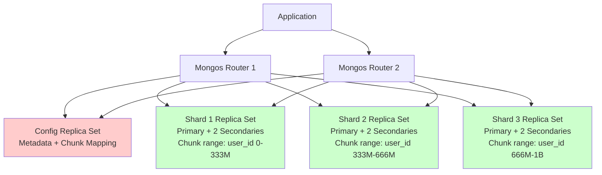
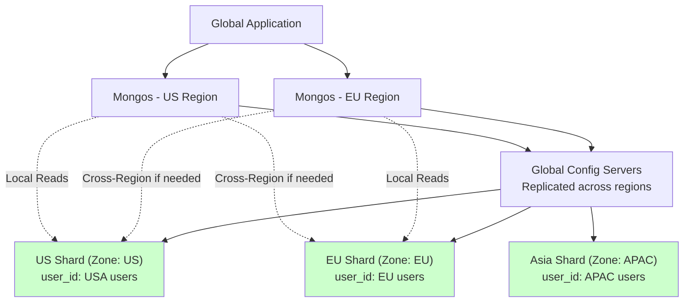
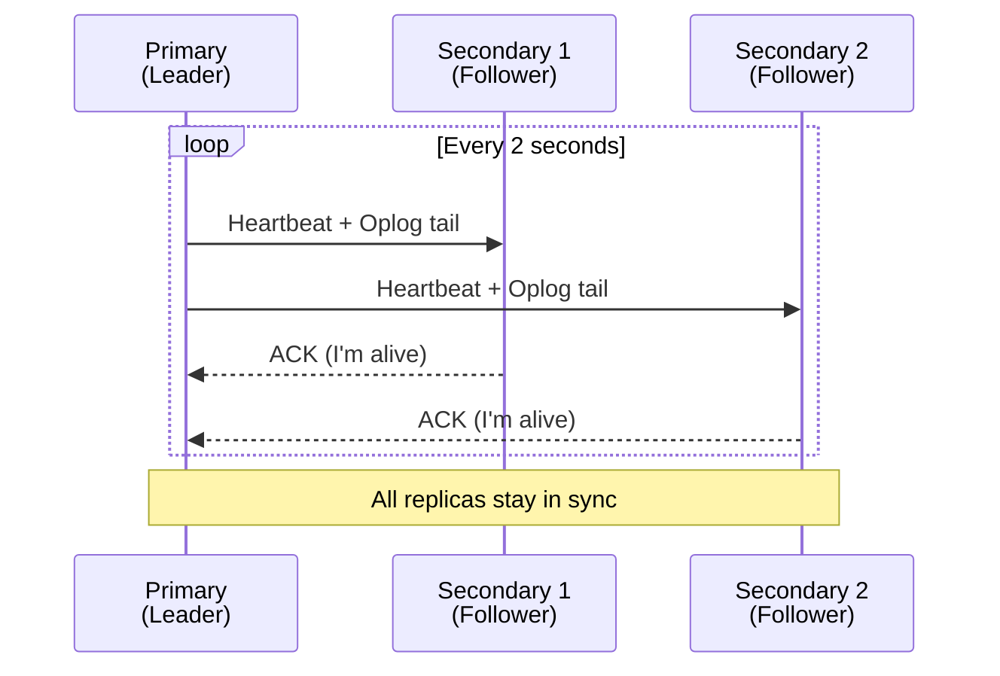
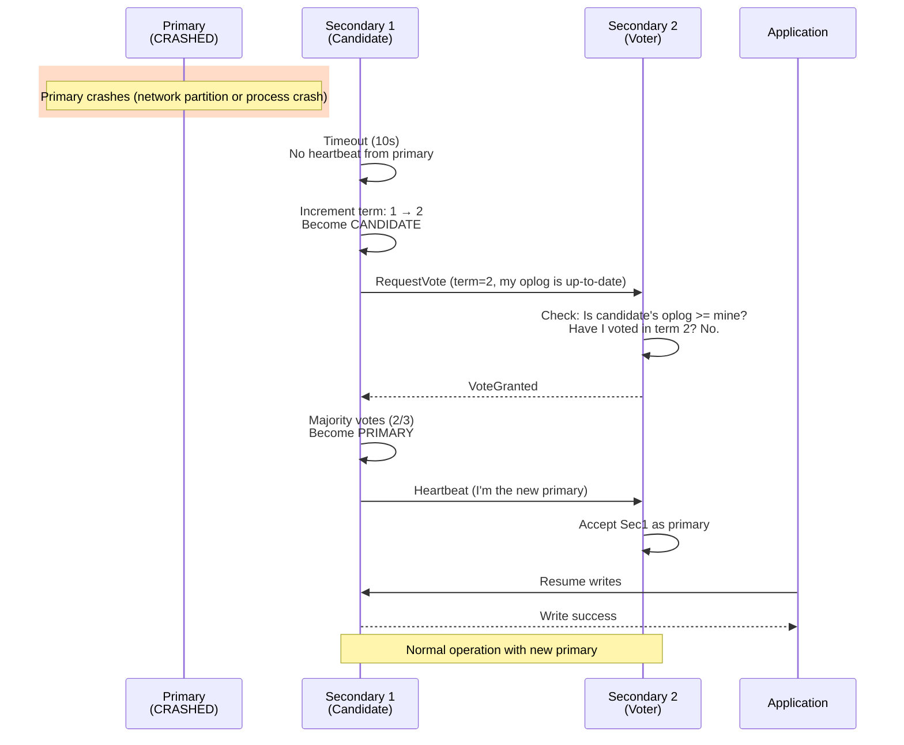
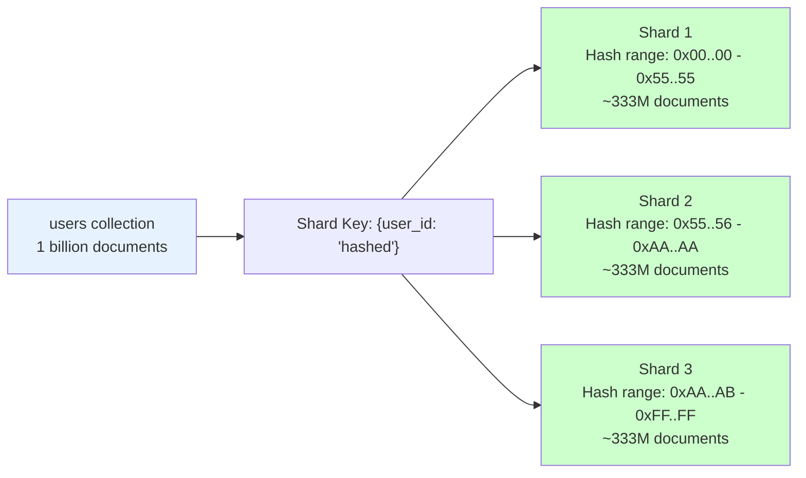
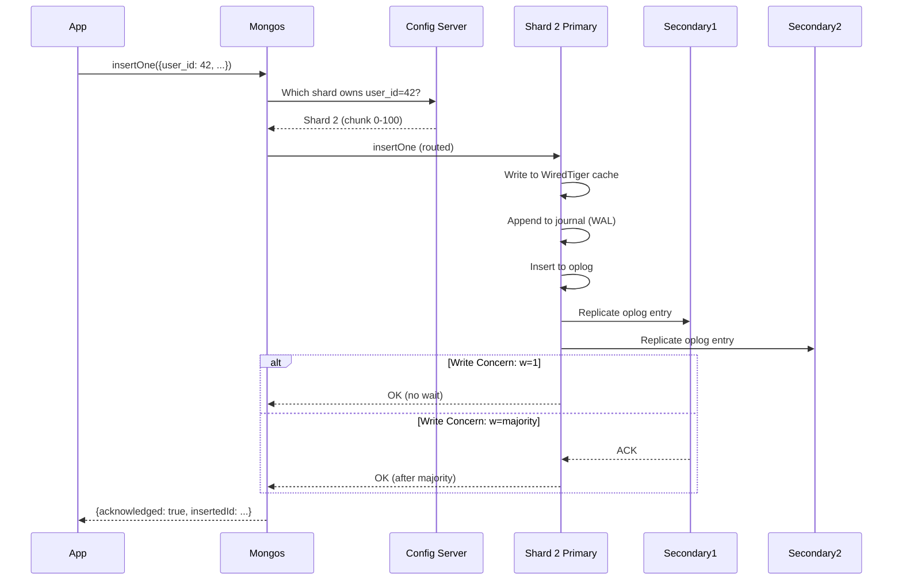
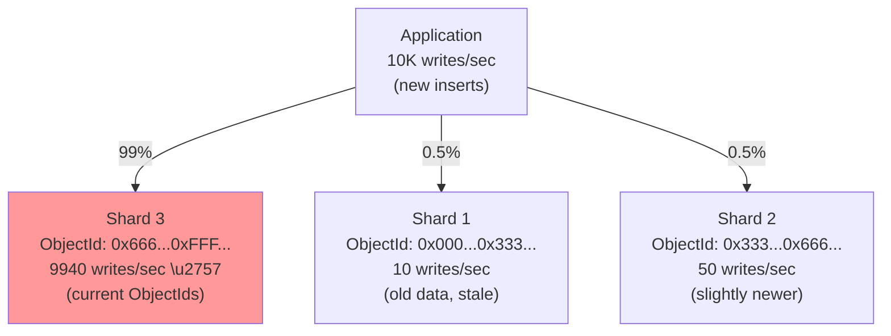

# 02. MongoDB: The Document Database That Scaled the Web

## 1. Introduction

MongoDB is a document-oriented database that stores data as flexible JSON-like documents (BSON - Binary JSON) instead of rigid rows and columns. It emerged in the late 2000s when developers were struggling with the **object-relational impedance mismatch**: the painful translation between application objects (nested, hierarchical) and relational tables (flat, normalized).

With MongoDB, you can store a user profile like this:
```json
{
  "_id": ObjectId("507f1f77bcf86cd799439011"),
  "username": "alice",
  "email": "alice@example.com",
  "profile": {
    "age": 30,
    "location": {"city": "San Francisco", "country": "USA"}
  },
  "orders": [
    {"item": "laptop", "price": 999, "date": "2024-01-15"},
    {"item": "mouse", "price": 29, "date": "2024-02-01"}
  ]
}
```

No JOINs. No foreign keys. Just a document that maps naturally to a Python dictionary or JavaScript object. This isn't just convenience—it's a fundamental shift in how you model data. Instead of normalizing into 5 tables (`users`, `profiles`, `addresses`, `orders`, `order_items`), you denormalize into one document.

**The Trade-off**: You sacrifice relational integrity. There's no `FOREIGN KEY` constraint ensuring every `order.user_id` points to a valid user. But you gain schema flexibility (add a new field without ALTER TABLE) and horizontal scalability (automatic sharding).

**Industry Adoption**: MongoDB powers eBay's product catalog (where each product has different attributes), Adobe's user profiles, Cisco's IoT sensor data, and The Weather Channel's meteorological data. It's chosen when **schema evolution** and **horizontal scale** matter more than strict ACID across documents.

**ACID Evolution**: MongoDB added multi-document ACID transactions in version 4.0 (2018), closing the gap with relational databases. Before that, atomicity was limited to single-document operations. This meant you couldn't safely transfer money between accounts (`update account A; update account B`) without risking partial failures.

---

## 2. Core Architecture

MongoDB is a distributed system from the ground up. A production MongoDB deployment typically consists of:
1. **Shards**: Replica sets that each hold a horizontal partition of the data
2. **Config Servers**: A replica set that stores cluster metadata (which shard has which data chunks)
3. **Mongos**: Query routers that sit between the application and shards



### How Data Flows

When the application issues `db.users.find({user_id: 42})`, it connects to a **Mongos** router. Mongos is stateless—it doesn't hold data. It queries the **Config Servers** to determine: "Which shard owns `user_id = 42`?" Config servers maintain a mapping of **chunks** (ranges of shard key values) to shards.

Let's say the shard key is `user_id`, and the cluster is configured to split data into 64 MB chunks. Config servers might say: "Shard 1 owns user_id 0-1,000,000; Shard 2 owns 1,000,001-2,000,000; etc." If `user_id = 42` falls in Shard 1's range, Mongos routes the query there.

**Replica Sets**: Each shard is actually a **replica set**—a group of MongoDB instances (typically 3: 1 primary, 2 secondaries). The primary handles all writes. Secondaries replicate data from the primary by tailing the **oplog** (operation log, analogous to PostgreSQL's WAL). If the primary fails, the replica set holds an **election** to choose a new primary (using a Raft-based algorithm).

### Global Deployment

MongoDB supports **global clusters** (MongoDB Atlas feature) where you can deploy shards across multiple regions (e.g., US-East, EU-West, Asia-Pacific). You configure **zone sharding**: certain data (say, European users) is pinned to EU shards, while US users are pinned to US shards.



**Consensus**: MongoDB uses a **Raft-based election protocol** within replica sets. When a primary crashes, the remaining secondaries vote to elect a new primary. This typically takes 5-15 seconds (controlled by `electionTimeoutMillis`, default 10s). During this window, writes fail. After the new primary is elected, writes resume.

### Raft-Based Consensus and Leader Election

MongoDB's replica sets use a **Raft-like consensus algorithm** to elect a primary and maintain data consistency across replicas.

#### How Raft Election Works in MongoDB

**Normal Operation (Steady State)**:
1. **Primary (Leader)**: One node is elected as primary. It handles all writes.
2. **Secondaries (Followers)**: 2+ nodes replicate data from the primary.
3. **Heartbeats**: Primary sends heartbeat messages to all secondaries every 2 seconds (default `heartbeatIntervalMillis`).
4. **Oplog Replication**: Secondaries continuously tail the primary's **oplog** (operation log) and apply operations in the same order.



**Primary Failure and Election**:
1. **Failure Detection**: If a secondary doesn't receive a heartbeat from the primary within `electionTimeoutMillis` (default 10 seconds), it assumes the primary is dead.
2. **Call Election**: The secondary increments its **term** (election epoch) and transitions to **candidate** state.
3. **Request Votes**: The candidate sends `RequestVote` messages to all other replica set members.
4. **Voting**: Each member votes for at most one candidate per term. A member votes "yes" if:
   - The candidate's oplog is at least as up-to-date as its own (candidate must have all committed operations)
   - It hasn't already voted in this term
5. **Quorum**: If the candidate receives votes from a **majority** of replica set members (including itself), it becomes the new primary.
6. **New Primary**: The new primary starts sending heartbeats, and the replica set resumes normal operation.



**Election Timeout Randomization**: To prevent split votes (multiple candidates in the same term), MongoDB randomizes `electionTimeoutMillis` across a range (e.g., 10-12 seconds). This ensures one secondary times out first and wins the election before others start campaigning.

**Priority-Based Elections**: You can configure replica set members with **priority** values (0-1000). Higher-priority members are more likely to be elected primary:
```javascript
cfg = rs.conf()
cfg.members[0].priority = 2  // Preferred primary
cfg.members[1].priority = 1  // Secondary preference
cfg.members[2].priority = 0  // Never becomes primary (passive member)
rs.reconfig(cfg)
```

**Arbiter Nodes**: For cost savings, you can add an **arbiter** (a lightweight node that votes but doesn't store data):
```javascript
rs.addArb("arbiter-hostname:27017")
```
This allows a 2-data-node + 1-arbiter setup (3-member quorum for elections) instead of 3 full data nodes.

---

## 3. How It Works: ACID, Sharding, and WiredTiger

### A. ACID in MongoDB (4.0+)

Before MongoDB 4.0, atomicity was limited to single-document operations. A single `insertOne`, `updateOne`, or `deleteOne` was atomic. But if you needed to update two documents atomically (e.g., transferring money between accounts), you were out of luck.

MongoDB 4.0 introduced **multi-document transactions** with full ACID guarantees. You start a session, begin a transaction, perform multiple operations, and commit:

```javascript
const session = client.startSession();
session.startTransaction();
try {
  db.accounts.updateOne(
    {user: "alice"},
    {$inc: {balance: -100}},
    {session}
  );
  db.accounts.updateOne(
    {user: "bob"},
    {$inc: {balance: +100}},
    {session}
  );
  session.commitTransaction();
} catch (error) {
  session.abortTransaction();
  throw error;
}
```

**The Mechanism**: MongoDB uses **WiredTiger's MVCC** (Multi-Version Concurrency Control) to provide snapshot isolation. When a transaction starts, it gets a snapshot of the database at that point in time. Other transactions' changes (that commit after the snapshot) are invisible to it. If two transactions try to modify the same document, the second one blocks until the first commits or aborts.

**Performance Cost**: Transactions have overhead (~20-30% latency increase). MongoDB's sweet spot is still single-document operations, which are lock-free and extremely fast. Use transactions only when cross-document atomicity is critical.

### B. Sharding: Horizontal Partitioning

Sharding is how MongoDB scales horizontally. You choose a **shard key** (e.g., `user_id`), and MongoDB partitions the collection based on this key.

**Range-Based Sharding**: The shard key space is divided into ranges (chunks). For example:
- Chunk 1: `user_id` 0 - 1,000,000 → Shard 1
- Chunk 2: `user_id` 1,000,001 - 2,000,000 → Shard 2
- Chunk 3: `user_id` 2,000,001 - 3,000,000 → Shard 3

**The Problem**: If you're inserting users sequentially (`user_id = 1, 2, 3, ...`), all writes go to the chunk containing the highest IDs (currently Chunk 3). This is a **hot shard**—one shard does all the work while others idle.

**Hashed Sharding**: MongoDB can hash the shard key. Now `user_id = 1` might hash to 0xABCDEF (Shard 2), `user_id = 2` might hash to 0x123456 (Shard 1). Writes are evenly distributed.



**The Trade-off**: Hashed sharding distributes writes evenly but makes range queries inefficient. `find({user_id: {$gte: 100, $lte: 200}})` must query all shards (scatter-gather) because hashed keys are randomized.

**Chunk Migration**: MongoDB's **balancer** runs in the background. If Shard 1 has 100 chunks and Shard 2 has 50, the balancer migrates chunks from Shard 1 to Shard 2 to even things out. Migration happens live (no downtime) but consumes network and disk I/O.

### C. WiredTiger Storage Engine

MongoDB 3.2+ uses **WiredTiger** as the default storage engine. WiredTiger implements:
- **Document-level locking**: Fine-grained (unlike older MMAPv1, which had database-level locks)
- **MVCC**: Multiple versions of documents for snapshot reads
- **Compression**: Snappy (default), zlib, or zstd compress documents on disk (70-80% space savings)
- **Checkpoints**: Flush dirty pages every 60 seconds

**Write Path**:
1. Client sends `insertOne({user: "alice", age: 30})`
2. Primary writes to **WiredTiger cache** (in-memory)
3. Primary appends to **journal** (write-ahead log, similar to PostgreSQL's WAL)
4. Primary replicates the operation to secondaries via the **oplog** (operation log)
5. If write concern is `{w: majority}`, primary waits for acknowledgment from a majority of replicas before returning success to the client

**Oplog**: This is a capped collection (fixed-size, FIFO) that logs every write operation. Secondaries tail the oplog, applying operations in the same order as the primary. If a secondary falls behind and the oplog "wraps around" (old entries are overwritten), the secondary can't catch up and must be rebuilt from a fresh snapshot.

### D. On-Disk Storage Structure

MongoDB organizes data on disk in a directory structure under the **data directory** (typically `/var/lib/mongodb`):

```
/var/lib/mongodb/
├── journal/              # WiredTiger journal (WAL)
│   ├── WiredTigerLog.0000000001  # Journal file (100 MB each)
│   ├── WiredTigerLog.0000000002
│   └── ...
├── collection-0--<hash>.wt   # Collection data file
├── collection-2--<hash>.wt   # Another collection
├── index-1--<hash>.wt        # Index data file
├── index-3--<hash>.wt        # Another index
├── WiredTiger                # WiredTiger metadata
├── WiredTiger.turtle         # Checkpoint metadata
├── WiredTiger.wt             # System catalog
├── _mdb_catalog.wt           # MongoDB catalog
└── mongod.lock               # Lock file (process ID)
```

#### WiredTiger Data Files

Each collection and index is stored in a separate **WiredTiger file** (`.wt` extension). These files use a **B-tree structure** internally.

**File Organization**:
- **Collection files**: `collection-<N>--<hash>.wt` stores BSON documents
- **Index files**: `index-<N>--<hash>.wt` stores index B-trees
- **System files**: `WiredTiger.wt` contains internal catalog

#### BSON (Binary JSON) Format

MongoDB doesn't store JSON text on disk—it uses **BSON (Binary JSON)**, a binary encoding that's faster to parse and supports additional types (Date, ObjectId, Binary).

**BSON Document Structure**:
```
Document (on disk):
  Total Size: 4 bytes (int32) - includes the size field itself
  Elements:
    Type: 1 byte (e.g., 0x02 = string, 0x10 = int32, 0x03 = embedded document)
    Field Name: null-terminated string
    Value: type-specific encoding
  End Marker: 1 byte (0x00)
```

**Example**: `{name: "Alice", age: 30}`
```
[Size: 4 bytes = 27]
[0x02 (string)] [name\0] [Length: 4 bytes = 6] [Alice\0]
[0x10 (int32)] [age\0] [Value: 4 bytes = 30]
[0x00 (end)]
```

**BSON vs JSON**:
- JSON `{age: 30}`: 10 bytes as text
- BSON `{age: 30}`: ~15 bytes but includes type information and is directly memory-mapped (no parsing)

**ObjectId Structure** (12 bytes):
```
[Timestamp: 4 bytes] [Machine ID: 3 bytes] [Process ID: 2 bytes] [Counter: 3 bytes]
```

Example: `ObjectId("507f1f77bcf86cd799439011")`
- `507f1f77`: Unix timestamp (2012-10-17 20:46:31)
- `bcf86c`: Machine identifier
- `d799`: Process ID
- `439011`: Auto-incrementing counter

This makes ObjectIds naturally **sorted by creation time**, which is useful for range queries but problematic for sharding (creates hot spots).

#### WiredTiger Page Structure

WiredTiger stores data in **pages** internally (similar to PostgreSQL, but variable-sized, typically 32 KB for collections, 4 KB for indexes).

**Page Types**:
1. **Internal Pages**: Store keys and pointers to child pages (B-tree internals)
2. **Leaf Pages**: Store actual BSON documents (for collections) or index entries (for indexes)

**Split and Merge**: When a page grows beyond `internal_page_max` (4 MB default), WiredTiger splits it. When two pages shrink significantly, they merge.

#### Compression

WiredTiger compresses pages before writing to disk. Compression happens at the **block level**:

**Compression Algorithms**:
- **Snappy** (default): Fast, moderate compression (~2:1 ratio, ~200 MB/s compression speed)
- **Zlib**: Slower, better compression (~3:1 ratio, ~50 MB/s)
- **Zstd**: Best balance (2.5:1 ratio, ~400 MB/s)

**In-Memory vs On-Disk**:
- **Cache**: Uncompressed pages (for fast access)
- **Disk**: Compressed pages

When MongoDB reads a page from disk, it:
1. Reads the compressed block
2. Decompresses it
3. Stores the uncompressed page in the WiredTiger cache

This is why MongoDB needs significant RAM—the cache holds uncompressed data.

#### Journal Files (Write-Ahead Log)

WiredTiger's **journal** (stored in `journal/` directory) is a write-ahead log ensuring durability.

**Journal Mechanics**:
1. Client writes a document
2. WiredTiger appends the change to the **in-memory journal buffer**
3. Every 100ms (configurable via `commitIntervalMs`), the buffer is **flushed** to a journal file on disk
4. The change is also written to the in-memory cache (but not yet to the data file)
5. Periodically (~60 seconds, checkpoint interval), WiredTiger flushes the cache to data files and creates a **checkpoint**

**Journal Files Rotation**:
- Each journal file is ~100 MB
- Old journal files are deleted after a checkpoint (they're no longer needed for recovery)
- If MongoDB crashes, it replays journal files since the last checkpoint

**Durability Levels**:
- `j: true` (write concern): Wait for journal flush before acknowledging write (~10-50ms latency)
- `j: false` (default): Acknowledge immediately (risk: up to 100ms of writes lost on crash)

#### Checkpoints

A **checkpoint** is a consistent snapshot of the database written to disk. WiredTiger creates checkpoints every 60 seconds or when 2 GB of journal has been written (whichever comes first).

**Checkpoint Process**:
1. WiredTiger stops the world (briefly)
2. Flushes all dirty pages from cache to data files
3. Writes checkpoint metadata to `WiredTiger.turtle`
4. Deletes old journal files (no longer needed)

If MongoDB crashes between checkpoints, it:
1. Restarts
2. Reads the last checkpoint from `WiredTiger.turtle`
3. Replays journal files from that checkpoint forward
4. Database is now in a consistent state

**Crash Recovery Time**: Depends on how much journal needs to be replayed. Typical: 5-30 seconds for a 60-second checkpoint window.

#### Storage Space Usage

**Example**: A 100 GB collection (uncompressed BSON):
- **WiredTiger File on Disk**: ~30 GB (with Snappy compression, ~70% reduction)
- **WiredTiger Cache**: 60 GB (60% of 100 GB system RAM)
- **Journal**: ~2 GB (temporary, until next checkpoint)
- **Index Files**: ~20 GB (B-trees for indexes, compressed separately)

**Total Disk**: ~52 GB (30 GB data + 20 GB indexes + 2 GB journal)
**Total RAM**: 60 GB (cache)

This is why MongoDB is **memory-hungry**: it caches uncompressed data for fast access.

---

## 4. Deep Dive: Indexing and Query Execution

### A. B-Tree Indexes

MongoDB uses **B-trees** (same as PostgreSQL) for indexes. When you create an index on `email`:
```javascript
db.users.createIndex({email: 1})  // 1 = ascending
```

MongoDB builds a B-tree mapping email values to document `_id`s. A query `db.users.find({email: "alice@example.com"})` does:
1. Traverse the B-tree to find the entry for "alice@example.com"
2. Retrieve the associated `_id`
3. Fetch the full document from the collection using the `_id`

**Covered Queries**: If your query only needs fields present in the index, MongoDB can return results directly from the index without fetching documents. This is much faster.
```javascript
db.users.createIndex({email: 1, name: 1})
db.users.find({email: "alice@example.com"}, {_id: 0, name: 1})
// Uses index-only scan (no document fetch)
```

### B. Compound Indexes and ESR Rule

MongoDB's query planner uses the **ESR (Equality, Sort, Range)** rule for compound indexes. When creating a compound index, order fields as:
1. **Equality** fields (exact matches): `{status: "active"}`
2. **Sort** fields: `ORDER BY created_at`
3. **Range** fields: `created_at > '2024-01-01'`

Example:
```javascript
// Query: status = 'active', created_at > '2024-01-01', ORDER BY created_at
db.orders.createIndex({status: 1, created_at: -1})
// Correct: Equality (status) comes first, then Sort/Range (created_at)
```

If you reverse it (`{created_at: -1, status: 1}`), MongoDB might not use the index efficiently.

### C. Text Indexes and Geospatial Indexes

**Full-Text Search**:
```javascript
db.articles.createIndex({title: "text", body: "text"})
db.articles.find({$text: {$search: "mongodb sharding"}})
```

MongoDB's text indexes tokenize strings, remove stop words, and stem words (e.g., "running" → "run"). This is suitable for basic search. For advanced search (faceting, relevance scoring), use Elasticsearch.

**Geospatial**:
```javascript
db.places.createIndex({location: "2dsphere"})
db.places.find({
  location: {
    $near: {
      $geometry: {type: "Point", coordinates: [-73.9, 40.7]},
      $maxDistance: 5000  // meters
    }
  }
})
```

MongoDB can query "find all documents within 5 km of this point" using a **2dsphere** index (supports GeoJSON).

---

## 5. End-to-End Walkthrough: Life of a Sharded Write

Let's trace:  
`db.orders.insertOne({user_id: 42, item: "laptop", price: 999})`

### Step 1: Application to Mongos

The application connects to a **Mongos** router (stateless, can run multiple for load balancing). The driver sends the `insertOne` command.

### Step 2: Mongos Queries Config Servers

Mongos doesn't know which shard owns `user_id = 42`. It queries the **config servers**: "Which shard holds the chunk for `user_id = 42`?"

Config servers respond: "Shard 2 owns chunk range `user_id: 0-100`."

### Step 3: Mongos Routes to Shard 2 Primary

Mongos connects to **Shard 2's primary** and forwards the `insertOne` command.

### Step 4: Primary Writes to WiredTiger

The primary:
1. Acquires a **document-level lock** (WiredTiger)
2. Writes the document to the **WiredTiger cache** (in-memory)
3. Appends a journal entry (WAL) to disk (for crash recovery)
4. Inserts the operation into the **oplog**: `{op: "i", ns: "mydb.orders", o: {user_id: 42, item: "laptop", price: 999}}`

### Step 5: Replication

Shard 2 has 2 secondaries. The primary sends the oplog entry to them. Secondaries apply the operation.

**Write Concern `{w: 1}`** (default): Primary returns immediately (fast, but risky—if primary crashes before secondaries replicate, data may be lost).

**Write Concern `{w: "majority"}`**: Primary waits for acknowledgment from a majority of replicas (2 out of 3) before returning success to Mongos.

### Step 6: Mongos Returns to Application

Mongos forwards the result:  
`{acknowledged: true, insertedId: ObjectId("...")}`

The application now knows the write succeeded.



---

## 6. Failure Scenarios: The Senior View

### Scenario A: The Hot Shard (Poor Shard Key)

**Symptom**: One shard handles 90% of writes. Other shards idle. Performance degrades as the hot shard becomes a bottleneck.

**The Mechanism**:

You've chosen `_id` as the shard key. MongoDB auto-generates `_id` as an **ObjectId**, which is a 12-byte value containing a timestamp prefix. ObjectIds are monotonically increasing: all newly inserted documents have `_id` values clustered together.

MongoDB creates chunks based on `_id` ranges. Initially:
- Chunk 1: `_id: 0x000...` - `0x333...` → Shard 1
- Chunk 2: `_id: 0x333...` - `0x666...` → Shard 2
- Chunk 3: `_id: 0x666...` - `0xFFF...` → Shard 3

All new inserts have `_id` starting with the current timestamp (e.g., `0x666...`), so they all land in Chunk 3 (Shard 3). Shard 3 does 10,000 writes/sec; Shards 1 and 2 do 10 writes/sec.



**The Fix**:

**Option 1: Use Hashed Shard Key**
```javascript
sh.shardCollection("mydb.orders", {_id: "hashed"})
```
MongoDB hashes `_id`, distributing writes evenly. Trade-off: range queries on `_id` become scatter-gather (inefficient).

**Option 2: Use Compound Shard Key**
```javascript
sh.shardCollection("mydb.orders", {country: 1, user_id: 1})
```
Distributes by `country` first (assuming countries are evenly distributed).

**Option 3: Avoid Monotonic Keys**
Don't use `timestamp` or `auto-incrementing integers` as shard keys. They all go to the newest chunk.

---

### Scenario B: Orphaned Documents After Failed Migration

**Symptom**: A query returns duplicate results or documents that shouldn't exist on a particular shard.

**The Mechanism**:

MongoDB's balancer migrates chunks between shards. The migration process:
1. **Copy Phase**: Shard A copies a chunk to Shard B
2. **Sync Phase**: Shard A continues replicating new writes to Shard B during the copy
3. **Commit Phase**: Config servers update metadata: "Chunk now owned by Shard B"
4. **Cleanup**: Shard A deletes the chunk

If the migration **fails** during step 4 (network partition, Shard A crashes), Shard A still has the chunk data (now "orphaned") even though config servers say Shard B owns it.

**The Fix**:

Run the cleanup command:
```javascript
db.adminCommand({cleanupOrphaned: "mydb.orders", startingFromKey: {user_id: MinKey}})
```

MongoDB scans Shard A and deletes documents that don't belong there according to config servers.

**Prevention**: Monitor `sh.status()` for incomplete migrations. Ensure stable network between shards.

---

### Scenario C: Replica Set Election Storm

**Symptom**: Frequent primary elections (~every 30 seconds). High latency. Writes fail intermittently with "not master" errors.

**The Mechanism**:

A replica set has 3 nodes: Primary in US-East, Secondary 1 in US-West, Secondary 2 in EU-West. Network latency between US-East and EU-West is 150ms.

MongoDB's election protocol:
1. Secondaries send **heartbeats** to the primary every 2 seconds (default)
2. If a secondary doesn't receive a heartbeat response within `electionTimeoutMillis` (default 10 seconds), it assumes the primary is dead and calls an election

**The Problem**: A temporary network glitch between US-East and EU-West causes heartbeats to be lost for 11 seconds. EU-West thinks the primary is dead, calls an election, becomes the new primary. 5 seconds later, the network recovers. The old primary (US-East) sees "I'm not primary anymore," steps down. Now EU-West is primary.

But EU-West is far from US-East (150ms latency). Clients in the US experience high write latency. After 30 seconds, another network glitch, and US-East becomes primary again. This cycle repeats.

**The Fix**:

**Option 1**: Increase `electionTimeoutMillis` to 30 seconds:
```javascript
cfg = rs.conf()
cfg.settings.electionTimeoutMillis = 30000
rs.reconfig(cfg)
```
This reduces false positives (network glitches shorter than 30s won't trigger elections).

**Option 2**: Deploy all replica set members in the **same region** (low latency).

**Option 3**: Use **priority** settings to prefer a specific member as primary:
```javascript
cfg = rs.conf()
cfg.members[0].priority = 2  // US-East (preferred primary)
cfg.members[1].priority = 1  // US-West
cfg.members[2].priority = 0.5  // EU-West (only becomes primary if others are down)
rs.reconfig(cfg)
```

---

## 7. Performance Tuning

**WiredTiger Cache**: Set to **60-70% of RAM** (e.g., 40 GB on a 64 GB server). MongoDB's storage engine relies heavily on this cache. Monitor `db.serverStatus().wiredTiger.cache` to see cache hit rate. If hit rate < 95%, increase cache size.

**Journal Commit Interval**: Default is 100ms. MongoDB batches writes and commits the journal every 100ms. Lowering this (e.g., 50ms) increases durability (less data loss on crash) but reduces throughput. Increasing it (200ms) improves throughput but risks losing 200ms of writes on crash.

**Read Concern `majority`**: Ensures you read data that's been replicated to a majority of replicas. Adds ~10-20ms latency compared to `local` (default). Use for critical reads where consistency matters.

**Write Concern `w:majority`**: Waits for a majority of replicas to acknowledge the write. Adds ~20-50ms latency depending on network. Critical for preventing data loss.

**Connection Pooling**: MongoDB drivers maintain a pool of connections (default: 100 per driver instance). If you have 10 application servers, that's 1,000 connections total. Monitor `db.serverStatus().connections.current`. If approaching `maxIncomingConnections` (default: 65536), increase the limit or reduce connection pool size.

**Index Builds**: By default, index creation blocks writes. Use `{background: true}` for non-blocking builds:
```javascript
db.users.createIndex({email: 1}, {background: true})
```
Trade-off: Background builds are 2-10x slower but don't block operations.

---

## 8. Constraints and Limitations

**Document Size**: Maximum 16 MB. This is rarely a problem for typical documents, but if you're storing large binary data (images, videos), use **GridFS**, which splits files into 255 KB chunks and stores them across multiple documents.

**Nested Depth**: Documents can nest up to 100 levels deep. Beyond this, you'll get an error. This prevents infinitely recursive documents.

**Indexes per Collection**: Maximum 64 indexes. Each index adds overhead on writes (every insert/update must update all relevant indexes). Typical collections have 5-10 indexes.

**Shard Key Immutability**: Once you've sharded a collection, you cannot change the shard key. Choose carefully! If you pick the wrong key, your only option is to dump the entire collection, re-shard with a new key, and reload.

**Transactions Performance**: Multi-document transactions have ~30% overhead compared to single-document operations. MongoDB is optimized for single-document atomicity. Use transactions sparingly.

---

## 9. When to Use?

| Use Case | MongoDB | PostgreSQL | Cassandra | Redis | DynamoDB |
| :--- | :---: | :---: | :---: | :---: | :---: |
| **Rapid Prototyping** | ✅ | ⚠️ | ❌ | ❌ | ⚠️ |
| **Schema Evolution** | ✅ | ❌ | ⚠️ | ✅ | ✅ |
| **Horizontal Scaling** | ✅ | ❌ | ✅ | ✅ | ✅ |
| **ACID Transactions** | ⚠️ (4.0+, with cost) | ✅ | ❌ | ❌ | ⚠️ |
| **Complex Queries (JOINs)** | ⚠️ ($lookup, slow) | ✅ | ❌ | ❌ | ❌ |
| **Geospatial** | ✅ | ✅ (PostGIS) | ❌ | ❌ | ❌ |

Choose MongoDB when your schema is evolving rapidly (e.g., product catalog with varying attributes per product), when you need horizontal scalability (auto-sharding), or when your data is naturally document-shaped (hierarchical, nested). Avoid MongoDB when you need complex multi-table JOINs, strict relational integrity, or when your workload is dominated by transactions across many documents.

---

## 10. Production Checklist

1. [ ] **Replica Sets**: Deploy 3-node replica sets (1 primary + 2 secondaries minimum) for every shard
2. [ ] **Backups**: Automate `mongodump` or use continuous backup (Ops Manager, MongoDB Atlas)
3. [ ] **Monitoring**: Enable profiling (`db.setProfilingLevel(1, {slowms: 100})`), monitor slow queries
4. [ ] **Sharding**: Choose shard key carefully (avoid monotonic keys like `_id` or `timestamp`); use hashed sharding for even distribution
5. [ ] **Write Concern**: Use `{w: "majority"}` for critical data to prevent data loss during failovers
6. [ ] **Read Concern**: Use `{readConcern: "majority"}` for read-your-writes consistency
7. [ ] **Indexes**: Create indexes on query patterns, monitor index usage with `$indexStats`
8. [ ] **Compression**: Enable WiredTiger compression (snappy/zlib/zstd) to save 70-80% disk space
9. [ ] **Connection Pooling**: Configure driver connection pool size (100-500 connections per instance)
10. [ ] **Security**: Enable authentication, use TLS for network encryption, enable encryption at rest
