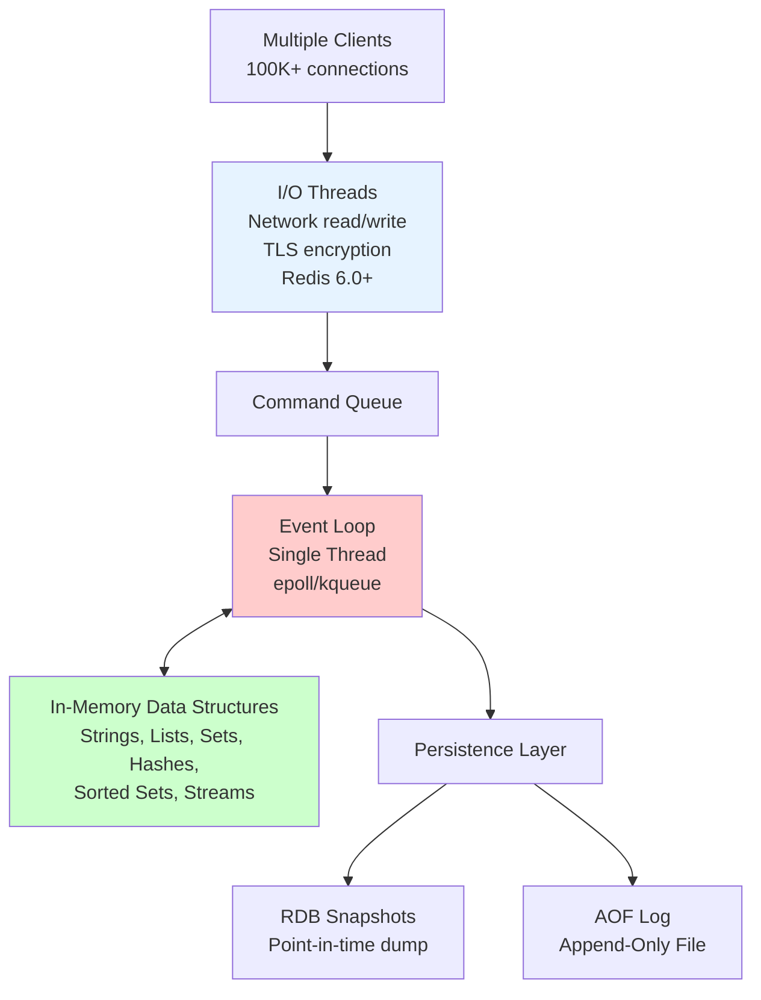
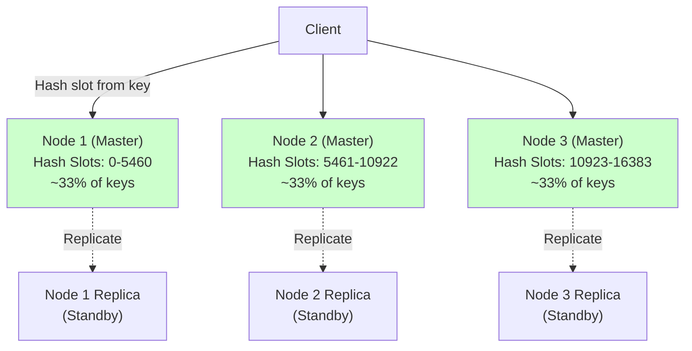
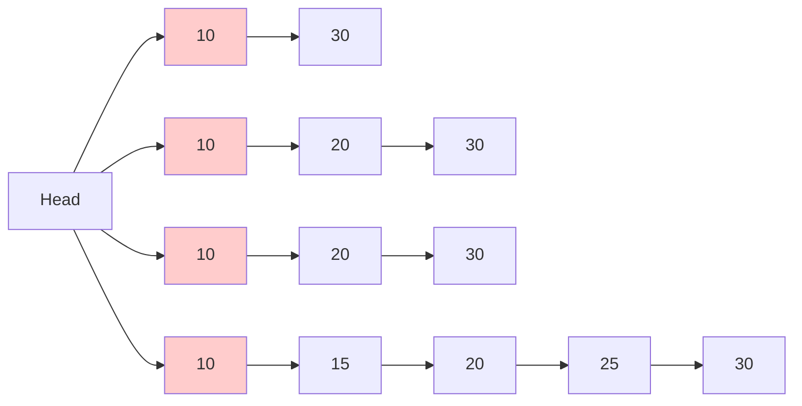
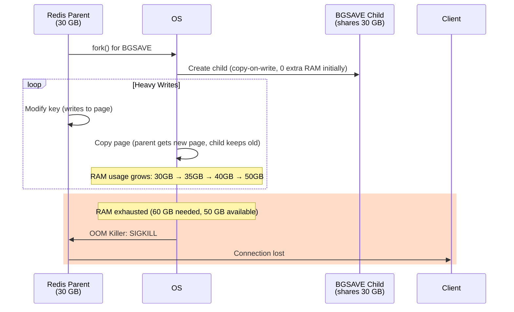

# 03. Redis: The In-Memory Data Structure Store

## 1. Introduction

Redis (Remote Dictionary Server) is an **in-memory data structure store** that operates at a fundamentally different level than traditional databases. While PostgreSQL and MongoDB store data on disk and cache hot data in memory, Redis flips this model: **everything lives in RAM**. Disk is only for persistence (optional snapshots and append-only logs).

This architectural choice makes Redis extraordinarily fast—typical operations complete in **microseconds** (0.1-1ms including network round-trip), not the milliseconds or tens of milliseconds you see with disk-based databases. When you need to serve 100,000 requests per second from a single node, or when sub-millisecond latency is non-negotiable (real-time leaderboards, session storage, rate limiting), Redis is the go-to solution.

**What Makes Redis Different**: Redis isn't just a key-value store. It's a **data structure server**. You can store not just strings, but lists, sets, sorted sets, hashes, bitmaps, hyperloglogs, and streams. This means you can execute complex operations—like incrementing a counter, adding to a sorted set, or popping from a list—**atomically on the server** without fetching data to the client, modifying it, and writing it back.

**Industry Adoption**: Redis powers Twitter's timeline (millions of reads/sec), GitHub's job queues (Resque), Instagram's activity feeds, and Stack Overflow's caching layer. It's chosen when **speed** is the primary requirement and when the working dataset fits comfortably in RAM (typically up to hundreds of gigabytes per node).

**The Trade-off**: RAM is expensive and volatile. If the server crashes and you haven't configured persistence, **all data is lost**. Even with persistence enabled, you may lose the last few seconds of writes. Redis is not a durable database like PostgreSQL—it's a **cache with optional persistence**.

---

## 2. Core Architecture

Redis uses a **single-threaded event loop** for command execution. This might sound like a limitation (it can't use multiple CPU cores for a single command), but it's actually a strength: no locking, no race conditions, no unpredictable behavior from thread scheduling.



### Single-Threaded Execution

When a client sends `SET user:123 "Alice"`, the request flows through:
1. **I/O Thread** (Redis 6.0+): Reads bytes from the TCP socket, handles TLS decryption
2. **Command Queue**: Parses the command into Redis protocol format
3. **Event Loop**: The main thread picks up the command, executes it (modifies the in-memory hash table), and writes the response
4. **I/O Thread**: Sends the response back to the client

The event loop processes commands **one at a time**. A `GET` takes ~1 microsecond. A `ZADD` (add to sorted set) takes ~5 microseconds. Even complex operations like `ZRANGEBYSCORE` (range query on sorted set with 1 million items) take tens of microseconds.

**Why Single-Threaded Works**: RAM is so fast (~100 nanoseconds for a memory access) that the CPU can process millions of operations per second without waiting. The bottleneck is almost always network I/O (1 Gbps NIC = ~125 MB/sec = ~8 million tiny Redis operations/sec if each response is 16 bytes). By offloading network I/O to separate threads (Redis 6.0+), the main thread can stay focused on data structure manipulation.

### Redis Cluster: Distributed Hash Table

For horizontal scalability, **Redis Cluster** shards data across multiple nodes using **hash slots**.



**Hash Slot Calculation**:
```
slot = CRC16(key) % 16384
```

For key `user:123`, Redis computes:
```
CRC16("user:123") = 9842
9842 % 16384 = 9842 → Node 2
```

If the client connects to Node 1 and requests `user:123`, Node 1 responds with a **MOVED redirect**: "This key is on Node 2, connect there." Smart clients cache the slot-to-node mapping and send requests directly to the correct node.

---

## 3. How It Works: Data Structures, Persistence, and Clustering

### A. In-Memory Data Structures

Redis stores all data in a **hash table** (`dict` in the source code). The hash table maps **keys** (strings) to **values** (which can be strings, lists, sets, etc.).

**The Hash Table**:
- Uses **MurmurHash2** for hashing keys
- Handles collisions via **chaining** (linked lists)
- **Resizes** dynamically (when load factor > 1, rehash to 2× size)
- Rehashing happens **incrementally** (not all at once) to avoid blocking the event loop

**Data Structure Implementations**:

**String**: Stored as **SDS (Simple Dynamic String)**—a C struct with length, capacity, and bytes.
```c
struct sdshdr {
    int len;      // Current length
    int free;     // Available space
    char buf[];   // Actual string data
};
```

**List**: Implemented as a **doubly-linked list** (for O(1) push/pop at both ends) or **ziplist** (compact encoding for small lists, saves memory).

**Set**: Uses a **hash table** (for O(1) membership test) or **intset** (sorted array of integers, for small sets of integers).

**Sorted Set**: Combines a **hash table** (for O(1) lookup by member) and a **skip list** (for O(log N) range queries by score).

**Skip List** (used for sorted sets):


A skip list is a probabilistic data structure that achieves O(log N) search by maintaining multiple "levels" of linked lists. To find score 25: start at the top level, skip to 10, skip to 30 (overshot), drop to level 3, go to 20, drop to level 2, go to 25.

### B. Persistence Mechanisms

Redis offers two persistence options to recover data after a crash:

#### RDB (Redis Database Snapshot)

**RDB** creates a **point-in-time snapshot** of the entire dataset. Redis forks a child process using `fork()`, and the child dumps the dataset to a binary file (`dump.rdb`).

**The Mechanism**:
1. Client triggers `SAVE` (blocking) or `BGSAVE` (background)
2. **For BGSAVE**: Redis calls `fork()`, creating a child process with a copy-on-write view of memory
3. Child iterates through all keys, serializing them to `dump.rdb`
4. Parent continues serving requests. If a key is modified, the OS copies that memory page (copy-on-write) so the child still sees the old version
5. Child exits. `dump.rdb` now contains the dataset as of the `fork()` moment

**Configuration**:
```
save 900 1      # Save if ≥1 key changed in 900 seconds
save 300 10     # Save if ≥10 keys changed in 300 seconds
save 60 10000   # Save if ≥10K keys changed in 60 seconds
```

**Trade-offs**:
- **Pros**: Compact (binary format, ~half the size of AOF), fast to load (just `mmap` the file)
- **Cons**: Can lose data (if Redis crashes 5 minutes after the last snapshot, you lose 5 minutes of writes)

#### AOF (Append-Only File)

**AOF** logs **every write command** to an append-only file (`appendonly.aof`). On restart, Redis replays this file to reconstruct the dataset.

**The Mechanism**:
1. Client sends `SET user:123 "Alice"`
2. Redis executes the command (updates memory)
3. Redis appends the command to the **AOF buffer** (in memory)
4. Every second (default), Redis calls `fsync()` to flush the AOF buffer to disk

**AOF Rewrite**:
Over time, the AOF file grows (millions of commands). Redis periodically **rewrites** it:
1. Fork a child process
2. Child scans the current dataset and generates the minimal set of commands to recreate it (e.g., 1000 `INCR counter` becomes `SET counter 1000`)
3. Parent continues appending to the old AOF. It also buffers new write commands in memory
4. When the child finishes, the parent appends the buffered commands to the new AOF and atomically swaps files

**Fsync Policies**:
- `always`: Fsync after every command (slow, ~300 writes/sec, zero data loss)
- `everysec` (default): Fsync every second (~50K writes/sec, lose up to 1 second of data)
- `no`: Let the OS decide when to fsync (~100K writes/sec, lose potentially minutes of data)

### C. Redis Cluster: Global Distribution

**Out-of-the-Box Sharding**: Redis Cluster provides automatic sharding across 3-1000 nodes. No manual partitioning logic needed.

**Gossip Protocol**: Cluster nodes use a **gossip protocol** to discover each other, detect failures, and elect new masters.

**Failure Detection**:
1. Every node pings every other node every second
2. If Node A doesn't reply to Node B within `cluster-node-timeout` (default 15 seconds), Node B marks it as **PFAIL** (Possible Failure)
3. If a **majority** of nodes mark Node A as PFAIL, it's promoted to **FAIL**
4. The replica of Node A automatically promotes itself to master

**No Consensus Algorithm**: Unlike MongoDB (Raft) or etcd (Raft), Redis Cluster uses a **simple majority vote** for failover. This is faster (failover in ~2 seconds) but less safe (network partitions can cause split-brain if you're not careful).

---

## 4. Deep Dive: On-Disk Storage Structure

### A. RDB File Format

The **RDB file** (`dump.rdb`) is a binary format containing a serialized snapshot of the dataset.

**File Structure**:
```
[Magic String: "REDIS"] [RDB Version: 4 bytes] 
[Databases]
  [DB Index: 1 byte] [Hash Table Size: 4 bytes] [Expire Table Size: 4 bytes]
  [Keys]
    [Type: 1 byte] [Key: length-prefixed string] [Value: type-specific encoding]
    [Optional: Expire time: 8 bytes]
  ...
[EOF Marker: 0xFF] [Checksum: 8 bytes CRC64]
```

**Example**: `SET user:123 "Alice"` with expiration in 3600 seconds
```
[Type: 0x00 (string)]
[Key Length: 8] [Key: "user:123"]
[Value Length: 5] [Value: "Alice"]
[Expire: 0xFC] [Unix timestamp: 8 bytes]
```

**Encoding Optimizations**:
- **Integers**: Stored as binary integers (not strings). `SET counter 42` → 1 byte type + 4 bytes int32
- **LZF Compression**: Long strings compressed with LZF algorithm (fast, ~2:1 ratio)
- **ZipLists**: Small lists/hashes stored as a single contiguous block (no pointer overhead)

**RDB File Size**: For a dataset with 10 million keys averaging 100 bytes each (~1 GB in memory), the RDB file is typically **500-700 MB** (thanks to integer encoding, ziplist compression, and LZF).

### B. AOF File Format

The **AOF file** (`appendonly.aof`) is a text file (or can be binary with Redis 7.0+) containing Redis commands.

**Example AOF**:
```
*3
$3
SET
$8
user:123
$5
Alice
```

This is the **Redis Protocol (RESP)**: `*3` = 3 arguments, `$3` = 3-byte string "SET", etc.

**AOF with RDB Prefix** (Redis 4.0+):
To speed up startup, Redis can write an RDB snapshot at the beginning of the AOF file, followed by incremental commands:
```
[RDB Snapshot: binary] [APPEND commands: RESP]
```

On restart, Redis loads the RDB portion (fast) and replays the commands (slow but fewer).

### C. Physical File Layout

**Redis Data Directory** (e.g., `/var/lib/redis`):
```
/var/lib/redis/
├── dump.rdb          # RDB snapshot (last BGSAVE)
├── appendonly.aof    # AOF log
├── appendonlydir/    # AOF multi-part (Redis 7.0+)
│   ├── appendonly_base.aof.1.rdb
│   ├── appendonly_incr.aof.2
│   └── ...
└── nodes.conf        # Cluster node configuration
```

**Startup Behavior**:
- If AOF is enabled, Redis loads `appendonly.aof` (ignores RDB)
- If AOF is disabled, Redis loads `dump.rdb`
- If both are missing, Redis starts with an empty dataset

---

## 5. End-to-End Walkthrough: Life of a Command

Let's trace: `ZADD leaderboard 100 "alice"`

### Step 1: Network I/O

Client sends the command over TCP. An **I/O thread** (Redis 6.0+) reads bytes from the socket, parses the RESP protocol, and places the command in the **command queue**.

### Step 2: Event Loop Pickup

The **main thread** (event loop) picks up the command from the queue. It looks up the command in the command table:
```c
redisCommandProc zaddCommand;  // Function pointer
```

### Step 3: Execution

The `zaddCommand` function:
1. **Looks up key**: Hash table lookup for "leaderboard" (O(1))
2. **Checks type**: Is it a sorted set? If not, return error. If it doesn't exist, create one.
3. **Adds member**: Insert "alice" with score 100 into:
   - **Hash table**: `{"alice" → 100}` (for O(1) lookup by member)
   - **Skip list**: Insert 100 in sorted order (for O(log N) range queries)
4. **Returns**: Number of elements added (1)

**Atomicity**: This entire sequence happens atomically. No other command can interleave.

### Step 4: Persistence

If **AOF** is enabled:
```
*4
$4
ZADD
$11
leaderboard
$3
100
$5
alice
```

The command is appended to the AOF buffer (in memory). Every second, Redis calls `fsync()` to flush to disk.

### Step 5: Replication

If this Redis instance has **replicas**, the command is sent to them:
```
Primary → Replica 1: ZADD leaderboard 100 "alice"
Primary → Replica 2: ZADD leaderboard 100 "alice"
```

Replicas execute the same command, keeping their datasets in sync.

### Step 6: Response

The main thread writes the response to the response buffer:
```
:1\r\n   # Integer reply: 1 element added
```

An I/O thread sends this back to the client over TCP.

**Total Time**: ~0.1-1ms (including network round-trip).

---

## 6. Failure Scenarios: The Senior View

### Scenario A: The Fork Bomb (OOM During BGSAVE)

**Symptom**: Redis crashes with `OOM (Out Of Memory)` during a `BGSAVE`. The system has 64 GB RAM, Redis is using 30 GB, yet it crashes.

**The Mechanism**:

When Redis calls `fork()` to create a child for BGSAVE, Linux uses **copy-on-write**. Initially, the child shares the parent's memory pages (30 GB). As the parent modifies keys, the OS copies those pages, and now both parent and child have their own copies.

**Worst Case**: If the write load is heavy, and the parent modifies **all 30 GB** of memory pages during the BGSAVE (which takes, say, 2 minutes), the system needs **30 GB (parent) + 30 GB (child) = 60 GB**. If available RAM is only 50 GB, the OS kills Redis.

**Linux Overcommit**: Linux allows `fork()` to succeed even if there isn't enough RAM (`vm.overcommit_memory = 0`). The kernel assumes not all pages will be copied. But if they are, the OOM killer strikes.



**The Fix**:

**Option 1**: Upgrade RAM (to 2× the Redis dataset size)

**Option 2**: Enable **hugepages** and disable **Transparent Huge Pages (THP)**:
```bash
echo never > /sys/kernel/mm/transparent_hugepage/enabled
```
THP causes the kernel to copy 2 MB pages instead of 4 KB pages during copy-on-write, amplifying memory usage.

**Option 3**: Use **diskless replication** (Redis 2.8.18+). Instead of writing RDB to disk, stream it directly to replicas:
```
repl-diskless-sync yes
```

**Option 4**: Switch to **AOF-only** persistence (no BGSAVE). AOF rewrites also fork, but they're less frequent and can be scheduled during low-traffic periods.

---

### Scenario B: Slow Slave Synchronization (Replication Backlog Overflow)

**Symptom**: A replica is perpetually stuck in "SYNC" state. It never catches up to the master.

**The Mechanism**:

When a replica connects to a master, it requests a **full synchronization**:
1. Master triggers `BGSAVE` (fork, dump RDB)
2. During BGSAVE, master buffers all new write commands in the **replication backlog** (a circular buffer, default 1 MB)
3. When BGSAVE finishes, master sends the RDB to replica
4. After RDB is loaded, master sends the buffered commands

**The Problem**: If the network is slow (10 Mbps WAN link), transferring a 10 GB RDB takes **2 hours**. During those 2 hours, if the master receives more than 1 MB of writes, the **replication backlog wraps around** (it's circular). The master discards old commands.

When the replica finishes loading the RDB and asks for the buffered commands, the master says: "Sorry, I discarded them. Let's do a full sync again." This repeats infinitely.

**The Fix**:

**Option 1**: Increase the replication backlog:
```
repl-backlog-size 256mb
```

**Option 2**: Use **diskless replication** over a slow link (streams RDB without disk I/O delay).

**Option 3**: If this is a cross-datacenter replica, consider **Redis Enterprise Active-Active** (conflict-free replicated data types, CRDT), which handles asynchronous replication better.

---

### Scenario C: Cluster Split-Brain (Network Partition)

**Symptom**: After a network partition heals, some Redis Cluster nodes have different data. Clients report inconsistent results.

**The Mechanism**:

A 3-node Redis Cluster (Masters: A, B, C):
1. Network partition isolates Node A from B and C
2. Clients connected to Node A can still write to the hash slots owned by A
3. Nodes B and C mark Node A as `FAIL` after 15 seconds (timeout)
4. Node A's replica (connected to B and C) promotes itself to master
5. Now there are **two masters** for the same hash slots: Node A (minority partition) and the promoted replica (majority partition)

When the partition heals, Redis Cluster detects the conflict. Node A realizes it's been out of touch and steps down. But **writes that went to Node A during the partition are lost**—the dataset is now based on the promoted replica.

```
mermaid
graph TD
    ClientA[Client A<br/>Writes to Node A] --> NodeA[Node A - ISOLATED]
    ClientB[Client B<br/>Writes to Replica] --> Replica[Promoted Replica<br/>New Master]
    
    Partition[Network Partition<br/>15 seconds]
    
    NodeA -.->|Partition Heals| Replica
    
    Note["Node A steps down,<br/>Client A writes are LOST"]
    
    style NodeA fill:#ff9999
    style Replica fill:#ccffcc
```

**The Fix**:

**Option 1**: Enable `cluster-require-full-coverage`:
```
cluster-require-full-coverage yes
```
During a partition, if any hash slot is unavailable (because the master is isolated), the **entire cluster** stops accepting writes. This prevents split-brain but sacrifices availability.

**Option 2**: Use `min-replicas-to-write`:
```
min-replicas-to-write 1
min-replicas-max-lag 10
```
A master will only accept writes if at least 1 replica is connected and lagging by less than 10 seconds. This prevents writes to isolated nodes.

---

## 7. Performance Tuning

**Max Clients**: Default is 10,000. Increase if you need more concurrent connections:
```
maxclients 50000
```
Each client consumes ~100 KB of RAM (buffers). 50K clients = 5 GB just for connections.

**Max Memory**: Set a limit to prevent Redis from consuming all system RAM:
```
maxmemory 10gb
maxmemory-policy allkeys-lru  # Evict least recently used keys
```

**Pipeline Batching**: Instead of sending 1000 commands individually (1000 network round-trips), use pipelining:
```python
pipe = redis.pipeline()
for i in range(1000):
    pipe.set(f"key:{i}", i)
pipe.execute()  # Single network round-trip
```
This improves throughput from ~10K ops/sec to ~200K ops/sec.

**Disable Persistence for Cache**: If using Redis purely as a cache (no durability needed):
```
save ""           # Disable RDB
appendonly no     # Disable AOF
```

**Tuning AOF Fsync**: For high write throughput, use `appendfsync everysec` (default). For maximum durability, use `appendfsync always` (300x slower but zero data loss).

---

## 8. Constraints and Limitations

**Single-Threaded**: A single slow command blocks all others. `KEYS *` on a database with 10 million keys takes seconds and freezes Redis.

**RAM Limit**: A single Redis instance can use up to **~250 GB of RAM** practically (due to fork() overhead). Beyond that, use Redis Cluster for sharding.

**No Complex Queries**: Redis has no `JOIN`, `GROUP BY`, or multi-key transactions spanning different hash slots (in a cluster).

**Durability**: Even with AOF `always`, if the OS buffers aren't flushed during a power failure, you may lose the last write. Redis is not PostgreSQL-level durable.

---

## 9. When to Use?

| Use Case | Redis | PostgreSQL | MongoDB | Cassandra | DynamoDB |
| :--- | :---: | :---: | :---: | :---: | :---: |
| **Cache (sub-ms latency)** | ✅ | ❌ | ❌ | ❌ | ❌ |
| **Real-time Leaderboards** | ✅ | ⚠️ | ⚠️ | ❌ | ⚠️ |
| **Session Store** | ✅ | ⚠️ | ✅ | ⚠️ | ✅ |
| **Pub/Sub** | ✅ | ⚠️ | ❌ | ❌ | ❌ |
| **Durable Storage** | ❌ | ✅ | ✅ | ✅ | ✅ |
| **Complex Queries** | ❌ | ✅ | ⚠️ | ❌ | ❌ |

Choose Redis when speed is critical, when the dataset fits in RAM, or when you need atomic operations on complex data structures. Avoid Redis when you need ACID transactions across multiple keys, when durability is paramount, or when your dataset exceeds RAM capacity.

---

## 10. Production Checklist

1. [ ] **Persistence**: Enable AOF (`appendonly yes`) for critical data
2. [ ] **Replication**: Deploy 1 master + 2 replicas minimum
3. [ ] **High Availability**: Use **Redis Sentinel** (auto-failover) or **Redis Cluster**
4. [ ] **Memory Limit**: Set `maxmemory` and `maxmemory-policy allkeys-lru`
5. [ ] **Disable THP**: `echo never > /sys/kernel/mm/transparent_hugepage/enabled`
6. [ ] **Monitoring**: Track `used_memory`, `evicted_keys`, `keyspace_hits/misses`
7. [ ] **Slow Log**: Monitor slow commands (`slowlog get 10`)
8. [ ] **Connection Pooling**: Use connection pools (e.g., `redis-py` with `ConnectionPool`)
9. [ ] **Backups**: Automate RDB backups (copy `dump.rdb` to S3/GCS daily)
10. [ ] **Security**: Enable `requirepass`, use TLS for encryption, bind to private IPs only
