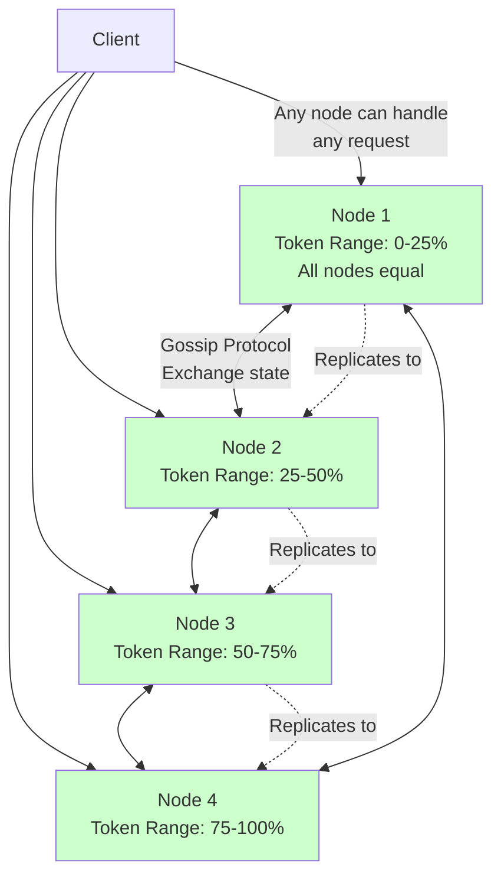
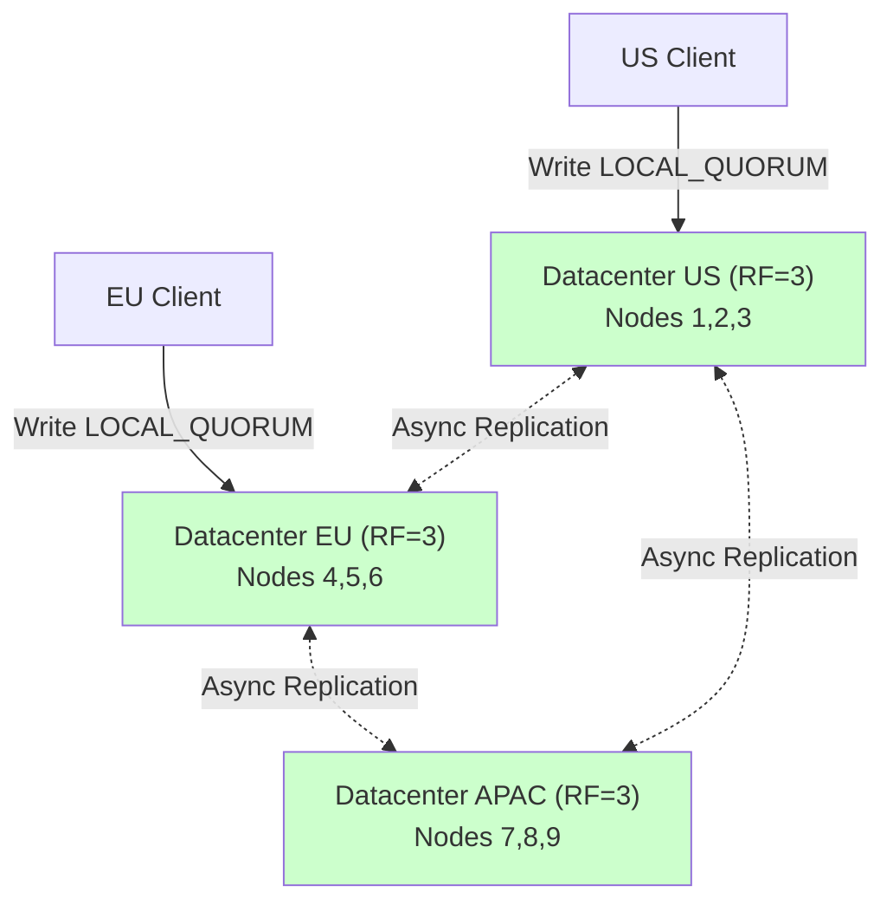
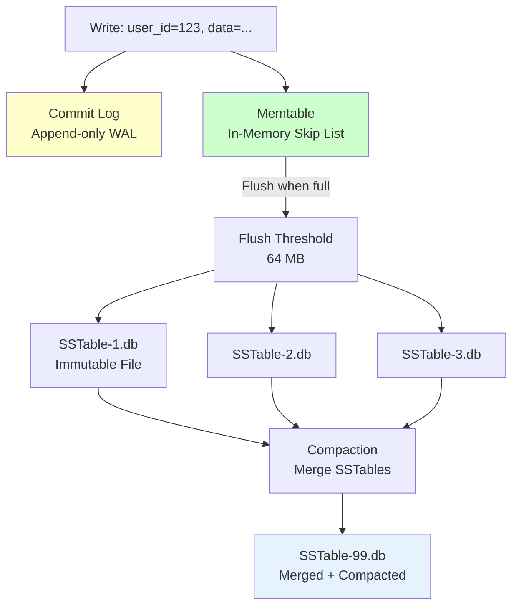

# 04. Cassandra: The Masterless Wide-Column Store

## 1. Introduction

Apache Cassandra is a **masterless, distributed wide-column store** designed for one purpose: **handling massive write throughput** while providing linear scalability. Unlike PostgreSQL (which has a single master bottleneck) or MongoDB (which routes writes through primary nodes), Cassandra treats all nodes equally. Every node can accept reads and writes for any data, and the system coordinates automatically.

This architecture emerged from real-world pain at Facebook and Amazon. Facebook built Cassandra to power their inbox search feature, where billions of messages needed to be indexed and searchable in real-time. The key insight: when you're writing millions of messages per second, a single master becomes an insurmountable bottleneck. Cassandra borrowed Amazon Dynamo's **consistent hashing** and **gossip protocol** (for masterless coordination) and combined it with Google Bigtable's **LSM tree storage** (for fast writes).

**What Makes Cassandra Different**: Cassandra is optimized for **write-heavy workloads**. While PostgreSQL might handle 10K-50K writes per second, a single Cassandra node can handle **100K-500K writes per second**. A 10-node cluster can absorb **millions of writes per second**. The trade-off? You give up ACID transactions, complex queries (no JOINs), and strong consistency by default (eventual consistency unless you configure otherwise).

**Industry Adoption**: Cassandra powers Netflix's viewing history (2+ trillion writes per day), Apple's 75,000-node cluster (storing messages for 1+ billion devices), and Uber's trip history. It's chosen when you need **99.999% availability**, **write scalability**, and **no single point of failure**.

**The CAP Theorem Reality**: Cassandra is **AP** (Available + Partition-tolerant) by default, but you can tune it to be **CP** (Consistent + Partition-tolerant) by using quorum reads/writes. This **tunable consistency** is Cassandra's killer feature.

---

## 2. Core Architecture

Cassandra uses a **ring topology** with **consistent hashing**. There's no master, no coordinator—every node is identical.



### Consistent Hashing

When you write a row with partition key `user_id = 12345`, Cassandra hashes it:
```
hash = MD5(12345) = 0xA1B2C3D4...
token = hash % 2^127
```

The node whose token range contains this hash **owns** the data. But Cassandra also replicates it to N-1 additional nodes (configurable via **replication factor**, typically RF=3).

**Example**: 4-node cluster, RF=3, partition key hashes to token `0x30000000`:
- **Primary node**: Node 2 (owns token range 0x25000000-0x4FFFFFFF)
- **Replica 1**: Node 3 (next clockwise)
- **Replica 2**: Node 4 (next clockwise after Node 3)

### Gossip Protocol

Cassandra nodes don't have a central coordinator. They use **gossip** to discover each other, detect failures, and propagate metadata.

**How Gossip Works**:
1. Every second, each node picks 1-3 random nodes and sends its **state** (list of known nodes, their tokens, their health status)
2. Receiving nodes merge this state with their own
3. Within a few seconds, every node knows the state of every other node (eventually consistent metadata)

**Failure Detection**: If Node A hasn't heard from Node B via gossip for `phi_convict_threshold` cycles (default: ~10 seconds), it marks Node B as **down**. No voting, no consensus—just independent local decisions.

---

## 3. How It Works: Tunable Consistency and LSM Trees

### A. Tunable Consistency

Cassandra's consistency is **tunable per query**. You choose between strong consistency and availability:

**Consistency Levels**:
- **ONE**: Write succeeds when 1 replica acknowledges (fast, risky)
- **QUORUM**: Write succeeds when `(RF/2) + 1` replicas acknowledge (RF=3 → 2 replicas)
- **ALL**: Write succeeds when all replicas acknowledge (slow, maximum consistency)

**Read/Write Quorum**: If you write with `QUORUM` and read with `QUORUM`, you're guaranteed **strong consistency** (CAP CP). If one replica has stale data, the quorum read will read the latest version from the other replicas.

**The Math**:
```
Write at QUORUM (2 replicas) + Read at QUORUM (2 replicas)
= At least 1 replica overlaps → you always read the latest write
```

**Hinted Handoff**: If a replica is down during a write, the coordinator node stores a **hint** (a queued write). When the down replica comes back online, the hint is replayed.

### B. Wide-Column Data Model

Cassandra is not a traditional relational database. It's based on **partition keys** and **clustering columns**.

**Table Structure**:
```sql
CREATE TABLE user_events (
    user_id UUID,           -- Partition key
    event_time TIMESTAMP,   -- Clustering column (sorts within partition)
    event_type TEXT,
    data TEXT,
    PRIMARY KEY (user_id, event_time)
);
```

**On Disk**: All rows with the same `user_id` are stored **together** (sorted by `event_time`). This makes range queries within a partition extremely fast:
```sql
SELECT * FROM user_events WHERE user_id = ? AND event_time > '2024-01-01';
-- Reads contiguous blocks from disk (LSM tree)
```

**Wide Rows**: A single partition can have millions of clustering columns. Example: A user's entire event history (10 years = 100M events) stored in one partition.

### C. Global Distribution

**Multi-Datacenter Replication**: Cassandra supports replication across datacenters out-of-the-box.



**NetworkTopologyStrategy**:
```cql
CREATE KEYSPACE my_keyspace WITH REPLICATION = {
  'class': 'NetworkTopologyStrategy',
  'DC1': 3,  -- 3 replicas in US
  'DC2': 3,  -- 3 replicas in EU
  'DC3': 2   -- 2 replicas in APAC
};
```

**LOCAL_QUORUM**: Write succeeds when quorum of replicas **in the local datacenter** acknowledge. Asynchronous replication to remote datacenters happens in the background. This provides low latency (no cross-datacenter synchronous wait) with eventual global consistency.

---

## 4. Deep Dive: LSM Tree On-Disk Storage

### A. LSM Tree Overview

Cassandra uses **Log-Structured Merge (LSM) trees** for storage. Unlike B-trees (PostgreSQL, MongoDB), LSM trees optimize for **sequential writes** (perfect for spinning disks and SSDs).

**Write Path**:
1. Write goes to **Commit Log** (append-only WAL on disk, for crash recovery)
2. Write goes to **Memtable** (in-memory sorted structure, like a skip list)
3. When Memtable reaches threshold (64-256 MB), it's flushed to disk as an **SSTable** (Sorted String Table, immutable file)
4. Background **compaction** merges SSTables to reclaim space from deleted/updated rows

**Read Path**:
1. Check **Memtable** (in-memory)
2. Check **Bloom Filters** for each SSTable (probabilistic data structure: "this SSTable definitely doesn't have this key" or "might have it")
3. If Bloom filter says "maybe", read the SSTable's **index** (sparse index mapping keys to file offsets)
4. Read data from SSTable file



### B. On-Disk File Structure

**Cassandra Data Directory** (`/var/lib/cassandra/data/`):
```
/var/lib/cassandra/
├── data/
│   └── my_keyspace/
│       └── user_events-abc123/
│           ├── mc-1-big-Data.db          # SSTable data file
│           ├── mc-1-big-Index.db         # Partition index (key → offset in Data.db)
│           ├── mc-1-big-Filter.db        # Bloom filter
│           ├── mc-1-big-Summary.db       # Sparse index summary
│           ├── mc-1-big-Statistics.db    # SSTable metadata (min/max timestamps, size)
│           ├── mc-1-big-TOC.txt          # Table of Contents (all components)
│           └── ...
├── commitlog/
│   ├── CommitLog-6-1234567890.log  # Append-only log (recycled after flush)
│   └── ...
└── hints/
    └── <node-uuid>.hints  # Hinted handoff queue
```

**SSTable Components**:
- **Data.db**: Actual rows (compressed, partitions sorted by partition key, rows within partition sorted by clustering key)
- **Index.db**: Maps partition keys to byte offsets in Data.db (B-tree-like structure)
- **Filter.db**: Bloom filter (bit array, ~1% false positive rate)
- **Summary.db**: Sparse index of Index.db (for faster lookups, typically 1 entry per 128 rows)

**Row Encoding in Data.db**:
```
[Partition Key: hash + bytes]
[Clustering Key 1] [Timestamp] [Column Values]
[Clustering Key 2] [Timestamp] [Column Values]
...
```

### C. Compaction Strategies

SSTables are **immutable**. Updates and deletes don't modify existing SSTables—they create new SSTables with **tombstones** (deletion markers). Over time, you accumulate dozens of SSTables, and reads must check all of them.

**Compaction** merges SSTables:
- **Size-Tiered Compaction (STCS)**: Merge SSTables of similar size. Good for write-heavy workloads. Disk space overhead: 2× (during compaction).
- **Leveled Compaction (LCS)**: Organize SSTables into levels (L0, L1, L2...). Each level is 10× larger than the previous. Good for read-heavy workloads. Lower disk overhead (~10% extra).
- **Time-Window Compaction (TWCS)**: For time-series data. Compact SSTables within time windows (e.g., 1-day windows). Old windows are never compacted again. Perfect for data with TTLs.

**Bloom Filter Mechanics**:
```
hash1 = murmur3(key) % filter_size
hash2 = murmur3(hash1) % filter_size
...
Set bits: filter[hash1] = filter[hash2] = ... = 1

Query: Check bits filter[hash1], filter[hash2], ...
If any bit is 0 → Definitely NOT in SSTable
If all bits are 1 → Might be in SSTable (check Index.db)
```

**Disk I/O per Read** (worst case):
- Check 5 SSTables → 5 Bloom filter checks (in-memory, fast)
- 1 Bloom filter says "maybe" → Read Index.db (~1 random read, SSD: 0.1ms)
- Read Data.db (~1 random read, 0.1ms)
- **Total**: ~1-2ms on SSD

---

## 5. End-to-End Walkthrough: Life of a Write

Let's trace: `INSERT INTO user_events (user_id, event_time, event_type) VALUES (uuid(), now(), 'login');`

### Step 1: Client to Coordinator

Client connects to **any Cassandra node** (let's say Node 2). Node 2 becomes the **coordinator** for this request.

### Step 2: Partition Key Hashing

Coordinator hashes the partition key `user_id`:
```
token = MD5(user_id) % 2^127 = 0x45000000
```

Lookup in the ring: token `0x45000000` maps to Node 3 (primary), with replicas on Node 4 and Node 1 (clockwise).

### Step 3: Write to Replicas

Coordinator sends the write to Nodes 3, 4, and 1 **in parallel**.

**Each replica**:
1. Appends to **Commit Log** (fsync to disk, ~1ms on spinning disk, ~0.1ms on SSD)
2. Writes to **Memtable** (in-memory, ~1 microsecond)
3. Returns acknowledgment to coordinator

### Step 4: Consistency Level Check

Client requested `QUORUM` (2 out of 3 replicas). Coordinator waits for 2 acknowledgments.

**Scenario A**: Node 3 and Node 4 respond in 2ms → Coordinator returns success to client (2ms write latency)

**Scenario B**: Node 4 is down. Coordinator waits for Node 3 and Node 1. If Node 1 responds within timeout, success. Otherwise, the write fails (unavailable).

### Step 5: Hinted Handoff (if Node 4 is down)

If Node 4 is down, Node 2 (coordinator) stores a **hint** in its hints directory: "Replay this write to Node 4 when it comes back."

When Node 4 recovers, Node 2 streams hints to it. Node 4 catches up.

---

## 6. Failure Scenarios: The Senior View

### Scenario A: The Tombstone Explosion (Deleted But Not Gone)

**Symptom**: Queries become slower over time despite the dataset not growing. Disk usage increases even though you're deleting rows.

**The Mechanism**:

You have a table with 100 million rows. You delete 50 million of them:
```sql
DELETE FROM user_events WHERE user_id = ?;
```

Cassandra doesn't delete the rows immediately (SSTables are immutable). Instead, it writes **tombstones** to new SSTables:
```
[Partition Key: user_id] [Tombstone Marker: deleted at timestamp T]
```

Now queries must scan SSTables, read tombstones, and skip them. If you have 10 SSTables, and 5 of them contain tombstones for a partition, a single partition read requires:
- 10 Bloom filter checks
- 5 SSTable reads (to read the tombstones and realize the data is deleted)

**Compaction Delay**: Tombstones aren't removed until compaction runs. If compaction is slow (or disabled), tombstones accumulate.

**The Fix**:

**Option 1**: Tune compaction to run more frequently:
```
ALTER TABLE user_events WITH compaction = {'class': 'LeveledCompactionStrategy'};
```
LCS compacts more aggressively than STCS.

**Option 2**: Set `gc_grace_seconds` (default: 10 days) lower if you **don't** do repairs:
```
ALTER TABLE user_events WITH gc_grace_seconds = 86400;  -- 1 day
```
After `gc_grace_seconds`, tombstones are eligible for permanent removal during compaction.

**Option 3**: For time-series data, use **TTL** (Time To Live) and TWCS compaction:
```sql
INSERT INTO metrics (key, time, value) VALUES (?, ?, ?) USING TTL 604800;  -- 7 days
```
Rows automatically expire. TWCS compaction drops entire SSTables after the time window expires (no tombstone overhead).

---

### Scenario B: The Read Repair Storm

**Symptom**: After a node rejoins the cluster (was down for 1 hour), **all queries** become slow (10× latency spike).

**The Mechanism**:

You have RF=3. Node A was down for 1 hour. During that hour, 10 million writes occurred. Nodes B and C have the latest data; Node A is stale.

When Node A comes back, clients start issuing reads:
```sql
SELECT * FROM users WHERE user_id = ?;
```

**With `QUORUM` read**: Coordinator asks Nodes A, B, and C. It receives:
- Node A: Stale data (version 100)
- Nodes B, C: Latest data (version 200)

Coordinator detects the mismatch and triggers **read repair**:
1. Coordinator sends the latest version (200) to Node A
2. Node A writes it to its Commit Log and Memtable
3. Coordinator returns the data to the client

But this happens for **every query** touching stale data on Node A. With 10 million stale rows, you get 10 million read repairs → event loop saturated → latency spike.

**The Fix**:

**Option 1**: Use **nodetool repair** before putting the node back in rotation:
```bash
nodetool repair -pr  # Repair only the primary range for this node
```
This streams data from replicas to catch up Node A **before** serving queries.

**Option 2**: Use **hinted handoff** (automatic). If hints were stored, they're replayed when Node A comes back, minimizing staleness.

**Option 3**: Increase `read_repair_chance` to proactively repair even when consistency level doesn't require it (e.g., `read_repair_chance = 0.1` → 10% of reads trigger background repair).

---

### Scenario C: The Unbounded Wide Row

**Symptom**: Queries fail with `ReadTimeoutException`. CPU usage spikes. Compaction never completes.

**The Mechanism**:

You have a table:
```sql
CREATE TABLE user_sessions (
    user_id UUID PRIMARY KEY,
    session_data MAP<TIMESTAMP, TEXT>
);
```

One user has been active for 10 years. Their `session_data` map has **100 million entries** (all stored in a single partition). The partition size on disk: **10 GB**.

**Why This Breaks**:
1. **Reads**: To read this partition, Cassandra must load **10 GB into memory** (the entire partition). Even with streaming, this takes minutes.
2. **Compaction**: Merging SSTables containing this partition requires holding 10 GB in memory. Compaction fails or triggers OOM.
3. **Tombstones**: If you delete entries from the map, you get tombstones. With 100M tombstones, queries time out scanning them.

**The Fix**:

**Option 1**: Redesign the partition key:
```sql
CREATE TABLE user_sessions (
    user_id UUID,
    year INT,  -- Add bucketing
    session_data MAP<TIMESTAMP, TEXT>,
    PRIMARY KEY ((user_id, year), timestamp)
);
```
Now each year is a separate partition (max size: ~1 GB).

**Option 2**: Set limits:
```
max_partition_size_mb = 1024  # Warn if partition > 1 GB
```

---

## 7. Performance Tuning

**Read/Write Consistency**: Use `LOCAL_QUORUM` for multi-DC deployments (low latency, quorum within datacenter).

**Compaction**: Choose strategy based on workload:
- Write-heavy: STCS (fast writes, more disk space)
- Read-heavy: LCS (slower writes, better read performance)
- Time-series: TWCS (automatic expiration)

**JVM Heap**: Cassandra runs on JVM. Set heap to 8-16 GB (not more—large heaps cause GC pauses):
```
-Xms8G -Xmx8G
```

**Concurrent Reads/Writes**: Increase thread pools for high concurrency:
```
concurrent_reads: 32   # Default: 32
concurrent_writes: 128 # Default: 32
```

---

## 8. Constraints and Limitations

**No JOINs**: Cassandra has no JOINs. Denormalize data.

**Partition Size Limit**: Recommended max: **100 MB per partition**. Hard limit: **2 GB**.

**Secondary Indexes**: Avoid. They're implemented as hidden tables and perform poorly at scale. Use materialized views or manual denormalization.

**No ACID Transactions**: Lightweight transactions (LWT) exist but are slow (~10×) and should be used sparingly.

---

## 9. When to Use?

| Use Case | Cassandra | PostgreSQL | MongoDB | Redis | DynamoDB |
| :--- | :---: | :---: | :---: | :---: | :---: |
| **High Write Throughput (>100K/sec)** | ✅ | ❌ | ⚠️ | ✅ | ✅ |
| **Linear Scalability** | ✅ | ❌ | ✅ | ⚠️ | ✅ |
| **Multi-DC Replication** | ✅ | ⚠️ | ✅ | ⚠️ | ✅ |
| **ACID Transactions** | ❌ | ✅ | ⚠️ | ❌ | ⚠️ |
| **Complex Queries** | ❌ | ✅ | ⚠️ | ❌ | ❌ |

Choose Cassandra for write-heavy workloads, when you need 99.999% availability, or when linear scalability is critical. Avoid Cassandra for complex queries, ACID transactions, or small datasets (<1 TB).

---

## 10. Production Checklist

1. [ ] **Replication Factor**: Set RF ≥ 3 for fault tolerance
2. [ ] **Consistency Level**: Use `LOCAL_QUORUM` for multi-DC deployments
3. [ ] **Compaction Strategy**: Choose STCS/LCS/TWCS based on workload
4. [ ] **JVM Tuning**: Set heap to 8-16 GB, enable G1GC
5. [ ] **Monitoring**: Track read/write latency, compaction backlog, tombstone warnings
6. [ ] **Repairs**: Run `nodetool repair` weekly (ensures replicas stay in sync)
7. [ ] **Partition Size**: Monitor partition sizes (warn at 100 MB, alert at 1 GB)
8. [ ] **Backups**: Use snapshots (`nodetool snapshot`) + incremental backups
9. [ ] **Security**: Enable authentication, use TLS for inter-node communication
10. [ ] **Token Allocation**: Use `num_tokens = 256` (vnodes) for even data distribution
