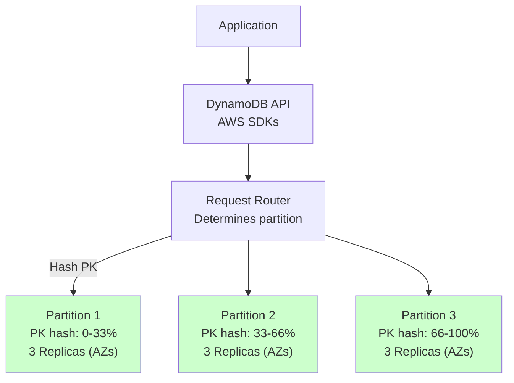
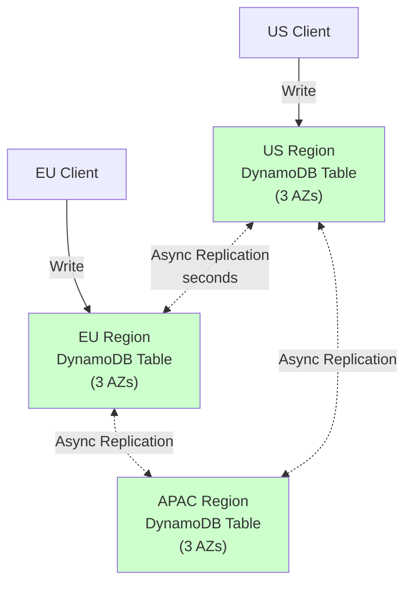

# 05. DynamoDB: AWS's Managed Serverless NoSQL

## 1. Introduction

Amazon DynamoDB is a **fully managed, serverless NoSQL database** that abstracts away all operational complexity. Unlike PostgreSQL (where you manage servers, backups, replication) or Cassandra (where you tune compaction, manage nodes), DynamoDB handles **everything automatically**: provisioning, scaling, replication, backups, and failover.

This operational simplicity comes at a cost: **vendor lock-in** (AWS-only) and **limited query flexibility** (no JOINs, no complex aggregations). But when you need a database that can scale from zero to millions of requests per second **without touching a server**, DynamoDB is unmatched.

**What Makes DynamoDB Different**: DynamoDB is built on the principles from Amazon's **Dynamo paper** (2007)—the same paper that inspired Cassandra. But unlike open-source Cassandra, DynamoDB is a black box. AWS manages the entire stack, and you interact via APIs. You don't SSH into nodes, you don't tune compaction, you don't manually add replicas. You define your data model (partition key + optional sort key) and let AWS handle the rest.

**Industry Adoption**: DynamoDB powers Amazon.com's shopping cart, Lyft's ride matching, Snapchat's user profiles, and countless AWS-native applications. It's chosen when **operational simplicity** and **predictable low latency** (<10ms) are more important than cost optimization or avoiding vendor lock-in.

**The Trade-off**: DynamoDB is expensive compared to self-managed databases. Reading 1 million items per day costs ~$0.25/month with on-demand pricing, but at scale (billions of reads/writes per day), costs can reach thousands of dollars monthly. You're paying for convenience.

---

## 2. Core Architecture

DynamoDB's architecture is **fully managed**—you never see the underlying infrastructure. But understanding the logical architecture helps optimize data modeling.



### Partitions and Replication

**Partition**: The basic unit of storage. Each partition stores up to **10 GB** of data and handles up to **3,000 read capacity units (RCUs)** or **1,000 write capacity units (WCUs)**.

When you write an item with `partition_key = "user123"`, DynamoDB:
1. Hashes the partition key: `hash("user123") = 0x4F2A1B...`
2. Maps the hash to a partition (consistent hashing, similar to Cassandra)
3. Writes to **3 replicas** of that partition (spread across 3 Availability Zones in the same region for durability)

**Replication**: DynamoDB uses **Multi-Paxos** (a consensus algorithm, see `Coordination/01_Raft_Consensus_Algorithm.md` for consensus basics) for strong consistency within a partition. All writes go to a **leader replica**. The leader replicates to follower replicas. A write is confirmed only after a **quorum** (2 out of 3 replicas) acknowledges it.

**Consistency Levels**:
- **Eventually Consistent Reads** (default): Read from any replica (low latency, ~1-2ms)
- **Strongly Consistent Reads**: Read from the leader replica (guaranteed latest data, ~3-5ms)

---

## 3. How It Works: Partition Keys, GSI/LSI, and Adaptive Capacity

### A. Partition Key and Sort Key

DynamoDB's data model is built on **partition key** (PK) and optional **sort key** (SK):

```javascript
{
  "PK": "USER#12345",       // Partition key (determines partition)
  "SK": "PROFILE",          // Sort key (sorts items within partition)
  "name": "Alice",
  "email": "alice@example.com"
}
```

**Partition Key** determines **where** the data is stored (which partition). Items with the same PK are stored together, sorted by SK.

**Query Patterns**:
- `GetItem`: Single item lookup (`PK + SK`)
- `Query`: Range query within a partition (`PK` + SK range like `SK BETWEEN "2024-01-01" AND "2024-12-31"`)
- `Scan`: Full table scan (expensive, avoid in production)

**Why This Matters**: DynamoDB is **not relational**. You can't JOIN tables. You must **denormalize** data and design your PK/SK to match your query patterns.

### B. Global Secondary Indexes (GSI) and Local Secondary Indexes (LSI)

**Problem**: You have a `Users` table with `PK = user_id`. But you also need to query by `email`. Without an index, you'd have to `Scan` the entire table.

**GSI (Global Secondary Index)**: Creates an alternate view of the table with a different partition key:
```javascript
// Base table: PK = user_id
// GSI: PK = email, SK = user_id
```

Now you can query by email efficiently:
```javascript
db.query({
  IndexName: "email-index",
  KeyConditionExpression: "email = :email",
  ExpressionAttributeValues: { ":email": "alice@example.com" }
})
```

**GSI vs LSI**:
- **GSI**: Different partition key from the base table. Can be created/deleted anytime. Eventually consistent with base table (~1 second lag).
- **LSI**: Same partition key as base table, different sort key. Must be created at table creation time. Strongly consistent (shares partitions with base table).

### C. On-Disk Storage Structure

DynamoDB's internal storage is **proprietary** (AWS doesn't publish details), but based on the Dynamo paper and AWS patents, it likely uses:

**Storage Layer** (inferred):
- **B-trees** for partition storage (similar to other key-value stores)
- **SSDs** for all storage (DynamoDB Standard) or **HDDs + SSDs** (DynamoDB Standard-IA for infrequent access)
- **Compression**: Items are compressed using a proprietary algorithm (AWS claims 70-90% compression for typical workloads)

**Partition File Layout** (conceptual):
```
Partition-1234567/
├── Data File (B-tree of PK+SK → Item)
├── Index File (sparse index for faster lookups)
└── Metadata (partition size, throughput stats)
```

**Write Path** (based on Dynamo paper):
1. Client writes to **leader replica** of the partition
2. Leader appends to **write-ahead log** (WAL, similar to Cassandra's commit log)
3. Leader replicates to 2 follower replicas (Multi-Paxos quorum)
4. Leader waits for quorum (2/3) acknowledgment
5. Leader responds to client (write confirmed)

**Read Path**:
- **Eventually consistent**: Read from any replica (might be stale by ~1 second)
- **Strongly consistent**: Read from leader replica (guaranteed latest)

### D. Global Tables (Multi-Region Replication)

**Global Tables** replicate data across multiple AWS regions (e.g., us-east-1, eu-west-1, ap-southeast-1) with **active-active** replication.



**Conflict Resolution**: DynamoDB uses **last-write-wins (LWW)** based on timestamps. If a user updates their profile in US and EU simultaneously, the update with the later timestamp wins. This is **eventually consistent** across regions (typically <1 second replication lag, but can be minutes during network issues).

---

## 4. Deep Dive: Adaptive Capacity and Hot Partitions

### The Hot Partition Problem

**Problem**: You have a table with 10 partitions. One partition key (`celebrity_user_id = "famous_person"`) receives 90% of all reads/writes (hot partition). DynamoDB allocates capacity **per partition** (3000 RCUs per partition), so this hot partition hits its limit while other partitions sit idle.

**Result**: `ProvisionedThroughputExceededException` (throttling), even though your table-level capacity is under-provisioned.

**Adaptive Capacity**: DynamoDB automatically **reallocates unused capacity** from cold partitions to hot partitions. If Partition 1 is using 100 RCUs and Partition 2 is using 5000 RCUs (over its 3000 RCU limit), DynamoDB borrows capacity from Partition 1.

**Limitations**: Adaptive capacity helps, but it's not magic. If you consistently hammer one partition, you'll still get throttled. The fix: **design better partition keys** to distribute load evenly (e.g., shard by `user_id` instead of using a single celebrity user).

---

## 5. End-to-End Walkthrough: Life of a Write

Let's trace: `PutItem(PK="USER#123", SK="PROFILE", data=...)`

### Step 1: API Gateway

Client sends request to **DynamoDB API** (via AWS SDK). The API validates the request (schema, permissions via IAM).

### Step 2: Request Routing

DynamoDB's **request router** hashes the partition key:
```
partition_id = hash("USER#123") % num_partitions
```

Let's say `partition_id = 42`. The router forwards the request to **Partition 42's leader replica** (in Availability Zone A).

### Step 3: Leader Writes

The leader replica:
1. Appends to the **write-ahead log (WAL)**
2. Updates the in-memory **B-tree** with the new item
3. Sends the write to **2 follower replicas** (in AZ-B and AZ-C)

### Step 4: Quorum Acknowledgment

Followers apply the write and send ACK to the leader. Once the leader receives **2 ACKs** (quorum), it confirms the write to the client.

**Total Latency**: ~5-10ms (single-digit milliseconds, AWS SLA: <10ms for 99.9% of requests)

### Step 5: GSI Update (if applicable)

If you have a GSI on `email`, DynamoDB **asynchronously** writes to the GSI (separate partitions). This adds ~100ms-1 second lag for GSI updates.

---

## 6. Failure Scenarios: The Senior View

### Scenario A: The Hot Partition Throttle

**Symptom**: `ProvisionedThroughputExceededException` on 10% of writes, even though table-level capacity shows 50% utilization.

**The Mechanism**: You've modeled a `Leaderboard` table with `PK = game_id, SK = score`. One game (`game_id = "fortnite"`) has 10 million players. All writes go to one partition. That partition's capacity: **1000 WCUs**. Your app writes **5000 WCUs** to this partition. Throttling.

**The Fix**:
- **Option 1**: Use **write sharding** (add a random suffix to PK, e.g., `game_id = "fortnite#0"` through `game_id = "fortnite#9"`). Spread writes across 10 partitions. Queries must aggregate results.
- **Option 2**: Use **on-demand pricing** (pay per request, no capacity planning). DynamoDB auto-scales to handle any throughput.

---

### Scenario B: The GSI Backfill Disaster

**Symptom**: You add a new GSI. DynamoDB starts backfilling data. The backfill takes 3 days, and during this time, the GSI is unavailable (`ResourceInUseException`).

**The Mechanism**: A GSI backfill reads every item from the base table and writes to the GSI. For a 1 TB table with 10 billion items, this consumes **massive** read capacity (throttling your application) and takes days.

**The Fix**:
- **Option 1**: Provision extra RCUs/WCUs during backfill (expensive).
- **Option 2**: Design GSIs **upfront** (before loading data).
- **Option 3**: Use a **blue-green deployment**: create a new table with GSIs, migrate data, swap tables.

---

## 7. Performance Tuning

**On-Demand vs Provisioned**:
- **On-Demand**: Pay per request. No capacity planning. Auto-scales instantly. ~$1.25 per million writes. Good for unpredictable workloads.
- **Provisioned**: Reserve capacity (RCUs/WCUs). Cheaper at scale (~$0.65 per million writes with reserved capacity). Requires forecasting.

**DynamoDB Accelerator (DAX)**: In-memory cache (sub-millisecond latency). Use for read-heavy workloads:
```
Client → DAX (cache hit: 0.5ms) → DynamoDB (cache miss: 5ms)
```

**Batch Operations**: Instead of 100 `PutItem` calls (100× network round-trips), use `BatchWriteItem` (1 round-trip, up to 25 items).

---

## 8. Constraints and Limitations

**Item Size**: Max 400 KB. For larger data, store in S3 and keep a pointer in DynamoDB.

**Query Flexibility**: No JOINs, no aggregations (like `COUNT`, `SUM`). Must denormalize and precompute.

**Indexes**: Max 20 GSIs per table. Each GSI doubles storage costs (it's a full copy of the data).

**Transactions**: DynamoDB supports ACID transactions (`TransactWriteItems`) but with 2× latency and cost.

---

## 9. When to Use?

| Use Case | DynamoDB | Cassandra | MongoDB | PostgreSQL | Redis |
| :--- | :---: | :---: | :---: | :---: | :---: |
| **Serverless/Managed** | ✅ | ❌ | ⚠️ (Atlas) | ⚠️ (RDS) | ⚠️ |
| **Multi-Region Active-Active** | ✅ | ✅ | ✅ | ❌ | ⚠️ |
| **Predictable Low Latency (<10ms)** | ✅ | ⚠️ | ❌ | ❌ | ✅ |
| **Complex Queries** | ❌ | ❌ | ⚠️ | ✅ | ❌ |
| **Cost-Effective at Scale** | ❌ | ✅ | ✅ | ✅ | ✅ |

Choose DynamoDB when you want zero operational overhead, predictable single-digit latency, and seamless scaling. Avoid DynamoDB when you need complex queries, cost optimization at massive scale, or want to avoid vendor lock-in.

---

## 10. Production Checklist

1. [ ] **Partition Key Design**: Ensure even distribution (avoid hot partitions)
2. [ ] **GSI Planning**: Design GSIs upfront to avoid backfill delays
3. [ ] **On-Demand vs Provisioned**: Choose based on workload predictability
4. [ ] **DAX for Reads**: Deploy DAX cluster for read-heavy workloads
5. [ ] **Backup Strategy**: Enable Point-in-Time Recovery (PITR) for continuous backups
6. [ ] **Global Tables**: For multi-region deployments, enable global tables
7. [ ] **Monitoring**: Track consumed capacity, throttling events, hot partitions (CloudWatch)
8. [ ] **Cost Optimization**: Use reserved capacity for predictable workloads, IA class for infrequent access
9. [ ] **Encryption**: Enable at-rest encryption (AWS KMS), in-transit encryption (TLS)
10. [ ] **IAM Policies**: Fine-grained access control (deny `Scan`, allow specific queries only)
